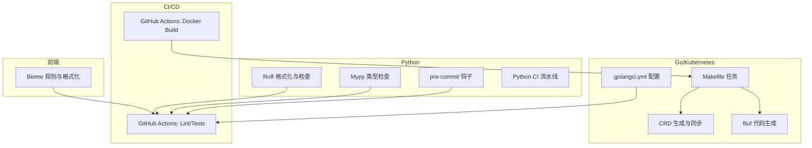
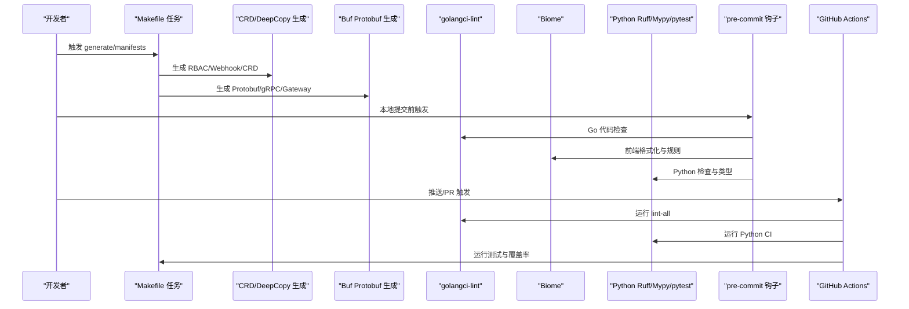
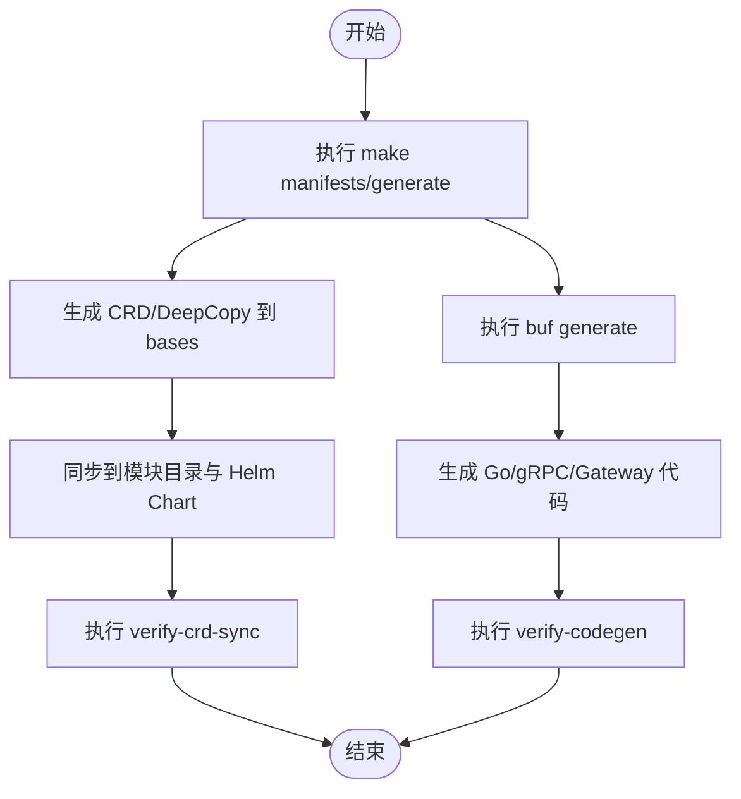
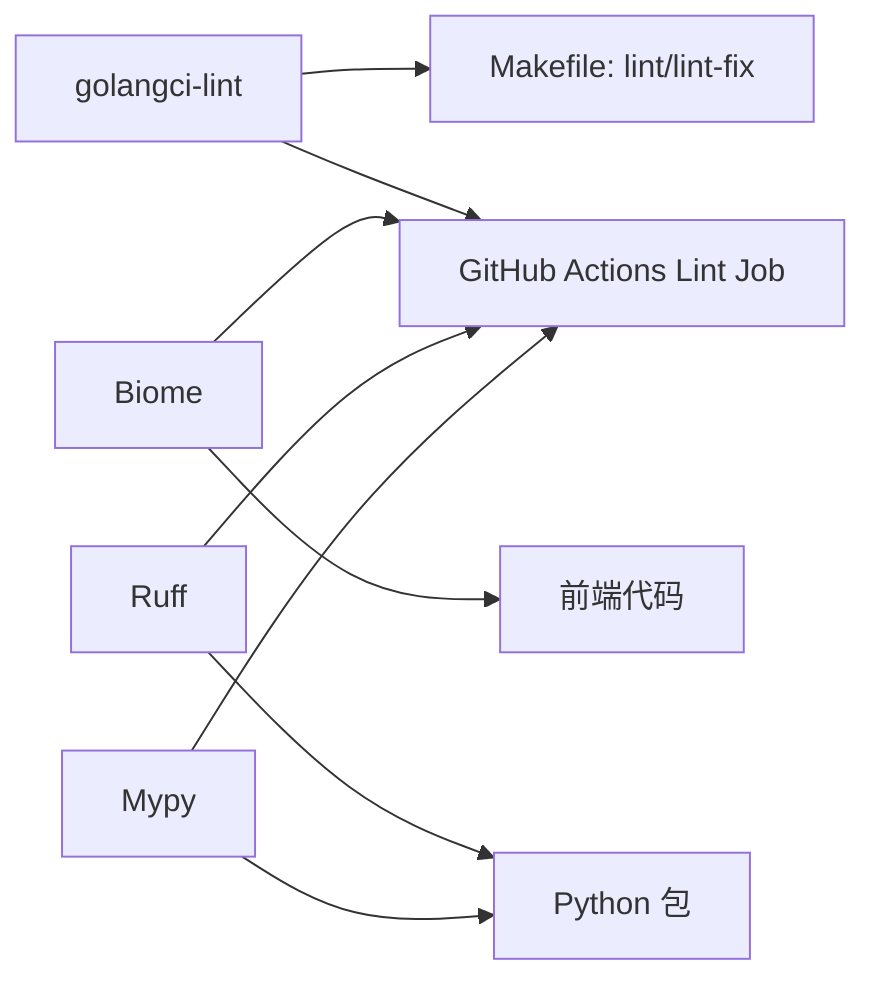
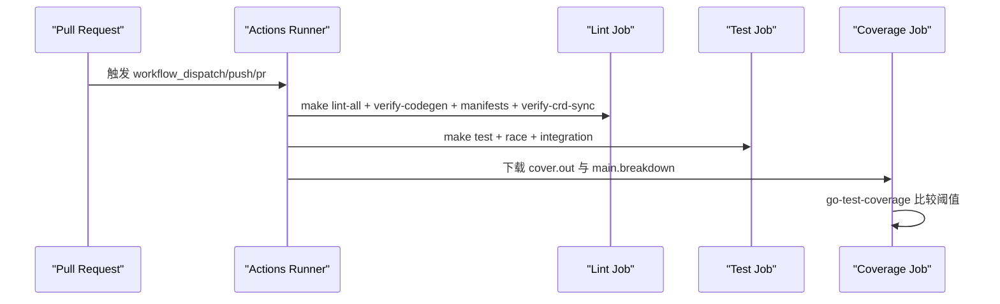
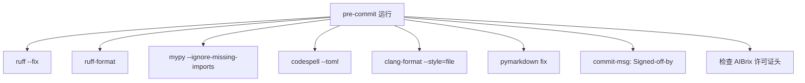
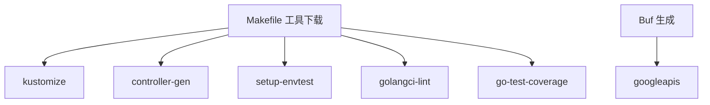

# 开发工具链

<cite>
**本文引用的文件**
- [.golangci.yml](file://.golangci.yml)
- [Makefile](file://Makefile)
- [.github/workflows/lint-and-tests.yml](file://.github/workflows/lint-and-tests.yml)
- [.github/workflows/docker-build-images.yml](file://.github/workflows/docker-build-images.yml)
- [apps/console/api/buf.gen.yaml](file://apps/console/api/buf.gen.yaml)
- [apps/console/api/buf.yaml](file://apps/console/api/buf.yaml)
- [apps/chat/web/biome.json](file://apps/chat/web/biome.json)
- [apps/chat/api/pyproject.toml](file://apps/chat/api/pyproject.toml)
- [python/aibrix/pyproject.toml](file://python/aibrix/pyproject.toml)
- [python/aibrix_kvcache/pyproject.toml](file://python/aibrix_kvcache/pyproject.toml)
- [python/aibrix_kvcache/.pre-commit-config.yaml](file://python/aibrix_kvcache/.pre-commit-config.yaml)
</cite>

## 目录
1. [简介](#简介)
2. [项目结构](#项目结构)
3. [核心组件](#核心组件)
4. [架构总览](#架构总览)
5. [详细组件分析](#详细组件分析)
6. [依赖分析](#依赖分析)
7. [性能考虑](#性能考虑)
8. [故障排查指南](#故障排查指南)
9. [结论](#结论)
10. [附录](#附录)

## 简介
本文件面向AIBrix开发工具链，系统性梳理代码生成、静态分析、CI/CD流水线、代码格式化与质量保证、开发效率工具及维护升级策略。内容覆盖Go/Kubernetes CRD/Protobuf代码生成、golangci-lint、ESLint/Biome、Python Ruff/Mypy/pytest、pre-commit钩子、Makefile任务编排、GitHub Actions流水线、以及IDE与工作流优化建议。

## 项目结构
仓库采用多语言混合工程：Go后端配合Kubernetes CRD与控制器生成；Console前端通过Buf生成Protobuf与gRPC/Gateway代码；Chat前端采用Biome进行格式化与规则校验；Python子包提供运行时与工具脚本，并在aibrix_kvcache中集成pre-commit与cibuildwheel。

图示来源
- [Makefile:110-120](file://Makefile#L110-L120)
- [.golangci.yml:1-45](file://.golangci.yml#L1-45)
- [apps/console/api/buf.gen.yaml:1-12](file://apps/console/api/buf.gen.yaml#L1-L12)
- [apps/chat/web/biome.json:1-55](file://apps/chat/web/biome.json#L1-L55)
- [python/aibrix/pyproject.toml:96-107](file://python/aibrix/pyproject.toml#L96-L107)
- [.github/workflows/lint-and-tests.yml:1-174](file://.github/workflows/lint-and-tests.yml#L1-L174)
- [.github/workflows/docker-build-images.yml:1-21](file://.github/workflows/docker-build-images.yml#L1-L21)

章节来源
- [Makefile:110-120](file://Makefile#L110-L120)
- [.golangci.yml:1-45](file://.golangci.yml#L1-45)
- [apps/console/api/buf.gen.yaml:1-12](file://apps/console/api/buf.gen.yaml#L1-L12)
- [apps/console/api/buf.yaml:1-6](file://apps/console/api/buf.yaml#L1-L6)
- [apps/chat/web/biome.json:1-55](file://apps/chat/web/biome.json#L1-L55)
- [python/aibrix/pyproject.toml:96-107](file://python/aibrix/pyproject.toml#L96-L107)
- [python/aibrix_kvcache/pyproject.toml:41-67](file://python/aibrix_kvcache/pyproject.toml#L41-L67)
- [.github/workflows/lint-and-tests.yml:1-174](file://.github/workflows/lint-and-tests.yml#L1-L174)
- [.github/workflows/docker-build-images.yml:1-21](file://.github/workflows/docker-build-images.yml#L1-L21)

## 核心组件
- 代码生成与验证
  - CRD与DeepCopy：通过controller-gen生成RBAC、Webhook与CRD；随后同步至模块目录与Helm Chart。
  - Protobuf与gRPC：使用Buf远程插件生成Go、gRPC与REST Gateway代码。
  - 代码生成一致性：提供verify-codegen与verify-crd-sync任务，确保生成物与源一致。
- 静态分析与质量
  - Go：golangci-lint启用多项linters，含errcheck、govet、staticcheck、goimports等。
  - 前端：Biome启用linter/recommended与formatter，CSS/JS特定规则。
  - Python：Ruff检查与格式化；Mypy类型检查；pytest单元测试；pre-commit本地钩子。
- CI/CD流水线
  - Lint/Tests：Go与Python检查、覆盖率阈值控制、集成测试。
  - Docker镜像：构建与推送（当前PR占位），可扩展为多平台构建。
- 质量保证与格式化
  - Makefile统一入口，集中管理工具版本与下载。
  - pre-commit钩子：Ruff、mypy、codespell、clang-format、Markdown校验、签名与许可证头检查。

章节来源
- [Makefile:71-120](file://Makefile#L71-L120)
- [Makefile:234-237](file://Makefile#L234-L237)
- [Makefile:172-178](file://Makefile#L172-L178)
- [.golangci.yml:23-45](file://.golangci.yml#L23-L45)
- [apps/chat/web/biome.json:9-32](file://apps/chat/web/biome.json#L9-L32)
- [apps/chat/web/biome.json:33-50](file://apps/chat/web/biome.json#L33-L50)
- [python/aibrix/pyproject.toml:96-107](file://python/aibrix/pyproject.toml#L96-L107)
- [python/aibrix_kvcache/pyproject.toml:41-67](file://python/aibrix_kvcache/pyproject.toml#L41-L67)
- [.github/workflows/lint-and-tests.yml:30-104](file://.github/workflows/lint-and-tests.yml#L30-L104)
- [.github/workflows/docker-build-images.yml:8-21](file://.github/workflows/docker-build-images.yml#L8-L21)

## 架构总览
下图展示从开发者提交到CI执行的关键路径，涵盖代码生成、静态分析、测试与镜像构建。

图示来源
- [Makefile:71-120](file://Makefile#L71-L120)
- [Makefile:234-237](file://Makefile#L234-L237)
- [Makefile:172-178](file://Makefile#L172-L178)
- [apps/chat/web/biome.json:1-55](file://apps/chat/web/biome.json#L1-L55)
- [python/aibrix/pyproject.toml:96-107](file://python/aibrix/pyproject.toml#L96-L107)
- [.github/workflows/lint-and-tests.yml:30-104](file://.github/workflows/lint-and-tests.yml#L30-L104)

## 详细组件分析

### 代码生成工具链（CRD/Protobuf）
- CRD与DeepCopy生成
  - 使用controller-gen生成RBAC、Webhook与CRD清单，并输出到config/crd/bases。
  - 同步至模块目录与Helm Chart，确保Kustomize与Helm引用一致。
- Protobuf与gRPC代码生成
  - Buf远程插件生成Go、gRPC与REST Gateway代码，输出到gen目录。
  - 依赖googleapis模块，确保标准库兼容性。
- 生成物一致性校验
  - 提供verify-codegen与verify-crd-sync任务，CI中调用以防止生成物漂移。

图示来源
- [Makefile:71-120](file://Makefile#L71-L120)
- [Makefile:90-108](file://Makefile#L90-L108)
- [Makefile:110-118](file://Makefile#L110-L118)
- [apps/console/api/buf.gen.yaml:1-12](file://apps/console/api/buf.gen.yaml#L1-L12)
- [apps/console/api/buf.yaml:1-6](file://apps/console/api/buf.yaml#L1-L6)

章节来源
- [Makefile:71-120](file://Makefile#L71-L120)
- [Makefile:90-108](file://Makefile#L90-L108)
- [Makefile:110-118](file://Makefile#L110-L118)
- [apps/console/api/buf.gen.yaml:1-12](file://apps/console/api/buf.gen.yaml#L1-L12)
- [apps/console/api/buf.yaml:1-6](file://apps/console/api/buf.yaml#L1-L6)

### 静态分析工具集成（golangci-lint、ESLint、Biome）
- golangci-lint
  - 启用dupl、errcheck、exportloopref、goconst、gocyclo、gofmt、goimports、gosimple、govet、ineffassign、lll、misspell、nakedret、staticcheck、typecheck、unconvert等。
  - 针对api与pkg目录设置排除规则，避免误报。
- Biome（前端）
  - 启用linter/recommended与若干a11y/security/suspicious规则；formatter配置缩进、行长与引号风格。
  - 支持CSS Modules与Tailwind指令解析。
- Python（Ruff/Mypy）
  - Ruff用于检查与格式化，配置line-length、quote-style与选择规则集。
  - Mypy在Python包中启用忽略缺失导入，便于异步与第三方库场景。

图示来源
- [.golangci.yml:23-45](file://.golangci.yml#L23-L45)
- [Makefile:172-178](file://Makefile#L172-L178)
- [apps/chat/web/biome.json:9-32](file://apps/chat/web/biome.json#L9-L32)
- [apps/chat/web/biome.json:33-50](file://apps/chat/web/biome.json#L33-L50)
- [python/aibrix/pyproject.toml:112-128](file://python/aibrix/pyproject.toml#L112-L128)
- [apps/chat/api/pyproject.toml:1-22](file://apps/chat/api/pyproject.toml#L1-L22)

章节来源
- [.golangci.yml:23-45](file://.golangci.yml#L23-L45)
- [Makefile:172-178](file://Makefile#L172-L178)
- [apps/chat/web/biome.json:9-32](file://apps/chat/web/biome.json#L9-L32)
- [apps/chat/web/biome.json:33-50](file://apps/chat/web/biome.json#L33-L50)
- [python/aibrix/pyproject.toml:112-128](file://python/aibrix/pyproject.toml#L112-L128)
- [apps/chat/api/pyproject.toml:1-22](file://apps/chat/api/pyproject.toml#L1-L22)

### CI/CD流水线设计与实现
- Lint与单元测试
  - 触发条件：push到main/release-*或PR；限制路径变更范围。
  - 步骤：安装Go、执行make lint-all、verify-codegen、make manifests、verify-crd-sync、make test、race检测、集成测试。
  - 覆盖率：下载上一次main分支覆盖率分解文件，使用go-test-coverage比较阈值。
- Docker镜像构建
  - 当前为占位任务（if: false），建议扩展为PR触发的多平台构建与推送。

图示来源
- [.github/workflows/lint-and-tests.yml:30-174](file://.github/workflows/lint-and-tests.yml#L30-L174)
- [.github/workflows/docker-build-images.yml:8-21](file://.github/workflows/docker-build-images.yml#L8-L21)

章节来源
- [.github/workflows/lint-and-tests.yml:30-174](file://.github/workflows/lint-and-tests.yml#L30-L174)
- [.github/workflows/docker-build-images.yml:8-21](file://.github/workflows/docker-build-images.yml#L8-L21)

### 代码格式化与质量保证（pre-commit钩子）
- 钩子组成
  - Ruff与Ruff-format：Python检查与格式化，支持配置文件与修复。
  - mypy：类型检查，忽略缺失导入与非类型化定义。
  - codespell：拼写检查，支持Toml配置与自定义词表。
  - clang-format：C++/CUDA格式化，使用文件样式。
  - pymarkdown：Markdown修复。
  - 本地钩子：commit-msg阶段自动追加Signed-off-by；检查AIBrix许可证头。
- 文件匹配与排除
  - 统一使用正则匹配与排除列表，避免脚本与测试目录被扫描。

图示来源
- [python/aibrix_kvcache/.pre-commit-config.yaml:1-80](file://python/aibrix_kvcache/.pre-commit-config.yaml#L1-L80)
- [python/aibrix_kvcache/pyproject.toml:41-67](file://python/aibrix_kvcache/pyproject.toml#L41-L67)

章节来源
- [python/aibrix_kvcache/.pre-commit-config.yaml:1-80](file://python/aibrix_kvcache/.pre-commit-config.yaml#L1-L80)
- [python/aibrix_kvcache/pyproject.toml:41-67](file://python/aibrix_kvcache/pyproject.toml#L41-L67)

### 开发效率工具与IDE建议
- IDE插件与快捷键
  - VS Code：Biome、ESLint、Python、Go扩展；配置保存时自动格式化与lint。
  - IntelliJ系列：启用Go与Python格式化、代码风格检查。
- 工作流优化
  - 使用Makefile统一命令入口，减少环境差异。
  - 在本地pre-commit安装与注册，确保提交前质量拦截。
  - 将CI失败信息映射到IDE错误面板，快速定位问题。

[本节为通用实践建议，不直接分析具体文件]

## 依赖分析
- 工具版本与下载
  - Makefile集中管理kustomize、controller-gen、envtest、golangci-lint、go-test-coverage版本，按需下载。
- 外部依赖
  - Buf依赖googleapis；Go lint启用多个社区工具；Python依赖Ruff、Mypy、pytest等。

图示来源
- [Makefile:489-526](file://Makefile#L489-L526)
- [apps/console/api/buf.yaml:4-6](file://apps/console/api/buf.yaml#L4-L6)

章节来源
- [Makefile:489-526](file://Makefile#L489-L526)
- [apps/console/api/buf.yaml:4-6](file://apps/console/api/buf.yaml#L4-L6)

## 性能考虑
- 并行与缓存
  - Makefile使用-j并行构建镜像；可引入Go模块缓存提升CI速度。
- 生成与检查粒度
  - 将golangci-lint与Python检查拆分为独立步骤，便于并行与增量检查。
- 容器镜像
  - 多平台构建（docker-buildx）与分层缓存策略，缩短CI时间。

[本节为通用指导，不直接分析具体文件]

## 故障排查指南
- 生成物不同步
  - 执行make verify与make manifests-all，确认CRD已同步至模块目录与Helm Chart。
- Buf生成失败
  - 检查buf.yaml依赖与buf.gen.yaml插件输出路径；确保远程插件可达。
- golangci-lint失败
  - 使用make lint-fix自动修复可修复项；针对lll/dupl等规则调整排除范围。
- Python类型检查失败
  - 在pyproject.toml中调整mypy忽略策略；确保依赖安装完整。
- pre-commit阻塞
  - 先运行对应钩子（ruff/mypy/codespell），修正后再提交；必要时使用--no-verify临时绕过但不推荐。

章节来源
- [Makefile:71-120](file://Makefile#L71-L120)
- [Makefile:90-108](file://Makefile#L90-L108)
- [Makefile:172-178](file://Makefile#L172-L178)
- [apps/console/api/buf.gen.yaml:1-12](file://apps/console/api/buf.gen.yaml#L1-L12)
- [apps/console/api/buf.yaml:1-6](file://apps/console/api/buf.yaml#L1-L6)
- [.golangci.yml:11-18](file://.golangci.yml#L11-L18)
- [python/aibrix_kvcache/.pre-commit-config.yaml:1-80](file://python/aibrix_kvcache/.pre-commit-config.yaml#L1-L80)

## 结论
AIBrix工具链通过Makefile统一编排、Buf与controller-gen保障生成质量、golangci-lint与Biome/Ruff/Mypy确保跨语言质量、pre-commit与CI形成闭环，辅以多平台容器构建能力。建议持续完善Python CI与Docker构建任务，强化覆盖率目标与报告可视化，推动团队标准化与效率提升。

[本节为总结性内容，不直接分析具体文件]

## 附录
- 快速参考
  - 生成与验证：make generate、make manifests、make verify
  - Lint：make lint、make lint-fix、make lint-all
  - 测试：make test、make test-race-condition、make test-integration
  - Python CI：make python-ci
  - Docker：make docker-build-all、make docker-push-all（待启用）

[本节为操作指引，不直接分析具体文件]