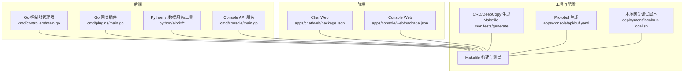
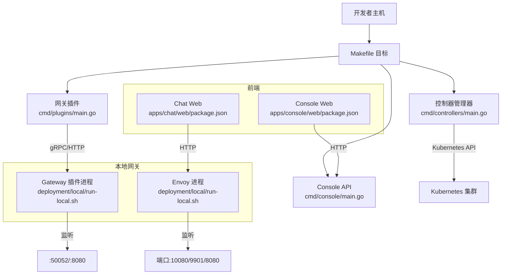
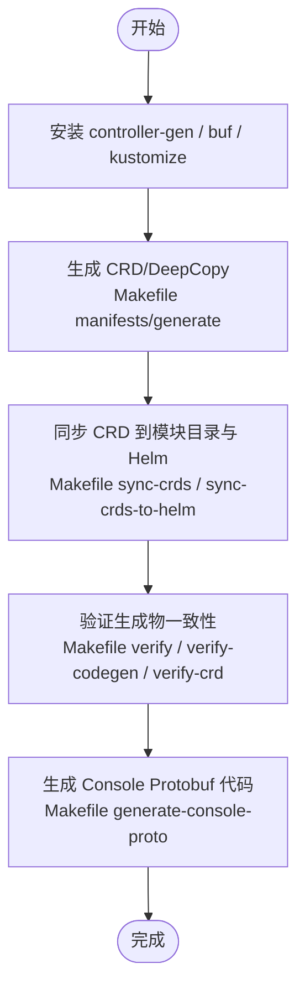
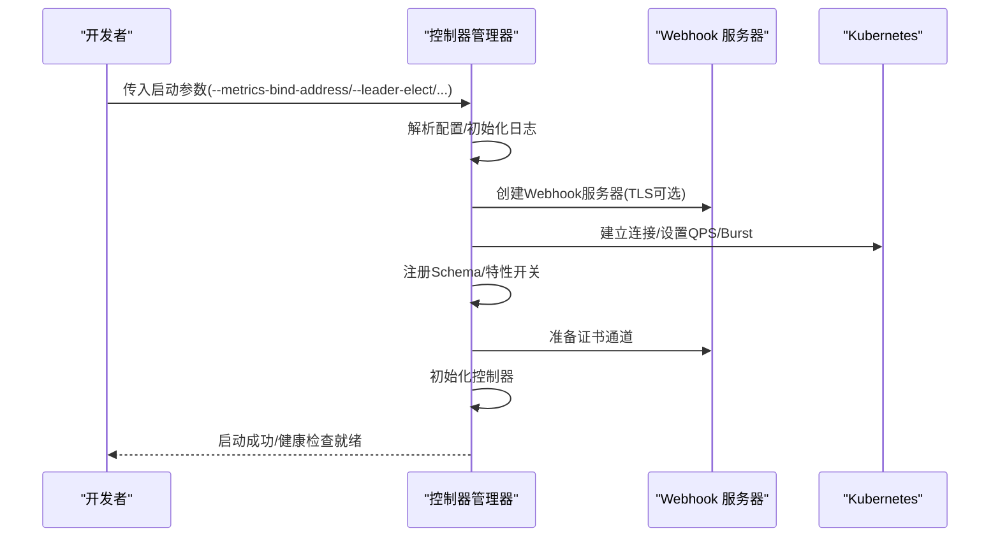
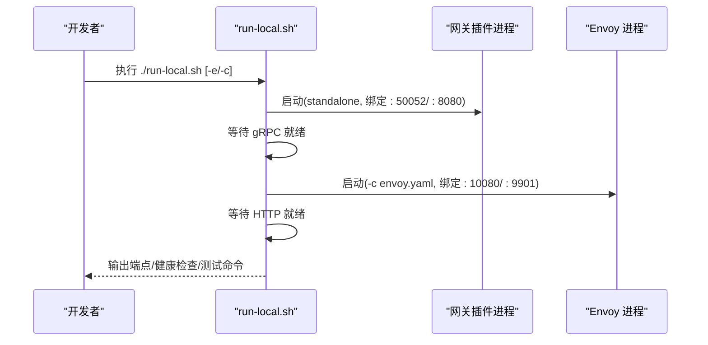
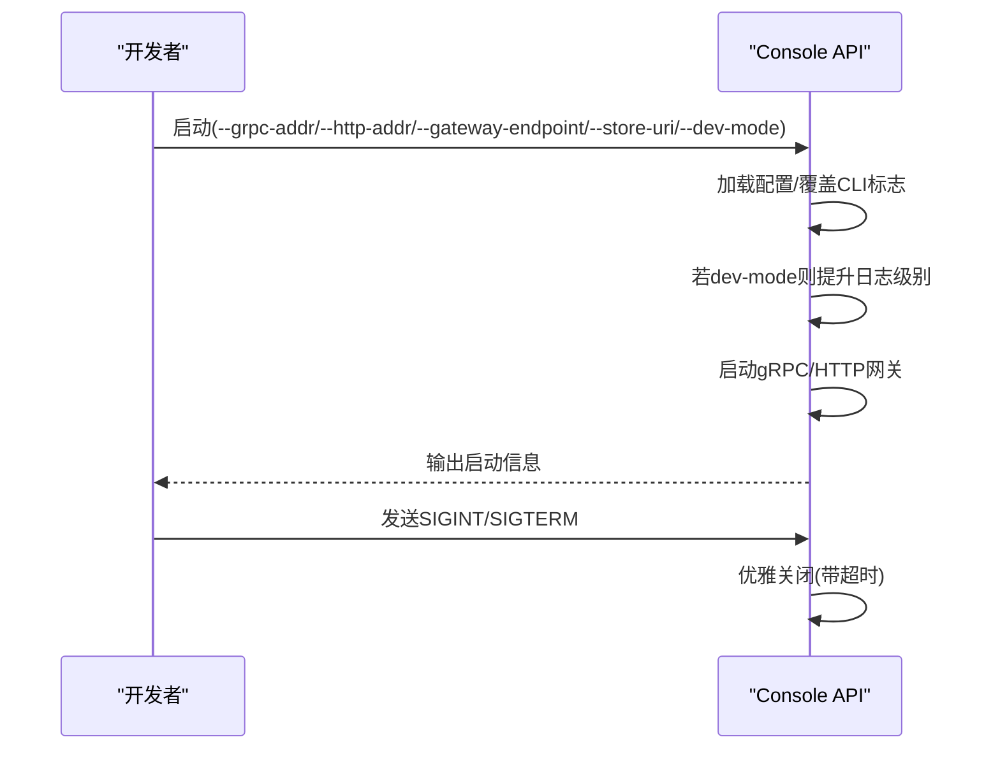
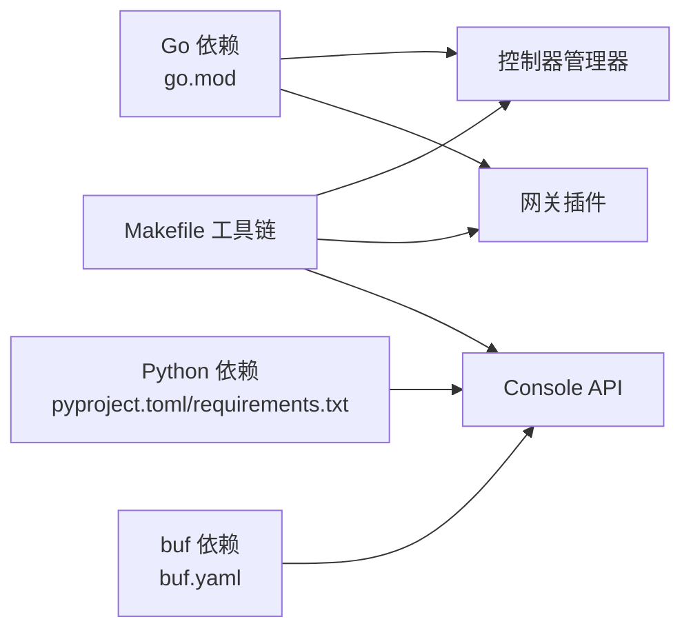

# 开发环境搭建

<cite>
**本文引用的文件**
- [README.md](file://README.md)
- [go.mod](file://go.mod)
- [Makefile](file://Makefile)
- [cmd/controllers/main.go](file://cmd/controllers/main.go)
- [cmd/console/main.go](file://cmd/console/main.go)
- [apps/chat/api/pyproject.toml](file://apps/chat/api/pyproject.toml)
- [apps/chat/api/requirements.txt](file://apps/chat/api/requirements.txt)
- [apps/chat/web/package.json](file://apps/chat/web/package.json)
- [apps/console/web/package.json](file://apps/console/web/package.json)
- [apps/console/api/buf.yaml](file://apps/console/api/buf.yaml)
- [deployment/local/run-local.sh](file://deployment/local/run-local.sh)
- [deployment/local/stop-local.sh](file://deployment/local/stop-local.sh)
- [development/app/requirements.txt](file://development/app/requirements.txt)
- [python/aibrix/pyproject.toml](file://python/aibrix/pyproject.toml)
- [python/aibrix_kvcache/pyproject.toml](file://python/aibrix_kvcache/pyproject.toml)
</cite>

## 目录
1. [简介](#简介)
2. [项目结构](#项目结构)
3. [核心组件](#核心组件)
4. [架构总览](#架构总览)
5. [详细组件分析](#详细组件分析)
6. [依赖分析](#依赖分析)
7. [性能考虑](#性能考虑)
8. [故障排查指南](#故障排查指南)
9. [结论](#结论)
10. [附录](#附录)

## 简介
本文件面向AIBrix开发者，提供从零到一的开发环境搭建与本地调试指南。内容覆盖：
- 基础环境要求（Go、Python、Node.js）
- 代码生成工具链（CRD、DeepCopy、protobuf）
- 本地开发服务器启动（控制器管理器、网关插件、API服务）
- IDE配置建议（VS Code、GoLand）
- 依赖管理最佳实践（模块版本、依赖更新策略）
- 常见问题排查与解决方案

## 项目结构
AIBrix采用多语言混合架构：Go用于控制器与网关插件，Python用于元数据服务与工具脚本，前端使用React/Vite。Makefile统一编排构建、测试、部署与本地调试。

图表来源
- [Makefile:210-242](file://Makefile#L210-L242)
- [cmd/controllers/main.go:112-360](file://cmd/controllers/main.go#L112-L360)
- [cmd/console/main.go:34-118](file://cmd/console/main.go#L34-L118)
- [apps/chat/web/package.json:1-91](file://apps/chat/web/package.json#L1-L91)
- [apps/console/web/package.json:1-62](file://apps/console/web/package.json#L1-L62)
- [apps/console/api/buf.yaml:1-6](file://apps/console/api/buf.yaml#L1-L6)
- [deployment/local/run-local.sh:1-165](file://deployment/local/run-local.sh#L1-L165)

章节来源
- [README.md:46-89](file://README.md#L46-L89)
- [Makefile:210-242](file://Makefile#L210-L242)

## 核心组件
- 控制器管理器：基于controller-runtime，支持健康检查、指标、Webhook证书轮换、领导者选举等。
- 网关插件：独立进程，提供gRPC/HTTP接口，支持路由算法、指标与健康检查。
- Console API：Console后端服务，提供gRPC与HTTP网关，支持开发模式与存储配置。
- Chat API：FastAPI应用，提供聊天相关接口与依赖清单。
- Chat Web：React/Vite前端，提供聊天界面。
- Console Web：React/Vite前端，提供控制台界面。
- Protobuf：通过buf生成Go代码，支撑Console API通信协议。
- 本地网关：Envoy + 网关插件的本地组合，便于离线调试。

章节来源
- [cmd/controllers/main.go:112-360](file://cmd/controllers/main.go#L112-L360)
- [cmd/console/main.go:34-118](file://cmd/console/main.go#L34-L118)
- [apps/chat/api/pyproject.toml:1-22](file://apps/chat/api/pyproject.toml#L1-L22)
- [apps/chat/api/requirements.txt:1-8](file://apps/chat/api/requirements.txt#L1-L8)
- [apps/chat/web/package.json:1-91](file://apps/chat/web/package.json#L1-L91)
- [apps/console/web/package.json:1-62](file://apps/console/web/package.json#L1-L62)
- [apps/console/api/buf.yaml:1-6](file://apps/console/api/buf.yaml#L1-L6)
- [deployment/local/run-local.sh:1-165](file://deployment/local/run-local.sh#L1-L165)

## 架构总览
下图展示开发环境中的关键组件与交互关系，以及本地调试路径。

图表来源
- [Makefile:210-242](file://Makefile#L210-L242)
- [cmd/controllers/main.go:112-360](file://cmd/controllers/main.go#L112-L360)
- [cmd/console/main.go:34-118](file://cmd/console/main.go#L34-L118)
- [deployment/local/run-local.sh:73-140](file://deployment/local/run-local.sh#L73-L140)

## 详细组件分析

### Go 环境与依赖
- 版本要求：Go 1.22.5，工具链1.22.6。
- 主要依赖：controller-runtime、kubebuilder、k8s API、gRPC、Prometheus、Redis、MySQL、Ray Operator等。
- 构建目标：控制器管理器、网关插件、Console API等二进制产物。
- 测试与验证：单元测试、集成测试、覆盖率、代码规范检查、CRD一致性校验。

章节来源
- [go.mod:1-143](file://go.mod#L1-L143)
- [Makefile:210-242](file://Makefile#L210-L242)
- [Makefile:138-178](file://Makefile#L138-L178)
- [Makefile:110-129](file://Makefile#L110-L129)

### Python 环境与依赖
- aibrix包：FastAPI、uvicorn、redis、kubernetes、PyYAML、httpx、prometheus-client等。
- aibrix-kvcache：PyTorch、CMake、Ninja、setuptools等构建依赖，支持CUDA架构列表。
- Chat API：FastAPI、Uvicorn、httpx、pydantic、python-multipart等。
- 开发工具：mypy、ruff、pytest等。

章节来源
- [python/aibrix/pyproject.toml:54-106](file://python/aibrix/pyproject.toml#L54-L106)
- [python/aibrix_kvcache/pyproject.toml:20-35](file://python/aibrix_kvcache/pyproject.toml#L20-L35)
- [apps/chat/api/pyproject.toml:1-22](file://apps/chat/api/pyproject.toml#L1-L22)
- [apps/chat/api/requirements.txt:1-8](file://apps/chat/api/requirements.txt#L1-L8)
- [development/app/requirements.txt:1-7](file://development/app/requirements.txt#L1-L7)

### Node.js 环境与前端
- Vite + React + TypeScript，TailwindCSS，Biome/Lint/Format。
- Chat Web与Console Web分别管理依赖与脚本。

章节来源
- [apps/chat/web/package.json:1-91](file://apps/chat/web/package.json#L1-L91)
- [apps/console/web/package.json:1-62](file://apps/console/web/package.json#L1-L62)

### 代码生成工具链
- CRD与DeepCopy：通过controller-gen生成，并同步至模块目录与Helm Chart。
- Protobuf：通过buf生成Console API的Go代码。
- 代码生成验证：提供verify-codegen与verify-crd目标，确保生成物一致性。

图表来源
- [Makefile:71-129](file://Makefile#L71-L129)
- [apps/console/api/buf.yaml:1-6](file://apps/console/api/buf.yaml#L1-L6)

章节来源
- [Makefile:71-129](file://Makefile#L71-L129)
- [Makefile:90-108](file://Makefile#L90-L108)
- [apps/console/api/buf.yaml:1-6](file://apps/console/api/buf.yaml#L1-L6)

### 本地开发服务器启动配置

#### 控制器管理器
- 启动参数：指标绑定地址、健康探针地址、领导者选举、HTTP/2安全、Webhook开关、调试模式、K8s API限流等。
- 证书轮换：在Webhook启用时进行证书准备与轮换。
- 控制器注册：根据特性开关动态注册各控制器。

图表来源
- [cmd/controllers/main.go:112-360](file://cmd/controllers/main.go#L112-L360)

章节来源
- [cmd/controllers/main.go:112-360](file://cmd/controllers/main.go#L112-L360)

#### 网关插件（本地）
- 二进制：需先通过Makefile构建（无ZMQ）。
- 进程：独立运行，提供gRPC(:50052)与HTTP(:8080)。
- Envoy：作为反向代理与流量入口，监听HTTP(:10080)与Admin(:9901)。
- 路由算法：可通过环境变量选择（如random）。
- 健康检查：等待端口就绪后输出可用信息。

图表来源
- [deployment/local/run-local.sh:73-140](file://deployment/local/run-local.sh#L73-L140)

章节来源
- [deployment/local/run-local.sh:1-165](file://deployment/local/run-local.sh#L1-L165)
- [deployment/local/stop-local.sh:1-35](file://deployment/local/stop-local.sh#L1-L35)

#### Console API 服务
- 支持gRPC与HTTP网关，可从环境变量或CLI标志加载配置。
- 开发模式：默认提升日志级别以便观察请求/响应。
- 优雅关闭：接收信号后进行超时控制的关闭流程。

图表来源
- [cmd/console/main.go:34-118](file://cmd/console/main.go#L34-L118)

章节来源
- [cmd/console/main.go:34-118](file://cmd/console/main.go#L34-L118)

### IDE 配置指南
- VS Code
  - Go：启用Go扩展，推荐配置go.toolsManagement.path指向本地bin目录，启用go.installAllTools。
  - Python：使用Python扩展，选择解释器为Poetry或venv；启用mypy、ruff、pytest集成。
  - Node.js：安装ESLint、Prettier、TypeScript支持；Vite自动提示。
- GoLand
  - 使用Go模块与GOPATH/bin路径；启用内置测试框架与覆盖率。
  - 配置Makefile目标为Run/Debug配置，直接调用make目标。
- 通用建议
  - 在根目录放置.vscode/settings.json与.golangci.yml，统一风格与静态检查。
  - 前端项目使用.pnpm而非npm/yarn，保持依赖锁定一致。

（本节为通用实践建议，不直接分析具体文件）

### 依赖管理最佳实践
- Go模块
  - 使用go.mod固定版本，定期执行go mod tidy与go list -m all对比差异。
  - 通过Makefile统一下载controller-gen、kustomize、envtest等工具，避免手工安装。
- Python
  - Poetry管理依赖与发布；aibrix与aibrix-kvcache分别维护动态版本与构建系统。
  - Chat API使用requirements.txt与pyproject.toml双轨约束，确保格式化与类型检查。
- Node.js
  - 使用pnpm锁定版本，避免重复依赖；Vite脚本统一lint/format/typecheck。
- 更新策略
  - 定期升级controller-tools与k8s版本，确保CRD与API兼容。
  - 对Python依赖按功能分组（dev/profiling），避免运行时负担。

章节来源
- [go.mod:1-143](file://go.mod#L1-L143)
- [Makefile:489-526](file://Makefile#L489-L526)
- [python/aibrix/pyproject.toml:108-138](file://python/aibrix/pyproject.toml#L108-L138)
- [python/aibrix_kvcache/pyproject.toml:20-35](file://python/aibrix_kvcache/pyproject.toml#L20-L35)
- [apps/chat/api/pyproject.toml:1-22](file://apps/chat/api/pyproject.toml#L1-L22)
- [apps/chat/api/requirements.txt:1-8](file://apps/chat/api/requirements.txt#L1-L8)
- [apps/chat/web/package.json:1-91](file://apps/chat/web/package.json#L1-L91)
- [apps/console/web/package.json:1-62](file://apps/console/web/package.json#L1-L62)

## 依赖分析
- 外部依赖耦合
  - 控制器管理器依赖controller-runtime、k8s API、gRPC、Prometheus、Redis、MySQL等。
  - Console API依赖FastAPI、uvicorn、httpx、pydantic等。
  - 网关插件依赖Envoy与本地二进制，需注意HTTP/2安全配置。
- 工具链依赖
  - Makefile统一下载controller-gen、kustomize、envtest、golangci-lint等工具。
  - buf用于Protobuf生成，确保Console API前后端一致性。

图表来源
- [go.mod:1-143](file://go.mod#L1-L143)
- [python/aibrix/pyproject.toml:54-106](file://python/aibrix/pyproject.toml#L54-L106)
- [apps/console/api/buf.yaml:1-6](file://apps/console/api/buf.yaml#L1-L6)
- [Makefile:489-526](file://Makefile#L489-L526)

章节来源
- [go.mod:1-143](file://go.mod#L1-L143)
- [python/aibrix/pyproject.toml:54-106](file://python/aibrix/pyproject.toml#L54-L106)
- [apps/console/api/buf.yaml:1-6](file://apps/console/api/buf.yaml#L1-L6)
- [Makefile:489-526](file://Makefile#L489-L526)

## 性能考虑
- 控制器管理器
  - 合理设置K8s API QPS/Burst，避免对集群造成压力。
  - 指标与健康检查端口分离，避免阻塞主循环。
- 网关插件
  - 关闭HTTP/2可降低安全风险；仅在必要时开启。
  - 路由算法可配置，结合压测选择合适策略。
- Console API
  - 开发模式下日志级别提升，便于调试但会增加开销。
  - 存储URI可切换内存或MySQL，生产建议MySQL以持久化。

（本节为通用指导，不直接分析具体文件）

## 故障排查指南
- 控制器管理器无法启动
  - 检查KUBECONFIG或集群内配置是否正确。
  - 查看领导者选举命名空间与资源锁配置。
  - 确认Webhook证书是否生成，未生成会导致readyz失败。
- 网关插件/Envoy 未就绪
  - 确认二进制路径与配置文件存在。
  - 检查端口占用情况（10080/9901/50052/8080）。
  - 使用stop-local.sh清理残留进程与共享内存。
- Console API 启动异常
  - 检查GRPC_ADDR/HTTP_ADDR/GATEWAY_ENDPOINT/STORE_URI是否正确。
  - 开启dev-mode时注意日志级别与依赖服务状态。
- 代码生成失败
  - 确保controller-gen、buf、kustomize版本满足Makefile要求。
  - 执行make verify-codegen与verify-crd核对生成物一致性。

章节来源
- [cmd/controllers/main.go:176-200](file://cmd/controllers/main.go#L176-L200)
- [cmd/controllers/main.go:294-312](file://cmd/controllers/main.go#L294-L312)
- [deployment/local/run-local.sh:34-56](file://deployment/local/run-local.sh#L34-L56)
- [deployment/local/run-local.sh:88-105](file://deployment/local/run-local.sh#L88-L105)
- [deployment/local/stop-local.sh:1-35](file://deployment/local/stop-local.sh#L1-L35)
- [cmd/console/main.go:48-87](file://cmd/console/main.go#L48-L87)
- [Makefile:116-128](file://Makefile#L116-L128)
- [Makefile:122-128](file://Makefile#L122-L128)

## 结论
通过上述步骤，开发者可在本地快速搭建AIBrix开发环境，完成控制器、网关插件与API服务的本地调试，并配合前端与工具链实现高效的迭代开发。建议在团队内统一IDE与工具链配置，持续执行代码生成与验证流程，确保跨语言组件的一致性与稳定性。

## 附录
- 快速开始（参考README）
  - 克隆仓库后，按文档指引安装依赖与组件。
  - 使用kubectl应用依赖与核心组件，或通过Makefile一键安装。
- 常用Makefile目标
  - 构建：build、build-controller-manager、build-gateway-plugins、build-console。
  - 生成：manifests、generate、sync-crds、sync-crds-to-helm、generate-console-proto。
  - 测试：test、test-race-condition、test-integration、lint、lint-fix。
  - 部署：install、deploy、uninstall、undeploy、dev-install-in-kind、dev-uninstall-from-kind。

章节来源
- [README.md:46-89](file://README.md#L46-L89)
- [Makefile:210-242](file://Makefile#L210-L242)
- [Makefile:138-178](file://Makefile#L138-L178)
- [Makefile:421-457](file://Makefile#L421-L457)