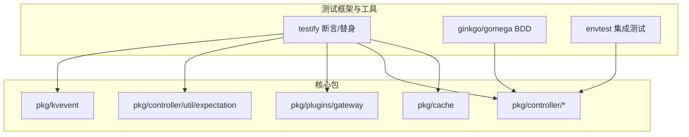
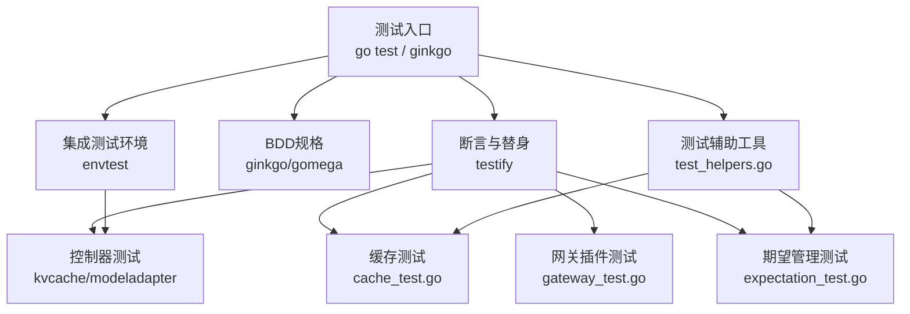
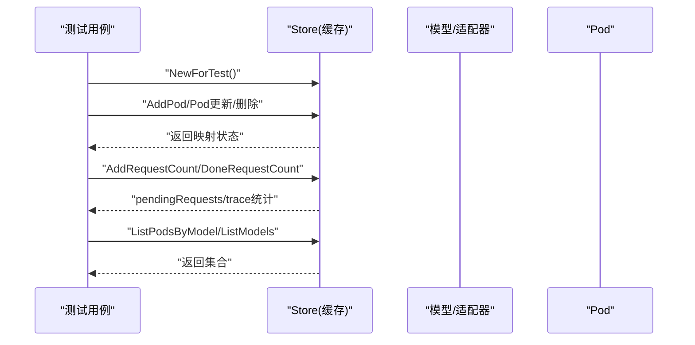
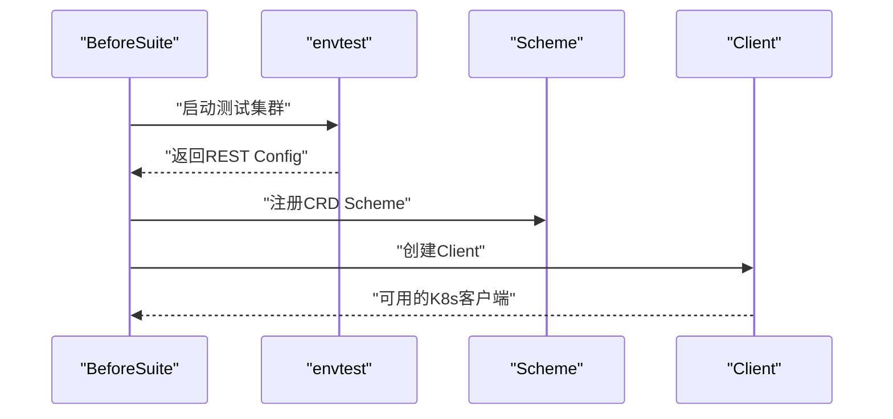
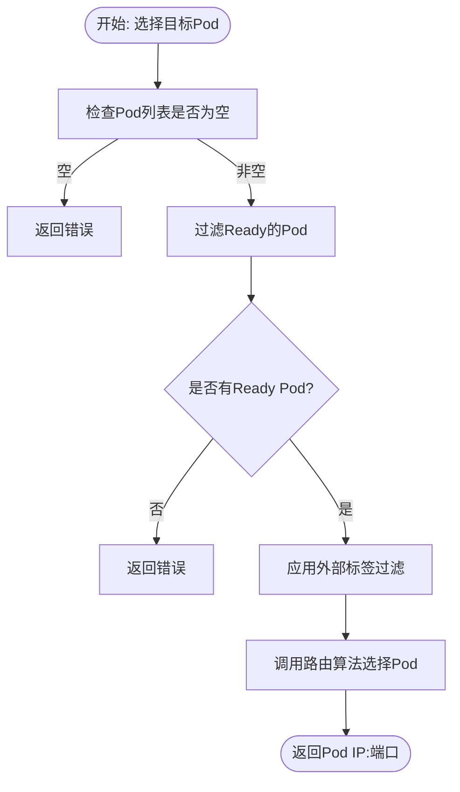
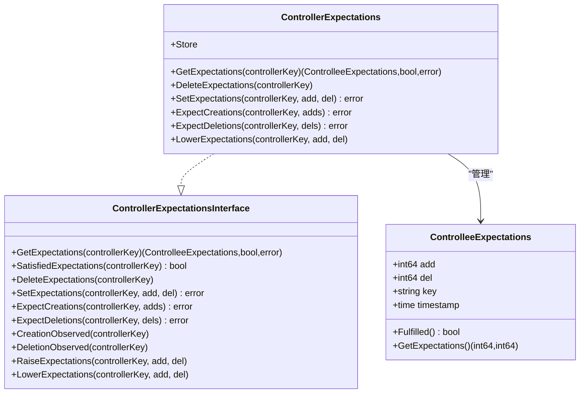
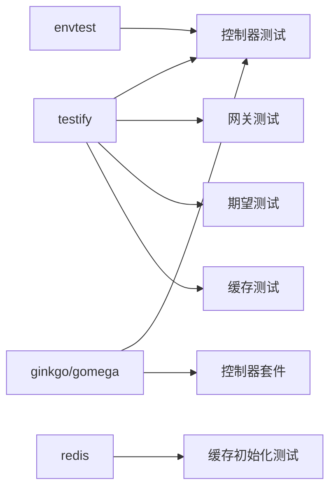

# 单元测试

<cite>
**本文引用的文件**
- [go.mod](file://go.mod)
- [.github/.testcoverage.yml](file://.github/.testcoverage.yml)
- [.github/workflows/lint-and-tests.yml](file://.github/workflows/lint-and-tests.yml)
- [pkg/cache/README.md](file://pkg/cache/README.md)
- [pkg/cache/cache_test.go](file://pkg/cache/cache_test.go)
- [pkg/cache/cache_init_test.go](file://pkg/cache/cache_init_test.go)
- [pkg/cache/test_helpers.go](file://pkg/cache/test_helpers.go)
- [pkg/controller/kvcache/kvcache_controller_test.go](file://pkg/controller/kvcache/kvcache_controller_test.go)
- [pkg/controller/kvcache/suite_test.go](file://pkg/controller/kvcache/suite_test.go)
- [pkg/controller/modeladapter/suite_test.go](file://pkg/controller/modeladapter/suite_test.go)
- [pkg/controller/util/expectation/expectation_test.go](file://pkg/controller/util/expectation/expectation_test.go)
- [pkg/kvevent/test_helpers.go](file://pkg/kvevent/test_helpers.go)
- [pkg/plugins/gateway/gateway_test.go](file://pkg/plugins/gateway/gateway_test.go)
</cite>

## 目录
1. [引言](#引言)
2. [项目结构](#项目结构)
3. [核心组件](#核心组件)
4. [架构总览](#架构总览)
5. [详细组件分析](#详细组件分析)
6. [依赖分析](#依赖分析)
7. [性能考虑](#性能考虑)
8. [故障排查指南](#故障排查指南)
9. [结论](#结论)
10. [附录](#附录)

## 引言
本文件面向AIBrix项目的Go单元测试体系，系统性梳理测试文件组织、测试函数编写、断言与替身（Mock）使用、控制器与缓存系统的测试策略、覆盖率分析与阈值配置，并总结测试最佳实践。内容以仓库中已有的测试实现为依据，结合工作流与覆盖率配置，帮助开发者快速上手并持续改进测试质量。

## 项目结构
AIBrix采用多包分层的Go模块结构，测试主要分布在以下区域：
- 缓存与事件同步：pkg/cache 及其子目录
- 控制器：pkg/controller 下各子域（如 kvcache、modeladapter 等）
- 插件网关：pkg/plugins/gateway
- 工具与通用逻辑：pkg/controller/util、pkg/kvevent 等
- 测试工具与辅助：各包内的 *_test.go 与 test_helpers.go

测试框架与依赖：
- 断言与Mock：github.com/stretchr/testify
- BDD风格测试：github.com/onsi/ginkgo/v2、github.com/onsi/gomega
- Kubernetes集成测试：sigs.k8s.io/controller-runtime/envtest
- Redis客户端：github.com/redis/go-redis/v9

**章节来源**
- [go.mod:1-143](file://go.mod#L1-L143)

## 核心组件
- 断言与Mock库：用于断言结果、构造替身对象与期望，覆盖所有测试场景。
- BDD测试套件：通过Ginkgo/Gomega组织规格化测试，便于分组与生命周期管理。
- 集成测试环境：envtest启动本地K8s环境，加载CRD，支持控制器级端到端测试。
- 测试辅助工具：test_helpers.go提供针对特定组件（如缓存、事件）的注入与替换能力。

**章节来源**
- [go.mod:17-30](file://go.mod#L17-L30)
- [pkg/controller/kvcache/suite_test.go:42-90](file://pkg/controller/kvcache/suite_test.go#L42-L90)
- [pkg/controller/modeladapter/suite_test.go:42-90](file://pkg/controller/modeladapter/suite_test.go#L42-L90)

## 架构总览
下图展示测试运行时的关键交互：测试入口调用具体测试文件，断言库进行结果校验；控制器测试通过envtest连接K8s API；缓存测试通过NewForTest初始化内存态；插件网关测试通过Mock对象模拟外部依赖。

**图表来源**
- [pkg/controller/kvcache/suite_test.go:42-90](file://pkg/controller/kvcache/suite_test.go#L42-L90)
- [pkg/cache/cache_test.go:101-104](file://pkg/cache/cache_test.go#L101-L104)
- [pkg/plugins/gateway/gateway_test.go:45-83](file://pkg/plugins/gateway/gateway_test.go#L45-L83)
- [pkg/controller/util/expectation/expectation_test.go:96-179](file://pkg/controller/util/expectation/expectation_test.go#L96-L179)

## 详细组件分析

### 缓存系统单元测试
- 测试组织与入口
  - 使用Ginkgo/Gomega组织规格化测试，示例入口参见 [pkg/cache/cache_test.go:101-104](file://pkg/cache/cache_test.go#L101-L104)。
  - 缓存功能测试覆盖Pod/Model映射、适配器增删改、请求计数与追踪、并发一致性等。
- 关键测试点
  - Pod/Model映射与更新：验证添加、更新、删除对元数据表的影响，参见 [pkg/cache/cache_test.go:148-423](file://pkg/cache/cache_test.go#L148-L423)。
  - 模型路由提供者注入：验证路由管理器注册，参见 [pkg/cache/cache_test.go:519-526](file://pkg/cache/cache_test.go#L519-L526)。
  - 请求追踪与并发：验证全局挂起计数在高并发下的正确性，参见 [pkg/cache/cache_test.go:634-697](file://pkg/cache/cache_test.go#L634-L697)。
  - 性能基准：提供Add/Done阶段的基准测试，参见 [pkg/cache/cache_test.go:700-766](file://pkg/cache/cache_test.go#L700-L766)。
- 初始化与清理
  - KV事件同步初始化失败清理：验证环境变量组合导致的清理逻辑，参见 [pkg/cache/cache_init_test.go:35-126](file://pkg/cache/cache_init_test.go#L35-L126)。
  - 关闭资源幂等清理：验证Close多次调用的安全性，参见 [pkg/cache/cache_init_test.go:129-166](file://pkg/cache/cache_init_test.go#L129-L166)。
  - 发现提供者初始化顺序：验证Pod先于Adapter到达或反之的处理，参见 [pkg/cache/cache_init_test.go:214-301](file://pkg/cache/cache_init_test.go#L214-L301)。
- 测试辅助
  - ZMQ构建标签下的同步索引器注入，参见 [pkg/cache/test_helpers.go:24-28](file://pkg/cache/test_helpers.go#L24-L28)。

**图表来源**
- [pkg/cache/cache_test.go:148-697](file://pkg/cache/cache_test.go#L148-L697)
- [pkg/cache/cache_init_test.go:214-301](file://pkg/cache/cache_init_test.go#L214-L301)

**章节来源**
- [pkg/cache/cache_test.go:101-104](file://pkg/cache/cache_test.go#L101-L104)
- [pkg/cache/cache_test.go:148-697](file://pkg/cache/cache_test.go#L148-L697)
- [pkg/cache/cache_init_test.go:35-166](file://pkg/cache/cache_init_test.go#L35-L166)
- [pkg/cache/test_helpers.go:24-28](file://pkg/cache/test_helpers.go#L24-L28)

### 控制器单元测试
- 测试套件与环境
  - 使用Ginkgo/Gomega组织控制器测试套件，统一BeforeSuite/AfterSuite初始化envtest，加载CRD与client，参见 [pkg/controller/kvcache/suite_test.go:42-90](file://pkg/controller/kvcache/suite_test.go#L42-L90)、[pkg/controller/modeladapter/suite_test.go:42-90](file://pkg/controller/modeladapter/suite_test.go#L42-L90)。
- 具体控制器测试
  - KVCache后端解析：基于注解选择后端类型，断言返回值，参见 [pkg/controller/kvcache/kvcache_controller_test.go:28-62](file://pkg/controller/kvcache/kvcache_controller_test.go#L28-L62)。
- 测试替身与Mock
  - 在控制器测试中，通常通过envtest提供的fake client与scheme进行资源操作，配合Gomega断言结果；对于复杂依赖可引入Mock对象（如网关插件测试中的MockGatewayClient等），参见后续“插件网关单元测试”小节。

**图表来源**
- [pkg/controller/kvcache/suite_test.go:52-83](file://pkg/controller/kvcache/suite_test.go#L52-L83)
- [pkg/controller/modeladapter/suite_test.go:52-83](file://pkg/controller/modeladapter/suite_test.go#L52-L83)

**章节来源**
- [pkg/controller/kvcache/suite_test.go:42-90](file://pkg/controller/kvcache/suite_test.go#L42-L90)
- [pkg/controller/modeladapter/suite_test.go:42-90](file://pkg/controller/modeladapter/suite_test.go#L42-L90)
- [pkg/controller/kvcache/kvcache_controller_test.go:28-62](file://pkg/controller/kvcache/kvcache_controller_test.go#L28-L62)

### 插件网关单元测试
- 断言与替身
  - 使用testify assert进行断言；通过Mock对象模拟外部依赖（如GatewayClient、HTTPRoutes、ExtProc响应等），参见 [pkg/plugins/gateway/gateway_test.go:45-83](file://pkg/plugins/gateway/gateway_test.go#L45-L83)。
- 路由策略与Pod选择
  - 验证路由算法字符串合法性、Pod Ready状态过滤、外部标签过滤（=、!=、in、notin、key存在/不存在）等，参见 [pkg/plugins/gateway/gateway_test.go:98-584](file://pkg/plugins/gateway/gateway_test.go#L98-L584)。
- HTTPRoute状态校验
  - 模拟HTTPRoute获取与状态校验，断言Accepted/ResolvedRefs条件，参见 [pkg/plugins/gateway/gateway_test.go:586-737](file://pkg/plugins/gateway/gateway_test.go#L586-L737)。
- 错误处理
  - 对不同HTTP状态码映射到错误类型与消息，参见 [pkg/plugins/gateway/gateway_test.go:744-800](file://pkg/plugins/gateway/gateway_test.go#L744-L800)。

**图表来源**
- [pkg/plugins/gateway/gateway_test.go:98-584](file://pkg/plugins/gateway/gateway_test.go#L98-L584)

**章节来源**
- [pkg/plugins/gateway/gateway_test.go:45-83](file://pkg/plugins/gateway/gateway_test.go#L45-L83)
- [pkg/plugins/gateway/gateway_test.go:98-584](file://pkg/plugins/gateway/gateway_test.go#L98-L584)
- [pkg/plugins/gateway/gateway_test.go:586-737](file://pkg/plugins/gateway/gateway_test.go#L586-L737)
- [pkg/plugins/gateway/gateway_test.go:744-800](file://pkg/plugins/gateway/gateway_test.go#L744-L800)

### 期望管理单元测试
- 期望接口与实现
  - ControllerExpectations接口定义期望的增删与满足判断，实现通过TTLStore存储，参见 [pkg/controller/util/expectation/expectation.go:68-232](file://pkg/controller/util/expectation/expectation.go#L68-L232)。
- 并发与过期
  - 通过测试验证期望计数的并发安全、超时过期后的满足判定，参见 [pkg/controller/util/expectation/expectation_test.go:96-179](file://pkg/controller/util/expectation/expectation_test.go#L96-L179)。

**图表来源**
- [pkg/controller/util/expectation/expectation.go:68-232](file://pkg/controller/util/expectation/expectation.go#L68-L232)

**章节来源**
- [pkg/controller/util/expectation/expectation.go:68-232](file://pkg/controller/util/expectation/expectation.go#L68-L232)
- [pkg/controller/util/expectation/expectation_test.go:96-179](file://pkg/controller/util/expectation/expectation_test.go#L96-L179)

### KV事件测试辅助
- 测试注入
  - 提供NewEventHandlerForTest用于在测试中创建事件处理器，便于与缓存/索引器协作验证事件传播，参见 [pkg/kvevent/test_helpers.go:24-32](file://pkg/kvevent/test_helpers.go#L24-L32)。

**章节来源**
- [pkg/kvevent/test_helpers.go:24-32](file://pkg/kvevent/test_helpers.go#L24-L32)

## 依赖分析
- 测试依赖关系
  - testify广泛用于断言与Mock；ginkgo/gomega用于BDD规格；envtest用于K8s集成测试；redis用于缓存初始化测试。
- 包间耦合
  - 控制器测试依赖envtest与CRD Scheme；缓存测试依赖NewForTest与test_helpers；网关测试依赖Mock对象与路由算法注册。

**图表来源**
- [go.mod:17-30](file://go.mod#L17-L30)
- [pkg/controller/kvcache/suite_test.go:42-90](file://pkg/controller/kvcache/suite_test.go#L42-L90)
- [pkg/cache/cache_init_test.go:35-126](file://pkg/cache/cache_init_test.go#L35-L126)

**章节来源**
- [go.mod:17-30](file://go.mod#L17-L30)
- [pkg/controller/kvcache/suite_test.go:42-90](file://pkg/controller/kvcache/suite_test.go#L42-L90)
- [pkg/cache/cache_init_test.go:35-126](file://pkg/cache/cache_init_test.go#L35-L126)

## 性能考虑
- 基准测试
  - 缓存模块提供Add/Done阶段的基准测试，便于评估请求追踪与完成路径的吞吐，参见 [pkg/cache/cache_test.go:700-766](file://pkg/cache/cache_test.go#L700-L766)。
- 并发与原子性
  - 请求追踪使用原子计数保证并发安全，测试覆盖高并发场景下的挂起计数归零，参见 [pkg/cache/cache_test.go:634-697](file://pkg/cache/cache_test.go#L634-L697)。

**章节来源**
- [pkg/cache/cache_test.go:700-766](file://pkg/cache/cache_test.go#L700-L766)
- [pkg/cache/cache_test.go:634-697](file://pkg/cache/cache_test.go#L634-L697)

## 故障排查指南
- 测试覆盖率阈值
  - 项目使用.vladopajic/go-test-coverage在CI中检查覆盖率，当前阈值为总覆盖率不低于25%，参见 [.github/.testcoverage.yml:11-22](file://.github/.testcoverage.yml#L11-L22)、[lint-and-tests.yml:134-148](file://.github/workflows/lint-and-tests.yml#L134-L148)。
- 缓存初始化失败清理
  - 当KV事件同步或远程分词器配置不合法时，会触发清理逻辑并返回错误，参见 [pkg/cache/cache_init_test.go:35-126](file://pkg/cache/cache_init_test.go#L35-L126)。
- 关闭资源幂等
  - Store.Close多次调用应幂等且不panic，参见 [pkg/cache/cache_init_test.go:129-166](file://pkg/cache/cache_init_test.go#L129-L166)。
- 网关错误映射
  - 对401/503等状态码进行错误类型与消息映射，便于定位问题，参见 [pkg/plugins/gateway/gateway_test.go:744-800](file://pkg/plugins/gateway/gateway_test.go#L744-L800)。

**章节来源**
- [.github/.testcoverage.yml:11-22](file://.github/.testcoverage.yml#L11-L22)
- [.github/workflows/lint-and-tests.yml:134-148](file://.github/workflows/lint-and-tests.yml#L134-L148)
- [pkg/cache/cache_init_test.go:35-166](file://pkg/cache/cache_init_test.go#L35-L166)
- [pkg/plugins/gateway/gateway_test.go:744-800](file://pkg/plugins/gateway/gateway_test.go#L744-L800)

## 结论
AIBrix的单元测试体系以testify与Ginkgo/Gomega为核心，结合envtest实现控制器级集成测试，覆盖缓存、事件同步、网关插件与期望管理等关键模块。通过明确的测试入口、断言与Mock策略、以及覆盖率阈值与CI流程，确保了代码质量与稳定性。建议在新增功能时遵循现有测试模式，优先编写断言清晰、可并行执行的子测试，并配套覆盖率与性能基准。

## 附录
- 运行缓存测试参考
  - 全量缓存测试与按标签筛选测试命令参见 [pkg/cache/README.md:143-153](file://pkg/cache/README.md#L143-L153)。

**章节来源**
- [pkg/cache/README.md:143-153](file://pkg/cache/README.md#L143-L153)