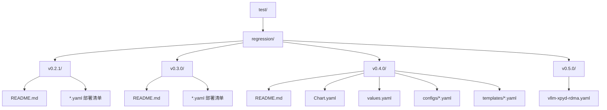
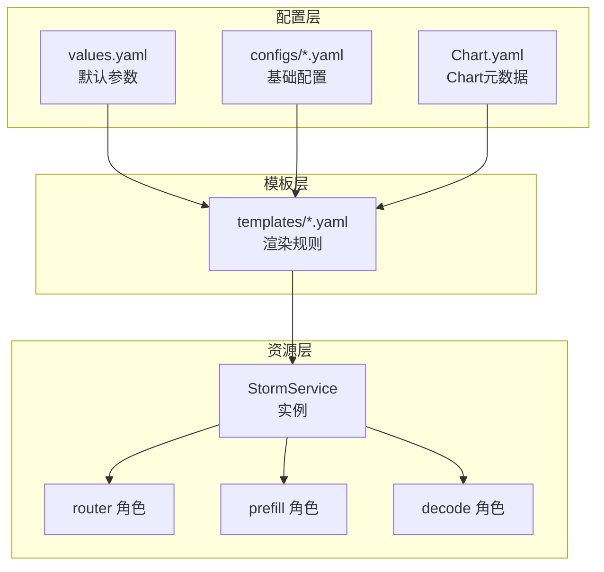
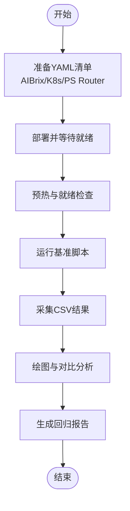
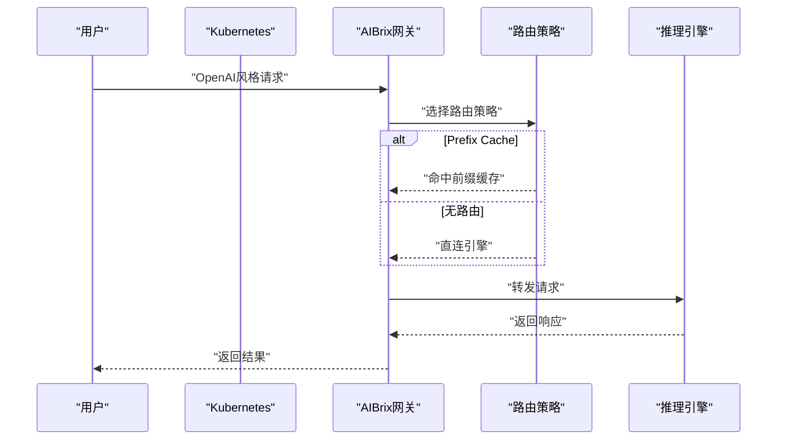
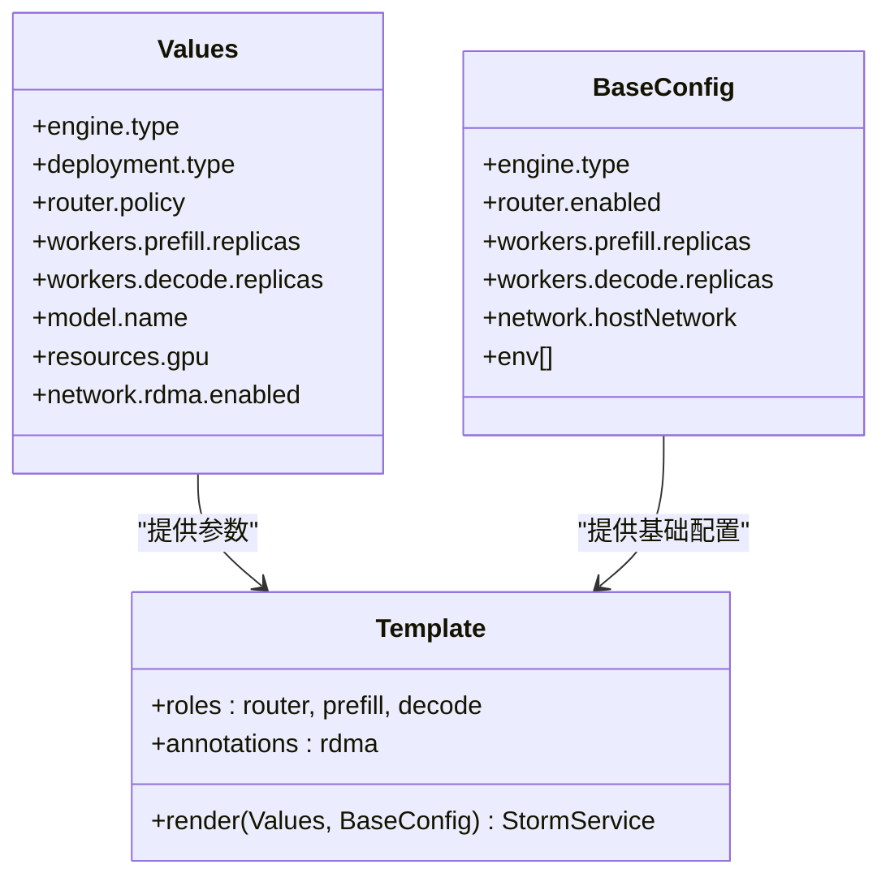
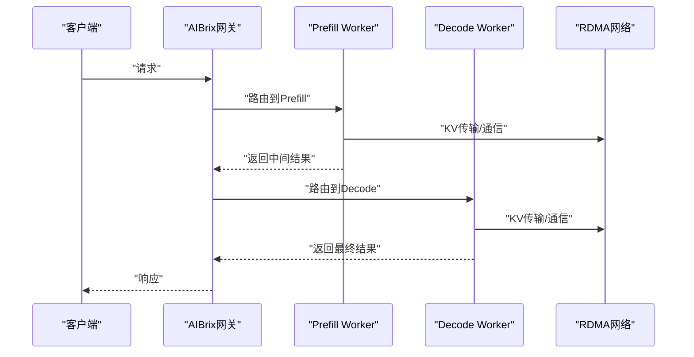
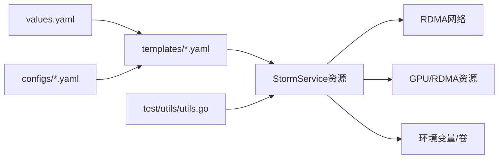

# 回归测试

<cite>
**本文引用的文件**
- [test/README.md](file://test/README.md)
- [test/regression/v0.2.1/README.md](file://test/regression/v0.2.1/README.md)
- [test/regression/v0.2.1/aibrix_naive.yaml](file://test/regression/v0.2.1/aibrix_naive.yaml)
- [test/regression/v0.3.0/README.md](file://test/regression/v0.3.0/README.md)
- [test/regression/v0.3.0/aibrix_naive.yaml](file://test/regression/v0.3.0/aibrix_naive.yaml)
- [test/regression/v0.4.0/README.md](file://test/regression/v0.4.0/README.md)
- [test/regression/v0.4.0/values.yaml](file://test/regression/v0.4.0/values.yaml)
- [test/regression/v0.4.0/Chart.yaml](file://test/regression/v0.4.0/Chart.yaml)
- [test/regression/v0.4.0/configs/vllm-disagg-base.yaml](file://test/regression/v0.4.0/configs/vllm-disagg-base.yaml)
- [test/regression/v0.4.0/templates/vllm-disaggregated.yaml](file://test/regression/v0.4.0/templates/vllm-disaggregated.yaml)
- [test/regression/v0.5.0/vllm-xpyd-rdma.yaml](file://test/regression/v0.5.0/vllm-xpyd-rdma.yaml)
- [test/utils/utils.go](file://test/utils/utils.go)
</cite>

## 目录
1. [引言](#引言)
2. [项目结构](#项目结构)
3. [核心组件](#核心组件)
4. [架构总览](#架构总览)
5. [详细组件分析](#详细组件分析)
6. [依赖关系分析](#依赖关系分析)
7. [性能考量](#性能考量)
8. [故障排查指南](#故障排查指南)
9. [结论](#结论)
10. [附录](#附录)

## 引言
本文件面向AIBrix回归测试体系，系统化梳理版本回归测试的组织架构与执行策略，覆盖历史版本测试套件维护、版本间兼容性验证、性能回归检测等关键主题。文档基于仓库中test/regression目录下的v0.2.1至v0.5.0各版本测试场景，结合测试工具与配置文件，给出可操作的实践建议与最佳实践，帮助团队在发布前高效完成回归验证。

## 项目结构
回归测试相关的核心位置位于test/regression，按版本划分子目录，每个版本包含独立的基准配置、部署清单与运行说明。整体结构如下：

图表来源
- [test/README.md:1-116](file://test/README.md#L1-L116)
- [test/regression/v0.2.1/README.md:1-185](file://test/regression/v0.2.1/README.md#L1-L185)
- [test/regression/v0.3.0/README.md:1-199](file://test/regression/v0.3.0/README.md#L1-L199)
- [test/regression/v0.4.0/README.md:1-152](file://test/regression/v0.4.0/README.md#L1-L152)
- [test/regression/v0.5.0/vllm-xpyd-rdma.yaml:1-217](file://test/regression/v0.5.0/vllm-xpyd-rdma.yaml#L1-L217)

章节来源
- [test/README.md:1-116](file://test/README.md#L1-L116)

## 核心组件
- 版本化测试套件
  - v0.2.1：聚焦PS（Production Stack）性能基准，对比AIBrix与Kubernetes原生栈、PS Router栈，验证KV缓存与路由算法差异对吞吐的影响。
  - v0.3.0：引入KV缓存L1（DRAM）与L2（InfiniStore）方案，对比Prefix Cache路由与无优化基线，评估不同缓存层级与路由策略的收益。
  - v0.4.0：采用Helm模板统一实验编排，通过values.yaml与configs/*.yaml组合，快速生成多引擎（SGLang/VLLM）、多架构（单机/拆分）的标准化实验。
  - v0.5.0：重点验证RDMA网络与Nixl/KVCACHE集成在vLLM上的端到端性能与稳定性，使用显式注解与资源限制确保网络与GPU/RDMA绑定。

- 测试工具与辅助
  - test/utils/utils.go：封装kubectl命令执行、镜像加载、CertManager/Prometheus安装卸载等通用能力，支撑E2E与回归测试环境准备。

章节来源
- [test/regression/v0.2.1/README.md:1-185](file://test/regression/v0.2.1/README.md#L1-L185)
- [test/regression/v0.3.0/README.md:1-199](file://test/regression/v0.3.0/README.md#L1-L199)
- [test/regression/v0.4.0/README.md:1-152](file://test/regression/v0.4.0/README.md#L1-L152)
- [test/regression/v0.5.0/vllm-xpyd-rdma.yaml:1-217](file://test/regression/v0.5.0/vllm-xpyd-rdma.yaml#L1-L217)
- [test/utils/utils.go:1-141](file://test/utils/utils.go#L1-L141)

## 架构总览
回归测试的总体执行路径由“配置准备—部署—基准运行—结果采集—对比分析”构成。下图展示v0.4.0版本的Helm驱动实验编排如何落地为Kubernetes资源，并映射到StormService角色模型。

图表来源
- [test/regression/v0.4.0/values.yaml:1-82](file://test/regression/v0.4.0/values.yaml#L1-L82)
- [test/regression/v0.4.0/Chart.yaml:1-15](file://test/regression/v0.4.0/Chart.yaml#L1-L15)
- [test/regression/v0.4.0/configs/vllm-disagg-base.yaml:1-57](file://test/regression/v0.4.0/configs/vllm-disagg-base.yaml#L1-L57)
- [test/regression/v0.4.0/templates/vllm-disaggregated.yaml:1-192](file://test/regression/v0.4.0/templates/vllm-disaggregated.yaml#L1-L192)

## 详细组件分析

### v0.2.1 性能基准与对比
- 设计思路
  - 以PS基准重现为目标，对比AIBrix与Kubernetes原生栈、PS Router栈在相同工作负载下的吞吐与延迟表现。
  - 通过启用/禁用KV缓存与路由算法，量化不同优化对性能的贡献。
- 关键配置与清单
  - AIBrix基线与KV缓存部署清单用于对比不同缓存策略。
  - 客户端Pod与基准脚本用于批量请求与结果收集。
- 执行要点
  - 建议在同一集群内直接运行客户端，避免port-forward带来的超时与抖动。
  - 每轮实验前后清理路由缓存状态，确保公平对比。
- 结果分析
  - 使用plot.py对CSV输出进行可视化，对比不同配置的QPS曲线与P95延迟。

图表来源
- [test/regression/v0.2.1/README.md:62-185](file://test/regression/v0.2.1/README.md#L62-L185)
- [test/regression/v0.2.1/aibrix_naive.yaml:1-135](file://test/regression/v0.2.1/aibrix_naive.yaml#L1-L135)

章节来源
- [test/regression/v0.2.1/README.md:1-185](file://test/regression/v0.2.1/README.md#L1-L185)
- [test/regression/v0.2.1/aibrix_naive.yaml:1-135](file://test/regression/v0.2.1/aibrix_naive.yaml#L1-L135)

### v0.3.0 KV缓存与路由策略对比
- 设计思路
  - 在v0.2.1基础上引入KV缓存L1（DRAM）与L2（InfiniStore），对比Prefix Cache路由与无路由基线。
  - 通过LMCache与AIBrix内置路由策略的组合，评估缓存层级与路由算法对吞吐与延迟的影响。
- 关键配置与清单
  - aibrix_kvcache_dram.yaml、aibrix_kvcache_external.yaml分别启用不同KV缓存后端。
  - aibrix_naive_prefix_cache.yaml启用Prefix Cache路由策略。
- 执行要点
  - 路由策略切换后需重建Pod以清除缓存状态，保证每轮实验一致性。
  - 注意不同vLLM版本参数差异，确保模型参数与资源设置一致。

图表来源
- [test/regression/v0.3.0/README.md:68-199](file://test/regression/v0.3.0/README.md#L68-L199)
- [test/regression/v0.3.0/aibrix_naive.yaml:1-135](file://test/regression/v0.3.0/aibrix_naive.yaml#L1-L135)

章节来源
- [test/regression/v0.3.0/README.md:1-199](file://test/regression/v0.3.0/README.md#L1-L199)
- [test/regression/v0.3.0/aibrix_naive.yaml:1-135](file://test/regression/v0.3.0/aibrix_naive.yaml#L1-L135)

### v0.4.0 Helm模板化实验编排
- 设计思路
  - 通过Helm Chart统一管理实验参数，values.yaml定义默认值，configs/*.yaml提供基础配置，templates/*.yaml渲染为StormService及其角色。
  - 支持SGLang/VLLM、单机/拆分架构、随机/缓存感知路由策略的快速组合。
- 关键配置与清单
  - Chart.yaml：Chart元数据与应用版本。
  - values.yaml：引擎类型、部署模式、路由器与Worker副本数、模型与资源、网络与RDMA、环境变量与卷挂载等。
  - configs/vllm-disagg-base.yaml：VLLM拆分架构的基础参数集合。
  - templates/vllm-disaggregated.yaml：渲染StormService的角色与容器命令、环境变量、卷与安全上下文。
- 执行要点
  - 使用helm install --set进行参数覆盖，形成描述性的release名称，便于资源命名与追踪。
  - 通过annotations启用RDMA网络，确保跨节点通信性能。

图表来源
- [test/regression/v0.4.0/values.yaml:1-82](file://test/regression/v0.4.0/values.yaml#L1-L82)
- [test/regression/v0.4.0/Chart.yaml:1-15](file://test/regression/v0.4.0/Chart.yaml#L1-L15)
- [test/regression/v0.4.0/configs/vllm-disagg-base.yaml:1-57](file://test/regression/v0.4.0/configs/vllm-disagg-base.yaml#L1-L57)
- [test/regression/v0.4.0/templates/vllm-disaggregated.yaml:1-192](file://test/regression/v0.4.0/templates/vllm-disaggregated.yaml#L1-L192)

章节来源
- [test/regression/v0.4.0/README.md:1-152](file://test/regression/v0.4.0/README.md#L1-L152)
- [test/regression/v0.4.0/values.yaml:1-82](file://test/regression/v0.4.0/values.yaml#L1-L82)
- [test/regression/v0.4.0/configs/vllm-disagg-base.yaml:1-57](file://test/regression/v0.4.0/configs/vllm-disagg-base.yaml#L1-L57)
- [test/regression/v0.4.0/templates/vllm-disaggregated.yaml:1-192](file://test/regression/v0.4.0/templates/vllm-disaggregated.yaml#L1-L192)

### v0.5.0 RDMA与Nixl/KVCache集成
- 设计思路
  - 验证在vLLM上启用RDMA与Nixl/KVCACHE通道后的端到端性能与稳定性，重点观察高并发场景下的吞吐与延迟。
- 关键配置与清单
  - vllm-xpyd-rdma.yaml：显式标注RDMA CNI、节点亲和、GPU与RDMA资源限制、共享内存卷、Nixl/KVCACHE相关环境变量。
- 执行要点
  - 确保RDMA网络插件可用且注解正确；为不同角色（prefill/decode）分配不同节点，避免资源争用。
  - 通过日志级别与调试变量（如UCX/NIXL/VLLM_LOGGING_LEVEL）定位性能瓶颈。

图表来源
- [test/regression/v0.5.0/vllm-xpyd-rdma.yaml:1-217](file://test/regression/v0.5.0/vllm-xpyd-rdma.yaml#L1-L217)

章节来源
- [test/regression/v0.5.0/vllm-xpyd-rdma.yaml:1-217](file://test/regression/v0.5.0/vllm-xpyd-rdma.yaml#L1-L217)

## 依赖关系分析
- 配置与渲染依赖
  - values.yaml为模板渲染提供全局参数；configs/*.yaml提供特定引擎/架构的基础配置；templates/*.yaml根据参数渲染为StormService资源。
- 运行时依赖
  - vLLM/SGLang版本与参数需与KV缓存/Nixl/UCX/RDMA插件版本匹配；RDMA注解与CNI名称需与集群网络配置一致。
- 工具链依赖
  - test/utils/utils.go提供kubectl命令封装、镜像加载、CertManager/Prometheus安装等，保障测试环境一致性。

图表来源
- [test/regression/v0.4.0/values.yaml:1-82](file://test/regression/v0.4.0/values.yaml#L1-L82)
- [test/regression/v0.4.0/configs/vllm-disagg-base.yaml:1-57](file://test/regression/v0.4.0/configs/vllm-disagg-base.yaml#L1-L57)
- [test/regression/v0.4.0/templates/vllm-disaggregated.yaml:1-192](file://test/regression/v0.4.0/templates/vllm-disaggregated.yaml#L1-L192)
- [test/utils/utils.go:1-141](file://test/utils/utils.go#L1-L141)

章节来源
- [test/regression/v0.4.0/values.yaml:1-82](file://test/regression/v0.4.0/values.yaml#L1-L82)
- [test/regression/v0.4.0/configs/vllm-disagg-base.yaml:1-57](file://test/regression/v0.4.0/configs/vllm-disagg-base.yaml#L1-L57)
- [test/regression/v0.4.0/templates/vllm-disaggregated.yaml:1-192](file://test/regression/v0.4.0/templates/vllm-disaggregated.yaml#L1-L192)
- [test/utils/utils.go:1-141](file://test/utils/utils.go#L1-L141)

## 性能考量
- 吞吐与延迟
  - 通过PS基准与自定义负载脚本测量QPS与P95延迟，关注KV缓存命中率、路由策略命中与网络带宽利用率。
- 资源与拓扑
  - RDMA网络显著降低跨节点通信延迟；GPU与RDMA资源配额需与张量并行度匹配；共享内存卷有助于减少锁竞争。
- 稳定性
  - 在高并发场景下监控VLLM/Nixl/UCX日志，识别异常重启与超时；通过InPlaceUpdate与Stateful角色确保状态一致性。

## 故障排查指南
- 环境准备
  - 使用test/utils/utils.go中的安装/卸载函数确保CertManager与Prometheus Operator处于预期状态，避免Webhook或指标导出异常。
  - 本地镜像可通过LoadImageToKindClusterWithName加载至Kind集群，减少拉取失败导致的部署阻塞。
- 常见问题
  - Port-forward超时：优先在集群内运行客户端，避免频繁超时。
  - 路由缓存污染：切换路由策略后重建Pod，确保缓存状态清空。
  - RDMA不可用：核对注解与CNI名称，确认节点具备RDMA设备与驱动。
- 结果采集
  - 使用tar打包CSV输出并通过kubectl cp回本地，统一归档以便后续对比分析。

章节来源
- [test/utils/utils.go:1-141](file://test/utils/utils.go#L1-L141)
- [test/regression/v0.2.1/README.md:62-185](file://test/regression/v0.2.1/README.md#L62-L185)
- [test/regression/v0.3.0/README.md:68-199](file://test/regression/v0.3.0/README.md#L68-L199)
- [test/regression/v0.5.0/vllm-xpyd-rdma.yaml:1-217](file://test/regression/v0.5.0/vllm-xpyd-rdma.yaml#L1-L217)

## 结论
AIBrix回归测试以版本化套件为核心，从v0.2.1的PS基准到v0.5.0的RDMA/Nixl集成，逐步扩展了测试覆盖面与复杂度。通过Helm模板化与标准化配置，v0.4.0实现了高效的实验编排；v0.5.0则聚焦于高性能网络与KVCACHE通道的稳定性验证。配合test/utils/utils.go提供的环境工具与统一的结果采集流程，团队可在发布前快速完成兼容性与性能回归验证。

## 附录
- 最佳实践
  - 测试用例设计：围绕关键功能（路由策略、KV缓存、网络拓扑）设计对比组，确保每轮实验前后状态一致。
  - 环境维护：统一镜像版本与网络插件，定期校验RDMA与GPU资源配额。
  - 结果解读：以QPS与P95延迟为主指标，结合日志与指标（CPU/GPU/网络）综合分析。
- 参考路径
  - v0.2.1：[test/regression/v0.2.1/README.md:1-185](file://test/regression/v0.2.1/README.md#L1-L185)，[test/regression/v0.2.1/aibrix_naive.yaml:1-135](file://test/regression/v0.2.1/aibrix_naive.yaml#L1-L135)
  - v0.3.0：[test/regression/v0.3.0/README.md:1-199](file://test/regression/v0.3.0/README.md#L1-L199)，[test/regression/v0.3.0/aibrix_naive.yaml:1-135](file://test/regression/v0.3.0/aibrix_naive.yaml#L1-L135)
  - v0.4.0：[test/regression/v0.4.0/README.md:1-152](file://test/regression/v0.4.0/README.md#L1-L152)，[test/regression/v0.4.0/values.yaml:1-82](file://test/regression/v0.4.0/values.yaml#L1-L82)，[test/regression/v0.4.0/templates/vllm-disaggregated.yaml:1-192](file://test/regression/v0.4.0/templates/vllm-disaggregated.yaml#L1-L192)
  - v0.5.0：[test/regression/v0.5.0/vllm-xpyd-rdma.yaml:1-217](file://test/regression/v0.5.0/vllm-xpyd-rdma.yaml#L1-L217)
  - 工具：[test/utils/utils.go:1-141](file://test/utils/utils.go#L1-L141)