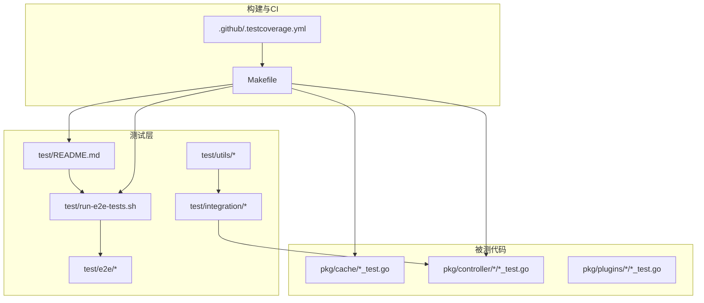
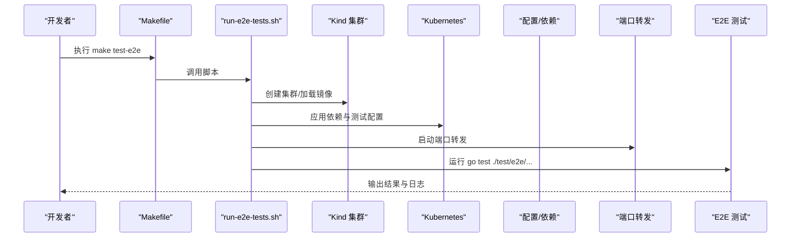
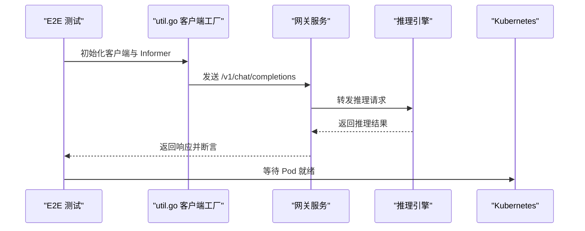
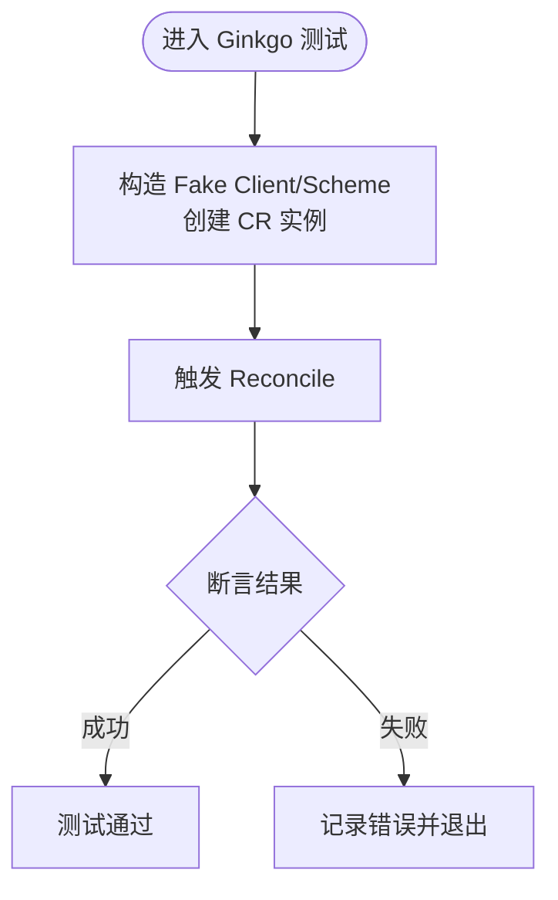
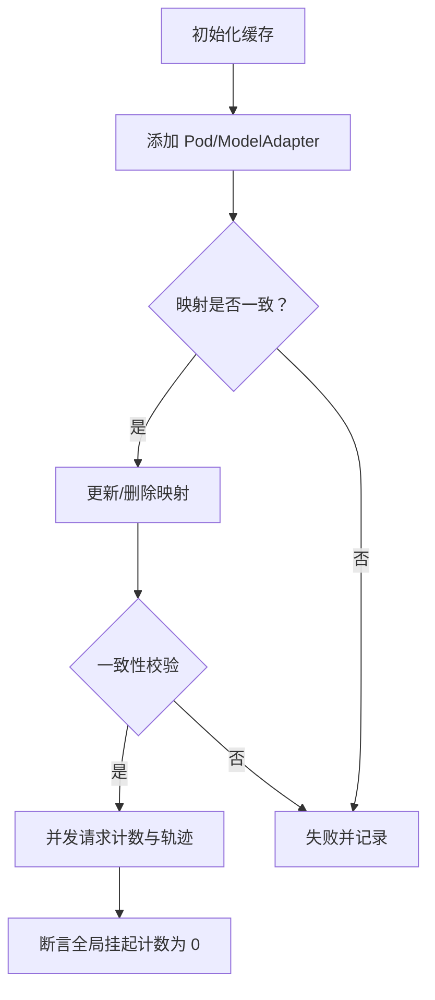
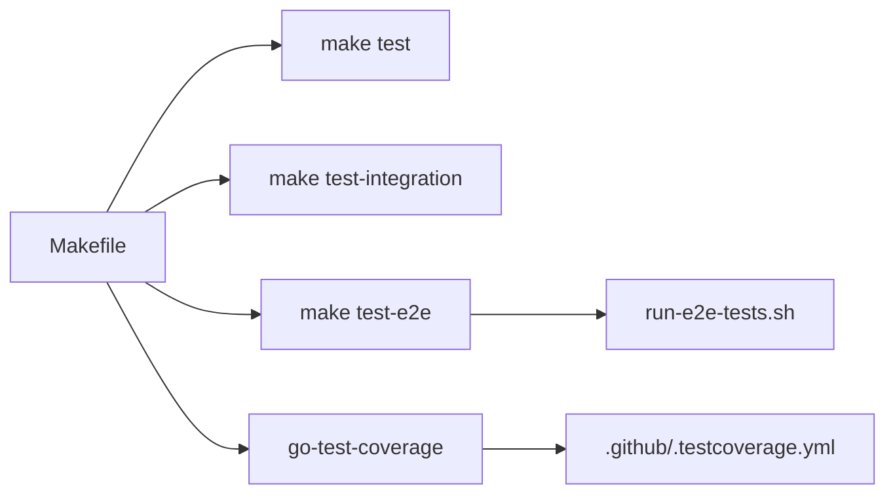

# 测试体系

<cite>
**本文引用的文件**   
- [测试说明](file://test/README.md)
- [端到端测试运行脚本](file://test/run-e2e-tests.sh)
- [端到端测试入口](file://test/e2e/e2e_test.go)
- [端到端测试工具与客户端](file://test/e2e/util.go)
- [集成测试工具集](file://test/utils/utils.go)
- [Makefile（测试目标与流程）](file://Makefile)
- [Go 测试覆盖率配置](file://.github/.testcoverage.yml)
- [KVCache 控制器 Ginkgo 集成测试](file://pkg/controller/kvcache/kvcache_controller_ginkgo_test.go)
- [模型适配器控制器 Ginkgo 单元/集成测试](file://pkg/controller/modeladapter/modeladapter_controller_test.go)
- [缓存模块 Ginkgo 测试套件](file://pkg/cache/cache_test.go)
</cite>

## 目录
1. [引言](#引言)
2. [项目结构](#项目结构)
3. [核心组件](#核心组件)
4. [架构总览](#架构总览)
5. [详细组件分析](#详细组件分析)
6. [依赖关系分析](#依赖关系分析)
7. [性能考量](#性能考量)
8. [故障排查指南](#故障排查指南)
9. [结论](#结论)
10. [附录](#附录)

## 引言
本文件系统化梳理 AIBrix 的测试体系，覆盖单元测试、集成测试与端到端测试三层策略；详解端到端测试的环境搭建、测试数据准备与用例设计；归纳集成测试的组织方式（控制器、Webhook、Kubernetes 资源等）；并给出测试工具链（Ginkgo、Testify、pytest 等）的配置与最佳实践，以及测试数据管理、覆盖率分析与持续集成中的执行策略。

## 项目结构
测试相关目录与文件分布如下：
- test：统一测试入口与运行脚本
  - e2e：端到端测试
  - integration：集成测试（Ginkgo）
  - utils：共享测试工具
  - run-e2e-tests.sh：端到端测试运行脚本
  - README.md：测试说明
- pkg：被测代码，大量 *_test.go 文件构成单元/集成测试
- Makefile：定义测试目标（单元、集成、E2E、覆盖率）
- .github/.testcoverage.yml：覆盖率阈值与排除规则

**图表来源**
- [测试说明:1-116](file://test/README.md#L1-L116)
- [端到端测试运行脚本:1-149](file://test/run-e2e-tests.sh#L1-L149)
- [Makefile（测试目标与流程）:138-170](file://Makefile#L138-L170)

**章节来源**
- [测试说明:1-116](file://test/README.md#L1-L116)
- [Makefile（测试目标与流程）:138-170](file://Makefile#L138-L170)

## 核心组件
- 单元测试：以 Go 语言为主，广泛采用 Ginkgo/Gomega 断言库，分布在各包的 *_test.go 文件中，通过 make test 执行。
- 集成测试：基于 Ginkgo 在受控 Kubernetes 环境下验证控制器、Webhook、资源编排等交互行为。
- 端到端测试：在真实或 Kind 集群上，通过 OpenAI 兼容客户端对网关进行推理调用，验证从请求到响应的完整链路。
- 测试工具链：Ginkgo（Go）、Testify（断言）、pytest（Python 模块）、gotestsum（E2E 执行器）、go-test-coverage（覆盖率统计）。
- 覆盖率与排除：通过 .testcoverage.yml 定义阈值与排除路径，结合 Makefile 目标输出报告。

**章节来源**
- [测试说明:25-116](file://test/README.md#L25-L116)
- [Makefile（测试目标与流程）:138-170](file://Makefile#L138-L170)
- [Go 测试覆盖率配置:1-59](file://.github/.testcoverage.yml#L1-L59)

## 架构总览
下图展示测试体系的分层与关键流程：开发者先写单元/集成测试，再在本地或 CI 中运行 E2E；E2E 通过脚本自动拉起 Kind 集群、加载镜像、部署依赖与测试配置，并启动端口转发后执行测试；覆盖率由 go-test-coverage 统一收集。

**图表来源**
- [Makefile（测试目标与流程）:168-170](file://Makefile#L168-L170)
- [端到端测试运行脚本:32-148](file://test/run-e2e-tests.sh#L32-L148)

**章节来源**
- [Makefile（测试目标与流程）:168-170](file://Makefile#L168-L170)
- [端到端测试运行脚本:32-148](file://test/run-e2e-tests.sh#L32-L148)

## 详细组件分析

### 端到端测试（E2E）
- 设计理念
  - 面向真实用户场景，验证网关到推理引擎的完整链路。
  - 支持开发模式（已有集群）与 CI 模式（自动创建 Kind 集群）。
- 环境搭建
  - 开发模式：确保 KUBECONFIG 指向可用集群，按需启动端口转发。
  - CI 模式：脚本自动安装 kubectl/kind，创建集群，构建并加载镜像，应用依赖与测试配置，启动端口转发。
- 测试数据准备
  - 使用 OpenAI 兼容客户端构造补全与聊天请求，设置固定 API Key 与模型名常量。
  - 通过 Informer 同步 CRD 与 Pod 状态，等待就绪。
- 用例设计
  - 基础推理：校验返回模型名、存在候选文本/消息、token 数大于零。
  - 失败场景：无效 API Key、无效模型名、无效路由策略，断言错误码。
- 关键实现要点
  - 客户端禁用 keep-alive 与缓存，避免 flaky。
  - 通过中间件统一前缀 /v1，确保路由正确。
  - 失败时收集 Pod 列表与日志，便于定位。

**图表来源**
- [端到端测试入口:30-121](file://test/e2e/e2e_test.go#L30-L121)
- [端到端测试工具与客户端:54-202](file://test/e2e/util.go#L54-L202)

**章节来源**
- [测试说明:54-93](file://test/README.md#L54-L93)
- [端到端测试运行脚本:32-148](file://test/run-e2e-tests.sh#L32-L148)
- [端到端测试入口:30-121](file://test/e2e/e2e_test.go#L30-L121)
- [端到端测试工具与客户端:54-202](file://test/e2e/util.go#L54-L202)

### 集成测试（Ginkgo）
- 控制器测试
  - 使用 fake client 与 Scheme 构造最小化环境，验证 Pod 就绪判断、健康检查、重试逻辑、映射修复与更新等。
  - 示例：模型适配器控制器针对“可调度就绪”“健康状态”“可重试错误”“注解清理”等场景的断言。
- Webhook 测试
  - 通过 Ginkgo 套件验证准入控制行为，结合测试工具集安装/卸载 Prometheus Operator 与 CertManager。
- Kubernetes 资源测试
  - 以 KVCache 控制器为例，创建 CR 实例，触发 Reconcile 并断言资源状态变化。

**图表来源**
- [KVCache 控制器 Ginkgo 集成测试:38-154](file://pkg/controller/kvcache/kvcache_controller_ginkgo_test.go#L38-L154)
- [模型适配器控制器 Ginkgo 单元/集成测试:37-505](file://pkg/controller/modeladapter/modeladapter_controller_test.go#L37-L505)

**章节来源**
- [集成测试工具集:41-104](file://test/utils/utils.go#L41-L104)
- [KVCache 控制器 Ginkgo 集成测试:38-154](file://pkg/controller/kvcache/kvcache_controller_ginkgo_test.go#L38-L154)
- [模型适配器控制器 Ginkgo 单元/集成测试:37-505](file://pkg/controller/modeladapter/modeladapter_controller_test.go#L37-L505)

### 缓存模块测试（Ginkgo）
- 测试范围
  - Pod/Model 映射、ModelAdapter 映射、更新与删除一致性。
  - 请求计数、请求轨迹与并发安全。
  - 路由器提供者注入与队列路由器管理。
- 关键断言
  - 添加/更新/删除后，映射表与反查索引保持一致。
  - 并发 Add/Done 场景下全局挂起计数最终归零。
  - 路由器实例类型匹配预期。

**图表来源**
- [缓存模块 Ginkgo 测试套件:148-698](file://pkg/cache/cache_test.go#L148-L698)

**章节来源**
- [缓存模块 Ginkgo 测试套件:148-698](file://pkg/cache/cache_test.go#L148-L698)

### 测试工具链与最佳实践
- Ginkgo
  - 使用 Describe/Context/It 组织测试套件；BeforeEach/AfterEach 管理资源生命周期。
  - 通过 fake client 与 informer 构造可控环境，减少外部依赖。
- Testify
  - 在 E2E 中用于断言响应字段与错误码，提升可读性。
- pytest（Python 模块）
  - 通过 Makefile 的 python-ci 目标统一执行 Python 代码检查与测试。
- gotestsum
  - E2E 脚本中使用，捕获测试退出码，便于 CI 判定。

**章节来源**
- [端到端测试入口:27-60](file://test/e2e/e2e_test.go#L27-L60)
- [Makefile（测试目标与流程）:198-206](file://Makefile#L198-L206)
- [端到端测试运行脚本:138-148](file://test/run-e2e-tests.sh#L138-L148)

### 测试数据管理
- 测试数据生成
  - 使用测试辅助函数快速构造 Pod、ModelAdapter、CRD 实例，统一标签与资源限制。
- Mock 数据准备
  - 通过 Kind 加载本地镜像（如 vLLM mock），并在测试配置中应用。
- 环境隔离
  - 开发模式与 CI 模式分别通过 KUBECONFIG 与 Kind 配置隔离；脚本负责清理资源与端口转发进程。

**章节来源**
- [端到端测试运行脚本:56-117](file://test/run-e2e-tests.sh#L56-L117)
- [Makefile（测试目标与流程）:344-378](file://Makefile#L344-L378)

### 覆盖率分析与 CI 执行策略
- 覆盖率阈值
  - 总体阈值 25%，排除 api/cmd/pkg/cert/pkg/client/pkg/config/pkg/constants/pkg/features/pkg/webhook/test 等路径。
- 执行策略
  - 单元测试：每次提交执行。
  - 集成测试：Pull Request 触发。
  - E2E 测试：夜间构建与发布执行。

**章节来源**
- [Go 测试覆盖率配置:10-59](file://.github/.testcoverage.yml#L10-L59)
- [测试说明:111-116](file://test/README.md#L111-L116)
- [Makefile（测试目标与流程）:138-150](file://Makefile#L138-L150)

## 依赖关系分析
- 测试目标与工具
  - make test：运行所有包的单元测试并生成覆盖率文件。
  - make test-integration：运行 Ginkgo 集成测试，输出 JUnit 报告。
  - make test-e2e：委托 run-e2e-tests.sh 完成端到端测试。
- 工具下载与版本
  - Makefile 自动下载 ginkgo、controller-gen、envtest、golangci-lint、go-test-coverage 等工具。
- 覆盖率工具链
  - 结合 .testcoverage.yml 与 go-test-coverage，统一阈值与排除规则。

**图表来源**
- [Makefile（测试目标与流程）:138-170](file://Makefile#L138-L170)
- [Go 测试覆盖率配置:1-59](file://.github/.testcoverage.yml#L1-L59)

**章节来源**
- [Makefile（测试目标与流程）:138-170](file://Makefile#L138-L170)
- [Go 测试覆盖率配置:1-59](file://.github/.testcoverage.yml#L1-L59)

## 性能考量
- E2E 脚本中通过禁用 keep-alive 与缓存、设置 MaxRetries 为 0，降低网络波动对测试稳定性的影响。
- 并发场景下，缓存模块测试验证请求计数与轨迹的原子性与一致性，确保高负载下的正确性。
- 建议在回归测试中引入基准测试（Benchmark），参考缓存模块的基准样例组织方式。

**章节来源**
- [端到端测试工具与客户端:94-133](file://test/e2e/util.go#L94-L133)
- [缓存模块 Ginkgo 测试套件:700-767](file://pkg/cache/cache_test.go#L700-L767)

## 故障排查指南
- 端到端测试失败
  - 检查 KUBECONFIG 是否正确指向目标集群。
  - 查看脚本收集的日志（Pod 列表与日志）。
  - 确认端口转发是否正常（llama2-7b、envoy、redis）。
- 集成测试不稳定
  - 使用 fake client 与 informer，确保资源同步后再断言。
  - 对时间敏感逻辑（如重试退避）使用短间隔或可配置参数。
- 覆盖率不达标
  - 检查排除规则与阈值配置，必要时增加关键路径的单元测试。

**章节来源**
- [端到端测试运行脚本:122-133](file://test/run-e2e-tests.sh#L122-L133)
- [端到端测试工具与客户端:185-202](file://test/e2e/util.go#L185-L202)
- [Go 测试覆盖率配置:10-59](file://.github/.testcoverage.yml#L10-L59)

## 结论
AIBrix 的测试体系以分层策略为核心：单元测试保证局部正确性，集成测试聚焦组件交互，端到端测试覆盖真实业务链路。借助 Ginkgo/Testify/pytest 等工具链与自动化脚本，测试具备良好的可维护性与可扩展性。建议持续完善覆盖率与回归基准，强化跨平台与多云环境的 E2E 覆盖。

## 附录
- 常用命令
  - make test：运行单元测试并生成覆盖率。
  - make test-integration：运行集成测试。
  - make test-e2e：运行端到端测试（支持 KIND_E2E、INSTALL_AIBRIX 等环境变量）。
- 参考文件
  - [测试说明:1-116](file://test/README.md#L1-L116)
  - [Makefile（测试目标与流程）:138-170](file://Makefile#L138-L170)
  - [端到端测试运行脚本:1-149](file://test/run-e2e-tests.sh#L1-L149)
  - [端到端测试入口:1-122](file://test/e2e/e2e_test.go#L1-L122)
  - [端到端测试工具与客户端:1-203](file://test/e2e/util.go#L1-L203)
  - [集成测试工具集:1-141](file://test/utils/utils.go#L1-L141)
  - [KVCache 控制器 Ginkgo 集成测试:1-156](file://pkg/controller/kvcache/kvcache_controller_ginkgo_test.go#L1-L156)
  - [模型适配器控制器 Ginkgo 单元/集成测试:1-505](file://pkg/controller/modeladapter/modeladapter_controller_test.go#L1-L505)
  - [缓存模块 Ginkgo 测试套件:1-767](file://pkg/cache/cache_test.go#L1-L767)
  - [Go 测试覆盖率配置:1-59](file://.github/.testcoverage.yml#L1-L59)