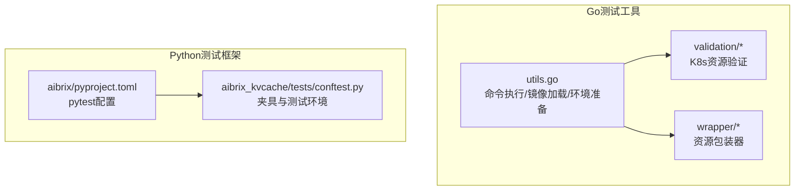
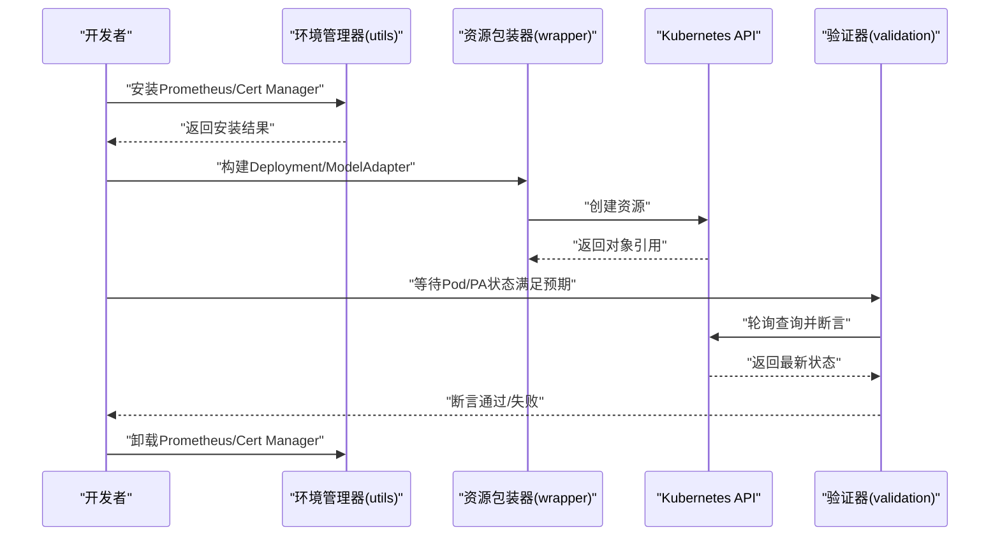
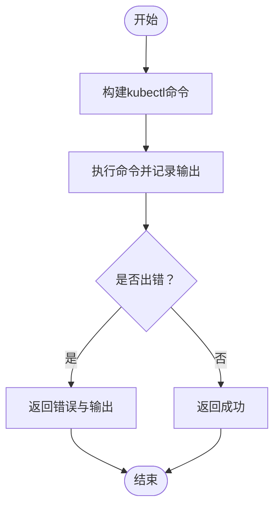
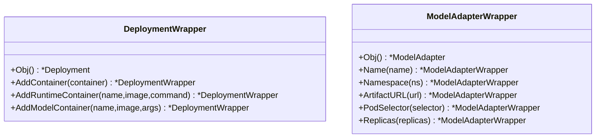
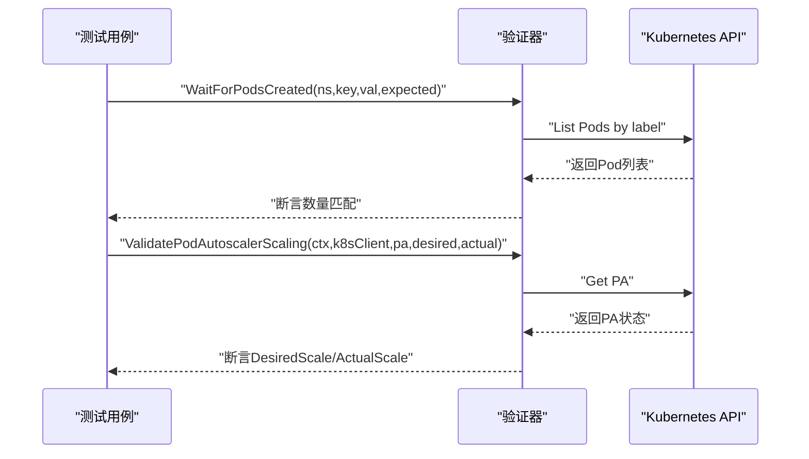
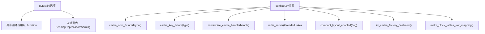
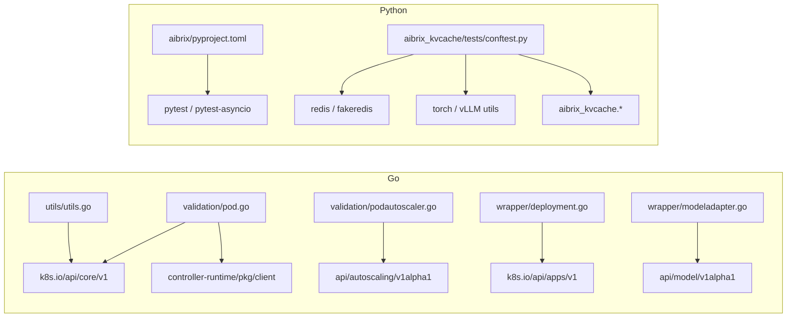

# 测试工具与辅助

<cite>
**本文引用的文件**
- [pyproject.toml](file://python/aibrix/pyproject.toml)
- [pyproject.toml](file://python/aibrix_kvcache/pyproject.toml)
- [utils.go](file://test/utils/utils.go)
- [pod.go](file://test/utils/validation/pod.go)
- [podautoscaler.go](file://test/utils/validation/podautoscaler.go)
- [deployment.go](file://test/utils/wrapper/deployment.go)
- [modeladapter.go](file://test/utils/wrapper/modeladapter.go)
- [conftest.py](file://python/aibrix_kvcache/tests/conftest.py)
</cite>

## 目录
1. [简介](#简介)
2. [项目结构](#项目结构)
3. [核心组件](#核心组件)
4. [架构总览](#架构总览)
5. [详细组件分析](#详细组件分析)
6. [依赖分析](#依赖分析)
7. [性能考虑](#性能考虑)
8. [故障排查指南](#故障排查指南)
9. [结论](#结论)
10. [附录](#附录)

## 简介
本文件面向AIBrix测试工具与辅助组件，系统化梳理测试工具集的设计理念与实现细节，覆盖以下方面：
- 通用测试工具的封装：命令执行、镜像加载、环境准备等
- 测试数据生成器：用于Kubernetes资源的构造与校验
- 测试环境管理器：证书管理、Prometheus Operator安装与卸载
- 验证工具：Kubernetes资源状态验证、Pod健康检查、控制器状态同步验证
- 测试包装器：资源操作封装、测试生命周期管理、异常处理机制
- Python测试框架配置与使用：pytest配置、测试夹具（fixture）、测试数据管理
- 测试环境配置指南：测试数据库设置、Mock服务配置、测试密钥管理

## 项目结构
本仓库包含两类测试相关体系：
- Go语言端的测试工具与验证器：位于test/utils下，提供Kubernetes资源验证与测试包装器
- Python测试框架与夹具：位于python/aibrix与python/aibrix_kvcache/tests中，提供pytest配置、夹具与测试用例

图表来源
- [utils.go:1-141](file://test/utils/utils.go#L1-L141)
- [pod.go:1-88](file://test/utils/validation/pod.go#L1-L88)
- [podautoscaler.go:1-199](file://test/utils/validation/podautoscaler.go#L1-L199)
- [deployment.go:1-231](file://test/utils/wrapper/deployment.go#L1-L231)
- [modeladapter.go:1-75](file://test/utils/wrapper/modeladapter.go#L1-L75)
- [pyproject.toml:133-138](file://python/aibrix/pyproject.toml#L133-L138)
- [conftest.py:1-269](file://python/aibrix_kvcache/tests/conftest.py#L1-L269)

章节来源
- [utils.go:1-141](file://test/utils/utils.go#L1-L141)
- [pyproject.toml:133-138](file://python/aibrix/pyproject.toml#L133-L138)

## 核心组件
- 通用测试工具封装
  - 命令执行与输出记录：统一在Ginkgo上下文中执行kubectl命令并记录日志
  - 镜像加载到Kind集群：支持自定义集群名，便于本地开发与CI
  - Prometheus Operator与Cert Manager安装/卸载：提供一键式环境准备与清理
- 测试数据生成器
  - Pod模板构造：快速生成带容器、探针、资源请求/限制的Pod模板
  - Deployment包装器：提供链式API构建Deployment，自动注入适配器存储卷与运行时容器
  - ModelAdapter包装器：以流式接口设置名称、命名空间、ArtifactURL、PodSelector、副本数等
- 验证工具
  - Pod验证：等待Pod创建、标记为就绪、构造最小可用Pod模板
  - PodAutoscaler验证：校验规格、条件存在性/状态、缩放历史、状态同步（DesiredScale/ActualScale）
- 测试环境管理器
  - 安装/卸载Prometheus Operator与Cert Manager
  - 获取项目根目录、过滤空行等辅助函数
- Python测试框架配置
  - pytest默认行为：异步循环作用域、警告过滤
  - aibrix_kvcache夹具：缓存配置、键类型、内存区域随机化、Redis服务器、紧凑布局开关、Flashinfer KV缓存工厂、块表与槽位映射构造

章节来源
- [utils.go:41-116](file://test/utils/utils.go#L41-L116)
- [pod.go:29-87](file://test/utils/validation/pod.go#L29-L87)
- [deployment.go:30-231](file://test/utils/wrapper/deployment.go#L30-L231)
- [modeladapter.go:25-75](file://test/utils/wrapper/modeladapter.go#L25-L75)
- [podautoscaler.go:30-199](file://test/utils/validation/podautoscaler.go#L30-L199)
- [pyproject.toml:133-138](file://python/aibrix/pyproject.toml#L133-L138)
- [conftest.py:86-269](file://python/aibrix_kvcache/tests/conftest.py#L86-L269)

## 架构总览
测试工具与验证器通过“环境准备—资源构造—状态验证—清理”的闭环流程支撑端到端测试。

图表来源
- [utils.go:41-104](file://test/utils/utils.go#L41-L104)
- [deployment.go:61-104](file://test/utils/wrapper/deployment.go#L61-L104)
- [modeladapter.go:31-75](file://test/utils/wrapper/modeladapter.go#L31-L75)
- [pod.go:29-58](file://test/utils/validation/pod.go#L29-L58)
- [podautoscaler.go:98-144](file://test/utils/validation/podautoscaler.go#L98-L144)

## 详细组件分析

### 环境管理器（utils）
- 设计要点
  - 统一命令执行入口，自动拼接工作目录与环境变量，记录命令与输出
  - 支持将本地镜像加载至Kind集群，可从环境变量读取集群名
  - 提供Prometheus Operator与Cert Manager的安装/卸载流程，并等待Webhook就绪
- 关键流程
  - 运行kubectl命令并捕获错误，失败时返回详细信息
  - 加载镜像时支持自定义集群名，兼容多集群场景
  - 安装后等待指定Deployment可用，避免后续测试因依赖未就绪而失败

图表来源
- [utils.go:49-67](file://test/utils/utils.go#L49-L67)

章节来源
- [utils.go:41-116](file://test/utils/utils.go#L41-L116)

### 资源包装器（wrapper）
- DeploymentWrapper
  - 提供链式API：添加容器、运行时容器、模型容器；自动注入适配器存储卷与探针
  - 默认值填充：终止路径、拉取策略、重启策略、资源请求/限制、探针参数
  - 返回底层对象指针，便于直接提交至Kubernetes
- ModelAdapterWrapper
  - 提供名称、命名空间、ArtifactURL、PodSelector、副本数等字段的流式设置
  - 返回底层对象指针，便于直接提交至Kubernetes

图表来源
- [deployment.go:30-231](file://test/utils/wrapper/deployment.go#L30-L231)
- [modeladapter.go:25-75](file://test/utils/wrapper/modeladapter.go#L25-L75)

章节来源
- [deployment.go:30-231](file://test/utils/wrapper/deployment.go#L30-L231)
- [modeladapter.go:25-75](file://test/utils/wrapper/modeladapter.go#L25-L75)

### 验证工具（validation）
- Pod验证
  - 等待指定标签的Pod数量达到期望值
  - 批量标记Pod为就绪，更新状态
  - 构造最小可用Pod模板，包含容器与标签
- PodAutoscaler验证
  - 校验规格字段（最小/最大副本、缩放策略）
  - 校验状态条件的存在性与状态，支持指定原因
  - 校验缩放历史长度与最新条目
  - 等待特定条件达到期望状态或原因
  - 等待资源创建/删除，获取最新版本

图表来源
- [pod.go:29-58](file://test/utils/validation/pod.go#L29-L58)
- [podautoscaler.go:98-144](file://test/utils/validation/podautoscaler.go#L98-L144)

章节来源
- [pod.go:29-87](file://test/utils/validation/pod.go#L29-L87)
- [podautoscaler.go:30-199](file://test/utils/validation/podautoscaler.go#L30-L199)

### Python测试框架配置与夹具（pytest）
- 配置要点
  - 异步默认循环作用域：function级别，确保每个测试用例独立的事件循环
  - 警告过滤：忽略特定第三方库的弃用警告，减少噪音
- 夹具（fixtures）
  - 缓存配置：按NCLD/LCND两种布局生成形状与块规范
  - 键类型：支持BlockHashes与TokenListView两种键类型，按块大小对齐
  - 内存区域随机化：为KV缓存句柄随机填充数据，便于一致性测试
  - Redis服务器：启动fake Redis服务，线程安全，测试结束后关闭
  - 紧凑布局开关：在测试前后切换紧凑布局标志，验证不同布局行为
  - Flashinfer KV缓存工厂：基于vLLM工具创建随机KV缓存
  - 块表与槽位映射：构造序列的块表与槽位映射，便于推理测试

图表来源
- [pyproject.toml:133-138](file://python/aibrix/pyproject.toml#L133-L138)
- [conftest.py:86-269](file://python/aibrix_kvcache/tests/conftest.py#L86-L269)

章节来源
- [pyproject.toml:133-138](file://python/aibrix/pyproject.toml#L133-L138)
- [conftest.py:1-269](file://python/aibrix_kvcache/tests/conftest.py#L1-L269)

## 依赖分析
- Go测试工具依赖
  - Kubernetes客户端与Gomega/Ginkgo：用于资源查询、状态断言与轮询
  - 控制器运行时客户端：用于访问Kubernetes API
- Python测试依赖
  - pytest与pytest-asyncio：异步测试支持
  - redis与fakeredis：模拟Redis服务
  - torch与vLLM工具：KV缓存与张量操作
  - aibrix_kvcache内部模块：缓存句柄、内存区域、规格定义等

图表来源
- [pod.go:19-27](file://test/utils/validation/pod.go#L19-L27)
- [podautoscaler.go:19-28](file://test/utils/validation/podautoscaler.go#L19-L28)
- [deployment.go:19-28](file://test/utils/wrapper/deployment.go#L19-L28)
- [modeladapter.go:19-23](file://test/utils/wrapper/modeladapter.go#L19-L23)
- [utils.go:19-26](file://test/utils/utils.go#L19-L26)
- [pyproject.toml:99-106](file://python/aibrix/pyproject.toml#L99-L106)
- [conftest.py:20-32](file://python/aibrix_kvcache/tests/conftest.py#L20-L32)

章节来源
- [pod.go:19-27](file://test/utils/validation/pod.go#L19-L27)
- [podautoscaler.go:19-28](file://test/utils/validation/podautoscaler.go#L19-L28)
- [deployment.go:19-28](file://test/utils/wrapper/deployment.go#L19-L28)
- [modeladapter.go:19-23](file://test/utils/wrapper/modeladapter.go#L19-L23)
- [utils.go:19-26](file://test/utils/utils.go#L19-L26)
- [pyproject.toml:99-106](file://python/aibrix/pyproject.toml#L99-L106)
- [conftest.py:20-32](file://python/aibrix_kvcache/tests/conftest.py#L20-L32)

## 性能考虑
- 轮询与超时
  - 验证器普遍采用Eventually进行轮询，建议根据资源规模调整超时与周期，避免过长等待或频繁轮询
- 资源请求/限制
  - 包装器已内置合理的CPU/内存请求与限制，建议结合实际负载调优，防止调度延迟或OOM
- 异步测试
  - Python侧使用pytest-asyncio，建议在测试中合理拆分异步任务，避免单点阻塞
- 缓存与内存
  - KV缓存测试中对内存区域进行随机化，有助于发现边界条件问题，但会增加初始化开销，可在CI中按需启用

## 故障排查指南
- 命令执行失败
  - 检查命令输出与返回码，确认kubectl可用与集群上下文正确
  - 确认GO111MODULE=on环境变量生效
- Prometheus/Cert Manager安装失败
  - 确认网络可达性与版本号正确
  - 安装后等待Webhook部署可用，避免后续资源校验失败
- Pod未就绪
  - 使用验证器批量标记为就绪，或检查探针路径与端口
  - 确认镜像拉取策略与资源限制合理
- PodAutoscaler状态不一致
  - 使用条件等待与缩放历史校验，定位控制器同步问题
  - 检查指标采集与阈值配置
- Python测试异常
  - 查看pytest配置中的警告过滤，必要时临时关闭以定位问题
  - Redis服务未启动：确认fake server线程已启动且端口可用

章节来源
- [utils.go:49-67](file://test/utils/utils.go#L49-L67)
- [pod.go:41-69](file://test/utils/validation/pod.go#L41-L69)
- [podautoscaler.go:130-161](file://test/utils/validation/podautoscaler.go#L130-L161)
- [pyproject.toml:133-138](file://python/aibrix/pyproject.toml#L133-L138)
- [conftest.py:133-152](file://python/aibrix_kvcache/tests/conftest.py#L133-L152)

## 结论
AIBrix测试工具与辅助组件通过“环境准备—资源构造—状态验证—清理”的闭环设计，提供了高内聚、低耦合的测试能力。Go侧的验证器与包装器聚焦Kubernetes资源的构造与断言，Python侧的pytest配置与夹具则覆盖了复杂场景下的数据与环境准备。建议在实际测试中结合资源规模与负载特性，合理设置轮询超时与资源配额，并充分利用夹具与包装器提升测试效率与稳定性。

## 附录
- 测试环境配置建议
  - 测试数据库：优先使用内存型或临时实例，测试结束后清理
  - Mock服务：使用fakeredis/faker等库在本地快速搭建
  - 测试密钥管理：通过环境变量注入，避免硬编码；在CI中使用受控的密钥管理服务
  - 日志与追踪：统一输出到GinkgoWriter或pytest日志，便于问题定位