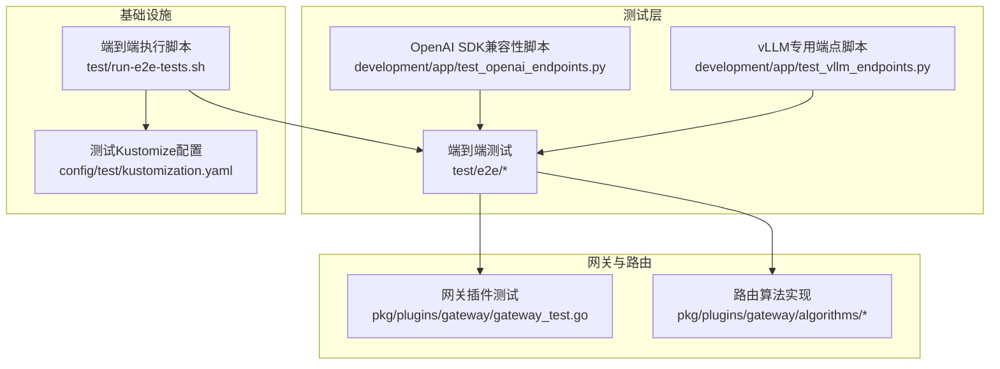
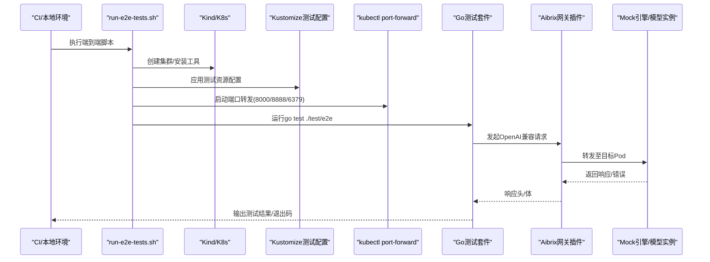
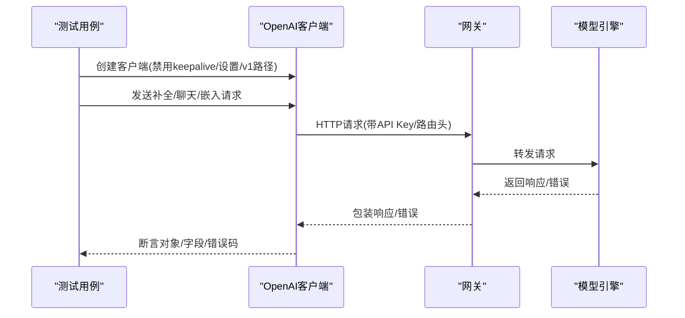
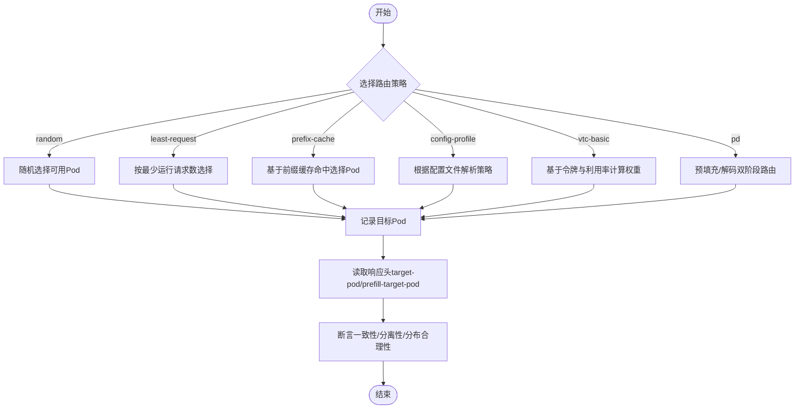
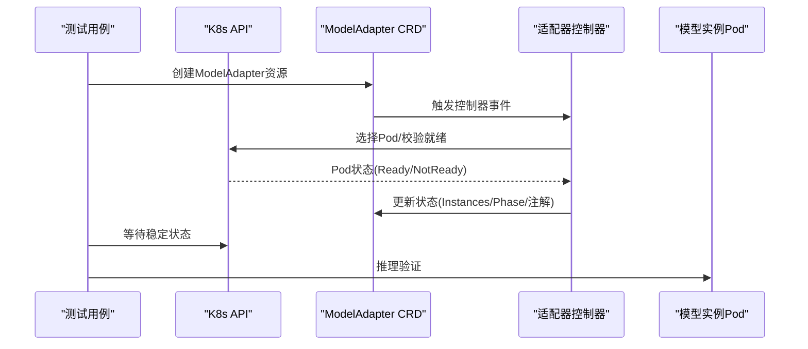
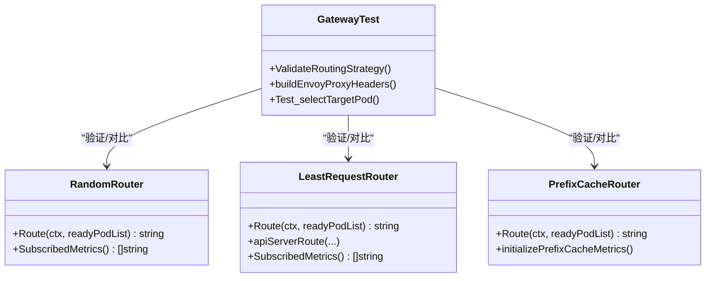
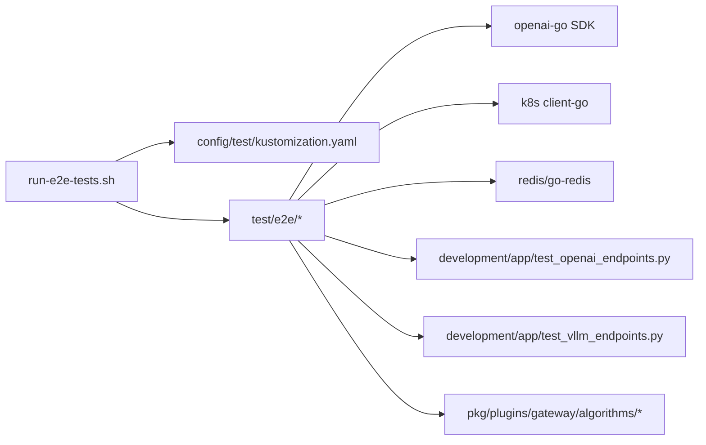

# 端到端测试

<cite>
**本文引用的文件**
- [run-e2e-tests.sh](file://test/run-e2e-tests.sh)
- [e2e_test.go](file://test/e2e/e2e_test.go)
- [openai_api_compatibility_test.go](file://test/e2e/openai_api_compatibility_test.go)
- [routing_strategy_test.go](file://test/e2e/routing_strategy_test.go)
- [util.go](file://test/e2e/util.go)
- [model_adapter_test.go](file://test/e2e/model_adapter_test.go)
- [pd_test.go](file://test/e2e/pd_test.go)
- [routing_config_profile_test.go](file://test/e2e/routing_config_profile_test.go)
- [vtc_routing_test.go](file://test/e2e/vtc_routing_test.go)
- [kustomization.yaml](file://config/test/kustomization.yaml)
- [test_openai_endpoints.py](file://development/app/test_openai_endpoints.py)
- [test_vllm_endpoints.py](file://development/app/test_vllm_endpoints.py)
- [gateway_test.go](file://pkg/plugins/gateway/gateway_test.go)
- [random.go](file://pkg/plugins/gateway/algorithms/random.go)
- [least_request.go](file://pkg/plugins/gateway/algorithms/least_request.go)
- [prefix_cache.go](file://pkg/plugins/gateway/algorithms/prefix_cache.go)
</cite>

## 目录
1. [简介](#简介)
2. [项目结构](#项目结构)
3. [核心组件](#核心组件)
4. [架构总览](#架构总览)
5. [详细组件分析](#详细组件分析)
6. [依赖分析](#依赖分析)
7. [性能考虑](#性能考虑)
8. [故障排除指南](#故障排除指南)
9. [结论](#结论)
10. [附录](#附录)

## 简介
本技术文档面向AIBrix端到端测试体系，系统阐述测试架构设计与实现细节，覆盖测试环境搭建、测试数据准备、测试执行流程、OpenAI API兼容性测试、路由策略测试（含负载均衡、故障转移、性能基准）、自动化执行策略（CI/CD集成、并行执行、结果分析），以及调试与故障排除方法。文档以代码为依据，结合可视化图示帮助读者快速理解端到端测试在AIBrix中的落地方式。

## 项目结构
端到端测试主要位于test/e2e目录，配套有测试脚本、工具函数与Kubernetes测试配置；同时包含开发阶段的Python兼容性测试脚本与路由算法单元测试，用于支撑网关插件路由能力的验证。

图表来源
- [run-e2e-tests.sh:1-149](file://test/run-e2e-tests.sh#L1-L149)
- [kustomization.yaml:1-18](file://config/test/kustomization.yaml#L1-L18)
- [gateway_test.go:1-200](file://pkg/plugins/gateway/gateway_test.go#L1-L200)
- [random.go:1-62](file://pkg/plugins/gateway/algorithms/random.go#L1-L62)
- [least_request.go:1-200](file://pkg/plugins/gateway/algorithms/least_request.go#L1-L200)
- [prefix_cache.go:1-200](file://pkg/plugins/gateway/algorithms/prefix_cache.go#L1-L200)

章节来源
- [run-e2e-tests.sh:1-149](file://test/run-e2e-tests.sh#L1-L149)
- [kustomization.yaml:1-18](file://config/test/kustomization.yaml#L1-L18)

## 核心组件
- 测试执行入口与环境管理：通过脚本统一创建Kind集群、安装依赖、加载镜像、部署测试资源、启动端口转发、运行测试并清理资源。
- OpenAI API兼容性测试：覆盖非流式与流式补全、聊天补全、嵌入向量、错误码返回格式一致性等。
- 路由策略测试：随机、最少请求、前缀缓存、配置文件路由策略、VTC（基于令牌与利用率）路由。
- 模型适配器测试：验证多副本、重试机制、就绪校验、失败切换与注解状态。
- PD（Prefill-Decode）拆分路由测试：验证预填充与解码阶段的路由分离与头部信息。
- 工具与客户端：封装OpenAI客户端、K8s Informer、目标Pod选择逻辑与等待策略。

章节来源
- [e2e_test.go:1-122](file://test/e2e/e2e_test.go#L1-L122)
- [openai_api_compatibility_test.go:1-516](file://test/e2e/openai_api_compatibility_test.go#L1-L516)
- [routing_strategy_test.go:1-231](file://test/e2e/routing_strategy_test.go#L1-L231)
- [util.go:1-203](file://test/e2e/util.go#L1-L203)
- [model_adapter_test.go:1-459](file://test/e2e/model_adapter_test.go#L1-L459)
- [pd_test.go:1-132](file://test/e2e/pd_test.go#L1-L132)
- [routing_config_profile_test.go:1-90](file://test/e2e/routing_config_profile_test.go#L1-L90)
- [vtc_routing_test.go:1-560](file://test/e2e/vtc_routing_test.go#L1-L560)

## 架构总览
端到端测试从本地或CI环境启动Kubernetes集群，部署AIBrix测试资源（含网关插件、元数据服务、依赖组件），通过kubectl port-forward暴露后端服务，Go测试用例使用OpenAI SDK发起请求，验证响应格式、错误码与路由行为，并通过K8s API与Redis（用于VTC）进行状态观测与断言。

图表来源
- [run-e2e-tests.sh:32-148](file://test/run-e2e-tests.sh#L32-L148)
- [kustomization.yaml:7-17](file://config/test/kustomization.yaml#L7-L17)
- [util.go:94-133](file://test/e2e/util.go#L94-L133)

## 详细组件分析

### OpenAI API兼容性测试
该模块验证AIBrix对OpenAI API的兼容性，包括：
- 非流式与流式补全/聊天补全的响应字段完整性与类型正确性
- 多轮对话流式响应的增量内容拼接
- 认证失败与参数缺失等错误场景的错误码与消息格式
- 嵌入向量接口的单输入/多输入/自定义维度/批量处理等场景
- 取消与上下文取消的流式处理行为

图表来源
- [openai_api_compatibility_test.go:29-108](file://test/e2e/openai_api_compatibility_test.go#L29-L108)
- [openai_api_compatibility_test.go:262-348](file://test/e2e/openai_api_compatibility_test.go#L262-L348)
- [openai_api_compatibility_test.go:354-447](file://test/e2e/openai_api_compatibility_test.go#L354-L447)
- [util.go:94-133](file://test/e2e/util.go#L94-L133)

章节来源
- [openai_api_compatibility_test.go:1-516](file://test/e2e/openai_api_compatibility_test.go#L1-L516)
- [util.go:94-133](file://test/e2e/util.go#L94-L133)

### 路由策略测试
覆盖多种路由策略与场景：
- 随机路由：通过卡方检验验证目标Pod分布是否接近均匀
- 最少请求数路由：基于实时运行中请求数选择目标Pod，无指标时回退随机
- 前缀缓存路由：相同前缀命中同一Pod，不同前缀可切换到其他Pod，支持多轮对话一致性
- 配置文件路由策略：根据config-profile头选择默认或指定策略
- VTC路由：基于用户令牌历史与Pod利用率的公平性与平衡性测试
- PD拆分路由：预填充与解码阶段分别路由到不同Pod，并返回相应响应头

图表来源
- [routing_strategy_test.go:38-120](file://test/e2e/routing_strategy_test.go#L38-L120)
- [routing_strategy_test.go:123-176](file://test/e2e/routing_strategy_test.go#L123-L176)
- [routing_config_profile_test.go:41-89](file://test/e2e/routing_config_profile_test.go#L41-L89)
- [vtc_routing_test.go:185-234](file://test/e2e/vtc_routing_test.go#L185-L234)
- [vtc_routing_test.go:345-420](file://test/e2e/vtc_routing_test.go#L345-L420)
- [pd_test.go:30-59](file://test/e2e/pd_test.go#L30-L59)

章节来源
- [routing_strategy_test.go:1-231](file://test/e2e/routing_strategy_test.go#L1-L231)
- [routing_config_profile_test.go:1-90](file://test/e2e/routing_config_profile_test.go#L1-L90)
- [vtc_routing_test.go:1-560](file://test/e2e/vtc_routing_test.go#L1-L560)
- [pd_test.go:1-132](file://test/e2e/pd_test.go#L1-L132)

### 模型适配器测试
验证模型适配器在多副本、重试、就绪校验、失败切换与注解状态方面的行为，确保控制器能够正确调度与恢复实例，并支持推理调用。

图表来源
- [model_adapter_test.go:41-79](file://test/e2e/model_adapter_test.go#L41-L79)
- [model_adapter_test.go:81-129](file://test/e2e/model_adapter_test.go#L81-L129)
- [model_adapter_test.go:131-236](file://test/e2e/model_adapter_test.go#L131-L236)
- [model_adapter_test.go:238-292](file://test/e2e/model_adapter_test.go#L238-L292)
- [model_adapter_test.go:294-356](file://test/e2e/model_adapter_test.go#L294-L356)
- [model_adapter_test.go:358-419](file://test/e2e/model_adapter_test.go#L358-L419)

章节来源
- [model_adapter_test.go:1-459](file://test/e2e/model_adapter_test.go#L1-L459)

### 网关插件与路由算法单元测试
网关插件测试覆盖路由策略校验、Envoy代理头构建、目标Pod选择等逻辑；路由算法实现位于algorithms目录，包含随机、最少请求、前缀缓存等策略。

图表来源
- [gateway_test.go:45-83](file://pkg/plugins/gateway/gateway_test.go#L45-L83)
- [gateway_test.go:85-96](file://pkg/plugins/gateway/gateway_test.go#L85-L96)
- [gateway_test.go:98-200](file://pkg/plugins/gateway/gateway_test.go#L98-L200)
- [random.go:38-57](file://pkg/plugins/gateway/algorithms/random.go#L38-L57)
- [least_request.go:35-77](file://pkg/plugins/gateway/algorithms/least_request.go#L35-L77)
- [prefix_cache.go:157-179](file://pkg/plugins/gateway/algorithms/prefix_cache.go#L157-L179)

章节来源
- [gateway_test.go:1-200](file://pkg/plugins/gateway/gateway_test.go#L1-L200)
- [random.go:1-62](file://pkg/plugins/gateway/algorithms/random.go#L1-L62)
- [least_request.go:1-200](file://pkg/plugins/gateway/algorithms/least_request.go#L1-L200)
- [prefix_cache.go:1-200](file://pkg/plugins/gateway/algorithms/prefix_cache.go#L1-L200)

## 依赖分析
端到端测试依赖关系如下：
- 测试脚本依赖Kubernetes与Kind工具、Kustomize配置与kubectl
- Go测试依赖OpenAI SDK、K8s客户端库、Envoy扩展处理器相关库
- 路由策略测试依赖Redis（VTC场景）
- Python脚本作为补充验证OpenAI SDK与vLLM专用端点

图表来源
- [run-e2e-tests.sh:32-69](file://test/run-e2e-tests.sh#L32-L69)
- [kustomization.yaml:7-17](file://config/test/kustomization.yaml#L7-L17)
- [openai_api_compatibility_test.go:19-27](file://test/e2e/openai_api_compatibility_test.go#L19-L27)
- [vtc_routing_test.go:30-35](file://test/e2e/vtc_routing_test.go#L30-L35)
- [test_openai_endpoints.py:21-27](file://development/app/test_openai_endpoints.py#L21-L27)
- [test_vllm_endpoints.py:16-22](file://development/app/test_vllm_endpoints.py#L16-L22)

章节来源
- [run-e2e-tests.sh:1-149](file://test/run-e2e-tests.sh#L1-L149)
- [kustomization.yaml:1-18](file://config/test/kustomization.yaml#L1-L18)

## 性能考虑
- 流式处理与取消：测试覆盖流式响应的增量拼接与取消后的错误处理，避免长时间占用连接与资源。
- 负载均衡与统计显著性：随机路由测试采用卡方检验与多次重试降低统计波动影响。
- VTC路由权重：利用令牌数与利用率的组合权重，兼顾公平性与资源利用率，避免单一Pod过载。
- 超时与重试：客户端禁用keep-alive与缓存，减少并发干扰；部分场景设置最大重试次数为0以保证可重复性。
- 并发与稳定性：通过K8s Informer与等待策略确保Pod就绪与状态同步后再发起请求。

## 故障排除指南
- 环境准备问题
  - 检查Kind/K8s版本与kubectl安装；确认KUBECONFIG已设置或脚本生成临时配置。
  - 若资源应用失败，检查config/test下的补丁是否匹配目标Deployment名称与命名空间。
- 端口转发与连通性
  - 确认端口转发进程PID文件存在且未被占用；必要时手动清理旧进程。
  - 使用脚本内置的日志收集功能输出aibrix-system命名空间下所有Pod日志。
- 路由策略异常
  - 随机路由分布不均：增加迭代次数或放宽显著性阈值；检查可用Pod数量。
  - VTC路由不稳定：确保Redis连接正常，发布pod_metrics_refresh触发指标刷新。
- 错误码与格式
  - 401/400错误需与OpenAI错误结构一致；若消息内容不匹配但状态码正确，可接受差异。
- 模型适配器
  - 多副本与失败切换：观察注解（如scheduled-pods）与实例列表变化；确认Pod就绪条件。
  - 重试注解：检查retry-count与last-retry-time注解的数值与时间格式。

章节来源
- [run-e2e-tests.sh:73-134](file://test/run-e2e-tests.sh#L73-L134)
- [vtc_routing_test.go:70-85](file://test/e2e/vtc_routing_test.go#L70-L85)
- [model_adapter_test.go:131-236](file://test/e2e/model_adapter_test.go#L131-L236)

## 结论
AIBrix端到端测试体系以脚本化环境管理为基础，结合OpenAI API兼容性与多路由策略验证，辅以模型适配器与PD/VTC专项测试，形成覆盖请求生命周期、路由决策与资源调度的完整闭环。通过K8s与Redis观测、统计检验与严格断言，确保系统在真实生产场景下的稳定性与一致性。

## 附录
- 自动化执行建议
  - CI集成：在流水线中复用run-e2e-tests.sh，设置KIND_E2E与INSTALL_AIBRIX变量以控制集群与镜像加载。
  - 并行执行：将不同测试子集拆分为多个Job并行运行，注意共享资源（如Redis）的隔离。
  - 结果分析：结合脚本退出码与测试报告，结合日志与Pod状态进行根因分析。
- 开发辅助
  - Python兼容性脚本可用于独立验证OpenAI SDK与vLLM专用端点，便于快速回归。
  - 网关插件单元测试有助于定位路由算法与头处理问题。