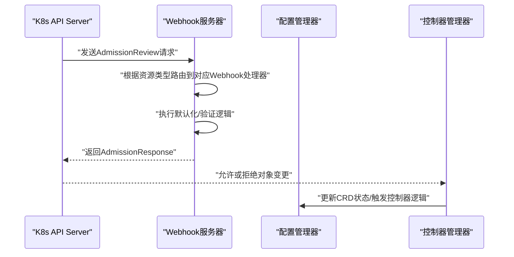
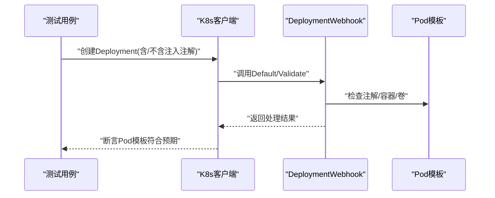
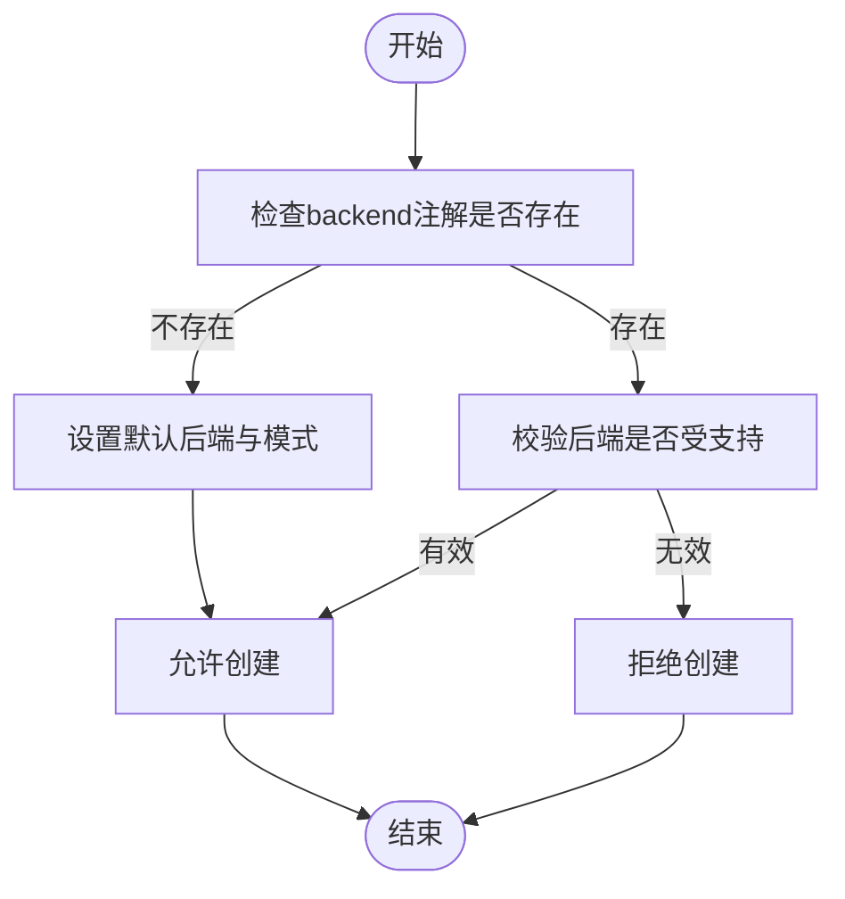
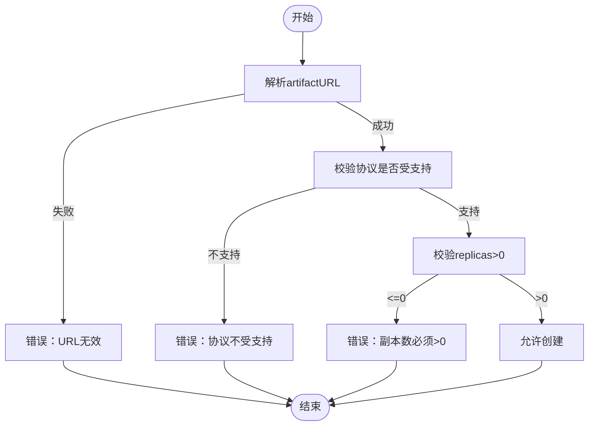
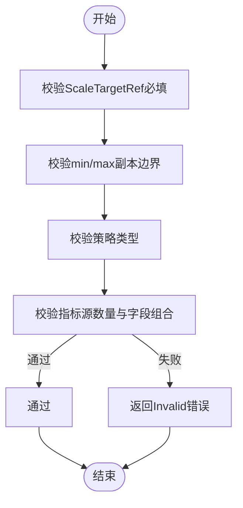
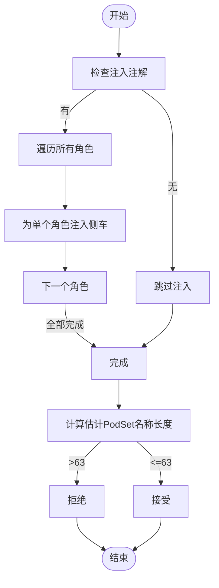
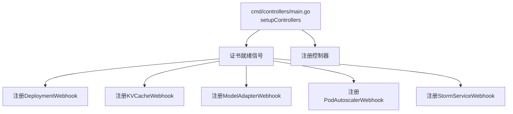

# Webhook集成测试

<cite>
**本文档引用的文件**
- [deployment_webhook.go](file://pkg/webhook/deployment_webhook.go)
- [kvcache_webhook.go](file://pkg/webhook/kvcache_webhook.go)
- [modeladapter_webhook.go](file://pkg/webhook/modeladapter_webhook.go)
- [podautoscaler_webhook.go](file://pkg/webhook/podautoscaler_webhook.go)
- [stormservice_webhook.go](file://pkg/webhook/stormservice_webhook.go)
- [podautoscaler_webhook_test.go](file://pkg/webhook/podautoscaler_webhook_test.go)
- [suit_test.go](file://test/integration/webhook/suit_test.go)
- [deployment_webhook_test.go](file://test/integration/webhook/deployment_webhook_test.go)
- [kvcache_webhook_test.go](file://test/integration/webhook/kvcache_webhook_test.go)
- [modeladapter_test.go](file://test/integration/webhook/modeladapter_test.go)
- [stormservice_webhook_test.go](file://test/integration/webhook/stormservice_webhook_test.go)
- [manifests.yaml](file://config/webhook/manifests.yaml)
- [service.yaml](file://config/webhook/service.yaml)
- [main.go](file://cmd/controllers/main.go)
</cite>

## 目录
1. [简介](#简介)
2. [项目结构](#项目结构)
3. [核心组件](#核心组件)
4. [架构概览](#架构概览)
5. [详细组件分析](#详细组件分析)
6. [依赖关系分析](#依赖关系分析)
7. [性能考虑](#性能考虑)
8. [故障排查指南](#故障排查指南)
9. [结论](#结论)
10. [附录](#附录)

## 简介
本文件为AIBrix Webhook集成测试的全面技术文档，覆盖入站（Mutating/Validating）与出站Webhook的测试策略与实现细节。重点包括：
- Webhook触发条件与事件处理流程
- 各类Webhook类型（Deployment、KVCache、ModelAdapter、PodAutoscaler、StormService）的测试方法
- 错误场景测试（异常处理、重试机制、故障恢复）
- 测试工具链（Webhook客户端测试、事件模拟、状态验证）
- 测试环境配置（Webhook服务器搭建、证书配置、测试数据准备）

## 项目结构
Webhook相关代码主要位于以下位置：
- 入口与控制器注册：cmd/controllers/main.go
- Webhook实现：pkg/webhook/*.go
- 集成测试：test/integration/webhook/*.go
- Webhook清单与服务：config/webhook/*.yaml

```mermaid
graph TB
subgraph "入口与控制器"
MAIN["cmd/controllers/main.go<br/>注册Webhook与控制器"]
end
subgraph "Webhook实现"
DEP["pkg/webhook/deployment_webhook.go"]
KVC["pkg/webhook/kvcache_webhook.go"]
MAD["pkg/webhook/modeladapter_webhook.go"]
PA["pkg/webhook/podautoscaler_webhook.go"]
SS["pkg/webhook/stormservice_webhook.go"]
end
subgraph "集成测试"
SUIT["test/integration/webhook/suit_test.go"]
T_DEP["test/integration/webhook/deployment_webhook_test.go"]
T_KVC["test/integration/webhook/kvcache_webhook_test.go"]
T_MAD["test/integration/webhook/modeladapter_test.go"]
T_PA["test/integration/webhook/podautoscaler_webhook_test.go"]
T_SS["test/integration/webhook/stormservice_webhook_test.go"]
end
subgraph "配置"
MAN["config/webhook/manifests.yaml"]
SVC["config/webhook/service.yaml"]
end
MAIN --> DEP
MAIN --> KVC
MAIN --> MAD
MAIN --> PA
MAIN --> SS
SUIT --> DEP
SUIT --> KVC
SUIT --> MAD
SUIT --> PA
SUIT --> SS
MAN --> SVC
```

**图表来源**
- [main.go:321-359](file://cmd/controllers/main.go#L321-L359)
- [deployment_webhook.go:34-40](file://pkg/webhook/deployment_webhook.go#L34-L40)
- [kvcache_webhook.go:38-44](file://pkg/webhook/kvcache_webhook.go#L38-L44)
- [modeladapter_webhook.go:36-43](file://pkg/webhook/modeladapter_webhook.go#L36-L43)
- [podautoscaler_webhook.go:40-46](file://pkg/webhook/podautoscaler_webhook.go#L40-L46)
- [stormservice_webhook.go:34-40](file://pkg/webhook/stormservice_webhook.go#L34-L40)
- [manifests.yaml:1-213](file://config/webhook/manifests.yaml#L1-L213)
- [service.yaml:1-20](file://config/webhook/service.yaml#L1-L20)

**章节来源**
- [main.go:321-359](file://cmd/controllers/main.go#L321-L359)
- [manifests.yaml:1-213](file://config/webhook/manifests.yaml#L1-L213)
- [service.yaml:1-20](file://config/webhook/service.yaml#L1-L20)

## 核心组件
本节概述各Webhook组件的职责与触发条件。

- Deployment Webhook
  - 触发：apps/v1/Deployment 创建/更新
  - 功能：在存在注入注解时，向Pod模板注入aibrix-runtime侧车容器，并确保共享卷挂载
  - 关键路径：[SetupDeploymentWebhookWithManager:34-40](file://pkg/webhook/deployment_webhook.go#L34-L40)，[Default:49-70](file://pkg/webhook/deployment_webhook.go#L49-L70)

- KVCache Webhook
  - 触发：orchestration.aibrix.ai/v1alpha1/KVCache 创建/更新
  - 功能：默认化后端与模式注解；校验后端有效性
  - 关键路径：[SetupKVCacheWebhookWithManager:38-44](file://pkg/webhook/kvcache_webhook.go#L38-L44)，[Default:58-79](file://pkg/webhook/kvcache_webhook.go#L58-L79)，[ValidateCreate:96-108](file://pkg/webhook/kvcache_webhook.go#L96-L108)

- ModelAdapter Webhook
  - 触发：model.aibrix.ai/v1alpha1/ModelAdapter 创建/更新
  - 功能：校验artifactURL格式与副本数；默认化为空实现
  - 关键路径：[SetupModelAdapterWebhook:36-43](file://pkg/webhook/modeladapter_webhook.go#L36-L43)，[ValidateCreate:58-78](file://pkg/webhook/modeladapter_webhook.go#L58-L78)

- PodAutoscaler Webhook
  - 触发：autoscaling.aibrix.ai/v1alpha1/PodAutoscaler 创建/更新
  - 功能：校验ScaleTargetRef、副本边界、策略类型与指标源字段组合
  - 关键路径：[SetupPodAutoscalerWebhookWithManager:40-46](file://pkg/webhook/podautoscaler_webhook.go#L40-L46)，[validatePodAutoscaler:119-250](file://pkg/webhook/podautoscaler_webhook.go#L119-L250)

- StormService Webhook
  - 触发：orchestration.aibrix.ai/v1alpha1/StormService 创建/更新
  - 功能：在存在注入注解时，为每个角色的Pod模板注入aibrix-runtime侧车容器；校验名称长度与PodSet命名约束
  - 关键路径：[SetupStormServiceWebhookWithManager:34-40](file://pkg/webhook/stormservice_webhook.go#L34-L40)，[Default:49-70](file://pkg/webhook/stormservice_webhook.go#L49-L70)，[ValidateCreate:167-205](file://pkg/webhook/stormservice_webhook.go#L167-L205)

**章节来源**
- [deployment_webhook.go:34-170](file://pkg/webhook/deployment_webhook.go#L34-L170)
- [kvcache_webhook.go:38-119](file://pkg/webhook/kvcache_webhook.go#L38-L119)
- [modeladapter_webhook.go:36-89](file://pkg/webhook/modeladapter_webhook.go#L36-L89)
- [podautoscaler_webhook.go:40-250](file://pkg/webhook/podautoscaler_webhook.go#L40-L250)
- [stormservice_webhook.go:34-218](file://pkg/webhook/stormservice_webhook.go#L34-L218)

## 架构概览
Webhook系统通过Kubernetes Admission Controller在API Server层面拦截请求，执行默认化与验证逻辑。控制器启动时等待证书就绪，随后注册各类Webhook并启动本地Webhook服务器。

**图表来源**
- [main.go:220-225](file://cmd/controllers/main.go#L220-L225)
- [main.go:303-312](file://cmd/controllers/main.go#L303-L312)
- [manifests.yaml:1-213](file://config/webhook/manifests.yaml#L1-L213)

**章节来源**
- [main.go:220-225](file://cmd/controllers/main.go#L220-L225)
- [main.go:303-312](file://cmd/controllers/main.go#L303-L312)
- [manifests.yaml:1-213](file://config/webhook/manifests.yaml#L1-L213)

## 详细组件分析

### Deployment Webhook测试
- 测试目标
  - 注解驱动的侧车注入行为
  - 默认镜像与运行参数注入
  - 已存在侧车容器的幂等性
- 测试策略
  - 使用Ginkgo/Gomega进行表驱动测试
  - 通过wrapper构造Deployment对象，对比创建后的Pod模板
- 关键断言
  - 未设置注入注解时不修改对象
  - 设置注入注解时，检查侧车容器、共享卷与挂载
  - 支持自定义运行时镜像注解
- 错误场景
  - 重复注入应被忽略（幂等性）
  - 缺失必要注解时不应触发注入

**图表来源**
- [deployment_webhook_test.go:54-156](file://test/integration/webhook/deployment_webhook_test.go#L54-L156)
- [deployment_webhook.go:49-170](file://pkg/webhook/deployment_webhook.go#L49-L170)

**章节来源**
- [deployment_webhook_test.go:54-156](file://test/integration/webhook/deployment_webhook_test.go#L54-L156)
- [deployment_webhook.go:49-170](file://pkg/webhook/deployment_webhook.go#L49-L170)

### KVCache Webhook测试
- 测试目标
  - 注解默认化：后端与模式
  - 后端有效性校验
- 测试策略
  - 表驱动测试覆盖多种注解组合
  - 断言创建成功/失败的预期行为
- 关键断言
  - 未指定后端时自动填充默认值
  - 不支持的后端导致创建失败
  - 模式注解可推导后端

**图表来源**
- [kvcache_webhook_test.go:59-154](file://test/integration/webhook/kvcache_webhook_test.go#L59-L154)
- [kvcache_webhook.go:58-119](file://pkg/webhook/kvcache_webhook.go#L58-L119)

**章节来源**
- [kvcache_webhook_test.go:59-154](file://test/integration/webhook/kvcache_webhook_test.go#L59-L154)
- [kvcache_webhook.go:58-119](file://pkg/webhook/kvcache_webhook.go#L58-L119)

### ModelAdapter Webhook测试
- 测试目标
  - artifactURL格式校验
  - 副本数约束
  - 支持的存储协议校验
- 测试策略
  - 覆盖正常与异常输入
  - 断言创建成功或抛出错误
- 关键断言
  - 无效URL格式拒绝
  - 空URL拒绝
  - 副本数<=0拒绝
  - 不支持的schema拒绝

**图表来源**
- [modeladapter_test.go:57-128](file://test/integration/webhook/modeladapter_test.go#L57-L128)
- [modeladapter_webhook.go:58-89](file://pkg/webhook/modeladapter_webhook.go#L58-L89)

**章节来源**
- [modeladapter_test.go:57-128](file://test/integration/webhook/modeladapter_test.go#L57-L128)
- [modeladapter_webhook.go:58-89](file://pkg/webhook/modeladapter_webhook.go#L58-L89)

### PodAutoscaler Webhook测试
- 测试目标
  - 规范化与验证：ScaleTargetRef、副本边界、策略类型、指标源
- 测试策略
  - 单元测试覆盖数值边界与字段组合
  - 断言错误消息包含预期关键字
- 关键断言
  - TargetValue必须为正数且可解析
  - 仅允许一种指标源
  - 不同指标源类型要求不同字段组合

**图表来源**
- [podautoscaler_webhook_test.go:28-131](file://pkg/webhook/podautoscaler_webhook_test.go#L28-L131)
- [podautoscaler_webhook.go:119-250](file://pkg/webhook/podautoscaler_webhook.go#L119-L250)

**章节来源**
- [podautoscaler_webhook_test.go:28-131](file://pkg/webhook/podautoscaler_webhook_test.go#L28-L131)
- [podautoscaler_webhook.go:119-250](file://pkg/webhook/podautoscaler_webhook.go#L119-L250)

### StormService Webhook测试
- 测试目标
  - 侧车注入：按角色逐个注入
  - 名称长度与PodSet命名约束
- 测试策略
  - 多角色场景与边界长度计算
  - 断言创建成功/失败
- 关键断言
  - 未设置注入注解时不修改
  - 设置注解时为每个角色注入侧车
  - 组合名称超过63字符时拒绝

**图表来源**
- [stormservice_webhook_test.go:67-212](file://test/integration/webhook/stormservice_webhook_test.go#L67-L212)
- [stormservice_webhook.go:49-218](file://pkg/webhook/stormservice_webhook.go#L49-L218)

**章节来源**
- [stormservice_webhook_test.go:67-212](file://test/integration/webhook/stormservice_webhook_test.go#L67-L212)
- [stormservice_webhook.go:49-218](file://pkg/webhook/stormservice_webhook.go#L49-L218)

## 依赖关系分析
Webhook注册与控制器启动的耦合关系如下：

**图表来源**
- [main.go:321-359](file://cmd/controllers/main.go#L321-L359)

**章节来源**
- [main.go:321-359](file://cmd/controllers/main.go#L321-L359)

## 性能考虑
- Webhook处理应保持轻量：避免在Default/Validate中执行阻塞操作
- 使用本地Webhook服务器时，注意TLS握手开销与连接池复用
- 在大规模并发创建/更新场景下，建议启用适当的超时与重试策略

## 故障排查指南
- Webhook未生效
  - 检查证书是否就绪：[ready检查:303-312](file://cmd/controllers/main.go#L303-L312)
  - 确认Webhook服务端口与路径正确：[Service配置:14-18](file://config/webhook/service.yaml#L14-L18)，[Mutating/Validating配置:1-213](file://config/webhook/manifests.yaml#L1-L213)
- 创建失败但无明确错误
  - 查看Webhook日志与AdmissionReview响应
  - 使用单元测试定位具体校验规则：[PodAutoscaler校验测试:28-131](file://pkg/webhook/podautoscaler_webhook_test.go#L28-L131)
- 侧车未注入
  - 确认注解键名与值：[注解常量与注入逻辑:56-70](file://pkg/webhook/deployment_webhook.go#L56-L70)，[StormService注入:56-70](file://pkg/webhook/stormservice_webhook.go#L56-L70)

**章节来源**
- [main.go:303-312](file://cmd/controllers/main.go#L303-L312)
- [service.yaml:14-18](file://config/webhook/service.yaml#L14-L18)
- [manifests.yaml:1-213](file://config/webhook/manifests.yaml#L1-L213)
- [podautoscaler_webhook_test.go:28-131](file://pkg/webhook/podautoscaler_webhook_test.go#L28-L131)
- [deployment_webhook.go:56-70](file://pkg/webhook/deployment_webhook.go#L56-L70)
- [stormservice_webhook.go:56-70](file://pkg/webhook/stormservice_webhook.go#L56-L70)

## 结论
本文档提供了AIBrix Webhook集成测试的完整方法论与实现细节，涵盖从架构设计到具体测试用例的全流程。通过统一的测试框架与严格的断言策略，能够有效保障Webhook在生产环境中的稳定性与一致性。

## 附录
- 测试环境配置要点
  - 使用envtest启动本地K8s环境与Webhook安装：[测试套件初始化:68-161](file://test/integration/webhook/suit_test.go#L68-L161)
  - 通过Ginkgo/Gomega组织测试用例，确保可读性与可维护性
  - 使用wrapper工具快速构造CRD对象，减少样板代码

**章节来源**
- [suit_test.go:68-161](file://test/integration/webhook/suit_test.go#L68-L161)