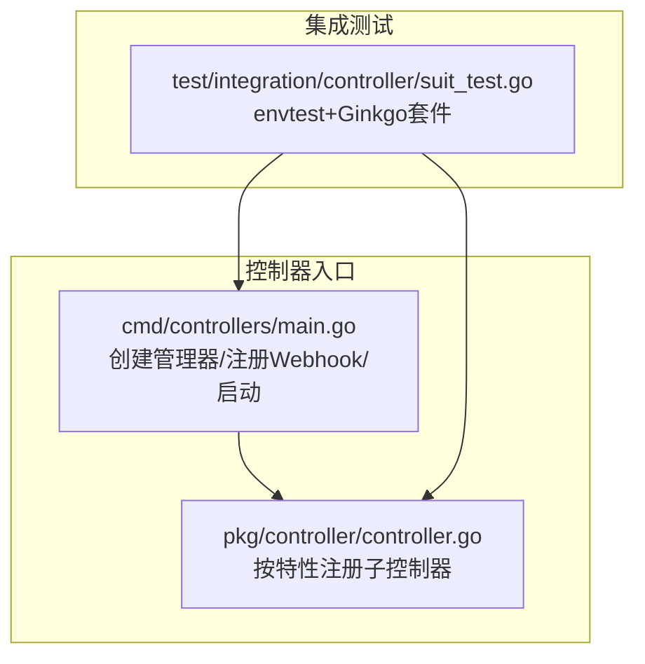
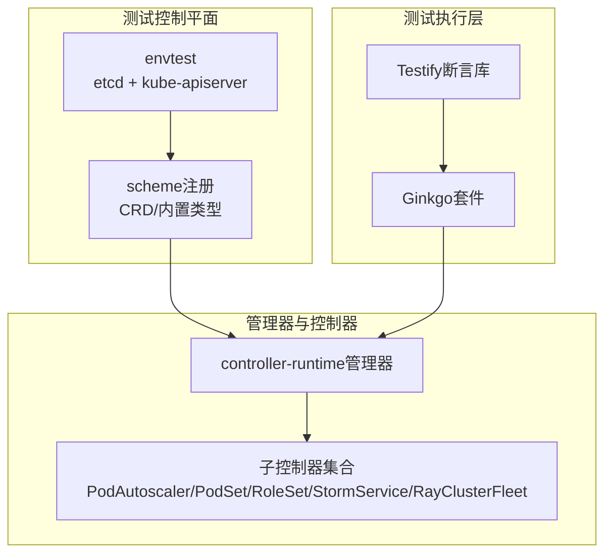
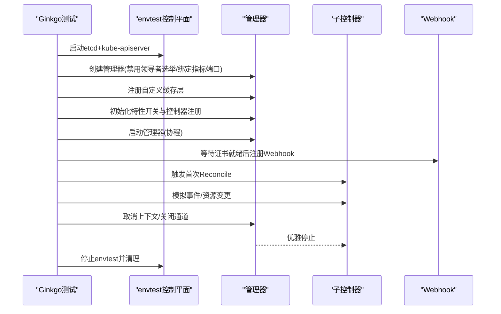
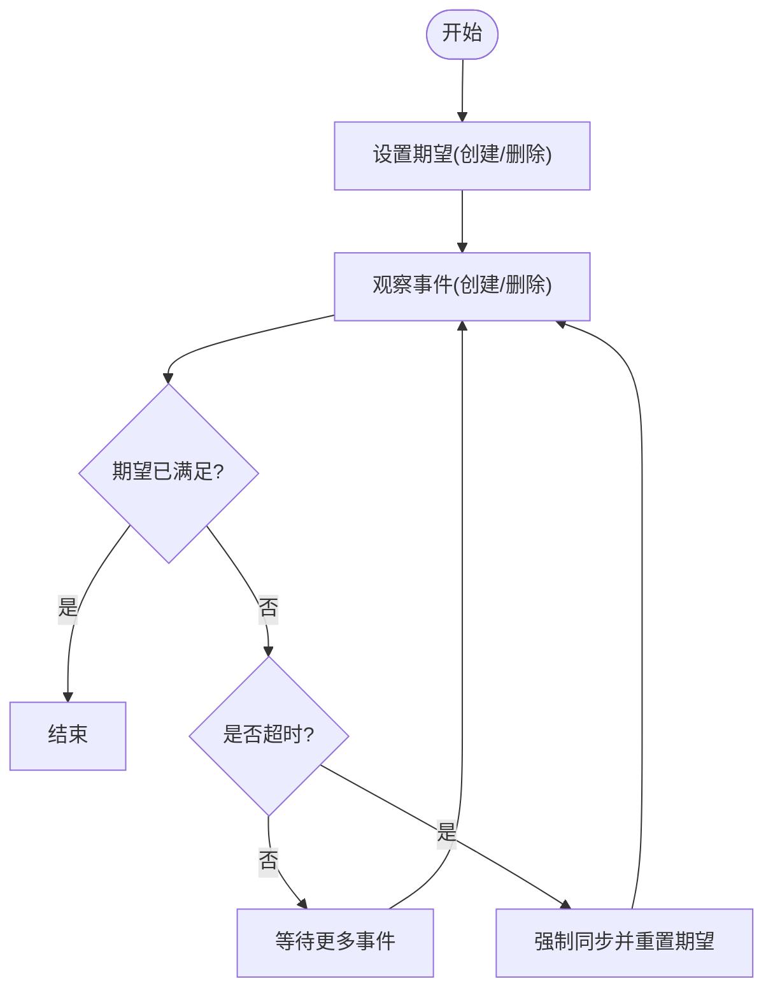
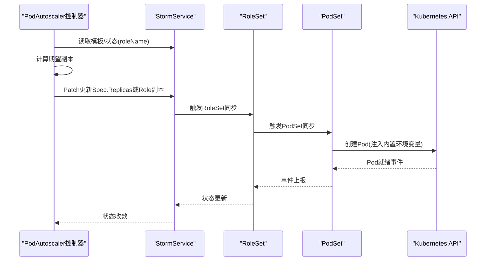
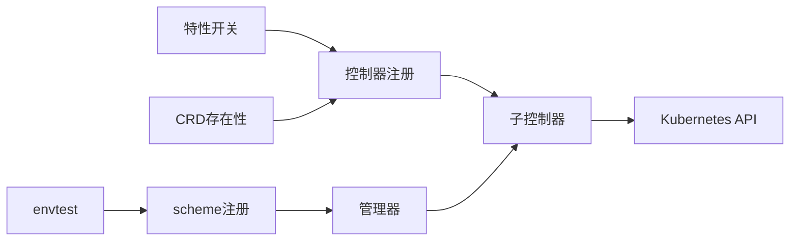

# 控制器集成测试

<cite>
**本文引用的文件**
- [cmd/controllers/main.go](file://cmd/controllers/main.go)
- [pkg/controller/controller.go](file://pkg/controller/controller.go)
- [test/integration/controller/suit_test.go](file://test/integration/controller/suit_test.go)
- [pkg/controller/util/expectation/expectation.go](file://pkg/controller/util/expectation/expectation.go)
- [pkg/controller/util/expectation/expectation_test.go](file://pkg/controller/util/expectation/expectation_test.go)
- [pkg/controller/podautoscaler/podautoscaler_controller_test.go](file://pkg/controller/podautoscaler/podautoscaler_controller_test.go)
- [pkg/controller/podautoscaler/workload_scale.go](file://pkg/controller/podautoscaler/workload_scale.go)
- [pkg/controller/podautoscaler/workload_scale_test.go](file://pkg/controller/podautoscaler/workload_scale_test.go)
- [pkg/controller/stormservice/stormservice_controller_test.go](file://pkg/controller/stormservice/stormservice_controller_test.go)
- [pkg/controller/roleset/roleset_controller_test.go](file://pkg/controller/roleset/roleset_controller_test.go)
- [pkg/controller/podset/podset_controller_test.go](file://pkg/controller/podset/podset_controller_test.go)
- [pkg/controller/rayclusterfleet/rayclusterfleet_controller_test.go](file://pkg/controller/rayclusterfleet/rayclusterfleet_controller_test.go)
- [api/orchestration/v1alpha1/stormservice_types.go](file://api/orchestration/v1alpha1/stormservice_types.go)
</cite>

## 目录
1. [简介](#简介)
2. [项目结构](#项目结构)
3. [核心组件](#核心组件)
4. [架构总览](#架构总览)
5. [详细组件分析](#详细组件分析)
6. [依赖分析](#依赖分析)
7. [性能考虑](#性能考虑)
8. [故障排查指南](#故障排查指南)
9. [结论](#结论)
10. [附录](#附录)

## 简介
本技术文档面向AIBrix控制器集成测试，系统性阐述控制器生命周期测试（启动、停止、重启）与状态同步测试（期望值验证、状态变更跟踪、资源协调）的实现方法，并深入解析控制器间协作（PodAutoscaler、PodSet、RoleSet、StormService等）的验证策略。同时提供测试工具链（Ginkgo、Testify、Kubernetes客户端测试）使用指南与测试环境搭建要点（测试集群配置、资源清理、测试数据准备），帮助读者快速构建稳定可靠的集成测试体系。

## 项目结构
AIBrix控制器通过单一管理器统一注册并运行多个子控制器，支持按特性开关启用/禁用控制器，具备良好的可扩展性与可控的部署面。集成测试采用envtest控制平面与controller-runtime管理器在内存中运行，结合Ginkgo进行BDD风格测试，覆盖控制器生命周期与跨控制器协作场景。

**图表来源**
- [cmd/controllers/main.go:112-360](file://cmd/controllers/main.go#L112-L360)
- [pkg/controller/controller.go:50-109](file://pkg/controller/controller.go#L50-L109)
- [test/integration/controller/suit_test.go:95-169](file://test/integration/controller/suit_test.go#L95-L169)

**章节来源**
- [cmd/controllers/main.go:112-360](file://cmd/controllers/main.go#L112-L360)
- [pkg/controller/controller.go:50-109](file://pkg/controller/controller.go#L50-L109)
- [test/integration/controller/suit_test.go:95-169](file://test/integration/controller/suit_test.go#L95-L169)

## 核心组件
- 控制器管理器与生命周期
  - 管理器创建、Webhook初始化、证书轮换、健康检查与就绪检查、信号处理与优雅退出。
  - 特性开关控制控制器注册，避免未安装CRD时的失败。
- 集成测试框架
  - envtest启动etcd与kube-apiserver，加载CRD与外部依赖（如KubeRay），构建scheme并创建fake客户端。
  - Ginkgo注册BeforeSuite/AfterSuite，统一管理测试生命周期与资源回收。
- 期望值与状态同步
  - 通过Expectations机制确保控制器在创建/删除资源后等待观察到预期事件，避免竞态与重复操作。
- 控制器间协作
  - PodAutoscaler对StormService、RayClusterFleet等目标进行角色级/节点级选择与扩缩容；PodSet/RoleSet/StormService共同完成编排与滚动更新。

**章节来源**
- [cmd/controllers/main.go:227-319](file://cmd/controllers/main.go#L227-L319)
- [test/integration/controller/suit_test.go:95-169](file://test/integration/controller/suit_test.go#L95-L169)
- [pkg/controller/util/expectation/expectation.go:68-136](file://pkg/controller/util/expectation/expectation.go#L68-L136)

## 架构总览
下图展示控制器集成测试的整体架构：envtest作为控制平面，controller-runtime管理器承载各子控制器，Ginkgo驱动测试用例，Testify用于断言与辅助校验。

**图表来源**
- [test/integration/controller/suit_test.go:97-137](file://test/integration/controller/suit_test.go#L97-L137)
- [cmd/controllers/main.go:227-253](file://cmd/controllers/main.go#L227-L253)

## 详细组件分析

### 控制器生命周期测试
- 启动阶段
  - 管理器创建与健康/就绪检查：通过healthz与readyz端点验证管理器可用性。
  - Webhook证书轮换：在证书就绪前阻塞控制器注册，保证Webhook正常工作。
  - 控制器注册：根据特性开关动态注册子控制器，若CRD缺失则记录信息并跳过。
- 停止/重启阶段
  - 通过上下文取消与通道关闭触发优雅停机，等待控制器完成收尾。
  - AfterSuite中统一停止envtest与清理资源，确保后续测试不受残留影响。

**图表来源**
- [test/integration/controller/suit_test.go:145-169](file://test/integration/controller/suit_test.go#L145-L169)
- [cmd/controllers/main.go:227-319](file://cmd/controllers/main.go#L227-L319)

**章节来源**
- [test/integration/controller/suit_test.go:95-169](file://test/integration/controller/suit_test.go#L95-L169)
- [cmd/controllers/main.go:227-319](file://cmd/controllers/main.go#L227-L319)

### 状态同步测试（期望值验证）
- 期望值机制
  - 控制器在计划创建/删除资源后设置期望计数，等待观察到对应事件或超时到期。
  - 提供原子计数器与过期策略，满足并发安全与健壮性需求。
- 测试策略
  - 使用FakeClock与TTLPolicy模拟时间推进，验证期望被满足或超时触发。
  - 并发场景下统计创建/删除次数，确保最终满足条件或超时返回。

**图表来源**
- [pkg/controller/util/expectation/expectation.go:141-143](file://pkg/controller/util/expectation/expectation.go#L141-L143)
- [pkg/controller/util/expectation/expectation_test.go:96-178](file://pkg/controller/util/expectation/expectation_test.go#L96-L178)

**章节来源**
- [pkg/controller/util/expectation/expectation.go:68-136](file://pkg/controller/util/expectation/expectation.go#L68-L136)
- [pkg/controller/util/expectation/expectation_test.go:96-178](file://pkg/controller/util/expectation/expectation_test.go#L96-L178)

### 控制器间协作测试（PodAutoscaler ↔ StormService/RoleSet/PodSet）
- PodAutoscaler对StormService的角色级扩缩容
  - 通过子目标选择器定位角色，从状态或模板提取当前副本数，计算期望副本并回写目标。
  - 支持“replica”模式与“pool”模式，分别直接修改顶层replicas或在RoleSet模板中调整角色副本。
- PodSet/RoleSet/StormService编排
  - PodSet负责基于模板创建Pod，维护容器内环境变量顺序与冲突处理。
  - RoleSet与StormService共同完成角色定义、更新策略与版本历史限制等编排逻辑。

**图表来源**
- [pkg/controller/podautoscaler/workload_scale.go:185-272](file://pkg/controller/podautoscaler/workload_scale.go#L185-L272)
- [pkg/controller/podautoscaler/workload_scale_test.go:89-425](file://pkg/controller/podautoscaler/workload_scale_test.go#L89-L425)
- [pkg/controller/podset/podset_controller_test.go:34-123](file://pkg/controller/podset/podset_controller_test.go#L34-L123)
- [api/orchestration/v1alpha1/stormservice_types.go:39-71](file://api/orchestration/v1alpha1/stormservice_types.go#L39-L71)

**章节来源**
- [pkg/controller/podautoscaler/workload_scale.go:112-272](file://pkg/controller/podautoscaler/workload_scale.go#L112-L272)
- [pkg/controller/podautoscaler/workload_scale_test.go:89-425](file://pkg/controller/podautoscaler/workload_scale_test.go#L89-L425)
- [pkg/controller/podset/podset_controller_test.go:34-123](file://pkg/controller/podset/podset_controller_test.go#L34-L123)
- [api/orchestration/v1alpha1/stormservice_types.go:39-71](file://api/orchestration/v1alpha1/stormservice_types.go#L39-L71)

### 测试工具链与环境搭建
- 测试框架
  - Ginkgo：BDD风格，BeforeSuite/AfterSuite组织测试生命周期，Skip/Expect断言。
  - Testify：断言与辅助工具，常用于单元测试；集成测试中以Ginkgo为主。
- Kubernetes客户端测试
  - envtest：启动本地控制平面，加载CRD与外部依赖（如KubeRay）。
  - fake client：在内存中模拟Kubernetes API，便于快速断言。
- 环境搭建步骤
  - 准备CRD目录与二进制资产路径，确保envtest能找到所需二进制。
  - 在BeforeSuite中注册scheme、创建管理器、初始化控制器并启动。
  - 在AfterSuite中关闭通道、取消上下文、停止envtest，清理资源。

**章节来源**
- [test/integration/controller/suit_test.go:95-169](file://test/integration/controller/suit_test.go#L95-L169)
- [cmd/controllers/main.go:227-253](file://cmd/controllers/main.go#L227-L253)

## 依赖分析
- 控制器注册依赖特性开关与CRD存在性检测，避免在缺少依赖时崩溃。
- 集成测试依赖envtest提供的控制平面与scheme注册，确保CRD与外部类型可用。
- PodAutoscaler与StormService之间存在强耦合（角色级选择与状态回填），需在测试中覆盖不同模式与角色存在性场景。

**图表来源**
- [pkg/controller/controller.go:50-95](file://pkg/controller/controller.go#L50-L95)
- [test/integration/controller/suit_test.go:97-137](file://test/integration/controller/suit_test.go#L97-L137)

**章节来源**
- [pkg/controller/controller.go:50-95](file://pkg/controller/controller.go#L50-L95)
- [test/integration/controller/suit_test.go:97-137](file://test/integration/controller/suit_test.go#L97-L137)

## 性能考虑
- 控制器启动与热身
  - 在集成测试中禁用领导者选举与绑定指标端口，缩短启动时间。
  - 通过BeforeSuite一次性注册scheme与启动管理器，避免重复开销。
- 扩缩容路径优化
  - 使用RetryOnConflict处理并发更新，减少重试失败带来的抖动。
  - 对于角色级扩缩容，优先从状态读取当前副本，必要时回退到模板，降低查询成本。
- 资源清理
  - AfterSuite中统一关闭通道与取消上下文，确保控制器及时退出，避免悬挂。

[本节为通用指导，无需特定文件引用]

## 故障排查指南
- Webhook未就绪导致readyz失败
  - 检查证书生成流程与certsReady通道是否被正确关闭。
- CRD缺失导致控制器跳过
  - 确认envtest加载了Aibrix CRD与依赖CRD（如KubeRay）。
- Reconcile卡住或超时
  - 检查期望值是否满足或超时，确认控制器是否正确观察到事件。
- PodSet环境变量冲突
  - 内置变量优先且不可被用户覆盖，确保用户变量顺序正确。

**章节来源**
- [cmd/controllers/main.go:298-312](file://cmd/controllers/main.go#L298-L312)
- [test/integration/controller/suit_test.go:97-112](file://test/integration/controller/suit_test.go#L97-L112)
- [pkg/controller/util/expectation/expectation.go:141-143](file://pkg/controller/util/expectation/expectation.go#L141-L143)
- [pkg/controller/podset/podset_controller_test.go:125-191](file://pkg/controller/podset/podset_controller_test.go#L125-L191)

## 结论
通过envtest+Ginkgo的集成测试框架，AIBrix实现了对控制器生命周期与跨控制器协作的系统化验证。期望值机制有效保障状态一致性与竞态防护；PodAutoscaler与StormService/RoleSet/PodSet的协同路径清晰明确。建议在持续集成中固定CRD与二进制资产路径，完善AfterSuite清理流程，并针对角色级扩缩容与环境变量注入等关键路径补充更多断言与边界场景。

[本节为总结性内容，无需特定文件引用]

## 附录
- 关键测试文件路径
  - 集成测试套件：[test/integration/controller/suit_test.go](file://test/integration/controller/suit_test.go)
  - PodAutoscaler控制器测试：[pkg/controller/podautoscaler/podautoscaler_controller_test.go](file://pkg/controller/podautoscaler/podautoscaler_controller_test.go)
  - PodAutoscaler扩缩容逻辑：[pkg/controller/podautoscaler/workload_scale.go](file://pkg/controller/podautoscaler/workload_scale.go)
  - PodSet环境变量测试：[pkg/controller/podset/podset_controller_test.go](file://pkg/controller/podset/podset_controller_test.go)
  - StormService控制器测试：[pkg/controller/stormservice/stormservice_controller_test.go](file://pkg/controller/stormservice/stormservice_controller_test.go)
  - RoleSet控制器测试：[pkg/controller/roleset/roleset_controller_test.go](file://pkg/controller/roleset/roleset_controller_test.go)
  - RayClusterFleet控制器测试：[pkg/controller/rayclusterfleet/rayclusterfleet_controller_test.go](file://pkg/controller/rayclusterfleet/rayclusterfleet_controller_test.go)
  - StormService类型定义：[api/orchestration/v1alpha1/stormservice_types.go](file://api/orchestration/v1alpha1/stormservice_types.go)

[本节为索引性内容，无需特定文件引用]