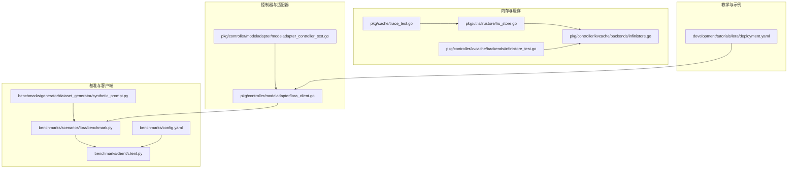
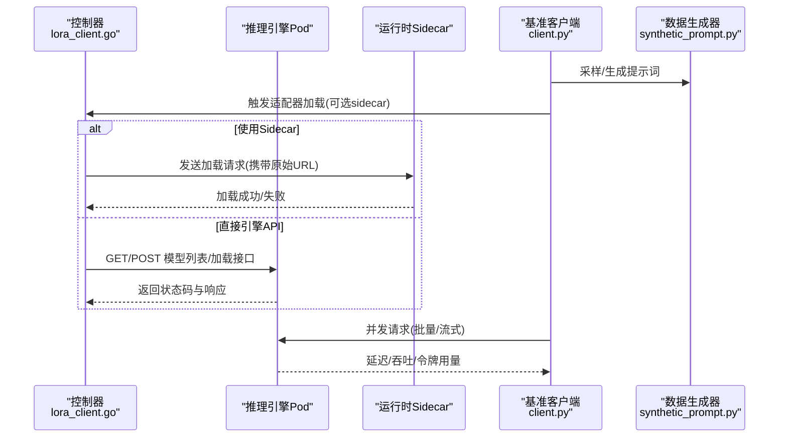
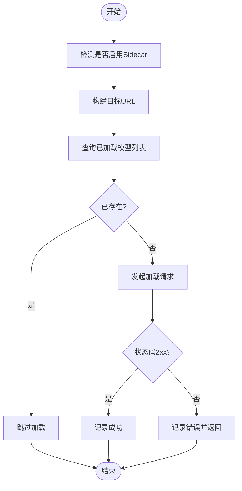
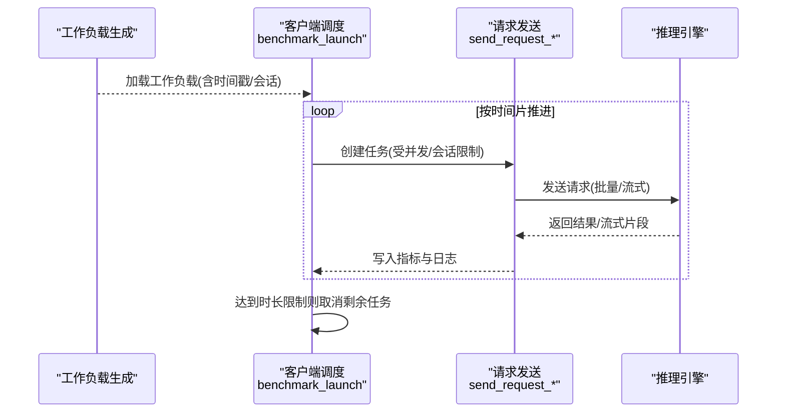
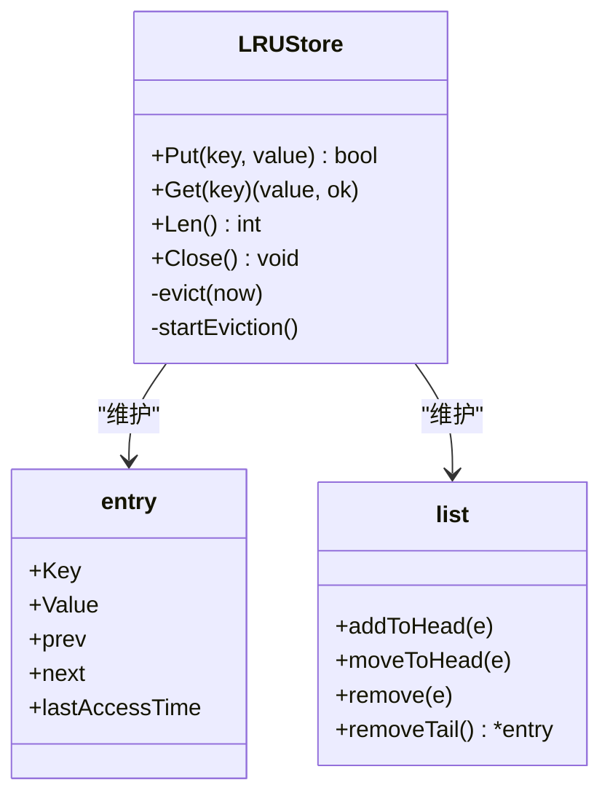
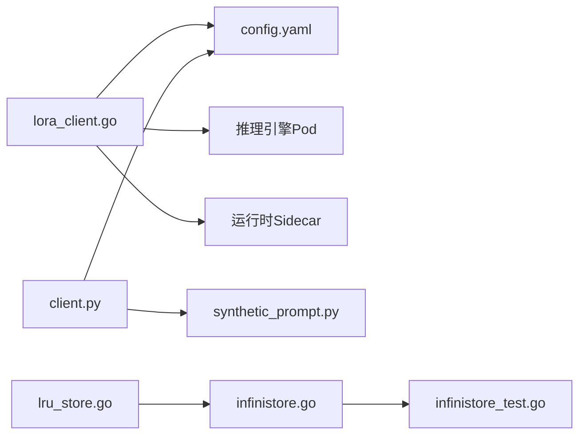

# 推理引擎集成测试

<cite>
**本文引用的文件**
- [benchmarks/scenarios/lora/benchmark.py](file://benchmarks/scenarios/lora/benchmark.py)
- [benchmarks/client/client.py](file://benchmarks/client/client.py)
- [benchmarks/generator/dataset_generator/synthetic_prompt.py](file://benchmarks/generator/dataset_generator/synthetic_prompt.py)
- [benchmarks/config.yaml](file://benchmarks/config.yaml)
- [pkg/controller/modeladapter/lora_client.go](file://pkg/controller/modeladapter/lora_client.go)
- [pkg/controller/modeladapter/modeladapter_controller_test.go](file://pkg/controller/modeladapter/modeladapter_controller_test.go)
- [pkg/utils/lrustore/lru_store.go](file://pkg/utils/lrustore/lru_store.go)
- [pkg/cache/trace_test.go](file://pkg/cache/trace_test.go)
- [pkg/controller/kvcache/backends/infinistore.go](file://pkg/controller/kvcache/backends/infinistore.go)
- [pkg/controller/kvcache/backends/infinistore_test.go](file://pkg/controller/kvcache/backends/infinistore_test.go)
- [development/tutorials/lora/deployment.yaml](file://development/tutorials/lora/deployment.yaml)
- [test/README.md](file://test/README.md)
- [benchmarks/requirements.txt](file://benchmarks/requirements.txt)
</cite>

## 目录
1. [简介](#简介)
2. [项目结构](#项目结构)
3. [核心组件](#核心组件)
4. [架构总览](#架构总览)
5. [详细组件分析](#详细组件分析)
6. [依赖分析](#依赖分析)
7. [性能考虑](#性能考虑)
8. [故障排查指南](#故障排查指南)
9. [结论](#结论)
10. [附录](#附录)

## 简介
本文件面向AIBrix推理引擎的集成测试，聚焦以下三大测试主题：
- LoRA微调测试：覆盖LoRA适配器创建、加载与卸载流程验证、性能对比分析与回归基线。
- 批处理并发测试：覆盖并发请求调度、会话级并发控制、资源竞争与瓶颈识别。
- 内存管理测试：覆盖内存分配与容量校验、LRU淘汰与过期清理、内存泄漏检测策略。

同时提供测试工具链使用说明（Python测试框架、LoRA测试数据生成、性能监控）、测试环境搭建指南（模型准备、环境变量、测试数据管理）以及可复用的基准脚本与配置。

## 项目结构
围绕推理引擎集成测试的关键目录与文件：
- 基准与客户端：benchmarks/scenarios/lora/benchmark.py、benchmarks/client/client.py、benchmarks/generator/dataset_generator/synthetic_prompt.py、benchmarks/config.yaml
- 控制器与适配器：pkg/controller/modeladapter/lora_client.go、pkg/controller/modeladapter/modeladapter_controller_test.go
- 内存与缓存：pkg/utils/lrustore/lru_store.go、pkg/controller/kvcache/backends/infinistore.go、pkg/controller/kvcache/backends/infinistore_test.go、pkg/cache/trace_test.go
- 教学与示例：development/tutorials/lora/deployment.yaml
- 测试框架与运行：test/README.md、benchmarks/requirements.txt

**图表来源**
- [benchmarks/scenarios/lora/benchmark.py:1-256](file://benchmarks/scenarios/lora/benchmark.py#L1-L256)
- [benchmarks/client/client.py:1-490](file://benchmarks/client/client.py#L1-L490)
- [benchmarks/generator/dataset_generator/synthetic_prompt.py:1-188](file://benchmarks/generator/dataset_generator/synthetic_prompt.py#L1-L188)
- [benchmarks/config.yaml:1-114](file://benchmarks/config.yaml#L1-L114)
- [pkg/controller/modeladapter/lora_client.go:75-338](file://pkg/controller/modeladapter/lora_client.go#L75-L338)
- [pkg/controller/modeladapter/modeladapter_controller_test.go:1-505](file://pkg/controller/modeladapter/modeladapter_controller_test.go#L1-L505)
- [pkg/utils/lrustore/lru_store.go:1-185](file://pkg/utils/lrustore/lru_store.go#L1-L185)
- [pkg/controller/kvcache/backends/infinistore.go:402-437](file://pkg/controller/kvcache/backends/infinistore.go#L402-L437)
- [pkg/controller/kvcache/backends/infinistore_test.go:287-350](file://pkg/controller/kvcache/backends/infinistore_test.go#L287-L350)
- [development/tutorials/lora/deployment.yaml:1-54](file://development/tutorials/lora/deployment.yaml#L1-L54)

**章节来源**
- [test/README.md:1-116](file://test/README.md#L1-L116)

## 核心组件
- LoRA适配器加载客户端：负责判断是否使用sidecar路径、构建目标URL、查询已加载模型、发起加载/卸载请求，并处理HTTP响应与错误。
- 多LoRA基准客户端：支持批量/流式请求、按时间戳调度、会话并发限制、时长上限与任务取消、统计指标输出。
- 数据集生成器：基于模板与领域词汇合成真实感提示词，控制目标token长度，便于一致性测试。
- 配置中心：集中管理tokenizer、数据集、工作负载、客户端参数、路由策略、超时与重试等。
- 内存与缓存：LRU存储（带TTL与周期清理）、KV缓存预分配大小推导、并发trace测试辅助。
- 示例部署：演示启用LoRA适配器的引擎部署结构。

**章节来源**
- [pkg/controller/modeladapter/lora_client.go:82-107](file://pkg/controller/modeladapter/lora_client.go#L82-L107)
- [benchmarks/client/client.py:264-435](file://benchmarks/client/client.py#L264-L435)
- [benchmarks/generator/dataset_generator/synthetic_prompt.py:75-151](file://benchmarks/generator/dataset_generator/synthetic_prompt.py#L75-L151)
- [benchmarks/config.yaml:1-114](file://benchmarks/config.yaml#L1-L114)
- [pkg/utils/lrustore/lru_store.go:43-139](file://pkg/utils/lrustore/lru_store.go#L43-L139)
- [pkg/controller/kvcache/backends/infinistore.go:414-437](file://pkg/controller/kvcache/backends/infinistore.go#L414-L437)
- [development/tutorials/lora/deployment.yaml:1-54](file://development/tutorials/lora/deployment.yaml#L1-L54)

## 架构总览
LoRA微调测试端到端流程：控制器根据ModelAdapter实例选择健康Pod，通过HTTP调用引擎侧API或sidecar代理完成适配器加载；基准客户端以多模型、多并发的方式向网关/服务发送请求，收集延迟、吞吐、TTFT/TPOT等指标；数据生成器提供一致性的输入样本；配置中心统一管理参数。

**图表来源**
- [pkg/controller/modeladapter/lora_client.go:82-107](file://pkg/controller/modeladapter/lora_client.go#L82-L107)
- [benchmarks/client/client.py:162-262](file://benchmarks/client/client.py#L162-L262)
- [benchmarks/generator/dataset_generator/synthetic_prompt.py:75-151](file://benchmarks/generator/dataset_generator/synthetic_prompt.py#L75-L151)

## 详细组件分析

### 组件A：LoRA适配器加载与卸载（控制器）
- 关键职责
  - 判断是否使用sidecar路径（基于运行时配置与Pod标签），构建目标URL。
  - 查询当前已加载模型列表，避免重复加载。
  - 发起加载/卸载请求，处理HTTP状态码与响应体，记录日志与错误。
- 错误处理
  - 对连接拒绝、超时、网络不可达等进行可重试判定。
  - 卸载接口忽略HTTP错误，保证流程不被阻塞。
- 可观测性
  - 成功加载后记录日志，便于定位问题。

**图表来源**
- [pkg/controller/modeladapter/lora_client.go:82-107](file://pkg/controller/modeladapter/lora_client.go#L82-L107)
- [pkg/controller/modeladapter/lora_client.go:208-315](file://pkg/controller/modeladapter/lora_client.go#L208-L315)
- [pkg/controller/modeladapter/lora_client.go:138-160](file://pkg/controller/modeladapter/lora_client.go#L138-L160)

**章节来源**
- [pkg/controller/modeladapter/lora_client.go:82-107](file://pkg/controller/modeladapter/lora_client.go#L82-L107)
- [pkg/controller/modeladapter/lora_client.go:208-315](file://pkg/controller/modeladapter/lora_client.go#L208-L315)
- [pkg/controller/modeladapter/lora_client.go:138-160](file://pkg/controller/modeladapter/lora_client.go#L138-L160)

### 组件B：多LoRA基准测试（客户端）
- 并发与调度
  - 支持批量与流式两种请求模式，按时间戳逻辑调度，支持会话并发上限与全局时长限制。
  - 通过队列与异步任务管理会话生命周期，动态补充待处理请求。
- 指标采集
  - 记录延迟、吞吐、TTFT、TPOT、令牌用量、目标Pod/请求ID等。
- 资源控制
  - 客户端在超时后取消未完成任务，避免资源泄露。

**图表来源**
- [benchmarks/client/client.py:264-435](file://benchmarks/client/client.py#L264-L435)
- [benchmarks/client/client.py:21-161](file://benchmarks/client/client.py#L21-L161)

**章节来源**
- [benchmarks/client/client.py:264-435](file://benchmarks/client/client.py#L264-L435)
- [benchmarks/client/client.py:21-161](file://benchmarks/client/client.py#L21-L161)

### 组件C：数据集生成与一致性
- 合成提示词
  - 基于模板与领域词汇随机填充，支持唯一前缀、目标token长度控制与截断。
- 一致性保障
  - 固定tokenizer与长度参数，确保不同批次/不同并发下的输入可比性。

**章节来源**
- [benchmarks/generator/dataset_generator/synthetic_prompt.py:75-151](file://benchmarks/generator/dataset_generator/synthetic_prompt.py#L75-L151)

### 组件D：内存管理与LRU缓存
- LRU存储
  - 支持容量限制、TTL过期、周期清理、读写锁保护、关闭时停止清理协程。
- KV缓存预分配
  - 从容器内存限制/请求推导预分配大小（GiB），默认下限为1GiB。
- 并发trace测试
  - 多goroutine并发Add/Done，验证trace稳定性与原子计数。

**图表来源**
- [pkg/utils/lrustore/lru_store.go:31-139](file://pkg/utils/lrustore/lru_store.go#L31-L139)

**章节来源**
- [pkg/utils/lrstore/lru_store.go:43-139](file://pkg/utils/lrstore/lru_store.go#L43-L139)
- [pkg/controller/kvcache/backends/infinistore.go:414-437](file://pkg/controller/kvcache/backends/infinistore.go#L414-L437)
- [pkg/cache/trace_test.go:100-148](file://pkg/cache/trace_test.go#L100-L148)

### 组件E：示例部署与环境准备
- 部署清单
  - 展示如何在Deployment中启用LoRA适配器、sidecar运行时与引擎端口映射。
- 环境准备
  - 结合测试配置文件设置tokenizer、endpoint、API密钥、路由策略等。

**章节来源**
- [development/tutorials/lora/deployment.yaml:1-54](file://development/tutorials/lora/deployment.yaml#L1-L54)
- [benchmarks/config.yaml:1-114](file://benchmarks/config.yaml#L1-L114)

## 依赖分析
- 控制器对运行时配置敏感：是否启用sidecar决定HTTP路径与payload格式。
- 基准客户端依赖OpenAI SDK、工作负载文件与配置中心参数。
- 数据生成器依赖transformers分词器，确保token长度可控。
- 内存与缓存组件相互独立但共同服务于高并发场景下的资源管理。

**图表来源**
- [pkg/controller/modeladapter/lora_client.go:82-107](file://pkg/controller/modeladapter/lora_client.go#L82-L107)
- [benchmarks/client/client.py:437-469](file://benchmarks/client/client.py#L437-L469)
- [benchmarks/generator/dataset_generator/synthetic_prompt.py:75-151](file://benchmarks/generator/dataset_generator/synthetic_prompt.py#L75-L151)
- [pkg/utils/lrstore/lru_store.go:43-139](file://pkg/utils/lrstore/lru_store.go#L43-L139)
- [pkg/controller/kvcache/backends/infinistore.go:414-437](file://pkg/controller/kvcache/backends/infinistore.go#L414-L437)
- [pkg/controller/kvcache/backends/infinistore_test.go:287-350](file://pkg/controller/kvcache/backends/infinistore_test.go#L287-L350)

**章节来源**
- [pkg/controller/modeladapter/lora_client.go:82-107](file://pkg/controller/modeladapter/lora_client.go#L82-L107)
- [benchmarks/client/client.py:437-469](file://benchmarks/client/client.py#L437-L469)
- [benchmarks/generator/dataset_generator/synthetic_prompt.py:75-151](file://benchmarks/generator/dataset_generator/synthetic_prompt.py#L75-L151)
- [pkg/utils/lrstore/lru_store.go:43-139](file://pkg/utils/lrstore/lru_store.go#L43-L139)
- [pkg/controller/kvcache/backends/infinistore.go:414-437](file://pkg/controller/kvcache/backends/infinistore.go#L414-L437)
- [pkg/controller/kvcache/backends/infinistore_test.go:287-350](file://pkg/controller/kvcache/backends/infinistore_test.go#L287-L350)

## 性能考虑
- 并发与会话控制
  - 通过“最大并发会话数”与“时长限制”防止资源耗尽与任务堆积。
- 请求模式选择
  - 批量适合吞吐优先场景，流式适合低延迟与实时指标采集。
- 负载生成策略
  - 基于正态/波动模式的工作负载配置，模拟真实流量特征。
- 内存与缓存
  - LRU TTL与周期清理降低内存占用；KV缓存预分配避免抖动。

[本节为通用指导，无需特定文件引用]

## 故障排查指南
- LoRA加载失败
  - 检查HTTP状态码与响应体，确认引擎端口、API密钥、Artifact URL正确。
  - 若使用sidecar，确认运行时sidecar已就绪且可代理下载。
- 并发与会话异常
  - 查看客户端日志中的“会话完成/取消”统计，确认max_concurrent_sessions与duration_limit设置。
  - 检查请求头中的target-pod与request-id，定位具体Pod与请求。
- 内存与缓存问题
  - LRUStore关闭后应停止清理协程；检查容量与TTL设置是否合理。
  - KV缓存预分配大小由资源限制推导，若不足可调整容器内存限制。

**章节来源**
- [pkg/controller/modeladapter/lora_client.go:138-160](file://pkg/controller/modeladapter/lora_client.go#L138-L160)
- [benchmarks/client/client.py:424-435](file://benchmarks/client/client.py#L424-L435)
- [pkg/utils/lrstore/lru_store.go:60-76](file://pkg/utils/lrstore/lru_store.go#L60-L76)
- [pkg/controller/kvcache/backends/infinistore.go:414-437](file://pkg/controller/kvcache/backends/infinistore.go#L414-L437)

## 结论
本文系统梳理了AIBrix推理引擎集成测试的关键路径：LoRA适配器加载、多LoRA基准客户端、数据生成与一致性、内存与缓存管理，并提供了可操作的测试工具链与环境搭建建议。通过严格的并发控制、可观测指标与资源管理策略，能够有效验证推理引擎在高并发、多适配器场景下的稳定性与性能。

[本节为总结，无需特定文件引用]

## 附录

### A. 测试工具链与环境
- Python测试框架与依赖
  - 使用OpenAI SDK、pandas、matplotlib、scipy、transformers等库。
- 运行命令参考
  - 基准脚本入口与参数详见脚本头部注释与参数定义。
- 配置文件
  - tokenizer、endpoint、api_key、routing_strategy、time_scale、max_concurrent_sessions等。

**章节来源**
- [benchmarks/requirements.txt:1-7](file://benchmarks/requirements.txt#L1-L7)
- [benchmarks/client/client.py:472-489](file://benchmarks/client/client.py#L472-L489)
- [benchmarks/config.yaml:1-114](file://benchmarks/config.yaml#L1-L114)

### B. 测试环境搭建指南
- 准备测试模型
  - 在部署清单中启用LoRA适配器与sidecar运行时，确保引擎端口与健康探针正常。
- 环境变量与配置
  - 通过config.yaml注入API密钥、endpoint、路由策略、超时与重试参数。
- 测试数据管理
  - 使用数据生成器生成指定长度的提示词，确保不同批次的一致性。

**章节来源**
- [development/tutorials/lora/deployment.yaml:1-54](file://development/tutorials/lora/deployment.yaml#L1-L54)
- [benchmarks/config.yaml:1-114](file://benchmarks/config.yaml#L1-L114)
- [benchmarks/generator/dataset_generator/synthetic_prompt.py:75-151](file://benchmarks/generator/dataset_generator/synthetic_prompt.py#L75-L151)

### C. 基准脚本与控制器联动
- 多LoRA基准脚本
  - 支持多模型、多并发、批量/流式请求，输出JSONL指标文件。
- 控制器联动
  - 在基准执行前，控制器负责将适配器加载至目标Pod，避免重复加载。

**章节来源**
- [benchmarks/scenarios/lora/benchmark.py:150-179](file://benchmarks/scenarios/lora/benchmark.py#L150-L179)
- [pkg/controller/modeladapter/lora_client.go:82-107](file://pkg/controller/modeladapter/lora_client.go#L82-L107)