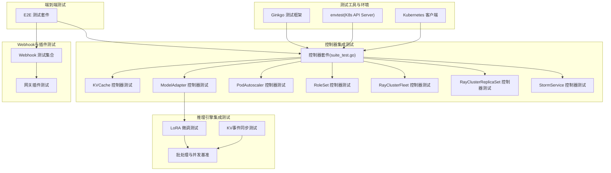
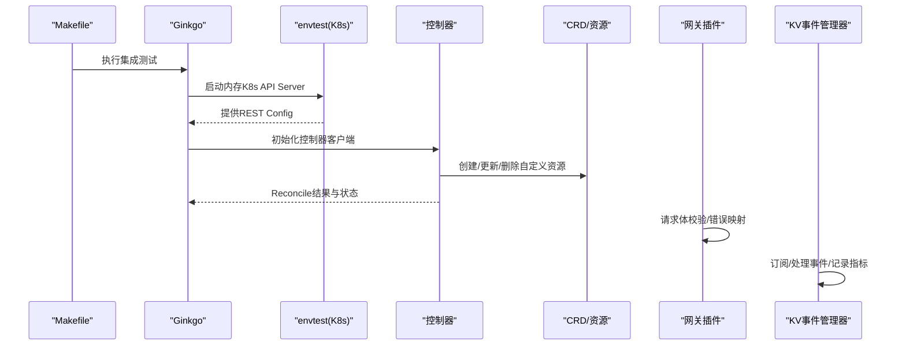
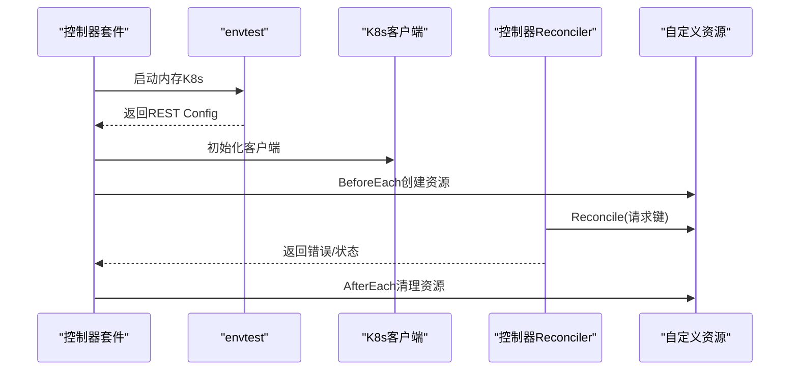
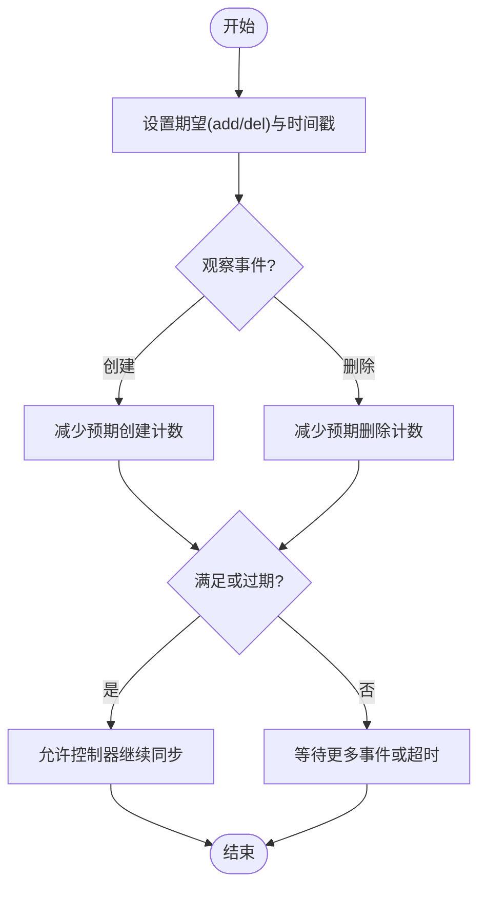
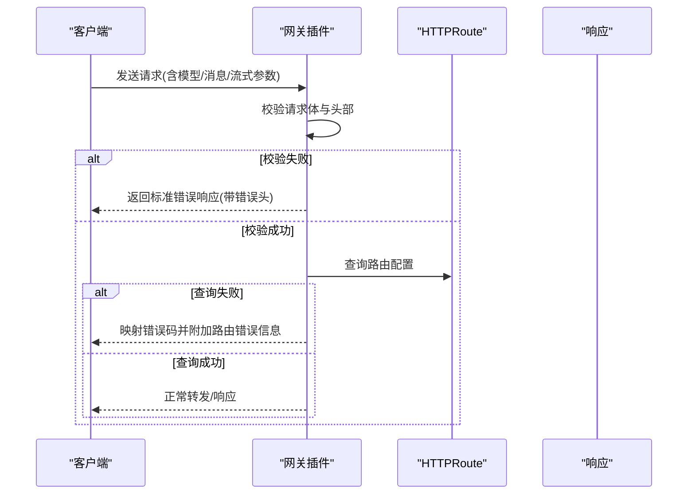
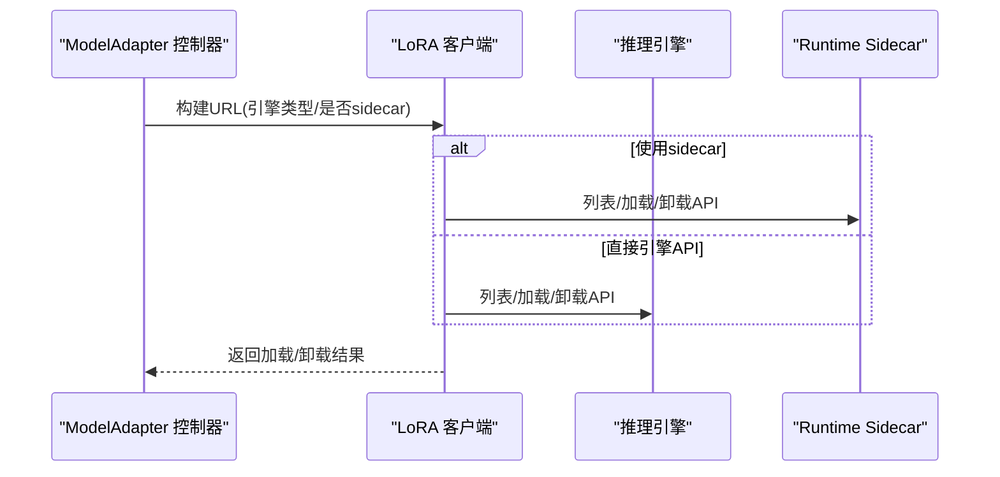
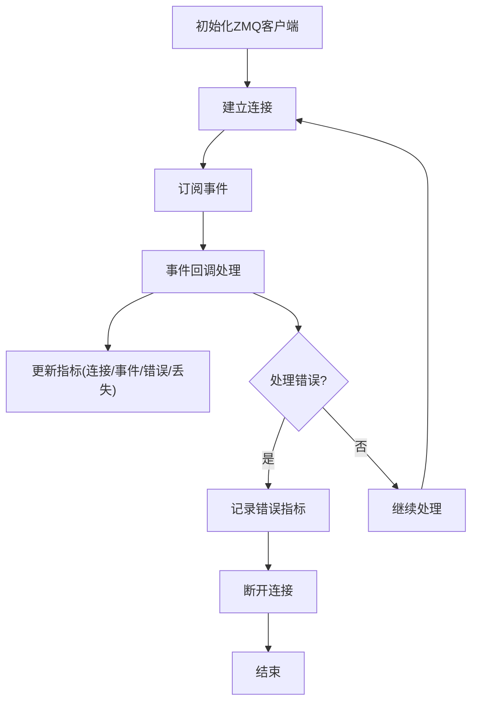
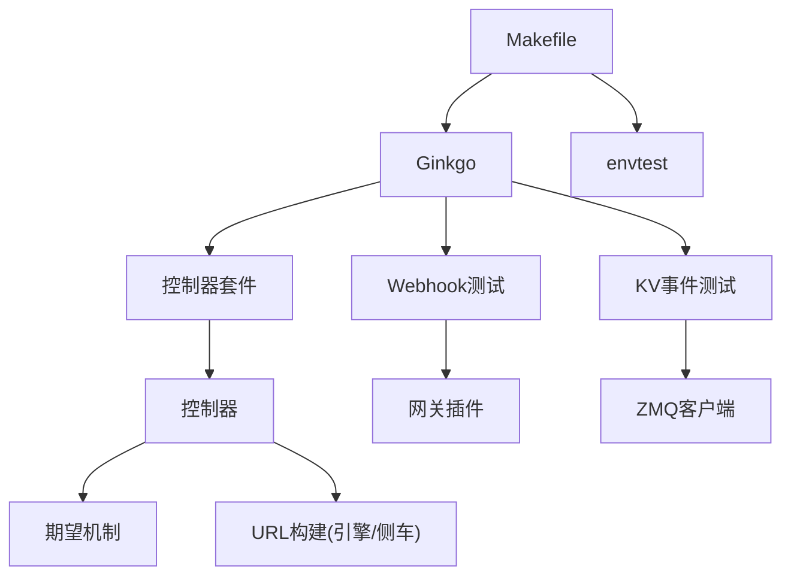

# 集成测试

<cite>
**本文引用的文件**
- [Makefile](file://Makefile)
- [pkg/controller/kvcache/kvcache_controller_ginkgo_test.go](file://pkg/controller/kvcache/kvcache_controller_ginkgo_test.go)
- [pkg/controller/kvcache/suite_test.go](file://pkg/controller/kvcache/suite_test.go)
- [pkg/controller/modeladapter/lora_client.go](file://pkg/controller/modeladapter/lora_client.go)
- [pkg/controller/modeladapter/utils.go](file://pkg/controller/modeladapter/utils.go)
- [pkg/controller/modeladapter/modeladapter_controller_test.go](file://pkg/controller/modeladapter/modeladapter_controller_test.go)
- [pkg/controller/modeladapter/modeladapter_controller_unit_tests.go](file://pkg/controller/modeladapter/modeladapter_controller_unit_tests.go)
- [pkg/controller/modeladapter/modeladapter_run_test.go](file://pkg/controller/modeladapter/modeladapter_run_test.go)
- [pkg/controller/modeladapter/resources_test.go](file://pkg/controller/modeladapter/resources_test.go)
- [pkg/controller/modeladapter/utils_test.go](file://pkg/controller/modeladapter/utils_test.go)
- [pkg/controller/modeladapter/suite_test.go](file://pkg/controller/modeladapter/suite_test.go)
- [pkg/controller/podautoscaler/podautoscaler_controller_test.go](file://pkg/controller/podautoscaler/podautoscaler_controller_test.go)
- [pkg/controller/podautoscaler/podautoscaler_run_test.go](file://pkg/controller/podautoscaler/podautoscaler_run_test.go)
- [pkg/controller/podautoscaler/autoscaler_test.go](file://pkg/controller/podautoscaler/autoscaler_test.go)
- [pkg/controller/podautoscaler/workload_scale_test.go](file://pkg/controller/podautoscaler/workload_scale_test.go)
- [pkg/controller/podautoscaler/hpa_resources_test.go](file://pkg/controller/podautoscaler/hpa_resources_test.go)
- [pkg/controller/roleset/roleset_controller_test.go](file://pkg/controller/roleset/roleset_controller_test.go)
- [pkg/controller/roleset/rolesyncer_test.go](file://pkg/controller/roleset/rolesyncer_test.go)
- [pkg/controller/roleset/suite_test.go](file://pkg/controller/roleset/suite_test.go)
- [pkg/controller/rayclusterfleet/rayclusterfleet_controller_test.go](file://pkg/controller/rayclusterfleet/rayclusterfleet_controller_test.go)
- [pkg/controller/rayclusterfleet/suite_test.go](file://pkg/controller/rayclusterfleet/suite_test.go)
- [pkg/controller/rayclusterreplicaset/rayclusterreplicaset_controller_test.go](file://pkg/controller/rayclusterreplicaset/rayclusterreplicaset_controller_test.go)
- [pkg/controller/rayclusterreplicaset/suite_test.go](file://pkg/controller/rayclusterreplicaset/suite_test.go)
- [pkg/controller/stormservice/stormservice_controller_test.go](file://pkg/controller/stormservice/stormservice_controller_test.go)
- [pkg/controller/stormservice/revision_test.go](file://pkg/controller/stormservice/revision_test.go)
- [pkg/controller/stormservice/suite_test.go](file://pkg/controller/stormservice/suite_test.go)
- [pkg/controller/util/expectation/expectation.go](file://pkg/controller/util/expectation/expectation.go)
- [pkg/controller/util/expectation/expectation_test.go](file://pkg/controller/util/expectation/expectation_test.go)
- [pkg/webhook/podautoscaler_webhook_test.go](file://pkg/webhook/podautoscaler_webhook_test.go)
- [pkg/webhook/kvcache_webhook.go](file://pkg/webhook/kvcache_webhook.go)
- [pkg/webhook/modeladapter_webhook.go](file://pkg/webhook/modeladapter_webhook.go)
- [pkg/webhook/stormservice_webhook.go](file://pkg/webhook/stormservice_webhook.go)
- [pkg/webhook/deployment_webhook.go](file://pkg/webhook/deployment_webhook.go)
- [pkg/webhook/sidecar_injection.go](file://pkg/webhook/sidecar_injection.go)
- [pkg/plugins/gateway/gateway_test.go](file://pkg/plugins/gateway/gateway_test.go)
- [pkg/plugins/gateway/util_test.go](file://pkg/plugins/gateway/util_test.go)
- [pkg/plugins/gateway/types.go](file://pkg/plugins/gateway/types.go)
- [pkg/plugins/gateway/algorithms/pd_disaggregation_benchmark_test.go](file://pkg/plugins/gateway/algorithms/pd_disaggregation_benchmark_test.go)
- [pkg/cache/kvcache/zmq_client_test.go](file://pkg/cache/kvcache/zmq_client_test.go)
- [pkg/cache/kv_event_manager_validation_test.go](file://pkg/cache/kv_event_manager_validation_test.go)
- [pkg/cache/trace_test.go](file://pkg/cache/trace_test.go)
- [pkg/cache/kv_event_manager_comprehensive_test.go](file://pkg/cache/kv_event_manager_comprehensive_test.go)
- [pkg/cache/kv_event_manager_test.go](file://pkg/cache/kv_event_manager_test.go)
- [pkg/cache/kv_event_manager_integration_test.go](file://pkg/cache/kv_event_manager_integration_test.go)
- [pkg/cache/kv_event_manager_handler_test.go](file://pkg/cache/kv_event_manager_handler_test.go)
- [pkg/cache/kv_event_manager_test_helpers.go](file://pkg/cache/kv_event_manager_test_helpers.go)
- [test/e2e/e2e_test.go](file://test/e2e/e2e_test.go)
- [test/e2e/util.go](file://test/e2e/util.go)
- [test/e2e/model_adapter_test.go](file://test/e2e/model_adapter_test.go)
- [test/e2e/openai_api_compatibility_test.go](file://test/e2e/openai_api_compatibility_test.go)
- [test/e2e/vtc_routing_test.go](file://test/e2e/vtc_routing_test.go)
- [test/e2e/routing_strategy_test.go](file://test/e2e/routing_strategy_test.go)
- [test/e2e/routing_config_profile_test.go](file://test/e2e/routing_config_profile_test.go)
- [test/e2e/model_rps_limit_test.go](file://test/e2e/model_rps_limit_test.go)
- [test/e2e/pd_test.go](file://test/e2e/pd_test.go)
- [test/integration/controller/suit_test.go](file://test/integration/controller/suit_test.go)
- [test/integration/webhook/suit_test.go](file://test/integration/webhook/suit_test.go)
- [benchmarks/scenarios/lora/README.md](file://benchmarks/scenarios/lora/README.md)
- [benchmarks/scenarios/lora/benchmark.py](file://benchmarks/scenarios/lora/benchmark.py)
- [apps/console/api/resource_manager/types/clientset.go](file://apps/console/api/resource_manager/types/clientset.go)
</cite>

## 目录
1. [简介](#简介)
2. [项目结构](#项目结构)
3. [核心组件](#核心组件)
4. [架构总览](#架构总览)
5. [详细组件分析](#详细组件分析)
6. [依赖分析](#依赖分析)
7. [性能考虑](#性能考虑)
8. [故障排查指南](#故障排查指南)
9. [结论](#结论)
10. [附录](#附录)

## 简介
本文件面向AIBrix的集成测试体系，系统性阐述控制器集成测试（生命周期、状态同步、资源协调）、Webhook集成测试（入站/出站、事件处理与错误场景）、推理引擎集成测试（LoRA微调、批处理并发、内存管理）以及测试工具链（Ginkgo、Testify、Kubernetes客户端测试）。同时提供测试环境搭建与资源清理、测试数据准备等实操建议。

## 项目结构
- 测试目标分层清晰：单元测试、集成测试（Ginkgo + envtest）、端到端测试（Go原生测试）。
- 控制器测试采用Ginkgo BDD风格，结合envtest在内存中运行Kubernetes API Server进行CRD与控制器行为验证。
- Webhook与插件（网关）测试覆盖请求体校验、错误映射、流式响应、速率限制等。
- 推理引擎相关测试覆盖LoRA加载/卸载、URL构建、并发与内存追踪等。

图表来源
- [Makefile:151-165](file://Makefile#L151-L165)
- [pkg/controller/kvcache/suite_test.go:52-90](file://pkg/controller/kvcache/suite_test.go#L52-L90)
- [test/integration/controller/suit_test.go](file://test/integration/controller/suit_test.go)
- [test/integration/webhook/suit_test.go](file://test/integration/webhook/suit_test.go)

章节来源
- [Makefile:59-62](file://Makefile#L59-L62)
- [Makefile:151-165](file://Makefile#L151-L165)
- [pkg/controller/kvcache/suite_test.go:52-90](file://pkg/controller/kvcache/suite_test.go#L52-L90)

## 核心组件
- 控制器期望机制：通过期望计数与过期时间避免竞态与过度重试，确保控制器在满足条件或超时后才继续同步。
- 网关插件：对请求体、头部、流式响应进行严格校验，并在错误码映射与HTTPRoute查询失败时构造统一错误响应。
- KV事件管理：ZMQ客户端、事件处理器、指标统计与错误追踪，保障事件同步的可靠性与可观测性。
- 推理引擎URL构建：根据是否启用runtime sidecar与引擎类型动态选择API路径，支持LoRA加载/卸载。
- Kubernetes客户端封装：多区域/多集群客户端解析与过滤，便于跨区域资源管理。

章节来源
- [pkg/controller/util/expectation/expectation.go:45-202](file://pkg/controller/util/expectation/expectation.go#L45-L202)
- [pkg/plugins/gateway/types.go:24-44](file://pkg/plugins/gateway/types.go#L24-L44)
- [pkg/cache/kvcache/zmq_client_test.go:52-291](file://pkg/cache/kvcache/zmq_client_test.go#L52-L291)
- [pkg/controller/modeladapter/utils.go:115-158](file://pkg/controller/modeladapter/utils.go#L115-L158)
- [apps/console/api/resource_manager/types/clientset.go:43-97](file://apps/console/api/resource_manager/types/clientset.go#L43-L97)

## 架构总览
下图展示集成测试的整体流程：通过Makefile触发Ginkgo测试，envtest启动内存中的K8s API Server，控制器在受控环境中执行Reconcile逻辑；Webhook与插件在HTTP/Envoy侧进行请求处理与错误映射；KV事件管理器负责事件订阅、处理与指标采集；推理引擎相关测试验证URL构建与LoRA加载路径。

图表来源
- [Makefile:151-165](file://Makefile#L151-L165)
- [pkg/controller/kvcache/suite_test.go:52-90](file://pkg/controller/kvcache/suite_test.go#L52-L90)
- [pkg/controller/kvcache/kvcache_controller_ginkgo_test.go:38-155](file://pkg/controller/kvcache/kvcache_controller_ginkgo_test.go#L38-L155)
- [pkg/plugins/gateway/gateway_test.go:744-799](file://pkg/plugins/gateway/gateway_test.go#L744-L799)
- [pkg/cache/kvcache/zmq_client_test.go:101-291](file://pkg/cache/kvcache/zmq_client_test.go#L101-L291)

## 详细组件分析

### 控制器集成测试
- 套件初始化：envtest加载CRD目录、设置二进制资产路径，创建REST Config与Kubernetes客户端；各控制器子套件在BeforeSuite中注册scheme并建立客户端。
- 典型控制器测试：以KVCache控制器为例，在BeforeEach中创建CR实例并在AfterEach中清理；在It中调用Reconcile并断言无错误。
- 期望机制：控制器通过期望接口登记“预期创建/删除”数量与时间戳，仅当满足或过期后才认为已满足期望，避免重复同步与竞态。

图表来源
- [pkg/controller/kvcache/suite_test.go:52-90](file://pkg/controller/kvcache/suite_test.go#L52-L90)
- [pkg/controller/kvcache/kvcache_controller_ginkgo_test.go:50-153](file://pkg/controller/kvcache/kvcache_controller_ginkgo_test.go#L50-L153)
- [pkg/controller/util/expectation/expectation.go:108-135](file://pkg/controller/util/expectation/expectation.go#L108-L135)

章节来源
- [pkg/controller/kvcache/suite_test.go:52-90](file://pkg/controller/kvcache/suite_test.go#L52-L90)
- [pkg/controller/kvcache/kvcache_controller_ginkgo_test.go:38-155](file://pkg/controller/kvcache/kvcache_controller_ginkgo_test.go#L38-L155)
- [pkg/controller/util/expectation/expectation.go:45-202](file://pkg/controller/util/expectation/expectation.go#L45-L202)

### 状态同步与资源协调测试
- 期望接口：提供SetExpectations、ExpectCreations、ExpectDeletions、CreationObserved、DeletionObserved、SatisfiedExpectations等方法，用于控制Reconcile节奏与一致性。
- 并发与过期：通过原子计数与时间戳判断期望是否满足或过期，保证在高并发场景下的稳定性。

图表来源
- [pkg/controller/util/expectation/expectation.go:108-135](file://pkg/controller/util/expectation/expectation.go#L108-L135)
- [pkg/controller/util/expectation/expectation_test.go:96-133](file://pkg/controller/util/expectation/expectation_test.go#L96-L133)

章节来源
- [pkg/controller/util/expectation/expectation.go:108-135](file://pkg/controller/util/expectation/expectation.go#L108-L135)
- [pkg/controller/util/expectation/expectation_test.go:96-133](file://pkg/controller/util/expectation/expectation_test.go#L96-L133)

### Webhook集成测试
- 入站Webhook：对请求体进行严格校验（模型、消息、流式参数），错误时返回标准错误响应并携带特定头部标识。
- 出站Webhook：在错误码映射时，结合HTTPRoute查询失败信息，统一构造错误对象（类型、代码、消息）。
- 侧车注入：验证sidecar注入逻辑与容器检测。

图表来源
- [pkg/plugins/gateway/gateway_test.go:744-799](file://pkg/plugins/gateway/gateway_test.go#L744-L799)
- [pkg/plugins/gateway/util_test.go:1123-1143](file://pkg/plugins/gateway/util_test.go#L1123-L1143)
- [pkg/webhook/sidecar_injection.go](file://pkg/webhook/sidecar_injection.go)

章节来源
- [pkg/plugins/gateway/gateway_test.go:744-799](file://pkg/plugins/gateway/gateway_test.go#L744-L799)
- [pkg/plugins/gateway/util_test.go:264-296](file://pkg/plugins/gateway/util_test.go#L264-L296)
- [pkg/webhook/sidecar_injection.go](file://pkg/webhook/sidecar_injection.go)

### 推理引擎集成测试
- LoRA微调测试：验证ModelAdapter控制器在不同引擎类型（如vLLM、SGLang）与是否启用runtime sidecar时的URL构建与加载/卸载流程。
- 批处理并发测试：通过基准测试脚本与生成器，模拟不同并发度与模型数量下的吞吐与延迟。
- 内存管理测试：通过trace与指标统计，验证请求跟踪、完成与内存占用的并发安全性。

图表来源
- [pkg/controller/modeladapter/lora_client.go:82-136](file://pkg/controller/modeladapter/lora_client.go#L82-L136)
- [pkg/controller/modeladapter/utils.go:115-158](file://pkg/controller/modeladapter/utils.go#L115-L158)
- [benchmarks/scenarios/lora/README.md:207-225](file://benchmarks/scenarios/lora/README.md#L207-L225)
- [benchmarks/scenarios/lora/benchmark.py:242-255](file://benchmarks/scenarios/lora/benchmark.py#L242-L255)

章节来源
- [pkg/controller/modeladapter/lora_client.go:82-136](file://pkg/controller/modeladapter/lora_client.go#L82-L136)
- [pkg/controller/modeladapter/utils.go:115-158](file://pkg/controller/modeladapter/utils.go#L115-L158)
- [benchmarks/scenarios/lora/README.md:207-225](file://benchmarks/scenarios/lora/README.md#L207-L225)
- [benchmarks/scenarios/lora/benchmark.py:242-255](file://benchmarks/scenarios/lora/benchmark.py#L242-L255)
- [pkg/cache/trace_test.go:100-148](file://pkg/cache/trace_test.go#L100-L148)

### KV事件同步测试
- ZMQ客户端：支持默认配置、连接/断开、事件处理与指标统计；可模拟事件处理延迟与错误。
- 事件管理器：验证配置、处理器注册、事件回调与错误追踪；提供综合测试与集成测试覆盖。

图表来源
- [pkg/cache/kvcache/zmq_client_test.go:52-291](file://pkg/cache/kvcache/zmq_client_test.go#L52-L291)
- [pkg/cache/kv_event_manager_validation_test.go:81-94](file://pkg/cache/kv_event_manager_validation_test.go#L81-L94)

章节来源
- [pkg/cache/kvcache/zmq_client_test.go:52-291](file://pkg/cache/kvcache/zmq_client_test.go#L52-L291)
- [pkg/cache/kv_event_manager_validation_test.go:81-94](file://pkg/cache/kv_event_manager_validation_test.go#L81-L94)
- [pkg/cache/kv_event_manager_comprehensive_test.go](file://pkg/cache/kv_event_manager_comprehensive_test.go)
- [pkg/cache/kv_event_manager_integration_test.go](file://pkg/cache/kv_event_manager_integration_test.go)
- [pkg/cache/kv_event_manager_handler_test.go](file://pkg/cache/kv_event_manager_handler_test.go)
- [pkg/cache/kv_event_manager_test_helpers.go](file://pkg/cache/kv_event_manager_test_helpers.go)

### 端到端测试
- 覆盖范围：模型适配器、OpenAI兼容API、VTC路由、路由策略与配置文件、RPS限制、分布式推理等。
- 流程：基于测试工具函数创建/清理资源，发起请求并断言响应与状态。

章节来源
- [test/e2e/e2e_test.go](file://test/e2e/e2e_test.go)
- [test/e2e/util.go](file://test/e2e/util.go)
- [test/e2e/model_adapter_test.go](file://test/e2e/model_adapter_test.go)
- [test/e2e/openai_api_compatibility_test.go](file://test/e2e/openai_api_compatibility_test.go)
- [test/e2e/vtc_routing_test.go](file://test/e2e/vtc_routing_test.go)
- [test/e2e/routing_strategy_test.go](file://test/e2e/routing_strategy_test.go)
- [test/e2e/routing_config_profile_test.go](file://test/e2e/routing_config_profile_test.go)
- [test/e2e/model_rps_limit_test.go](file://test/e2e/model_rps_limit_test.go)
- [test/e2e/pd_test.go](file://test/e2e/pd_test.go)

## 依赖分析
- 测试工具链：Ginkgo用于BDD风格的集成测试，envtest用于本地K8s API Server；Makefile提供统一入口与并行化报告输出。
- 控制器依赖：控制器套件依赖envtest提供的CRD与客户端；控制器内部依赖期望机制与资源URL构建。
- 插件与Webhook：网关插件依赖请求体校验与错误映射；Webhook依赖Kubernetes客户端与HTTPRoute查询。
- 推理引擎：LoRA加载/卸载依赖URL构建与引擎类型识别；并发与内存测试依赖trace与指标统计。

图表来源
- [Makefile:151-165](file://Makefile#L151-L165)
- [pkg/controller/util/expectation/expectation.go:108-135](file://pkg/controller/util/expectation/expectation.go#L108-L135)
- [pkg/controller/modeladapter/utils.go:115-158](file://pkg/controller/modeladapter/utils.go#L115-L158)
- [pkg/cache/kvcache/zmq_client_test.go:101-291](file://pkg/cache/kvcache/zmq_client_test.go#L101-L291)

章节来源
- [Makefile:151-165](file://Makefile#L151-L165)
- [pkg/controller/util/expectation/expectation.go:108-135](file://pkg/controller/util/expectation/expectation.go#L108-L135)
- [pkg/controller/modeladapter/utils.go:115-158](file://pkg/controller/modeladapter/utils.go#L115-L158)
- [pkg/cache/kvcache/zmq_client_test.go:101-291](file://pkg/cache/kvcache/zmq_client_test.go#L101-L291)

## 性能考虑
- 并发与重试：期望机制避免频繁重试，降低控制器压力；ZMQ事件处理支持延迟与错误模拟，便于评估系统韧性。
- 基准测试：通过LoRA场景的并发与模型数量变化，评估不同部署下的吞吐与延迟表现。
- 指标与追踪：通过trace与指标统计，监控请求跟踪、完成与内存占用，辅助定位性能瓶颈。

章节来源
- [pkg/cache/trace_test.go:100-148](file://pkg/cache/trace_test.go#L100-L148)
- [benchmarks/scenarios/lora/README.md:207-225](file://benchmarks/scenarios/lora/README.md#L207-L225)
- [benchmarks/scenarios/lora/benchmark.py:242-255](file://benchmarks/scenarios/lora/benchmark.py#L242-L255)

## 故障排查指南
- 控制器未满足期望：检查期望计数与过期时间，确认事件观察是否正确下调计数。
- Webhook错误映射：核对错误码映射逻辑与HTTPRoute查询异常信息拼接。
- KV事件处理：检查ZMQ连接状态、事件回调与错误指标，必要时模拟延迟与错误以复现问题。
- 端到端失败：结合E2E工具函数创建/清理资源，逐步缩小范围至具体控制器或插件模块。

章节来源
- [pkg/controller/util/expectation/expectation.go:108-135](file://pkg/controller/util/expectation/expectation.go#L108-L135)
- [pkg/plugins/gateway/gateway_test.go:744-799](file://pkg/plugins/gateway/gateway_test.go#L744-L799)
- [pkg/cache/kvcache/zmq_client_test.go:52-291](file://pkg/cache/kvcache/zmq_client_test.go#L52-L291)
- [test/e2e/util.go](file://test/e2e/util.go)

## 结论
AIBrix的集成测试体系以Ginkgo与envtest为核心，覆盖控制器、Webhook、推理引擎与KV事件同步等关键路径。通过期望机制、严格的请求体校验与错误映射、ZMQ事件处理与指标统计，以及端到端测试，确保系统在复杂场景下的稳定性与性能。建议在CI中持续运行集成与端到端测试，并结合基准测试定期评估性能回归。

## 附录
- 测试环境搭建
  - 使用envtest在内存中启动K8s API Server，加载CRD目录与二进制资产。
  - 在BeforeSuite中初始化REST Config与Kubernetes客户端；在AfterSuite中停止测试环境。
- 资源清理
  - 控制器测试在AfterEach中删除创建的CR实例；端到端测试使用工具函数统一清理。
- 测试数据准备
  - 通过测试样例创建CR与相关资源（如Redis、服务端口等），确保Reconcile逻辑有足够上下文。
- 工具链使用
  - Makefile提供统一入口：test-integration、test-integration-webhook、test-integration-controller；Ginkgo输出JUnit报告并写入Artifacts目录。

章节来源
- [pkg/controller/kvcache/suite_test.go:52-90](file://pkg/controller/kvcache/suite_test.go#L52-L90)
- [test/integration/controller/suit_test.go](file://test/integration/controller/suit_test.go)
- [test/integration/webhook/suit_test.go](file://test/integration/webhook/suit_test.go)
- [Makefile:151-165](file://Makefile#L151-L165)