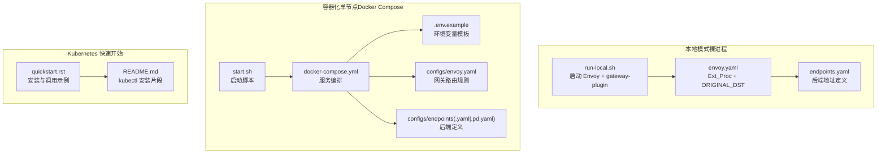
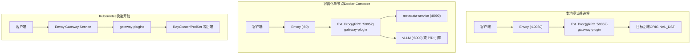
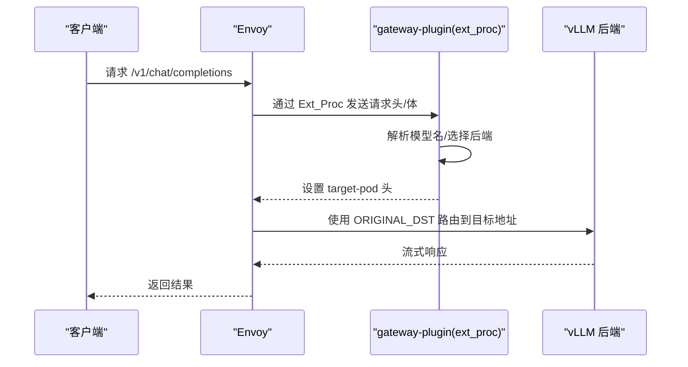
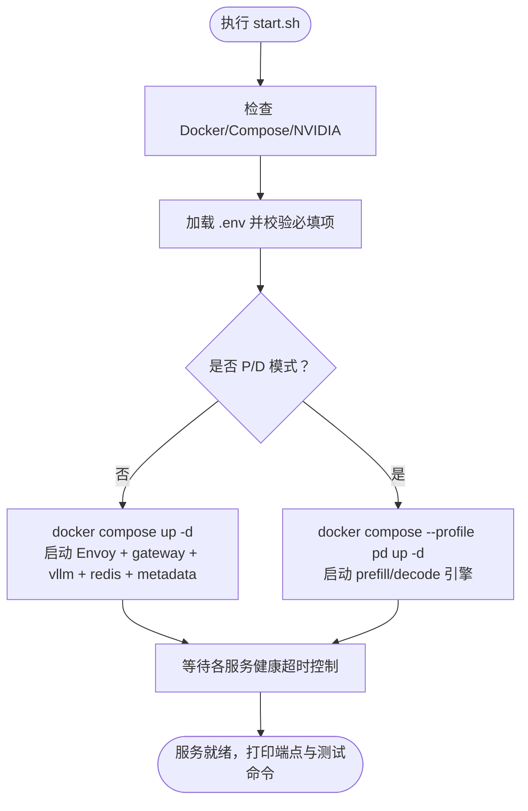
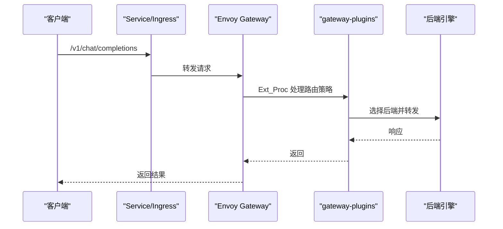
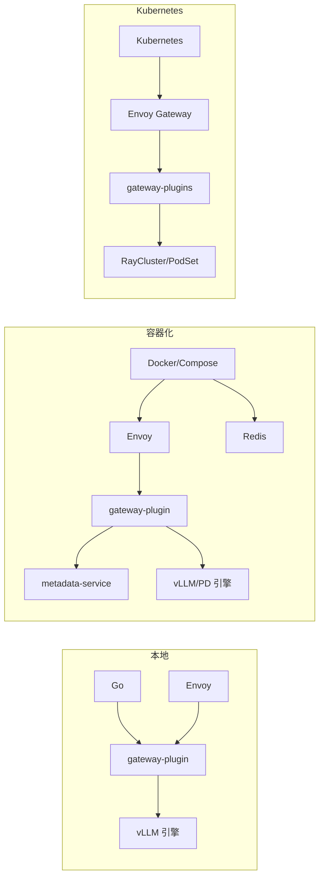

# 快速开始

<cite>
**本文引用的文件**
- [README.md](file://README.md)
- [docs/source/getting_started/quickstart.rst](file://docs/source/getting_started/quickstart.rst)
- [deployment/local/README.md](file://deployment/local/README.md)
- [deployment/local/run-local.sh](file://deployment/local/run-local.sh)
- [deployment/local/configs/envoy.yaml](file://deployment/local/configs/envoy.yaml)
- [deployment/local/configs/endpoints.yaml](file://deployment/local/configs/endpoints.yaml)
- [deployment/standalone/README.md](file://deployment/standalone/README.md)
- [deployment/standalone/start.sh](file://deployment/standalone/start.sh)
- [deployment/standalone/docker-compose.yml](file://deployment/standalone/docker-compose.yml)
- [deployment/standalone/configs/envoy.yaml](file://deployment/standalone/configs/envoy.yaml)
- [deployment/standalone/configs/endpoints.yaml](file://deployment/standalone/configs/endpoints.yaml)
- [deployment/standalone/configs/endpoints-pd.yaml](file://deployment/standalone/configs/endpoints-pd.yaml)
- [deployment/standalone/.env.example](file://deployment/standalone/.env.example)
</cite>

## 目录
1. [简介](#简介)
2. [项目结构](#项目结构)
3. [核心组件](#核心组件)
4. [架构总览](#架构总览)
5. [详细组件分析](#详细组件分析)
6. [依赖关系分析](#依赖关系分析)
7. [性能注意事项](#性能注意事项)
8. [故障排查指南](#故障排查指南)
9. [结论](#结论)
10. [附录](#附录)

## 简介
本指南面向首次接触 AIBrix 的用户，提供从零开始的完整部署流程与最佳实践，覆盖以下场景：
- 环境准备与依赖安装
- 本地开发与调试（裸进程模式）
- 单节点容器化部署（Docker Compose）
- 生产级 Kubernetes 集群部署与验证
- 常见部署问题与解决方案
- 快速验证系统功能的命令与方法

AIBrix 提供统一的网关与路由能力，支持多种后端引擎与推理范式（如 P/D 解耦），并提供开箱即用的健康检查、指标与可观测性。

## 项目结构
为便于快速上手，建议优先关注以下目录与文件：
- 本地模式：deployment/local/README.md、run-local.sh、envoy.yaml、endpoints.yaml
- 容器化单节点：deployment/standalone/README.md、start.sh、docker-compose.yml、.env.example、configs/*
- Kubernetes 快速开始：docs/source/getting_started/quickstart.rst、README.md 中的安装片段

**图表来源**
- [deployment/local/run-local.sh:1-165](file://deployment/local/run-local.sh#L1-L165)
- [deployment/local/configs/envoy.yaml:1-155](file://deployment/local/configs/envoy.yaml#L1-L155)
- [deployment/local/configs/endpoints.yaml:1-33](file://deployment/local/configs/endpoints.yaml#L1-L33)
- [deployment/standalone/start.sh:1-373](file://deployment/standalone/start.sh#L1-L373)
- [deployment/standalone/docker-compose.yml:1-261](file://deployment/standalone/docker-compose.yml#L1-L261)
- [deployment/standalone/.env.example:1-120](file://deployment/standalone/.env.example#L1-L120)
- [deployment/standalone/configs/envoy.yaml:1-320](file://deployment/standalone/configs/envoy.yaml#L1-L320)
- [deployment/standalone/configs/endpoints.yaml:1-15](file://deployment/standalone/configs/endpoints.yaml#L1-L15)
- [deployment/standalone/configs/endpoints-pd.yaml:1-22](file://deployment/standalone/configs/endpoints-pd.yaml#L1-L22)
- [docs/source/getting_started/quickstart.rst:1-194](file://docs/source/getting_started/quickstart.rst#L1-L194)
- [README.md:46-89](file://README.md#L46-L89)

**章节来源**
- [README.md:46-89](file://README.md#L46-L89)
- [docs/source/getting_started/quickstart.rst:1-194](file://docs/source/getting_started/quickstart.rst#L1-L194)
- [deployment/local/README.md:1-195](file://deployment/local/README.md#L1-L195)
- [deployment/standalone/README.md:1-397](file://deployment/standalone/README.md#L1-L397)

## 核心组件
- 网关插件（gateway-plugin）：通过 Envoy 的 External Processor 过滤器实现请求解析、模型识别、路由决策、限流与指标采集。
- Envoy：L7 代理，负责监听入口流量、健康检查、重试、熔断与 ORIGINAL_DST 路由。
- vLLM 引擎：高性能推理后端；支持单引擎或 P/D（Prefill/Decode）解耦模式。
- 元数据服务（可选）：模型注册与文件管理，用于容器化模式下的模型发现。
- Redis：共享状态存储（速率限制、会话等）。

**章节来源**
- [deployment/standalone/docker-compose.yml:218-249](file://deployment/standalone/docker-compose.yml#L218-L249)
- [deployment/standalone/configs/envoy.yaml:156-175](file://deployment/standalone/configs/envoy.yaml#L156-L175)
- [deployment/local/configs/envoy.yaml:89-109](file://deployment/local/configs/envoy.yaml#L89-L109)

## 架构总览
下图展示三种部署模式的核心交互路径与组件关系。

**图表来源**
- [deployment/local/configs/envoy.yaml:1-155](file://deployment/local/configs/envoy.yaml#L1-L155)
- [deployment/standalone/configs/envoy.yaml:1-320](file://deployment/standalone/configs/envoy.yaml#L1-L320)
- [docs/source/getting_started/quickstart.rst:62-126](file://docs/source/getting_started/quickstart.rst#L62-L126)

## 详细组件分析

### 本地模式（裸进程，适合本地开发与单机验证）
- 启动方式：run-local.sh 自动检查前置条件、启动 gateway-plugin 与 Envoy，并等待就绪。
- 关键配置：
  - endpoints.yaml：定义 vLLM 后端地址（支持单后端或多后端，支持 P/D rolesets）。
  - envoy.yaml：启用 Ext_Proc 过滤器，将请求转发至 gateway-plugin；通过 ORIGINAL_DST 使用“target-pod”头进行动态路由。
- 健康检查与端点：
  - HTTP API：:10080（聊天补全、模型列表等）
  - Envoy Admin：:9901
  - 网关指标：:8080/metrics
  - 健康检查：:10080/healthz

**图表来源**
- [deployment/local/run-local.sh:73-140](file://deployment/local/run-local.sh#L73-L140)
- [deployment/local/configs/envoy.yaml:89-154](file://deployment/local/configs/envoy.yaml#L89-L154)

**章节来源**
- [deployment/local/README.md:1-195](file://deployment/local/README.md#L1-L195)
- [deployment/local/run-local.sh:1-165](file://deployment/local/run-local.sh#L1-L165)
- [deployment/local/configs/envoy.yaml:1-155](file://deployment/local/configs/envoy.yaml#L1-L155)
- [deployment/local/configs/endpoints.yaml:1-33](file://deployment/local/configs/endpoints.yaml#L1-L33)

### 容器化单节点（Docker Compose，适合开发与小规模测试）
- 特性：OpenAI 兼容 API、Envoy 代理、vLLM 后端、可选 P/D 解耦、元数据服务、Redis。
- 启动流程：start.sh 检查前置条件（Docker、Compose、NVIDIA 运行时）、读取 .env、拉取镜像、按配置文件启动服务、等待各组件健康。
- 端口与服务：
  - Envoy：:80（入口）、:9901（Admin）
  - vLLM：:8000（默认单引擎）
  - P/D：:8001（Prefill）、:8002（Decode）
  - 元数据服务：:8090
  - Redis：:6379
  - 网关指标：:8080
- 环境变量模板：.env.example 提供模型、GPU、性能、网络、版本、日志等参数。

**图表来源**
- [deployment/standalone/start.sh:133-321](file://deployment/standalone/start.sh#L133-L321)
- [deployment/standalone/docker-compose.yml:27-250](file://deployment/standalone/docker-compose.yml#L27-L250)

**章节来源**
- [deployment/standalone/README.md:1-397](file://deployment/standalone/README.md#L1-L397)
- [deployment/standalone/start.sh:1-373](file://deployment/standalone/start.sh#L1-L373)
- [deployment/standalone/docker-compose.yml:1-261](file://deployment/standalone/docker-compose.yml#L1-L261)
- [deployment/standalone/.env.example:1-120](file://deployment/standalone/.env.example#L1-L120)
- [deployment/standalone/configs/envoy.yaml:1-320](file://deployment/standalone/configs/envoy.yaml#L1-L320)
- [deployment/standalone/configs/endpoints.yaml:1-15](file://deployment/standalone/configs/endpoints.yaml#L1-L15)
- [deployment/standalone/configs/endpoints-pd.yaml:1-22](file://deployment/standalone/configs/endpoints-pd.yaml#L1-L22)

### Kubernetes 快速开始（生产级单集群部署）
- 安装组件：先安装依赖（如 KubeRay Operator、Envoy Gateway），再安装 AIBrix 核心组件。
- 部署模型：参考示例 YAML，确保 Service 名称、标签与部署命令中的 served-model-name 一致。
- 访问网关：可通过 LoadBalancer IP 或端口转发访问；根据需要设置 routing-strategy 头以启用特定路由策略（如随机、前缀缓存、P/D）。
- 示例命令：列出模型、文本补全、聊天补全等。

**图表来源**
- [docs/source/getting_started/quickstart.rst:62-126](file://docs/source/getting_started/quickstart.rst#L62-L126)

**章节来源**
- [docs/source/getting_started/quickstart.rst:1-194](file://docs/source/getting_started/quickstart.rst#L1-L194)
- [README.md:46-89](file://README.md#L46-L89)

## 依赖关系分析
- 本地模式：仅需 Go、Envoy、vLLM 引擎；gateway-plugin 与 Envoy 通过 gRPC 和 ORIGINAL_DST 通信。
- 容器化模式：依赖 Docker/Compose 与 NVIDIA Container Toolkit；通过 Docker 网络解析服务名（gateway、vllm、metadata-service）。
- Kubernetes 模式：依赖 CRD、控制器与网关（Envoy Gateway）；通过 Service 与 Pod 网络进行服务发现与路由。

**图表来源**
- [deployment/local/run-local.sh:31-56](file://deployment/local/run-local.sh#L31-L56)
- [deployment/standalone/docker-compose.yml:27-250](file://deployment/standalone/docker-compose.yml#L27-L250)
- [docs/source/getting_started/quickstart.rst:62-126](file://docs/source/getting_started/quickstart.rst#L62-L126)

**章节来源**
- [deployment/local/README.md:31-89](file://deployment/local/README.md#L31-L89)
- [deployment/standalone/README.md:16-33](file://deployment/standalone/README.md#L16-L33)
- [docs/source/getting_started/quickstart.rst:7-24](file://docs/source/getting_started/quickstart.rst#L7-L24)

## 性能注意事项
- 上游健康检查与熔断：Envoy 配置了 circuit_breakers 与 outlier_detection，避免故障扩散。
- 路由算法：容器化模式默认 least_request，本地模式可通过环境变量切换（如 round_robin、least_request、prefix_cache_aware 等）。
- GPU 利用率与上下文长度：通过 .env 中 GPU_MEMORY_UTILIZATION 与 MAX_MODEL_LEN 调整，平衡吞吐与显存占用。
- P/D 解耦：在多 GPU 场景下，将 Prefill 与 Decode 分离可提升吞吐与资源利用率。

**章节来源**
- [deployment/standalone/configs/envoy.yaml:262-277](file://deployment/standalone/configs/envoy.yaml#L262-L277)
- [deployment/standalone/.env.example:45-58](file://deployment/standalone/.env.example#L45-L58)
- [deployment/local/README.md:154-162](file://deployment/local/README.md#L154-L162)

## 故障排查指南
- 本地模式
  - “无健康上游”：确认 endpoints.yaml 中后端地址可达且与请求模型名匹配。
  - “ext_proc gRPC 错误”：检查 gateway-plugin 日志，确认 gRPC 服务已就绪。
  - Envoy 启动失败：检查端口冲突（:10080/:9901）与配置文件路径。
- 容器化模式
  - GPU 不可用：检查 nvidia-smi 与 Docker GPU 访问；必要时安装 NVIDIA Container Toolkit。
  - 模型加载失败：查看 vLLM 日志、确认模型缓存路径与显存；尝试降低 MAX_MODEL_LEN 或 GPU_MEMORY_UTILIZATION。
  - 连接错误：检查 Envoy /ready、/clusters；直接访问 vLLM /health 排查。
  - 内存不足：减小 GPU_MEMORY_UTILIZATION、MAX_MODEL_LEN 或改用更小模型。
- Kubernetes 模式
  - 外部 IP/主机名暴露异常：根据云厂商返回值选择 .status.loadBalancer.ingress[0].hostname 或 ip。
  - 控制器与网关状态：等待组件 READY，使用 kubectl get pods -n aibrix-system 观察。

**章节来源**
- [deployment/local/README.md:186-195](file://deployment/local/README.md#L186-L195)
- [deployment/standalone/README.md:210-280](file://deployment/standalone/README.md#L210-L280)
- [docs/source/getting_started/quickstart.rst:184-193](file://docs/source/getting_started/quickstart.rst#L184-L193)

## 结论
通过本指南，您可以在本地、单节点容器化与 Kubernetes 集群三种模式中快速完成 AIBrix 的安装与验证。建议：
- 本地开发优先使用裸进程模式，便于调试与快速迭代；
- 小规模测试与演示使用 Docker Compose；
- 生产部署采用 Kubernetes，并结合 CRD 与控制器实现自动化编排。

## 附录

### 快速命令清单
- 本地模式
  - 编辑 endpoints.yaml 并启动：./run-local.sh
  - 测试：curl /v1/chat/completions
  - 查看日志：tail -f deployment/local/logs/*.log
- 容器化单节点
  - 准备 .env：cp .env.example .env
  - 启动（默认/单引擎）：./start.sh
  - 启动（P/D）：./start.sh --pd
  - 停止：docker compose down
  - 查看日志：docker compose logs -f
- Kubernetes
  - 安装依赖与核心组件：kubectl apply -f ...
  - 部署模型与网关调用：参考 quickstart.rst 示例

**章节来源**
- [deployment/local/README.md:90-121](file://deployment/local/README.md#L90-L121)
- [deployment/standalone/README.md:14-61](file://deployment/standalone/README.md#L14-L61)
- [docs/source/getting_started/quickstart.rst:19-108](file://docs/source/getting_started/quickstart.rst#L19-L108)