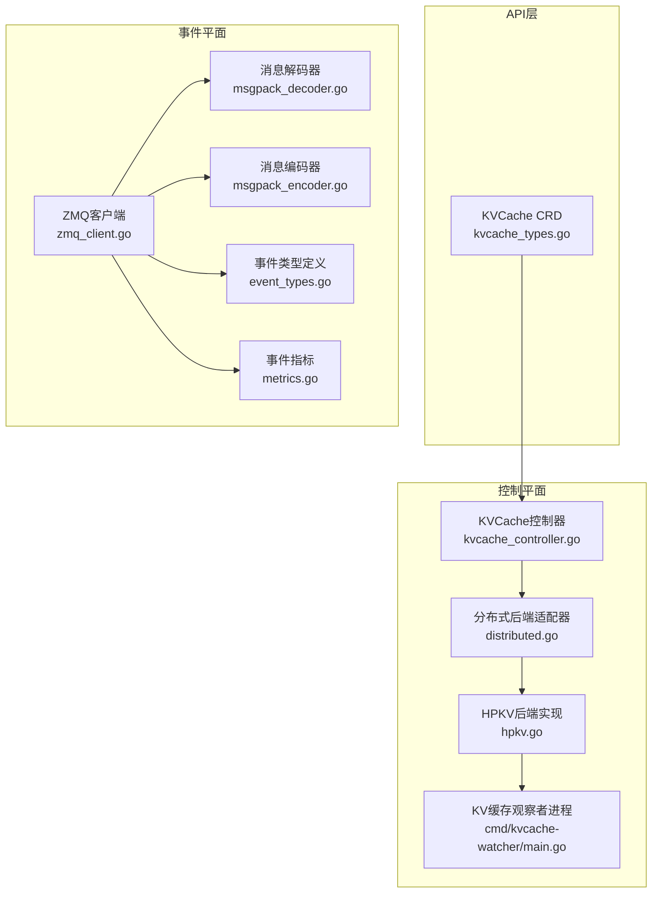
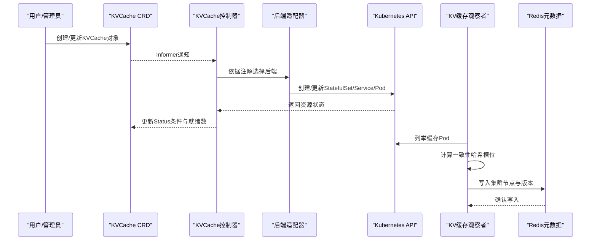
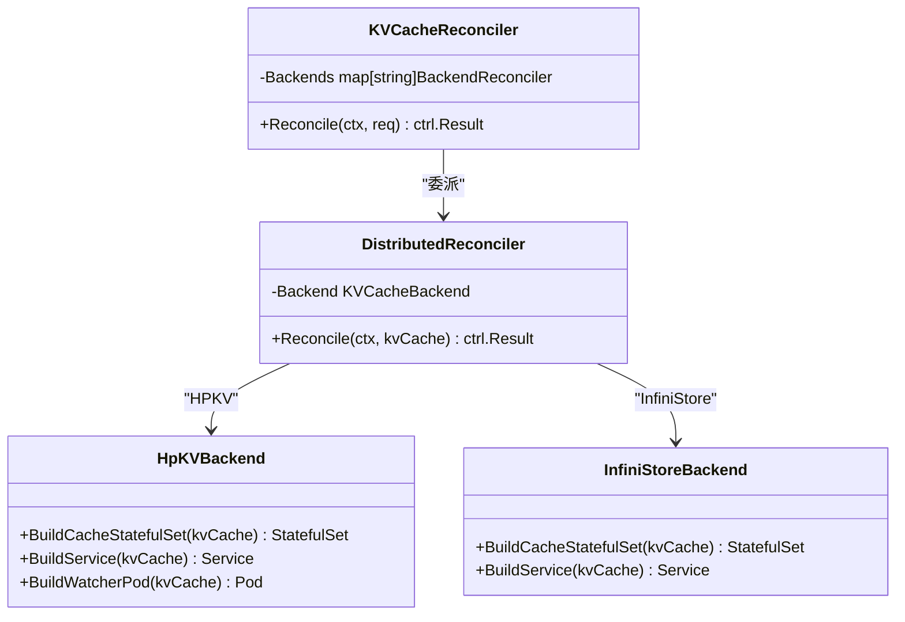
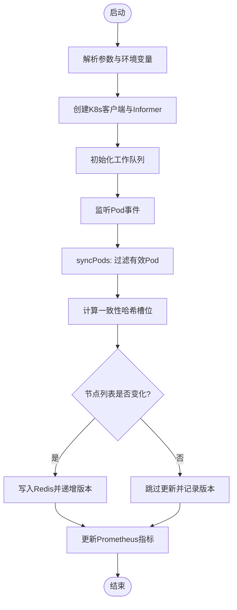
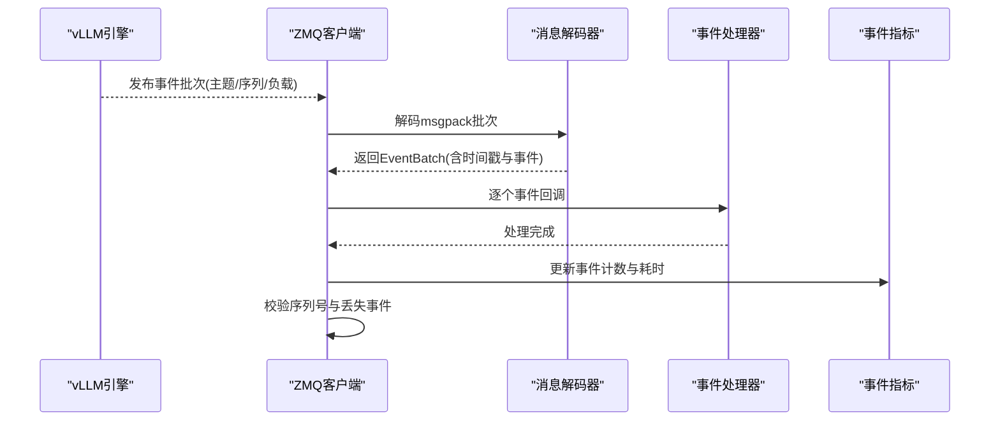
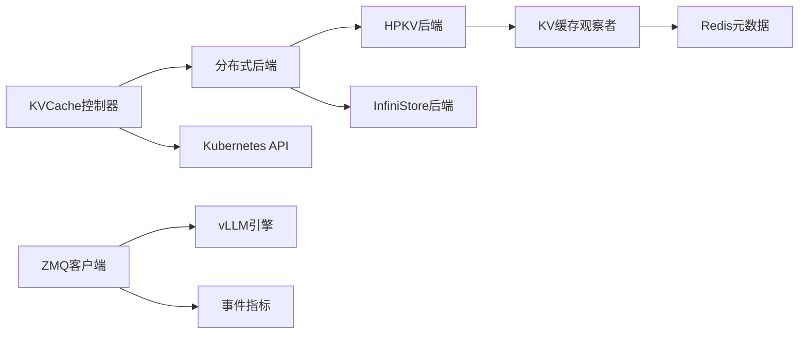

# KV缓存控制器

<cite>
**本文档引用的文件**
- [kvcache_types.go](file://api/orchestration/v1alpha1/kvcache_types.go)
- [kvcache_controller.go](file://pkg/controller/kvcache/kvcache_controller.go)
- [distributed.go](file://pkg/controller/kvcache/backends/distributed.go)
- [hpkv.go](file://pkg/controller/kvcache/backends/hpkv.go)
- [kvcache.go](file://pkg/constants/kvcache.go)
- [main.go](file://cmd/kvcache-watcher/main.go)
- [event_types.go](file://pkg/cache/kvcache/event_types.go)
- [zmq_client.go](file://pkg/cache/kvcache/zmq_client.go)
- [zmq_client_stub.go](file://pkg/cache/kvcache/zmq_client_stub.go)
- [msgpack_decoder.go](file://pkg/cache/kvcache/msgpack_decoder.go)
- [msgpack_encoder.go](file://pkg/cache/kvcache/msgpack_encoder.go)
- [metrics.go](file://pkg/cache/kvcache/metrics.go)
</cite>

## 目录
1. [简介](#简介)
2. [项目结构](#项目结构)
3. [核心组件](#核心组件)
4. [架构总览](#架构总览)
5. [详细组件分析](#详细组件分析)
6. [依赖关系分析](#依赖关系分析)
7. [性能考虑](#性能考虑)
8. [故障排查指南](#故障排查指南)
9. [结论](#结论)
10. [附录](#附录)

## 简介
本文件面向AIBrix KV缓存控制器，系统性阐述其设计架构与实现原理，覆盖以下关键主题：
- KV缓存控制器的CRD定义、字段语义与状态模型
- 缓存资源的生命周期管理与状态同步机制
- 事件处理流程：从vLLM引擎到KV缓存控制器再到事件管理器的全链路
- 控制器与事件管理器的协作模式与数据流
- 配置参数、性能调优选项与故障恢复机制
- 实际代码示例路径，展示如何处理缓存事件、管理缓存状态与优化性能

## 项目结构
AIBrix中与KV缓存相关的核心模块分布如下：
- CRD与类型定义：位于api/orchestration/v1alpha1，定义KVCache资源的规格与状态
- 控制器实现：位于pkg/controller/kvcache，包含通用控制器与后端适配器
- 事件子系统：位于pkg/cache/kvcache，负责ZMQ事件订阅、解码、编码与指标
- 辅助工具与常量：位于pkg/constants与pkg/utils
- 运行时组件：cmd/kvcache-watcher作为KV缓存成员注册与集群元数据同步的独立进程

**图表来源**
- [kvcache_types.go:85-127](file://api/orchestration/v1alpha1/kvcache_types.go#L85-L127)
- [kvcache_controller.go:100-131](file://pkg/controller/kvcache/kvcache_controller.go#L100-L131)
- [distributed.go:31-51](file://pkg/controller/kvcache/backends/distributed.go#L31-L51)
- [hpkv.go:98-104](file://pkg/controller/kvcache/backends/hpkv.go#L98-L104)
- [main.go:228-346](file://cmd/kvcache-watcher/main.go#L228-L346)
- [event_types.go:45-73](file://pkg/cache/kvcache/event_types.go#L45-L73)
- [zmq_client.go:30-70](file://pkg/cache/kvcache/zmq_client.go#L30-L70)
- [msgpack_decoder.go:27-86](file://pkg/cache/kvcache/msgpack_decoder.go#L27-L86)
- [msgpack_encoder.go:24-53](file://pkg/cache/kvcache/msgpack_encoder.go#L24-L53)
- [metrics.go:63-87](file://pkg/cache/kvcache/metrics.go#L63-L87)

**章节来源**
- [kvcache_types.go:85-127](file://api/orchestration/v1alpha1/kvcache_types.go#L85-L127)
- [kvcache_controller.go:100-131](file://pkg/controller/kvcache/kvcache_controller.go#L100-L131)
- [distributed.go:31-51](file://pkg/controller/kvcache/backends/distributed.go#L31-L51)
- [hpkv.go:98-104](file://pkg/controller/kvcache/backends/hpkv.go#L98-L104)
- [main.go:228-346](file://cmd/kvcache-watcher/main.go#L228-L346)
- [event_types.go:45-73](file://pkg/cache/kvcache/event_types.go#L45-L73)
- [zmq_client.go:30-70](file://pkg/cache/kvcache/zmq_client.go#L30-L70)
- [msgpack_decoder.go:27-86](file://pkg/cache/kvcache/msgpack_decoder.go#L27-L86)
- [msgpack_encoder.go:24-53](file://pkg/cache/kvcache/msgpack_encoder.go#L24-L53)
- [metrics.go:63-87](file://pkg/cache/kvcache/metrics.go#L63-L87)

## 核心组件
- KVCache CRD与状态模型
  - 规格字段涵盖运行模式、元数据服务配置、缓存数据面配置、观察者配置与服务暴露
  - 状态字段包含当前就绪副本数与条件列表
- KVCache控制器
  - 基于注解选择后端（vineyard/hpkv/infinistore），委派给对应后端处理器
  - 订阅KV缓存Pod变更，触发对应回调以保持期望状态
- 后端适配器
  - 分布式后端统一协调：缓存StatefulSet、服务、元数据Pod与观察者Pod
  - HPKV后端特化：注入RDMA网络、共享内存、管理员端口等参数
- KV缓存观察者进程
  - 周期性扫描目标命名空间内的缓存Pod，计算一致性哈希槽位分配并写入Redis
  - 提供Prometheus指标，记录版本号、更新次数、失败计数等
- 事件子系统
  - ZMQ客户端：订阅vLLM引擎事件，支持重连、回放、序列校验与指标上报
  - 消息编解码：按vLLM消息规范进行msgpack编解码
  - 事件类型：BlockStored、BlockRemoved、AllBlocksCleared

**章节来源**
- [kvcache_types.go:85-127](file://api/orchestration/v1alpha1/kvcache_types.go#L85-L127)
- [kvcache_controller.go:159-181](file://pkg/controller/kvcache/kvcache_controller.go#L159-L181)
- [distributed.go:53-94](file://pkg/controller/kvcache/backends/distributed.go#L53-L94)
- [hpkv.go:98-104](file://pkg/controller/kvcache/backends/hpkv.go#L98-L104)
- [main.go:406-515](file://cmd/kvcache-watcher/main.go#L406-L515)
- [event_types.go:45-73](file://pkg/cache/kvcache/event_types.go#L45-L73)
- [zmq_client.go:30-70](file://pkg/cache/kvcache/zmq_client.go#L30-L70)
- [msgpack_decoder.go:27-86](file://pkg/cache/kvcache/msgpack_decoder.go#L27-L86)
- [msgpack_encoder.go:24-53](file://pkg/cache/kvcache/msgpack_encoder.go#L24-L53)

## 架构总览
KV缓存控制器通过CRD驱动，结合后端适配器生成与维护缓存实例、元数据服务与观察者；同时通过事件子系统与vLLM引擎交互，实现KV块的存储、移除与清理事件的实时同步。

**图表来源**
- [kvcache_controller.go:100-131](file://pkg/controller/kvcache/kvcache_controller.go#L100-L131)
- [distributed.go:53-94](file://pkg/controller/kvcache/backends/distributed.go#L53-L94)
- [hpkv.go:191-377](file://pkg/controller/kvcache/backends/hpkv.go#L191-L377)
- [main.go:406-515](file://cmd/kvcache-watcher/main.go#L406-L515)

## 详细组件分析

### KVCache CRD与状态模型
- 字段说明
  - mode：运行模式（centralized/distributed）
  - metadata：元数据服务配置（Redis/Etcd）
  - cache：缓存数据面容器配置（镜像、资源、环境变量、模板等）
  - watcher：观察者Pod配置（镜像、资源、环境变量）
  - service：服务暴露配置（类型、端口）
  - status：当前就绪副本数与条件列表
- 状态转换
  - 控制器根据后端生成的资源状态更新ReadyReplicas与Conditions
  - 支持错误条件与就绪条件的组合，便于上层系统感知健康度

**章节来源**
- [kvcache_types.go:85-127](file://api/orchestration/v1alpha1/kvcache_types.go#L85-L127)

### KV缓存控制器与后端适配器
- 控制器职责
  - 初始化后端映射（vineyard/hpkv/infinistore）
  - 通过注解解析后端类型，委派至对应处理器
  - 订阅Pod变更，基于标签过滤，触发对应KVCache实例的Reconcile
- 后端适配器
  - 分布式后端：统一协调缓存、服务与元数据资源
  - HPKV后端：构建StatefulSet、Headless Service、Watcher Pod与RBAC；注入RDMA网络与共享内存；设置管理员端口与监控注解

**图表来源**
- [kvcache_controller.go:134-140](file://pkg/controller/kvcache/kvcache_controller.go#L134-L140)
- [distributed.go:31-51](file://pkg/controller/kvcache/backends/distributed.go#L31-L51)
- [hpkv.go:98-104](file://pkg/controller/kvcache/backends/hpkv.go#L98-L104)

**章节来源**
- [kvcache_controller.go:159-181](file://pkg/controller/kvcache/kvcache_controller.go#L159-L181)
- [distributed.go:53-94](file://pkg/controller/kvcache/backends/distributed.go#L53-L94)
- [hpkv.go:191-377](file://pkg/controller/kvcache/backends/hpkv.go#L191-L377)

### KV缓存观察者进程（kvcache-watcher）
- 功能要点
  - 基于Kubernetes Informer监听指定命名空间与标签的缓存Pod
  - 计算一致性哈希槽位分配，提取RDMA IP（优先从注解，其次执行命令获取）
  - 将节点列表与版本号写入Redis，支持版本递增与失败计数
  - 暴露Prometheus指标，包括集群版本、更新次数、失败次数与Pod状态分布
- 关键流程
  - 解析命令行参数与环境变量
  - 创建Informer与工作队列，处理Add/Update/Delete事件
  - 计算槽位与节点信息，比较现有与当前节点列表，必要时更新Redis

**图表来源**
- [main.go:228-346](file://cmd/kvcache-watcher/main.go#L228-L346)
- [main.go:406-515](file://cmd/kvcache-watcher/main.go#L406-L515)
- [main.go:517-554](file://cmd/kvcache-watcher/main.go#L517-L554)

**章节来源**
- [main.go:228-346](file://cmd/kvcache-watcher/main.go#L228-L346)
- [main.go:406-515](file://cmd/kvcache-watcher/main.go#L406-L515)
- [main.go:517-554](file://cmd/kvcache-watcher/main.go#L517-L554)

### 事件处理流程（ZMQ客户端与事件编解码）
- 事件类型
  - BlockStored：块被存储，携带块哈希、父块哈希、分组后的token字节、块大小
  - BlockRemoved：块被移除，携带块哈希
  - AllBlocksCleared：清空所有块
- ZMQ客户端
  - SUB套接字订阅事件，DEALER套接字发起回放请求
  - 支持连接管理、指数退避重连、序列号校验与丢失事件统计
  - 指标包括连接/断开次数、事件收发总量、处理耗时直方图、回放请求/成功/失败、错误分类与最后序列号
- 编解码
  - 解码：按vLLM格式解析msgpack批次，提取时间戳与事件数组，应用批次元数据（模型名、Pod名）
  - 编码：将事件数组转为vLLM期望的数组编码格式，去除批次元数据

**图表来源**
- [zmq_client.go:258-367](file://pkg/cache/kvcache/zmq_client.go#L258-L367)
- [msgpack_decoder.go:27-86](file://pkg/cache/kvcache/msgpack_decoder.go#L27-L86)
- [event_types.go:164-177](file://pkg/cache/kvcache/event_types.go#L164-L177)
- [metrics.go:301-350](file://pkg/cache/kvcache/metrics.go#L301-L350)

**章节来源**
- [event_types.go:45-73](file://pkg/cache/kvcache/event_types.go#L45-L73)
- [zmq_client.go:72-160](file://pkg/cache/kvcache/zmq_client.go#L72-L160)
- [msgpack_decoder.go:27-86](file://pkg/cache/kvcache/msgpack_decoder.go#L27-L86)
- [msgpack_encoder.go:24-53](file://pkg/cache/kvcache/msgpack_encoder.go#L24-L53)
- [metrics.go:301-350](file://pkg/cache/kvcache/metrics.go#L301-L350)

## 依赖关系分析
- 控制器与后端
  - KVCacheReconciler持有后端映射，按注解选择具体后端
  - DistributedReconciler统一协调缓存与元数据资源
- 控制器与Kubernetes API
  - 订阅KVCache、Service、Deployment、Pod等资源，确保期望状态一致
- 控制器与观察者
  - 通过注解与标签识别后端类型，生成对应的Watcher Pod与RBAC
- 观察者与外部系统
  - 读取K8s集群信息，写入Redis，供路由/调度使用
- 事件子系统
  - ZMQ客户端依赖ZeroMQ库（可选构建标签），与vLLM引擎通过消息协议交互

**图表来源**
- [kvcache_controller.go:62-75](file://pkg/controller/kvcache/kvcache_controller.go#L62-L75)
- [distributed.go:31-51](file://pkg/controller/kvcache/backends/distributed.go#L31-L51)
- [hpkv.go:98-104](file://pkg/controller/kvcache/backends/hpkv.go#L98-L104)
- [main.go:228-346](file://cmd/kvcache-watcher/main.go#L228-L346)
- [zmq_client.go:30-70](file://pkg/cache/kvcache/zmq_client.go#L30-L70)

**章节来源**
- [kvcache_controller.go:62-75](file://pkg/controller/kvcache/kvcache_controller.go#L62-L75)
- [distributed.go:31-51](file://pkg/controller/kvcache/backends/distributed.go#L31-L51)
- [hpkv.go:98-104](file://pkg/controller/kvcache/backends/hpkv.go#L98-L104)
- [main.go:228-346](file://cmd/kvcache-watcher/main.go#L228-L346)
- [zmq_client.go:30-70](file://pkg/cache/kvcache/zmq_client.go#L30-L70)

## 性能考虑
- 观察者进程
  - 一致性哈希虚拟节点数量与总槽位影响分布均匀性与迁移成本，建议根据Pod规模调整
  - 工作队列与速率限制器降低频繁更新带来的压力
- ZMQ客户端
  - 默认轮询超时、回放超时与重连间隔可按网络状况调优
  - 指数退避上限避免雪崩效应
- 指标监控
  - 事件处理耗时直方图用于定位瓶颈
  - 丢失事件计数用于检测网络或解码异常

[本节为通用性能指导，不直接分析具体文件]

## 故障排查指南
- 后端不支持
  - 当注解未设置或无效时，控制器会返回“不支持的后端”错误
- Redis写入失败
  - 观察者进程记录失败计数指标，检查Redis连接参数与网络连通性
- 事件丢失
  - ZMQ客户端检测到序列号跳跃并记录丢失事件，检查vLLM发布端与网络稳定性
- 重连与回放
  - 客户端自动指数退避重连，并在重连后请求回放，关注回放成功率指标

**章节来源**
- [kvcache_controller.go:173-178](file://pkg/controller/kvcache/kvcache_controller.go#L173-L178)
- [main.go:504-514](file://cmd/kvcache-watcher/main.go#L504-L514)
- [zmq_client.go:222-255](file://pkg/cache/kvcache/zmq_client.go#L222-L255)
- [metrics.go:345-350](file://pkg/cache/kvcache/metrics.go#L345-L350)

## 结论
KV缓存控制器通过清晰的CRD抽象与后端适配器模式，实现了对不同KV缓存后端的一致管理；配合观察者进程与事件子系统，形成了从资源编排到事件同步的完整闭环。该架构具备良好的扩展性与可观测性，适合在大规模推理场景中稳定运行。

[本节为总结性内容，不直接分析具体文件]

## 附录

### KV缓存控制器配置参数与调优
- 控制器级别
  - 后端选择：通过注解指定（vineyard/hpkv/infinistore）
  - 资源模板：可通过Cache.Template完全自定义Pod模板
- HPKV后端参数（注解）
  - RDMA端口、管理端口、块大小、块数量、总槽位、虚拟节点数
- 观察者进程参数
  - 后端类型、命名空间、集群ID、RDMA端口、管理端口、槽位总数、虚拟节点数
- ZMQ客户端参数
  - 轮询超时、回放超时、初始/最大重连间隔、事件通道缓冲大小

**章节来源**
- [kvcache_controller.go:173-178](file://pkg/controller/kvcache/kvcache_controller.go#L173-L178)
- [hpkv.go:53-60](file://pkg/controller/kvcache/backends/hpkv.go#L53-L60)
- [main.go:348-404](file://cmd/kvcache-watcher/main.go#L348-L404)
- [types.go:28-69](file://pkg/cache/kvcache/types.go#L28-L69)

### 事件处理与状态管理示例路径
- 处理缓存事件
  - [zmq_client.go:346-367](file://pkg/cache/kvcache/zmq_client.go#L346-L367)
  - [msgpack_decoder.go:27-86](file://pkg/cache/kvcache/msgpack_decoder.go#L27-L86)
- 管理缓存状态
  - [kvcache_controller.go:159-181](file://pkg/controller/kvcache/kvcache_controller.go#L159-L181)
  - [distributed.go:53-94](file://pkg/controller/kvcache/backends/distributed.go#L53-L94)
- 优化缓存性能
  - [hpkv.go:232-288](file://pkg/controller/kvcache/backends/hpkv.go#L232-L288)
  - [metrics.go:125-158](file://pkg/cache/kvcache/metrics.go#L125-L158)