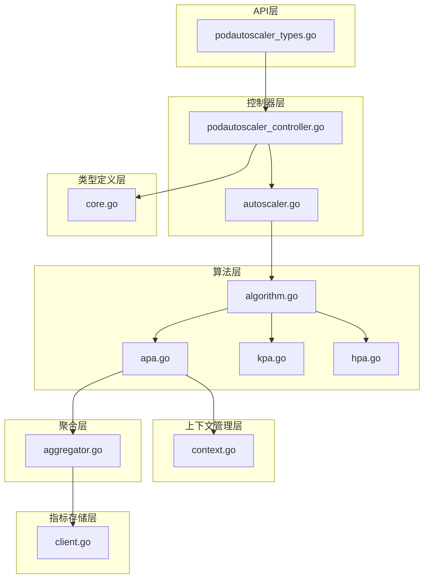
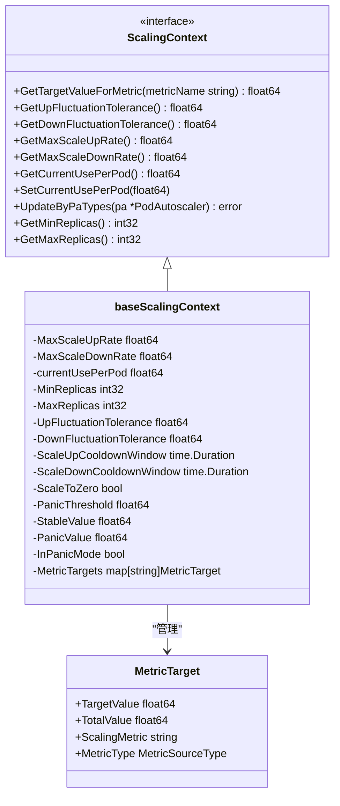
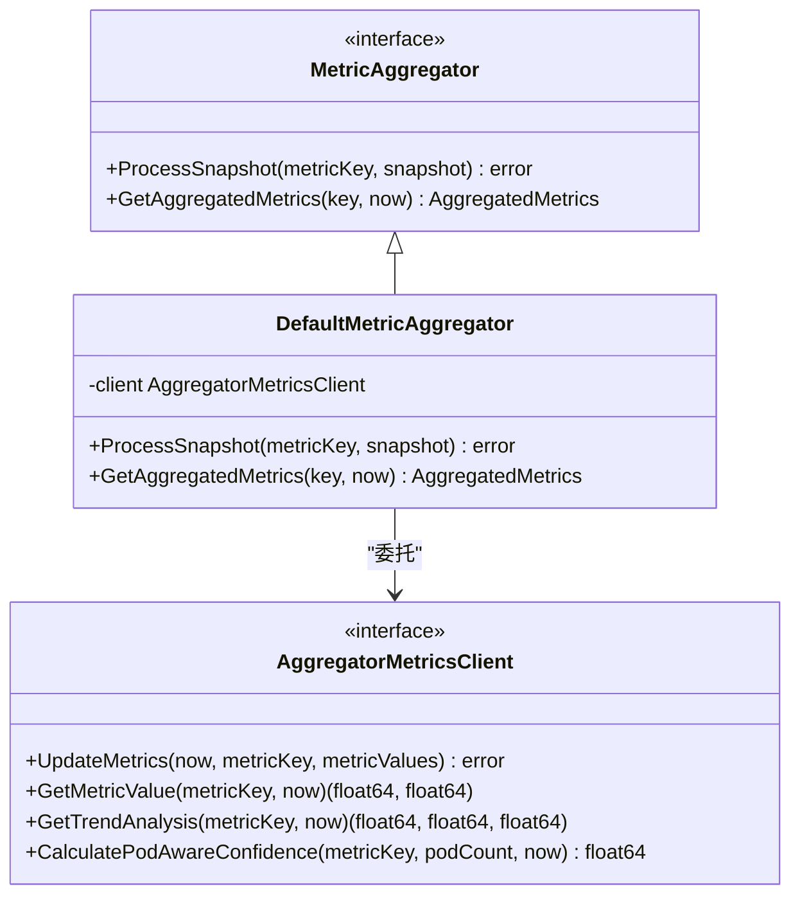
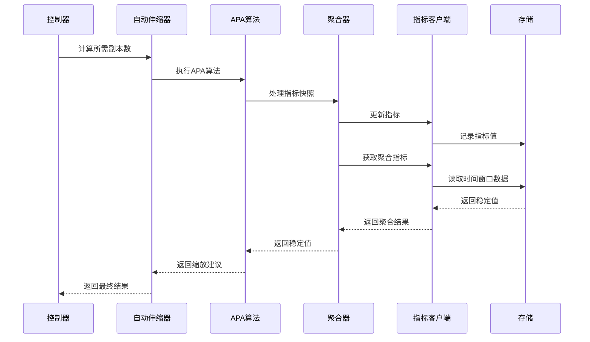
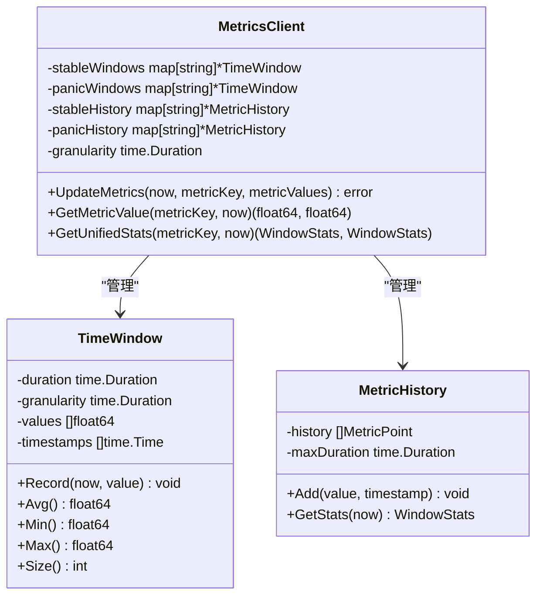
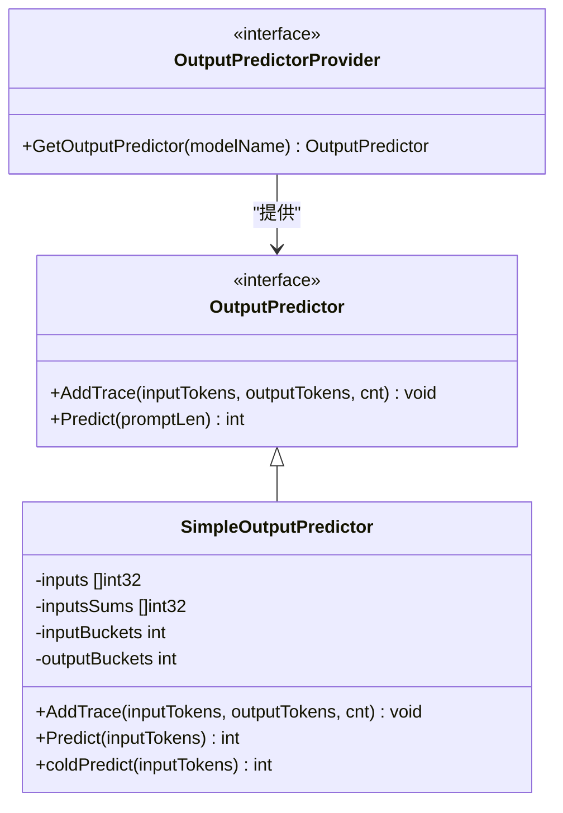
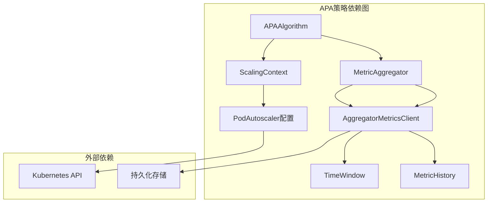

# APA策略实现

<cite>
**本文档引用的文件**
- [apa.go](file://pkg/controller/podautoscaler/algorithm/apa.go)
- [apa_test.go](file://pkg/controller/podautoscaler/algorithm/apa_test.go)
- [aggregator.go](file://pkg/controller/podautoscaler/aggregation/aggregator.go)
- [context.go](file://pkg/controller/podautoscaler/context/context.go)
- [client.go](file://pkg/controller/podautoscaler/metrics/client.go)
- [autoscaler.go](file://pkg/controller/podautoscaler/autoscaler.go)
- [podautoscaler_controller.go](file://pkg/controller/podautoscaler/podautoscaler_controller.go)
- [algorithm.go](file://pkg/controller/podautoscaler/algorithm/algorithm.go)
- [core.go](file://pkg/controller/podautoscaler/types/core.go)
- [podautoscaler_types.go](file://api/autoscaling/v1alpha1/podautoscaler_types.go)
- [apa.yaml](file://samples/autoscaling/apa.yaml)
- [output_predictor.go](file://pkg/cache/output_predictor.go)
- [output_predictor.go](file://pkg/types/output_predictor.go)
</cite>

## 目录
1. [简介](#简介)
2. [项目结构](#项目结构)
3. [核心组件](#核心组件)
4. [架构概览](#架构概览)
5. [详细组件分析](#详细组件分析)
6. [依赖关系分析](#依赖关系分析)
7. [性能考虑](#性能考虑)
8. [故障排除指南](#故障排除指南)
9. [结论](#结论)

## 简介

AIBrix APA（Application-specific Pod Autoscaling）策略是一种应用特定的Pod自动伸缩机制，专为AI推理场景设计。APA策略通过预测性伸缩技术，利用历史数据和机器学习模型进行负载预测，实现前瞻性的资源调度。

APA策略的核心特点：
- **预测性伸缩**：基于历史数据和当前趋势进行前瞻性决策
- **应用特定优化**：针对AI推理场景的特殊需求进行定制化设计
- **多指标支持**：支持CPU、内存、QPS等多种指标的综合评估
- **容错机制**：内置波动容忍度，防止过度频繁的缩放操作

## 项目结构

AIBrix项目采用模块化的架构设计，APA策略作为Pod自动伸缩系统的核心组件之一，位于以下目录结构中：



**图表来源**
- [podautoscaler_controller.go:17-70](file://pkg/controller/podautoscaler/podautoscaler_controller.go#L17-L70)
- [autoscaler.go:36-45](file://pkg/controller/podautoscaler/autoscaler.go#L36-L45)
- [apa.go:28-32](file://pkg/controller/podautoscaler/algorithm/apa.go#L28-L32)

**章节来源**
- [podautoscaler_controller.go:17-70](file://pkg/controller/podautoscaler/podautoscaler_controller.go#L17-L70)
- [autoscaler.go:36-45](file://pkg/controller/podautoscaler/autoscaler.go#L36-L45)

## 核心组件

### APA算法实现

APA算法是应用特定Pod自动伸缩的核心实现，采用状态无关的设计模式，确保线程安全和可重用性。

```mermaid
classDiagram
class APAAlgorithm {
+ComputeRecommendation(ctx, request) ScalingRecommendation
+GetAlgorithmType() string
-computeTargetReplicas(currentPodCount, context, metricsName) int32
}
class ScalingAlgorithm {
<<interface>>
+ComputeRecommendation(ctx, request) ScalingRecommendation
+GetAlgorithmType() string
}
class ScalingRequest {
+Target ScaleTarget
+CurrentReplicas int32
+AggregatedMetrics AggregatedMetrics
+ScalingContext ScalingContext
+Timestamp time.Time
}
class ScalingRecommendation {
+DesiredReplicas int32
+Confidence float64
+Reason string
+Algorithm string
+ScaleValid bool
+Metadata map[string]interface{}
}
ScalingAlgorithm <|-- APAAlgorithm
APAAlgorithm --> ScalingRequest : "使用"
APAAlgorithm --> ScalingRecommendation : "生成"
```

**图表来源**
- [apa.go:28-64](file://pkg/controller/podautoscaler/algorithm/apa.go#L28-L64)
- [algorithm.go:31-59](file://pkg/controller/podautoscaler/algorithm/algorithm.go#L31-L59)

APA算法的关键特性：
- **状态无关**：APAAlgorithm结构体为状态无关，可安全地在多个goroutine间重用
- **直接值使用**：APA策略直接使用当前值而非派生值进行计算
- **容差控制**：内置上行和下行波动容忍度，防止过度频繁的缩放

### 上下文管理器

ScalingContext接口提供了统一的配置管理，包含所有必要的缩放配置信息。



**图表来源**
- [context.go:29-103](file://pkg/controller/podautoscaler/context/context.go#L29-L103)

**章节来源**
- [context.go:29-103](file://pkg/controller/podautoscaler/context/context.go#L29-L103)
- [context.go:183-212](file://pkg/controller/podautoscaler/context/context.go#L183-L212)

### 指标聚合器

默认指标聚合器为所有策略提供统一的指标处理接口，确保APA策略能够获取稳定的指标值。



**图表来源**
- [aggregator.go:27-48](file://pkg/controller/podautoscaler/aggregation/aggregator.go#L27-L48)
- [client.go:32-39](file://pkg/controller/podautoscaler/metrics/client.go#L32-L39)

**章节来源**
- [aggregator.go:27-76](file://pkg/controller/podautoscaler/aggregation/aggregator.go#L27-L76)
- [client.go:32-84](file://pkg/controller/podautoscaler/metrics/client.go#L32-L84)

## 架构概览

AIBrix APA策略的整体架构采用分层设计，确保各组件职责清晰、耦合度低。



**图表来源**
- [autoscaler.go:237-320](file://pkg/controller/podautoscaler/autoscaler.go#L237-L320)
- [apa.go:34-59](file://pkg/controller/podautoscaler/algorithm/apa.go#L34-L59)

## 详细组件分析

### APA算法详细实现

APA算法的核心计算逻辑基于目标值和当前使用量的比率，结合波动容忍度进行决策。

```mermaid
flowchart TD
Start([开始APA算法]) --> GetTarget["获取目标值<br/>GetTargetValueForMetric()"]
GetTarget --> CheckTarget{"目标值有效？"}
CheckTarget --> |否| ReturnCurrent["返回当前副本数"]
CheckTarget --> |是| GetTolerances["获取波动容忍度<br/>上下行容忍度"]
GetTolerances --> GetCurrentUse["获取当前每Pod使用量"]
GetCurrentUse --> CalcRatio["计算使用率比率<br/>currentUsePerPod/expectedUse"]
CalcRatio --> CheckUpTolerance{"超过上行容忍度？"}
CheckUpTolerance --> |是| CalcScaleUp["计算上行缩放<br/>maxScaleUp = ceil(MaxScaleUpRate * currentPodCount)<br/>expectedPods = ceil(currentPodCount * (currentUsePerPod/expectedUse))<br/>取较小值"}
CalcScaleUp --> ApplyMaxUp["应用最大上行限制"]
ApplyMaxUp --> LogScaleUp["记录缩放操作"]
LogScaleUp --> ReturnUp["返回新副本数"]
CheckUpTolerance --> |否| CheckDownTolerance{"低于下行容忍度？"}
CheckDownTolerance --> |是| CalcScaleDown["计算下行缩放<br/>maxScaleDown = floor(currentPodCount / MaxScaleDownRate)<br/>expectedPods = ceil(currentPodCount * (currentUsePerPod/expectedUse))<br/>取较大值"]
CalcScaleDown --> ApplyMaxDown["应用最大下行限制"]
ApplyMaxDown --> LogScaleDown["记录缩放操作"]
LogScaleDown --> ReturnDown["返回新副本数"]
CheckDownTolerance --> |否| WithinTolerance["在容忍范围内"]
WithinTolerance --> ReturnCurrent
ReturnUp --> End([结束])
ReturnDown --> End
ReturnCurrent --> End
```

**图表来源**
- [apa.go:66-110](file://pkg/controller/podautoscaler/algorithm/apa.go#L66-L110)

APA算法的关键参数配置：

| 参数名称 | 默认值 | 描述 |
|---------|--------|------|
| MaxScaleUpRate | 2.0 | 最大上行缩放率（200%） |
| MaxScaleDownRate | 2.0 | 最大下行缩放率（50%） |
| UpFluctuationTolerance | 0.1 | 上行波动容忍度（10%） |
| DownFluctuationTolerance | 0.1 | 下行波动容忍度（10%） |
| ScaleDownCooldownWindow | 300s | 下行缩放冷却时间（5分钟） |

**章节来源**
- [apa.go:66-110](file://pkg/controller/podautoscaler/algorithm/apa.go#L66-L110)
- [context.go:105-118](file://pkg/controller/podautoscaler/context/context.go#L105-L118)

### 指标存储和时间窗口

APA策略使用稳定的时间窗口来存储和计算指标值，确保缩放决策的稳定性。



**图表来源**
- [client.go:55-84](file://pkg/controller/podautoscaler/metrics/client.go#L55-L84)
- [client.go:106-154](file://pkg/controller/podautoscaler/metrics/client.go#L106-L154)

APA策略的时间窗口配置：

| 窗口类型 | 持续时间 | 粒度 | 用途 |
|---------|----------|------|------|
| 稳定窗口 | 180秒 | 1秒 | APA策略的主要指标计算 |
| 惊慌窗口 | 60秒 | 1秒 | KPA策略的快速响应指标 |

**章节来源**
- [client.go:27-30](file://pkg/controller/podautoscaler/metrics/client.go#L27-L30)
- [client.go:106-154](file://pkg/controller/podautoscaler/metrics/client.go#L106-L154)

### 输出预测器集成

APA策略可以与输出预测器集成，用于预测推理场景的输出长度，从而更准确地进行资源规划。



**图表来源**
- [output_predictor.go:18-30](file://pkg/types/output_predictor.go#L18-L30)
- [output_predictor.go:196-242](file://pkg/cache/output_predictor.go#L196-L242)

**章节来源**
- [output_predictor.go:18-30](file://pkg/types/output_predictor.go#L18-L30)
- [output_predictor.go:196-242](file://pkg/cache/output_predictor.go#L196-L242)

## 依赖关系分析

APA策略的依赖关系相对简单，主要依赖于核心的缩放框架和指标系统。



**图表来源**
- [apa.go:19-26](file://pkg/controller/podautoscaler/algorithm/apa.go#L19-L26)
- [context.go:184-212](file://pkg/controller/podautoscaler/context/context.go#L184-L212)
- [aggregator.go:39-48](file://pkg/controller/podautoscaler/aggregation/aggregator.go#L39-L48)

**章节来源**
- [apa.go:19-26](file://pkg/controller/podautoscaler/algorithm/apa.go#L19-L26)
- [context.go:184-212](file://pkg/controller/podautoscaler/context/context.go#L184-L212)

## 性能考虑

APA策略在设计时充分考虑了性能优化：

### 线程安全性
- 所有算法实现都是状态无关的，可安全地在多个goroutine间共享
- 使用读写锁保护共享资源访问
- 缓存算法实例以减少内存分配

### 内存优化
- 时间窗口采用固定大小设计，避免内存无限增长
- 指标历史使用滑动窗口，只保留必要的历史数据
- 指针复用和对象池化减少垃圾回收压力

### 计算效率
- 指标聚合在单个客户端实例中完成，减少跨进程通信开销
- 使用原子操作处理并发更新
- 预计算和缓存常用值

## 故障排除指南

### 常见问题诊断

**问题1：APA策略不生效**
- 检查PodAutoscaler配置中的scalingStrategy是否设置为APA
- 验证metricsSources配置是否正确
- 确认目标工作负载存在且可访问

**问题2：缩放行为异常**
- 检查波动容忍度设置是否合理
- 验证目标值配置是否符合预期
- 查看日志中的APA详细信息

**问题3：指标获取失败**
- 确认指标端点可达性和认证配置
- 检查网络策略和防火墙规则
- 验证指标格式和数据类型

### 调试工具

APA策略提供了详细的日志输出，包括：
- APA算法详细参数（当前副本数、目标值、容忍度等）
- 指标聚合过程的中间结果
- 缩放决策的触发条件和原因

**章节来源**
- [apa.go:85-109](file://pkg/controller/podautoscaler/algorithm/apa.go#L85-L109)

## 结论

AIBrix APA策略通过其独特的预测性伸缩机制，在AI推理场景中提供了卓越的资源管理能力。该策略的核心优势包括：

1. **前瞻性决策**：基于历史数据和当前趋势进行预测，避免被动响应
2. **容错设计**：内置波动容忍度，防止过度频繁的缩放操作
3. **应用特定优化**：针对AI推理场景的特殊需求进行定制化设计
4. **高可用性**：状态无关的设计确保系统的稳定性和可靠性

APA策略特别适用于以下场景：
- 大语言模型推理服务
- 批处理推理任务
- 实时推理工作负载
- 需要精确资源控制的AI应用

通过合理的参数配置和监控，APA策略能够显著提高资源利用率，降低运营成本，同时保证服务的稳定性和响应性能。