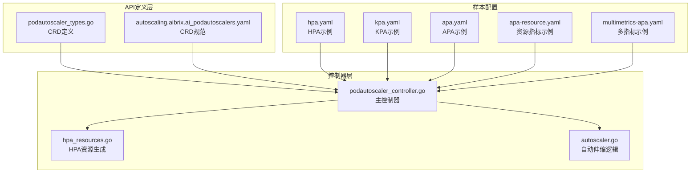
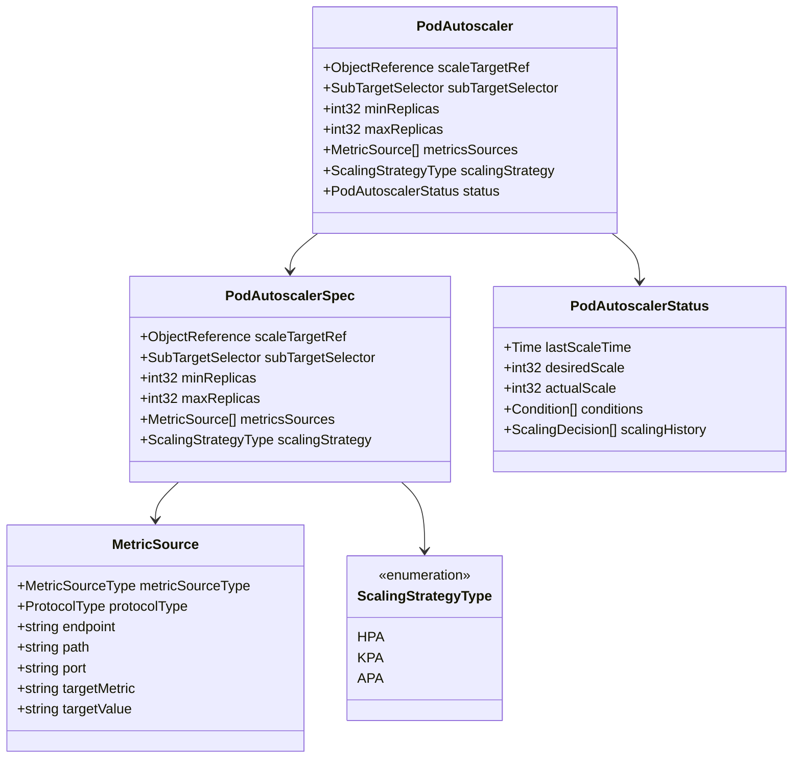
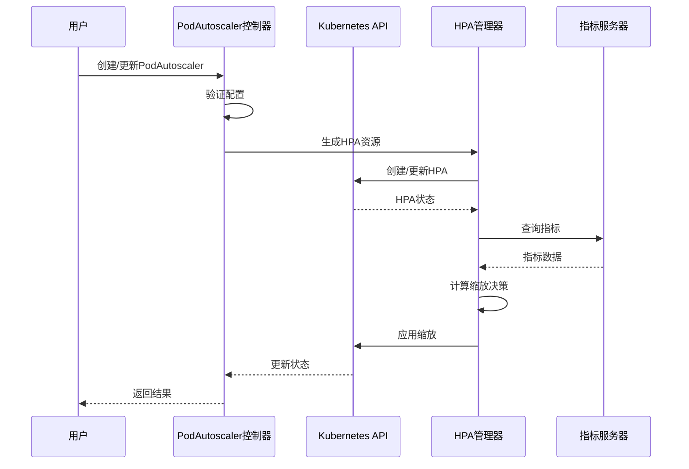
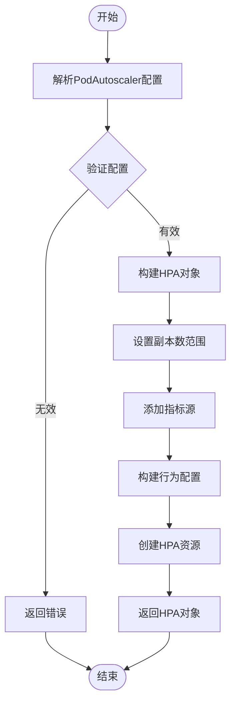
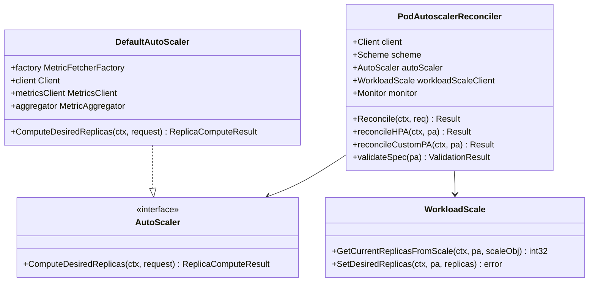
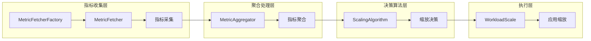
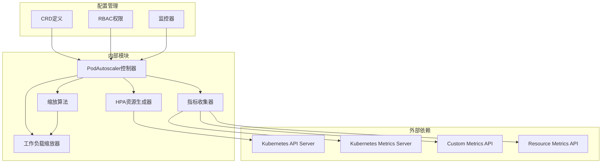

# HPA策略实现

<cite>
**本文档引用的文件**
- [podautoscaler_types.go](file://api/autoscaling/v1alpha1/podautoscaler_types.go)
- [podautoscaler_controller.go](file://pkg/controller/podautoscaler/podautoscaler_controller.go)
- [hpa_resources.go](file://pkg/controller/podautoscaler/hpa_resources.go)
- [autoscaler.go](file://pkg/controller/podautoscaler/autoscaler.go)
- [hpa.yaml](file://samples/autoscaling/hpa.yaml)
- [kpa.yaml](file://samples/autoscaling/kpa.yaml)
- [apa.yaml](file://samples/autoscaling/apa.yaml)
- [apa-resource.yaml](file://samples/autoscaling/apa-resource.yaml)
- [multimetrics-apa.yaml](file://samples/autoscaling/multimetrics-apa.yaml)
- [autoscaling.aibrix.ai_podautoscalers.yaml](file://config/crd/autoscaling/autoscaling.aibrix.ai_podautoscalers.yaml)
</cite>

## 目录
1. [简介](#简介)
2. [项目结构](#项目结构)
3. [核心组件](#核心组件)
4. [架构概览](#架构概览)
5. [详细组件分析](#详细组件分析)
6. [依赖关系分析](#依赖关系分析)
7. [性能考虑](#性能考虑)
8. [故障排除指南](#故障排除指南)
9. [结论](#结论)

## 简介

AIBrix HPA（水平Pod自动伸缩）策略是一个基于Kubernetes原生HPA的增强型自动伸缩解决方案。该实现通过创建和管理标准的HorizontalPodAutoscaler资源，提供了类似KEDA的功能，同时保持了与Kubernetes生态系统的完全兼容性。

HPA策略的核心价值在于：
- **标准化集成**：直接使用Kubernetes原生HPA资源，无需额外的适配器
- **增强功能**：提供更灵活的指标收集和处理能力
- **统一接口**：通过PodAutoscaler CRD提供一致的配置体验
- **生产就绪**：经过充分测试和验证，适合生产环境部署

## 项目结构

AIBrix HPA策略的实现遵循模块化设计原则，主要分布在以下关键目录中：

**图表来源**
- [podautoscaler_types.go:1-230](file://api/autoscaling/v1alpha1/podautoscaler_types.go#L1-L230)
- [podautoscaler_controller.go:1-800](file://pkg/controller/podautoscaler/podautoscaler_controller.go#L1-L800)
- [hpa_resources.go:1-191](file://pkg/controller/podautoscaler/hpa_resources.go#L1-L191)

**章节来源**
- [podautoscaler_types.go:1-230](file://api/autoscaling/v1alpha1/podautoscaler_types.go#L1-L230)
- [podautoscaler_controller.go:1-800](file://pkg/controller/podautoscaler/podautoscaler_controller.go#L1-L800)

## 核心组件

### PodAutoscaler CRD定义

PodAutoscaler是AIBrix自动伸缩系统的核心自定义资源，它扩展了标准的HPA功能：

**图表来源**
- [podautoscaler_types.go:42-198](file://api/autoscaling/v1alpha1/podautoscaler_types.go#L42-L198)

### ScalingStrategyType枚举

HPA策略支持三种不同的缩放策略：

| 策略类型 | 描述 | 实现方式 |
|---------|------|----------|
| HPA | Kubernetes原生水平Pod自动伸缩 | 包装标准K8s HPA资源 |
| KPA | KNative风格的Pod自动伸缩 | 基于恐慌/稳定窗口的算法 |
| APA | AiBrix特定的Pod自动伸缩 | 自定义应用感知算法 |

**章节来源**
- [podautoscaler_types.go:96-105](file://api/autoscaling/v1alpha1/podautoscaler_types.go#L96-L105)

## 架构概览

AIBrix HPA策略采用分层架构设计，确保了高内聚、低耦合的系统结构：

**图表来源**
- [podautoscaler_controller.go:270-312](file://pkg/controller/podautoscaler/podautoscaler_controller.go#L270-L312)
- [hpa_resources.go:35-128](file://pkg/controller/podautoscaler/hpa_resources.go#L35-L128)

## 详细组件分析

### HPA资源生成器

HPA资源生成器负责将PodAutoscaler配置转换为标准的Kubernetes HPA资源：

**图表来源**
- [hpa_resources.go:35-128](file://pkg/controller/podautoscaler/hpa_resources.go#L35-L128)

#### 指标类型处理

系统支持多种指标类型的处理：

| 指标类型 | 处理方式 | 示例 |
|---------|----------|------|
| CPU利用率 | 转换为平均利用率百分比 | 50%利用率阈值 |
| 内存使用量 | 转换为字节值 | 1Gi内存阈值 |
| 自定义指标 | 使用AverageValue目标 | GPU缓存使用率 |
| Pod级指标 | 使用AverageValue目标 | 请求等待数量 |

**章节来源**
- [hpa_resources.go:82-125](file://pkg/controller/podautoscaler/hpa_resources.go#L82-L125)

### PodAutoscaler控制器

控制器是HPA策略的核心执行单元，负责协调整个缩放流程：

**图表来源**
- [podautoscaler_controller.go:241-261](file://pkg/controller/podautoscaler/podautoscaler_controller.go#L241-L261)
- [autoscaler.go:36-77](file://pkg/controller/podautoscaler/autoscaler.go#L36-L77)

**章节来源**
- [podautoscaler_controller.go:270-312](file://pkg/controller/podautoscaler/podautoscaler_controller.go#L270-L312)
- [autoscaler.go:126-205](file://pkg/controller/podautoscaler/autoscaler.go#L126-L205)

### 指标收集和处理管道

系统实现了完整的指标收集、聚合和决策处理管道：

**图表来源**
- [autoscaler.go:237-320](file://pkg/controller/podautoscaler/autoscaler.go#L237-L320)

**章节来源**
- [autoscaler.go:244-320](file://pkg/controller/podautoscaler/autoscaler.go#L244-L320)

## 依赖关系分析

AIBrix HPA策略的依赖关系体现了清晰的分层架构：

**图表来源**
- [podautoscaler_controller.go:113-143](file://pkg/controller/podautoscaler/podautoscaler_controller.go#L113-L143)
- [autoscaling.aibrix.ai_podautoscalers.yaml:1-198](file://config/crd/autoscaling/autoscaling.aibrix.ai_podautoscalers.yaml#L1-L198)

**章节来源**
- [podautoscaler_controller.go:113-143](file://pkg/controller/podautoscaler/podautoscaler_controller.go#L113-L143)

## 性能考虑

### 缓存策略

系统采用了多层次的缓存机制来优化性能：

1. **算法实例缓存**：算法实例是无状态的，可以安全地缓存和重用
2. **指标聚合缓存**：聚合后的指标数据进行缓存，减少重复计算
3. **配置缓存**：ScalingContext配置按需加载和缓存

### 并发控制

- 所有组件都是线程安全的
- 使用读写锁保护共享资源
- 支持并发协调器运行，避免竞态条件

### 资源优化

- 状态无关的自动伸缩器按需创建
- 只在需要时建立指标客户端连接
- 合理的重试机制避免过度请求

## 故障排除指南

### 常见问题诊断

| 问题类型 | 症状 | 可能原因 | 解决方案 |
|---------|------|----------|----------|
| HPA创建失败 | 控制器日志显示创建错误 | 权限不足或配置错误 | 检查RBAC权限和HPA配置 |
| 指标获取失败 | 指标服务器连接超时 | Metrics Server不可用 | 检查Metrics Server状态 |
| 缩放不生效 | HPA状态显示缩放延迟 | 冷却时间未过期 | 等待冷却时间结束 |
| 配置冲突 | 多个PA控制同一目标 | 目标冲突检测 | 移除冲突的PA配置 |

### 调试技巧

1. **查看控制器日志**：关注HPA创建和更新操作
2. **检查HPA状态**：观察HPA的条件和状态字段
3. **验证指标可用性**：确认指标服务器正常运行
4. **测试指标端点**：验证自定义指标端点可达性

**章节来源**
- [podautoscaler_controller.go:516-546](file://pkg/controller/podautoscaler/podautoscaler_controller.go#L516-L546)

## 结论

AIBrix HPA策略通过巧妙地包装标准Kubernetes HPA资源，成功实现了KEDA-like的功能增强。该实现具有以下优势：

1. **兼容性强**：完全基于Kubernetes原生资源，无需额外依赖
2. **功能丰富**：支持多种指标类型和缩放策略
3. **易于使用**：通过CRD提供简化的配置界面
4. **生产就绪**：经过充分测试，适合生产环境部署

对于需要在Kubernetes环境中实现智能自动伸缩的用户，AIBrix HPA策略提供了一个可靠、高效且易于维护的解决方案。通过合理配置和监控，可以在保证服务稳定性的同时，最大化资源利用效率。