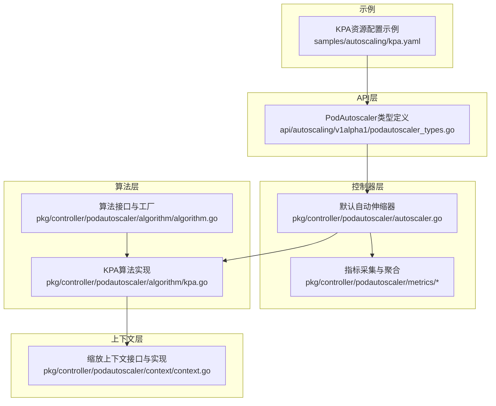
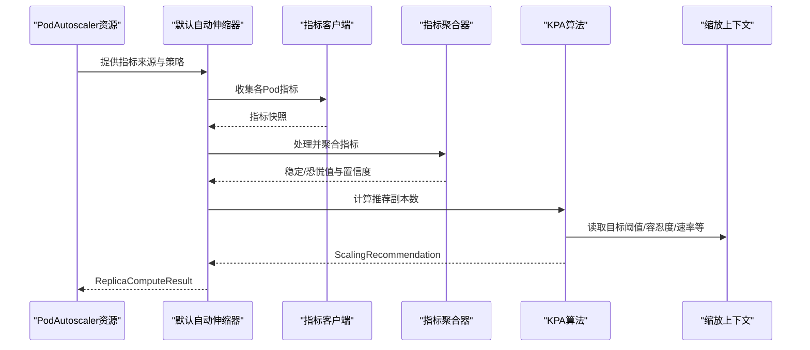
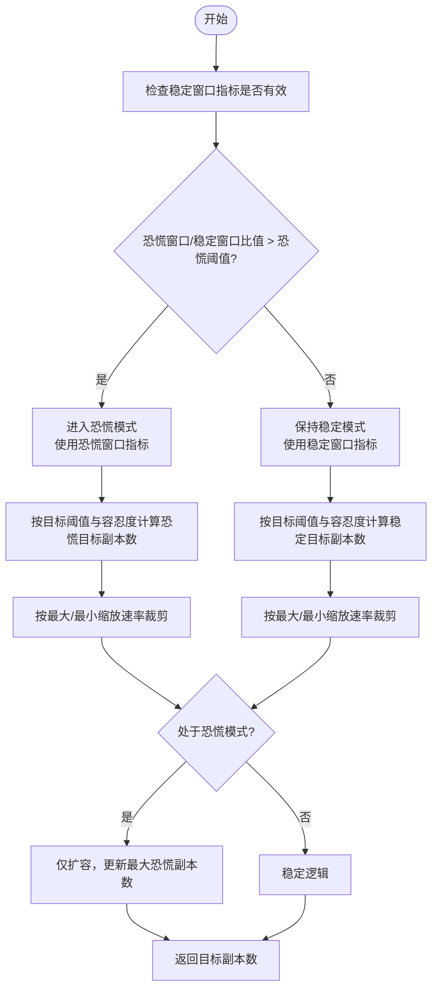
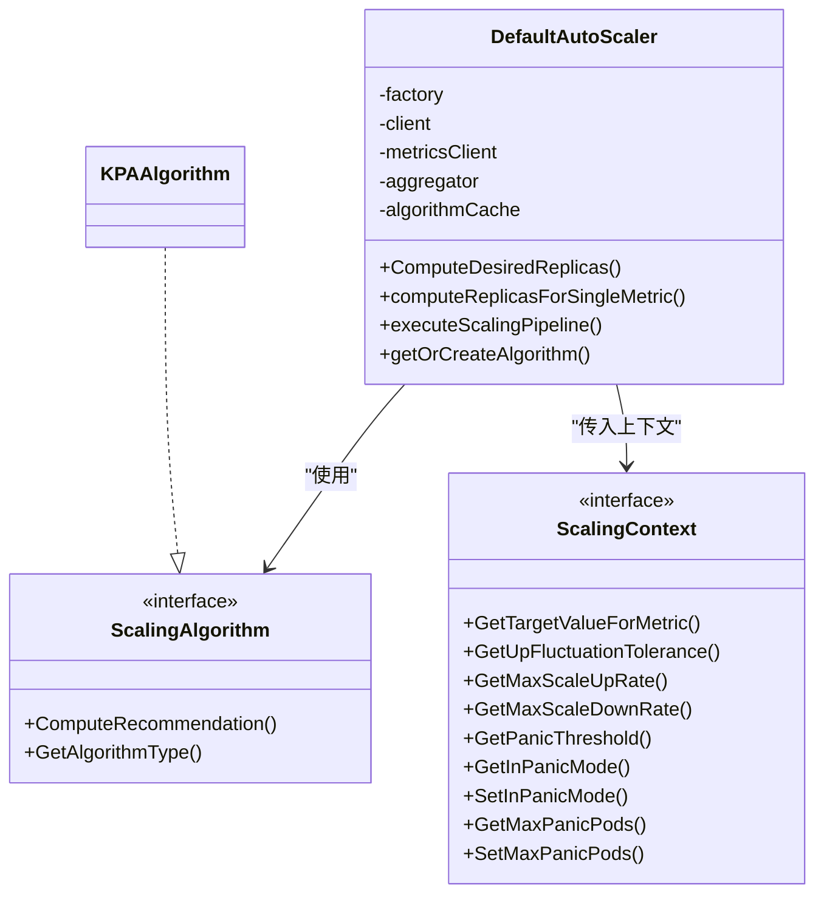
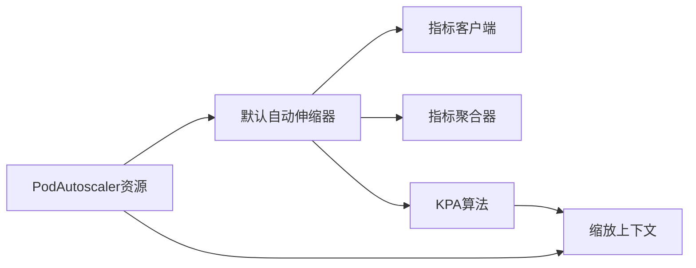

# KPA策略实现

<cite>
**本文档引用的文件**
- [kpa.go](file://pkg/controller/podautoscaler/algorithm/kpa.go)
- [autoscaler.go](file://pkg/controller/podautoscaler/autoscaler.go)
- [context.go](file://pkg/controller/podautoscaler/context/context.go)
- [podautoscaler_types.go](file://api/autoscaling/v1alpha1/podautoscaler_types.go)
- [kpa.yaml](file://samples/autoscaling/kpa.yaml)
- [algorithm.go](file://pkg/controller/podautoscaler/algorithm/algorithm.go)
</cite>

## 目录
1. [简介](#简介)
2. [项目结构](#项目结构)
3. [核心组件](#核心组件)
4. [架构总览](#架构总览)
5. [详细组件分析](#详细组件分析)
6. [依赖分析](#依赖分析)
7. [性能考虑](#性能考虑)
8. [故障排查指南](#故障排查指南)
9. [结论](#结论)
10. [附录](#附录)

## 简介
本文件面向AIBrix中的KPA（Knativestyle Pod Autoscaling）策略，系统性阐述其基于请求量的自动伸缩机制。KPA通过区分“恐慌窗口”（panic window）与“稳定窗口”（stable window）两类指标观测，结合目标阈值与波动容忍度，在突发流量场景下快速扩容，并在稳定状态下进行平滑调节。本文将从架构设计、数据流、算法实现、配置参数到与传统HPA的差异进行全面解析。

## 项目结构
KPA策略位于控制器子系统中，采用分层设计：上层负责指标采集与聚合，中间层执行具体算法，下层维护可复用的上下文配置。核心文件分布如下：
- 算法层：KPA算法实现
- 控制器层：统一的自动伸缩管线与调度
- 上下文层：集中管理所有可调参数与状态
- API层：定义PodAutoscaler资源与指标来源

图表来源
- [podautoscaler_types.go:1-230](file://api/autoscaling/v1alpha1/podautoscaler_types.go#L1-L230)
- [autoscaler.go:1-323](file://pkg/controller/podautoscaler/autoscaler.go#L1-L323)
- [kpa.go:1-192](file://pkg/controller/podautoscaler/algorithm/kpa.go#L1-L192)
- [context.go:1-320](file://pkg/controller/podautoscaler/context/context.go#L1-L320)
- [algorithm.go:1-200](file://pkg/controller/podautoscaler/algorithm/algorithm.go#L1-L200)
- [kpa.yaml:1-26](file://samples/autoscaling/kpa.yaml#L1-L26)

章节来源
- [podautoscaler_types.go:1-230](file://api/autoscaling/v1alpha1/podautoscaler_types.go#L1-L230)
- [autoscaler.go:1-323](file://pkg/controller/podautoscaler/autoscaler.go#L1-L323)
- [kpa.go:1-192](file://pkg/controller/podautoscaler/algorithm/kpa.go#L1-L192)
- [context.go:1-320](file://pkg/controller/podautoscaler/context/context.go#L1-L320)
- [algorithm.go:1-200](file://pkg/controller/podautoscaler/algorithm/algorithm.go#L1-L200)
- [kpa.yaml:1-26](file://samples/autoscaling/kpa.yaml#L1-L26)

## 核心组件
- KPA算法实现：基于稳定/恐慌两种窗口的指标比较，动态选择当前使用的观测值，并结合目标阈值与波动容忍度计算目标副本数。
- 默认自动伸缩器：封装完整的指标采集、聚合、算法决策流程，支持多指标并行评估并取最大推荐值。
- 缩放上下文：集中管理目标阈值、波动容忍度、最大缩放速率、恐慌阈值、冷却时间、激活规模等参数，同时维护恐慌模式状态与最大恐慌副本数。
- PodAutoscaler资源：定义指标来源、目标指标名称与阈值、最小/最大副本数、缩放策略类型等。

章节来源
- [kpa.go:30-88](file://pkg/controller/podautoscaler/algorithm/kpa.go#L30-L88)
- [autoscaler.go:65-137](file://pkg/controller/podautoscaler/autoscaler.go#L65-L137)
- [context.go:29-118](file://pkg/controller/podautoscaler/context/context.go#L29-L118)
- [podautoscaler_types.go:54-152](file://api/autoscaling/v1alpha1/podautoscaler_types.go#L54-L152)

## 架构总览
KPA策略的控制流由“采集—聚合—决策—约束应用”构成，整体流程如下：

图表来源
- [autoscaler.go:237-320](file://pkg/controller/podautoscaler/autoscaler.go#L237-L320)
- [kpa.go:41-83](file://pkg/controller/podautoscaler/algorithm/kpa.go#L41-L83)
- [context.go:31-56](file://pkg/controller/podautoscaler/context/context.go#L31-L56)

## 详细组件分析

### KPA算法实现
KPA算法的核心在于“恐慌模式”的识别与切换，以及在不同模式下的目标副本数计算策略：
- 模式判定：当恐慌窗口指标与稳定窗口指标的比值超过设定的恐慌阈值时，进入恐慌模式；否则保持稳定模式。
- 目标副本数：分别以稳定/恐慌观测值与目标阈值计算期望副本数，再结合上下文的最大/最小缩放速率进行裁剪；若启用激活规模且当前已激活，则保证不低于激活规模。
- 恐慌模式行为：仅允许扩容，禁止缩容；记录并沿用最大恐慌副本数作为当前目标副本数，直到退出恐慌模式或指标回落至阈值以内。

图表来源
- [kpa.go:90-191](file://pkg/controller/podautoscaler/algorithm/kpa.go#L90-L191)
- [context.go:105-118](file://pkg/controller/podautoscaler/context/context.go#L105-L118)

章节来源
- [kpa.go:41-191](file://pkg/controller/podautoscaler/algorithm/kpa.go#L41-L191)
- [context.go:105-118](file://pkg/controller/podautoscaler/context/context.go#L105-L118)

### 默认自动伸缩器
默认自动伸缩器负责串联整个缩放流程：
- 多指标并行：遍历所有指标来源，独立计算推荐副本数，最终取最大值作为最终推荐。
- 管线化处理：采集→聚合→增强置信度→算法决策→结果格式化。
- 算法缓存：按策略类型缓存算法实例（算法为无状态结构体，可安全复用）。

图表来源
- [autoscaler.go:65-137](file://pkg/controller/podautoscaler/autoscaler.go#L65-L137)
- [kpa.go:30-34](file://pkg/controller/podautoscaler/algorithm/kpa.go#L30-L34)
- [context.go:29-56](file://pkg/controller/podautoscaler/context/context.go#L29-L56)

章节来源
- [autoscaler.go:126-205](file://pkg/controller/podautoscaler/autoscaler.go#L126-L205)
- [autoscaler.go:237-320](file://pkg/controller/podautoscaler/autoscaler.go#L237-L320)

### 缩放上下文与参数
缩放上下文集中管理KPA所需的关键参数与状态：
- 目标阈值：按指标来源逐项配置，用于计算目标副本数。
- 波动容忍度：分别定义向上与向下容忍度，避免微小波动导致频繁缩放。
- 最大缩放速率：限制单次缩放的幅度，保证稳定性。
- 冷却时间：缩放冷却窗口，防止反复震荡。
- 恐慌阈值：决定是否进入恐慌模式。
- 激活规模：当启用且已激活时，保证最小副本数不低于该值。
- 状态字段：记录当前稳定/恐慌值、恐慌模式标志、最大恐慌副本数等。

章节来源
- [context.go:29-118](file://pkg/controller/podautoscaler/context/context.go#L29-L118)
- [context.go:183-212](file://pkg/controller/podautoscaler/context/context.go#L183-L212)

### PodAutoscaler资源与指标来源
PodAutoscaler资源定义了缩放策略、指标来源与目标阈值：
- 指标来源类型：支持从Pod端点、Kubernetes资源、自定义指标、外部服务等采集。
- 目标指标与阈值：每条指标来源包含目标指标名与目标阈值字符串，运行时解析为数值。
- 策略类型：KPA策略通过scalingStrategy指定。

章节来源
- [podautoscaler_types.go:54-152](file://api/autoscaling/v1alpha1/podautoscaler_types.go#L54-L152)
- [podautoscaler_types.go:184-229](file://api/autoscaling/v1alpha1/podautoscaler_types.go#L184-L229)

### 配置示例与参数说明
以下示例展示了KPA策略的基本配置要点：
- 资源类型与策略：KPA策略类型。
- 副本范围：最小/最大副本数。
- 指标来源：从Pod端点采集指标，指定协议、端口、路径与目标指标名及阈值。
- 注解：可通过注解设置缩放冷却时间等高级参数。

章节来源
- [kpa.yaml:1-26](file://samples/autoscaling/kpa.yaml#L1-L26)

## 依赖分析
KPA策略的依赖关系清晰，模块间耦合度低，职责边界明确：
- 默认自动伸缩器依赖指标客户端与聚合器，但不直接关心具体算法实现。
- KPA算法实现依赖缩放上下文接口，通过接口抽象屏蔽具体实现细节。
- PodAutoscaler资源定义与算法/上下文之间通过类型与注解建立松耦合联系。

图表来源
- [autoscaler.go:126-205](file://pkg/controller/podautoscaler/autoscaler.go#L126-L205)
- [kpa.go:41-83](file://pkg/controller/podautoscaler/algorithm/kpa.go#L41-L83)
- [context.go:31-56](file://pkg/controller/podautoscaler/context/context.go#L31-L56)

章节来源
- [autoscaler.go:126-205](file://pkg/controller/podautoscaler/autoscaler.go#L126-L205)
- [kpa.go:41-83](file://pkg/controller/podautoscaler/algorithm/kpa.go#L41-L83)
- [context.go:31-56](file://pkg/controller/podautoscaler/context/context.go#L31-L56)

## 性能考虑
- 并发与无状态：算法与上下文均为无状态设计，支持并发重入与缓存复用，降低锁竞争与内存占用。
- 指标聚合：通过聚合器统一处理健康Pod集合上的指标，减少重复计算与网络开销。
- 速率限制：最大缩放速率与冷却时间共同作用，避免过度抖动，提升系统稳定性。
- 多指标取优：对多个指标来源分别计算后取最大值，兼顾多维度负载特征。

## 故障排查指南
- 指标来源无效：若所有指标来源均失败，将返回无效结果。建议检查指标端点可达性、协议与端口配置、路径正确性。
- 目标阈值异常：目标阈值必须为正数，解析失败或小于等于0会导致错误。请确认指标来源中的阈值字符串格式正确。
- 恐慌模式持续：若恐慌模式长期维持，可能由于目标阈值过低或突发流量持续。可适当提高目标阈值或调整恐慌阈值。
- 冷却时间影响：缩放冷却时间过长可能导致响应迟缓。可根据业务特性调整缩放冷却窗口。
- 日志定位：算法内部输出关键参数与计算过程日志，便于定位问题。

章节来源
- [autoscaler.go:132-135](file://pkg/controller/podautoscaler/autoscaler.go#L132-L135)
- [context.go:184-212](file://pkg/controller/podautoscaler/context/context.go#L184-L212)
- [kpa.go:160-167](file://pkg/controller/podautoscaler/algorithm/kpa.go#L160-L167)

## 结论
KPA策略通过“稳定/恐慌双窗口”与“波动容忍度+速率限制”的组合，实现了对突发流量的快速响应与对稳定状态的平滑调节。其无状态、可缓存的设计使其具备良好的并发性能与扩展性；配合灵活的上下文参数与多指标评估，能够适配多样化的高并发场景。相较传统HPA，KPA在应对瞬时高负载时具有更短的响应延迟与更低的抖动风险。

## 附录

### KPA与HPA的主要区别
- 观测窗口：KPA引入恐慌窗口与稳定窗口，HPA通常基于单一时间窗口。
- 模式切换：KPA根据指标比值动态切换模式，HPA主要依赖阈值与容忍度。
- 扩缩容策略：KPA在恐慌模式下仅扩容并记录最大副本数，HPA按比例缩放。
- 参数体系：KPA强调目标阈值、恐慌阈值、波动容忍度与速率限制，HPA侧重CPU/内存等资源指标。

### 关键参数速查
- 目标阈值：每个指标来源的目标阈值，用于计算目标副本数。
- 上/下波动容忍度：避免微小波动引发缩放。
- 最大缩放速率（上/下）：限制单次缩放幅度。
- 恐慌阈值：决定是否进入恐慌模式。
- 冷却时间（上/下）：防止频繁缩放。
- 激活规模：激活后的最小副本数保障。

章节来源
- [context.go:105-118](file://pkg/controller/podautoscaler/context/context.go#L105-L118)
- [podautoscaler_types.go:184-229](file://api/autoscaling/v1alpha1/podautoscaler_types.go#L184-L229)