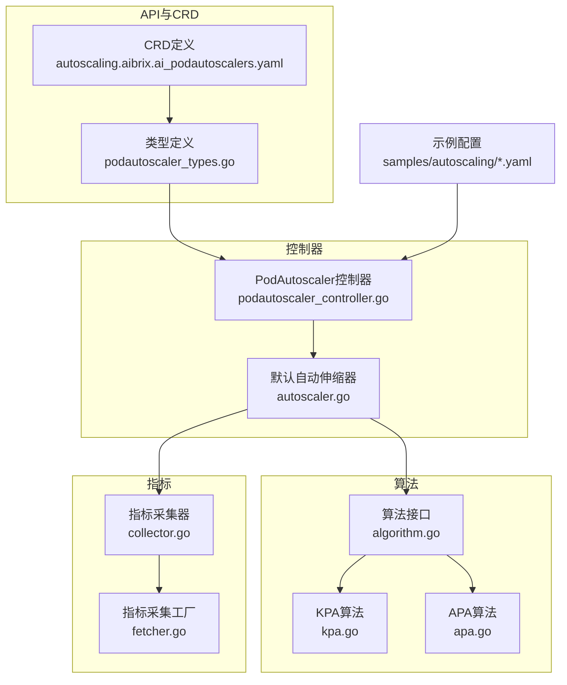
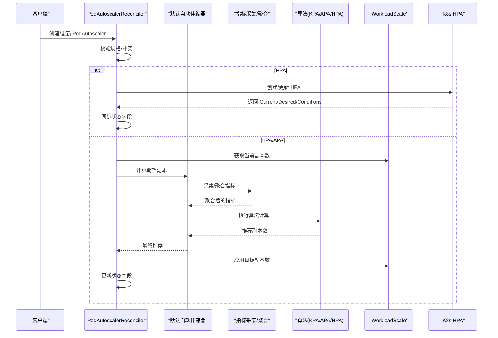
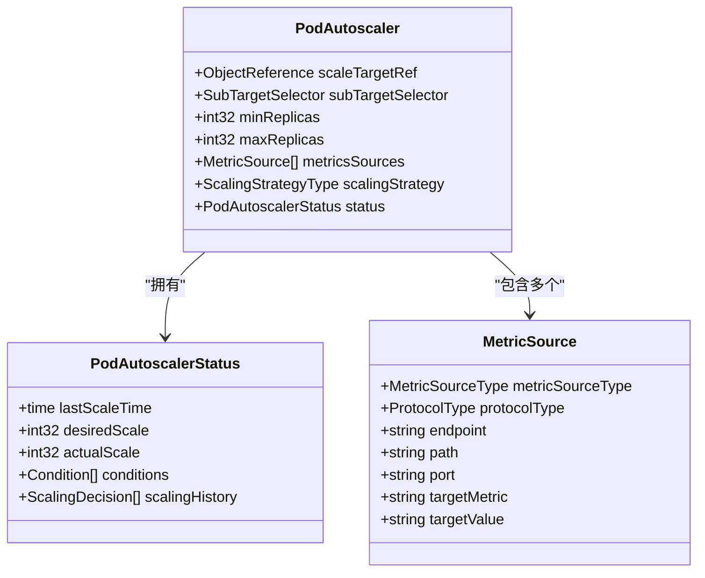
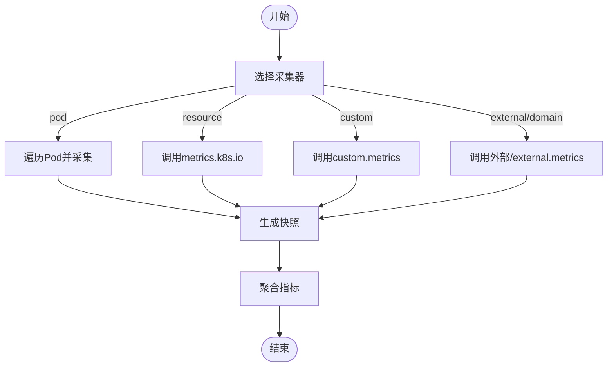
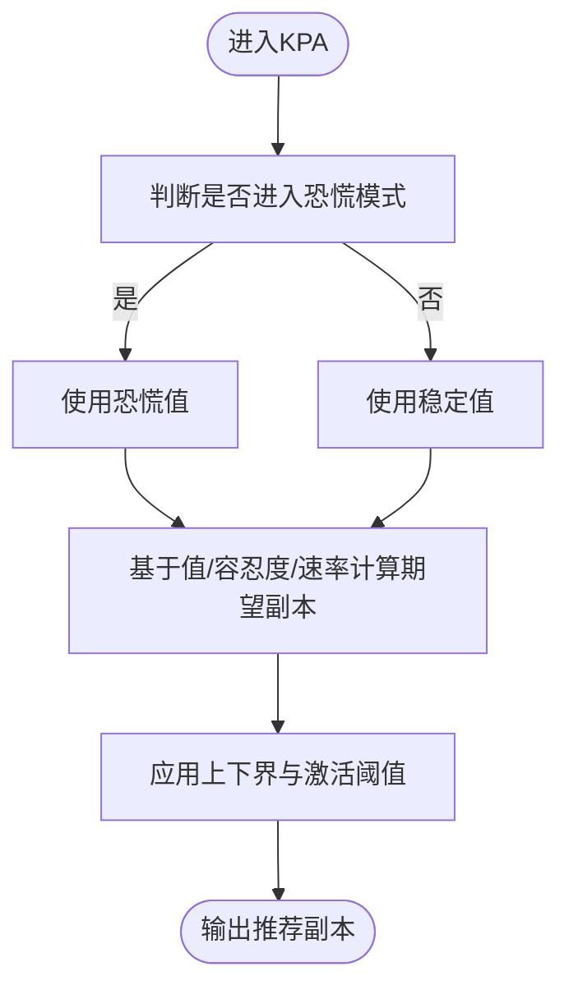
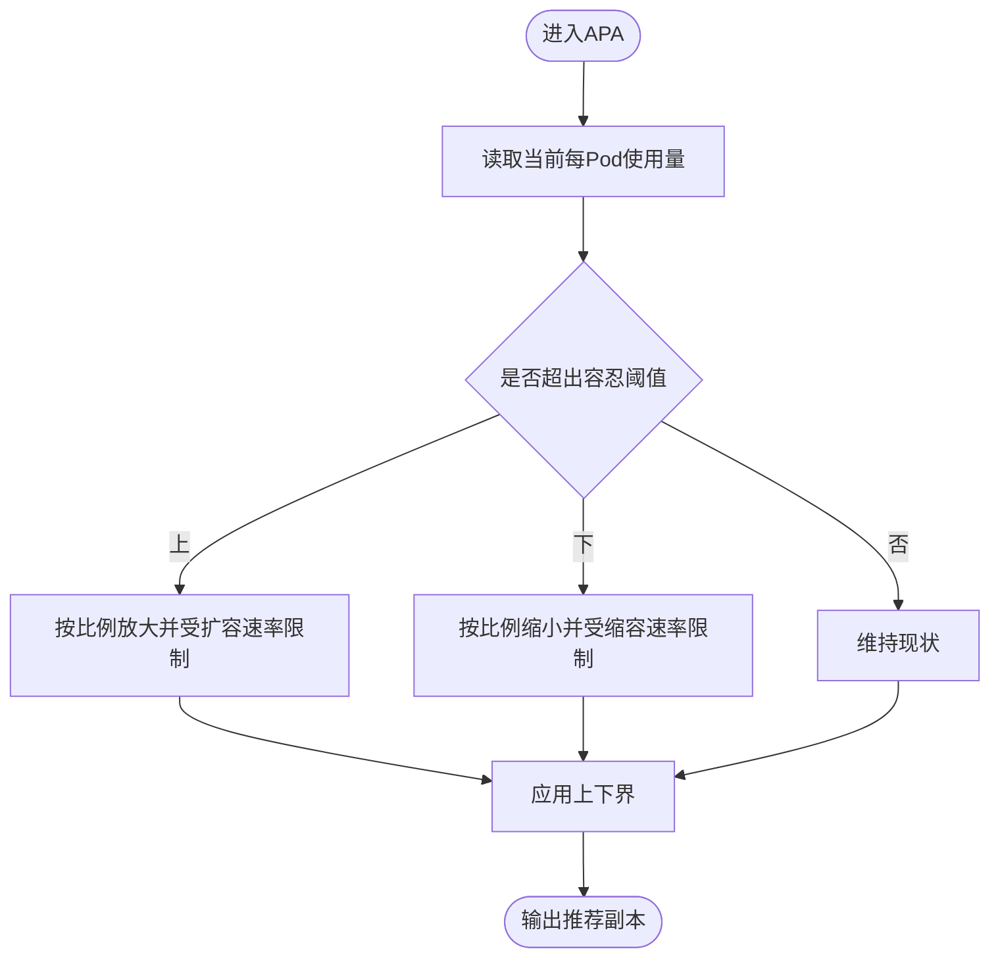
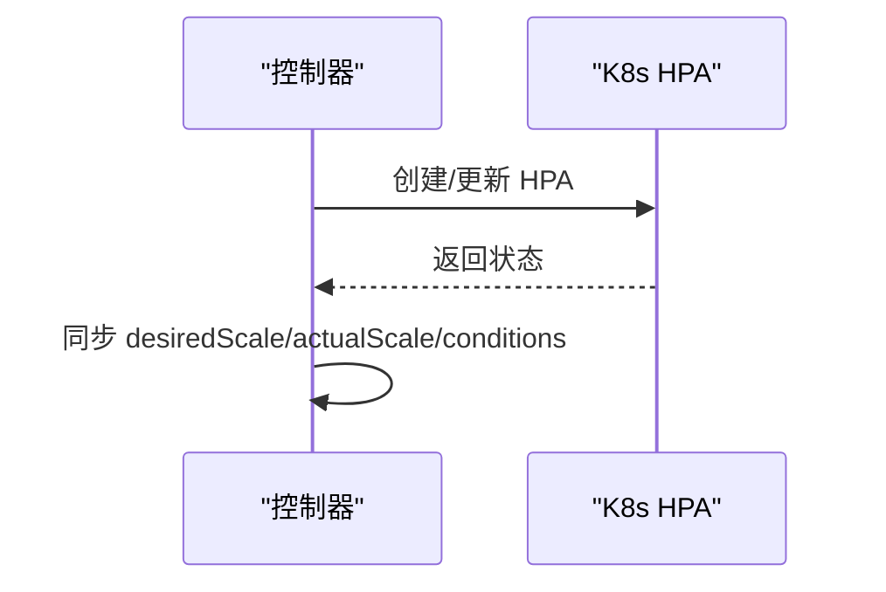
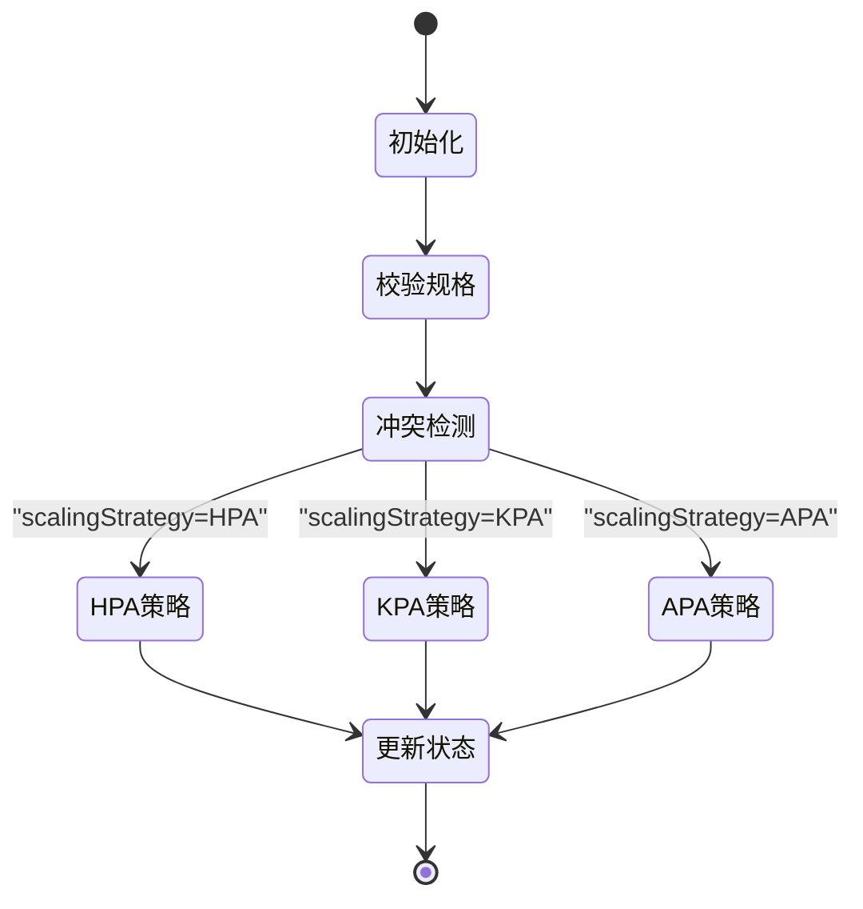
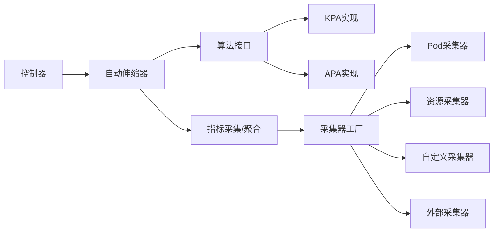

# Pod自动伸缩控制器

<cite>
**本文引用的文件**
- [api/autoscaling/v1alpha1/podautoscaler_types.go](file://api/autoscaling/v1alpha1/podautoscaler_types.go)
- [pkg/controller/podautoscaler/podautoscaler_controller.go](file://pkg/controller/podautoscaler/podautoscaler_controller.go)
- [pkg/controller/podautoscaler/autoscaler.go](file://pkg/controller/podautoscaler/autoscaler.go)
- [config/crd/autoscaling/autoscaling.aibrix.ai_podautoscalers.yaml](file://config/crd/autoscaling/autoscaling.aibrix.ai_podautoscalers.yaml)
- [pkg/controller/podautoscaler/algorithm/algorithm.go](file://pkg/controller/podautoscaler/algorithm/algorithm.go)
- [pkg/controller/podautoscaler/algorithm/kpa.go](file://pkg/controller/podautoscaler/algorithm/kpa.go)
- [pkg/controller/podautoscaler/algorithm/apa.go](file://pkg/controller/podautoscaler/algorithm/apa.go)
- [pkg/controller/podautoscaler/metrics/collector.go](file://pkg/controller/podautoscaler/metrics/collector.go)
- [pkg/controller/podautoscaler/metrics/fetcher.go](file://pkg/controller/podautoscaler/metrics/fetcher.go)
- [samples/autoscaling/hpa.yaml](file://samples/autoscaling/hpa.yaml)
- [samples/autoscaling/kpa.yaml](file://samples/autoscaling/kpa.yaml)
- [samples/autoscaling/apa.yaml](file://samples/autoscaling/apa.yaml)
</cite>

## 目录
1. [简介](#简介)
2. [项目结构](#项目结构)
3. [核心组件](#核心组件)
4. [架构总览](#架构总览)
5. [详细组件分析](#详细组件分析)
6. [依赖分析](#依赖分析)
7. [性能考虑](#性能考虑)
8. [故障排查指南](#故障排查指南)
9. [结论](#结论)
10. [附录](#附录)

## 简介
本技术文档面向AIBrix Pod自动伸缩控制器，系统性阐述其核心功能与工作原理，覆盖以下要点：
- 自动伸缩策略：HPA（Kubernetes原生）、KPA（Knative风格）、APA（应用感知）的集成与实现
- CRD定义与状态模型：PodAutoscaler资源的规范、字段语义与状态流转
- 指标采集机制：多来源指标采集（Pod端点、资源、自定义、外部服务）与聚合
- 伸缩决策流程：从指标采集到算法计算再到目标副本数确定
- 配置与调优：策略选择、阈值设置、波动容忍、窗口参数、成本优化建议
- 实战示例：如何配置不同类型的自动伸缩器、处理异常、监控效果
- 与监控系统的集成：指标采集、事件记录与可观测性最佳实践

## 项目结构
AIBrix在控制器层提供了统一的PodAutoscaler控制器，支持三种策略；在算法层分别实现了KPA、APA与HPA适配；在指标层通过工厂模式抽象了多种采集器，并对多来源指标进行统一处理。

**图表来源**
- [config/crd/autoscaling/autoscaling.aibrix.ai_podautoscalers.yaml:1-198](file://config/crd/autoscaling/autoscaling.aibrix.ai_podautoscalers.yaml#L1-L198)
- [api/autoscaling/v1alpha1/podautoscaler_types.go:40-230](file://api/autoscaling/v1alpha1/podautoscaler_types.go#L40-L230)
- [pkg/controller/podautoscaler/podautoscaler_controller.go:103-227](file://pkg/controller/podautoscaler/podautoscaler_controller.go#L103-L227)
- [pkg/controller/podautoscaler/autoscaler.go:65-98](file://pkg/controller/podautoscaler/autoscaler.go#L65-L98)
- [pkg/controller/podautoscaler/algorithm/algorithm.go:31-74](file://pkg/controller/podautoscaler/algorithm/algorithm.go#L31-L74)
- [pkg/controller/podautoscaler/algorithm/kpa.go:30-88](file://pkg/controller/podautoscaler/algorithm/kpa.go#L30-L88)
- [pkg/controller/podautoscaler/algorithm/apa.go:28-64](file://pkg/controller/podautoscaler/algorithm/apa.go#L28-L64)
- [pkg/controller/podautoscaler/metrics/collector.go:31-43](file://pkg/controller/podautoscaler/metrics/collector.go#L31-L43)
- [pkg/controller/podautoscaler/metrics/fetcher.go:288-331](file://pkg/controller/podautoscaler/metrics/fetcher.go#L288-L331)
- [samples/autoscaling/hpa.yaml:1-24](file://samples/autoscaling/hpa.yaml#L1-L24)
- [samples/autoscaling/kpa.yaml:1-26](file://samples/autoscaling/kpa.yaml#L1-L26)
- [samples/autoscaling/apa.yaml:1-28](file://samples/autoscaling/apa.yaml#L1-L28)

**章节来源**
- [config/crd/autoscaling/autoscaling.aibrix.ai_podautoscalers.yaml:1-198](file://config/crd/autoscaling/autoscaling.aibrix.ai_podautoscalers.yaml#L1-L198)
- [api/autoscaling/v1alpha1/podautoscaler_types.go:40-230](file://api/autoscaling/v1alpha1/podautoscaler_types.go#L40-L230)
- [pkg/controller/podautoscaler/podautoscaler_controller.go:103-227](file://pkg/controller/podautoscaler/podautoscaler_controller.go#L103-L227)

## 核心组件
- PodAutoscaler CRD与类型：定义伸缩目标、最小/最大副本、指标来源、策略类型、状态字段与条件
- 控制器：负责验证、冲突检测、状态更新、策略分发（HPA/KPA/APA）
- 默认自动伸缩器：封装指标采集、聚合、算法执行与结果合并
- 算法层：KPA（稳定/恐慌窗口、波动容忍、激活阈值）、APA（当前使用率/趋势、波动容忍）、HPA（KEDA式包装）
- 指标层：工厂模式抽象多种采集器（Pod端点、资源、自定义、外部），统一返回快照

**章节来源**
- [api/autoscaling/v1alpha1/podautoscaler_types.go:53-198](file://api/autoscaling/v1alpha1/podautoscaler_types.go#L53-L198)
- [pkg/controller/podautoscaler/podautoscaler_controller.go:270-312](file://pkg/controller/podautoscaler/podautoscaler_controller.go#L270-L312)
- [pkg/controller/podautoscaler/autoscaler.go:36-98](file://pkg/controller/podautoscaler/autoscaler.go#L36-L98)

## 架构总览
控制器采用“按需创建、无状态”的自动伸缩器管理方式，避免状态泄漏；对HPA策略直接生成标准K8s HPA资源，对KPA/APA策略则通过WorkloadScale直接调整目标副本数。

**图表来源**
- [pkg/controller/podautoscaler/podautoscaler_controller.go:303-311](file://pkg/controller/podautoscaler/podautoscaler_controller.go#L303-L311)
- [pkg/controller/podautoscaler/podautoscaler_controller.go:664-714](file://pkg/controller/podautoscaler/podautoscaler_controller.go#L664-L714)
- [pkg/controller/podautoscaler/podautoscaler_controller.go:718-794](file://pkg/controller/podautoscaler/podautoscaler_controller.go#L718-L794)
- [pkg/controller/podautoscaler/autoscaler.go:128-205](file://pkg/controller/podautoscaler/autoscaler.go#L128-L205)

## 详细组件分析

### CRD与状态模型
- 规格字段
  - scaleTargetRef：被伸缩对象（如Deployment）
  - subTargetSelector：在StormService/RoleSet中按角色细分
  - minReplicas/maxReplicas：副本上下界
  - metricsSources：指标来源列表（至少一个）
  - scalingStrategy：HPA/KPA/APA
- 状态字段
  - lastScaleTime/desiredScale/actualScale/conditions/scalingHistory

**图表来源**
- [api/autoscaling/v1alpha1/podautoscaler_types.go:53-152](file://api/autoscaling/v1alpha1/podautoscaler_types.go#L53-L152)
- [api/autoscaling/v1alpha1/podautoscaler_types.go:171-198](file://api/autoscaling/v1alpha1/podautoscaler_types.go#L171-L198)

**章节来源**
- [config/crd/autoscaling/autoscaling.aibrix.ai_podautoscalers.yaml:44-117](file://config/crd/autoscaling/autoscaling.aibrix.ai_podautoscalers.yaml#L44-L117)
- [api/autoscaling/v1alpha1/podautoscaler_types.go:53-198](file://api/autoscaling/v1alpha1/podautoscaler_types.go#L53-L198)

### 指标采集与聚合
- 采集入口：根据MetricSourceType选择对应采集器
- 支持来源
  - pod：HTTP访问Pod端点（http/https）
  - resource：K8s资源指标（cpu/memory）
  - custom：K8s自定义指标
  - external/domain：外部服务或K8s external.metrics API
- 聚合：将各Pod指标快照汇总为稳定值/恐慌值/趋势/置信度

**图表来源**
- [pkg/controller/podautoscaler/metrics/collector.go:31-43](file://pkg/controller/podautoscaler/metrics/collector.go#L31-L43)
- [pkg/controller/podautoscaler/metrics/fetcher.go:288-331](file://pkg/controller/podautoscaler/metrics/fetcher.go#L288-L331)

**章节来源**
- [pkg/controller/podautoscaler/metrics/collector.go:31-129](file://pkg/controller/podautoscaler/metrics/collector.go#L31-L129)
- [pkg/controller/podautoscaler/metrics/fetcher.go:36-332](file://pkg/controller/podautoscaler/metrics/fetcher.go#L36-L332)

### KPA算法（Knsvtive风格）
- 特点：区分稳定窗口与恐慌窗口，动态切换模式；支持上/下行波动容忍、最大扩容/缩容速率、激活阈值
- 决策流程：根据当前稳定/恐慌值与目标阈值比较，结合容忍度与速率限制，计算期望副本数，并施加上下界约束

**图表来源**
- [pkg/controller/podautoscaler/algorithm/kpa.go:41-96](file://pkg/controller/podautoscaler/algorithm/kpa.go#L41-L96)
- [pkg/controller/podautoscaler/algorithm/kpa.go:98-191](file://pkg/controller/podautoscaler/algorithm/kpa.go#L98-L191)

**章节来源**
- [pkg/controller/podautoscaler/algorithm/kpa.go:30-192](file://pkg/controller/podautoscaler/algorithm/kpa.go#L30-L192)

### APA算法（应用感知）
- 特点：直接以当前每Pod使用量与目标期望比值进行缩放；支持上/下行波动容忍与速率限制
- 决策流程：当当前使用超出/低于容忍阈值时，按比例推导期望副本数，再受速率与上下界约束

**图表来源**
- [pkg/controller/podautoscaler/algorithm/apa.go:34-110](file://pkg/controller/podautoscaler/algorithm/apa.go#L34-L110)

**章节来源**
- [pkg/controller/podautoscaler/algorithm/apa.go:28-111](file://pkg/controller/podautoscaler/algorithm/apa.go#L28-L111)

### HPA策略（KEDA式包装）
- 控制器为HPA策略生成并维护标准K8s HPA资源，自动同步Current/Desired/Conditions到PodAutoscaler状态
- 适用于需要与K8s生态深度集成的场景

**图表来源**
- [pkg/controller/podautoscaler/podautoscaler_controller.go:664-714](file://pkg/controller/podautoscaler/podautoscaler_controller.go#L664-L714)

**章节来源**
- [pkg/controller/podautoscaler/podautoscaler_controller.go:662-715](file://pkg/controller/podautoscaler/podautoscaler_controller.go#L662-L715)

### 控制器协调与状态机
- 校验与冲突检测：确保规格合法、目标唯一受控
- 策略分发：HPA直连K8s HPA；KPA/APA走WorkloadScale
- 状态更新：Ready/ScalingActive/AbleToScale/ValidSpec等条件与历史记录

**图表来源**
- [pkg/controller/podautoscaler/podautoscaler_controller.go:286-311](file://pkg/controller/podautoscaler/podautoscaler_controller.go#L286-L311)
- [pkg/controller/podautoscaler/podautoscaler_controller.go:595-660](file://pkg/controller/podautoscaler/podautoscaler_controller.go#L595-L660)

**章节来源**
- [pkg/controller/podautoscaler/podautoscaler_controller.go:270-312](file://pkg/controller/podautoscaler/podautoscaler_controller.go#L270-L312)
- [pkg/controller/podautoscaler/podautoscaler_controller.go:595-660](file://pkg/controller/podautoscaler/podautoscaler_controller.go#L595-L660)

## 依赖分析
- 组件内聚与耦合
  - 控制器与自动伸缩器解耦：通过接口传递请求与上下文，便于并发与测试
  - 算法层无状态且可缓存复用，降低实例化开销
  - 指标层通过工厂模式屏蔽来源差异，提升扩展性
- 外部依赖
  - K8s指标客户端（metrics.k8s.io、custom.metrics、external.metrics）
  - Pod端点HTTP指标（由引擎侧提供）

**图表来源**
- [pkg/controller/podautoscaler/autoscaler.go:65-98](file://pkg/controller/podautoscaler/autoscaler.go#L65-L98)
- [pkg/controller/podautoscaler/algorithm/algorithm.go:31-74](file://pkg/controller/podautoscaler/algorithm/algorithm.go#L31-L74)
- [pkg/controller/podautoscaler/metrics/fetcher.go:288-331](file://pkg/controller/podautoscaler/metrics/fetcher.go#L288-L331)

**章节来源**
- [pkg/controller/podautoscaler/autoscaler.go:65-98](file://pkg/controller/podautoscaler/autoscaler.go#L65-L98)
- [pkg/controller/podautoscaler/metrics/fetcher.go:288-331](file://pkg/controller/podautoscaler/metrics/fetcher.go#L288-L331)

## 性能考虑
- 并发与无状态：算法与采集器均设计为无状态，支持高并发重入，减少锁竞争
- 指标聚合：在上层统一聚合，避免重复计算；对健康Pod数量进行信心增强预留
- 速率限制：KPA/APA内置上/下行速率限制，防止抖动
- 定期同步：控制器周期性入队所有PA，保证在指标异常或事件丢失时仍能收敛

[本节为通用指导，无需具体文件引用]

## 故障排查指南
- 常见问题定位
  - 规格校验失败：检查scaleTargetRef、minReplicas/maxReplicas、metricsSources必填项
  - 指标来源错误：确认protocolType/port/path/endpoint/path/targetMetric/targetValue配置正确
  - 冲突控制：同一目标仅允许一个PodAutoscaler受控，避免多PA互相覆盖
  - HPA创建失败：检查RBAC与HPA资源权限
- 日志与事件
  - 控制器日志包含采集/聚合/算法计算关键步骤
  - 事件记录包含成功/失败原因，便于快速定位
- 状态字段
  - Ready/ScalingActive/AbleToScale/ValidSpec等条件用于快速判断运行状态

**章节来源**
- [pkg/controller/podautoscaler/podautoscaler_controller.go:382-514](file://pkg/controller/podautoscaler/podautoscaler_controller.go#L382-L514)
- [pkg/controller/podautoscaler/podautoscaler_controller.go:718-794](file://pkg/controller/podautoscaler/podautoscaler_controller.go#L718-L794)

## 结论
AIBrix Pod自动伸缩控制器以统一的CRD与控制器为核心，通过可插拔的指标采集与算法模块，灵活支持HPA、KPA、APA三种策略。其设计强调无状态、可扩展与可观测性，既可无缝对接K8s生态，又能在应用侧实现更精细的伸缩控制。配合合理的阈值与波动容忍配置，可在保证SLA的同时有效降低成本。

[本节为总结，无需具体文件引用]

## 附录

### 配置与示例路径
- HPA示例：[samples/autoscaling/hpa.yaml:1-24](file://samples/autoscaling/hpa.yaml#L1-L24)
- KPA示例：[samples/autoscaling/kpa.yaml:1-26](file://samples/autoscaling/kpa.yaml#L1-L26)
- APA示例：[samples/autoscaling/apa.yaml:1-28](file://samples/autoscaling/apa.yaml#L1-L28)

### 关键配置项说明
- scalingStrategy：选择策略类型（HPA/KPA/APA）
- metricsSources：至少包含一个指标源，支持pod/resource/custom/external
- minReplicas/maxReplicas：副本上下界
- subTargetSelector：在多角色目标中选择子目标（如StormService的roleName）
- 注解（APA）：波动容忍、窗口等高级参数可通过注解传入

**章节来源**
- [api/autoscaling/v1alpha1/podautoscaler_types.go:53-118](file://api/autoscaling/v1alpha1/podautoscaler_types.go#L53-L118)
- [samples/autoscaling/hpa.yaml:10-23](file://samples/autoscaling/hpa.yaml#L10-L23)
- [samples/autoscaling/kpa.yaml:12-25](file://samples/autoscaling/kpa.yaml#L12-L25)
- [samples/autoscaling/apa.yaml:14-27](file://samples/autoscaling/apa.yaml#L14-L27)