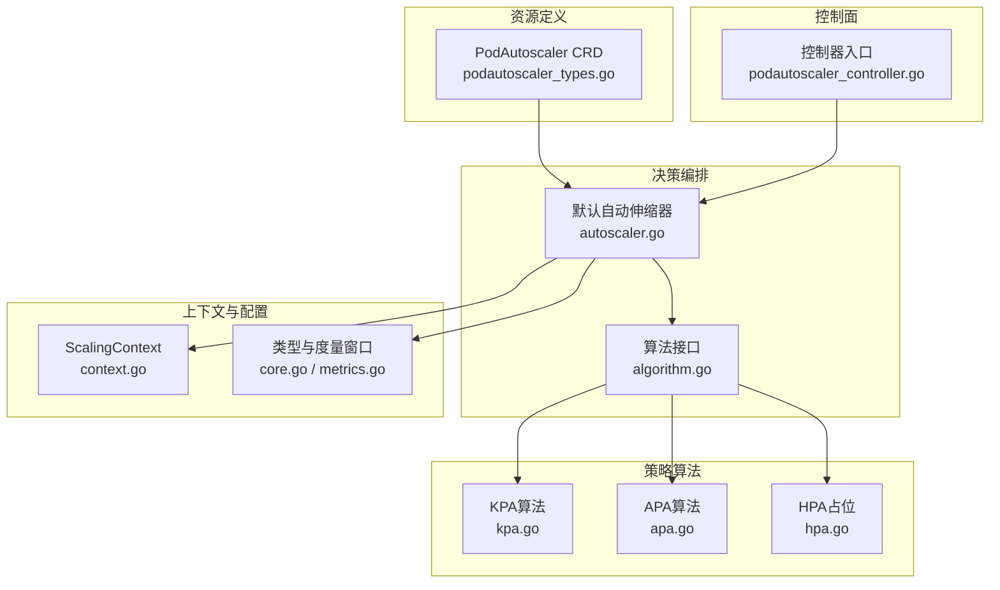
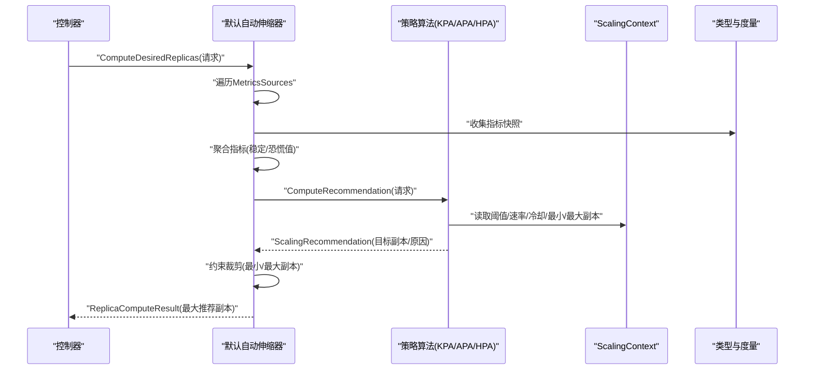
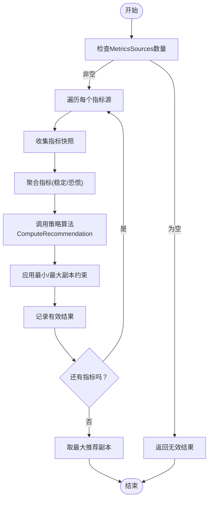
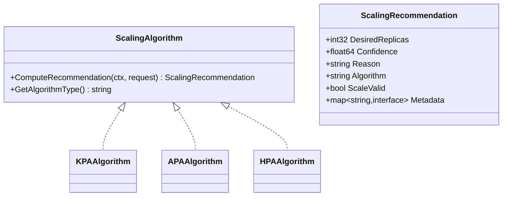
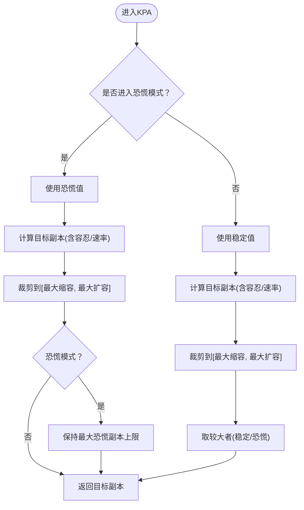
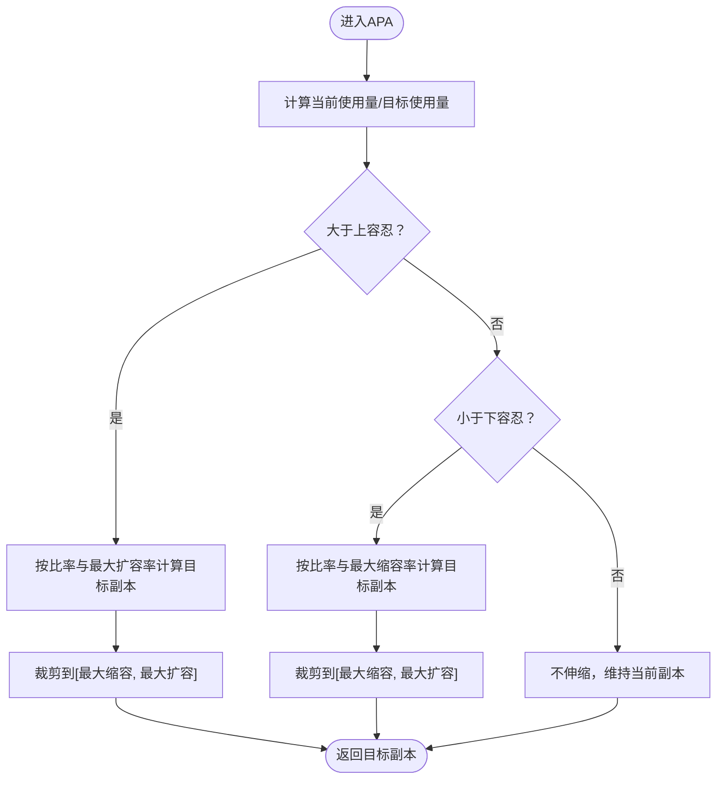
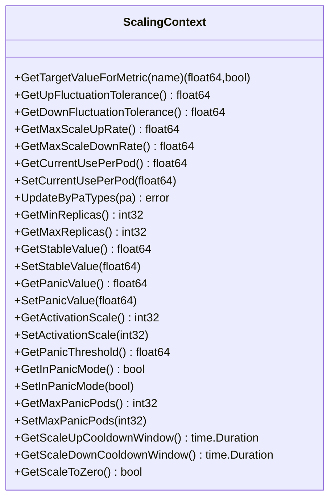
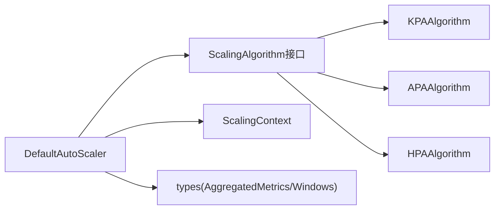

# 伸缩决策算法

<cite>
**本文引用的文件**
- [autoscaler.go](file://pkg/controller/podautoscaler/autoscaler.go)
- [algorithm.go](file://pkg/controller/podautoscaler/algorithm/algorithm.go)
- [kpa.go](file://pkg/controller/podautoscaler/algorithm/kpa.go)
- [apa.go](file://pkg/controller/podautoscaler/algorithm/apa.go)
- [hpa.go](file://pkg/controller/podautoscaler/algorithm/hpa.go)
- [context.go](file://pkg/controller/podautoscaler/context/context.go)
- [core.go](file://pkg/controller/podautoscaler/types/core.go)
- [metrics.go](file://pkg/controller/podautoscaler/types/metrics.go)
- [podautoscaler_types.go](file://api/autoscaling/v1alpha1/podautoscaler_types.go)
- [podautoscaler_controller.go](file://pkg/controller/podautoscaler/podautoscaler_controller.go)
</cite>

## 目录
1. [简介](#简介)
2. [项目结构](#项目结构)
3. [核心组件](#核心组件)
4. [架构总览](#架构总览)
5. [详细组件分析](#详细组件分析)
6. [依赖分析](#依赖分析)
7. [性能考量](#性能考量)
8. [故障排查指南](#故障排查指南)
9. [结论](#结论)
10. [附录：配置与调优](#附录配置与调优)

## 简介
本文件面向AIBrix自动伸缩控制器的“伸缩决策算法”，系统性阐述多指标、多策略的综合决策流程，覆盖KPA（Knative风格）、APA（应用感知）与HPA（K8s原生）三种策略；并深入解析冷却时间、重复伸缩防护、成本优化等关键机制。文档同时提供配置项说明、调优方法与实操建议，帮助在生产环境中稳定、高效地运行推理服务。

## 项目结构
与伸缩决策直接相关的模块主要位于以下路径：
- 策略算法层：pkg/controller/podautoscaler/algorithm
- 决策编排层：pkg/controller/podautoscaler/autoscaler.go
- 上下文与配置：pkg/controller/podautoscaler/context
- 类型定义与度量窗口：pkg/controller/podautoscaler/types
- CRD定义：api/autoscaling/v1alpha1/podautoscaler_types.go
- 控制器入口：pkg/controller/podautoscaler/podautoscaler_controller.go

图表来源
- [autoscaler.go:126-320](file://pkg/controller/podautoscaler/autoscaler.go#L126-L320)
- [algorithm.go:31-74](file://pkg/controller/podautoscaler/algorithm/algorithm.go#L31-L74)
- [kpa.go:42-83](file://pkg/controller/podautoscaler/algorithm/kpa.go#L42-L83)
- [apa.go:34-59](file://pkg/controller/podautoscaler/algorithm/apa.go#L34-L59)
- [hpa.go:29-41](file://pkg/controller/podautoscaler/algorithm/hpa.go#L29-L41)
- [context.go:29-56](file://pkg/controller/podautoscaler/context/context.go#L29-L56)
- [core.go:27-94](file://pkg/controller/podautoscaler/types/core.go#L27-L94)
- [metrics.go:26-270](file://pkg/controller/podautoscaler/types/metrics.go#L26-L270)
- [podautoscaler_types.go:40-105](file://api/autoscaling/v1alpha1/podautoscaler_types.go#L40-L105)
- [podautoscaler_controller.go:1055-1082](file://pkg/controller/podautoscaler/podautoscaler_controller.go#L1055-L1082)

章节来源
- [autoscaler.go:126-320](file://pkg/controller/podautoscaler/autoscaler.go#L126-L320)
- [algorithm.go:31-74](file://pkg/controller/podautoscaler/algorithm/algorithm.go#L31-L74)
- [context.go:29-56](file://pkg/controller/podautoscaler/context/context.go#L29-L56)
- [podautoscaler_types.go:40-105](file://api/autoscaling/v1alpha1/podautoscaler_types.go#L40-L105)

## 核心组件
- 默认自动伸缩器（DefaultAutoScaler）
  - 负责聚合多指标、执行算法、生成单一推荐副本数，并进行约束裁剪。
  - 支持算法实例缓存，线程安全，可并发处理多个PA。
- 策略算法接口（ScalingAlgorithm）
  - 统一的算法抽象，屏蔽KPA/APA/HPA差异。
- KPA算法（Knative风格）
  - 基于稳定窗口与恐慌窗口的双值比较，动态切换模式；支持激活阈值、最大恐慌副本数、上下抖动容忍等。
- APA算法（应用感知）
  - 基于“每Pod当前使用量/目标使用量”比值，结合上下抖动容忍与速率限制进行伸缩。
- HPA算法（占位）
  - 由K8s HPA控制器接管，此处仅返回当前副本数。
- ScalingContext（上下文）
  - 单一可信源，承载所有策略参数（如上下阈值、速率、冷却、最小/最大副本、恐慌状态等），并从PA规范与注解中解析。
- 类型与度量窗口（types）
  - 定义指标键、聚合结果、时间窗统计、历史轨迹等，支撑趋势与置信度计算。

章节来源
- [autoscaler.go:65-98](file://pkg/controller/podautoscaler/autoscaler.go#L65-L98)
- [algorithm.go:31-74](file://pkg/controller/podautoscaler/algorithm/algorithm.go#L31-L74)
- [kpa.go:30-88](file://pkg/controller/podautoscaler/algorithm/kpa.go#L30-L88)
- [apa.go:28-64](file://pkg/controller/podautoscaler/algorithm/apa.go#L28-L64)
- [hpa.go:23-47](file://pkg/controller/podautoscaler/algorithm/hpa.go#L23-L47)
- [context.go:29-118](file://pkg/controller/podautoscaler/context/context.go#L29-L118)
- [core.go:27-94](file://pkg/controller/podautoscaler/types/core.go#L27-L94)
- [metrics.go:26-270](file://pkg/controller/podautoscaler/types/metrics.go#L26-L270)

## 架构总览
伸缩决策的整体流程如下：

图表来源
- [autoscaler.go:126-320](file://pkg/controller/podautoscaler/autoscaler.go#L126-L320)
- [algorithm.go:42-59](file://pkg/controller/podautoscaler/algorithm/algorithm.go#L42-L59)
- [context.go:29-56](file://pkg/controller/podautoscaler/context/context.go#L29-L56)

## 详细组件分析

### 默认自动伸缩器（DefaultAutoScaler）
- 多指标聚合与最大值选择
  - 对每个指标源独立计算推荐副本数，最终取最大值作为全局推荐，避免相互抵消导致的误判。
- 算法实例缓存
  - 按策略类型缓存算法实例，线程安全，减少重复创建开销。
- 错误容错
  - 单个指标失败不影响其他指标；若全部失败则返回无效结果。
- 与控制器集成
  - 将推荐结果转换为是否需要伸缩及原因，交由控制器执行。

图表来源
- [autoscaler.go:126-205](file://pkg/controller/podautoscaler/autoscaler.go#L126-L205)

章节来源
- [autoscaler.go:126-205](file://pkg/controller/podautoscaler/autoscaler.go#L126-L205)

### 策略算法接口与实现
- 接口职责
  - ComputeRecommendation：基于聚合指标与上下文，输出目标副本数、置信度、原因与元数据。
  - GetAlgorithmType：标识算法类型，便于日志与观测。
- 通用约束裁剪
  - applyConstraints：确保目标副本在最小/最大副本范围内。

图表来源
- [algorithm.go:31-74](file://pkg/controller/podautoscaler/algorithm/algorithm.go#L31-L74)
- [kpa.go:30-88](file://pkg/controller/podautoscaler/algorithm/kpa.go#L30-L88)
- [apa.go:28-64](file://pkg/controller/podautoscaler/algorithm/apa.go#L28-L64)
- [hpa.go:23-47](file://pkg/controller/podautoscaler/algorithm/hpa.go#L23-L47)

章节来源
- [algorithm.go:31-74](file://pkg/controller/podautoscaler/algorithm/algorithm.go#L31-L74)

### KPA算法（Knative风格）
- 双窗口模式
  - 稳定窗口与恐慌窗口分别计算指标值；当恐慌/稳定比超过阈值时进入恐慌模式。
- 目标副本计算
  - 基于“当前值/目标值”的比值，结合上下抖动容忍与速率限制（最大扩容/缩容比率）。
- 激活阈值与最大恐慌副本
  - 从零激活时可强制最小目标副本；恐慌模式下禁止缩容，且最大副本数用于抑制反复扩容。
- 冷却与重复伸缩防护
  - 通过上下冷却窗口与速率限制，避免频繁抖动。

图表来源
- [kpa.go:42-83](file://pkg/controller/podautoscaler/algorithm/kpa.go#L42-L83)
- [kpa.go:98-191](file://pkg/controller/podautoscaler/algorithm/kpa.go#L98-L191)

章节来源
- [kpa.go:42-83](file://pkg/controller/podautoscaler/algorithm/kpa.go#L42-L83)
- [kpa.go:98-191](file://pkg/controller/podautoscaler/algorithm/kpa.go#L98-L191)

### APA算法（应用感知）
- 核心思想
  - 当前每Pod使用量与目标使用量的比值决定扩容/缩容方向与幅度。
- 抖动容忍与速率限制
  - 仅当超出上下容忍阈值时才伸缩；同时受最大扩容/缩容比率限制。
- 适用场景
  - 针对业务指标（如QPS、吞吐、延迟）的精细化控制，避免过度抖动。

图表来源
- [apa.go:34-59](file://pkg/controller/podautoscaler/algorithm/apa.go#L34-L59)
- [apa.go:66-111](file://pkg/controller/podautoscaler/algorithm/apa.go#L66-L111)

章节来源
- [apa.go:34-59](file://pkg/controller/podautoscaler/algorithm/apa.go#L34-L59)
- [apa.go:66-111](file://pkg/controller/podautoscaler/algorithm/apa.go#L66-L111)

### HPA算法（占位）
- 说明
  - 实际由K8s HPA控制器管理，此处仅返回当前副本数，作为占位策略。
- 适用
  - 与AIBrix策略互补，适用于CPU/内存等标准资源指标。

章节来源
- [hpa.go:23-47](file://pkg/controller/podautoscaler/algorithm/hpa.go#L23-L47)

### ScalingContext（上下文与配置）
- 参数来源
  - 从PodAutoscaler规范与注解解析，统一作为算法输入。
- 关键参数
  - 上/下抖动容忍、最大扩容/缩容比率、最小/最大副本、恐慌阈值、冷却窗口、是否允许缩至0、激活阈值等。
- 注解解析映射
  - 提供注解到字段的解析表，便于在PA上声明式配置。

图表来源
- [context.go:29-56](file://pkg/controller/podautoscaler/context/context.go#L29-L56)
- [context.go:183-212](file://pkg/controller/podautoscaler/context/context.go#L183-L212)

章节来源
- [context.go:29-56](file://pkg/controller/podautoscaler/context/context.go#L29-L56)
- [context.go:183-212](file://pkg/controller/podautoscaler/context/context.go#L183-L212)

### 类型与度量窗口（types）
- 指标键与聚合结果
  - MetricKey唯一标识指标；AggregatedMetrics包含当前值、稳定值、恐慌值、趋势、置信度与更新时间。
- 时间窗与历史
  - TimeWindow与MetricHistory支持滑动窗口统计与趋势分析，为策略提供更稳健的输入。

章节来源
- [core.go:27-94](file://pkg/controller/podautoscaler/types/core.go#L27-L94)
- [metrics.go:26-270](file://pkg/controller/podautoscaler/types/metrics.go#L26-L270)

### 控制器集成与决策落地
- 控制器根据推荐结果决定是否伸缩，并记录原因。
- 若需要伸缩，控制器调用更新接口执行实际扩缩。

章节来源
- [podautoscaler_controller.go:1055-1082](file://pkg/controller/podautoscaler/podautoscaler_controller.go#L1055-L1082)

## 依赖分析
- 解耦与内聚
  - 算法实现与编排分离，算法接口统一，便于扩展新策略。
  - DefaultAutoScaler聚合多指标并做约束裁剪，职责清晰。
- 并发与缓存
  - 算法实例缓存与只读锁提升并发性能；上下文与度量工具均为线程安全。
- 外部依赖
  - 指标采集与聚合通过工厂与客户端完成，策略算法本身无副作用。

图表来源
- [autoscaler.go:65-98](file://pkg/controller/podautoscaler/autoscaler.go#L65-L98)
- [algorithm.go:61-74](file://pkg/controller/podautoscaler/algorithm/algorithm.go#L61-L74)
- [context.go:29-56](file://pkg/controller/podautoscaler/context/context.go#L29-L56)
- [metrics.go:26-35](file://pkg/controller/podautoscaler/types/metrics.go#L26-L35)

章节来源
- [autoscaler.go:65-98](file://pkg/controller/podautoscaler/autoscaler.go#L65-L98)
- [algorithm.go:61-74](file://pkg/controller/podautoscaler/algorithm/algorithm.go#L61-L74)

## 性能考量
- 算法实例复用
  - 通过算法缓存降低对象创建与初始化开销，适合高并发场景。
- 指标聚合与窗口
  - 合理设置窗口长度与粒度，平衡响应速度与稳定性；避免过小窗口导致抖动。
- 速率限制与抖动容忍
  - 适度提高容忍阈值与降低最大速率，可显著减少频繁伸缩带来的抖动。
- 日志与可观测性
  - 建议开启适当日志级别，观察“多指标聚合结果”与“推荐副本”变化，辅助定位异常。

## 故障排查指南
- 典型问题与定位
  - “未定义指标源”：检查PodAutoscaler的MetricsSources是否为空或配置错误。
  - “所有指标源均失败”：逐项检查指标采集端点、协议与权限。
  - “未发生伸缩”：确认目标值、容忍阈值与速率限制设置是否过于保守。
  - “反复抖动”：提高抖动容忍、启用冷却窗口、降低最大速率。
- 控制器侧事件
  - 记录伸缩相关事件，便于回溯原因与失败信息。

章节来源
- [autoscaler.go:132-135](file://pkg/controller/podautoscaler/autoscaler.go#L132-L135)
- [autoscaler.go:150-157](file://pkg/controller/podautoscaler/autoscaler.go#L150-L157)
- [podautoscaler_controller.go:1079-1082](file://pkg/controller/podautoscaler/podautoscaler_controller.go#L1079-L1082)

## 结论
AIBrix的伸缩决策以“多指标聚合+策略算法+上下文约束”为核心，既保证了对复杂业务场景的适应性，又通过速率限制、抖动容忍与冷却窗口等机制提升了稳定性。KPA/APA策略分别覆盖突发与常态两种典型负载特征，HPA策略与之互补。通过合理的参数调优与观测，可在成本与性能之间取得良好平衡。

## 附录：配置与调优

### 关键配置项（来自ScalingContext）
- 上/下抖动容忍
  - 作用：防止微小波动引发伸缩。
  - 建议：默认10%，高波动场景可适度提高。
- 最大扩容/缩容比率
  - 作用：限制单次伸缩幅度，避免过大抖动。
  - 建议：按业务SLA设定，突发场景可提高扩容上限。
- 最小/最大副本
  - 作用：保障容量边界。
  - 建议：最小副本确保冷启动能力，最大副本避免资源滥用。
- 恐慌阈值（KPA）
  - 作用：判断稳定/恐慌模式切换。
  - 建议：默认2.0，突发流量场景可下调以更快响应。
- 冷却窗口（上下）
  - 作用：防止频繁伸缩。
  - 建议：缩容冷却窗口通常较长（如几分钟）。
- 是否允许缩至0
  - 作用：夜间或低负载场景可关闭以避免完全停止。
- 激活阈值（KPA）
  - 作用：从0激活时的最小目标副本。
  - 建议：结合首请求延迟与SLA权衡。

章节来源
- [context.go:60-118](file://pkg/controller/podautoscaler/context/context.go#L60-L118)
- [context.go:183-212](file://pkg/controller/podautoscaler/context/context.go#L183-L212)

### 策略选择与差异
- KPA（Knative风格）
  - 优点：双窗口模式快速响应突发，恐慌模式抑制反复扩容。
  - 适用：流量波动大、SLA要求高的场景。
- APA（应用感知）
  - 优点：贴近业务指标，可精细控制。
  - 适用：QPS、吞吐、延迟等业务指标驱动的场景。
- HPA（K8s原生）
  - 优点：成熟稳定，适合CPU/内存等标准资源。
  - 适用：与AIBrix策略组合使用，覆盖资源与业务指标。

章节来源
- [kpa.go:42-83](file://pkg/controller/podautoscaler/algorithm/kpa.go#L42-L83)
- [apa.go:34-59](file://pkg/controller/podautoscaler/algorithm/apa.go#L34-L59)
- [hpa.go:29-41](file://pkg/controller/podautoscaler/algorithm/hpa.go#L29-L41)

### 调优步骤建议
- 明确目标指标与目标值
  - 依据SLA与成本目标设定目标值与容忍阈值。
- 分阶段验证
  - 先用APA/KPA验证策略有效性，再引入冷却与速率限制。
- 观测与迭代
  - 关注伸缩频率、抖动程度与成本变化，逐步收敛参数。