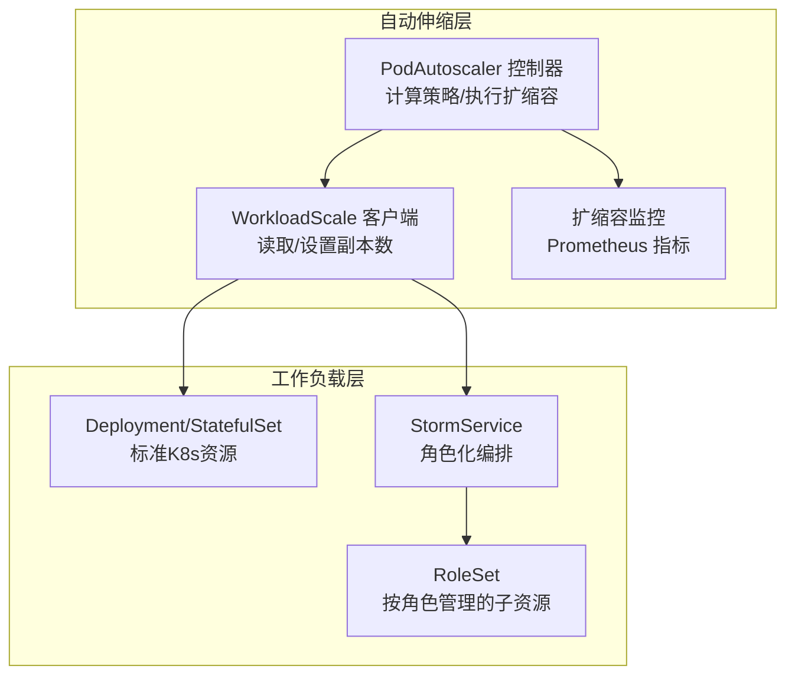
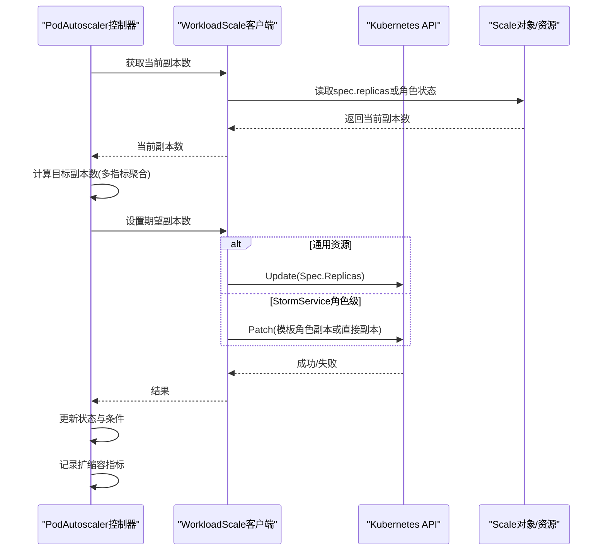
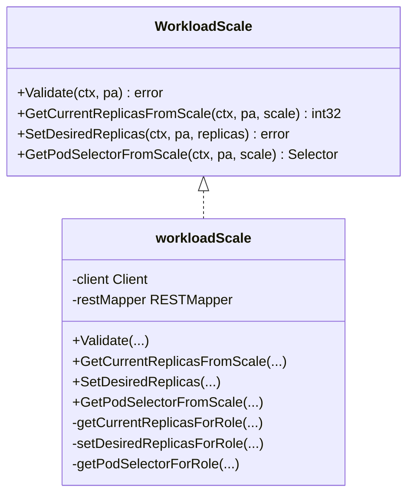
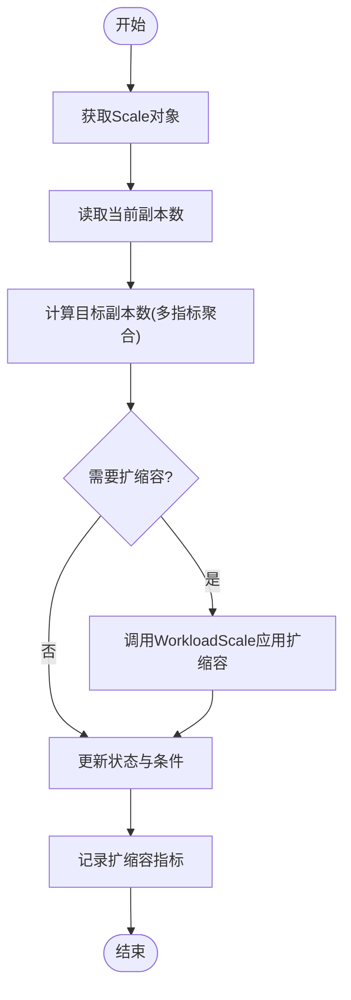
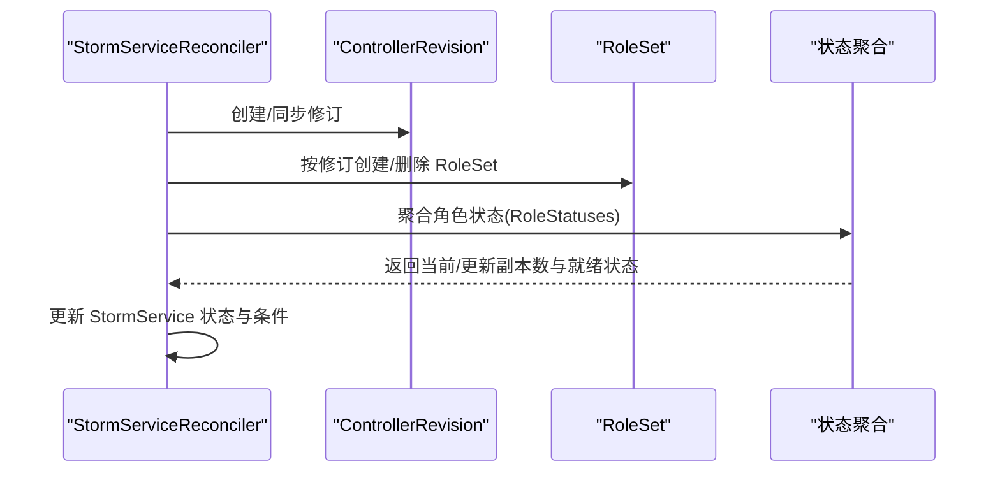
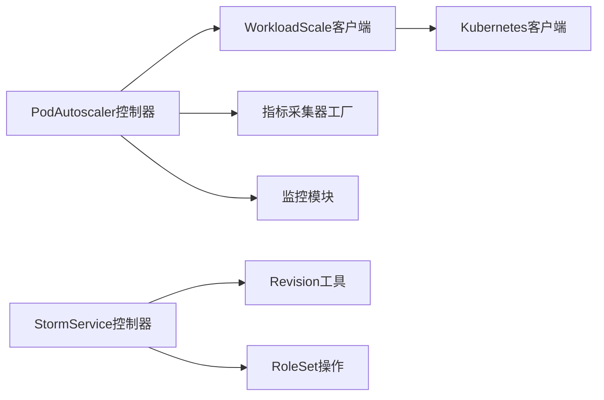

# 工作负载扩缩容

<cite>
**本文引用的文件**
- [pkg/controller/podautoscaler/workload_scale.go](file://pkg/controller/podautoscaler/workload_scale.go)
- [pkg/controller/podautoscaler/podautoscaler_controller.go](file://pkg/controller/podautoscaler/podautoscaler_controller.go)
- [pkg/controller/stormservice/stormservice_controller.go](file://pkg/controller/stormservice/stormservice_controller.go)
- [pkg/controller/stormservice/sync.go](file://pkg/controller/stormservice/sync.go)
- [pkg/controller/stormservice/rolesetoperations.go](file://pkg/controller/stormservice/rolesetoperations.go)
- [pkg/controller/stormservice/revision.go](file://pkg/controller/stormservice/revision.go)
- [api/autoscaling/v1alpha1/podautoscaler_types.go](file://api/autoscaling/v1alpha1/podautoscaler_types.go)
- [api/orchestration/v1alpha1/stormservice_types.go](file://api/orchestration/v1alpha1/stormservice_types.go)
- [pkg/controller/podautoscaler/monitor/monitor.go](file://pkg/controller/podautoscaler/monitor/monitor.go)
- [pkg/controller/podautoscaler/autoscaler.go](file://pkg/controller/podautoscaler/autoscaler.go)
- [samples/autoscaling/deploy.yaml](file://samples/autoscaling/deploy.yaml)
- [samples/autoscaling/stormservice-pool.yaml](file://samples/autoscaling/stormservice-pool.yaml)
- [samples/autoscaling/stormservice-replica.yaml](file://samples/autoscaling/stormservice-replica.yaml)
</cite>

## 目录
1. [简介](#简介)
2. [项目结构](#项目结构)
3. [核心组件](#核心组件)
4. [架构总览](#架构总览)
5. [详细组件分析](#详细组件分析)
6. [依赖分析](#依赖分析)
7. [性能考虑](#性能考虑)
8. [故障排查指南](#故障排查指南)
9. [结论](#结论)
10. [附录](#附录)

## 简介
本文件系统化阐述 AIBrix 自动伸缩控制器的工作负载扩缩容机制，重点覆盖以下方面：
- 扩缩容客户端与实现：如何通过 /scale 子资源或直接修改副本数进行扩缩容
- 不同工作负载类型的扩缩容处理：Deployment、StatefulSet、StormService 的差异与特殊逻辑
- 扩缩容监控与审计：扩缩容历史记录、性能指标采集、事件与告警
- 安全机制与回滚策略：并发冲突处理、幂等更新、版本修订与回滚
- 大规模集群最佳实践：窗口与冷却、多指标聚合、限流与稳定性

## 项目结构
围绕扩缩容的关键代码分布在以下模块：
- 自动伸缩控制器与扩缩容客户端：负责策略计算、指标采集、扩缩容执行与状态更新
- StormService 控制器：负责基于角色（Role）的池化/副本模式扩缩容与滚动升级
- API 类型定义：描述 PodAutoscaler、StormService 及其扩展字段（如 /scale 子资源）

图示来源
- [pkg/controller/podautoscaler/podautoscaler_controller.go:716-794](file://pkg/controller/podautoscaler/podautoscaler_controller.go#L716-L794)
- [pkg/controller/podautoscaler/workload_scale.go:185-232](file://pkg/controller/podautoscaler/workload_scale.go#L185-L232)
- [pkg/controller/stormservice/stormservice_controller.go:99-148](file://pkg/controller/stormservice/stormservice_controller.go#L99-L148)

章节来源
- [pkg/controller/podautoscaler/podautoscaler_controller.go:103-227](file://pkg/controller/podautoscaler/podautoscaler_controller.go#L103-L227)
- [pkg/controller/stormservice/stormservice_controller.go:49-83](file://pkg/controller/stormservice/stormservice_controller.go#L49-L83)

## 核心组件
- PodAutoscaler 控制器：根据策略（HPA/KPA/APA）计算目标副本数，调用 WorkloadScale 客户端应用扩缩容，并更新自身状态与条件
- WorkloadScale 客户端：抽象不同工作负载的“当前副本数”读取与“期望副本数”写入；支持通用资源与 StormService 角色级扩缩容
- StormService 控制器：维护 Revision 历史、按策略滚动/就地更新、聚合角色状态、暴露 /scale 子资源
- 监控与审计：记录每次扩缩容的目标副本数到 Prometheus 指标，便于观测与审计

章节来源
- [pkg/controller/podautoscaler/podautoscaler_controller.go:270-312](file://pkg/controller/podautoscaler/podautoscaler_controller.go#L270-L312)
- [pkg/controller/podautoscaler/workload_scale.go:44-62](file://pkg/controller/podautoscaler/workload_scale.go#L44-L62)
- [pkg/controller/stormservice/stormservice_controller.go:85-98](file://pkg/controller/stormservice/stormservice_controller.go#L85-L98)
- [pkg/controller/podautoscaler/monitor/monitor.go:21-39](file://pkg/controller/podautoscaler/monitor/monitor.go#L21-L39)

## 架构总览
扩缩容主流程（KPA/APA 策略）：
1. PodAutoscaler 控制器解析目标资源，获取 Scale 对象
2. 读取当前副本数（通用资源从 spec.replicas，StormService 支持角色级）
3. 计算目标副本数（多指标聚合与算法决策）
4. 应用扩缩容（通用资源直接更新 spec.replicas；StormService 角色级通过 Patch 更新模板或直接更新 replicas）
5. 更新 PodAutoscaler 状态与条件，记录扩缩容指标

图示来源
- [pkg/controller/podautoscaler/podautoscaler_controller.go:717-794](file://pkg/controller/podautoscaler/podautoscaler_controller.go#L717-L794)
- [pkg/controller/podautoscaler/workload_scale.go:185-271](file://pkg/controller/podautoscaler/workload_scale.go#L185-L271)
- [pkg/controller/podautoscaler/autoscaler.go:126-205](file://pkg/controller/podautoscaler/autoscaler.go#L126-L205)

## 详细组件分析

### 扩缩容客户端：WorkloadScale
职责与接口
- Validate：校验目标是否可缩放（如角色级选择器仅支持 StormService）
- GetCurrentReplicasFromScale：从 Scale 对象提取当前副本数
- SetDesiredReplicas：设置期望副本数（通用资源直接更新 spec.replicas；StormService 支持角色级）
- GetPodSelectorFromScale：从 Scale 对象提取 Pod 选择器，角色级时追加角色标签

实现要点
- 通用资源：直接从 Scale 的 spec.replicas 字段读取
- StormService 角色级：优先从状态 RoleStatuses 读取，其次回退到模板角色副本；支持注解控制“replica 模式”或“pool 模式”
- 并发安全：对通用资源更新使用 RetryOnConflict；对 StormService 使用 Patch 合并更新

图示来源
- [pkg/controller/podautoscaler/workload_scale.go:44-62](file://pkg/controller/podautoscaler/workload_scale.go#L44-L62)
- [pkg/controller/podautoscaler/workload_scale.go:81-124](file://pkg/controller/podautoscaler/workload_scale.go#L81-L124)
- [pkg/controller/podautoscaler/workload_scale.go:126-183](file://pkg/controller/podautoscaler/workload_scale.go#L126-L183)
- [pkg/controller/podautoscaler/workload_scale.go:185-271](file://pkg/controller/podautoscaler/workload_scale.go#L185-L271)
- [pkg/controller/podautoscaler/workload_scale.go:274-359](file://pkg/controller/podautoscaler/workload_scale.go#L274-L359)

章节来源
- [pkg/controller/podautoscaler/workload_scale.go:44-62](file://pkg/controller/podautoscaler/workload_scale.go#L44-L62)
- [pkg/controller/podautoscaler/workload_scale.go:126-183](file://pkg/controller/podautoscaler/workload_scale.go#L126-L183)
- [pkg/controller/podautoscaler/workload_scale.go:185-271](file://pkg/controller/podautoscaler/workload_scale.go#L185-L271)

### PodAutoscaler 控制器：策略执行与状态管理
- 支持三种策略：HPA（KEDA 风格封装）、KPA（Knative 风格）、APA（自定义算法）
- reconcileCustomPA 流程：获取 Scale 对象、读取当前副本、计算目标副本、应用扩缩容、更新状态与条件
- 冲突检测：同一目标只能被一个 PodAutoscaler 控制，避免多控制器互相干扰
- 监控记录：每次扩缩容决策后记录 Prometheus 指标

图示来源
- [pkg/controller/podautoscaler/podautoscaler_controller.go:717-794](file://pkg/controller/podautoscaler/podautoscaler_controller.go#L717-L794)
- [pkg/controller/podautoscaler/autoscaler.go:126-205](file://pkg/controller/podautoscaler/autoscaler.go#L126-L205)
- [pkg/controller/podautoscaler/monitor/monitor.go:31-38](file://pkg/controller/podautoscaler/monitor/monitor.go#L31-L38)

章节来源
- [pkg/controller/podautoscaler/podautoscaler_controller.go:270-312](file://pkg/controller/podautoscaler/podautoscaler_controller.go#L270-L312)
- [pkg/controller/podautoscaler/podautoscaler_controller.go:717-794](file://pkg/controller/podautoscaler/podautoscaler_controller.go#L717-L794)
- [pkg/controller/podautoscaler/autoscaler.go:126-205](file://pkg/controller/podautoscaler/autoscaler.go#L126-L205)

### StormService 控制器：角色化扩缩容与回滚
- 角色级扩缩容：支持 pool 模式（按角色聚合统计）与 replica 模式（按角色集数量）
- 滚动/就地更新：遵循 MaxSurge/MaxUnavailable 约束，按修订版本推进
- Revision 历史：维护 ControllerRevision，支持回滚与历史裁剪
- /scale 子资源：通过 status.scalingTargetSelector 提供选择器，供 kubectl scale 使用

图示来源
- [pkg/controller/stormservice/sync.go:40-71](file://pkg/controller/stormservice/sync.go#L40-L71)
- [pkg/controller/stormservice/sync.go:138-259](file://pkg/controller/stormservice/sync.go#L138-L259)
- [pkg/controller/stormservice/revision.go:172-221](file://pkg/controller/stormservice/revision.go#L172-L221)
- [pkg/controller/stormservice/stormservice_controller.go:126-145](file://pkg/controller/stormservice/stormservice_controller.go#L126-L145)

章节来源
- [pkg/controller/stormservice/sync.go:138-259](file://pkg/controller/stormservice/sync.go#L138-L259)
- [pkg/controller/stormservice/revision.go:172-221](file://pkg/controller/stormservice/revision.go#L172-L221)
- [pkg/controller/stormservice/stormservice_controller.go:126-145](file://pkg/controller/stormservice/stormservice_controller.go#L126-L145)

### 不同工作负载类型的扩缩容处理
- Deployment/StatefulSet（通用资源）
  - 通过直接更新 spec.replicas 实现扩缩容
  - 读取 currentReplicas 时从 Scale 对象 spec.replicas 字段获取
- StormService（角色化资源）
  - 角色级扩缩容：通过 Patch 更新模板中角色副本或直接更新顶层 replicas（由注解决定模式）
  - 读取 currentReplicas：优先状态 RoleStatuses，其次模板角色副本
  - /scale 子资源：通过 status.scalingTargetSelector 提供选择器

章节来源
- [pkg/controller/podautoscaler/workload_scale.go:126-183](file://pkg/controller/podautoscaler/workload_scale.go#L126-L183)
- [pkg/controller/podautoscaler/workload_scale.go:185-271](file://pkg/controller/podautoscaler/workload_scale.go#L185-L271)
- [api/orchestration/v1alpha1/stormservice_types.go:176-180](file://api/orchestration/v1alpha1/stormservice_types.go#L176-L180)

### 扩缩容监控与审计
- 指标记录：每次扩缩容决策后，将目标副本数写入 Prometheus 指标 autoscaler_scale_action，包含命名空间、名称、算法、原因等标签
- PodAutoscaler 状态：记录 DesiredScale、ActualScale、最近一次扩缩容时间、条件集合（Ready/AbleToScale/ScalingActive 等）
- 历史记录：ScalingHistory 保存最近若干次决策（最多 5 条），包含时间戳、前后副本数、原因、成功与否及错误信息

章节来源
- [pkg/controller/podautoscaler/monitor/monitor.go:21-39](file://pkg/controller/podautoscaler/monitor/monitor.go#L21-L39)
- [api/autoscaling/v1alpha1/podautoscaler_types.go:171-198](file://api/autoscaling/v1alpha1/podautoscaler_types.go#L171-L198)

### 安全机制与回滚策略
- 并发冲突处理：通用资源更新采用 RetryOnConflict；StormService 使用 Patch 合并更新
- 冲突检测：同一目标仅允许一个 PodAutoscaler 控制，避免多控制器竞争
- 回滚策略：StormService 维护 Revision 历史，支持回滚到先前修订版本；当发现等价修订时复用而非重复创建
- 事件与告警：扩缩容成功/失败均产生 Kubernetes 事件，便于运维观测

章节来源
- [pkg/controller/podautoscaler/workload_scale.go:198-231](file://pkg/controller/podautoscaler/workload_scale.go#L198-L231)
- [pkg/controller/podautoscaler/podautoscaler_controller.go:351-380](file://pkg/controller/podautoscaler/podautoscaler_controller.go#L351-L380)
- [pkg/controller/stormservice/revision.go:172-221](file://pkg/controller/stormservice/revision.go#L172-L221)

### 大规模集群最佳实践
- 多指标聚合：APA/KPA 策略下，对多个指标分别计算推荐值并取最大，提升鲁棒性
- 窗口与冷却：KPA/APA 使用稳定/恐慌窗口，结合最小记录间隔，避免抖动
- 限流与稳定性：建议在网关层配合速率限制，防止突发流量导致过度扩缩容
- 角色级精细化：StormService 在 pool/replica 模式下支持角色级扩缩容，降低跨角色影响

章节来源
- [pkg/controller/podautoscaler/autoscaler.go:126-205](file://pkg/controller/podautoscaler/autoscaler.go#L126-L205)
- [pkg/controller/podautoscaler/podautoscaler_controller.go:717-794](file://pkg/controller/podautoscaler/podautoscaler_controller.go#L717-L794)

## 依赖分析
- PodAutoscaler 控制器依赖 WorkloadScale 客户端与指标采集器工厂
- WorkloadScale 客户端依赖 Kubernetes 客户端与 RESTMapper
- StormService 控制器依赖 Revision 历史工具与 RoleSet 操作工具
- 监控模块独立于控制器，仅通过指标接口记录数据

图示来源
- [pkg/controller/podautoscaler/podautoscaler_controller.go:113-163](file://pkg/controller/podautoscaler/podautoscaler_controller.go#L113-L163)
- [pkg/controller/podautoscaler/workload_scale.go:65-78](file://pkg/controller/podautoscaler/workload_scale.go#L65-L78)
- [pkg/controller/stormservice/revision.go:37-55](file://pkg/controller/stormservice/revision.go#L37-L55)
- [pkg/controller/stormservice/rolesetoperations.go:37-57](file://pkg/controller/stormservice/rolesetoperations.go#L37-L57)

章节来源
- [pkg/controller/podautoscaler/podautoscaler_controller.go:113-163](file://pkg/controller/podautoscaler/podautoscaler_controller.go#L113-L163)
- [pkg/controller/podautoscaler/workload_scale.go:65-78](file://pkg/controller/podautoscaler/workload_scale.go#L65-L78)
- [pkg/controller/stormservice/revision.go:37-55](file://pkg/controller/stormservice/revision.go#L37-L55)
- [pkg/controller/stormservice/rolesetoperations.go:37-57](file://pkg/controller/stormservice/rolesetoperations.go#L37-L57)

## 性能考虑
- 指标采集与聚合：采用时间窗与历史缓存，减少重复计算
- 批量操作：RoleSet 创建/删除采用慢启动批处理，降低瞬时压力
- 并发与重试：通用资源更新使用 RetryOnConflict，避免频繁失败重试
- 角色级选择器：StormService 在获取选择器时追加角色标签，减少无关 Pod 匹配

## 故障排查指南
常见问题与定位思路
- 无法获取 Scale 对象
  - 检查 Scale 对象是否存在、RBAC 是否允许访问
  - 关注控制器日志中的 FailedGetScale 事件
- 无法设置副本数
  - 通用资源：确认存在并发冲突，查看 RetryOnConflict 是否成功
  - StormService：检查注解（replica/pool 模式）与角色是否存在
- 角色级扩缩容不生效
  - 确认 SubTargetSelector 的角色名正确
  - 检查 StormService 状态中的 RoleStatuses 是否更新
- 指标未记录
  - 检查监控模块是否初始化成功，Prometheus 抓取是否正常

章节来源
- [pkg/controller/podautoscaler/podautoscaler_controller.go:725-734](file://pkg/controller/podautoscaler/podautoscaler_controller.go#L725-L734)
- [pkg/controller/podautoscaler/workload_scale.go:185-271](file://pkg/controller/podautoscaler/workload_scale.go#L185-L271)
- [pkg/controller/stormservice/sync.go:353-427](file://pkg/controller/stormservice/sync.go#L353-L427)

## 结论
AIBrix 的扩缩容体系以 PodAutoscaler 控制器为核心，通过 WorkloadScale 客户端适配通用与角色化工作负载，结合 StormService 的修订与角色管理能力，实现了灵活、可观测、可回滚的扩缩容闭环。在大规模集群中，建议结合多指标聚合、窗口与冷却、角色级精细化与网关限流，确保稳定性与效率。

## 附录
- 示例资源
  - Deployment/Service 示例：用于通用资源扩缩容验证
  - StormService 池化模式示例：展示角色级独立扩缩容
  - StormService 副本模式示例：展示基于注解的副本/池化模式切换

章节来源
- [samples/autoscaling/deploy.yaml:1-101](file://samples/autoscaling/deploy.yaml#L1-L101)
- [samples/autoscaling/stormservice-pool.yaml:1-121](file://samples/autoscaling/stormservice-pool.yaml#L1-L121)
- [samples/autoscaling/stormservice-replica.yaml:1-85](file://samples/autoscaling/stormservice-replica.yaml#L1-L85)