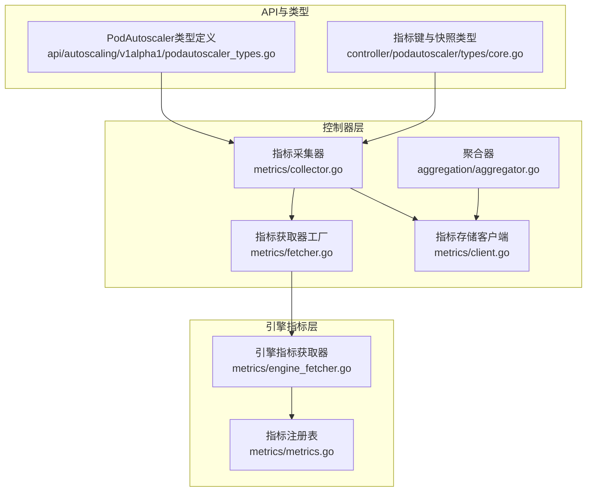
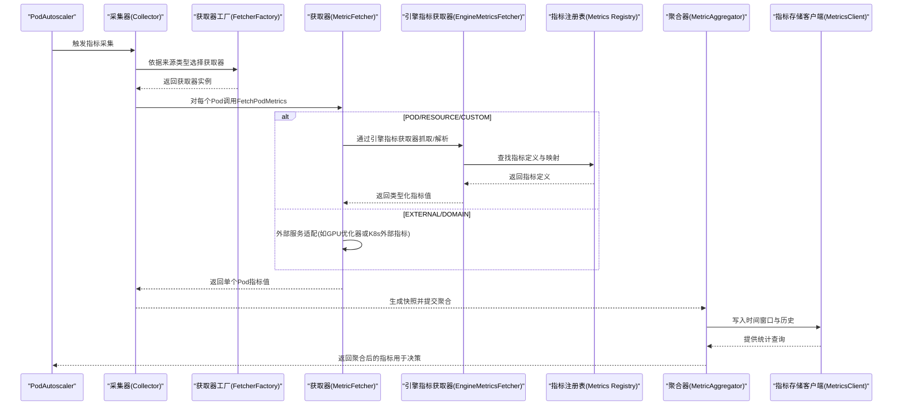
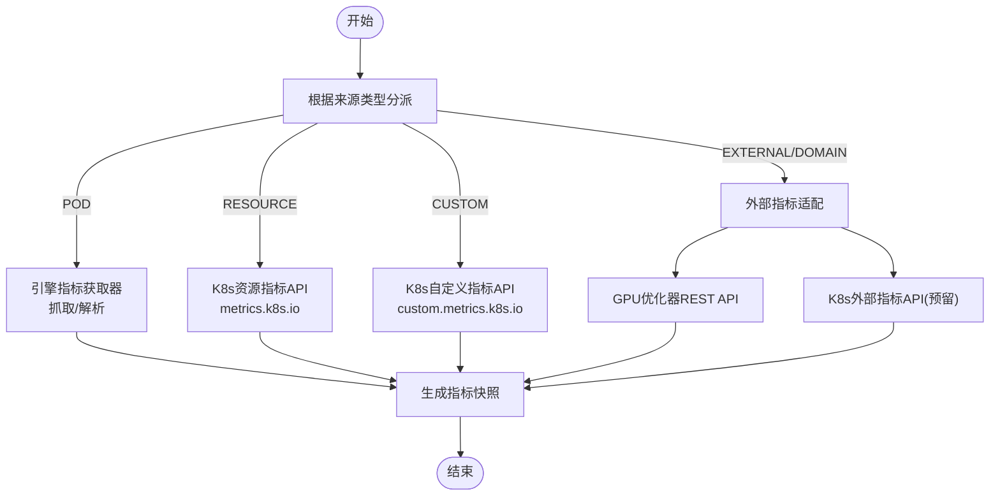
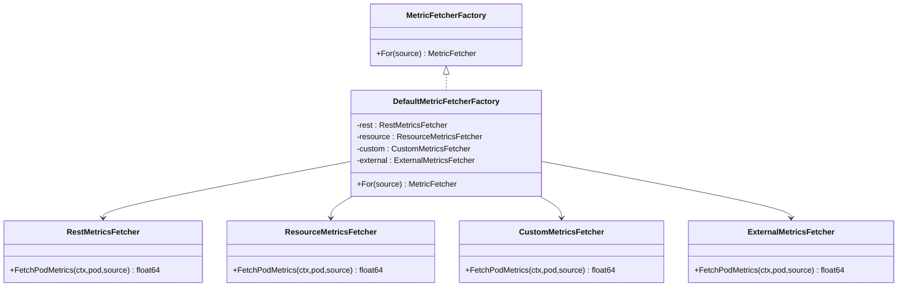
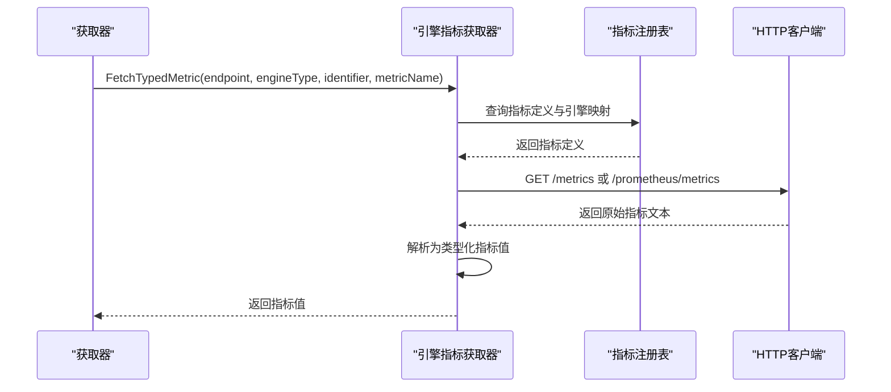
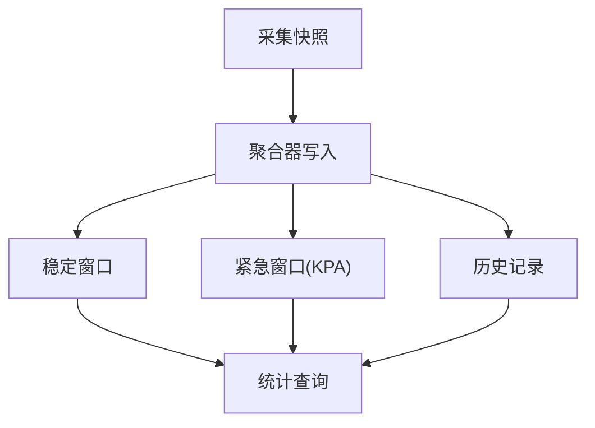
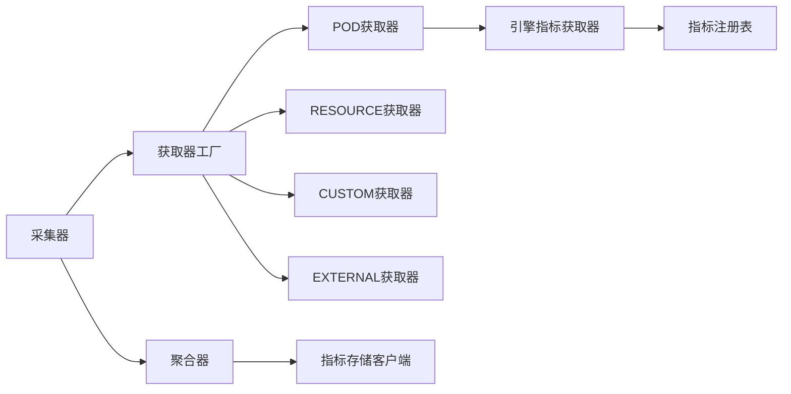

# 指标采集系统

<cite>
**本文档引用的文件**
- [fetcher.go](file://pkg/controller/podautoscaler/metrics/fetcher.go)
- [collector.go](file://pkg/controller/podautoscaler/metrics/collector.go)
- [client.go](file://pkg/controller/podautoscaler/metrics/client.go)
- [aggregator.go](file://pkg/controller/podautoscaler/aggregation/aggregator.go)
- [engine_fetcher.go](file://pkg/metrics/engine_fetcher.go)
- [metrics.go](file://pkg/metrics/metrics.go)
- [custom_metrics.go](file://pkg/metrics/custom_metrics.go)
- [podautoscaler_controller.go](file://pkg/controller/podautoscaler/podautoscaler_controller.go)
- [core.go](file://pkg/controller/podautoscaler/types/core.go)
- [podautoscaler_types.go](file://api/autoscaling/v1alpha1/podautoscaler_types.go)
- [annotations.go](file://pkg/controller/podautoscaler/types/annotations.go)
</cite>

## 目录
1. [简介](#简介)
2. [项目结构](#项目结构)
3. [核心组件](#核心组件)
4. [架构总览](#架构总览)
5. [详细组件分析](#详细组件分析)
6. [依赖分析](#依赖分析)
7. [性能考虑](#性能考虑)
8. [故障排查指南](#故障排查指南)
9. [结论](#结论)
10. [附录](#附录)

## 简介
本文件面向AIBrix自动伸缩控制器的指标采集系统，系统性阐述指标采集器的架构设计与实现原理，覆盖以下方面：
- 资源指标（CPU、内存）采集机制
- 自定义指标采集机制
- 外部指标采集机制（含GPU优化器与Kubernetes外部指标）
- 指标获取器的统一接口与工厂模式
- 指标聚合与窗口化存储
- 配置方法、性能优化建议、错误处理与高并发最佳实践

## 项目结构
指标采集系统主要分布在以下模块：
- 控制器层：指标采集、聚合与调度决策
- 引擎指标解析层：统一的引擎指标抓取与解析
- 指标注册与导出层：内置指标定义与Prometheus导出

**图表来源**
- [collector.go:31-43](file://pkg/controller/podautoscaler/metrics/collector.go#L31-L43)
- [fetcher.go:288-331](file://pkg/controller/podautoscaler/metrics/fetcher.go#L288-L331)
- [aggregator.go:27-48](file://pkg/controller/podautoscaler/aggregation/aggregator.go#L27-L48)
- [client.go:55-84](file://pkg/controller/podautoscaler/metrics/client.go#L55-L84)
- [engine_fetcher.go:51-77](file://pkg/metrics/engine_fetcher.go#L51-L77)
- [metrics.go:19-100](file://pkg/metrics/metrics.go#L19-L100)
- [podautoscaler_types.go:214-229](file://api/autoscaling/v1alpha1/podautoscaler_types.go#L214-L229)
- [core.go:27-94](file://pkg/controller/podautoscaler/types/core.go#L27-L94)

**章节来源**
- [collector.go:31-43](file://pkg/controller/podautoscaler/metrics/collector.go#L31-L43)
- [fetcher.go:288-331](file://pkg/controller/podautoscaler/metrics/fetcher.go#L288-L331)
- [aggregator.go:27-48](file://pkg/controller/podautoscaler/aggregation/aggregator.go#L27-L48)
- [client.go:55-84](file://pkg/controller/podautoscaler/metrics/client.go#L55-L84)
- [engine_fetcher.go:51-77](file://pkg/metrics/engine_fetcher.go#L51-L77)
- [metrics.go:19-100](file://pkg/metrics/metrics.go#L19-L100)
- [podautoscaler_types.go:214-229](file://api/autoscaling/v1alpha1/podautoscaler_types.go#L214-L229)
- [core.go:27-94](file://pkg/controller/podautoscaler/types/core.go#L27-L94)

## 核心组件
- 指标采集器（Collector）：根据指标来源类型分派到对应获取器，收集每个Pod的指标值，生成快照。
- 指标获取器（MetricFetcher）：统一接口，支持POD（引擎指标）、RESOURCE（K8s资源指标）、CUSTOM（K8s自定义指标）、EXTERNAL/DOMAIN（外部指标）。
- 工厂（MetricFetcherFactory）：按指标来源类型返回对应的获取器实例。
- 引擎指标获取器（EngineMetricsFetcher）：统一抓取引擎Pod指标，解析为类型化指标值。
- 指标注册表（Metrics Registry）：集中定义可用指标及其映射关系。
- 聚合器（MetricAggregator）：将采集到的快照写入时间窗口与历史，供算法层使用。
- 指标存储客户端（MetricsClient）：维护稳定/紧急窗口与历史数据，提供统计查询。

**章节来源**
- [collector.go:31-43](file://pkg/controller/podautoscaler/metrics/collector.go#L31-L43)
- [fetcher.go:36-46](file://pkg/controller/podautoscaler/metrics/fetcher.go#L36-L46)
- [engine_fetcher.go:51-77](file://pkg/metrics/engine_fetcher.go#L51-L77)
- [metrics.go:102-795](file://pkg/metrics/metrics.go#L102-L795)
- [aggregator.go:27-48](file://pkg/controller/podautoscaler/aggregation/aggregator.go#L27-L48)
- [client.go:55-84](file://pkg/controller/podautoscaler/metrics/client.go#L55-L84)

## 架构总览
指标采集系统采用“采集-聚合-决策”的流水线式架构。采集阶段由工厂根据指标来源类型选择具体获取器；聚合阶段将采集结果写入时间窗口与历史；决策阶段由算法层从聚合器读取统计值进行缩放判断。

**图表来源**
- [collector.go:31-43](file://pkg/controller/podautoscaler/metrics/collector.go#L31-L43)
- [fetcher.go:315-331](file://pkg/controller/podautoscaler/metrics/fetcher.go#L315-L331)
- [engine_fetcher.go:98-157](file://pkg/metrics/engine_fetcher.go#L98-L157)
- [metrics.go:102-795](file://pkg/metrics/metrics.go#L102-L795)
- [aggregator.go:50-76](file://pkg/controller/podautoscaler/aggregation/aggregator.go#L50-L76)
- [client.go:106-154](file://pkg/controller/podautoscaler/metrics/client.go#L106-L154)

## 详细组件分析

### 指标来源与采集流程
- POD（引擎指标）：通过引擎指标获取器访问引擎Pod的指标端点，解析为类型化指标值。
- RESOURCE（K8s资源指标）：调用metrics.k8s.io API获取CPU/内存使用量。
- CUSTOM（K8s自定义指标）：调用custom.metrics.k8s.io API获取命名空间级指标。
- EXTERNAL/DOMAIN（外部指标）：支持两类：
  - Endpoint非空：调用AIBrix GPU优化器REST API；
  - Endpoint为空：预留Kubernetes external.metrics API（当前未实现）。

**图表来源**
- [collector.go:35-42](file://pkg/controller/podautoscaler/metrics/collector.go#L35-L42)
- [fetcher.go:315-331](file://pkg/controller/podautoscaler/metrics/fetcher.go#L315-L331)
- [fetcher.go:237-286](file://pkg/controller/podautoscaler/metrics/fetcher.go#L237-L286)

**章节来源**
- [collector.go:35-42](file://pkg/controller/podautoscaler/metrics/collector.go#L35-L42)
- [fetcher.go:315-331](file://pkg/controller/podautoscaler/metrics/fetcher.go#L315-L331)
- [fetcher.go:237-286](file://pkg/controller/podautoscaler/metrics/fetcher.go#L237-L286)

### 获取器工厂与多来源适配
- 工厂根据MetricSource.MetricSourceType返回对应获取器：
  - POD → RestMetricsFetcher
  - RESOURCE → ResourceMetricsFetcher
  - CUSTOM → CustomMetricsFetcher
  - EXTERNAL/DOMAIN → ExternalMetricsFetcher
- ExternalMetricsFetcher内部区分两类外部来源：GPU优化器REST与K8s外部指标API。

**图表来源**
- [fetcher.go:288-331](file://pkg/controller/podautoscaler/metrics/fetcher.go#L288-L331)
- [fetcher.go:48-67](file://pkg/controller/podautoscaler/metrics/fetcher.go#L48-L67)
- [fetcher.go:108-125](file://pkg/controller/podautoscaler/metrics/fetcher.go#L108-L125)
- [fetcher.go:166-183](file://pkg/controller/podautoscaler/metrics/fetcher.go#L166-L183)
- [fetcher.go:216-235](file://pkg/controller/podautoscaler/metrics/fetcher.go#L216-L235)

**章节来源**
- [fetcher.go:288-331](file://pkg/controller/podautoscaler/metrics/fetcher.go#L288-L331)
- [fetcher.go:48-67](file://pkg/controller/podautoscaler/metrics/fetcher.go#L48-L67)
- [fetcher.go:108-125](file://pkg/controller/podautoscaler/metrics/fetcher.go#L108-L125)
- [fetcher.go:166-183](file://pkg/controller/podautoscaler/metrics/fetcher.go#L166-L183)
- [fetcher.go:216-235](file://pkg/controller/podautoscaler/metrics/fetcher.go#L216-L235)

### 引擎指标获取器与类型化指标
- 支持从不同引擎（vLLM、SGLang、TRT-LLM等）抓取指标，路径差异由引擎类型决定。
- 通过指标注册表查找指标定义与引擎映射，解析为简单值、直方图或标签值。
- 具备重试与指数退避机制，提升稳定性。

**图表来源**
- [engine_fetcher.go:98-157](file://pkg/metrics/engine_fetcher.go#L98-L157)
- [engine_fetcher.go:267-274](file://pkg/metrics/engine_fetcher.go#L267-L274)
- [metrics.go:102-795](file://pkg/metrics/metrics.go#L102-L795)

**章节来源**
- [engine_fetcher.go:98-157](file://pkg/metrics/engine_fetcher.go#L98-L157)
- [engine_fetcher.go:267-274](file://pkg/metrics/engine_fetcher.go#L267-L274)
- [metrics.go:102-795](file://pkg/metrics/metrics.go#L102-L795)

### 指标聚合与窗口化存储
- 聚合器接收采集快照，写入稳定窗口与紧急窗口（KPA使用），同时记录历史。
- 存储客户端提供稳定/紧急窗口均值、最值与历史统计查询。
- 默认窗口时长与粒度可配置，首次使用时自动初始化。

**图表来源**
- [aggregator.go:50-76](file://pkg/controller/podautoscaler/aggregation/aggregator.go#L50-L76)
- [client.go:106-154](file://pkg/controller/podautoscaler/metrics/client.go#L106-L154)
- [client.go:189-260](file://pkg/controller/podautoscaler/metrics/client.go#L189-L260)

**章节来源**
- [aggregator.go:50-76](file://pkg/controller/podautoscaler/aggregation/aggregator.go#L50-L76)
- [client.go:106-154](file://pkg/controller/podautoscaler/metrics/client.go#L106-L154)
- [client.go:189-260](file://pkg/controller/podautoscaler/metrics/client.go#L189-L260)

### 指标类型与适用场景
- 资源指标（CPU/内存）：适用于通用资源压力检测，适合KPA的快速响应。
- 自定义指标：适用于业务侧特定指标（如请求数、队列长度），需配合自定义指标API。
- 外部指标：适用于跨集群或第三方系统指标，如GPU优化器推荐值；当前K8s外部指标API预留未实现。
- 引擎指标：适用于推理引擎内部指标（吞吐、延迟、缓存命中率等），通过引擎指标获取器统一解析。

**章节来源**
- [podautoscaler_types.go:214-229](file://api/autoscaling/v1alpha1/podautoscaler_types.go#L214-L229)
- [fetcher.go:276-286](file://pkg/controller/podautoscaler/metrics/fetcher.go#L276-L286)
- [metrics.go:102-795](file://pkg/metrics/metrics.go#L102-L795)

## 依赖分析
- 组件耦合与内聚
  - 采集器与获取器通过统一接口解耦，工厂负责实例化，降低耦合。
  - 聚合器仅依赖指标存储客户端接口，保持内聚。
  - 引擎指标获取器依赖指标注册表，实现引擎无关的指标解析。
- 外部依赖
  - K8s Metrics API（资源/自定义指标）
  - 引擎Pod指标端点（HTTP）
  - Prometheus解析库（直方图/计数器解析）

**图表来源**
- [fetcher.go:288-331](file://pkg/controller/podautoscaler/metrics/fetcher.go#L288-L331)
- [engine_fetcher.go:51-77](file://pkg/metrics/engine_fetcher.go#L51-L77)
- [metrics.go:102-795](file://pkg/metrics/metrics.go#L102-L795)
- [aggregator.go:27-48](file://pkg/controller/podautoscaler/aggregation/aggregator.go#L27-L48)
- [client.go:55-84](file://pkg/controller/podautoscaler/metrics/client.go#L55-L84)

**章节来源**
- [fetcher.go:288-331](file://pkg/controller/podautoscaler/metrics/fetcher.go#L288-L331)
- [engine_fetcher.go:51-77](file://pkg/metrics/engine_fetcher.go#L51-L77)
- [metrics.go:102-795](file://pkg/metrics/metrics.go#L102-L795)
- [aggregator.go:27-48](file://pkg/controller/podautoscaler/aggregation/aggregator.go#L27-L48)
- [client.go:55-84](file://pkg/controller/podautoscaler/metrics/client.go#L55-L84)

## 性能考虑
- 采集频率与窗口
  - 稳定窗口默认约3分钟，紧急窗口默认1分钟；可根据策略调整。
  - 建议在高并发场景下适当增大窗口粒度以减少抖动。
- 并发与重试
  - 引擎指标获取器具备重试与指数退避，避免瞬时失败影响整体。
  - 资源/自定义指标API调用应避免阻塞主线程，必要时引入并发限制。
- 缓存策略
  - 引擎指标解析结果可按指标名与引擎类型做轻量缓存，减少重复解析开销。
  - 指标注册表为只读常量映射，无需额外缓存。
- 错误处理
  - 单Pod采集失败不应导致整体失败，采用部分成功/失败聚合策略。
  - 对外部指标（如GPU优化器）返回零值并告警，避免阻塞缩放决策。

[本节为通用指导，不直接分析具体文件]

## 故障排查指南
- 常见问题定位
  - 资源指标不可用：检查Metrics Server是否部署与可用。
  - 自定义指标不可用：确认custom.metrics.k8s.io API可用及RBAC配置正确。
  - 引擎指标解析失败：检查引擎Pod指标端点可达性与指标名称映射。
  - 外部指标API未实现：当前K8s external.metrics API尚未实现，需使用GPU优化器REST。
- 日志与告警
  - 采集器与获取器在失败时输出警告日志，便于定位。
  - 引擎指标获取器在HTTP请求失败时会记录查询失败计数指标。
- 快速验证
  - 使用单Pod场景验证采集链路，逐步扩展至多Pod。
  - 检查Pod状态（IP、端口）与网络连通性。

**章节来源**
- [fetcher.go:129-143](file://pkg/controller/podautoscaler/metrics/fetcher.go#L129-L143)
- [fetcher.go:186-213](file://pkg/controller/podautoscaler/metrics/fetcher.go#L186-L213)
- [fetcher.go:276-286](file://pkg/controller/podautoscaler/metrics/fetcher.go#L276-L286)
- [engine_fetcher.go:357-382](file://pkg/metrics/engine_fetcher.go#L357-L382)
- [collector.go:112-128](file://pkg/controller/podautoscaler/metrics/collector.go#L112-L128)

## 结论
AIBrix指标采集系统通过统一的获取器接口与工厂模式，实现了对资源、自定义与外部指标的灵活适配；借助引擎指标获取器与指标注册表，系统能够稳定地解析多种推理引擎的指标；聚合与窗口化存储为KPA/APA提供了可靠的统计基础。在高并发环境下，建议结合窗口参数、重试与缓存策略，确保采集链路的稳定性与低开销。

[本节为总结性内容，不直接分析具体文件]

## 附录

### 配置方法与最佳实践
- 指标来源配置
  - POD：指定引擎端点、端口与指标路径。
  - RESOURCE：指定目标指标（cpu/memory）。
  - CUSTOM：指定自定义指标名称与标签过滤。
  - EXTERNAL/DOMAIN：若为GPU优化器REST，需填写Endpoint；若为K8s外部指标，当前未实现。
- 策略标签与窗口
  - 可通过注解配置上/下调阈值、冷却窗口、恐慌阈值等，影响缩放行为。
- 高并发最佳实践
  - 合理设置采集间隔与窗口粒度，避免过度采样。
  - 对外部指标采用统一适配与限流，防止外部服务成为瓶颈。
  - 在控制器启动时初始化各客户端（资源/自定义指标），确保可用性。

**章节来源**
- [podautoscaler_types.go:223-229](file://api/autoscaling/v1alpha1/podautoscaler_types.go#L223-L229)
- [annotations.go:33-56](file://pkg/controller/podautoscaler/types/annotations.go#L33-L56)
- [podautoscaler_controller.go:118-143](file://pkg/controller/podautoscaler/podautoscaler_controller.go#L118-L143)