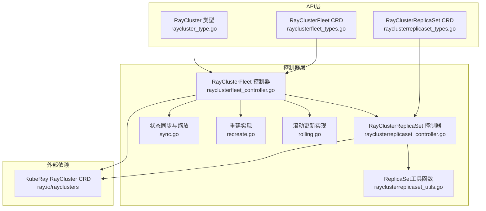
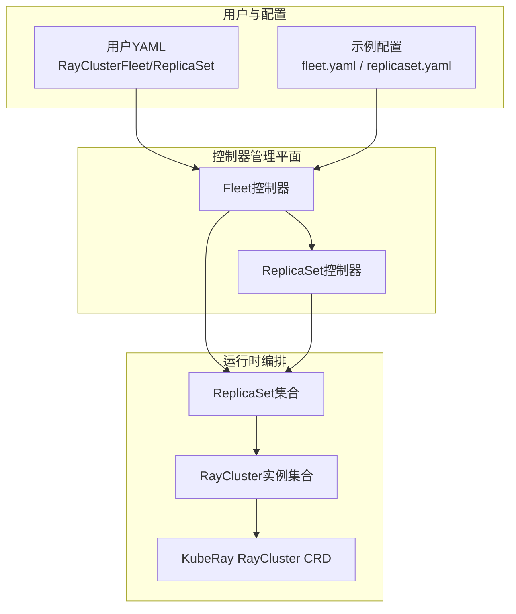
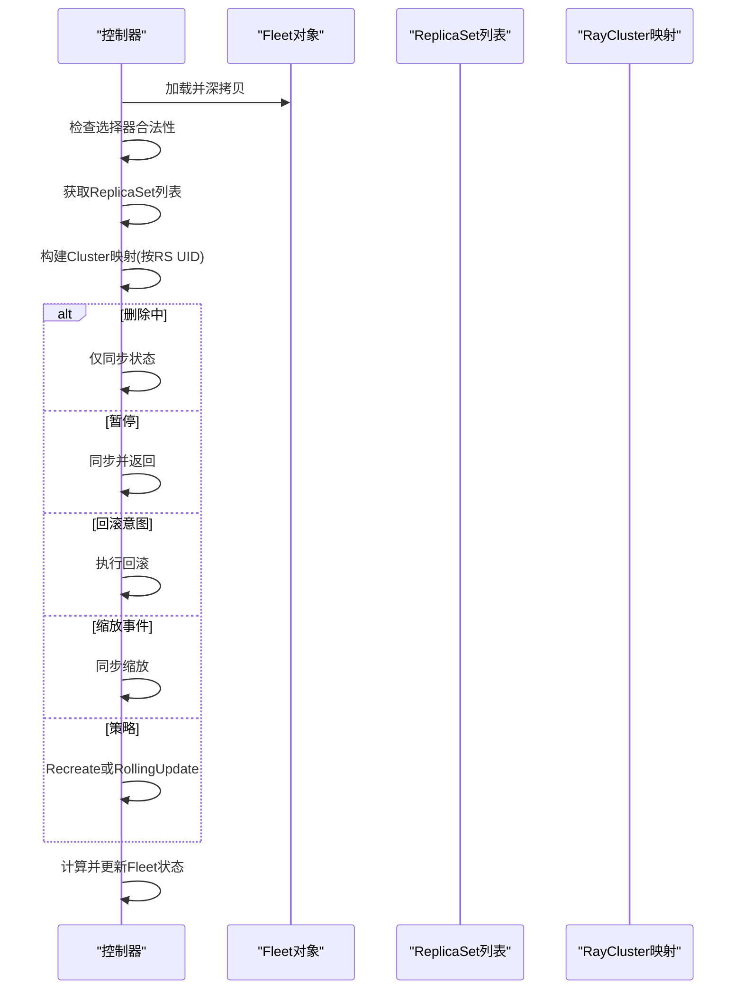
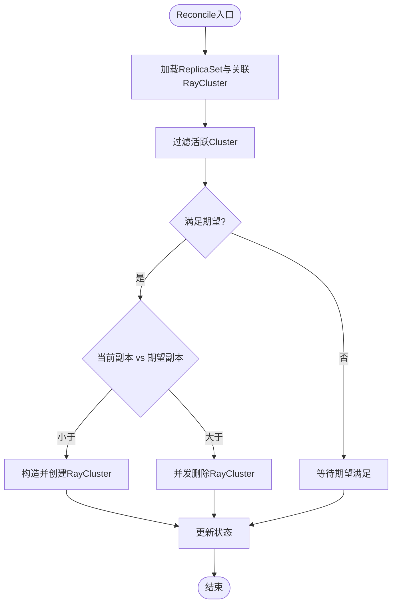
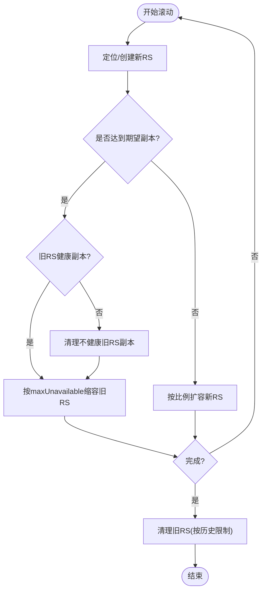
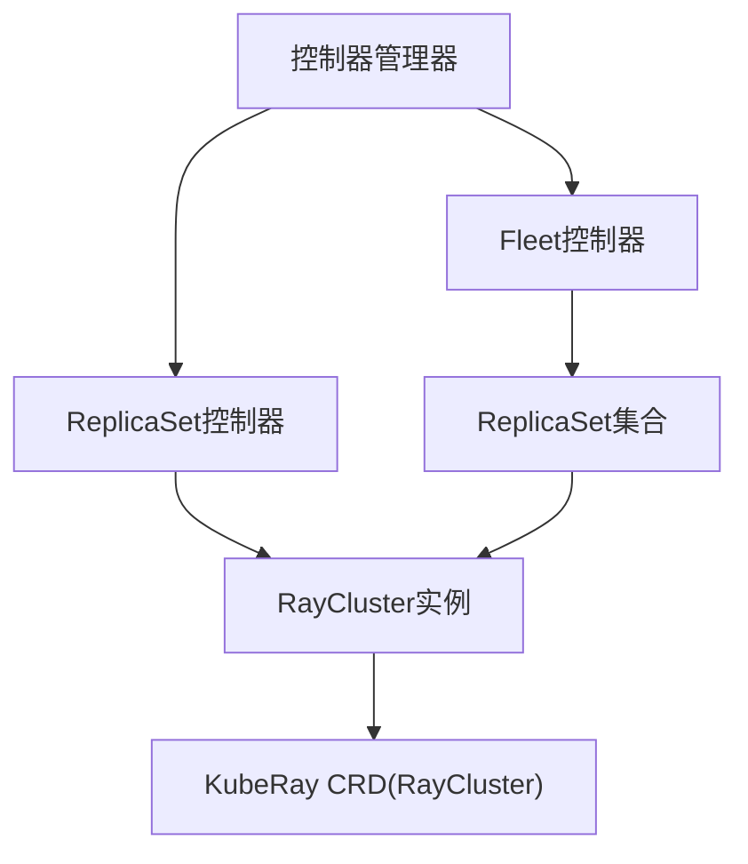

# Ray集群控制器

<cite>
**本文引用的文件**
- [raycluster_type.go](file://api/orchestration/v1alpha1/raycluster_type.go)
- [rayclusterfleet_types.go](file://api/orchestration/v1alpha1/rayclusterfleet_types.go)
- [rayclusterreplicaset_types.go](file://api/orchestration/v1alpha1/rayclusterreplicaset_types.go)
- [rayclusterfleet_controller.go](file://pkg/controller/rayclusterfleet/rayclusterfleet_controller.go)
- [rayclusterreplicaset_controller.go](file://pkg/controller/rayclusterreplicaset/rayclusterreplicaset_controller.go)
- [rolling.go](file://pkg/controller/rayclusterfleet/rolling.go)
- [recreate.go](file://pkg/controller/rayclusterfleet/recreate.go)
- [sync.go](file://pkg/controller/rayclusterfleet/sync.go)
- [rayclusterreplicaset_utils.go](file://pkg/controller/rayclusterreplicaset/rayclusterreplicaset_utils.go)
- [controller.go](file://pkg/controller/controller.go)
- [rayclusterfleet.yaml](file://config/samples/orchestration_v1alpha1_rayclusterfleet.yaml)
- [rayclusterreplicaset.yaml](file://config/samples/orchestration_v1alpha1_rayclusterreplicaset.yaml)
- [patch.yaml](file://config/standalone/distributed-inference-controller/patch.yaml)
</cite>

## 目录
1. [简介](#简介)
2. [项目结构](#项目结构)
3. [核心组件](#核心组件)
4. [架构总览](#架构总览)
5. [详细组件分析](#详细组件分析)
6. [依赖分析](#依赖分析)
7. [性能考虑](#性能考虑)
8. [故障排查指南](#故障排查指南)
9. [结论](#结论)
10. [附录](#附录)

## 简介
本技术文档面向AIBrix Ray集群控制器，系统性阐述Ray集群编排体系的设计与实现，重点覆盖以下方面：
- RayClusterFleet控制器与RayClusterReplicaSet控制器的职责划分与协作关系
- Ray集群CRD定义、状态模型与生命周期控制
- 编排策略（滚动更新、重建）、故障恢复与回滚机制
- 配置项、资源分配与性能调优建议
- 实际使用示例路径：如何管理Ray集群、处理状态变化、优化性能
- 与KubeRay Operator的集成方式与分布式推理最佳实践

## 项目结构
Ray集群控制器位于orchestration API与对应的控制器实现中，并通过KubeRay CRD（RayCluster）进行底层编排。关键目录与文件如下：
- API层：定义RayCluster、RayClusterFleet、RayClusterReplicaSet的CRD与模板类型
- 控制器层：实现RayClusterFleet与RayClusterReplicaSet的Reconcile逻辑，负责编排、滚动更新、状态同步与清理
- 示例与集成：提供CRD样例、独立控制器部署补丁以及与KubeRay Operator的可选集成

**图表来源**
- [raycluster_type.go:24-34](file://api/orchestration/v1alpha1/raycluster_type.go#L24-L34)
- [rayclusterfleet_types.go:27-74](file://api/orchestration/v1alpha1/rayclusterfleet_types.go#L27-L74)
- [rayclusterreplicaset_types.go:27-55](file://api/orchestration/v1alpha1/rayclusterreplicaset_types.go#L27-L55)
- [rayclusterfleet_controller.go:72-87](file://pkg/controller/rayclusterfleet/rayclusterfleet_controller.go#L72-L87)
- [rayclusterreplicaset_controller.go:70-83](file://pkg/controller/rayclusterreplicaset/rayclusterreplicaset_controller.go#L70-L83)
- [rolling.go:29-65](file://pkg/controller/rayclusterfleet/rolling.go#L29-L65)
- [recreate.go:30-77](file://pkg/controller/rayclusterfleet/recreate.go#L30-L77)
- [sync.go:48-70](file://pkg/controller/rayclusterfleet/sync.go#L48-L70)
- [rayclusterreplicaset_utils.go:80-96](file://pkg/controller/rayclusterreplicaset/rayclusterreplicaset_utils.go#L80-L96)

**章节来源**
- [raycluster_type.go:19-34](file://api/orchestration/v1alpha1/raycluster_type.go#L19-L34)
- [rayclusterfleet_types.go:27-177](file://api/orchestration/v1alpha1/rayclusterfleet_types.go#L27-L177)
- [rayclusterreplicaset_types.go:27-122](file://api/orchestration/v1alpha1/rayclusterreplicaset_types.go#L27-L122)

## 核心组件
- RayCluster模板类型：封装KubeRay的RayClusterSpec，作为Fleet/ReplicaSet的模板字段，确保与上游operator兼容
- RayClusterFleet：面向多集群的编排抽象，支持滚动更新与重建策略、暂停/进度控制、版本历史清理
- RayClusterReplicaSet：面向单集群副本集的编排单元，负责按需创建/删除RayCluster实例，维护状态与就绪度
- 控制器职责：
  - Fleet控制器：解析选择器、管理ReplicaSet集合、执行滚动/重建、状态同步与清理
  - ReplicaSet控制器：根据期望副本数与当前RayCluster集合进行缩放，记录期望并异步更新状态

**章节来源**
- [raycluster_type.go:24-34](file://api/orchestration/v1alpha1/raycluster_type.go#L24-L34)
- [rayclusterfleet_types.go:27-119](file://api/orchestration/v1alpha1/rayclusterfleet_types.go#L27-L119)
- [rayclusterreplicaset_types.go:27-86](file://api/orchestration/v1alpha1/rayclusterreplicaset_types.go#L27-L86)
- [rayclusterfleet_controller.go:91-98](file://pkg/controller/rayclusterfleet/rayclusterfleet_controller.go#L91-L98)
- [rayclusterreplicaset_controller.go:87-99](file://pkg/controller/rayclusterreplicaset/rayclusterreplicaset_controller.go#L87-L99)

## 架构总览
Ray集群控制器采用分层设计：
- API层：定义CRD与模板类型，保证与KubeRay Operator的RayCluster规范一致
- 控制器层：Fleet控制器协调多个ReplicaSet，ReplicaSet控制器管理具体RayCluster实例
- 外部依赖：通过KubeRay CRD（ray.io/rayclusters）驱动底层Pod与服务编排

**图表来源**
- [rayclusterfleet_controller.go:72-87](file://pkg/controller/rayclusterfleet/rayclusterfleet_controller.go#L72-L87)
- [rayclusterreplicaset_controller.go:70-83](file://pkg/controller/rayclusterreplicaset/rayclusterreplicaset_controller.go#L70-L83)
- [rayclusterfleet.yaml:1-44](file://config/samples/orchestration_v1alpha1_rayclusterfleet.yaml#L1-L44)
- [rayclusterreplicaset.yaml:1-65](file://config/samples/orchestration_v1alpha1_rayclusterreplicaset.yaml#L1-L65)

## 详细组件分析

### RayClusterFleet控制器
- 职责
  - 解析选择器，列出并归类所属ReplicaSet与RayCluster
  - 处理暂停、缩放事件、回滚意图
  - 执行滚动更新或重建策略，同步状态并清理旧版本
- 关键流程
  - Reconcile入口：加载对象、复制深拷贝、检查空选择器、获取RS与Cluster映射
  - 暂停/缩放/回滚分支判断后进入对应处理
  - 策略分支：Recreate或RollingUpdate分别委托对应实现
  - 状态同步：计算并更新Fleet状态，包含可用/不可用副本、条件等

**图表来源**
- [rayclusterfleet_controller.go:107-183](file://pkg/controller/rayclusterfleet/rayclusterfleet_controller.go#L107-L183)
- [sync.go:37-70](file://pkg/controller/rayclusterfleet/sync.go#L37-L70)

**章节来源**
- [rayclusterfleet_controller.go:107-183](file://pkg/controller/rayclusterfleet/rayclusterfleet_controller.go#L107-L183)
- [sync.go:48-70](file://pkg/controller/rayclusterfleet/sync.go#L48-L70)

### RayClusterReplicaSet控制器
- 职责
  - 基于期望（expectations）与当前RayCluster集合进行缩放
  - 并发删除以提升伸缩效率，限制最大并发
  - 计算并更新状态（就绪/可用/全标签匹配）
- 关键流程
  - Reconcile入口：加载对象、查询关联RayCluster、过滤活跃实例
  - 判断是否满足期望，决定扩容或缩容
  - 并发删除使用信号量限流，聚合错误
  - 更新状态并记录事件

**图表来源**
- [rayclusterreplicaset_controller.go:109-161](file://pkg/controller/rayclusterreplicaset/rayclusterreplicaset_controller.go#L109-L161)
- [rayclusterreplicaset_utils.go:146-189](file://pkg/controller/rayclusterreplicaset/rayclusterreplicaset_utils.go#L146-L189)

**章节来源**
- [rayclusterreplicaset_controller.go:109-213](file://pkg/controller/rayclusterreplicaset/rayclusterreplicaset_controller.go#L109-L213)
- [rayclusterreplicaset_utils.go:80-190](file://pkg/controller/rayclusterreplicaset/rayclusterreplicaset_utils.go#L80-L190)

### 滚动更新与重建策略
- 滚动更新
  - 计算新旧RS数量，先扩容新RS至目标，再逐步缩容旧RS
  - 严格遵守maxUnavailable与minAvailable约束，优先清理不健康副本
- 重建策略
  - 先将旧RS缩至0，确认无旧Pod运行后再创建新RS并扩容
  - 适用于需要完全替换的场景（如镜像/参数变更）

**图表来源**
- [rolling.go:29-65](file://pkg/controller/rayclusterfleet/rolling.go#L29-L65)
- [recreate.go:30-77](file://pkg/controller/rayclusterfleet/recreate.go#L30-L77)
- [sync.go:450-488](file://pkg/controller/rayclusterfleet/sync.go#L450-L488)

**章节来源**
- [rolling.go:29-235](file://pkg/controller/rayclusterfleet/rolling.go#L29-L235)
- [recreate.go:30-124](file://pkg/controller/rayclusterfleet/recreate.go#L30-L124)
- [sync.go:450-572](file://pkg/controller/rayclusterfleet/sync.go#L450-L572)

### 状态管理与生命周期
- Fleet状态
  - 包含观察到的Generation、副本总数、已更新/就绪/可用/不可用副本、条件集合、碰撞计数、缩放目标选择器
  - 通过计算函数汇总各RS状态并设置最小可用性条件
- ReplicaSet状态
  - 统计全标签匹配、就绪、可用副本数，合并条件；在创建/删除失败时添加ReplicaFailure条件
- 生命周期
  - 创建：基于模板生成新RS并设置修订号与注解
  - 缩放：按比例或直接调整副本数
  - 清理：按修订历史限制删除旧RS

**章节来源**
- [rayclusterfleet_types.go:76-119](file://api/orchestration/v1alpha1/rayclusterfleet_types.go#L76-L119)
- [sync.go:504-548](file://pkg/controller/rayclusterfleet/sync.go#L504-L548)
- [rayclusterreplicaset_types.go:57-86](file://api/orchestration/v1alpha1/rayclusterreplicaset_types.go#L57-L86)
- [rayclusterreplicaset_utils.go:146-189](file://pkg/controller/rayclusterreplicaset/rayclusterreplicaset_utils.go#L146-L189)

## 依赖分析
- 控制器注册与集成
  - 控制器管理器按功能开关动态启用分布式推理控制器
  - 若未检测到KubeRay CRD（ray.io/rayclusters），则跳过相关控制器，避免运行时错误
- 外部依赖
  - KubeRay Operator提供的RayCluster CRD用于实际Pod与服务编排
- 内部依赖
  - Fleet控制器owns ReplicaSet与RayCluster，ReplicaSet控制器owns RayCluster
  - 工具模块提供哈希计算、注解与比例计算等通用能力

**图表来源**
- [controller.go:63-82](file://pkg/controller/controller.go#L63-L82)
- [rayclusterfleet_controller.go:72-87](file://pkg/controller/rayclusterfleet/rayclusterfleet_controller.go#L72-L87)
- [rayclusterreplicaset_controller.go:70-83](file://pkg/controller/rayclusterreplicaset/rayclusterreplicaset_controller.go#L70-L83)

**章节来源**
- [controller.go:63-82](file://pkg/controller/controller.go#L63-L82)

## 性能考虑
- 并发删除限流
  - ReplicaSet控制器在缩容时使用信号量限制并发删除协程数量，避免对API Server造成瞬时压力
- 期望机制
  - 使用expectations避免竞态，减少重复创建/删除，提高一致性
- 滚动更新策略
  - 严格遵循maxUnavailable与minAvailable，平衡可用性与更新速度
- 资源与镜像
  - Head与Worker容器的CPU/Memory请求/限制应结合负载与节点资源规划，避免过度争抢
- 版本历史清理
  - 合理设置revisionHistoryLimit，避免过多旧RS占用资源

**章节来源**
- [rayclusterreplicaset_controller.go:175-213](file://pkg/controller/rayclusterreplicaset/rayclusterreplicaset_controller.go#L175-L213)
- [sync.go:450-488](file://pkg/controller/rayclusterfleet/sync.go#L450-L488)

## 故障排查指南
- 常见问题
  - 选择器为空：Fleet会发出警告并仅同步状态，需修正selector
  - 暂停状态：进度条件被标记为Paused，恢复后需重新触发
  - 回滚意图：存在rollbackTo时优先执行回滚
  - 缩放冲突：当ReplicaSet注解中的期望副本与Spec不一致时，以Spec为准
- 排查步骤
  - 查看Fleet/ReplicaSet状态与条件，定位可用性不足或不可用副本
  - 检查KubeRay RayCluster实例状态与事件，确认Head/Worker就绪情况
  - 关注控制器日志中的期望满足与重试信息
- 相关实现参考
  - 状态同步与条件设置
  - 缩放与清理逻辑
  - 并发删除错误聚合

**章节来源**
- [rayclusterfleet_controller.go:125-160](file://pkg/controller/rayclusterfleet/rayclusterfleet_controller.go#L125-L160)
- [sync.go:72-103](file://pkg/controller/rayclusterfleet/sync.go#L72-L103)
- [rayclusterreplicaset_controller.go:175-213](file://pkg/controller/rayclusterreplicaset/rayclusterreplicaset_controller.go#L175-L213)

## 结论
AIBrix Ray集群控制器通过Fleet与ReplicaSet两级抽象，实现了对Ray集群的高可用编排与演进。其与KubeRay Operator的松耦合集成，既保证了与上游生态的兼容，又提供了灵活的策略与可观测性。实践中建议：
- 明确选择器与模板，合理配置滚动/重建策略
- 结合业务负载调优资源与副本数，关注可用性与成本平衡
- 在生产环境启用健康检查与监控，配合回滚与清理策略保障稳定性

## 附录

### 使用示例（示例文件路径）
- RayClusterFleet示例：[rayclusterfleet.yaml:1-44](file://config/samples/orchestration_v1alpha1_rayclusterfleet.yaml#L1-L44)
- RayClusterReplicaSet示例：[rayclusterreplicaset.yaml:1-65](file://config/samples/orchestration_v1alpha1_rayclusterreplicaset.yaml#L1-L65)

### 与KubeRay Operator集成
- 可选集成：若环境中安装了KubeRay Operator（ray.io/rayclusters CRD），分布式推理控制器将自动启用
- 未安装时：控制器会跳过相关控制器，不影响其他功能

**章节来源**
- [controller.go:63-82](file://pkg/controller/controller.go#L63-L82)

### 独立控制器部署（分布式推理控制器）
- 通过补丁启用独立控制器并禁用Webhook，便于在仅需Ray集群编排的场景下运行

**章节来源**
- [patch.yaml:1-18](file://config/standalone/distributed-inference-controller/patch.yaml#L1-L18)