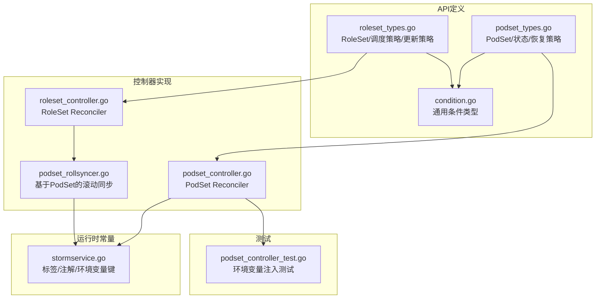
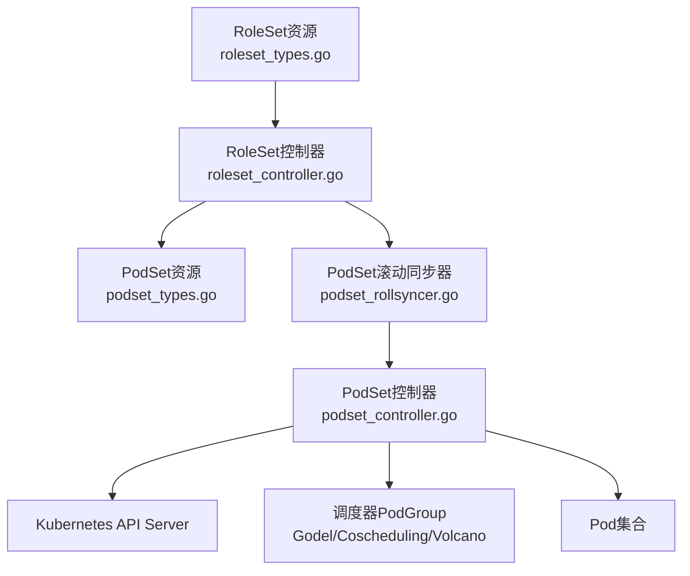
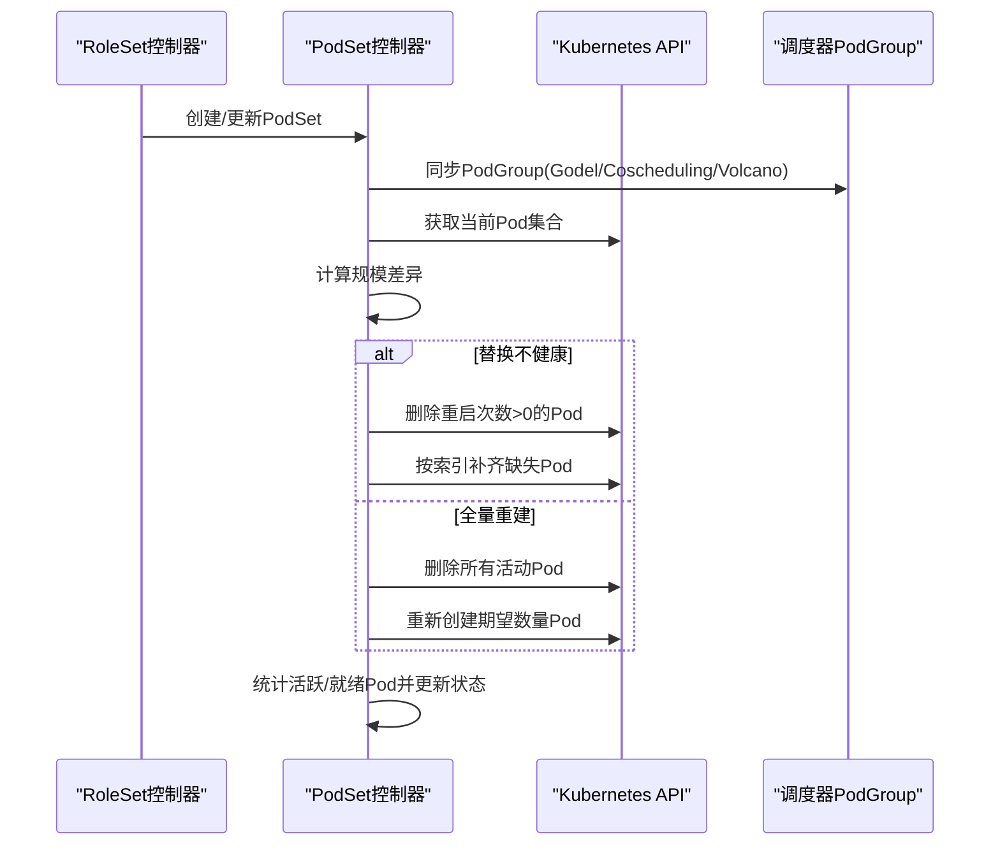
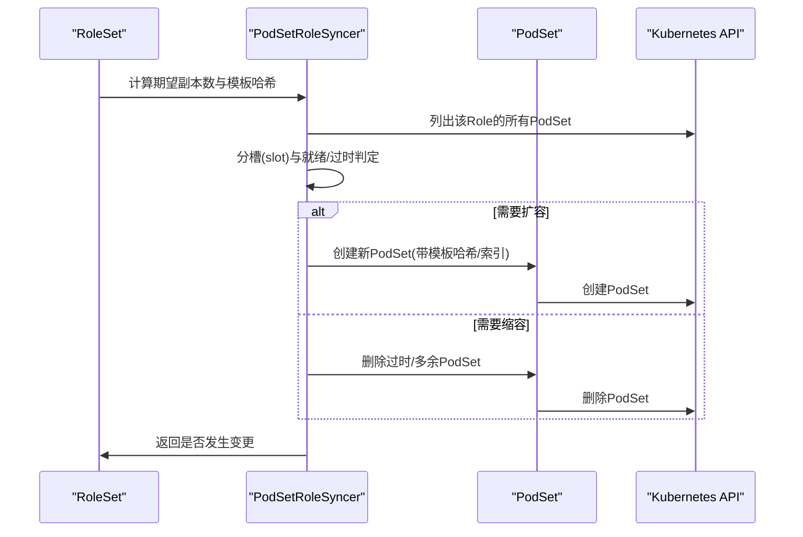
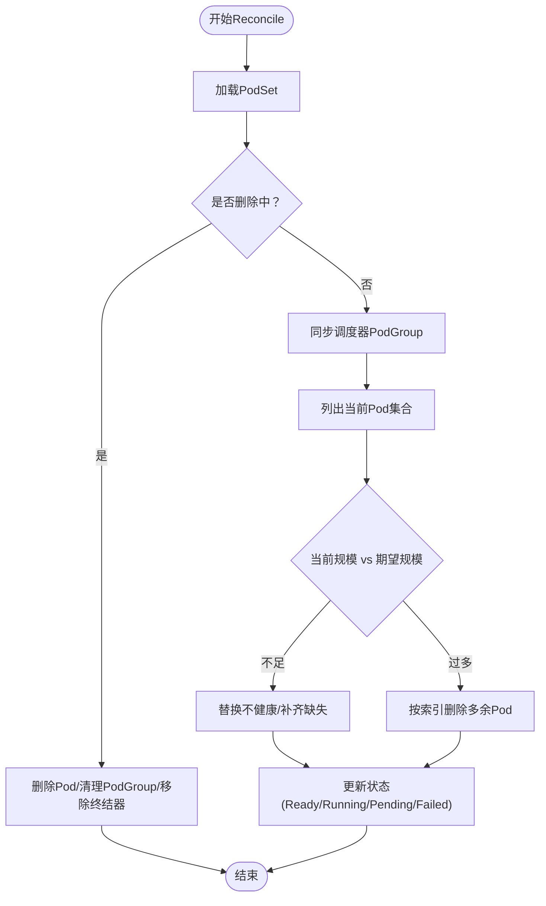
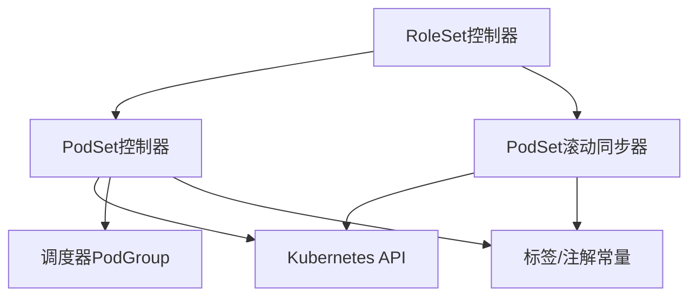

# PodSet控制器

<cite>
**本文档引用的文件**
- [podset_types.go](file://api/orchestration/v1alpha1/podset_types.go)
- [roleset_types.go](file://api/orchestration/v1alpha1/roleset_types.go)
- [podset_controller.go](file://pkg/controller/podset/podset_controller.go)
- [roleset_controller.go](file://pkg/controller/roleset/roleset_controller.go)
- [podset_rollsyncer.go](file://pkg/controller/roleset/podset_rollsyncer.go)
- [condition.go](file://api/orchestration/v1alpha1/condition.go)
- [podset_controller_test.go](file://pkg/controller/podset/podset_controller_test.go)
- [stormservice.go](file://pkg/controller/constants/stormservice.go)
</cite>

## 目录
1. [简介](#简介)
2. [项目结构](#项目结构)
3. [核心组件](#核心组件)
4. [架构总览](#架构总览)
5. [详细组件分析](#详细组件分析)
6. [依赖关系分析](#依赖关系分析)
7. [性能考虑](#性能考虑)
8. [故障排查指南](#故障排查指南)
9. [结论](#结论)
10. [附录](#附录)

## 简介
本技术文档面向AIBrix分布式推理系统的PodSet控制器，系统化阐述PodSet资源的设计目标、在多节点推理场景中的关键作用，以及控制器的实现细节。PodSet用于编排“原子性的Pod集合”，在RoleSet的协调下，通过稳定的网络身份（可选）和可配置的恢复策略，支撑高可用、可扩展的分布式推理服务。

- 设计目标
  - 原子组管理：以PodSet为最小调度与编排单元，确保同一逻辑角色或任务实例内的多个Pod作为一个整体进行调度与运行。
  - 状态同步：统一维护Ready/Total数量、生命周期阶段（Pending/Running/Ready/Failed），并支持条件化状态表达。
  - 恢复与滚动：提供“替换不健康”和“全量重建”两种恢复策略；结合RoleSet的滚动升级，实现平滑扩缩容与版本迭代。
  - 调度协同：与多种调度器（Godel、Coscheduling、Volcano）的PodGroup能力对接，保障成组调度一致性。

- 在分布式推理中的重要性
  - 多节点推理：通过PodGroupSize>1形成跨节点的推理实例，提升吞吐与容错。
  - 稳定网络：Stateful模式为引擎间通信提供稳定FQDN，便于拓扑发现与负载均衡。
  - 可观测与可观测：内置环境变量注入、事件记录与状态字段，便于监控与排障。

## 项目结构
围绕PodSet控制器的关键目录与文件如下：
- API层：定义PodSet与RoleSet的资源模型、调度策略与条件类型
- 控制器层：实现PodSet与RoleSet的Reconcile逻辑、Pod集合管理与滚动同步
- 常量与工具：标签/注解键、事件与环境变量注入规则
- 测试：验证环境变量注入顺序与冲突处理

**图表来源**
- [podset_types.go:24-131](file://api/orchestration/v1alpha1/podset_types.go#L24-L131)
- [roleset_types.go:28-251](file://api/orchestration/v1alpha1/roleset_types.go#L28-L251)
- [podset_controller.go:101-155](file://pkg/controller/podset/podset_controller.go#L101-L155)
- [roleset_controller.go:94-167](file://pkg/controller/roleset/roleset_controller.go#L94-L167)
- [podset_rollsyncer.go:37-442](file://pkg/controller/roleset/podset_rollsyncer.go#L37-L442)
- [condition.go:24-123](file://api/orchestration/v1alpha1/condition.go#L24-L123)
- [stormservice.go:19-55](file://pkg/controller/constants/stormservice.go#L19-L55)
- [podset_controller_test.go:34-191](file://pkg/controller/podset/podset_controller_test.go#L34-L191)

**章节来源**
- [podset_types.go:24-131](file://api/orchestration/v1alpha1/podset_types.go#L24-L131)
- [roleset_types.go:28-251](file://api/orchestration/v1alpha1/roleset_types.go#L28-L251)
- [podset_controller.go:101-155](file://pkg/controller/podset/podset_controller.go#L101-L155)
- [roleset_controller.go:94-167](file://pkg/controller/roleset/roleset_controller.go#L94-L167)
- [podset_rollsyncer.go:37-442](file://pkg/controller/roleset/podset_rollsyncer.go#L37-L442)
- [condition.go:24-123](file://api/orchestration/v1alpha1/condition.go#L24-L123)
- [stormservice.go:19-55](file://pkg/controller/constants/stormservice.go#L19-L55)
- [podset_controller_test.go:34-191](file://pkg/controller/podset/podset_controller_test.go#L34-L191)

## 核心组件
- PodSet资源模型
  - 规模与模板：PodGroupSize定义集合大小，Template定义Pod模板；Stateful决定是否启用稳定网络身份。
  - 恢复策略：ReplaceUnhealthy仅替换缺失/异常Pod；Recreate触发全量删除后重建。
  - 状态与条件：Ready/Running/Pending/Failed阶段；条件数组用于表达就绪、进度等语义。
- RoleSet与调度策略
  - RoleSet支持三种更新策略（Parallel/Sequential/Interleave），并可为每个Role指定独立的PodGroupSize与模板。
  - 调度策略可选择Godel/Coscheduling/Volcano的PodGroup能力，实现成组调度与亲和约束。
- PodSet控制器职责
  - 同步PodGroup：根据调度策略在不同调度器中创建/更新PodGroup。
  - 管理Pod集合：按恢复策略补齐/删除/替换Pod，维持与期望规模一致。
  - 更新状态：统计活跃/就绪Pod数量，计算阶段与条件（当前实现跳过条件写入）。
- RoleSet与PodSet协作
  - RoleSet作为上层编排者，创建/管理多个PodSet；PodSet负责具体Pod集合的生命周期。
  - 通过标签/注解传递RoleSet上下文（名称、索引、模板哈希等），实现滚动升级与路由发现。

**章节来源**
- [podset_types.go:24-131](file://api/orchestration/v1alpha1/podset_types.go#L24-L131)
- [roleset_types.go:28-251](file://api/orchestration/v1alpha1/roleset_types.go#L28-L251)
- [podset_controller.go:157-471](file://pkg/controller/podset/podset_controller.go#L157-L471)
- [roleset_controller.go:109-167](file://pkg/controller/roleset/roleset_controller.go#L109-L167)
- [podset_rollsyncer.go:37-442](file://pkg/controller/roleset/podset_rollsyncer.go#L37-L442)

## 架构总览
PodSet控制器在Kubernetes之上，通过自定义资源（CRD）与控制器循环实现对Pod集合的自动化管理。RoleSet控制器负责角色级编排，PodSet控制器负责集合级编排，并与调度器的PodGroup能力集成。

**图表来源**
- [roleset_controller.go:109-167](file://pkg/controller/roleset/roleset_controller.go#L109-L167)
- [podset_rollsyncer.go:37-442](file://pkg/controller/roleset/podset_rollsyncer.go#L37-L442)
- [podset_controller.go:157-471](file://pkg/controller/podset/podset_controller.go#L157-L471)
- [podset_types.go:24-131](file://api/orchestration/v1alpha1/podset_types.go#L24-L131)
- [roleset_types.go:28-251](file://api/orchestration/v1alpha1/roleset_types.go#L28-L251)

## 详细组件分析

### PodSet控制器实现
- 关键职责
  - 删除终结：删除所有关联Pod，清理各调度器的PodGroup，移除终结器。
  - 同步PodGroup：依据调度策略在Godel/Coscheduling/Volcano中创建/更新PodGroup。
  - 管理Pod集合：按恢复策略补齐/删除/替换Pod，维护索引与稳定网络标识。
  - 更新状态：统计活跃/就绪Pod数量，计算阶段（Pending/Running/Ready/Failed）。
- 数据流与控制流
  - Reconcile入口：加载PodSet，处理删除、添加终结器、调用reconcilePodGroup与reconcilePods、更新状态。
  - Pod集合管理：根据当前与期望规模差额，执行替换、重建或缩容。
  - 环境变量注入：为容器与初始化容器注入内置变量（名称、索引、大小），并保留用户自定义变量且保持顺序。

**图表来源**
- [podset_controller.go:115-155](file://pkg/controller/podset/podset_controller.go#L115-L155)
- [podset_controller.go:157-216](file://pkg/controller/podset/podset_controller.go#L157-L216)
- [podset_controller.go:218-353](file://pkg/controller/podset/podset_controller.go#L218-L353)
- [podset_controller.go:438-471](file://pkg/controller/podset/podset_controller.go#L438-L471)

**章节来源**
- [podset_controller.go:115-155](file://pkg/controller/podset/podset_controller.go#L115-L155)
- [podset_controller.go:157-216](file://pkg/controller/podset/podset_controller.go#L157-L216)
- [podset_controller.go:218-353](file://pkg/controller/podset/podset_controller.go#L218-L353)
- [podset_controller.go:355-422](file://pkg/controller/podset/podset_controller.go#L355-L422)
- [podset_controller.go:438-471](file://pkg/controller/podset/podset_controller.go#L438-L471)

### RoleSet与PodSet协作
- 角色到Pod的映射
  - RoleSet为每个Role生成多个PodSet，每个PodSet内部包含若干Pod（由Role的PodGroupSize决定）。
  - 通过标签（RoleSet名、Role名、模板哈希、副本索引）实现精确路由与发现。
- 资源分配策略
  - RoleSet可为Role单独指定调度策略，覆盖全局策略；PodSet继承该策略并注入对应PodGroup标签/注解。
- 负载均衡算法
  - 通过稳定的网络身份（Stateful）与服务发现标签，结合路由层实现请求分发与故障转移。
  - PodSet滚动同步器按步骤推进（受MaxSurge/MaxUnavailable约束），确保升级过程中的可用性。

**图表来源**
- [roleset_controller.go:109-167](file://pkg/controller/roleset/roleset_controller.go#L109-L167)
- [podset_rollsyncer.go:45-101](file://pkg/controller/roleset/podset_rollsyncer.go#L45-L101)
- [podset_rollsyncer.go:145-189](file://pkg/controller/roleset/podset_rollsyncer.go#L145-L189)
- [podset_rollsyncer.go:191-248](file://pkg/controller/roleset/podset_rollsyncer.go#L191-L248)

**章节来源**
- [roleset_types.go:146-183](file://api/orchestration/v1alpha1/roleset_types.go#L146-L183)
- [podset_rollsyncer.go:37-442](file://pkg/controller/roleset/podset_rollsyncer.go#L37-L442)
- [stormservice.go:19-55](file://pkg/controller/constants/stormservice.go#L19-L55)

### Pod生命周期管理与健康检查
- 生命周期管理
  - 删除终结：遍历并删除所有Pod，等待终止完成后再清理调度器PodGroup并移除终结器。
  - 规模管理：替换不健康Pod（检测容器重启次数）、按索引补齐缺失Pod、按需删除多余Pod。
  - 稳定网络：为Pod设置Hostname/Subdomain，配合服务实现稳定FQDN。
- 健康检查
  - 就绪判断：基于Pod就绪状态；阶段计算综合活跃与就绪数量。
  - 不健康识别：容器重启次数>0即标记为不健康并优先删除。
- 故障恢复
  - ReplaceUnhealthy：仅替换缺失或异常Pod，尽量减少停机时间。
  - Recreate：当需要强制重建时，先删除全部再重建，保证一致性但会短暂中断。

**图表来源**
- [podset_controller.go:115-155](file://pkg/controller/podset/podset_controller.go#L115-L155)
- [podset_controller.go:218-353](file://pkg/controller/podset/podset_controller.go#L218-L353)
- [podset_controller.go:438-471](file://pkg/controller/podset/podset_controller.go#L438-L471)

**章节来源**
- [podset_controller.go:473-504](file://pkg/controller/podset/podset_controller.go#L473-L504)
- [podset_controller.go:243-353](file://pkg/controller/podset/podset_controller.go#L243-L353)
- [podset_controller.go:438-471](file://pkg/controller/podset/podset_controller.go#L438-L471)

### 配置选项与使用示例
- PodSet配置要点
  - podGroupSize：集合内Pod数量（2-100）。
  - template：Pod模板，包含容器、卷、资源等。
  - stateful：是否启用稳定网络身份（Hostname/Subdomain）。
  - recoveryPolicy：ReplaceUnhealthy 或 Recreate。
  - schedulingStrategy：可选Godel/Coscheduling/Volcano的PodGroup参数。
- RoleSet配置要点
  - roles：每个Role的名称、副本数、PodGroupSize、模板、更新策略、调度策略。
  - updateStrategy：整体更新策略（Parallel/Sequential/Interleave）。
- 使用示例路径
  - RoleSet示例：[orchestration_v1alpha1_roleset.yaml:1-10](file://config/samples/orchestration_v1alpha1_roleset.yaml#L1-L10)
  - PodSet控制器实现：[podset_controller.go:115-155](file://pkg/controller/podset/podset_controller.go#L115-L155)
  - PodSet资源定义：[podset_types.go:24-131](file://api/orchestration/v1alpha1/podset_types.go#L24-L131)
  - RoleSet资源定义：[roleset_types.go:28-251](file://api/orchestration/v1alpha1/roleset_types.go#L28-L251)

**章节来源**
- [podset_types.go:24-131](file://api/orchestration/v1alpha1/podset_types.go#L24-L131)
- [roleset_types.go:28-251](file://api/orchestration/v1alpha1/roleset_types.go#L28-L251)
- [podset_controller.go:115-155](file://pkg/controller/podset/podset_controller.go#L115-L155)

### 实际代码示例与常见问题
- 环境变量注入顺序与冲突处理
  - 内置变量（名称、索引、大小）始终位于用户变量之前，且用户变量顺序保持不变。
  - 若用户变量与内置变量同名，内置变量优先，用户变量被忽略。
  - 测试用例验证了上述行为，确保引擎侧能稳定读取内置变量。
- 常见问题与解决
  - Pod频繁重启：控制器会识别重启次数>0的Pod并删除，随后按索引补齐。
  - 扩缩容不生效：确认PodSet的PodGroupSize与RoleSet的replicas/podGroupSize配置一致。
  - 稳定网络未生效：检查Stateful开关与服务发现标签，确保Subdomain与Hostname正确设置。

**章节来源**
- [podset_controller_test.go:34-191](file://pkg/controller/podset/podset_controller_test.go#L34-L191)
- [podset_controller.go:355-422](file://pkg/controller/podset/podset_controller.go#L355-L422)
- [stormservice.go:19-55](file://pkg/controller/constants/stormservice.go#L19-L55)

## 依赖关系分析
- 组件耦合
  - PodSet控制器直接依赖Kubernetes API与动态客户端，用于Pod与PodGroup的CRUD。
  - RoleSet控制器依赖PodSet控制器，通过Owned关系管理PodSet生命周期。
  - PodSet滚动同步器依赖RoleSet提供的模板哈希与更新策略，实现分槽与步骤推进。
- 外部依赖
  - 调度器插件：Godel、Coscheduling、Volcano的PodGroup CRD。
  - Kubernetes标准资源：Pod、事件、终结器。
- 潜在循环依赖
  - 当前设计通过OwnerReference单向依赖，避免循环。

**图表来源**
- [roleset_controller.go:65-81](file://pkg/controller/roleset/roleset_controller.go#L65-L81)
- [podset_controller.go:77-88](file://pkg/controller/podset/podset_controller.go#L77-L88)
- [podset_rollsyncer.go:37-442](file://pkg/controller/roleset/podset_rollsyncer.go#L37-L442)
- [stormservice.go:19-55](file://pkg/controller/constants/stormservice.go#L19-L55)

**章节来源**
- [roleset_controller.go:65-81](file://pkg/controller/roleset/roleset_controller.go#L65-L81)
- [podset_controller.go:77-88](file://pkg/controller/podset/podset_controller.go#L77-L88)
- [podset_rollsyncer.go:37-442](file://pkg/controller/roleset/podset_rollsyncer.go#L37-L442)

## 性能考虑
- 批量操作
  - PodSet创建/删除采用批量接口，减少API往返开销。
- 排序与索引
  - 按PodGroupIndex排序，确保删除/补齐按序进行，降低调度抖动。
- 调度器集成
  - 通过PodGroup能力一次性满足多Pod调度需求，减少多次调度带来的延迟。
- 状态更新
  - 仅在状态变化时更新，避免不必要的写放大。

## 故障排查指南
- 常见症状与定位
  - Pod长时间处于非就绪：检查容器重启次数与日志；关注控制器事件记录。
  - 扩缩容未生效：核对PodSet与RoleSet的规模配置；查看Pod索引是否连续。
  - 滚动升级卡住：检查模板哈希标签与分槽数量；确认MaxSurge/MaxUnavailable配置。
- 关键日志与事件
  - 控制器记录“DeletingUnhealthyPods”、“RecreatingAllPods”、“ScalingDown”等事件，辅助快速定位。
  - 状态阶段从Pending到Running再到Ready，若长时间停滞，需检查Pod健康与调度器状态。
- 建议排查步骤
  1. 查看PodSet事件与状态阶段。
  2. 检查Pod集合的活跃/就绪数量与索引分布。
  3. 核对调度器PodGroup是否已同步。
  4. 审视容器日志与重启原因。

**章节来源**
- [podset_controller.go:138-152](file://pkg/controller/podset/podset_controller.go#L138-L152)
- [podset_controller.go:258-268](file://pkg/controller/podset/podset_controller.go#L258-L268)
- [podset_controller.go:308-335](file://pkg/controller/podset/podset_controller.go#L308-L335)
- [podset_controller.go:337-353](file://pkg/controller/podset/podset_controller.go#L337-L353)

## 结论
PodSet控制器通过“原子Pod集合”的抽象，为RoleSet在多节点推理场景下的编排提供了坚实基础。其与调度器的深度集成、完善的恢复策略与状态管理，使得大规模分布式推理服务具备高可用、可扩展与可观测的特性。结合RoleSet的滚动同步器，系统实现了从角色到Pod集合的端到端自动化管理。

## 附录
- API与类型参考
  - PodSet：[podset_types.go:24-131](file://api/orchestration/v1alpha1/podset_types.go#L24-L131)
  - RoleSet：[roleset_types.go:28-251](file://api/orchestration/v1alpha1/roleset_types.go#L28-L251)
  - 条件类型：[condition.go:24-123](file://api/orchestration/v1alpha1/condition.go#L24-L123)
- 控制器实现参考
  - PodSet控制器：[podset_controller.go:101-545](file://pkg/controller/podset/podset_controller.go#L101-L545)
  - RoleSet控制器：[roleset_controller.go:94-168](file://pkg/controller/roleset/roleset_controller.go#L94-L168)
  - PodSet滚动同步器：[podset_rollsyncer.go:37-547](file://pkg/controller/roleset/podset_rollsyncer.go#L37-L547)
- 运行时常量
  - 标签/注解/环境变量键：[stormservice.go:19-55](file://pkg/controller/constants/stormservice.go#L19-L55)
- 测试参考
  - 环境变量注入测试：[podset_controller_test.go:34-191](file://pkg/controller/podset/podset_controller_test.go#L34-L191)