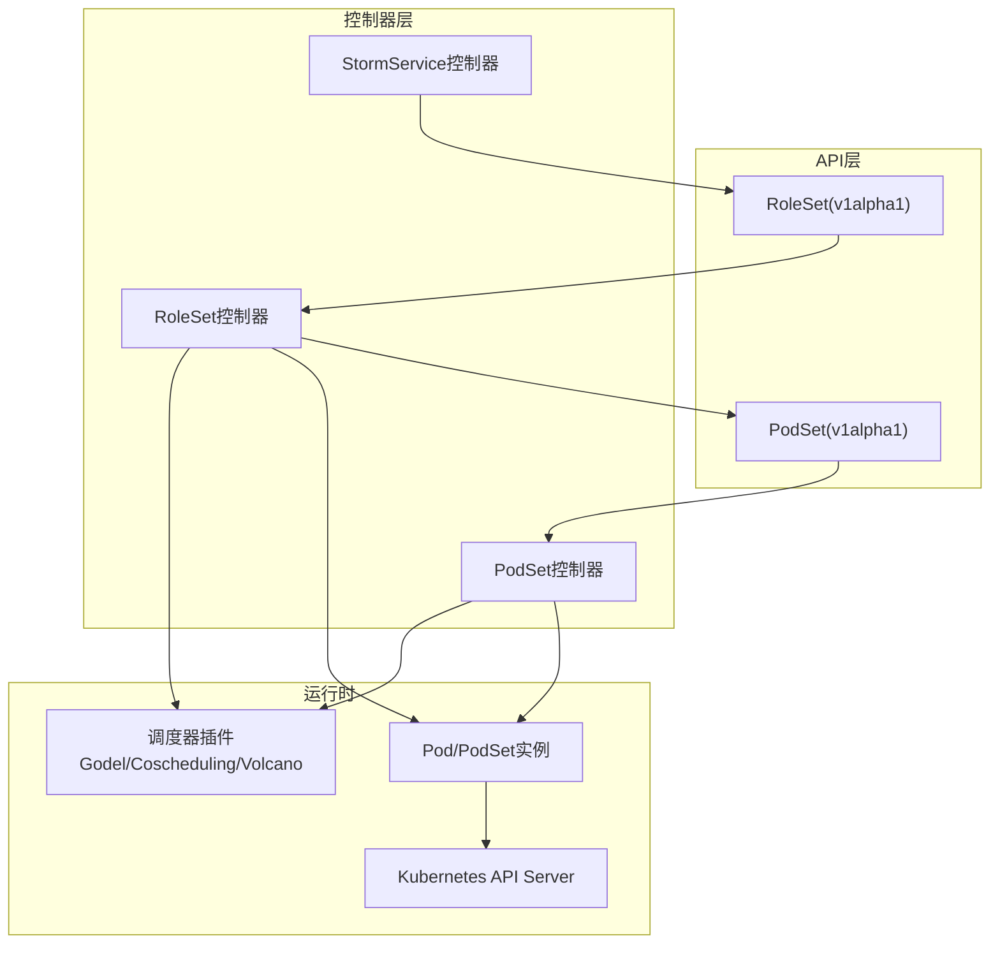
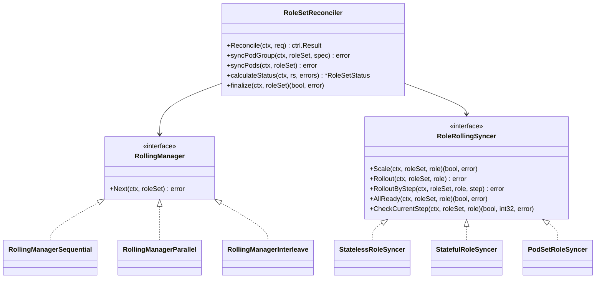
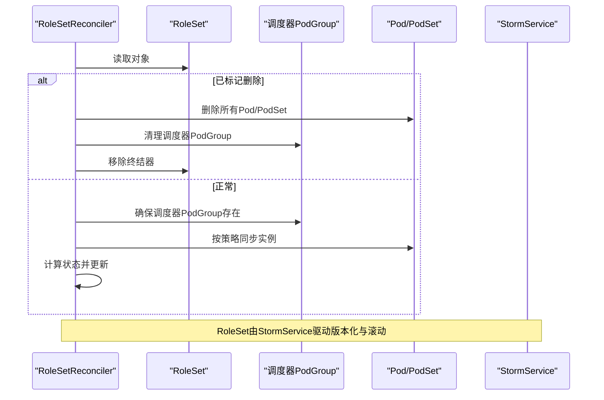
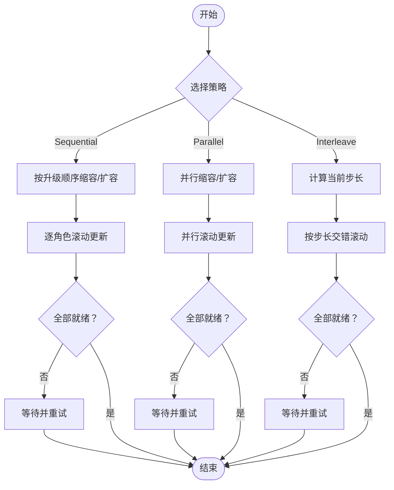
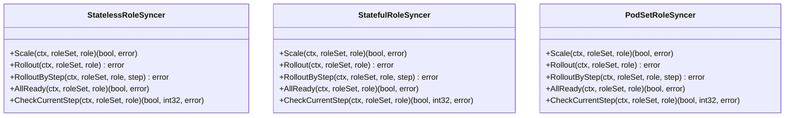
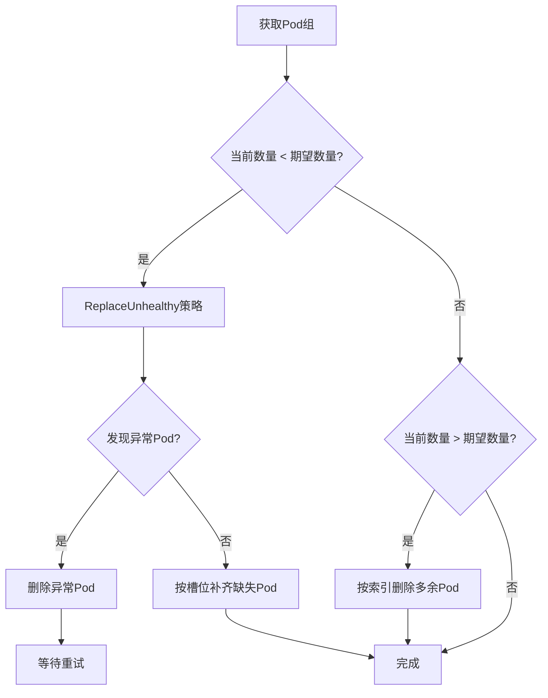
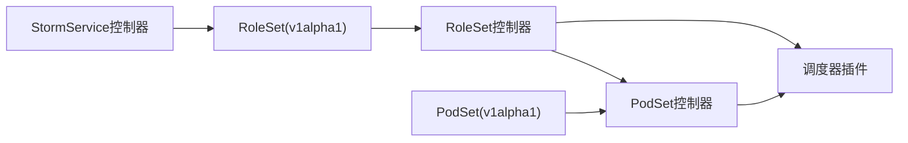

# RoleSet控制器

<cite>
**本文引用的文件**
- [roleset_types.go](file://api/orchestration/v1alpha1/roleset_types.go)
- [podset_types.go](file://api/orchestration/v1alpha1/podset_types.go)
- [roleset_controller.go](file://pkg/controller/roleset/roleset_controller.go)
- [sync.go](file://pkg/controller/roleset/sync.go)
- [rolling.go](file://pkg/controller/roleset/rolling.go)
- [rolesyncer.go](file://pkg/controller/roleset/rolesyncer.go)
- [podset_rollsyncer.go](file://pkg/controller/roleset/podset_rollsyncer.go)
- [utils.go](file://pkg/controller/roleset/utils.go)
- [podset_controller.go](file://pkg/controller/podset/podset_controller.go)
- [stormservice_controller.go](file://pkg/controller/stormservice/stormservice_controller.go)
- [stormservice.go](file://pkg/controller/constants/stormservice.go)
- [roleset.yaml](file://config/samples/orchestration_v1alpha1_roleset.yaml)
- [stormservice.yaml](file://config/samples/orchestration_v1alpha1_stormservice.yaml)
- [stormservice-pool.yaml](file://samples/autoscaling/stormservice-pool.yaml)
</cite>

## 目录
1. [简介](#简介)
2. [项目结构](#项目结构)
3. [核心组件](#核心组件)
4. [架构总览](#架构总览)
5. [详细组件分析](#详细组件分析)
6. [依赖关系分析](#依赖关系分析)
7. [性能考量](#性能考量)
8. [故障排查指南](#故障排查指南)
9. [结论](#结论)
10. [附录：配置示例与使用场景](#附录配置示例与使用场景)

## 简介
本技术文档围绕AIBrix的RoleSet控制器展开，系统性阐述RoleSet资源在StormService中的设计理念与职责边界，以及其在多角色编排、模板管理、实例调度、状态同步与滚动更新方面的实现原理。文档同时解析RoleSet与PodSet的协作关系，覆盖资源分配、负载均衡与故障恢复机制，并提供可直接落地的配置示例与使用场景。

## 项目结构
- RoleSet与PodSet属于编排层API，分别定义了“角色集合”和“原子Pod组”的抽象。
- RoleSet控制器负责根据RoleSet规范，协调Pod或PodSet的生命周期，维护状态并执行滚动更新。
- PodSet控制器负责单个Pod组的创建、健康检查与回收策略。
- StormService控制器负责对RoleSet进行版本化管理与滚动升级。



图示来源
- [roleset_controller.go:64-81](file://pkg/controller/roleset/roleset_controller.go#L64-L81)
- [podset_controller.go:75-88](file://pkg/controller/podset/podset_controller.go#L75-L88)
- [stormservice_controller.go:59-73](file://pkg/controller/stormservice/stormservice_controller.go#L59-L73)

章节来源
- [roleset_controller.go:64-81](file://pkg/controller/roleset/roleset_controller.go#L64-L81)
- [podset_controller.go:75-88](file://pkg/controller/podset/podset_controller.go#L75-L88)
- [stormservice_controller.go:59-73](file://pkg/controller/stormservice/stormservice_controller.go#L59-L73)

## 核心组件
- RoleSet资源模型：定义角色列表、更新策略、调度策略与破坏容忍度；状态包含各角色的副本统计与条件。
- PodSet资源模型：定义Pod组大小、模板、恢复策略与阶段状态。
- RoleSet控制器：负责同步PodGroup（调度器插件）、同步Pod/PodSet、计算状态、执行删除终末化。
- PodSet控制器：负责Pod组内Pod的创建、替换、重建与状态更新。
- StormService控制器：负责RoleSet的版本化与滚动升级策略协调。

章节来源
- [roleset_types.go:28-251](file://api/orchestration/v1alpha1/roleset_types.go#L28-L251)
- [podset_types.go:24-131](file://api/orchestration/v1alpha1/podset_types.go#L24-L131)
- [roleset_controller.go:94-167](file://pkg/controller/roleset/roleset_controller.go#L94-L167)
- [podset_controller.go:101-155](file://pkg/controller/podset/podset_controller.go#L101-L155)
- [stormservice_controller.go:85-148](file://pkg/controller/stormservice/stormservice_controller.go#L85-L148)

## 架构总览
RoleSet控制器通过三种滚动管理器支持不同的更新策略：
- 串行（Sequential）：按升级顺序逐个角色滚动，确保依赖链路稳定。
- 并行（Parallel）：所有角色同时滚动，提升效率但需更强的可用性保障。
- 交错（Interleave）：按步长交错推进，平衡速度与稳定性。



图示来源
- [roleset_controller.go:94-167](file://pkg/controller/roleset/roleset_controller.go#L94-L167)
- [rolling.go:33-207](file://pkg/controller/roleset/rolling.go#L33-L207)
- [rolesyncer.go:35-645](file://pkg/controller/roleset/rolesyncer.go#L35-L645)
- [podset_rollsyncer.go:37-547](file://pkg/controller/roleset/podset_rollsyncer.go#L37-L547)

## 详细组件分析

### RoleSet资源模型与状态机
- 角色定义：每个角色包含名称、副本数、升级顺序、Pod组大小、更新策略、有无状态标志、模板与破坏容忍度。
- 更新策略：支持并行、串行、交错三种策略类型。
- 调度策略：支持Godel、Coscheduling、Volcano三种调度器插件的PodGroup配置。
- 状态：记录每个角色的总副本、就绪副本、已更新副本与已更新就绪副本，并维护整体Ready/ReplicaFailure等条件。

```mermaid
erDiagram
ROLESET {
string metadata.name
string metadata.namespace
array spec.roles
enum spec.updateStrategy
object spec.schedulingStrategy
}
ROLE {
string name
int32 replicas
int32 upgradeOrder
int32 podGroupSize
object updateStrategy
boolean stateful
object template
object disruptionTolerance
object schedulingStrategy
}
ROLESET ||--o{ ROLE : "包含"
```

图示来源
- [roleset_types.go:28-183](file://api/orchestration/v1alpha1/roleset_types.go#L28-L183)

章节来源
- [roleset_types.go:28-251](file://api/orchestration/v1alpha1/roleset_types.go#L28-L251)

### RoleSet控制器工作流
- 终末化流程：删除所有PodSet/Pod、清理调度器插件的PodGroup、移除终结器。
- 同步PodGroup：根据调度策略创建/更新对应调度器的PodGroup。
- 同步Pod/PodSet：根据更新策略选择滚动管理器，依次执行缩容/扩容与滚动更新。
- 计算状态：基于Pod/PodSet统计各角色就绪/更新状态，生成RoleSet条件。



图示来源
- [roleset_controller.go:109-167](file://pkg/controller/roleset/roleset_controller.go#L109-L167)
- [sync.go:43-102](file://pkg/controller/roleset/sync.go#L43-L102)
- [sync.go:104-125](file://pkg/controller/roleset/sync.go#L104-L125)
- [sync.go:127-161](file://pkg/controller/roleset/sync.go#L127-L161)

章节来源
- [roleset_controller.go:94-167](file://pkg/controller/roleset/roleset_controller.go#L94-L167)
- [sync.go:43-161](file://pkg/controller/roleset/sync.go#L43-L161)

### 滚动管理器与更新策略
- 串行（Sequential）：先按升级顺序缩容/扩容，再逐个角色执行滚动，直至全部角色就绪。
- 并行（Parallel）：所有角色同时缩容/扩容与滚动，适合高可用场景。
- 交错（Interleave）：按步长交错推进，结合MaxSurge与MaxUnavailable控制每步更新/删除数量，兼顾速度与稳定性。



图示来源
- [rolling.go:41-92](file://pkg/controller/roleset/rolling.go#L41-L92)
- [rolling.go:98-122](file://pkg/controller/roleset/rolling.go#L98-L122)
- [rolling.go:130-207](file://pkg/controller/roleset/rolling.go#L130-L207)

章节来源
- [rolling.go:33-207](file://pkg/controller/roleset/rolling.go#L33-L207)

### 角色同步器与Pod/PodSet编排
- 无状态角色同步器：基于Pod，按模板哈希区分新旧版本，优先删除旧版本就绪Pod，再创建新版本以满足MaxSurge与MaxUnavailable约束。
- 有状态角色同步器：按槽位（基于索引）管理，确保每个槽位最多保留一个最新版本的Pod，其余旧版本逐步替换。
- PodSet角色同步器：与有状态角色同步器模式一致，但面向PodSet，通过PodSet的Ready/Failed阶段与标签哈希实现版本化编排。



图示来源
- [rolesyncer.go:35-645](file://pkg/controller/roleset/rolesyncer.go#L35-L645)
- [podset_rollsyncer.go:37-547](file://pkg/controller/roleset/podset_rollsyncer.go#L37-L547)

章节来源
- [rolesyncer.go:35-645](file://pkg/controller/roleset/rolesyncer.go#L35-L645)
- [podset_rollsyncer.go:37-547](file://pkg/controller/roleset/podset_rollsyncer.go#L37-L547)

### PodSet控制器与恢复策略
- ReplaceUnhealthy：当Pod组缺失槽位时，仅重建缺失槽位；若发现容器重启则优先删除异常Pod。
- Recreate：若存在活动Pod，则先删除全部再重建，确保一致性。
- 状态更新：根据就绪Pod数量与期望组大小确定阶段（Pending/Running/Ready）。



图示来源
- [podset_controller.go:218-241](file://pkg/controller/podset/podset_controller.go#L218-L241)
- [podset_controller.go:243-303](file://pkg/controller/podset/podset_controller.go#L243-L303)
- [podset_controller.go:305-335](file://pkg/controller/podset/podset_controller.go#L305-L335)
- [podset_controller.go:337-353](file://pkg/controller/podset/podset_controller.go#L337-L353)

章节来源
- [podset_controller.go:218-353](file://pkg/controller/podset/podset_controller.go#L218-L353)

### RoleSet与PodSet的协作关系
- 当角色的PodGroupSize > 1时，RoleSet控制器通过PodSet角色同步器创建/管理PodSet，PodSet控制器负责Pod组内的实例生命周期与恢复策略。
- 当PodGroupSize ≤ 1时，RoleSet控制器直接管理Pod，使用无状态/有状态同步器进行编排。
- 两者均通过模板哈希与标签索引实现版本化与槽位管理，保证滚动更新的可控性与可观测性。

章节来源
- [rolesyncer.go:625-645](file://pkg/controller/roleset/rolesyncer.go#L625-L645)
- [podset_rollsyncer.go:37-547](file://pkg/controller/roleset/podset_rollsyncer.go#L37-L547)
- [podset_types.go:24-47](file://api/orchestration/v1alpha1/podset_types.go#L24-L47)

## 依赖关系分析
- RoleSet控制器依赖调度器插件的PodGroup能力，用于跨Pod的一致性调度。
- RoleSet控制器依赖PodSet控制器以支持多节点推理场景下的Pod组管理。
- StormService控制器负责RoleSet的版本化与滚动策略，RoleSet控制器据此计算状态与触发更新。



图示来源
- [roleset_controller.go:64-81](file://pkg/controller/roleset/roleset_controller.go#L64-L81)
- [podset_controller.go:75-88](file://pkg/controller/podset/podset_controller.go#L75-L88)
- [stormservice_controller.go:59-73](file://pkg/controller/stormservice/stormservice_controller.go#L59-L73)

章节来源
- [roleset_controller.go:64-81](file://pkg/controller/roleset/roleset_controller.go#L64-L81)
- [podset_controller.go:75-88](file://pkg/controller/podset/podset_controller.go#L75-L88)
- [stormservice_controller.go:59-73](file://pkg/controller/stormservice/stormservice_controller.go#L59-L73)

## 性能考量
- 批量操作：创建/删除Pod/PodSet采用分批与慢启动策略，避免瞬时压力。
- 策略选择：交错更新在吞吐与稳定性间取得平衡；串行更保守，适合关键路径；并行需更强的可用性保障。
- 调度器插件：合理配置最小成员、优先级与超时，有助于批量任务的快速就绪与资源抢占。
- 状态计算：按角色维度统计，减少全量扫描成本；PodSet模式下按阶段判断，降低复杂度。

## 故障排查指南
- 常见问题
  - RoleSet长时间处于非Ready：检查各角色就绪副本与更新副本是否符合预期，关注ReplicaFailure条件。
  - 滚动更新卡住：查看交错更新的当前步长与预算限制，确认MaxSurge/MaxUnavailable配置是否合理。
  - 多节点推理失败：检查PodSet阶段是否为Ready，异常Pod是否被替换，必要时启用Recreate策略。
- 排查步骤
  - 查看RoleSet状态与条件，定位具体角色与问题阶段。
  - 检查Pod/PodSet数量与就绪状态，核对模板哈希与槽位索引。
  - 关注控制器日志中的创建/删除批次与重试间隔。
  - 若涉及调度器插件，确认PodGroup是否存在且参数正确。

章节来源
- [sync.go:127-161](file://pkg/controller/roleset/sync.go#L127-L161)
- [utils.go:375-412](file://pkg/controller/roleset/utils.go#L375-L412)
- [podset_controller.go:438-471](file://pkg/controller/podset/podset_controller.go#L438-L471)

## 结论
RoleSet控制器通过清晰的角色抽象、灵活的滚动策略与与PodSet的深度协作，实现了对多角色、多实例编排的统一治理。结合StormService的版本化能力，系统能够在保证稳定性的同时，高效地完成滚动更新与扩缩容。对于多节点推理场景，PodSet提供了强一致的实例组管理能力，配合调度器插件可实现更优的资源利用与故障恢复。

## 附录：配置示例与使用场景

### 配置示例
- RoleSet基础示例
  - 参考文件：[roleset.yaml](file://config/samples/orchestration_v1alpha1_roleset.yaml)
- StormService示例（含独立预填充/解码角色的池化模式）
  - 参考文件：[stormservice-pool.yaml](file://samples/autoscaling/stormservice-pool.yaml)

### 使用场景
- 多角色编排：为不同职责（如prefill/decode）定义角色，分别设置副本数与更新策略。
- 多节点推理：将PodGroupSize设为大于1，使用PodSet进行槽位化管理与恢复。
- 滚动更新：根据业务SLA选择Sequential/Parallel/Interleave策略，并配置MaxSurge/MaxUnavailable。
- 调度协同：通过SchedulingStrategy对接Godel/Coscheduling/Volcano，确保批量Pod的成组调度与优先级。

章节来源
- [roleset.yaml:1-10](file://config/samples/orchestration_v1alpha1_roleset.yaml#L1-L10)
- [stormservice-pool.yaml:75-121](file://samples/autoscaling/stormservice-pool.yaml#L75-L121)