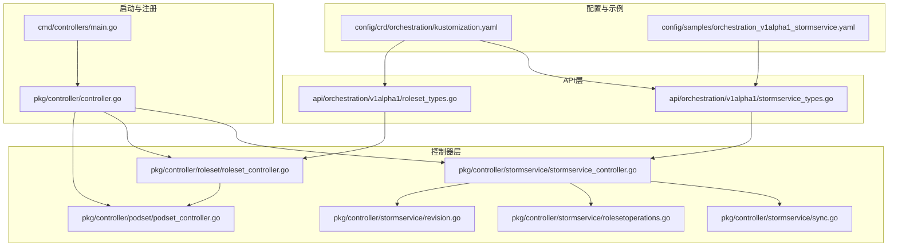
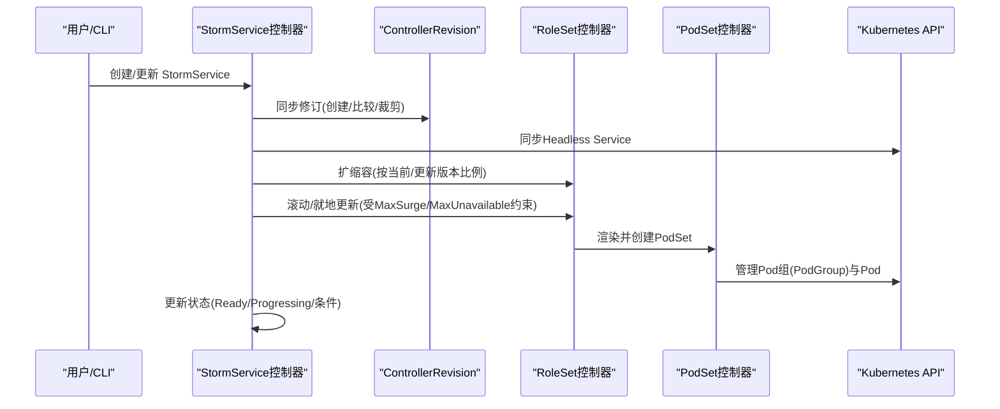
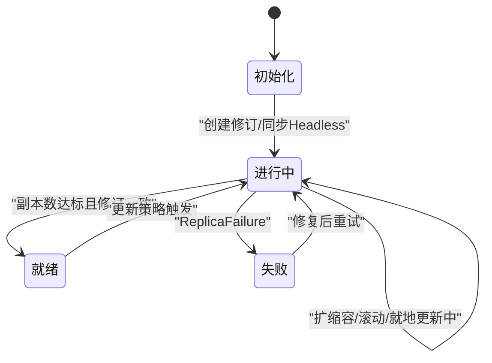
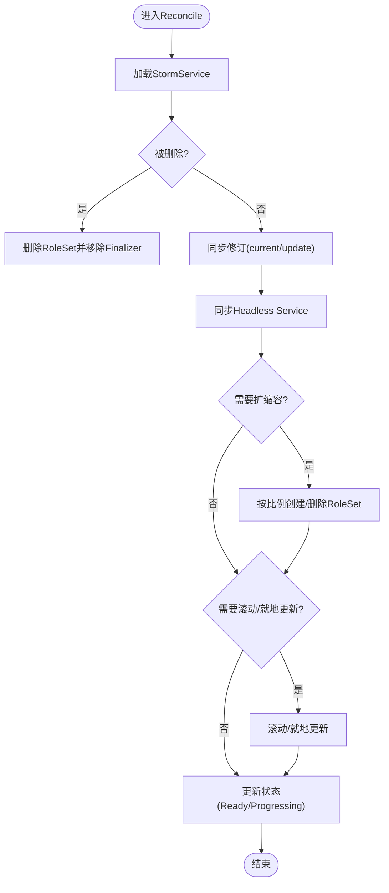
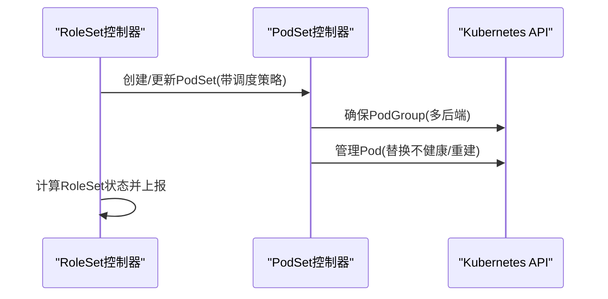
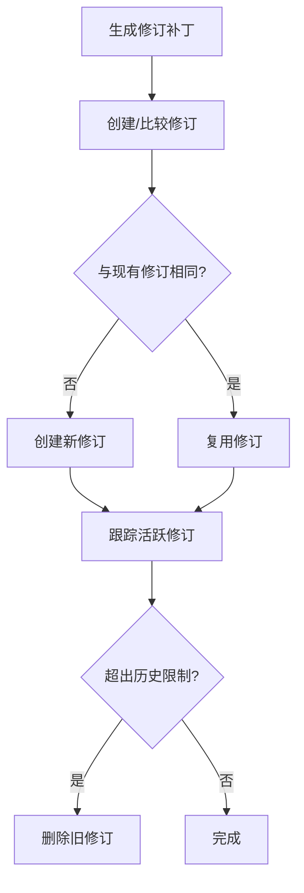
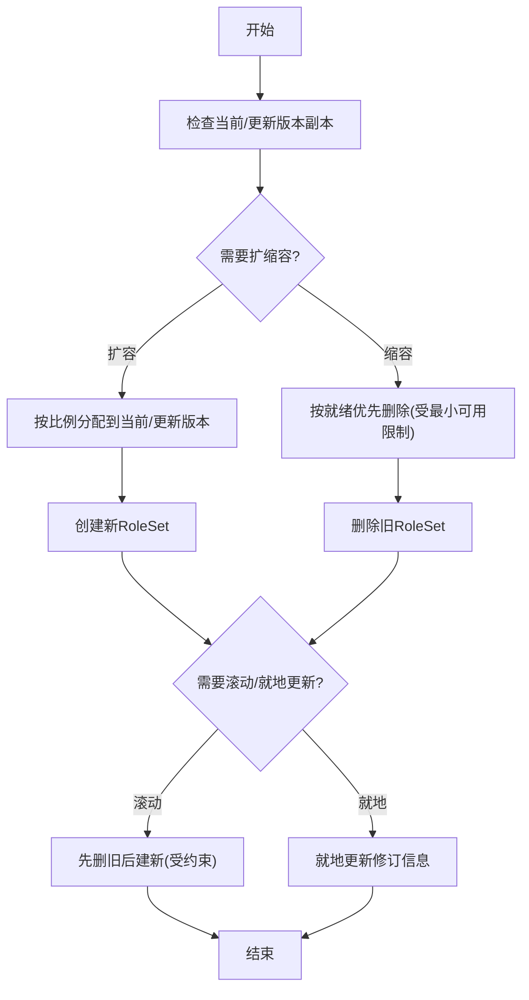
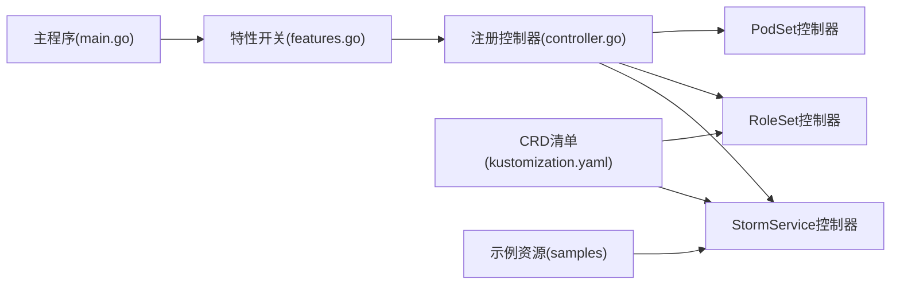

# StormService控制器

<cite>
**本文引用的文件**
- [stormservice_types.go](file://api/orchestration/v1alpha1/stormservice_types.go)
- [roleset_types.go](file://api/orchestration/v1alpha1/roleset_types.go)
- [stormservice_controller.go](file://pkg/controller/stormservice/stormservice_controller.go)
- [sync.go](file://pkg/controller/stormservice/sync.go)
- [rolesetoperations.go](file://pkg/controller/stormservice/rolesetoperations.go)
- [revision.go](file://pkg/controller/stormservice/revision.go)
- [stormservice.go](file://pkg/controller/constants/stormservice.go)
- [roleset_controller.go](file://pkg/controller/roleset/roleset_controller.go)
- [podset_controller.go](file://pkg/controller/podset/podset_controller.go)
- [main.go](file://cmd/controllers/main.go)
- [controller.go](file://pkg/controller/controller.go)
- [kustomization.yaml](file://config/crd/orchestration/kustomization.yaml)
- [orchestration_v1alpha1_stormservice.yaml](file://config/samples/orchestration_v1alpha1_stormservice.yaml)
</cite>

## 目录
1. [简介](#简介)
2. [项目结构](#项目结构)
3. [核心组件](#核心组件)
4. [架构总览](#架构总览)
5. [详细组件分析](#详细组件分析)
6. [依赖关系分析](#依赖关系分析)
7. [性能考虑](#性能考虑)
8. [故障排查指南](#故障排查指南)
9. [结论](#结论)
10. [附录](#附录)

## 简介
本文件面向AIBrix分布式推理系统的StormService控制器，提供从架构设计到实现细节的完整技术文档。StormService作为编排入口，负责将服务需求转化为可扩展的角色集合（RoleSet），并通过滚动更新、就地更新等策略实现平滑升级与扩缩容；同时与RoleSet控制器、PodSet控制器协同，确保角色实例与Pod组的正确调度与运行。本文将深入解析StormService的CRD定义、状态机与同步机制、与下游控制器的协作关系，并给出配置选项、部署策略与扩缩容流程的实际参考路径。

## 项目结构
围绕StormService控制器的关键目录与文件如下：
- API层：定义StormService与RoleSet的CRD类型
- 控制器层：StormService控制器、RoleSet控制器、PodSet控制器
- 常量与配置：控制器常量、主程序注册与启用逻辑
- 部署与示例：CRD清单、示例资源

**图表来源**
- [stormservice_types.go:24-198](file://api/orchestration/v1alpha1/stormservice_types.go#L24-L198)
- [roleset_types.go:28-251](file://api/orchestration/v1alpha1/roleset_types.go#L28-L251)
- [stormservice_controller.go:49-83](file://pkg/controller/stormservice/stormservice_controller.go#L49-L83)
- [sync.go:40-71](file://pkg/controller/stormservice/sync.go#L40-L71)
- [rolesetoperations.go:37-57](file://pkg/controller/stormservice/rolesetoperations.go#L37-L57)
- [revision.go:37-55](file://pkg/controller/stormservice/revision.go#L37-L55)
- [roleset_controller.go:54-91](file://pkg/controller/roleset/roleset_controller.go#L54-L91)
- [podset_controller.go:66-98](file://pkg/controller/podset/podset_controller.go#L66-L98)
- [main.go:322-359](file://cmd/controllers/main.go#L322-L359)
- [controller.go:88-92](file://pkg/controller/controller.go#L88-L92)
- [kustomization.yaml:1-7](file://config/crd/orchestration/kustomization.yaml#L1-L7)
- [orchestration_v1alpha1_stormservice.yaml:1-10](file://config/samples/orchestration_v1alpha1_stormservice.yaml#L1-L10)

**章节来源**
- [stormservice_types.go:24-198](file://api/orchestration/v1alpha1/stormservice_types.go#L24-L198)
- [roleset_types.go:28-251](file://api/orchestration/v1alpha1/roleset_types.go#L28-L251)
- [kustomization.yaml:1-7](file://config/crd/orchestration/kustomization.yaml#L1-L7)

## 核心组件
- StormService CRD与状态机
  - 定义期望状态（副本数、选择器、模板、更新策略、历史限制、暂停标志、中断容忍度）
  - 定义观测状态（代际版本、就绪/未就绪副本、条件、角色级聚合统计）
- StormService控制器
  - 负责Reconcile循环：修订同步、头等服务（Headless Service）同步、扩缩容、滚动/就地更新、状态上报
  - 维护Finalizer与ControllerRevision历史
- RoleSet控制器
  - 将RoleSet模板渲染为Pod集合，支持多调度后端（Godel/Volcano/Coscheduling）
  - 管理Pod组与Pod生命周期，计算并上报RoleSet状态
- PodSet控制器
  - 将RoleSet中的每个角色进一步拆分为Pod组，按策略（替换不健康/重建）维持目标规模
  - 注入内置环境变量，维护FQDN主机名与子域

**章节来源**
- [stormservice_types.go:24-134](file://api/orchestration/v1alpha1/stormservice_types.go#L24-L134)
- [stormservice_controller.go:85-97](file://pkg/controller/stormservice/stormservice_controller.go#L85-L97)
- [sync.go:40-71](file://pkg/controller/stormservice/sync.go#L40-L71)
- [roleset_controller.go:94-101](file://pkg/controller/roleset/roleset_controller.go#L94-L101)
- [podset_controller.go:101-107](file://pkg/controller/podset/podset_controller.go#L101-L107)

## 架构总览
StormService控制器通过Revision机制记录服务版本，结合RoleSet与PodSet控制器完成角色与Pod组的编排。其核心流程包括：
- 版本修订与回滚：基于ControllerRevision的创建、比较与裁剪
- 头等服务同步：确保服务发现使用ClusterIP=None的Headless Service
- 扩缩容：根据期望副本与可用性约束，按当前/更新版本比例创建或删除RoleSet
- 滚动/就地更新：在满足MaxSurge/MaxUnavailable前提下推进更新
- 状态聚合：汇总各RoleSet的就绪与更新状态，设置Ready/Progressing条件

**图表来源**
- [sync.go:40-71](file://pkg/controller/stormservice/sync.go#L40-L71)
- [revision.go:172-221](file://pkg/controller/stormservice/revision.go#L172-L221)
- [roleset_controller.go:109-167](file://pkg/controller/roleset/roleset_controller.go#L109-L167)
- [podset_controller.go:115-154](file://pkg/controller/podset/podset_controller.go#L115-L154)

## 详细组件分析

### StormService CRD与状态机
- 关键字段
  - 期望副本数、标签选择器、是否状态化、模板（RoleSet模板）、更新策略（滚动/就地）、历史限制、暂停标志、中断容忍度
  - 观测状态包含代际版本、当前/更新副本数、就绪/未就绪副本、条件、碰撞计数、缩放目标选择器、角色级聚合统计
- 状态机
  - Ready：就绪副本达到期望且所有RoleSet均处于目标修订且数量匹配
  - Progressing：仍在滚动或等待就绪
  - ReplicaFailure：创建/删除失败时置位

**图表来源**
- [stormservice_types.go:77-147](file://api/orchestration/v1alpha1/stormservice_types.go#L77-L147)
- [sync.go:353-427](file://pkg/controller/stormservice/sync.go#L353-L427)

**章节来源**
- [stormservice_types.go:24-134](file://api/orchestration/v1alpha1/stormservice_types.go#L24-L134)

### StormService控制器Reconcile流程
- 生命周期
  - 删除阶段：清理RoleSet并移除Finalizer
  - 正常阶段：同步修订、同步Headless Service、执行扩缩容与滚动/就地更新、更新状态
- 关键步骤
  - 修订同步：生成/比较/裁剪ControllerRevision，确定current/update修订
  - Headless Service：确保ClusterIP=None且发布未就绪地址
  - 扩缩容：根据MaxSurge/MaxUnavailable与最小可用性约束，按比例创建/删除RoleSet
  - 滚动/就地更新：先删旧再建新（滚动），或直接更新（就地）
  - 状态更新：计算Ready/Progressing条件、聚合角色级统计

**图表来源**
- [stormservice_controller.go:99-148](file://pkg/controller/stormservice/stormservice_controller.go#L99-L148)
- [sync.go:40-71](file://pkg/controller/stormservice/sync.go#L40-L71)

**章节来源**
- [stormservice_controller.go:99-148](file://pkg/controller/stormservice/stormservice_controller.go#L99-L148)
- [sync.go:40-71](file://pkg/controller/stormservice/sync.go#L40-L71)

### RoleSet与PodSet协作
- RoleSet控制器
  - 渲染RoleSet模板，注入修订信息与索引
  - 管理PodGroup（多调度后端）与Pod集合
  - 计算并上报RoleSet状态（就绪/未就绪/更新）
- PodSet控制器
  - 将角色拆分为Pod组，按策略维持目标规模
  - 注入内置环境变量，设置FQDN主机名与子域
  - 支持替换不健康/重建策略

**图表来源**
- [roleset_controller.go:109-167](file://pkg/controller/roleset/roleset_controller.go#L109-L167)
- [podset_controller.go:157-216](file://pkg/controller/podset/podset_controller.go#L157-L216)
- [podset_controller.go:218-353](file://pkg/controller/podset/podset_controller.go#L218-L353)

**章节来源**
- [roleset_controller.go:109-167](file://pkg/controller/roleset/roleset_controller.go#L109-L167)
- [podset_controller.go:157-216](file://pkg/controller/podset/podset_controller.go#L157-L216)
- [podset_controller.go:218-353](file://pkg/controller/podset/podset_controller.go#L218-L353)

### 版本修订与历史裁剪
- 修订生成：对模板进行补丁序列化，生成ControllerRevision
- 修订比较：若与现有修订相同则复用，否则创建新修订
- 历史裁剪：保留当前/更新/活跃RoleSet所使用的修订，超过历史限制则删除旧修订

**图表来源**
- [revision.go:71-111](file://pkg/controller/stormservice/revision.go#L71-L111)
- [revision.go:172-221](file://pkg/controller/stormservice/revision.go#L172-L221)
- [revision.go:242-282](file://pkg/controller/stormservice/revision.go#L242-L282)

**章节来源**
- [revision.go:71-111](file://pkg/controller/stormservice/revision.go#L71-L111)
- [revision.go:172-221](file://pkg/controller/stormservice/revision.go#L172-L221)
- [revision.go:242-282](file://pkg/controller/stormservice/revision.go#L242-L282)

### 扩缩容与更新策略
- 扩缩容
  - 比例分配：根据当前/更新版本的已存在副本，按比例创建/删除
  - 可用性约束：遵循最小可用与最大Surge限制
- 滚动更新
  - 先删旧后建新，受MaxUnavailable与MaxSurge约束
- 就地更新
  - 在池化模式下，直接向所有旧RoleSet注入修订信息

**图表来源**
- [sync.go:138-259](file://pkg/controller/stormservice/sync.go#L138-L259)
- [sync.go:288-351](file://pkg/controller/stormservice/sync.go#L288-L351)

**章节来源**
- [sync.go:138-259](file://pkg/controller/stormservice/sync.go#L138-L259)
- [sync.go:288-351](file://pkg/controller/stormservice/sync.go#L288-L351)

## 依赖关系分析
- 控制器注册
  - 主程序通过特性开关启用StormService控制器，并在Manager中注册
  - 控制器注册顺序：RoleSet → StormService → PodSet
- CRD与示例
  - orchestration CRD清单包含StormService与RoleSet
  - 示例资源提供最小化StormService样例

**图表来源**
- [main.go:322-359](file://cmd/controllers/main.go#L322-L359)
- [controller.go:88-92](file://pkg/controller/controller.go#L88-L92)
- [kustomization.yaml:1-7](file://config/crd/orchestration/kustomization.yaml#L1-L7)
- [orchestration_v1alpha1_stormservice.yaml:1-10](file://config/samples/orchestration_v1alpha1_stormservice.yaml#L1-L10)

**章节来源**
- [main.go:322-359](file://cmd/controllers/main.go#L322-L359)
- [controller.go:88-92](file://pkg/controller/controller.go#L88-L92)
- [kustomization.yaml:1-7](file://config/crd/orchestration/kustomization.yaml#L1-L7)

## 性能考虑
- 批量操作
  - RoleSet创建/更新采用SlowStart批处理，降低瞬时压力
- 事件与重试
  - 失败时记录事件并以固定间隔重试，避免频繁轮询
- 状态聚合
  - 仅在状态变化时更新，减少写放大
- 调度策略
  - RoleSet/PodSet支持多种调度后端，按需选择以平衡资源利用率与一致性

[本节为通用指导，无需特定文件引用]

## 故障排查指南
- 常见问题定位
  - ReplicaFailure条件：查看控制器事件与日志，确认RoleSet/Pod创建/删除错误
  - 扩缩容停滞：检查MaxSurge/MaxUnavailable与最小可用性是否导致无法继续
  - 升级卡住：确认修订历史是否过多导致裁剪失败
- 排查步骤
  - 查看StormService状态与条件
  - 检查关联RoleSet/PodSet数量与状态
  - 关注控制器事件（Headless Service创建/更新、扩缩容、更新事件）

**章节来源**
- [sync.go:353-427](file://pkg/controller/stormservice/sync.go#L353-L427)
- [roleset_controller.go:109-167](file://pkg/controller/roleset/roleset_controller.go#L109-L167)
- [podset_controller.go:115-154](file://pkg/controller/podset/podset_controller.go#L115-L154)

## 结论
StormService控制器通过Revision机制与RoleSet/PodSet协同，实现了对分布式推理服务的统一编排与治理。其状态机清晰、同步机制稳健、扩展性强，适用于大规模推理集群的弹性扩缩容与平滑升级场景。配合多调度后端与完善的事件/状态反馈，能够有效提升系统可靠性与运维效率。

[本节为总结性内容，无需特定文件引用]

## 附录

### 配置选项与部署策略
- 启用控制器
  - 通过命令行参数控制控制器启停，支持通配符与显式开关
- CRD安装
  - 使用orchestration kustomization安装StormService与RoleSet等CRD
- 示例资源
  - 使用示例YAML快速创建最小化StormService

**章节来源**
- [main.go:151-157](file://cmd/controllers/main.go#L151-L157)
- [kustomization.yaml:1-7](file://config/crd/orchestration/kustomization.yaml#L1-L7)
- [orchestration_v1alpha1_stormservice.yaml:1-10](file://config/samples/orchestration_v1alpha1_stormservice.yaml#L1-L10)

### 实际操作参考路径
- 创建与管理StormService
  - 参考示例资源路径：[示例资源:1-10](file://config/samples/orchestration_v1alpha1_stormservice.yaml#L1-L10)
- 处理服务升级
  - 修改模板字段后，控制器自动创建新修订并推进滚动/就地更新
  - 参考修订同步逻辑：[修订同步:172-221](file://pkg/controller/stormservice/revision.go#L172-L221)
- 监控服务状态
  - 通过kubectl查看StormService状态与条件
  - 参考状态更新逻辑：[状态更新:353-427](file://pkg/controller/stormservice/sync.go#L353-L427)

**章节来源**
- [orchestration_v1alpha1_stormservice.yaml:1-10](file://config/samples/orchestration_v1alpha1_stormservice.yaml#L1-L10)
- [revision.go:172-221](file://pkg/controller/stormservice/revision.go#L172-L221)
- [sync.go:353-427](file://pkg/controller/stormservice/sync.go#L353-L427)