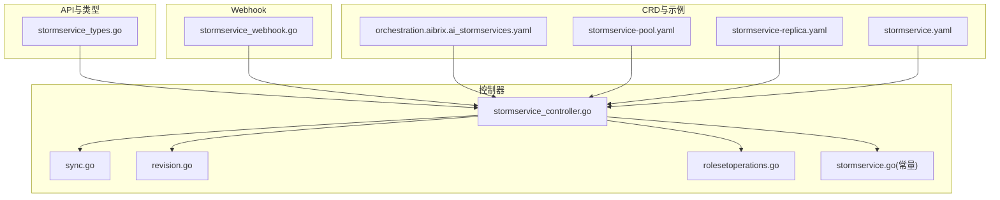
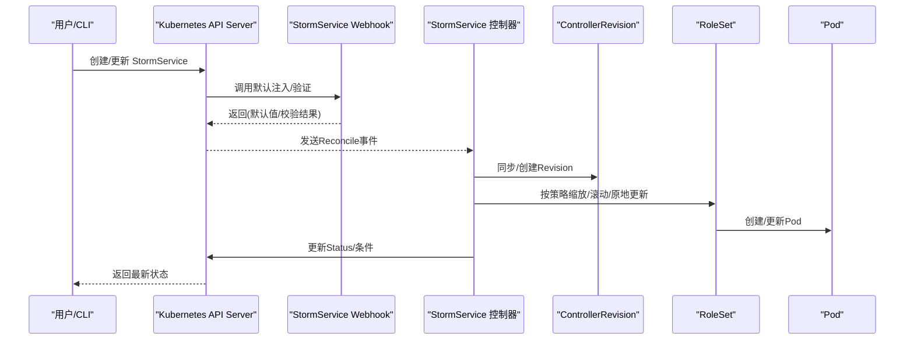
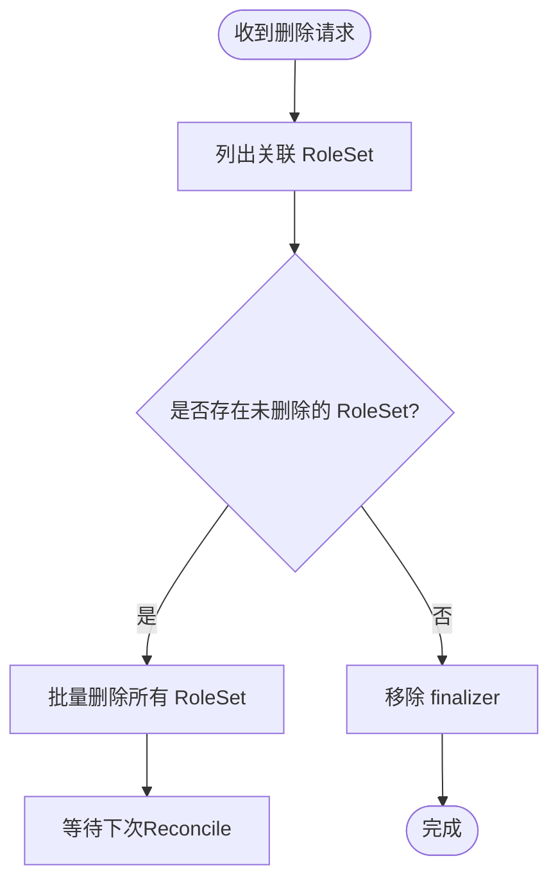
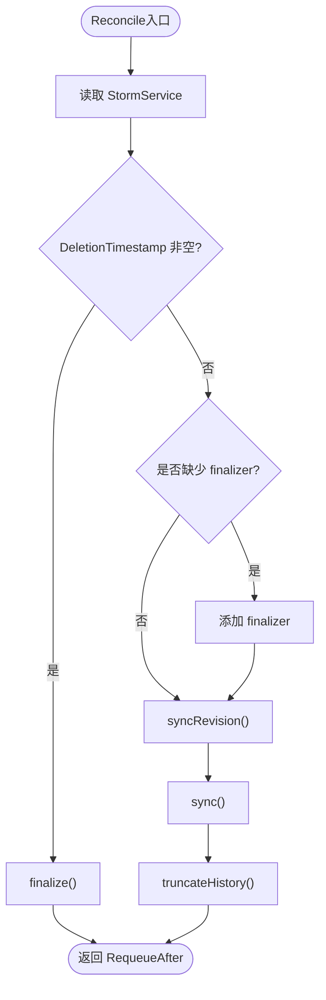
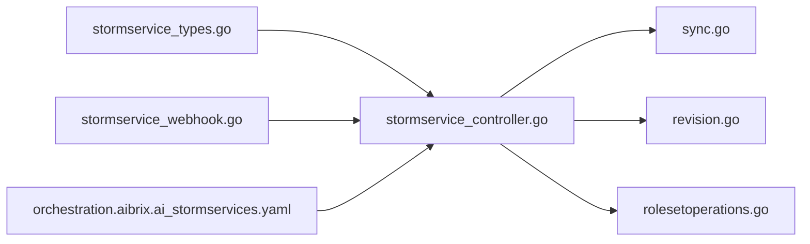

# StormService资源管理

<cite>
**本文引用的文件**
- [stormservice_types.go](file://api/orchestration/v1alpha1/stormservice_types.go)
- [stormservice_controller.go](file://pkg/controller/stormservice/stormservice_controller.go)
- [sync.go](file://pkg/controller/stormservice/sync.go)
- [revision.go](file://pkg/controller/stormservice/revision.go)
- [rolesetoperations.go](file://pkg/controller/stormservice/rolesetoperations.go)
- [stormservice_webhook.go](file://pkg/webhook/stormservice_webhook.go)
- [stormservice.go](file://pkg/controller/constants/stormservice.go)
- [orchestration.aibrix.ai_stormservices.yaml](file://config/crd/orchestration/orchestration.aibrix.ai_stormservices.yaml)
- [stormservice-pool.yaml](file://samples/autoscaling/stormservice-pool.yaml)
- [stormservice-replica.yaml](file://samples/autoscaling/stormservice-replica.yaml)
- [stormservice.yaml](file://config/samples/orchestration_v1alpha1_stormservice.yaml)
</cite>

## 目录
1. [简介](#简介)
2. [项目结构](#项目结构)
3. [核心组件](#核心组件)
4. [架构总览](#架构总览)
5. [详细组件分析](#详细组件分析)
6. [依赖分析](#依赖分析)
7. [性能考虑](#性能考虑)
8. [故障排查指南](#故障排查指南)
9. [结论](#结论)
10. [附录](#附录)

## 简介
本文件面向AIBrix中StormService资源的使用者与维护者，系统化阐述StormService CRD的定义与设计理念、生命周期管理（含finalizer与资源清理）、控制器Reconcile工作流、状态同步与错误处理策略，并提供YAML配置示例与最佳实践，帮助读者在Kubernetes上高效编排推理服务。

## 项目结构
围绕StormService的关键代码分布在以下模块：
- CRD与类型定义：api/orchestration/v1alpha1/stormservice_types.go
- 控制器实现：pkg/controller/stormservice/*.go
- Webhook：pkg/webhook/stormservice_webhook.go
- CRD清单：config/crd/orchestration/orchestration.aibrix.ai_stormservices.yaml
- 示例与样例：samples/autoscaling/* 与 config/samples/*

**图表来源**
- [stormservice_types.go:24-134](file://api/orchestration/v1alpha1/stormservice_types.go#L24-L134)
- [stormservice_controller.go:85-149](file://pkg/controller/stormservice/stormservice_controller.go#L85-L149)
- [sync.go:40-71](file://pkg/controller/stormservice/sync.go#L40-L71)
- [revision.go:172-221](file://pkg/controller/stormservice/revision.go#L172-L221)
- [rolesetoperations.go:37-108](file://pkg/controller/stormservice/rolesetoperations.go#L37-L108)
- [stormservice_webhook.go:34-40](file://pkg/webhook/stormservice_webhook.go#L34-L40)
- [orchestration.aibrix.ai_stormservices.yaml:1-80](file://config/crd/orchestration/orchestration.aibrix.ai_stormservices.yaml#L1-L80)
- [stormservice-pool.yaml:75-121](file://samples/autoscaling/stormservice-pool.yaml#L75-L121)
- [stormservice-replica.yaml:39-85](file://samples/autoscaling/stormservice-replica.yaml#L39-L85)
- [stormservice.yaml:1-10](file://config/samples/orchestration_v1alpha1_stormservice.yaml#L1-L10)

**章节来源**
- [stormservice_types.go:24-134](file://api/orchestration/v1alpha1/stormservice_types.go#L24-L134)
- [stormservice_controller.go:49-73](file://pkg/controller/stormservice/stormservice_controller.go#L49-L73)
- [orchestration.aibrix.ai_stormservices.yaml:1-80](file://config/crd/orchestration/orchestration.aibrix.ai_stormservices.yaml#L1-L80)

## 核心组件
- StormService CRD与状态模型
  - Spec：副本数、选择器、是否Stateful、模板、更新策略、历史保留、暂停标志、中断容忍度等
  - Status：观察到的Generation、副本总数、就绪/非就绪副本、当前/更新Revision、条件、碰撞计数、缩放目标选择器、按角色聚合的状态等
- 控制器Reconcile
  - 负责读取对象、添加finalizer、同步ControllerRevision、执行缩放与滚动/原地更新、更新状态、裁剪历史
- Webhook
  - 默认注入与校验（名称长度、PodSet命名风险等）
- 常量与标签键
  - 定义了与StormService、RoleSet、Role、PodSet相关的标签与注解键，用于跨组件协同

**章节来源**
- [stormservice_types.go:24-134](file://api/orchestration/v1alpha1/stormservice_types.go#L24-L134)
- [stormservice_controller.go:85-149](file://pkg/controller/stormservice/stormservice_controller.go#L85-L149)
- [stormservice_webhook.go:34-40](file://pkg/webhook/stormservice_webhook.go#L34-L40)
- [stormservice.go:19-55](file://pkg/controller/constants/stormservice.go#L19-L55)

## 架构总览
StormService控制器通过Reconcile循环驱动，结合ControllerRevision实现可回溯的版本化控制；通过RoleSet抽象承载具体角色实例，支持池化与副本两种模式；Webhook负责默认注入与基础校验；CRD定义了完整的OpenAPI Schema以约束输入。

**图表来源**
- [stormservice_controller.go:99-148](file://pkg/controller/stormservice/stormservice_controller.go#L99-L148)
- [sync.go:40-71](file://pkg/controller/stormservice/sync.go#L40-L71)
- [revision.go:172-221](file://pkg/controller/stormservice/revision.go#L172-L221)
- [rolesetoperations.go:111-127](file://pkg/controller/stormservice/rolesetoperations.go#L111-L127)
- [stormservice_webhook.go:49-70](file://pkg/webhook/stormservice_webhook.go#L49-L70)

## 详细组件分析

### StormService CRD与字段语义
- Spec关键字段
  - replicas：期望RoleSet数量（池化或副本模式）
  - selector：匹配RoleSet的选择器
  - stateful：是否Stateful
  - template：RoleSet模板（含元数据与RoleSetSpec）
  - updateStrategy：滚动/原地更新策略及并发参数
  - revisionHistoryLimit：历史Revision上限
  - paused：暂停标志
  - disruptionTolerance：预emption/驱逐场景下的可用性容忍
- Status关键字段
  - 观测Generation、副本数、就绪/非就绪副本
  - currentRevision/updateRevision、UpdatedReadyReplicas
  - conditions：Ready/Progressing/ReplicaFailure
  - roleStatuses：按角色聚合的Pod级统计（池化/副本均支持）

设计要点
- 通过ControllerRevision实现“可回溯”的变更记录，便于回滚与审计
- Status中同时提供RoleSet级与Pod级聚合指标，便于不同模式下观测
- updateStrategy支持RollingUpdate与InPlaceUpdate，配合maxSurge/maxUnavailable保障变更过程中的可用性

**章节来源**
- [stormservice_types.go:24-134](file://api/orchestration/v1alpha1/stormservice_types.go#L24-L134)
- [orchestration.aibrix.ai_stormservices.yaml:44-120](file://config/crd/orchestration/orchestration.aibrix.ai_stormservices.yaml#L44-L120)

### 生命周期管理与Finalizer机制
- 删除阶段
  - 若存在未完成的RoleSet，控制器先删除它们，直到清空后移除finalizer
  - 清理失败时以固定重试间隔回退，避免无限循环
- 创建阶段
  - 若对象存在但缺少finalizer，控制器为其追加，确保删除路径安全

**图表来源**
- [sync.go:429-449](file://pkg/controller/stormservice/sync.go#L429-L449)

**章节来源**
- [stormservice_controller.go:111-124](file://pkg/controller/stormservice/stormservice_controller.go#L111-L124)
- [sync.go:429-449](file://pkg/controller/stormservice/sync.go#L429-L449)

### 控制器Reconcile工作流
- 主流程
  - 读取对象，若处于删除期则进入finalize
  - 不存在finalizer则添加
  - 同步ControllerRevision（生成/复用/回滚）
  - 执行sync（headless Service、缩放、滚动/原地更新、状态更新）
  - 裁剪历史
- 关键子流程
  - headless Service：确保ClusterIP None的服务存在且选择器指向同名StormService
  - 缩放：根据replicas与maxSurge/maxUnavailable计算增删数量，区分池化/副本模式与暂停/运行态
  - 滚动/原地更新：按策略删除旧RoleSet并创建新RoleSet，或直接更新现有RoleSet
  - 状态更新：计算就绪/非就绪副本、设置Ready/Progressing条件、聚合角色级状态

**图表来源**
- [stormservice_controller.go:99-148](file://pkg/controller/stormservice/stormservice_controller.go#L99-L148)
- [sync.go:40-71](file://pkg/controller/stormservice/sync.go#L40-L71)
- [revision.go:172-221](file://pkg/controller/stormservice/revision.go#L172-L221)

**章节来源**
- [stormservice_controller.go:99-148](file://pkg/controller/stormservice/stormservice_controller.go#L99-L148)
- [sync.go:40-71](file://pkg/controller/stormservice/sync.go#L40-L71)
- [revision.go:172-221](file://pkg/controller/stormservice/revision.go#L172-L221)

### 状态同步机制与条件
- 条件类型
  - Ready：就绪条件
  - Progressing：进行中条件
  - ReplicaFailure：副本失败条件
- 状态计算规则
  - Ready：就绪副本≥期望副本，且更新Revision完全就绪
  - Progressing：否则
  - CollisionCount：用于Revision命名冲突规避
  - ScalingTargetSelector：用于Scale子资源选择器

**章节来源**
- [stormservice_types.go:136-147](file://api/orchestration/v1alpha1/stormservice_types.go#L136-L147)
- [sync.go:353-427](file://pkg/controller/stormservice/sync.go#L353-L427)

### 错误处理策略
- 组件内重试与幂等
  - Revision创建采用哈希冲突重试与存在即返回
  - RoleSet批量创建/删除使用SlowStart批处理，提升稳定性
- 外部错误传播
  - 缩放/滚动/状态更新失败时记录Event并返回错误，由Reconcile层决定重试
- 回退策略
  - 当发现等价Revision时，优先复用而非重复创建，必要时回滚至等价Revision

**章节来源**
- [revision.go:119-149](file://pkg/controller/stormservice/revision.go#L119-L149)
- [rolesetoperations.go:123-139](file://pkg/controller/stormservice/rolesetoperations.go#L123-L139)

### Webhook：默认注入与校验
- 默认注入
  - 在启用侧车注入注解时，为每个Role的容器模板注入aibrix-runtime侧车容器，并共享EmptyDir卷
- 校验
  - 名称长度限制（≤63字符）
  - 对于启用PodSet的角色，估算最终Pod名称长度，避免超过63字符

**章节来源**
- [stormservice_webhook.go:49-70](file://pkg/webhook/stormservice_webhook.go#L49-L70)
- [stormservice_webhook.go:168-205](file://pkg/webhook/stormservice_webhook.go#L168-L205)

### 实际使用与最佳实践
- 池化模式（replicas=1）与副本模式（replicas>1）
  - 池化：适合多角色共享资源的场景，通过InPlaceUpdate策略进行原地升级
  - 副本：适合多RoleSet并行扩展的场景，通过RollingUpdate策略滚动升级
- 更新策略
  - maxSurge与maxUnavailable共同约束变更过程中的可用性
  - 暂停（paused）可配合历史回滚与手动缩放
- 自动扩缩容集成
  - 结合PodAutoscaler对不同角色独立扩缩容，分别针对prefill/decode等角色
- 示例参考
  - 池化模式示例：samples/autoscaling/stormservice-pool.yaml
  - 副本模式示例：samples/autoscaling/stormservice-replica.yaml
  - 最小样例：config/samples/orchestration_v1alpha1_stormservice.yaml

**章节来源**
- [stormservice-pool.yaml:75-121](file://samples/autoscaling/stormservice-pool.yaml#L75-L121)
- [stormservice-replica.yaml:39-85](file://samples/autoscaling/stormservice-replica.yaml#L39-L85)
- [stormservice.yaml:1-10](file://config/samples/orchestration_v1alpha1_stormservice.yaml#L1-L10)

## 依赖分析
- 控制器对CRD与类型强耦合：Reconcile依赖Spec/Status结构与CRD Schema
- 控制器对RoleSet的依赖：通过Selector定位并操作RoleSet
- 控制器对Revision的依赖：版本化与回滚
- Webhook对控制器的弱耦合：仅在创建/更新时介入

**图表来源**
- [stormservice_types.go:24-134](file://api/orchestration/v1alpha1/stormservice_types.go#L24-L134)
- [stormservice_controller.go:85-149](file://pkg/controller/stormservice/stormservice_controller.go#L85-L149)
- [sync.go:40-71](file://pkg/controller/stormservice/sync.go#L40-L71)
- [revision.go:172-221](file://pkg/controller/stormservice/revision.go#L172-L221)
- [rolesetoperations.go:37-108](file://pkg/controller/stormservice/rolesetoperations.go#L37-L108)
- [stormservice_webhook.go:34-40](file://pkg/webhook/stormservice_webhook.go#L34-L40)
- [orchestration.aibrix.ai_stormservices.yaml:1-80](file://config/crd/orchestration/orchestration.aibrix.ai_stormservices.yaml#L1-L80)

**章节来源**
- [stormservice_controller.go:49-73](file://pkg/controller/stormservice/stormservice_controller.go#L49-L73)
- [rolesetoperations.go:37-57](file://pkg/controller/stormservice/rolesetoperations.go#L37-L57)

## 性能考虑
- 批处理与慢启动
  - RoleSet批量创建/删除采用SlowStart批处理，降低瞬时压力
- Revision命名冲突
  - 通过collisionCount与哈希重试，避免命名冲突导致的反复失败
- 状态更新去抖
  - 仅在状态发生语义变化时才写回，减少不必要的API调用

[本节为通用指导，无需特定文件引用]

## 故障排查指南
- 删除卡住
  - 检查是否存在未删除的RoleSet；查看控制器日志确认删除批次与错误
  - 确认finalizer已移除
- 更新不生效
  - 检查updateStrategy与maxSurge/maxUnavailable是否合理
  - 查看条件是否为ReplicaFailure，关注Event与错误信息
- 名称过长导致PodSet失败
  - 参考Webhook校验逻辑，缩短StormService名称或最长PodSet启用角色名
- 状态不一致
  - 关注Ready/Progressing条件与roleStatuses聚合指标，核对期望副本与就绪副本

**章节来源**
- [sync.go:353-427](file://pkg/controller/stormservice/sync.go#L353-L427)
- [stormservice_webhook.go:168-205](file://pkg/webhook/stormservice_webhook.go#L168-L205)

## 结论
StormService通过版本化的ControllerRevision、灵活的缩放与更新策略、完善的Webhook与状态模型，提供了在Kubernetes上编排复杂推理服务的能力。遵循本文的配置与最佳实践，可在保证高可用的前提下实现平滑演进与弹性伸缩。

[本节为总结性内容，无需特定文件引用]

## 附录

### StormService CRD字段速查
- Spec
  - replicas：期望副本数
  - selector：RoleSet选择器
  - stateful：是否Stateful
  - template：RoleSet模板
  - updateStrategy：RollingUpdate/InPlaceUpdate及其并发参数
  - revisionHistoryLimit：历史Revision上限
  - paused：暂停标志
  - disruptionTolerance：最大不可用
- Status
  - observedGeneration、replicas、readyReplicas、notReadyReplicas
  - currentRevision、updateRevision、updatedReadyReplicas
  - conditions：Ready/Progressing/ReplicaFailure
  - roleStatuses：按角色聚合的Pod级统计
  - scalingTargetSelector：缩放子资源选择器

**章节来源**
- [stormservice_types.go:24-134](file://api/orchestration/v1alpha1/stormservice_types.go#L24-L134)
- [orchestration.aibrix.ai_stormservices.yaml:44-120](file://config/crd/orchestration/orchestration.aibrix.ai_stormservices.yaml#L44-L120)

### 示例与参考
- 池化模式（InPlaceUpdate）
  - [stormservice-pool.yaml:75-121](file://samples/autoscaling/stormservice-pool.yaml#L75-L121)
- 副本模式（RollingUpdate）
  - [stormservice-replica.yaml:39-85](file://samples/autoscaling/stormservice-replica.yaml#L39-L85)
- 最小样例
  - [stormservice.yaml:1-10](file://config/samples/orchestration_v1alpha1_stormservice.yaml#L1-L10)

**章节来源**
- [stormservice-pool.yaml:75-121](file://samples/autoscaling/stormservice-pool.yaml#L75-L121)
- [stormservice-replica.yaml:39-85](file://samples/autoscaling/stormservice-replica.yaml#L39-L85)
- [stormservice.yaml:1-10](file://config/samples/orchestration_v1alpha1_stormservice.yaml#L1-L10)