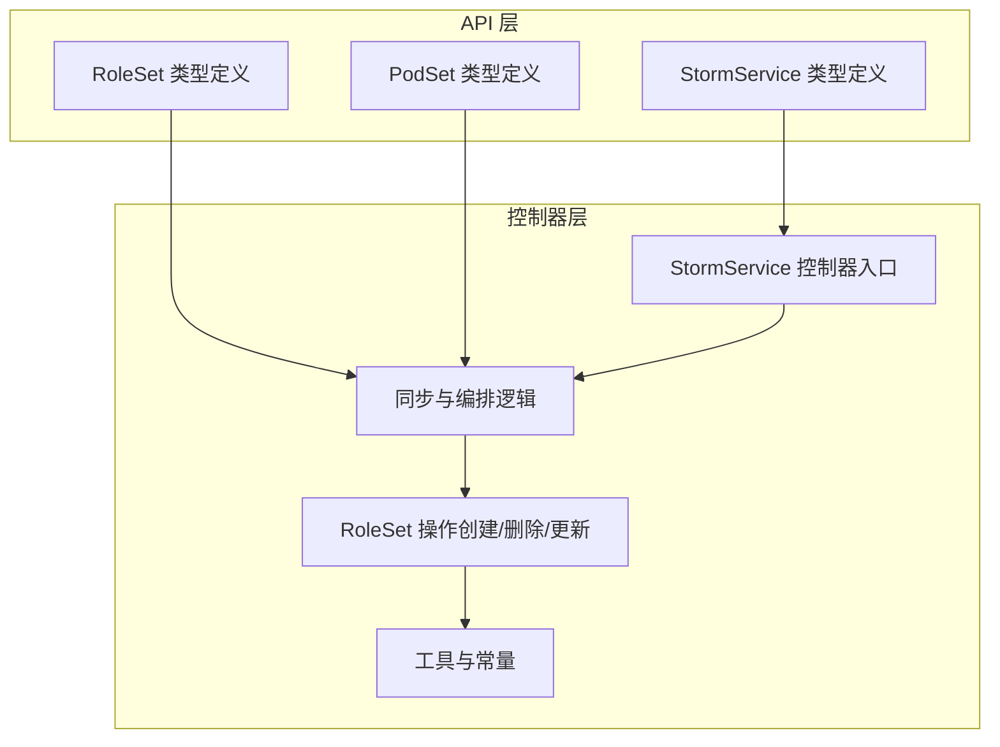
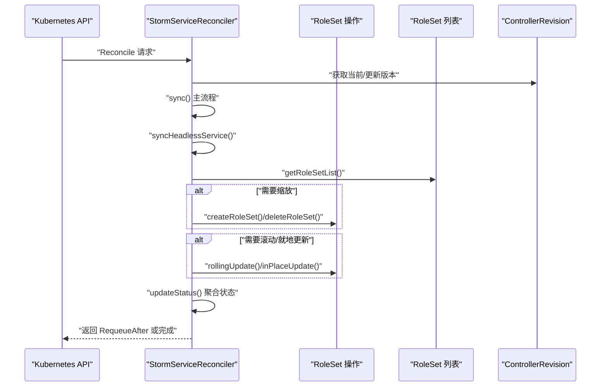
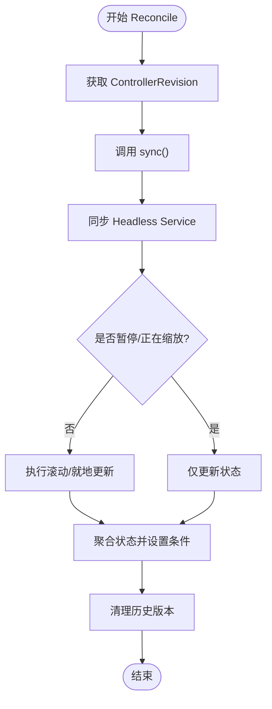
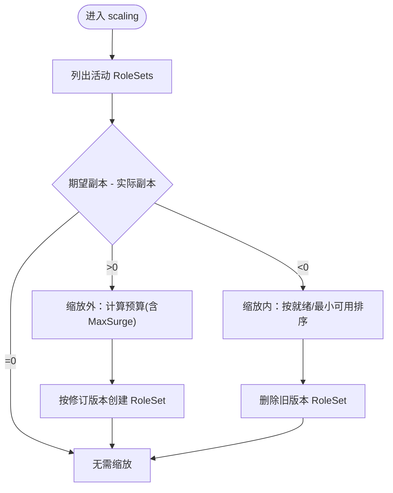
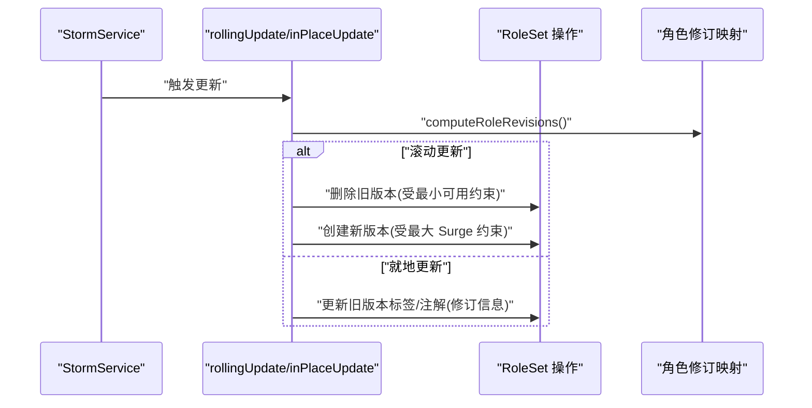
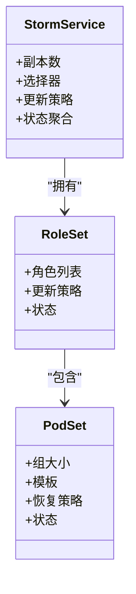
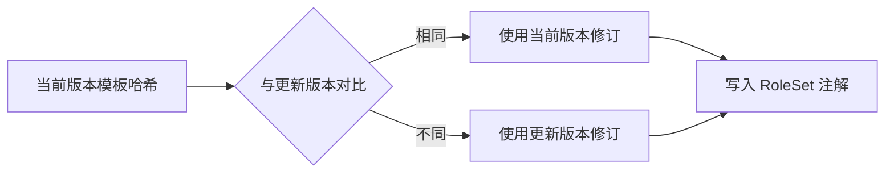
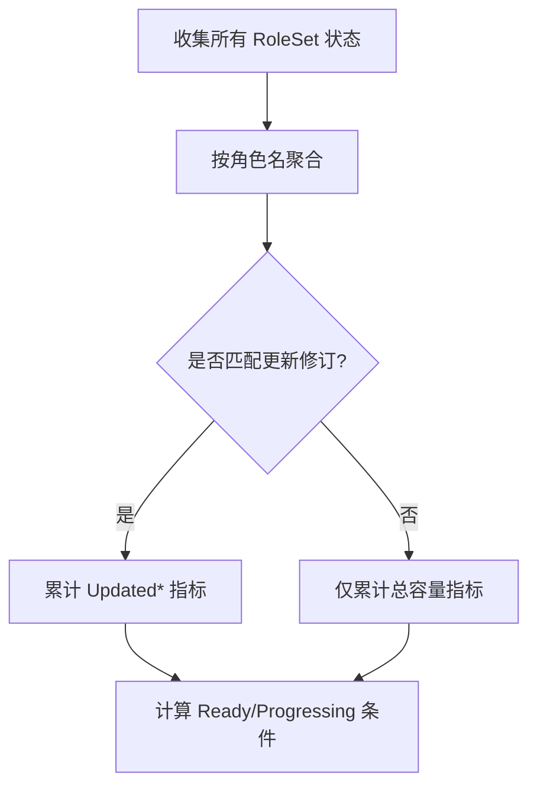
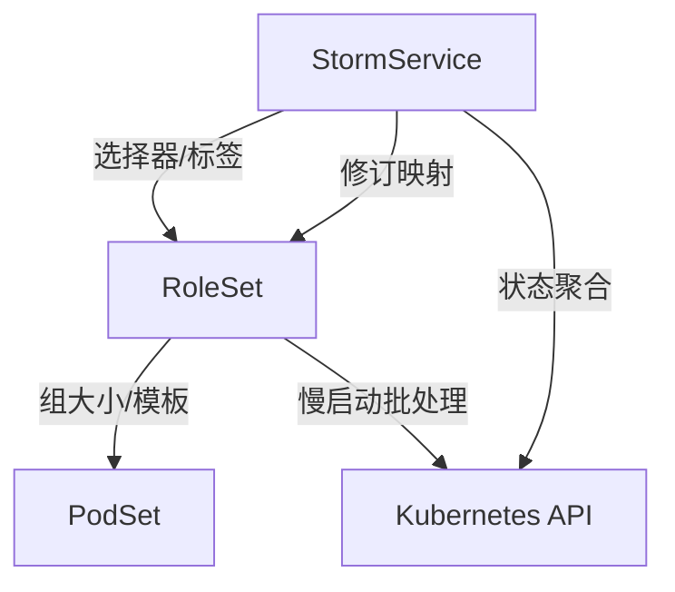

# 服务编排协调

<cite>
**本文引用的文件**
- [stormservice_types.go](file://api/orchestration/v1alpha1/stormservice_types.go)
- [roleset_types.go](file://api/orchestration/v1alpha1/roleset_types.go)
- [podset_types.go](file://api/orchestration/v1alpha1/podset_types.go)
- [stormservice_controller.go](file://pkg/controller/stormservice/stormservice_controller.go)
- [sync.go](file://pkg/controller/stormservice/sync.go)
- [rolesetoperations.go](file://pkg/controller/stormservice/rolesetoperations.go)
- [utils.go](file://pkg/controller/stormservice/utils.go)
- [stormservice.go](file://pkg/controller/constants/stormservice.go)
- [util.go](file://pkg/controller/util/orchestration/util.go)
</cite>

## 目录
1. [引言](#引言)
2. [项目结构](#项目结构)
3. [核心组件](#核心组件)
4. [架构总览](#架构总览)
5. [详细组件分析](#详细组件分析)
6. [依赖分析](#依赖分析)
7. [性能考虑](#性能考虑)
8. [故障排查指南](#故障排查指南)
9. [结论](#结论)
10. [附录](#附录)

## 引言
本技术文档围绕 AIBrix 的服务编排协调机制展开，重点解析 StormService 控制器如何协调多个子组件（RoleSet、PodSet 等）完成复杂的服务编排任务。内容涵盖：
- RoleSet 与 PodSet 的同步机制与状态一致性保障
- 变更传播流程与版本控制（ControllerRevision）
- 资源调度策略、负载分配与故障转移机制
- 冲突解决、死锁避免与幂等性保证
- 最佳实践、性能优化与监控观测建议
- 复杂场景的实现与调试方法

## 项目结构
AIBrix 将编排能力以自定义资源（CRD）与控制器为核心，StormService 作为顶层编排对象，通过 RoleSet 与 PodSet 实现细粒度的实例化与运行时管理。控制器层位于 pkg/controller/stormservice，API 定义位于 api/orchestration/v1alpha1。

图表来源
- [stormservice_controller.go:51-83](file://pkg/controller/stormservice/stormservice_controller.go#L51-L83)
- [sync.go:40-71](file://pkg/controller/stormservice/sync.go#L40-L71)
- [rolesetoperations.go:37-57](file://pkg/controller/stormservice/rolesetoperations.go#L37-L57)
- [stormservice_types.go:24-60](file://api/orchestration/v1alpha1/stormservice_types.go#L24-L60)
- [roleset_types.go:28-39](file://api/orchestration/v1alpha1/roleset_types.go#L28-L39)
- [podset_types.go:24-47](file://api/orchestration/v1alpha1/podset_types.go#L24-L47)

章节来源
- [stormservice_controller.go:51-83](file://pkg/controller/stormservice/stormservice_controller.go#L51-L83)
- [sync.go:40-71](file://pkg/controller/stormservice/sync.go#L40-L71)
- [rolesetoperations.go:37-57](file://pkg/controller/stormservice/rolesetoperations.go#L37-L57)
- [stormservice_types.go:24-60](file://api/orchestration/v1alpha1/stormservice_types.go#L24-L60)
- [roleset_types.go:28-39](file://api/orchestration/v1alpha1/roleset_types.go#L28-L39)
- [podset_types.go:24-47](file://api/orchestration/v1alpha1/podset_types.go#L24-L47)

## 核心组件
- StormService：顶层编排对象，定义副本数、选择器、更新策略、中断容忍度、暂停标志等；维护当前/更新版本信息与聚合状态。
- RoleSet：承载具体角色（Role）集合与调度策略，支持并行/顺序/交错更新策略；可内嵌 PodSet 以形成多节点推理组。
- PodSet：原子化的 Pod 组，定义组大小、模板、恢复策略与调度策略；用于多 Pod 协作场景。
- 控制器（StormServiceReconciler）：负责 Revision 管理、Headless Service 同步、缩放（Scaling）、滚动/就地更新（Rollout）、状态聚合与回滚历史清理。

章节来源
- [stormservice_types.go:24-60](file://api/orchestration/v1alpha1/stormservice_types.go#L24-L60)
- [roleset_types.go:28-39](file://api/orchestration/v1alpha1/roleset_types.go#L28-L39)
- [podset_types.go:24-47](file://api/orchestration/v1alpha1/podset_types.go#L24-L47)
- [stormservice_controller.go:85-90](file://pkg/controller/stormservice/stormservice_controller.go#L85-L90)

## 架构总览
StormService 控制器采用“先同步 Headless Service，再执行缩放与滚动/就地更新，最后聚合状态”的主流程。通过 ControllerRevision 对比角色模板哈希，决定每个角色使用当前或更新版本，确保变更按角色粒度传播且可回滚。

图表来源
- [sync.go:40-71](file://pkg/controller/stormservice/sync.go#L40-L71)
- [rolesetoperations.go:110-139](file://pkg/controller/stormservice/rolesetoperations.go#L110-L139)
- [stormservice_controller.go:99-148](file://pkg/controller/stormservice/stormservice_controller.go#L99-L148)

## 详细组件分析

### StormService 控制器与主流程
- 入口与生命周期：控制器注册为 StormService 的所有者，负责添加/移除终结器、处理删除流程。
- 主流程（sync）：先同步 Headless Service，再根据是否暂停与是否处于缩放中决定是否执行滚动/就地更新；最后聚合状态并设置条件。
- 回滚历史：基于 RevisionHistoryLimit 清理旧版本。

图表来源
- [stormservice_controller.go:99-148](file://pkg/controller/stormservice/stormservice_controller.go#L99-L148)
- [sync.go:40-71](file://pkg/controller/stormservice/sync.go#L40-L71)

章节来源
- [stormservice_controller.go:99-148](file://pkg/controller/stormservice/stormservice_controller.go#L99-L148)
- [sync.go:40-71](file://pkg/controller/stormservice/sync.go#L40-L71)

### 缩放（Scaling）与副本分配
- 目标：使活动 RoleSet 数量与期望副本一致，并满足最小可用与最大 Surge 约束。
- 场景区分：
  - 单版本：优先创建/删除更新版本，受 MaxSurge/MinAvailable 限制。
  - 双版本（滚动中）：在暂停时按比例缩放当前/更新版本；进行中时优先删除旧版本并创建新版本。
- 比例分配：当目标副本与当前分布不一致时，按当前/更新版本的比例计算应创建/删除数量，避免舍入误差导致总数偏差。

图表来源
- [sync.go:138-259](file://pkg/controller/stormservice/sync.go#L138-L259)

章节来源
- [sync.go:138-259](file://pkg/controller/stormservice/sync.go#L138-L259)

### 滚动更新与就地更新
- 滚动更新（RollingUpdate）：先按最小可用约束删除旧版本，再按最大 Surge 创建新版本，循环直到新版本达到期望数量。
- 就地更新（InPlaceUpdate）：直接将更新版本的修订信息注入到所有旧版本 RoleSet，由下层控制器触发就地变更。
- 角色级修订映射：通过比较角色模板哈希，确定每个角色使用当前或更新版本的 ControllerRevision，确保变更按角色粒度传播。

图表来源
- [sync.go:262-351](file://pkg/controller/stormservice/sync.go#L262-L351)
- [utils.go:247-298](file://pkg/controller/stormservice/utils.go#L247-L298)
- [rolesetoperations.go:59-108](file://pkg/controller/stormservice/rolesetoperations.go#L59-L108)

章节来源
- [sync.go:262-351](file://pkg/controller/stormservice/sync.go#L262-L351)
- [utils.go:247-298](file://pkg/controller/stormservice/utils.go#L247-L298)
- [rolesetoperations.go:59-108](file://pkg/controller/stormservice/rolesetoperations.go#L59-L108)

### RoleSet 与 PodSet 同步机制
- RoleSet 同步：控制器通过渲染 RoleSet（带修订注解与索引），批量创建/删除/更新，确保幂等与慢启动。
- PodSet 同步：在 RoleSet 内部，PodSet 作为原子组管理多 Pod 协作；控制器通过 PodSet 角色槽位（slot）统计就绪/过时状态，推进每步边界。
- 状态一致性：通过标签/注解（如修订键、角色模板哈希）保证 RoleSet/PodSet 与其上层 StormService 的一致性。

图表来源
- [roleset_types.go:28-39](file://api/orchestration/v1alpha1/roleset_types.go#L28-L39)
- [podset_types.go:24-47](file://api/orchestration/v1alpha1/podset_types.go#L24-L47)
- [stormservice_types.go:24-60](file://api/orchestration/v1alpha1/stormservice_types.go#L24-L60)

章节来源
- [roleset_types.go:28-39](file://api/orchestration/v1alpha1/roleset_types.go#L28-L39)
- [podset_types.go:24-47](file://api/orchestration/v1alpha1/podset_types.go#L24-L47)
- [rolesetoperations.go:59-108](file://pkg/controller/stormservice/rolesetoperations.go#L59-L108)

### 版本控制与变更传播
- ControllerRevision：记录每次 StormService 变更的版本，配合角色模板哈希决定每个角色使用哪个版本。
- 角色修订映射：遍历更新版本的角色，若角色模板哈希与当前版本不同则使用更新版本，否则沿用当前版本。
- 注解注入：将每个角色的修订号与名称写入 RoleSet 注解，供 RoleSet 控制器注入到 Pod。

图表来源
- [utils.go:247-298](file://pkg/controller/stormservice/utils.go#L247-L298)
- [rolesetoperations.go:91-102](file://pkg/controller/stormservice/rolesetoperations.go#L91-L102)

章节来源
- [utils.go:247-298](file://pkg/controller/stormservice/utils.go#L247-L298)
- [rolesetoperations.go:91-102](file://pkg/controller/stormservice/rolesetoperations.go#L91-L102)

### 状态聚合与健康判定
- 聚合维度：按角色名聚合 RoleSet 的副本、就绪、未就绪与更新副本等指标；更新版本专用指标仅统计匹配目标修订的 RoleSet。
- 健康条件：当就绪副本达到期望、更新副本等于期望、副本总数等于期望、当前修订等于更新修订时，标记为 Ready；否则标记为 Progressing。

图表来源
- [sync.go:353-427](file://pkg/controller/stormservice/sync.go#L353-L427)
- [utils.go:300-346](file://pkg/controller/stormservice/utils.go#L300-L346)

章节来源
- [sync.go:353-427](file://pkg/controller/stormservice/sync.go#L353-L427)
- [utils.go:300-346](file://pkg/controller/stormservice/utils.go#L300-L346)

## 依赖分析
- 控制器依赖：
  - API 类型：StormService、RoleSet、PodSet
  - 工具库：修订哈希计算、慢启动批处理、状态更新重试、补丁应用
  - 常量：标签/注解键、环境变量键
- 关键耦合点：
  - StormService 与 RoleSet：通过 OwnerReference、标签选择器与修订注解耦合
  - RoleSet 与 PodSet：RoleSet 内部管理 PodSet，通过组大小与恢复策略协同
  - 控制器与 Kubernetes API：通过客户端与事件记录器交互

图表来源
- [roleset_types.go:28-39](file://api/orchestration/v1alpha1/roleset_types.go#L28-L39)
- [podset_types.go:24-47](file://api/orchestration/v1alpha1/podset_types.go#L24-L47)
- [rolesetoperations.go:110-139](file://pkg/controller/stormservice/rolesetoperations.go#L110-L139)
- [stormservice.go:19-55](file://pkg/controller/constants/stormservice.go#L19-L55)

章节来源
- [roleset_types.go:28-39](file://api/orchestration/v1alpha1/roleset_types.go#L28-L39)
- [podset_types.go:24-47](file://api/orchestration/v1alpha1/podset_types.go#L24-L47)
- [rolesetoperations.go:110-139](file://pkg/controller/stormservice/rolesetoperations.go#L110-L139)
- [stormservice.go:19-55](file://pkg/controller/constants/stormservice.go#L19-L55)

## 性能考虑
- 批量操作与慢启动：批量创建/删除 RoleSet 采用指数增长的批次大小，降低瞬时压力并提升吞吐。
- 状态更新重试：状态更新使用冲突重试，避免因资源版本竞争导致的失败。
- 指数回退与幂等：补丁与状态更新均具备幂等与重试机制，减少抖动。
- 调度策略：RoleSet 支持多种调度策略（Godel/Coscheduling/Volcano），结合最小成员/资源阈值与超时，提高多 Pod 协作成功率。
- 监控与可观测：通过条件字段与事件记录器输出关键事件，便于定位问题。

章节来源
- [util.go:142-174](file://pkg/controller/util/orchestration/util.go#L142-L174)
- [util.go:176-212](file://pkg/controller/util/orchestration/util.go#L176-L212)
- [roleset_types.go:42-48](file://api/orchestration/v1alpha1/roleset_types.go#L42-L48)

## 故障排查指南
- 常见问题与定位
  - 缩放不生效：检查最小可用/最大 Surge 配置与就绪副本数；确认暂停标志与当前/更新版本状态。
  - 更新卡住：查看滚动/就地更新日志，确认旧版本删除与新版本创建是否受约束；检查角色修订映射是否正确。
  - 状态不一致：核对标签/注解键（修订键、角色模板哈希）是否注入；确认状态聚合逻辑与条件设置。
- 排查步骤
  - 查看控制器事件与日志，关注 Headless Service 同步、缩放、更新阶段的事件类型。
  - 使用 kubectl describe 获取 StormService 状态与条件，核对当前/更新修订、就绪副本与角色聚合状态。
  - 检查 RoleSet/PodSet 的就绪与过时状态，确认每步边界推进情况。
- 建议
  - 在高并发场景下适当增大初始批大小与并发度，但需结合集群资源评估。
  - 对于多角色/多节点场景，优先启用合适的调度策略并设置合理的最小成员/资源阈值。

章节来源
- [sync.go:40-71](file://pkg/controller/stormservice/sync.go#L40-L71)
- [sync.go:353-427](file://pkg/controller/stormservice/sync.go#L353-L427)
- [stormservice_controller.go:99-148](file://pkg/controller/stormservice/stormservice_controller.go#L99-L148)

## 结论
StormService 控制器通过 Revision 与角色模板哈希的组合，实现了面向角色的精细化变更传播；结合缩放、滚动/就地更新与状态聚合，构建了稳定、可观测、可回滚的服务编排体系。在复杂场景中，合理配置更新策略、调度策略与中断容忍度，配合完善的监控与事件记录，可显著提升系统的可靠性与可维护性。

## 附录

### 最佳实践
- 更新策略
  - 滚动更新：适用于需要平滑过渡的场景；合理设置 MaxSurge/MaxUnavailable，避免同时删除与创建造成抖动。
  - 就地更新：适用于可就地变更的场景；确保角色修订映射正确，避免跨版本不兼容。
- 调度策略
  - 多 Pod 协作：启用 Coscheduling/Volcano 等策略，设置最小成员与资源阈值，提升调度成功率。
  - 优先级与亲和：结合优先级类与反亲和规则，确保关键角色优先获得资源。
- 监控与告警
  - 关注 Ready/Progressing 条件切换、事件类型（缩放/更新/服务同步）与角色聚合状态变化。
  - 对长时间未就绪或更新停滞的 RoleSet/PodSet 进行专项排查。

### 性能优化建议
- 批量与并发：利用慢启动批处理与并发控制，平衡吞吐与稳定性。
- 冲突重试：对状态更新与补丁应用启用重试，减少资源版本冲突带来的失败。
- 调度优化：根据工作负载特征选择合适调度策略与超时时间，减少等待与回退。

### 实战案例与调试方法
- 多角色滚动更新：通过角色修订映射确保每个角色按模板哈希决定使用当前或更新版本，逐步推进每步边界，避免全量替换。
- 多节点推理池：启用 PodSet 与合适的调度策略，确保组内 Pod 成组调度与就绪，结合角色聚合状态观察整体容量与就绪情况。
- 调试要点：从控制器事件入手，核对缩放/更新日志与角色修订映射；必要时临时调整策略参数验证预期行为。

章节来源
- [sync.go:262-351](file://pkg/controller/stormservice/sync.go#L262-L351)
- [utils.go:247-298](file://pkg/controller/stormservice/utils.go#L247-L298)
- [roleset_types.go:42-48](file://api/orchestration/v1alpha1/roleset_types.go#L42-L48)