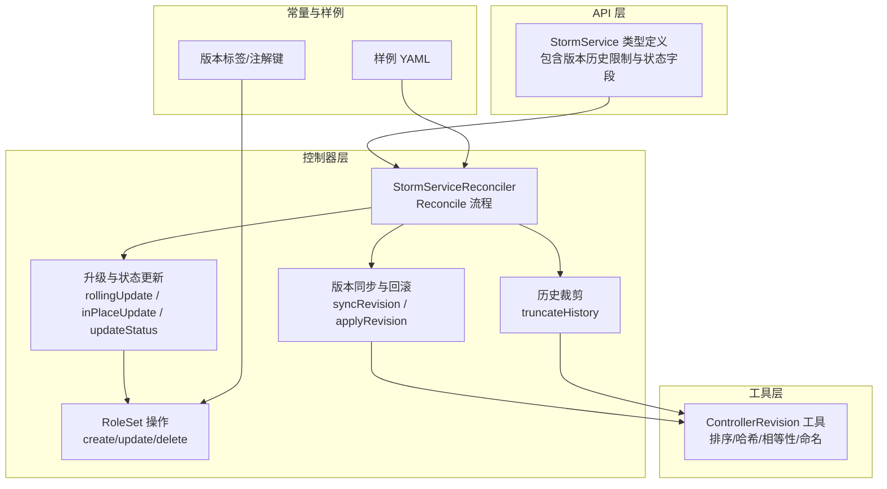
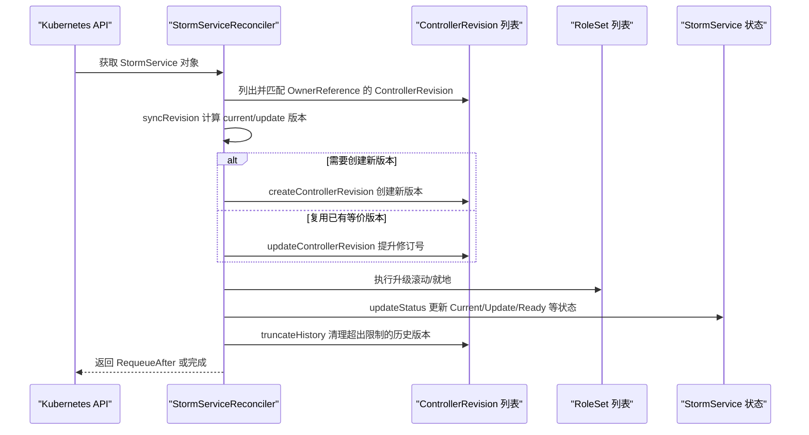
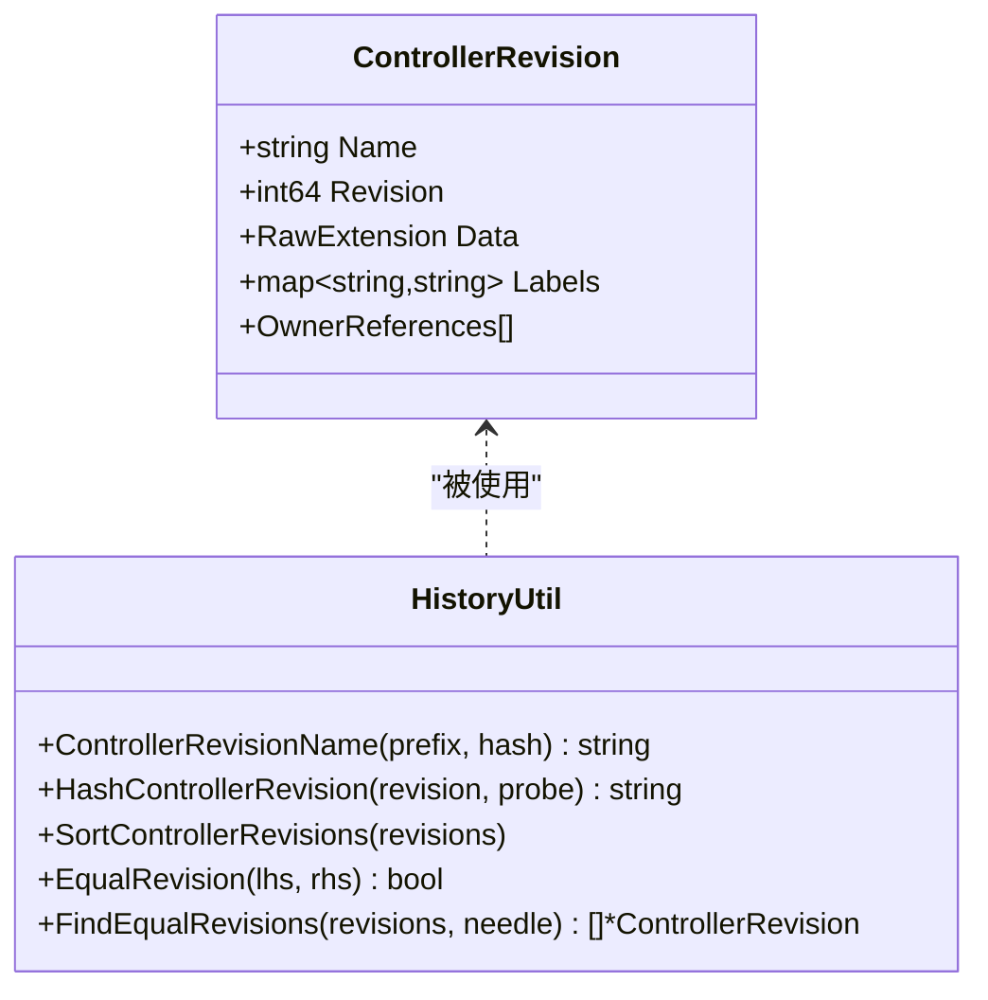
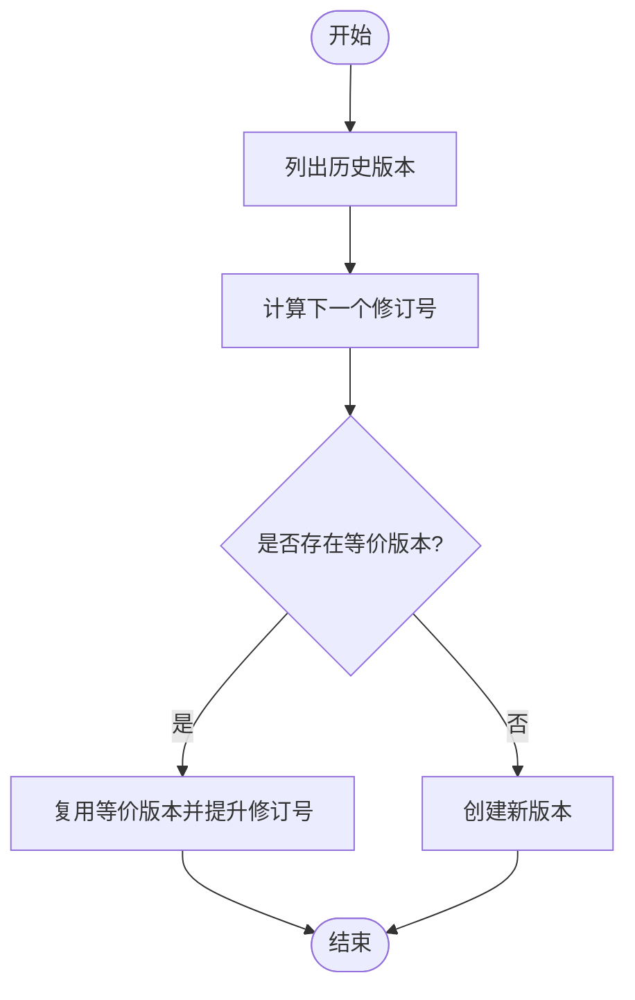
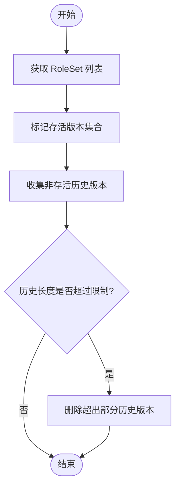
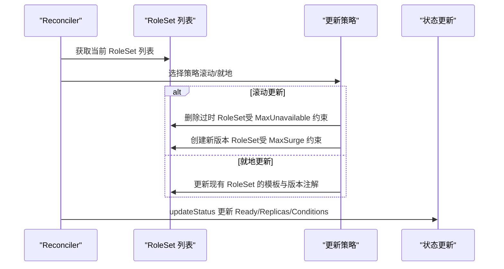
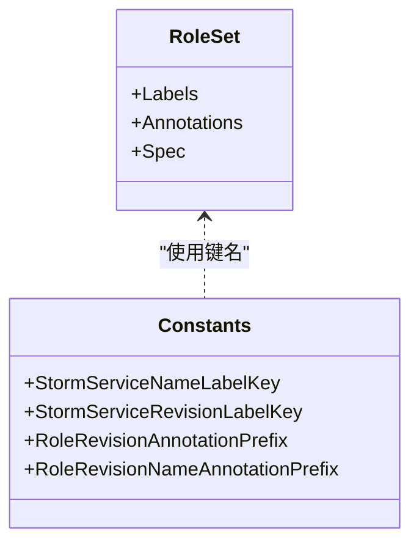
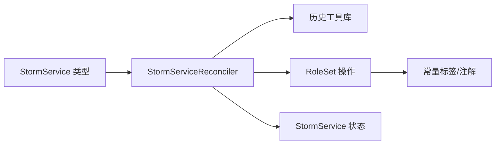

# 版本历史管理

<cite>
**本文引用的文件列表**
- [stormservice_types.go](file://api/orchestration/v1alpha1/stormservice_types.go)
- [stormservice_controller.go](file://pkg/controller/stormservice/stormservice_controller.go)
- [revision.go](file://pkg/controller/stormservice/revision.go)
- [sync.go](file://pkg/controller/stormservice/sync.go)
- [rolesetoperations.go](file://pkg/controller/stormservice/rolesetoperations.go)
- [controller_history.go](file://pkg/controller/util/history/controller_history.go)
- [stormservice.go](file://pkg/controller/constants/stormservice.go)
- [orchestration_v1alpha1_stormservice.yaml](file://config/samples/orchestration_v1alpha1_stormservice.yaml)
- [revision_test.go](file://pkg/controller/stormservice/revision_test.go)
</cite>

## 目录
1. [简介](#简介)
2. [项目结构](#项目结构)
3. [核心组件](#核心组件)
4. [架构总览](#架构总览)
5. [详细组件分析](#详细组件分析)
6. [依赖关系分析](#依赖关系分析)
7. [性能考量](#性能考量)
8. [故障排查指南](#故障排查指南)
9. [结论](#结论)
10. [附录](#附录)

## 简介
本技术文档围绕 AIBrix 的 StormService 版本历史管理展开，系统性阐述 ControllerRevision 资源在 StormService 中的作用与工作机制，包括版本记录、变更跟踪、回滚支持；梳理 StormService 的版本管理策略（revision 数量限制、历史版本清理、版本比较算法）；并结合服务升级场景（滚动更新、蓝绿部署、金丝雀发布）给出可操作的配置与实践建议。同时提供版本历史查看、回滚执行、状态监控等运维操作指南。

## 项目结构
与版本历史管理直接相关的核心模块分布如下：
- API 定义：StormService 类型定义包含版本历史限制字段与状态字段
- 控制器：StormService 控制器负责版本同步、状态更新、历史裁剪
- 历史工具：通用 ControllerRevision 工具库，提供排序、哈希、相等性判断等能力
- 常量：版本标签与注解键名，用于在 RoleSet/Pod 层面追踪版本
- 样例与测试：提供最小化样例与完备的单元测试覆盖

图表来源
- [stormservice_controller.go:1-149](file://pkg/controller/stormservice/stormservice_controller.go#L1-L149)
- [revision.go:1-283](file://pkg/controller/stormservice/revision.go#L1-L283)
- [sync.go:1-450](file://pkg/controller/stormservice/sync.go#L1-L450)
- [rolesetoperations.go:1-159](file://pkg/controller/stormservice/rolesetoperations.go#L1-L159)
- [controller_history.go:1-160](file://pkg/controller/util/history/controller_history.go#L1-L160)
- [stormservice_types.go:1-203](file://api/orchestration/v1alpha1/stormservice_types.go#L1-L203)
- [stormservice.go:1-56](file://pkg/controller/constants/stormservice.go#L1-L56)
- [orchestration_v1alpha1_stormservice.yaml:1-10](file://config/samples/orchestration_v1alpha1_stormservice.yaml#L1-L10)

章节来源
- [stormservice_controller.go:1-149](file://pkg/controller/stormservice/stormservice_controller.go#L1-L149)
- [stormservice_types.go:1-203](file://api/orchestration/v1alpha1/stormservice_types.go#L1-L203)

## 核心组件
- StormServiceSpec.RevisionHistoryLimit：控制保留的历史版本数量上限，默认值由控制器常量设定
- StormServiceStatus：记录当前版本、更新版本、碰撞计数、角色集状态聚合等
- ControllerRevision：Kubernetes apps/v1 内置资源，用于持久化 StormService 的模板快照
- StormServiceReconciler：协调版本同步、升级、状态更新与历史裁剪
- 历史工具库：提供 ControllerRevision 排序、哈希、相等性判断与命名规则

章节来源
- [stormservice_types.go:47-60](file://api/orchestration/v1alpha1/stormservice_types.go#L47-L60)
- [stormservice_types.go:77-134](file://api/orchestration/v1alpha1/stormservice_types.go#L77-L134)
- [stormservice_controller.go:39-44](file://pkg/controller/stormservice/stormservice_controller.go#L39-L44)
- [controller_history.go:35-160](file://pkg/controller/util/history/controller_history.go#L35-L160)

## 架构总览
StormService 的版本历史管理遵循“控制器生成版本快照 -> 按策略进行升级 -> 维护状态与历史”的闭环流程。Reconcile 主流程中，控制器先获取并排序历史版本，再根据当前与更新版本决定是否创建新版本或复用已有版本，随后执行升级与状态更新，并在最后裁剪超出限制的历史版本。

图表来源
- [stormservice_controller.go:126-147](file://pkg/controller/stormservice/stormservice_controller.go#L126-L147)
- [revision.go:172-221](file://pkg/controller/stormservice/revision.go#L172-L221)
- [sync.go:40-71](file://pkg/controller/stormservice/sync.go#L40-L71)
- [sync.go:262-351](file://pkg/controller/stormservice/sync.go#L262-L351)
- [sync.go:353-427](file://pkg/controller/stormservice/sync.go#L353-L427)
- [revision.go:242-282](file://pkg/controller/stormservice/revision.go#L242-L282)

## 详细组件分析

### ControllerRevision 资源与工作机制
- 作用：保存 StormService 模板的快照，作为版本记录与回滚依据
- 命名与哈希：通过工具库生成稳定且唯一的名称与哈希标签，避免冲突
- 相等性判断：基于数据内容与对象语义相等性，以及哈希标签一致性
- 排序：按修订号升序排序，必要时以创建时间与名称破平

图表来源
- [controller_history.go:50-160](file://pkg/controller/util/history/controller_history.go#L50-L160)

章节来源
- [controller_history.go:50-160](file://pkg/controller/util/history/controller_history.go#L50-L160)
- [revision.go:37-55](file://pkg/controller/stormservice/revision.go#L37-L55)
- [revision.go:93-111](file://pkg/controller/stormservice/revision.go#L93-L111)
- [revision.go:119-149](file://pkg/controller/stormservice/revision.go#L119-L149)
- [revision.go:151-170](file://pkg/controller/stormservice/revision.go#L151-L170)

### 版本同步与回滚策略
- 版本计算：nextRevision 基于现有历史递增生成下一个修订号
- 新版本创建：newRevision 仅对模板部分生成补丁，避免全量复制
- 等价版本复用：若已有等价版本，直接提升其修订号以复用，避免重复存储
- 回滚支持：当发现等价版本且非紧邻时，通过提升修订号实现“软回滚”

图表来源
- [revision.go:57-63](file://pkg/controller/stormservice/revision.go#L57-L63)
- [revision.go:186-205](file://pkg/controller/stormservice/revision.go#L186-L205)
- [controller_history.go:127-137](file://pkg/controller/util/history/controller_history.go#L127-L137)

章节来源
- [revision.go:172-221](file://pkg/controller/stormservice/revision.go#L172-L221)
- [controller_history.go:127-137](file://pkg/controller/util/history/controller_history.go#L127-L137)

### 版本历史清理策略
- 生命期判定：当前版本、更新版本、正在使用的 RoleSet 所属版本均视为“存活”
- 历史长度与限制：默认限制由控制器常量定义，可通过 Spec.RevisionHistoryLimit 覆盖
- 裁剪逻辑：删除所有非存活历史版本，保留存活集合外的旧版本

图表来源
- [revision.go:242-282](file://pkg/controller/stormservice/revision.go#L242-L282)

章节来源
- [revision.go:242-282](file://pkg/controller/stormservice/revision.go#L242-L282)
- [stormservice_controller.go:42](file://pkg/controller/stormservice/stormservice_controller.go#L42)

### 升级策略与版本比较算法
- 滚动更新：遵循 MaxSurge 与 MaxUnavailable 约束，先删除过时 RoleSet，再创建新版本 RoleSet
- 就地更新：在池化模式下，向已存在 RoleSet 注入最新模板与每角色版本信息
- 版本比较：基于 ControllerRevision 数据内容与哈希标签，确保语义相等性

图表来源
- [sync.go:262-351](file://pkg/controller/stormservice/sync.go#L262-L351)
- [sync.go:353-427](file://pkg/controller/stormservice/sync.go#L353-L427)
- [controller_history.go:100-125](file://pkg/controller/util/history/controller_history.go#L100-L125)

章节来源
- [sync.go:262-351](file://pkg/controller/stormservice/sync.go#L262-L351)
- [sync.go:353-427](file://pkg/controller/stormservice/sync.go#L353-L427)
- [controller_history.go:100-125](file://pkg/controller/util/history/controller_history.go#L100-L125)

### 角色集与版本标签/注解
- 标签：StormService 名称、版本、角色名、角色模板哈希、角色副本索引等
- 注解：每角色版本号与名称，便于在 Pod 层面追踪具体版本
- RoleSet 渲染：在创建/更新 RoleSet 时注入上述标签与注解

图表来源
- [rolesetoperations.go:59-108](file://pkg/controller/stormservice/rolesetoperations.go#L59-L108)
- [stormservice.go:24-44](file://pkg/controller/constants/stormservice.go#L24-L44)

章节来源
- [rolesetoperations.go:59-108](file://pkg/controller/stormservice/rolesetoperations.go#L59-L108)
- [stormservice.go:24-44](file://pkg/controller/constants/stormservice.go#L24-L44)

### 配置选项与使用示例
- 版本历史限制
  - 默认值：控制器常量定义
  - 覆盖方式：在 StormService.Spec.RevisionHistoryLimit 设置
- 查看版本历史
  - 使用 kubectl describe 命令查看 ControllerRevision 列表与名称
  - 使用 kubectl get 命令查看 ControllerRevision 列表
- 执行版本回滚
  - 通过修改 StormService 模板触发新版本创建
  - 若目标版本已存在且等价，控制器会复用该版本并提升修订号
- 监控版本状态
  - 通过 StormService.Status.CurrentRevision/UpdateRevision 判断当前与更新版本
  - 通过 Ready/Progressing 条件与 ReadyReplicas/UpdatedReadyReplicas 判断健康度

章节来源
- [stormservice_controller.go:42](file://pkg/controller/stormservice/stormservice_controller.go#L42)
- [stormservice_types.go:47-51](file://api/orchestration/v1alpha1/stormservice_types.go#L47-L51)
- [sync.go:353-427](file://pkg/controller/stormservice/sync.go#L353-L427)
- [orchestration_v1alpha1_stormservice.yaml:1-10](file://config/samples/orchestration_v1alpha1_stormservice.yaml#L1-L10)

## 依赖关系分析
- 控制器依赖历史工具库进行版本排序、哈希与相等性判断
- 控制器依赖 RoleSet 操作模块进行创建/更新/删除
- StormService 类型定义提供版本历史限制与状态字段
- 常量模块提供标签/注解键名，贯穿到 RoleSet/Pod 层面

图表来源
- [stormservice_controller.go:17-37](file://pkg/controller/stormservice/stormservice_controller.go#L17-L37)
- [controller_history.go:17-33](file://pkg/controller/util/history/controller_history.go#L17-L33)
- [rolesetoperations.go:17-35](file://pkg/controller/stormservice/rolesetoperations.go#L17-L35)
- [stormservice_types.go:17-22](file://api/orchestration/v1alpha1/stormservice_types.go#L17-L22)
- [stormservice.go:17-56](file://pkg/controller/constants/stormservice.go#L17-L56)

章节来源
- [stormservice_controller.go:17-37](file://pkg/controller/stormservice/stormservice_controller.go#L17-L37)
- [controller_history.go:17-33](file://pkg/controller/util/history/controller_history.go#L17-L33)
- [rolesetoperations.go:17-35](file://pkg/controller/stormservice/rolesetoperations.go#L17-L35)
- [stormservice_types.go:17-22](file://api/orchestration/v1alpha1/stormservice_types.go#L17-L22)
- [stormservice.go:17-56](file://pkg/controller/constants/stormservice.go#L17-L56)

## 性能考量
- 历史版本数量限制：合理设置 RevisionHistoryLimit，避免历史版本过多导致存储与查询开销上升
- 哈希与相等性判断：使用哈希标签与语义相等性减少不必要的存储与网络传输
- 批处理与重试：RoleSet 创建/更新采用慢启动批处理，冲突时使用退避重试
- 状态更新去抖：仅在状态发生实质性变化时才更新 Status，降低写放大

[本节为通用指导，不直接分析具体文件]

## 故障排查指南
- 历史版本无法创建
  - 检查 collisionCount 是否为 nil，创建前必须初始化
  - 检查名称冲突，确认哈希生成与命名规则
- 历史版本裁剪失败
  - 确认 RoleSet 列表查询成功
  - 检查删除权限与资源存在性
- 版本回滚无效
  - 确认等价版本存在且非紧邻，否则会创建新版本而非复用
  - 检查模板补丁是否正确生成
- 升级卡住
  - 检查 MaxSurge/MaxUnavailable 与 Ready/NotReady 的比例
  - 关注条件状态（Ready/Progressing/Failure）

章节来源
- [revision.go:119-149](file://pkg/controller/stormservice/revision.go#L119-L149)
- [revision.go:242-282](file://pkg/controller/stormservice/revision.go#L242-L282)
- [sync.go:353-427](file://pkg/controller/stormservice/sync.go#L353-L427)
- [revision_test.go:1-800](file://pkg/controller/stormservice/revision_test.go#L1-L800)

## 结论
AIBrix 的 StormService 版本历史管理以 ControllerRevision 为核心，结合控制器的版本同步、升级与状态更新机制，实现了稳定的版本记录、变更跟踪与回滚支持。通过合理的版本历史限制与升级策略（滚动/就地），可在保证可用性的前提下高效推进服务演进。配合标签/注解体系，版本信息可贯穿到 RoleSet 与 Pod 层面，便于运维观测与排障。

[本节为总结性内容，不直接分析具体文件]

## 附录
- 参考样例：config/samples/orchestration_v1alpha1_stormservice.yaml
- 单元测试：pkg/controller/stormservice/revision_test.go 覆盖了版本命名、补丁生成、等价版本复用、历史裁剪等关键路径

章节来源
- [orchestration_v1alpha1_stormservice.yaml:1-10](file://config/samples/orchestration_v1alpha1_stormservice.yaml#L1-L10)
- [revision_test.go:1-800](file://pkg/controller/stormservice/revision_test.go#L1-L800)