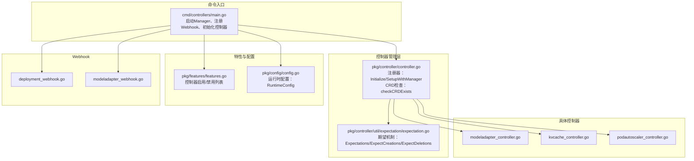
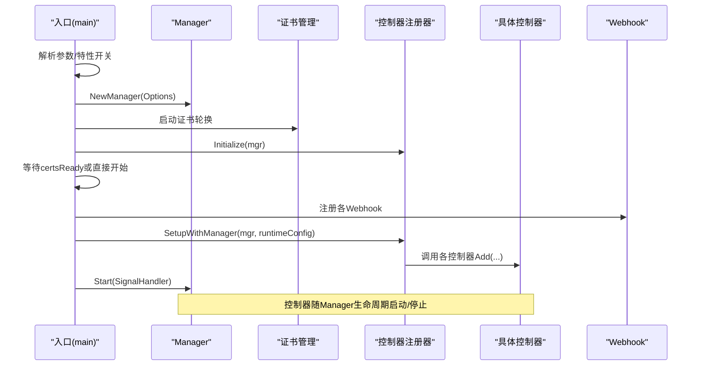
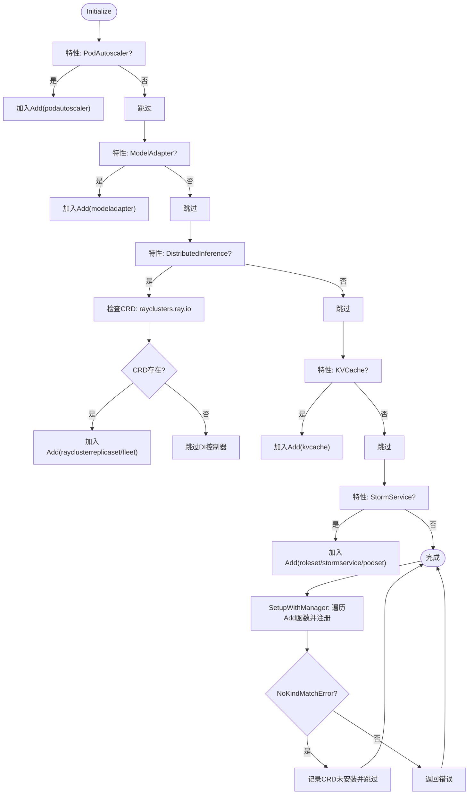
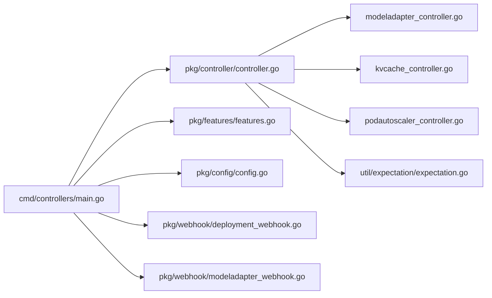

# 控制器管理器

<cite>
**本文引用的文件**
- [cmd/controllers/main.go](file://cmd/controllers/main.go)
- [pkg/controller/controller.go](file://pkg/controller/controller.go)
- [pkg/features/features.go](file://pkg/features/features.go)
- [pkg/config/config.go](file://pkg/config/config.go)
- [pkg/controller/util/expectation/expectation.go](file://pkg/controller/util/expectation/expectation.go)
- [pkg/controller/modeladapter/modeladapter_controller.go](file://pkg/controller/modeladapter/modeladapter_controller.go)
- [pkg/controller/kvcache/kvcache_controller.go](file://pkg/controller/kvcache/kvcache_controller.go)
- [pkg/controller/podautoscaler/podautoscaler_controller.go](file://pkg/controller/podautoscaler/podautoscaler_controller.go)
- [pkg/webhook/deployment_webhook.go](file://pkg/webhook/deployment_webhook.go)
- [pkg/webhook/modeladapter_webhook.go](file://pkg/webhook/modeladapter_webhook.go)
</cite>

## 目录
1. [简介](#简介)
2. [项目结构](#项目结构)
3. [核心组件](#核心组件)
4. [架构总览](#架构总览)
5. [详细组件分析](#详细组件分析)
6. [依赖关系分析](#依赖关系分析)
7. [性能考量](#性能考量)
8. [故障排查指南](#故障排查指南)
9. [结论](#结论)
10. [附录](#附录)

## 简介
本文件面向AIBrix控制器管理器（Controller Manager），系统化阐述其整体架构设计与实现细节，重点覆盖：
- 控制器注册机制与生命周期管理
- 事件处理流程与工作队列行为
- 控制器添加函数的初始化过程
- CRD存在性检查机制与条件启用控制
- 与Kubernetes controller-runtime的集成方式：Manager配置、Reconciler注册、工作队列管理
- 实际代码示例路径：如何添加新控制器、配置运行时参数、处理CRD缺失等
- 控制器管理器在系统中的关键作用及与各组件的交互关系

## 项目结构
控制器管理器位于命令入口层，通过统一的Manager进行控制器装配与生命周期管理；控制器注册逻辑集中在pkg/controller/controller.go中，按功能模块拆分到各子包，如modeladapter、kvcache、podautoscaler等；特性开关与运行时配置分别由pkg/features/features.go与pkg/config/config.go提供。

图表来源
- [cmd/controllers/main.go:112-359](file://cmd/controllers/main.go#L112-L359)
- [pkg/controller/controller.go:48-129](file://pkg/controller/controller.go#L48-L129)
- [pkg/features/features.go:34-119](file://pkg/features/features.go#L34-L119)
- [pkg/config/config.go:19-41](file://pkg/config/config.go#L19-L41)
- [pkg/controller/util/expectation/expectation.go:31-232](file://pkg/controller/util/expectation/expectation.go#L31-L232)

章节来源
- [cmd/controllers/main.go:112-359](file://cmd/controllers/main.go#L112-L359)
- [pkg/controller/controller.go:48-129](file://pkg/controller/controller.go#L48-L129)
- [pkg/features/features.go:34-119](file://pkg/features/features.go#L34-L119)
- [pkg/config/config.go:19-41](file://pkg/config/config.go#L19-L41)

## 核心组件
- 控制器注册器（Initialize/SetupWithManager）：集中收集各控制器的Add函数，按特性开关与CRD存在性决定是否加入注册队列。
- 特性开关（features）：支持“全部启用”、“指定启用/禁用”的灵活控制。
- 运行时配置（config）：封装运行时参数（如模型适配器调度策略、是否启用Sidecar等）。
- 期望机制（expectation）：用于协调控制器与Watch事件，避免竞态与风暴。
- Webhook：在Manager启动后按证书就绪状态延迟注册，确保安全通信。

章节来源
- [pkg/controller/controller.go:48-129](file://pkg/controller/controller.go#L48-L129)
- [pkg/features/features.go:34-119](file://pkg/features/features.go#L34-L119)
- [pkg/config/config.go:19-41](file://pkg/config/config.go#L19-L41)
- [pkg/controller/util/expectation/expectation.go:31-232](file://pkg/controller/util/expectation/expectation.go#L31-L232)

## 架构总览
控制器管理器以controller-runtime的Manager为核心，完成以下关键职责：
- 创建并配置Manager（指标端口、健康探针、Leader Election、TLS选项）
- 注册Webhook（按证书就绪状态异步启动）
- 初始化控制器注册表（基于特性开关与CRD存在性）
- 启动Manager并进入信号处理循环

图表来源
- [cmd/controllers/main.go:227-359](file://cmd/controllers/main.go#L227-L359)
- [pkg/controller/controller.go:97-109](file://pkg/controller/controller.go#L97-L109)

章节来源
- [cmd/controllers/main.go:227-359](file://cmd/controllers/main.go#L227-L359)
- [pkg/controller/controller.go:97-109](file://pkg/controller/controller.go#L97-L109)

## 详细组件分析

### 控制器注册与生命周期管理
- Initialize：根据特性开关收集Add函数，对分布式推理控制器额外执行CRD存在性检查，仅当CRD存在时才注册对应控制器。
- SetupWithManager：遍历已收集的Add函数，逐个调用完成Reconciler注册；若遇到“未匹配Kind”的错误，记录信息并跳过该控制器，避免因CRD缺失导致整体失败。
- CRD检查：通过APIReader读取CustomResourceDefinition元数据，区分NotFound与其它错误，非NotFound错误会直接返回失败。

图表来源
- [pkg/controller/controller.go:50-95](file://pkg/controller/controller.go#L50-L95)
- [pkg/controller/controller.go:97-129](file://pkg/controller/controller.go#L97-L129)

章节来源
- [pkg/controller/controller.go:50-95](file://pkg/controller/controller.go#L50-L95)
- [pkg/controller/controller.go:97-129](file://pkg/controller/controller.go#L97-L129)

### 特性开关与控制器启用控制
- 支持的控制器名称集合与默认启用策略
- 支持“*”全量启用、显式启用/禁用（前缀“-”）
- 校验输入合法性，非法名称直接报错

章节来源
- [pkg/features/features.go:24-46](file://pkg/features/features.go#L24-L46)
- [pkg/features/features.go:48-78](file://pkg/features/features.go#L48-L78)
- [pkg/features/features.go:80-99](file://pkg/features/features.go#L80-L99)
- [pkg/features/features.go:101-119](file://pkg/features/features.go#L101-L119)

### 运行时配置与参数
- RuntimeConfig：包含是否启用运行时Sidecar、调试模式、模型适配器调度策略等
- 通过命令行参数传入并注入到各控制器

章节来源
- [pkg/config/config.go:19-41](file://pkg/config/config.go#L19-L41)
- [cmd/controllers/main.go:123-159](file://cmd/controllers/main.go#L123-L159)
- [cmd/controllers/main.go:218](file://cmd/controllers/main.go#L218)

### 与controller-runtime的集成要点
- Manager配置项：指标绑定地址、健康探针、Leader Election、资源锁类型、租约时长等
- WebhookServer：可按需启用并设置TLS策略
- 证书就绪与Webhook注册：使用通道阻塞直到证书可用，再注册各Webhook
- Reconciler注册：通过controller-runtime的builder模式注册，支持Owns/Watches/Events

章节来源
- [cmd/controllers/main.go:227-253](file://cmd/controllers/main.go#L227-L253)
- [cmd/controllers/main.go:271-279](file://cmd/controllers/main.go#L271-L279)
- [cmd/controllers/main.go:322-359](file://cmd/controllers/main.go#L322-L359)
- [pkg/controller/modeladapter/modeladapter_controller.go:237-277](file://pkg/controller/modeladapter/modeladapter_controller.go#L237-L277)
- [pkg/controller/kvcache/kvcache_controller.go:100-131](file://pkg/controller/kvcache/kvcache_controller.go#L100-L131)
- [pkg/controller/podautoscaler/podautoscaler_controller.go:194-227](file://pkg/controller/podautoscaler/podautoscaler_controller.go#L194-L227)

### 期望机制（Expectations）
- 用于协调控制器与Watch事件，避免竞态与风暴
- 支持设置期望（创建/删除）、观察事件、到期触发
- 控制器在满足期望或到期后才会继续同步

章节来源
- [pkg/controller/util/expectation/expectation.go:31-232](file://pkg/controller/util/expectation/expectation.go#L31-L232)

### 具体控制器示例

#### 模型适配器控制器（ModelAdapter）
- Reconciler初始化：获取Informers、构建Lister、初始化调度器、创建事件通道
- 注册：For(ModelAdapter)+Owns(Service/EndpointSlice)+Watches(Pod)+周期性重试
- 生命周期：通过mgr.Add注册周期性任务，随Manager生命周期结束

章节来源
- [pkg/controller/modeladapter/modeladapter_controller.go:129-191](file://pkg/controller/modeladapter/modeladapter_controller.go#L129-L191)
- [pkg/controller/modeladapter/modeladapter_controller.go:237-277](file://pkg/controller/modeladapter/modeladapter_controller.go#L237-L277)

#### KV缓存控制器（KVCache）
- Reconciler初始化：选择后端（Vineyard/HPKV/Infinistore）
- 注册：For(KVCache)+Owns(Service/Deployment)+Watches(Pod)
- 后端路由：根据注解选择后端并委派给对应后端Reconciler

章节来源
- [pkg/controller/kvcache/kvcache_controller.go:62-75](file://pkg/controller/kvcache/kvcache_controller.go#L62-L75)
- [pkg/controller/kvcache/kvcache_controller.go:100-131](file://pkg/controller/kvcache/kvcache_controller.go#L100-L131)
- [pkg/controller/kvcache/kvcache_controller.go:173-181](file://pkg/controller/kvcache/kvcache_controller.go#L173-L181)

#### Pod自动伸缩控制器（PodAutoscaler）
- Reconciler初始化：构建资源/自定义指标客户端、工作负载缩放客户端、统一自动伸缩器
- 注册：For(PodAutoscaler)+Watches(HorizontalPodAutoscaler)+周期性重试
- 策略：HPA/KPA/APA三种策略，分别走HPA资源或自定义算法

章节来源
- [pkg/controller/podautoscaler/podautoscaler_controller.go:114-163](file://pkg/controller/podautoscaler/podautoscaler_controller.go#L114-L163)
- [pkg/controller/podautoscaler/podautoscaler_controller.go:194-227](file://pkg/controller/podautoscaler/podautoscaler_controller.go#L194-L227)
- [pkg/controller/podautoscaler/podautoscaler_controller.go:664-715](file://pkg/controller/podautoscaler/podautoscaler_controller.go#L664-L715)
- [pkg/controller/podautoscaler/podautoscaler_controller.go:718-794](file://pkg/controller/podautoscaler/podautoscaler_controller.go#L718-L794)

### Webhook集成
- 部署（Deployment）Webhook：默认注入与校验，支持Sidecar注入与引擎类型推断
- 模型适配器（ModelAdapter）Webhook：默认注入与校验（如artifactURL格式）

章节来源
- [pkg/webhook/deployment_webhook.go:35-40](file://pkg/webhook/deployment_webhook.go#L35-L40)
- [pkg/webhook/deployment_webhook.go:50-70](file://pkg/webhook/deployment_webhook.go#L50-L70)
- [pkg/webhook/modeladapter_webhook.go:37-43](file://pkg/webhook/modeladapter_webhook.go#L37-L43)
- [pkg/webhook/modeladapter_webhook.go:59-78](file://pkg/webhook/modeladapter_webhook.go#L59-L78)

## 依赖关系分析

图表来源
- [cmd/controllers/main.go:112-359](file://cmd/controllers/main.go#L112-L359)
- [pkg/controller/controller.go:48-129](file://pkg/controller/controller.go#L48-L129)
- [pkg/features/features.go:34-119](file://pkg/features/features.go#L34-L119)
- [pkg/config/config.go:19-41](file://pkg/config/config.go#L19-L41)
- [pkg/controller/util/expectation/expectation.go:31-232](file://pkg/controller/util/expectation/expectation.go#L31-L232)

章节来源
- [cmd/controllers/main.go:112-359](file://cmd/controllers/main.go#L112-L359)
- [pkg/controller/controller.go:48-129](file://pkg/controller/controller.go#L48-L129)

## 性能考量
- 期望机制（Expectations）：通过TTL与原子计数减少重复同步，降低Watch风暴影响
- 周期性重试：部分控制器通过事件通道+Ticker实现周期性同步，避免遗漏状态变更
- 指标与健康探针：通过独立端口暴露，便于外部监控与快速定位问题
- Leader选举：在多副本部署下保证一致性与避免脑裂

章节来源
- [pkg/controller/util/expectation/expectation.go:31-232](file://pkg/controller/util/expectation/expectation.go#L31-L232)
- [pkg/controller/modeladapter/modeladapter_controller.go:268-277](file://pkg/controller/modeladapter/modeladapter_controller.go#L268-L277)
- [pkg/controller/podautoscaler/podautoscaler_controller.go:218-227](file://pkg/controller/podautoscaler/podautoscaler_controller.go#L218-L227)
- [cmd/controllers/main.go:227-253](file://cmd/controllers/main.go#L227-L253)

## 故障排查指南
- CRD缺失导致控制器不生效
  - 现象：日志提示CRD未安装，控制器被跳过
  - 处理：安装对应CRD或禁用相关控制器
  - 参考路径：[pkg/controller/controller.go:64-82](file://pkg/controller/controller.go#L64-L82)
- Webhook未就绪导致Readyz失败
  - 现象：readyz返回证书未就绪错误
  - 处理：等待证书生成完成或关闭Webhook（--disable-webhook）
  - 参考路径：[cmd/controllers/main.go:298-312](file://cmd/controllers/main.go#L298-L312)
- Reconciler注册失败
  - 现象：SetupWithManager返回错误
  - 处理：检查控制器Add函数实现与RBAC权限
  - 参考路径：[pkg/controller/controller.go:97-109](file://pkg/controller/controller.go#L97-L109)
- 分布式推理控制器不可用
  - 现象：日志提示未发现KubeRay CRD
  - 处理：安装KubeRay Operator或禁用分布式推理控制器
  - 参考路径：[pkg/controller/controller.go:64-82](file://pkg/controller/controller.go#L64-L82)

章节来源
- [pkg/controller/controller.go:64-82](file://pkg/controller/controller.go#L64-L82)
- [pkg/controller/controller.go:97-109](file://pkg/controller/controller.go#L97-L109)
- [cmd/controllers/main.go:298-312](file://cmd/controllers/main.go#L298-L312)

## 结论
AIBrix控制器管理器通过统一的Manager与注册器，实现了控制器的模块化装配与生命周期管理；借助特性开关与CRD检查，能够在不同环境中灵活启用所需控制器；结合期望机制与周期性重试，有效提升稳定性与性能。Webhook在证书就绪后异步注册，确保安全通信。整体设计遵循controller-runtime最佳实践，具备良好的扩展性与可观测性。

## 附录

### 如何添加一个新的控制器
- 在pkg/controller/<your_controller>/目录下实现Add与Reconciler
- 在pkg/controller/controller.go的Initialize中加入你的Add函数
- 在pkg/features/features.go中声明新控制器名称
- 在cmd/controllers/main.go中按需注册Webhook（如需要）
- 使用--controllers参数启用或禁用该控制器

参考路径
- [pkg/controller/controller.go:50-95](file://pkg/controller/controller.go#L50-L95)
- [pkg/features/features.go:24-46](file://pkg/features/features.go#L24-L46)
- [cmd/controllers/main.go:322-359](file://cmd/controllers/main.go#L322-L359)

### 如何配置运行时参数
- 通过命令行参数传入：--enable-runtime-sidecar、--debug-mode、--model-adapter-scheduler-policy
- 参数会被封装为RuntimeConfig并传递给各控制器

参考路径
- [cmd/controllers/main.go:123-159](file://cmd/controllers/main.go#L123-L159)
- [pkg/config/config.go:19-41](file://pkg/config/config.go#L19-L41)

### 如何处理CRD缺失
- 在Initialize阶段对相关CRD进行存在性检查
- 若CRD不存在，记录信息并跳过该控制器，避免整体失败
- 用户可通过特性开关禁用相关控制器

参考路径
- [pkg/controller/controller.go:64-82](file://pkg/controller/controller.go#L64-L82)
- [pkg/controller/controller.go:111-129](file://pkg/controller/controller.go#L111-L129)