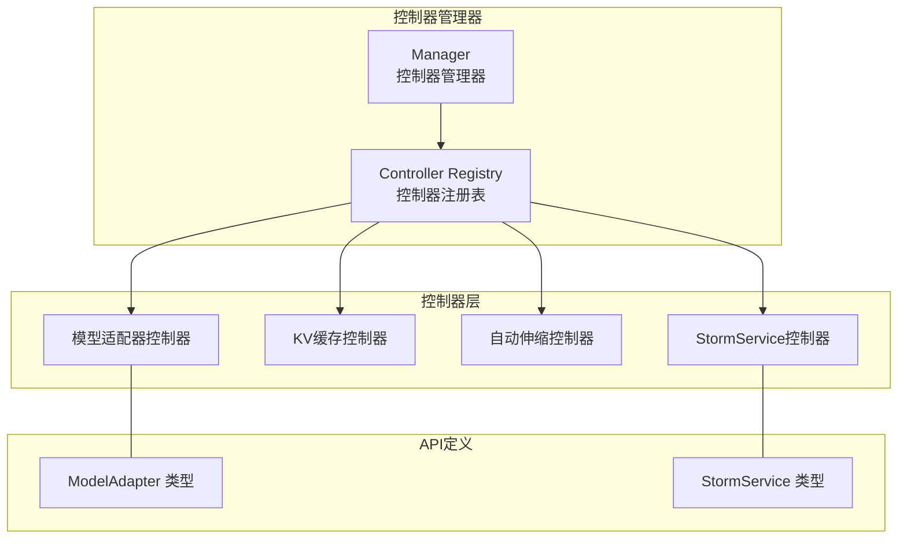
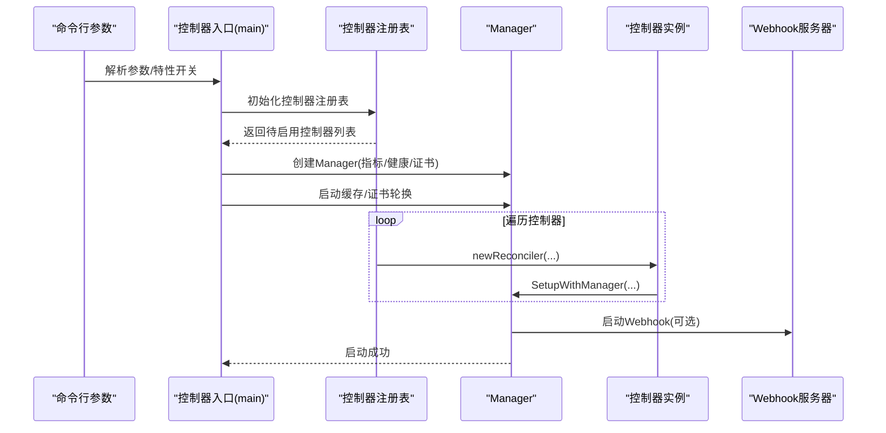
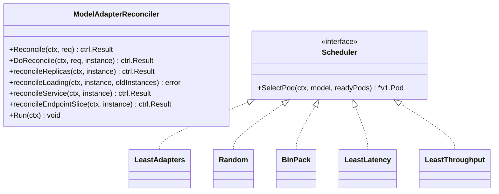
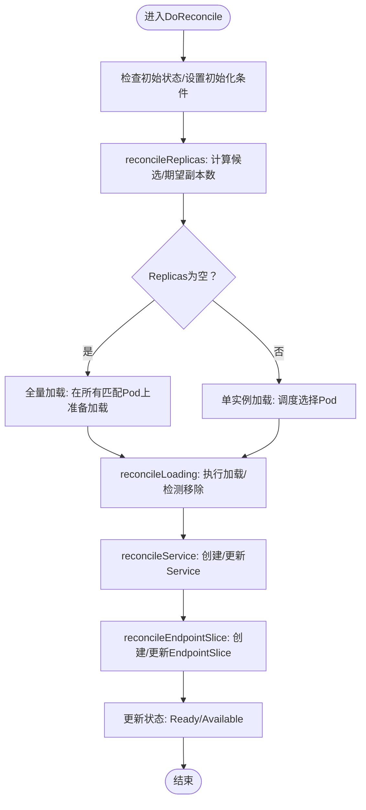
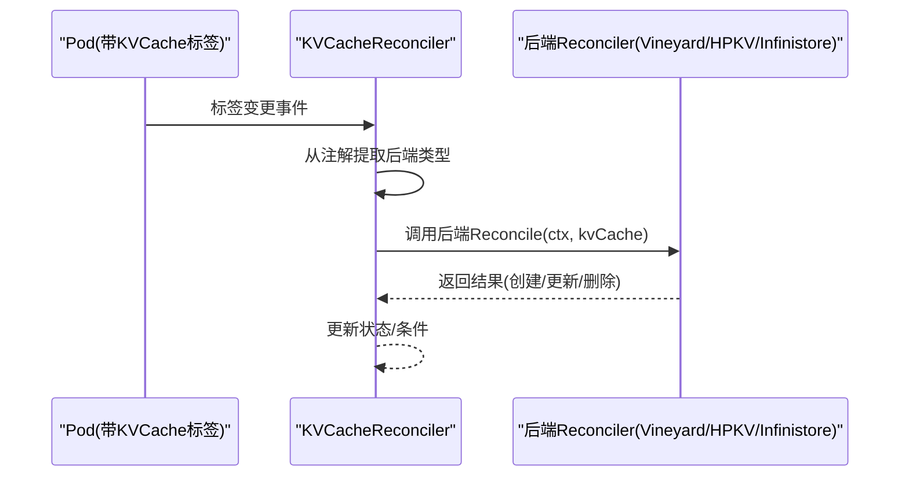
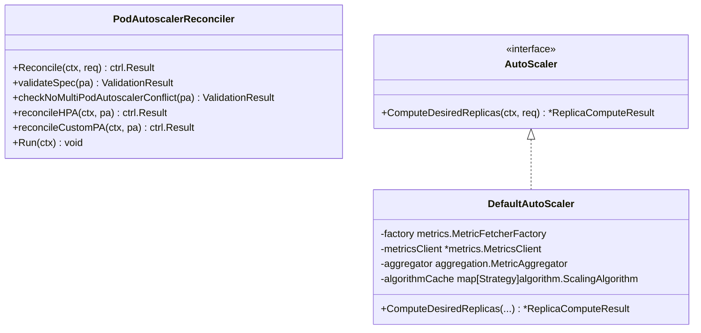
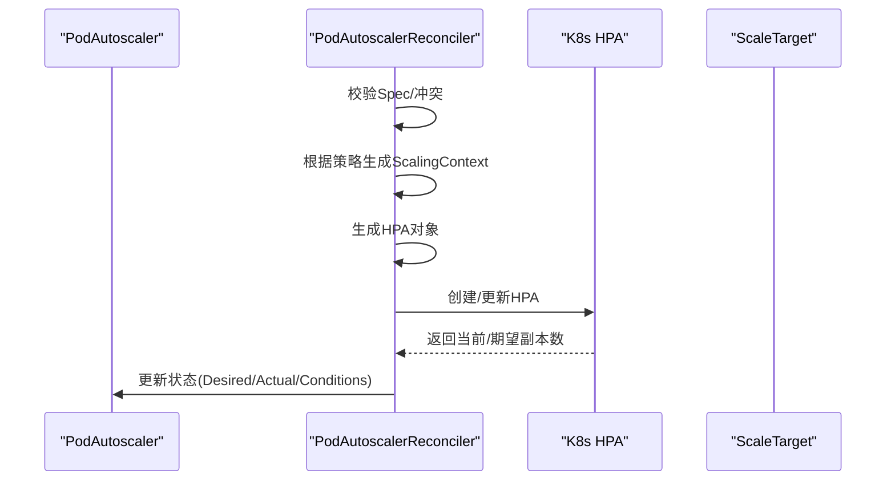
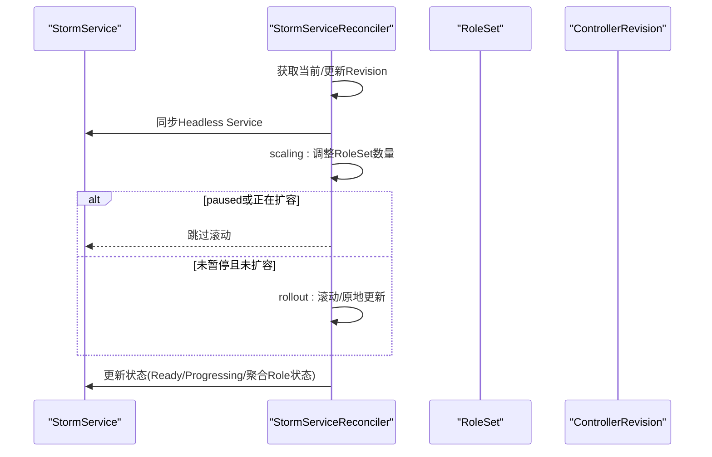
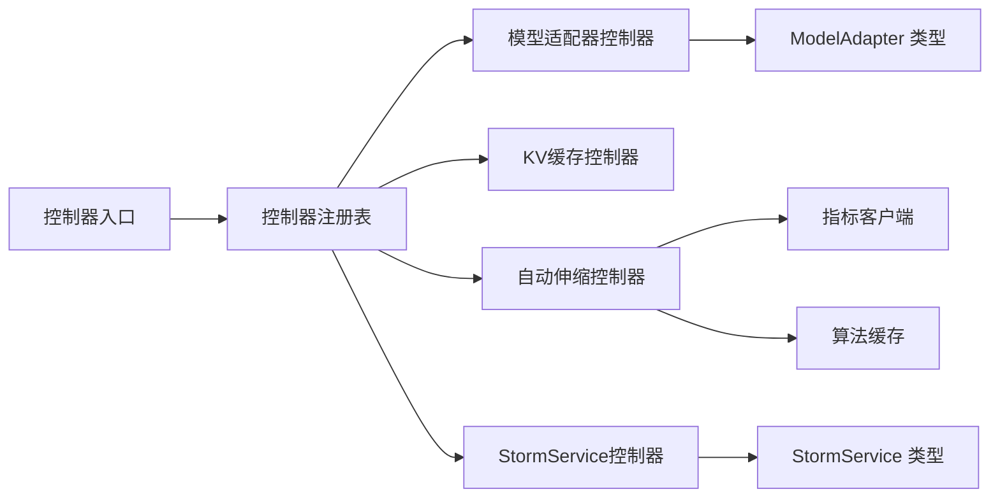

# 控制器系统

<cite>
**本文引用的文件**
- [cmd/controllers/main.go](file://cmd/controllers/main.go)
- [pkg/controller/controller.go](file://pkg/controller/controller.go)
- [pkg/features/features.go](file://pkg/features/features.go)
- [pkg/config/config.go](file://pkg/config/config.go)
- [pkg/controller/modeladapter/modeladapter_controller.go](file://pkg/controller/modeladapter/modeladapter_controller.go)
- [pkg/controller/modeladapter/scheduling/scheduler.go](file://pkg/controller/modeladapter/scheduling/scheduler.go)
- [pkg/controller/kvcache/kvcache_controller.go](file://pkg/controller/kvcache/kvcache_controller.go)
- [pkg/controller/podautoscaler/podautoscaler_controller.go](file://pkg/controller/podautoscaler/podautoscaler_controller.go)
- [pkg/controller/podautoscaler/autoscaler.go](file://pkg/controller/podautoscaler/autoscaler.go)
- [pkg/controller/stormservice/stormservice_controller.go](file://pkg/controller/stormservice/stormservice_controller.go)
- [pkg/controller/stormservice/sync.go](file://pkg/controller/stormservice/sync.go)
- [api/model/v1alpha1/modeladapter_types.go](file://api/model/v1alpha1/modeladapter_types.go)
- [api/orchestration/v1alpha1/stormservice_types.go](file://api/orchestration/v1alpha1/stormservice_types.go)
</cite>

## 目录
1. [简介](#简介)
2. [项目结构](#项目结构)
3. [核心组件](#核心组件)
4. [架构总览](#架构总览)
5. [详细组件分析](#详细组件分析)
6. [依赖关系分析](#依赖关系分析)
7. [性能考虑](#性能考虑)
8. [故障排查指南](#故障排查指南)
9. [结论](#结论)
10. [附录](#附录)

## 简介
本文件面向AIBrix控制器系统，系统性阐述控制器管理器的整体架构与运行机制，覆盖控制器生命周期管理、事件驱动与状态同步策略，并对四大专用控制器（模型适配器控制器、KV缓存控制器、自动伸缩控制器、StormService控制器）进行深入解析。文档同时给出控制器间协作模式、错误处理与性能优化建议，并提供可直接定位到源码路径的示例与配置说明，便于开发者理解与扩展。

## 项目结构
AIBrix控制器系统以单一控制器管理器为核心，通过特性开关动态启用/禁用控制器，按模块化方式组织各控制器实现，API类型定义位于独立包中，便于跨模块共享。

图示来源
- [cmd/controllers/main.go:282-285](file://cmd/controllers/main.go#L282-L285)
- [pkg/controller/controller.go:48-95](file://pkg/controller/controller.go#L48-L95)

章节来源
- [cmd/controllers/main.go:112-360](file://cmd/controllers/main.go#L112-L360)
- [pkg/controller/controller.go:1-130](file://pkg/controller/controller.go#L1-L130)
- [pkg/features/features.go:1-120](file://pkg/features/features.go#L1-L120)

## 核心组件
- 控制器管理器（Manager）
  - 负责创建、配置与启动控制器，统一管理健康检查、指标端点、Webhook证书轮换与就绪检查。
  - 支持领导者选举、并发控制与优雅停机。
- 控制器注册表（Controller Registry）
  - 基于特性开关动态决定启用哪些控制器，避免未安装CRD或依赖缺失时的异常。
- 运行时配置（RuntimeConfig）
  - 提供运行时选项，如是否启用运行时Sidecar、调试模式、模型适配器调度策略等。

章节来源
- [cmd/controllers/main.go:227-257](file://cmd/controllers/main.go#L227-L257)
- [pkg/controller/controller.go:48-95](file://pkg/controller/controller.go#L48-L95)
- [pkg/config/config.go:19-41](file://pkg/config/config.go#L19-L41)

## 架构总览
控制器管理器在启动阶段完成以下流程：
1) 初始化运行时配置与特性开关；
2) 注册所需Schema（含CRD）；
3) 创建Manager并配置指标、健康探针与Webhook；
4) 启动缓存与证书轮换；
5) 初始化控制器注册表并逐一设置到Manager；
6) 启动主循环与周期性重试队列。

图示来源
- [cmd/controllers/main.go:112-360](file://cmd/controllers/main.go#L112-L360)
- [pkg/controller/controller.go:97-109](file://pkg/controller/controller.go#L97-L109)

## 详细组件分析

### 模型适配器控制器（ModelAdapter Controller）
职责与能力
- 生命周期管理：负责ModelAdapter对象的创建、更新、删除与最终化清理。
- 实例调度：根据调度策略选择目标Pod，支持单实例或多实例（全部匹配Pod）加载。
- 资源编排：自动创建/维护Service与EndpointSlice，确保服务发现与流量接入。
- 状态同步：通过条件（Conditions）与阶段（Phase）表达当前状态，支持失败重试与迁移恢复。
- 事件驱动：监听Pod变更、标签变化与周期性重试通道，触发Reconcile。

图示来源
- [pkg/controller/modeladapter/modeladapter_controller.go:282-493](file://pkg/controller/modeladapter/modeladapter_controller.go#L282-L493)
- [pkg/controller/modeladapter/scheduling/scheduler.go:28-50](file://pkg/controller/modeladapter/scheduling/scheduler.go#L28-L50)

关键流程（加载与迁移）

图示来源
- [pkg/controller/modeladapter/modeladapter_controller.go:417-493](file://pkg/controller/modeladapter/modeladapter_controller.go#L417-L493)

章节来源
- [pkg/controller/modeladapter/modeladapter_controller.go:127-277](file://pkg/controller/modeladapter/modeladapter_controller.go#L127-L277)
- [pkg/controller/modeladapter/modeladapter_controller.go:313-493](file://pkg/controller/modeladapter/modeladapter_controller.go#L313-L493)
- [api/model/v1alpha1/modeladapter_types.go:26-161](file://api/model/v1alpha1/modeladapter_types.go#L26-L161)

### KV缓存控制器（KVCache Controller）
职责与能力
- 多后端适配：内置Vineyard、HPKV、Infinistore等后端的Reconciler映射。
- 资源编排：根据KVCache对象创建/更新相关Pod、Service与Deployment。
- 事件驱动：监听带标识标签的Pod变更，触发对应KVCache的Reconcile。
- 后端选择：优先从注解读取后端类型，若未配置则使用默认后端。

图示来源
- [pkg/controller/kvcache/kvcache_controller.go:160-181](file://pkg/controller/kvcache/kvcache_controller.go#L160-L181)
- [pkg/controller/kvcache/kvcache_controller.go:100-131](file://pkg/controller/kvcache/kvcache_controller.go#L100-L131)

章节来源
- [pkg/controller/kvcache/kvcache_controller.go:51-194](file://pkg/controller/kvcache/kvcache_controller.go#L51-L194)

### 自动伸缩控制器（PodAutoscaler Controller）
职责与能力
- 多策略支持：HPA（基于K8s HPA）、KPA（Knative风格）、APA（应用自定义指标）。
- 状态机与条件：通过ValidSpec、Ready、ScalingActive、AbleToScale等条件表达状态。
- 指标采集与聚合：统一的MetricsClient与聚合器，支持多指标取最大推荐值。
- 冲突检测：确保同一目标仅被一个PodAutoscaler控制，避免冲突。
- 周期性重试：内置周期性重试队列，保障异常场景下的收敛。

图示来源
- [pkg/controller/podautoscaler/podautoscaler_controller.go:237-312](file://pkg/controller/podautoscaler/podautoscaler_controller.go#L237-L312)
- [pkg/controller/podautoscaler/autoscaler.go:36-98](file://pkg/controller/podautoscaler/autoscaler.go#L36-L98)

关键流程（HPA策略）

图示来源
- [pkg/controller/podautoscaler/podautoscaler_controller.go:662-715](file://pkg/controller/podautoscaler/podautoscaler_controller.go#L662-L715)

章节来源
- [pkg/controller/podautoscaler/podautoscaler_controller.go:103-227](file://pkg/controller/podautoscaler/podautoscaler_controller.go#L103-L227)
- [pkg/controller/podautoscaler/podautoscaler_controller.go:270-312](file://pkg/controller/podautoscaler/podautoscaler_controller.go#L270-L312)
- [pkg/controller/podautoscaler/autoscaler.go:126-205](file://pkg/controller/podautoscaler/autoscaler.go#L126-L205)

### StormService控制器（StormService Controller）
职责与能力
- 服务编排：基于StormService的模板与更新策略，编排RoleSet集合。
- 版本与回滚：通过ControllerRevision跟踪版本，支持滚动与原地更新两种策略。
- 状态同步：聚合RoleSet级别状态，输出Ready/Progressing等条件。
- 终结与清理：删除所有RoleSet并移除Finalizer，确保资源完全回收。

图示来源
- [pkg/controller/stormservice/sync.go:40-71](file://pkg/controller/stormservice/sync.go#L40-L71)
- [pkg/controller/stormservice/sync.go:138-259](file://pkg/controller/stormservice/sync.go#L138-L259)
- [pkg/controller/stormservice/sync.go:353-427](file://pkg/controller/stormservice/sync.go#L353-L427)

章节来源
- [pkg/controller/stormservice/stormservice_controller.go:49-83](file://pkg/controller/stormservice/stormservice_controller.go#L49-L83)
- [pkg/controller/stormservice/stormservice_controller.go:99-149](file://pkg/controller/stormservice/stormservice_controller.go#L99-L149)
- [pkg/controller/stormservice/sync.go:40-71](file://pkg/controller/stormservice/sync.go#L40-L71)
- [api/orchestration/v1alpha1/stormservice_types.go:24-203](file://api/orchestration/v1alpha1/stormservice_types.go#L24-L203)

## 依赖关系分析
- 控制器管理器与控制器
  - 控制器通过Add函数注册到注册表，再由SetupWithManager统一挂载至Manager。
  - 对KubeRay CRD存在性进行检查，避免在未安装CRD时抛出致命错误。
- 控制器与API类型
  - ModelAdapter与StormService分别依赖各自API类型定义，控制器通过状态字段与条件表达业务状态。
- 控制器与外部组件
  - 自动伸缩控制器依赖K8s指标客户端与自定义指标客户端，用于多指标聚合与决策。
  - 模型适配器控制器依赖调度器接口，支持多种调度策略。

图示来源
- [pkg/controller/controller.go:48-95](file://pkg/controller/controller.go#L48-L95)
- [pkg/controller/podautoscaler/autoscaler.go:65-98](file://pkg/controller/podautoscaler/autoscaler.go#L65-L98)

章节来源
- [pkg/controller/controller.go:111-130](file://pkg/controller/controller.go#L111-L130)
- [pkg/controller/podautoscaler/autoscaler.go:100-124](file://pkg/controller/podautoscaler/autoscaler.go#L100-L124)

## 性能考虑
- 并发与缓存
  - 使用SharedIndexInformer与本地缓存减少对API Server的频繁访问；通过周期性重试队列降低瞬时压力。
- 指标与聚合
  - 指标采集与聚合分离，算法缓存复用无状态算法，避免重复初始化带来的开销。
- 调度策略
  - 模型适配器调度器支持随机、最少适配、最少延迟等多种策略，可根据集群负载与延迟特征选择最优策略。
- HPA策略
  - HPA策略通过封装标准K8s HPA，减少额外抽象层的复杂度，提升稳定性与可观测性。

## 故障排查指南
- 控制器未启动
  - 检查特性开关与CRD是否存在；若CRD缺失，控制器会被跳过但不会导致致命错误。
- Webhook未就绪
  - 确认证书轮换完成后再启动Webhook；健康检查会阻塞直到证书可用。
- 自动伸缩不生效
  - 校验指标配置与目标引用；确认未与其他PodAutoscaler冲突；查看状态中的ValidSpec与AbleToScale条件。
- 模型适配器加载失败
  - 查看加载错误条件与重试注解；确认Pod就绪与网络连通；检查调度策略与候选Pod数量。
- StormService状态异常
  - 关注Ready/Progressing条件与RoleSet聚合状态；检查更新策略与最大Surge/Unavailable配置。

章节来源
- [cmd/controllers/main.go:294-312](file://cmd/controllers/main.go#L294-L312)
- [pkg/controller/podautoscaler/podautoscaler_controller.go:286-301](file://pkg/controller/podautoscaler/podautoscaler_controller.go#L286-L301)
- [pkg/controller/modeladapter/modeladapter_controller.go:442-457](file://pkg/controller/modeladapter/modeladapter_controller.go#L442-L457)
- [pkg/controller/stormservice/sync.go:353-427](file://pkg/controller/stormservice/sync.go#L353-L427)

## 结论
AIBrix控制器系统采用集中式管理器与模块化控制器设计，结合特性开关与CRD感知机制，实现了高内聚、低耦合的控制器生态。四大控制器分别聚焦模型适配、缓存编排、弹性伸缩与服务编排，配合完善的事件驱动与状态同步机制，能够稳定支撑大规模推理与服务部署场景。通过可插拔的调度策略与多指标聚合决策，系统具备良好的可扩展性与成本优化潜力。

## 附录
- 启动参数与特性开关
  - 控制器启用列表、领导者选举、指标端点、Webhook TLS等均可通过命令行参数配置。
- API类型参考
  - ModelAdapter与StormService的规范字段与状态字段可用于编写CR与诊断问题。
- 示例与模板
  - 可在samples目录下查找各控制器的CR示例，结合本节提供的路径快速定位到具体文件。

章节来源
- [cmd/controllers/main.go:112-163](file://cmd/controllers/main.go#L112-L163)
- [pkg/features/features.go:48-98](file://pkg/features/features.go#L48-L98)
- [api/model/v1alpha1/modeladapter_types.go:26-161](file://api/model/v1alpha1/modeladapter_types.go#L26-L161)
- [api/orchestration/v1alpha1/stormservice_types.go:24-203](file://api/orchestration/v1alpha1/stormservice_types.go#L24-L203)