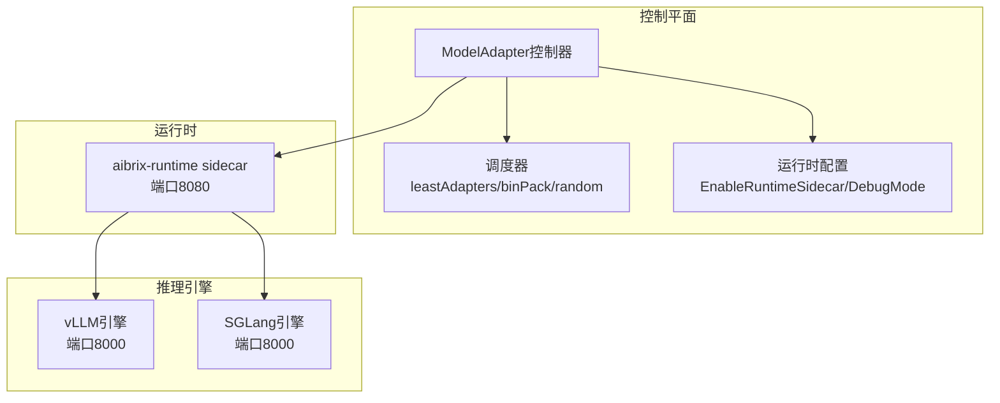
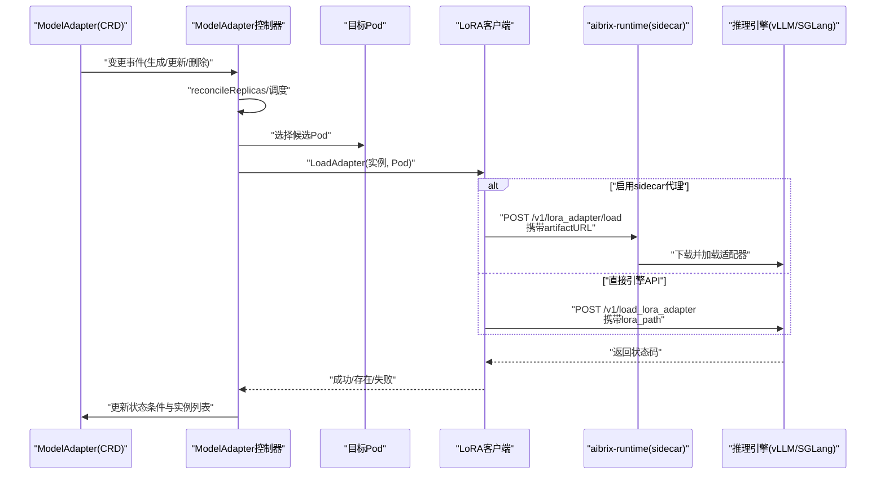
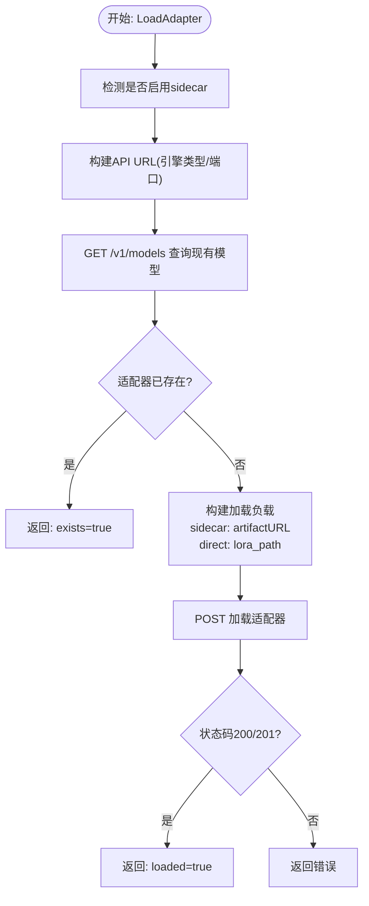
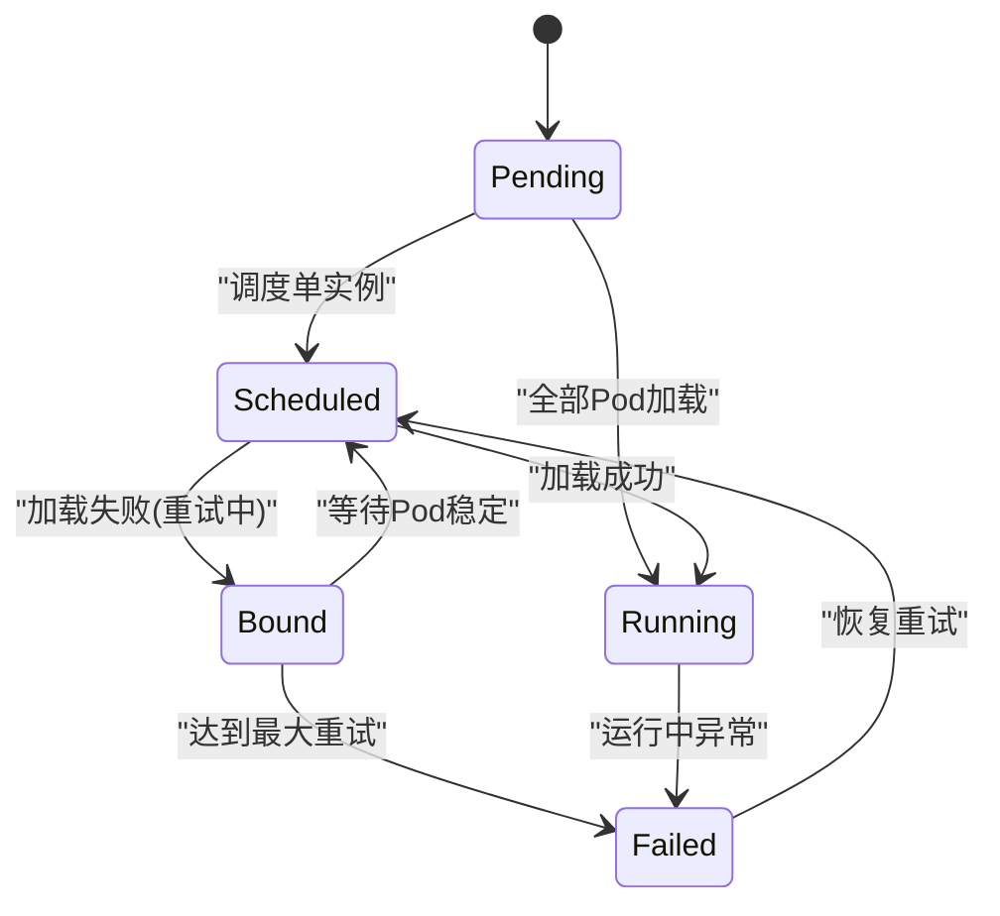
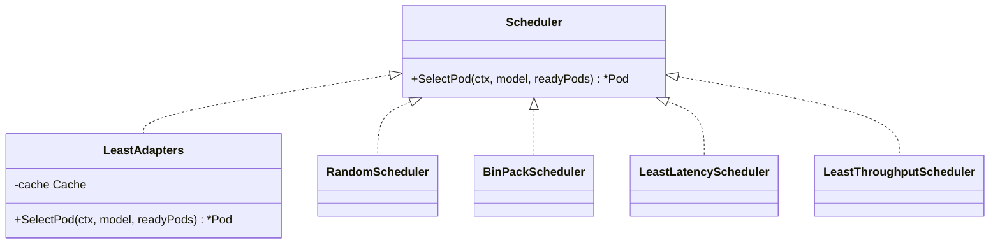
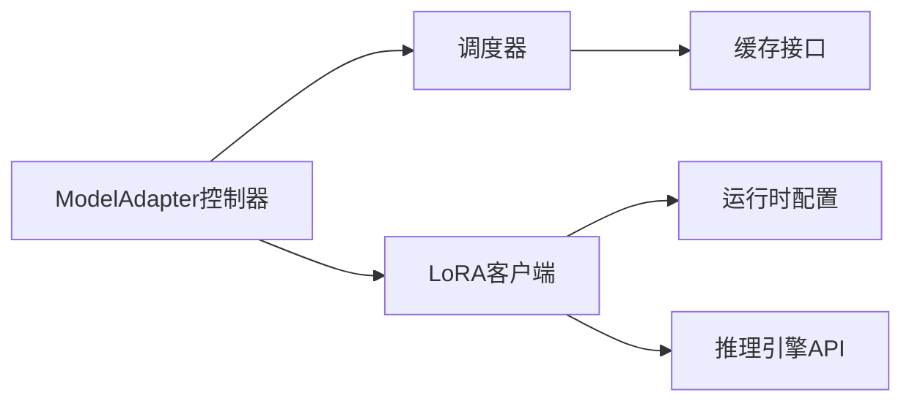

# LoRA微调支持

<cite>
**本文档引用的文件**
- [lora_client.go](file://pkg/controller/modeladapter/lora_client.go)
- [modeladapter_controller.go](file://pkg/controller/modeladapter/modeladapter_controller.go)
- [utils.go](file://pkg/controller/modeladapter/utils.go)
- [modeladapter_types.go](file://api/model/v1alpha1/modeladapter_types.go)
- [scheduler.go](file://pkg/controller/modeladapter/scheduling/scheduler.go)
- [least_adapters.go](file://pkg/controller/modeladapter/scheduling/least_adapters.go)
- [config.go](file://pkg/config/config.go)
- [main.go](file://cmd/controllers/main.go)
- [README.md](file://development/tutorials/lora/README.md)
- [deployment.yaml](file://development/tutorials/lora/deployment.yaml)
- [model_adapter.yaml](file://development/tutorials/lora/model_adapter.yaml)
- [README.md](file://benchmarks/scenarios/lora/README.md)
- [benchmark.py](file://benchmarks/scenarios/lora/benchmark.py)
- [aibrix0.1-lora.ipynb](file://benchmarks/plot/aibrix0.1-lora.ipynb)
</cite>

## 目录
1. [简介](#简介)
2. [项目结构](#项目结构)
3. [核心组件](#核心组件)
4. [架构总览](#架构总览)
5. [详细组件分析](#详细组件分析)
6. [依赖关系分析](#依赖关系分析)
7. [性能考虑](#性能考虑)
8. [故障排除指南](#故障排除指南)
9. [结论](#结论)
10. [附录](#附录)

## 简介
本文件面向AIBrix平台的LoRA（低秩适配）微调支持，系统性阐述LoRA适配器在模型适配器控制器中的实现与应用，涵盖以下关键主题：
- LoRA适配器的加载机制与动态切换
- 与推理引擎的交互方式（直接引擎API与运行时sidecar代理）
- 适配器的热加载与卸载流程
- 多适配器并行处理与调度策略
- 内存管理与性能优化
- 工作流程、配置方法与最佳实践
- 版本管理、冲突解决与回滚机制
- 部署示例、性能测试与故障排除

## 项目结构
LoRA微调支持主要由控制平面控制器与运行时侧组件协作完成：
- 控制器层：ModelAdapter控制器负责资源编排、实例调度、加载/卸载触发与状态更新
- 运行时层：可选的aibrix-runtime sidecar作为代理，统一管理适配器下载与加载
- 推理引擎层：支持vLLM与SGLang两种后端，通过统一或专用API进行适配器操作

**图表来源**
- [modeladapter_controller.go:177-189](file://pkg/controller/modeladapter/modeladapter_controller.go#L177-L189)
- [utils.go:118-158](file://pkg/controller/modeladapter/utils.go#L118-L158)
- [config.go:19-41](file://pkg/config/config.go#L19-L41)

**章节来源**
- [modeladapter_controller.go:127-191](file://pkg/controller/modeladapter/modeladapter_controller.go#L127-L191)
- [utils.go:118-158](file://pkg/controller/modeladapter/utils.go#L118-L158)
- [config.go:19-41](file://pkg/config/config.go#L19-L41)

## 核心组件
- LoRA客户端（loraClient）：封装与推理引擎的HTTP交互，支持直接引擎API与运行时sidecar代理两种路径；负责模型列表查询、适配器加载与卸载
- ModelAdapter控制器：协调Pod实例、触发适配器加载/卸载、维护状态条件、处理重试与回退
- 调度器：基于缓存统计选择最优Pod，支持leastAdapters等策略
- 运行时配置：控制是否启用sidecar代理与调试模式

**章节来源**
- [lora_client.go:75-79](file://pkg/controller/modeladapter/lora_client.go#L75-L79)
- [modeladapter_controller.go:282-299](file://pkg/controller/modeladapter/modeladapter_controller.go#L282-L299)
- [scheduler.go:28-50](file://pkg/controller/modeladapter/scheduling/scheduler.go#L28-L50)
- [config.go:19-41](file://pkg/config/config.go#L19-L41)

## 架构总览
LoRA工作流从CRD（ModelAdapter）出发，控制器根据Pod健康状态与调度策略选择目标实例，通过LoRA客户端向推理引擎发起适配器加载请求。若启用运行时sidecar，则将原始artifactURL委托给sidecar，由其完成下载与加载。

**图表来源**
- [modeladapter_controller.go:417-493](file://pkg/controller/modeladapter/modeladapter_controller.go#L417-L493)
- [lora_client.go:82-107](file://pkg/controller/modeladapter/lora_client.go#L82-L107)
- [utils.go:118-158](file://pkg/controller/modeladapter/utils.go#L118-L158)

## 详细组件分析

### LoRA客户端（loraClient）
- 功能职责
  - 模型列表查询：GET /v1/models，用于检测适配器是否已存在
  - 适配器加载：POST /v1/load_lora_adapter 或 /v1/lora_adapter/load（sidecar）
  - 适配器卸载：POST /v1/unload_lora_adapter 或 /v1/lora_adapter/unload（sidecar）
  - URL构建：根据是否启用sidecar与引擎类型选择不同API路径
  - 凭证与鉴权：支持AdditionalConfig中的api-key头与K8s Secret凭据注入（sidecar路径）

- 关键流程
  - 加载前检查：先查询模型列表，若已存在则跳过加载
  - 负载构建：sidecar路径发送原始artifactURL；直接路径对huggingface://进行转换
  - 错误处理：非200/201状态记录警告并忽略HTTP错误（卸载场景），避免阻塞控制循环

**图表来源**
- [lora_client.go:82-107](file://pkg/controller/modeladapter/lora_client.go#L82-L107)
- [lora_client.go:208-315](file://pkg/controller/modeladapter/lora_client.go#L208-L315)

**章节来源**
- [lora_client.go:82-160](file://pkg/controller/modeladapter/lora_client.go#L82-L160)
- [lora_client.go:208-338](file://pkg/controller/modeladapter/lora_client.go#L208-L338)
- [utils.go:118-158](file://pkg/controller/modeladapter/utils.go#L118-L158)

### ModelAdapter控制器
- 生命周期与阶段
  - 初始化：设置Initialzed条件
  - 实例编排：reconcileReplicas按Spec.Replicas策略（nil=全部Pod，1=单Pod）选择实例
  - 加载阶段：reconcileLoading尝试在候选Pod上加载适配器，支持指数回退与重试
  - 资源阶段：创建Service与EndpointSlice
  - 就绪阶段：更新Ready条件与实例列表

- 卸载流程
  - 删除时触发：遍历Status.Instances，逐个调用loraClient.UnloadAdapter
  - 卸载容忍HTTP错误，确保best-effort清理

- 重试与稳定性
  - 基于Pod就绪时间与注解记录重试次数与时间
  - 指数回退上限控制，避免长时间阻塞

**图表来源**
- [modeladapter_controller.go:417-493](file://pkg/controller/modeladapter/modeladapter_controller.go#L417-L493)
- [modeladapter_controller.go:895-919](file://pkg/controller/modeladapter/modeladapter_controller.go#L895-L919)

**章节来源**
- [modeladapter_controller.go:417-493](file://pkg/controller/modeladapter/modeladapter_controller.go#L417-L493)
- [modeladapter_controller.go:895-919](file://pkg/controller/modeladapter/modeladapter_controller.go#L895-L919)
- [modeladapter_controller.go:1055-1098](file://pkg/controller/modeladapter/modeladapter_controller.go#L1055-L1098)

### 调度器与多适配器并行
- 调度策略工厂：支持random、leastAdapters、binPack、leastLatency、leastThroughput
- leastAdapters策略：基于缓存统计每个Pod上已加载的适配器数量，选择最少者
- 并行处理：当Spec.Replicas为nil时，控制器将适配器加载到所有匹配的活跃Pod

**图表来源**
- [scheduler.go:28-50](file://pkg/controller/modeladapter/scheduling/scheduler.go#L28-L50)
- [least_adapters.go:28-55](file://pkg/controller/modeladapter/scheduling/least_adapters.go#L28-L55)

**章节来源**
- [scheduler.go:28-50](file://pkg/controller/modeladapter/scheduling/scheduler.go#L28-L50)
- [least_adapters.go:28-55](file://pkg/controller/modeladapter/scheduling/least_adapters.go#L28-L55)
- [modeladapter_controller.go:606-626](file://pkg/controller/modeladapter/modeladapter_controller.go#L606-L626)

### 运行时配置与Sidecar代理
- EnableRuntimeSidecar：全局开关，决定是否使用sidecar代理
- DebugMode：调试模式下，控制平面访问localhost:30081
- BuildURLs：根据useSidecar与引擎类型选择API路径与端口
- DetectRuntimeSidecar：检测Pod是否包含aibrix-runtime容器

**章节来源**
- [config.go:19-41](file://pkg/config/config.go#L19-L41)
- [utils.go:118-158](file://pkg/controller/modeladapter/utils.go#L118-L158)
- [utils.go:102-116](file://pkg/controller/modeladapter/utils.go#L102-L116)
- [main.go:152-225](file://cmd/controllers/main.go#L152-L225)

## 依赖关系分析
- 控制器依赖调度器与运行时配置，通过loraClient与推理引擎交互
- loraClient依赖K8s Secret读取凭证（仅sidecar路径），并根据引擎类型选择API
- 调度器依赖缓存接口以获取Pod上的适配器统计

**图表来源**
- [modeladapter_controller.go:177-189](file://pkg/controller/modeladapter/modeladapter_controller.go#L177-L189)
- [lora_client.go:75-79](file://pkg/controller/modeladapter/lora_client.go#L75-L79)
- [scheduler.go:28-50](file://pkg/controller/modeladapter/scheduling/scheduler.go#L28-L50)

**章节来源**
- [modeladapter_controller.go:177-189](file://pkg/controller/modeladapter/modeladapter_controller.go#L177-L189)
- [lora_client.go:75-79](file://pkg/controller/modeladapter/lora_client.go#L75-L79)
- [scheduler.go:28-50](file://pkg/controller/modeladapter/scheduling/scheduler.go#L28-L50)

## 性能考虑
- 并发与吞吐
  - 多适配器部署场景下，建议采用“全部Pod加载”模式以提升并发能力
  - Sidecar代理可减少控制平面与引擎的直接耦合，便于扩展与隔离
- 调度策略
  - 使用leastAdapters策略平衡各Pod上的适配器数量，避免热点
  - binPack策略可提高资源利用率，但需关注冷启动与迁移成本
- 重试与背压
  - 指数回退与最大重试次数限制，防止雪崩效应
  - Pod就绪时间窗口避免抖动导致的频繁迁移
- 测试与评估
  - 提供多并发、多适配器数量的基准测试脚本与可视化分析
  - 支持合并与未合并LoRA权重的对比实验

**章节来源**
- [README.md:140-225](file://benchmarks/scenarios/lora/README.md#L140-L225)
- [benchmark.py:151-179](file://benchmarks/scenarios/lora/benchmark.py#L151-L179)
- [aibrix0.1-lora.ipynb:242-775](file://benchmarks/plot/aibrix0.1-lora.ipynb#L242-L775)

## 故障排除指南
- 常见问题与定位
  - 适配器未加载：检查模型列表查询是否返回200；确认artifactURL格式与凭证正确
  - HTTP错误被忽略：卸载流程对非200/201状态仅记录警告，需结合引擎日志排查
  - Pod不稳定：等待Pod达到就绪且超过回退时间窗口后再重试
  - Sidecar缺失：若启用sidecar但Pod不含aibrix-runtime容器，将回退到直接引擎API
- 建议步骤
  - 查看ModelAdapter状态条件与实例列表
  - 检查重试注解与最后重试时间
  - 在目标Pod内直接调用引擎API验证可用性
  - 启用调试模式观察localhost端口响应

**章节来源**
- [lora_client.go:138-160](file://pkg/controller/modeladapter/lora_client.go#L138-L160)
- [modeladapter_controller.go:1055-1098](file://pkg/controller/modeladapter/modeladapter_controller.go#L1055-L1098)
- [utils.go:102-116](file://pkg/controller/modeladapter/utils.go#L102-L116)

## 结论
AIBrix的LoRA微调支持通过控制器与运行时sidecar的协同，实现了灵活、可扩展的适配器生命周期管理。其核心优势包括：
- 双路径加载机制：兼顾直接引擎API与sidecar代理的灵活性
- 智能调度：基于缓存统计的leastAdapters策略降低热点
- 弹性重试：指数回退与注解驱动的重试状态管理
- 可观测性：丰富的状态条件与日志输出便于运维与排障

## 附录

### 工作流程与配置要点
- 工作流程
  - 创建ModelAdapter CRD，控制器根据Pod选择策略加载适配器
  - 支持单实例或全部实例加载模式
  - 删除时best-effort卸载，确保资源回收
- 配置要点
  - EnableRuntimeSidecar：生产环境建议开启以获得更好的可维护性
  - ArtifactURL支持多种协议，sidecar路径可直接传递原始URL
  - AdditionalConfig.api-key用于鉴权头，CredentialsSecretRef用于sidecar凭证注入

**章节来源**
- [modeladapter_types.go:26-61](file://api/model/v1alpha1/modeladapter_types.go#L26-L61)
- [modeladapter_controller.go:606-626](file://pkg/controller/modeladapter/modeladapter_controller.go#L606-L626)
- [lora_client.go:208-278](file://pkg/controller/modeladapter/lora_client.go#L208-L278)

### 部署示例
- 开发环境示例
  - 部署包含aibrix-runtime sidecar的Deployment
  - 应用ModelAdapter CRD，自动完成适配器加载
- 生产环境建议
  - 使用sidecar代理统一管理适配器下载与加载
  - 配置合适的调度策略与并发参数

**章节来源**
- [deployment.yaml:1-54](file://development/tutorials/lora/deployment.yaml#L1-L54)
- [model_adapter.yaml:1-16](file://development/tutorials/lora/model_adapter.yaml#L1-L16)
- [README.md:1-100](file://development/tutorials/lora/README.md#L1-L100)