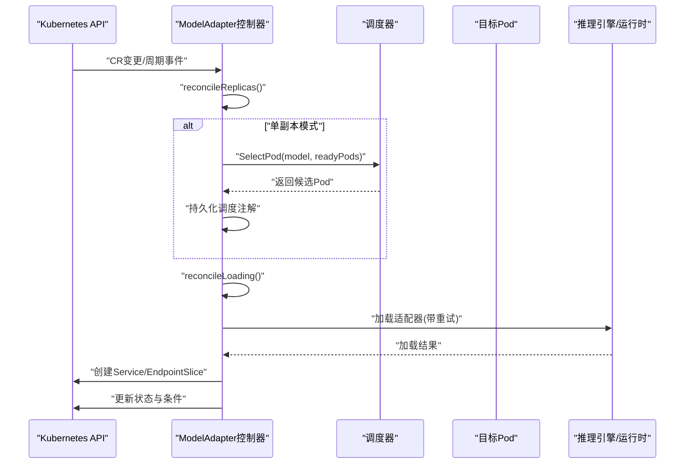
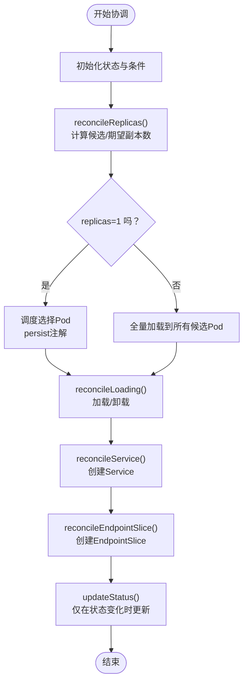
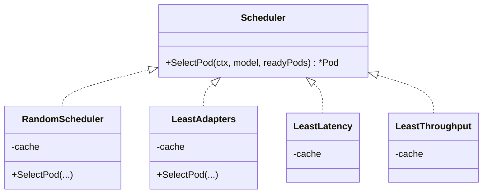
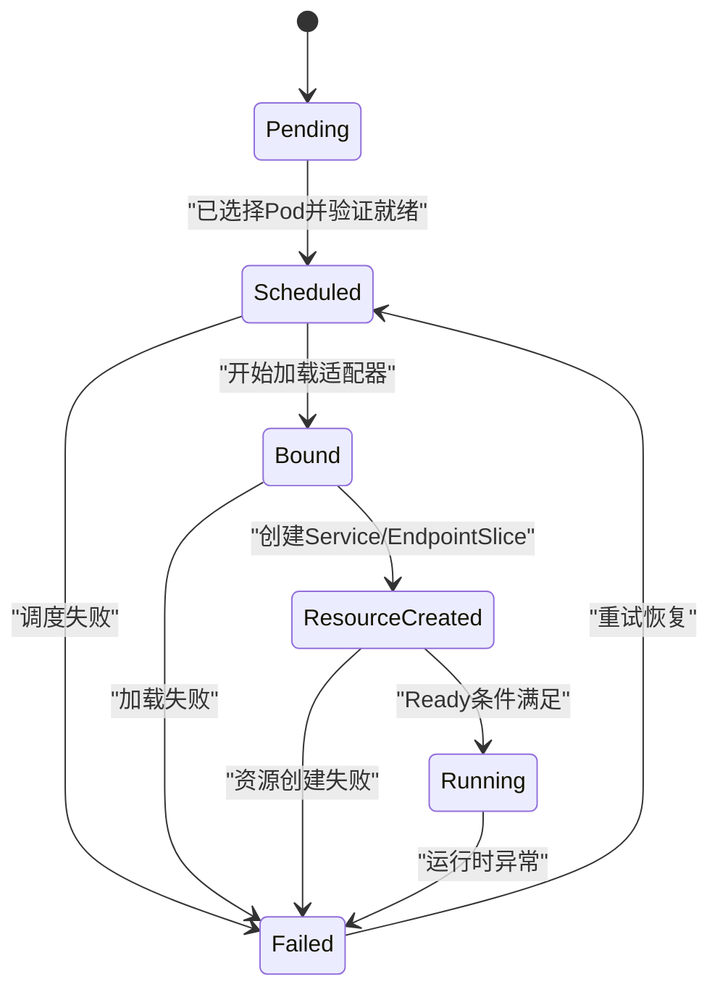
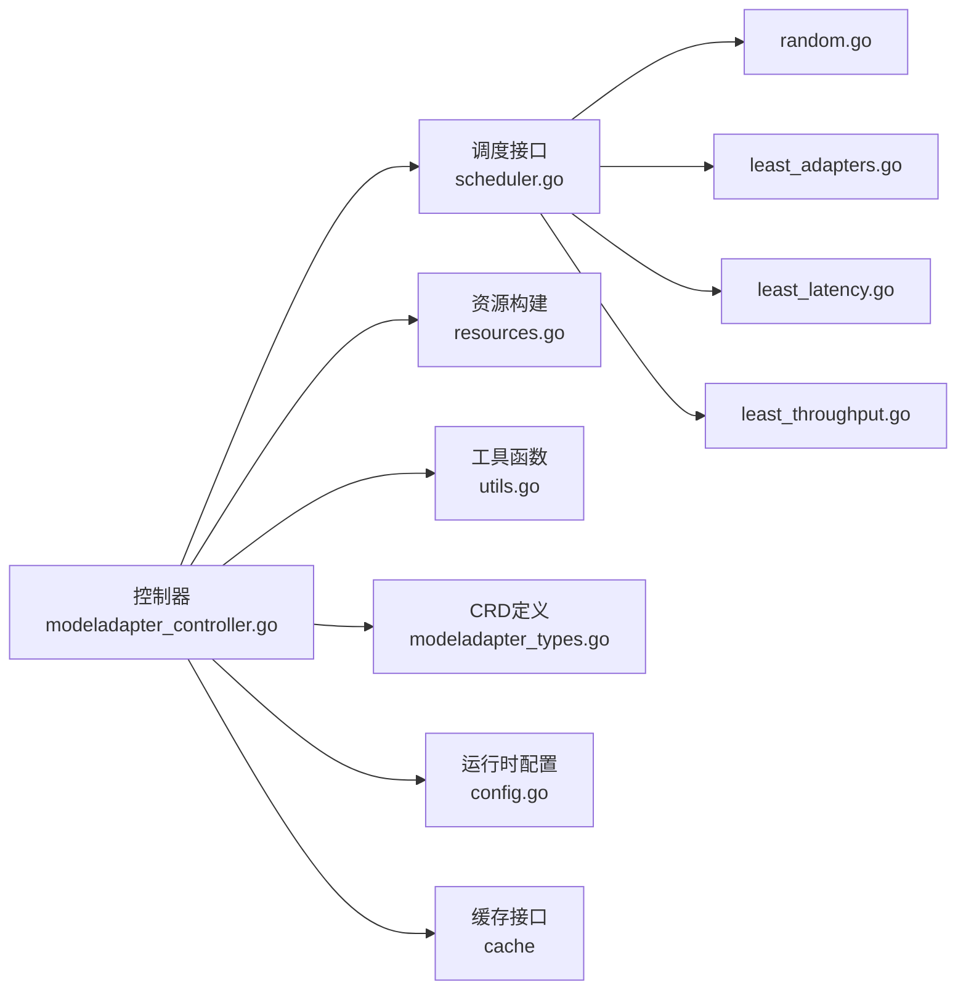

# 模型适配器控制器

<cite>
**本文引用的文件**
- [pkg/controller/modeladapter/modeladapter_controller.go](file://pkg/controller/modeladapter/modeladapter_controller.go)
- [api/model/v1alpha1/modeladapter_types.go](file://api/model/v1alpha1/modeladapter_types.go)
- [config/crd/model/model.aibrix.ai_modeladapters.yaml](file://config/crd/model/model.aibrix.ai_modeladapters.yaml)
- [pkg/controller/modeladapter/scheduling/scheduler.go](file://pkg/controller/modeladapter/scheduling/scheduler.go)
- [pkg/controller/modeladapter/scheduling/random.go](file://pkg/controller/modeladapter/scheduling/random.go)
- [pkg/controller/modeladapter/scheduling/least_adapters.go](file://pkg/controller/modeladapter/scheduling/least_adapters.go)
- [pkg/controller/modeladapter/scheduling/least_latency.go](file://pkg/controller/modeladapter/scheduling/least_latency.go)
- [pkg/controller/modeladapter/scheduling/least_throughput.go](file://pkg/controller/modeladapter/scheduling/least_throughput.go)
- [pkg/controller/modeladapter/resources.go](file://pkg/controller/modeladapter/resources.go)
- [pkg/controller/modeladapter/utils.go](file://pkg/controller/modeladapter/utils.go)
- [samples/adapter/adapter.yaml](file://samples/adapter/adapter.yaml)
- [pkg/config/config.go](file://pkg/config/config.go)
</cite>

## 目录
1. [简介](#简介)
2. [项目结构](#项目结构)
3. [核心组件](#核心组件)
4. [架构总览](#架构总览)
5. [详细组件分析](#详细组件分析)
6. [依赖分析](#依赖分析)
7. [性能考虑](#性能考虑)
8. [故障排查指南](#故障排查指南)
9. [结论](#结论)
10. [附录](#附录)

## 简介
本文件面向AIBrix模型适配器控制器（ModelAdapter Controller），系统性阐述其设计与实现，覆盖以下主题：
- 模型部署生命周期管理：从Pending到Running的阶段推进与条件更新。
- 资源分配策略：单副本与全量副本两种模式下的实例选择与服务暴露。
- 调度算法实现：随机、最少适配器、最低延迟、最低吞吐量等策略的工作原理与适用场景。
- CRD定义与状态机：ModelAdapter CRD字段、状态字段、条件类型与状态机转换。
- 配置选项与参数调优：运行时配置、调度策略选择、重试与超时参数。
- 与推理引擎的集成：通过运行时sidecar或直接引擎API进行模型加载/卸载。
- 实战示例：自定义调度策略扩展、异常处理与状态监控。

## 项目结构
围绕模型适配器控制器的关键目录与文件：
- 控制器实现：pkg/controller/modeladapter/modeladapter_controller.go
- CRD与类型定义：api/model/v1alpha1/modeladapter_types.go；CRD清单：config/crd/model/model.aibrix.ai_modeladapters.yaml
- 调度模块：pkg/controller/modeladapter/scheduling/*
- 资源构建：pkg/controller/modeladapter/resources.go
- 工具函数：pkg/controller/modeladapter/utils.go
- 运行时配置：pkg/config/config.go
- 示例：samples/adapter/adapter.yaml

```mermaid
graph TB
subgraph "API与CRD"
Types["ModelAdapter 类型定义<br/>api/model/v1alpha1/modeladapter_types.go"]
CRD["CRD 清单<br/>config/crd/model/model.aibrix.ai_modeladapters.yaml"]
end
subgraph "控制器"
Ctrl["控制器实现<br/>pkg/controller/modeladapter/modeladapter_controller.go"]
Utils["工具函数<br/>pkg/controller/modeladapter/utils.go"]
Res["资源构建<br/>pkg/controller/modeladapter/resources.go"]
end
subgraph "调度"
SchedIF["调度接口<br/>pkg/controller/modeladapter/scheduling/scheduler.go"]
Rand["随机策略<br/>pkg/controller/modeladapter/scheduling/random.go"]
LeastAd["最少适配器策略<br/>pkg/controller/modeladapter/scheduling/least_adapters.go"]
Latency["最低延迟策略<br/>pkg/controller/modeladapter/scheduling/least_latency.go"]
Throughput["最低吞吐量策略<br/>pkg/controller/modeladapter/scheduling/least_throughput.go"]
end
subgraph "运行时配置"
Cfg["运行时配置<br/>pkg/config/config.go"]
end
subgraph "示例"
Sample["示例CR<br/>samples/adapter/adapter.yaml"]
end
Types --> Ctrl
CRD --> Ctrl
Utils --> Ctrl
Res --> Ctrl
SchedIF --> Ctrl
Rand --> SchedIF
LeastAd --> SchedIF
Latency --> SchedIF
Throughput --> SchedIF
Cfg --> Ctrl
Sample --> Ctrl
```

图表来源
- [pkg/controller/modeladapter/modeladapter_controller.go:127-277](file://pkg/controller/modeladapter/modeladapter_controller.go#L127-L277)
- [api/model/v1alpha1/modeladapter_types.go:26-116](file://api/model/v1alpha1/modeladapter_types.go#L26-L116)
- [config/crd/model/model.aibrix.ai_modeladapters.yaml:37-159](file://config/crd/model/model.aibrix.ai_modeladapters.yaml#L37-L159)
- [pkg/controller/modeladapter/scheduling/scheduler.go:28-50](file://pkg/controller/modeladapter/scheduling/scheduler.go#L28-L50)
- [pkg/controller/modeladapter/scheduling/random.go:28-44](file://pkg/controller/modeladapter/scheduling/random.go#L28-L44)
- [pkg/controller/modeladapter/scheduling/least_adapters.go:28-55](file://pkg/controller/modeladapter/scheduling/least_adapters.go#L28-L55)
- [pkg/controller/modeladapter/scheduling/least_latency.go:29-61](file://pkg/controller/modeladapter/scheduling/least_latency.go#L29-L61)
- [pkg/controller/modeladapter/scheduling/least_throughput.go:29-61](file://pkg/controller/modeladapter/scheduling/least_throughput.go#L29-L61)
- [pkg/controller/modeladapter/resources.go:28-102](file://pkg/controller/modeladapter/resources.go#L28-L102)
- [pkg/controller/modeladapter/utils.go:118-158](file://pkg/controller/modeladapter/utils.go#L118-L158)
- [pkg/config/config.go:19-41](file://pkg/config/config.go#L19-L41)
- [samples/adapter/adapter.yaml:1-40](file://samples/adapter/adapter.yaml#L1-L40)

章节来源
- [pkg/controller/modeladapter/modeladapter_controller.go:127-277](file://pkg/controller/modeladapter/modeladapter_controller.go#L127-L277)
- [api/model/v1alpha1/modeladapter_types.go:26-116](file://api/model/v1alpha1/modeladapter_types.go#L26-L116)
- [config/crd/model/model.aibrix.ai_modeladapters.yaml:37-159](file://config/crd/model/model.aibrix.ai_modeladapters.yaml#L37-L159)

## 核心组件
- ModelAdapter CRD与状态机
  - CRD字段：baseModel、podSelector、schedulerName、artifactURL、credentialsSecretRef、replicas、additionalConfig。
  - 生命周期阶段：Pending、Scheduled、Bound、ResourceCreated、Running、Failed、Unknown、Scaled。
  - 条件类型：Initialized、Scheduled、Bound、ResourceCreated、Ready。
- 控制器职责
  - 周期性同步与事件驱动协调。
  - 副本调度与实例加载。
  - 服务与EndpointSlice资源创建。
  - 状态更新与条件管理。
- 调度器接口与策略
  - 接口：SelectPod(ctx, model, readyPods) -> *Pod。
  - 策略工厂：random、leastAdapters、leastLatency、leastThroughput。
- 资源与工具
  - 构建Service与EndpointSlice。
  - URL构建：支持运行时sidecar或直接引擎API。
  - Pod健康检查、实例列表维护、条件构造。

章节来源
- [api/model/v1alpha1/modeladapter_types.go:26-116](file://api/model/v1alpha1/modeladapter_types.go#L26-L116)
- [pkg/controller/modeladapter/modeladapter_controller.go:417-493](file://pkg/controller/modeladapter/modeladapter_controller.go#L417-L493)
- [pkg/controller/modeladapter/scheduling/scheduler.go:28-50](file://pkg/controller/modeladapter/scheduling/scheduler.go#L28-L50)
- [pkg/controller/modeladapter/resources.go:28-102](file://pkg/controller/modeladapter/resources.go#L28-L102)
- [pkg/controller/modeladapter/utils.go:91-158](file://pkg/controller/modeladapter/utils.go#L91-L158)

## 架构总览
控制器采用“事件驱动 + 周期性同步”的双通道机制：
- 事件触发：CR变更、Pod标签变化、周期性通道事件。
- 协调步骤：副本协调 → 加载协调 → 服务协调 → EndpointSlice协调 → 状态更新。
- 调度：在单副本模式下，基于策略选择目标Pod，并持久化调度决策。

图表来源
- [pkg/controller/modeladapter/modeladapter_controller.go:417-493](file://pkg/controller/modeladapter/modeladapter_controller.go#L417-L493)
- [pkg/controller/modeladapter/scheduling/scheduler.go:35-50](file://pkg/controller/modeladapter/scheduling/scheduler.go#L35-L50)

## 详细组件分析

### 组件A：模型适配器控制器（Reconciler）
- 关键职责
  - 初始化状态与条件，确保首次进入循环即有明确Phase。
  - 副本协调：根据replicas策略（nil=全量，1=单个）决定实例数量与调度。
  - 加载协调：对实例执行加载/卸载，失败时进入重试流程。
  - 资源协调：创建Service与EndpointSlice，暴露推理端点。
  - 状态更新：仅在状态不一致时更新，避免频繁写入。
- 事件与周期同步
  - 使用predicate监听CR变更、标签/注解变化。
  - 监听Pod事件，当匹配模板标签的Pod出现时触发关联的ModelAdapter。
  - 注册周期性任务，定时轮询所有ModelAdapter以保持一致性。
- 异常处理
  - 删除finalizer前尽力卸载适配器。
  - 加载失败时保留Failed状态，持续重试并回退等待。
  - Pod迁移导致实例缺失时清理实例列表并重置相关条件。

图表来源
- [pkg/controller/modeladapter/modeladapter_controller.go:417-493](file://pkg/controller/modeladapter/modeladapter_controller.go#L417-L493)
- [pkg/controller/modeladapter/modeladapter_controller.go:581-618](file://pkg/controller/modeladapter/modeladapter_controller.go#L581-L618)
- [pkg/controller/modeladapter/modeladapter_controller.go:628-697](file://pkg/controller/modeladapter/modeladapter_controller.go#L628-L697)
- [pkg/controller/modeladapter/modeladapter_controller.go:728-800](file://pkg/controller/modeladapter/modeladapter_controller.go#L728-L800)

章节来源
- [pkg/controller/modeladapter/modeladapter_controller.go:313-493](file://pkg/controller/modeladapter/modeladapter_controller.go#L313-L493)

### 组件B：调度器接口与策略
- 接口定义
  - SelectPod(ctx, model, readyPods) -> *Pod。
- 策略实现
  - 随机：从候选Pod中随机选择。
  - 最少适配器：统计每个Pod已加载的适配器数量，选择数量最少者。
  - 最低延迟：聚合队列时延与推理时延均值，选择最小者。
  - 最低吞吐量：聚合提示与生成吞吐，按加权组合选择最小者。
- 工厂方法
  - 根据配置的policyName返回对应调度器实例。

图表来源
- [pkg/controller/modeladapter/scheduling/scheduler.go:28-50](file://pkg/controller/modeladapter/scheduling/scheduler.go#L28-L50)
- [pkg/controller/modeladapter/scheduling/random.go:28-44](file://pkg/controller/modeladapter/scheduling/random.go#L28-L44)
- [pkg/controller/modeladapter/scheduling/least_adapters.go:28-55](file://pkg/controller/modeladapter/scheduling/least_adapters.go#L28-L55)
- [pkg/controller/modeladapter/scheduling/least_latency.go:29-61](file://pkg/controller/modeladapter/scheduling/least_latency.go#L29-L61)
- [pkg/controller/modeladapter/scheduling/least_throughput.go:29-61](file://pkg/controller/modeladapter/scheduling/least_throughput.go#L29-L61)

章节来源
- [pkg/controller/modeladapter/scheduling/scheduler.go:28-50](file://pkg/controller/modeladapter/scheduling/scheduler.go#L28-L50)
- [pkg/controller/modeladapter/scheduling/random.go:28-44](file://pkg/controller/modeladapter/scheduling/random.go#L28-L44)
- [pkg/controller/modeladapter/scheduling/least_adapters.go:28-55](file://pkg/controller/modeladapter/scheduling/least_adapters.go#L28-L55)
- [pkg/controller/modeladapter/scheduling/least_latency.go:29-61](file://pkg/controller/modeladapter/scheduling/least_latency.go#L29-L61)
- [pkg/controller/modeladapter/scheduling/least_throughput.go:29-61](file://pkg/controller/modeladapter/scheduling/least_throughput.go#L29-L61)

### 组件C：CRD定义与状态机
- CRD字段
  - baseModel、podSelector、schedulerName、artifactURL、credentialsSecretRef、replicas、additionalConfig。
  - 打印列：Phase、Desired、Ready、Candidates、Model Path、Age。
- 状态字段
  - phase、candidates、readyReplicas、desiredReplicas、conditions、instances。
- 状态机转换
  - Pending → Scheduled（已选择Pod并验证就绪）→ Bound（正在加载）→ ResourceCreated（已创建服务）→ Running（就绪）。
  - 失败路径：任何阶段失败可进入Failed，控制器持续重试。
  - 缩放：当前未启用多副本，预留Scaled状态。

图表来源
- [api/model/v1alpha1/modeladapter_types.go:63-84](file://api/model/v1alpha1/modeladapter_types.go#L63-L84)
- [api/model/v1alpha1/modeladapter_types.go:86-116](file://api/model/v1alpha1/modeladapter_types.go#L86-L116)
- [config/crd/model/model.aibrix.ai_modeladapters.yaml:16-36](file://config/crd/model/model.aibrix.ai_modeladapters.yaml#L16-L36)

章节来源
- [api/model/v1alpha1/modeladapter_types.go:26-116](file://api/model/v1alpha1/modeladapter_types.go#L26-L116)
- [config/crd/model/model.aibrix.ai_modeladapters.yaml:37-159](file://config/crd/model/model.aibrix.ai_modeladapters.yaml#L37-L159)

### 组件D：资源与URL构建
- Service与EndpointSlice
  - Service使用ClusterIP None，发布NotReady地址，端口8000。
  - EndpointSlice基于实例Pod IP列表，端口8000。
- URL构建
  - 支持运行时sidecar（默认8080）或直接引擎API（默认8000）。
  - Debug模式下使用本地主机+调试端口。
  - 根据引擎类型（如vLLM/SGLang）选择不同API路径。

章节来源
- [pkg/controller/modeladapter/resources.go:28-102](file://pkg/controller/modeladapter/resources.go#L28-L102)
- [pkg/controller/modeladapter/utils.go:118-158](file://pkg/controller/modeladapter/utils.go#L118-L158)

### 组件E：工具函数与配置
- 工具函数
  - 字符串切片比较、实例移除、条件构造、检测运行时sidecar容器。
  - 解析HuggingFace URL路径。
- 运行时配置
  - EnableRuntimeSidecar、DebugMode、ModelAdapterOpt.SchedulerPolicyName。
  - 默认调度策略名在控制器常量中定义。

章节来源
- [pkg/controller/modeladapter/utils.go:30-158](file://pkg/controller/modeladapter/utils.go#L30-L158)
- [pkg/config/config.go:19-41](file://pkg/config/config.go#L19-L41)
- [pkg/controller/modeladapter/modeladapter_controller.go:110-112](file://pkg/controller/modeladapter/modeladapter_controller.go#L110-L112)

## 依赖分析
- 控制器依赖
  - 调度器接口与具体策略实现解耦，便于扩展新策略。
  - 通过缓存查询Pod上已加载模型、指标等信息，支撑策略决策。
  - 通过K8s客户端与Lister/Informer访问Pod、Service、EndpointSlice。
- CRD与控制器
  - CRD定义了字段约束与打印列，控制器据此读取与更新状态。
- 示例与配置
  - 示例CR展示replicas、schedulerName、podSelector等关键字段用法。
  - 运行时配置影响URL构建与是否使用sidecar。

图表来源
- [pkg/controller/modeladapter/modeladapter_controller.go:167-189](file://pkg/controller/modeladapter/modeladapter_controller.go#L167-L189)
- [pkg/controller/modeladapter/scheduling/scheduler.go:35-50](file://pkg/controller/modeladapter/scheduling/scheduler.go#L35-L50)
- [pkg/controller/modeladapter/resources.go:28-102](file://pkg/controller/modeladapter/resources.go#L28-L102)
- [pkg/controller/modeladapter/utils.go:118-158](file://pkg/controller/modeladapter/utils.go#L118-L158)
- [pkg/config/config.go:19-41](file://pkg/config/config.go#L19-L41)

章节来源
- [pkg/controller/modeladapter/modeladapter_controller.go:161-189](file://pkg/controller/modeladapter/modeladapter_controller.go#L161-L189)
- [pkg/controller/modeladapter/scheduling/scheduler.go:35-50](file://pkg/controller/modeladapter/scheduling/scheduler.go#L35-L50)

## 性能考虑
- 调度策略选择
  - 最少适配器：提升资源利用率，降低单节点适配器密度。
  - 最低延迟：优先选择排队与推理时延更低的节点，改善端到端响应。
  - 最低吞吐量：结合提示与生成吞吐，平衡整体吞吐与资源占用。
  - 随机：简单高效，适合无差异化场景或作为基线对比。
- 重试与超时
  - 加载重试次数与回退时间、Pod就绪超时、HTTP请求超时等参数可调，需结合集群规模与网络状况调整。
- 资源与网络
  - Service/EndpointSlice使用NotReady地址发布，有助于网关侧快速失败与重试。
  - Sidecar模式可减少直接引擎API的网络开销与复杂性。

## 故障排查指南
- 常见问题定位
  - Failed状态：查看对应阶段的条件reason与message，确认是调度失败、加载失败还是资源创建失败。
  - PodNotReady：检查Pod就绪探针、容器健康状态与sidecar存在性。
  - 适配器未加载：核对artifactURL、凭证密钥、引擎端点可达性与API路径。
- 排查步骤
  - 查看控制器日志与事件，确认是否进入重试回退。
  - 检查Service/EndpointSlice是否存在且与实例匹配。
  - 使用运行时sidecar或直接引擎API分别测试加载接口。
- 建议
  - 在Debug模式下验证URL与端口映射。
  - 对于大规模集群，优先采用“最少适配器”或“最低延迟”策略以均衡负载与性能。

章节来源
- [pkg/controller/modeladapter/modeladapter_controller.go:442-479](file://pkg/controller/modeladapter/modeladapter_controller.go#L442-L479)
- [pkg/controller/modeladapter/utils.go:102-116](file://pkg/controller/modeladapter/utils.go#L102-L116)

## 结论
模型适配器控制器通过清晰的生命周期与状态机、灵活的调度策略与资源编排，实现了LoRA等适配器在推理引擎中的自动化部署与治理。结合运行时配置与指标缓存，控制器能够在不同场景下选择最优策略，保障高可用与高性能。建议在生产环境中优先采用基于指标的策略（最少适配器/最低延迟/最低吞吐量），并配合合理的重试与超时参数，以获得稳定的服务质量。

## 附录

### A. 自定义调度策略扩展指南
- 实现步骤
  - 新建策略文件，实现Scheduler接口的SelectPod方法。
  - 在工厂函数中注册新策略名称与构造函数。
  - 在控制器中通过配置项切换策略。
- 参考路径
  - [调度接口定义:28-32](file://pkg/controller/modeladapter/scheduling/scheduler.go#L28-L32)
  - [随机策略实现:28-44](file://pkg/controller/modeladapter/scheduling/random.go#L28-L44)
  - [最少适配器策略实现:28-55](file://pkg/controller/modeladapter/scheduling/least_adapters.go#L28-L55)
  - [最低延迟策略实现:29-61](file://pkg/controller/modeladapter/scheduling/least_latency.go#L29-L61)
  - [最低吞吐量策略实现:29-61](file://pkg/controller/modeladapter/scheduling/least_throughput.go#L29-L61)

章节来源
- [pkg/controller/modeladapter/scheduling/scheduler.go:35-50](file://pkg/controller/modeladapter/scheduling/scheduler.go#L35-L50)
- [pkg/controller/modeladapter/scheduling/random.go:28-44](file://pkg/controller/modeladapter/scheduling/random.go#L28-L44)
- [pkg/controller/modeladapter/scheduling/least_adapters.go:28-55](file://pkg/controller/modeladapter/scheduling/least_adapters.go#L28-L55)
- [pkg/controller/modeladapter/scheduling/least_latency.go:29-61](file://pkg/controller/modeladapter/scheduling/least_latency.go#L29-L61)
- [pkg/controller/modeladapter/scheduling/least_throughput.go:29-61](file://pkg/controller/modeladapter/scheduling/least_throughput.go#L29-L61)

### B. 配置选项与参数调优
- 运行时配置
  - EnableRuntimeSidecar：是否使用运行时sidecar。
  - DebugMode：是否启用Debug模式（本地主机+调试端口）。
  - SchedulerPolicyName：调度策略名称（random、leastAdapters、leastLatency、leastThroughput）。
- 重试与超时
  - MaxLoadingRetries、RetryBackoffSeconds、PodReadinessTimeoutSecs、HTTPTimeoutSeconds。
- CRD字段
  - replicas：nil表示全量加载，1表示单副本调度。
  - schedulerName：覆盖默认策略名。
- 示例参考
  - [示例CR:24-32](file://samples/adapter/adapter.yaml#L24-L32)
  - [运行时配置:19-41](file://pkg/config/config.go#L19-L41)
  - [控制器常量:67-76](file://pkg/controller/modeladapter/modeladapter_controller.go#L67-L76)

章节来源
- [pkg/config/config.go:19-41](file://pkg/config/config.go#L19-L41)
- [pkg/controller/modeladapter/modeladapter_controller.go:67-76](file://pkg/controller/modeladapter/modeladapter_controller.go#L67-L76)
- [samples/adapter/adapter.yaml:24-32](file://samples/adapter/adapter.yaml#L24-L32)

### C. 与推理引擎的集成最佳实践
- URL构建策略
  - 优先使用运行时sidecar（端口8080），简化网络与认证。
  - 直接引擎API（端口8000）适用于需要直连引擎的场景。
- 端口与服务
  - Service/EndpointSlice统一使用8000端口，便于路由与网关接入。
- 异常处理
  - 加载失败时保留Failed状态并持续重试，避免业务中断。
  - 删除finalizer前尽力卸载，防止残留资源影响后续部署。

章节来源
- [pkg/controller/modeladapter/utils.go:118-158](file://pkg/controller/modeladapter/utils.go#L118-L158)
- [pkg/controller/modeladapter/resources.go:64-102](file://pkg/controller/modeladapter/resources.go#L64-L102)
- [pkg/controller/modeladapter/modeladapter_controller.go:346-366](file://pkg/controller/modeladapter/modeladapter_controller.go#L346-L366)