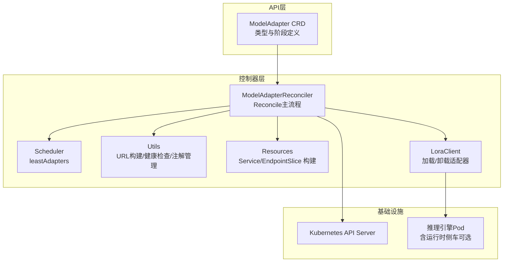
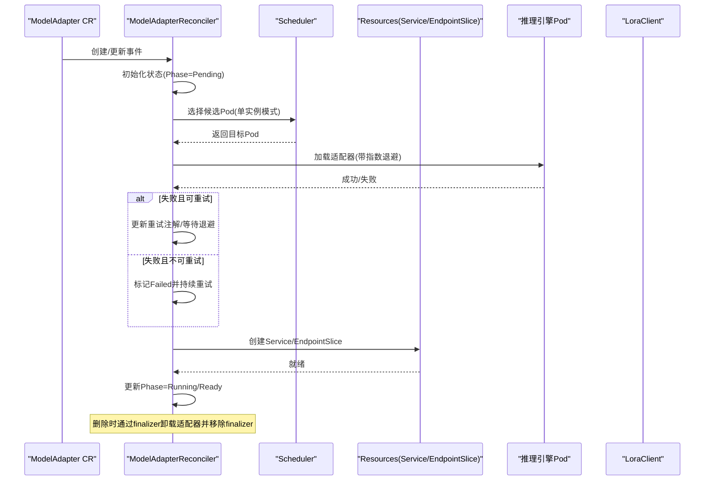
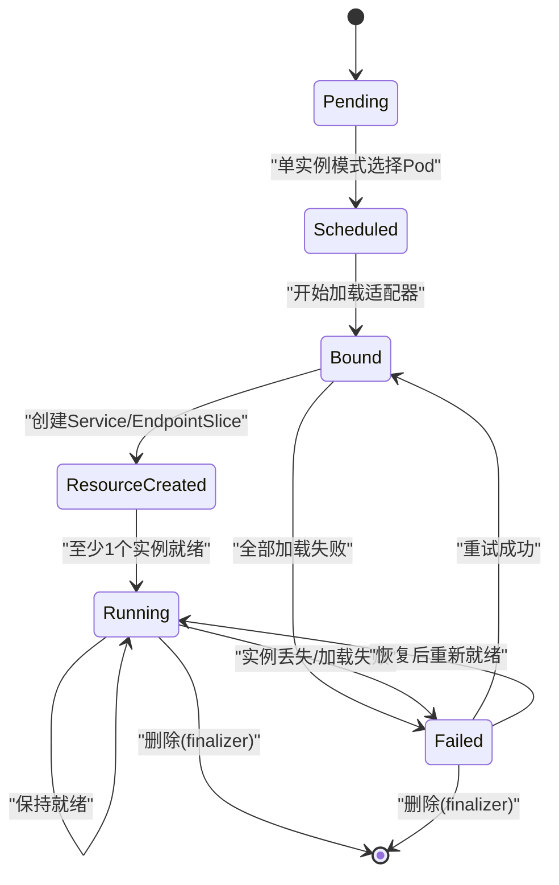
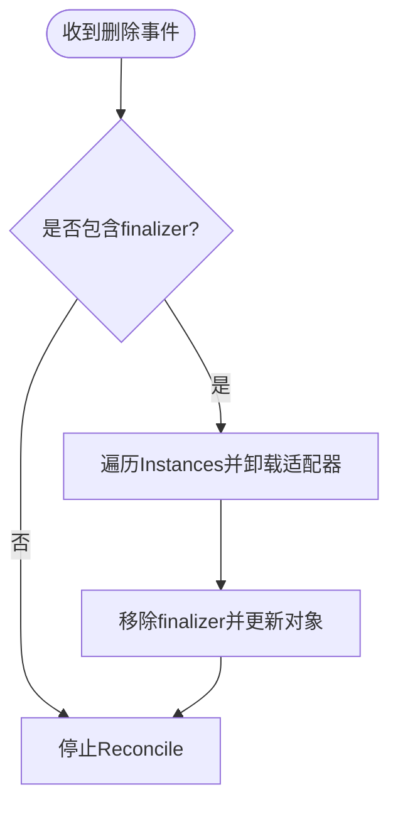
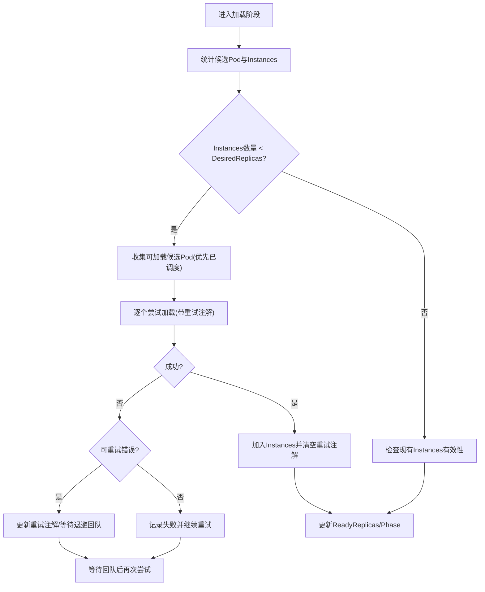
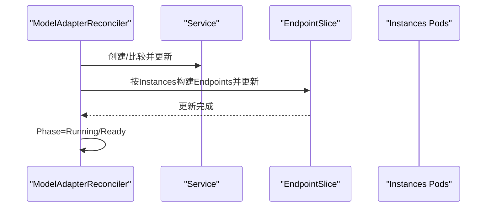
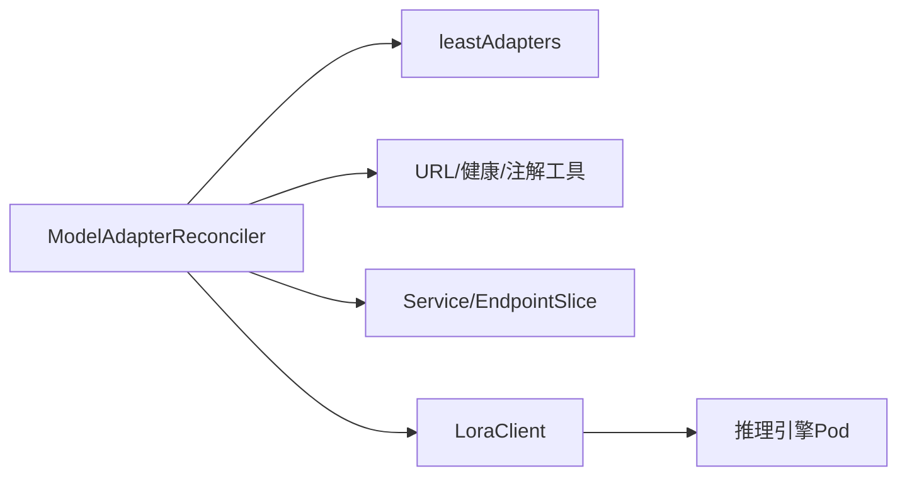

# 模型适配器生命周期管理

<cite>
**本文引用的文件列表**
- [modeladapter_types.go](file://api/model/v1alpha1/modeladapter_types.go)
- [modeladapter_controller.go](file://pkg/controller/modeladapter/modeladapter_controller.go)
- [resources.go](file://pkg/controller/modeladapter/resources.go)
- [utils.go](file://pkg/controller/modeladapter/utils.go)
- [least_adapters.go](file://pkg/controller/modeladapter/scheduling/least_adapters.go)
- [modeladapter.go](file://pkg/utils/modeladapter.go)
- [lora_client.go](file://pkg/controller/modeladapter/lora_client.go)
- [modeladapter_controller_unit_tests.go](file://pkg/controller/modeladapter/modeladapter_controller_unit_tests.go)
- [modeladapter_controller_test.go](file://pkg/controller/modeladapter/modeladapter_controller_test.go)
</cite>

## 目录
1. [简介](#简介)
2. [项目结构](#项目结构)
3. [核心组件](#核心组件)
4. [架构总览](#架构总览)
5. [详细组件分析](#详细组件分析)
6. [依赖关系分析](#依赖关系分析)
7. [性能考量](#性能考量)
8. [故障排查指南](#故障排查指南)
9. [结论](#结论)
10. [附录](#附录)

## 简介
本文件面向AIBrix模型适配器（ModelAdapter）的生命周期管理，系统性阐述从创建到删除的完整流程，包括初始化、调度、加载、就绪与清理各阶段的状态转换、触发条件、状态检查逻辑、错误处理与重试策略，并重点解析finalizer机制如何确保资源清理的原子性与完整性。同时提供可操作的最佳实践与排障建议，帮助开发者在生产环境中稳定运行模型适配器。

## 项目结构
围绕模型适配器生命周期的关键模块如下：
- CRD定义：模型适配器的规格、状态与阶段常量
- 控制器：负责Reconcile循环、阶段编排、状态更新与资源管理
- 调度器：基于缓存选择最优推理引擎Pod
- 资源构建：Service与EndpointSlice的生成
- 工具函数：URL构建、Pod健康判断、重试注解管理
- Lora客户端：与推理引擎或运行时侧车交互进行适配器加载/卸载
- 校验工具：对模型制品URL进行Schema校验

图表来源
- [modeladapter_types.go:63-116](file://api/model/v1alpha1/modeladapter_types.go#L63-L116)
- [modeladapter_controller.go:127-191](file://pkg/controller/modeladapter/modeladapter_controller.go#L127-L191)
- [resources.go:28-102](file://pkg/controller/modeladapter/resources.go#L28-L102)
- [utils.go:118-159](file://pkg/controller/modeladapter/utils.go#L118-L159)
- [least_adapters.go:32-55](file://pkg/controller/modeladapter/scheduling/least_adapters.go#L32-L55)
- [lora_client.go:302-338](file://pkg/controller/modeladapter/lora_client.go#L302-L338)

章节来源
- [modeladapter_types.go:63-116](file://api/model/v1alpha1/modeladapter_types.go#L63-L116)
- [modeladapter_controller.go:127-191](file://pkg/controller/modeladapter/modeladapter_controller.go#L127-L191)

## 核心组件
- 模型适配器CRD与阶段
  - 阶段枚举：Pending、Scheduled、Bound、ResourceCreated、Running、Failed、Unknown、Scaled
  - 状态字段：Phase、Candidates、ReadyReplicas、DesiredReplicas、Conditions、Instances
- 控制器Reconcile主流程
  - 初始状态设置、阶段编排、服务与EndpointSlice创建、实例加载与就绪检查
- 调度器
  - 基于缓存统计每Pod已加载适配器数量，选择“最少”的Pod
- 资源构建
  - Service（ClusterIP None，发布未就绪地址）、EndpointSlice（按实例Pod IP）
- 工具函数
  - URL构建（运行时侧车或直接引擎API）、Pod健康/就绪判断、重试注解管理
- Lora客户端
  - 通过HTTP调用加载/卸载适配器，支持不同引擎路径

章节来源
- [modeladapter_types.go:63-116](file://api/model/v1alpha1/modeladapter_types.go#L63-L116)
- [modeladapter_controller.go:417-493](file://pkg/controller/modeladapter/modeladapter_controller.go#L417-L493)
- [resources.go:28-102](file://pkg/controller/modeladapter/resources.go#L28-L102)
- [utils.go:118-159](file://pkg/controller/modeladapter/utils.go#L118-L159)
- [least_adapters.go:32-55](file://pkg/controller/modeladapter/scheduling/least_adapters.go#L32-L55)
- [lora_client.go:302-338](file://pkg/controller/modeladapter/lora_client.go#L302-L338)

## 架构总览
模型适配器生命周期由控制器驱动，遵循“阶段化推进 + 条件化状态 + 注解级重试”的设计。控制器通过Reconcile循环在多个阶段间迭代推进，直到达到目标状态（Running），并在删除时通过finalizer确保资源清理。

图表来源
- [modeladapter_controller.go:313-369](file://pkg/controller/modeladapter/modeladapter_controller.go#L313-L369)
- [modeladapter_controller.go:417-493](file://pkg/controller/modeladapter/modeladapter_controller.go#L417-L493)
- [modeladapter_controller.go:895-919](file://pkg/controller/modeladapter/modeladapter_controller.go#L895-L919)
- [resources.go:28-102](file://pkg/controller/modeladapter/resources.go#L28-L102)
- [lora_client.go:302-338](file://pkg/controller/modeladapter/lora_client.go#L302-L338)

## 详细组件分析

### 生命周期阶段与状态转换
- 初始化阶段（Pending）
  - 触发条件：首次Reconcile且无状态
  - 行为：设置初始Phase=Pending，写入Initialized条件，短暂回队
- 调度阶段（Scheduled）
  - 触发条件：单实例模式下需要新增实例；多实例模式下需计算DesiredReplicas
  - 行为：使用调度器选择Pod，记录注解中“已调度Pod”，更新Scheduled条件
- 加载阶段（Bound）
  - 触发条件：进入加载步骤
  - 行为：尝试在候选Pod上加载适配器；对可重试错误采用指数退避；成功后加入Instances
- 资源创建阶段（ResourceCreated）
  - 触发条件：Service/EndpointSlice尚未存在或需要更新
  - 行为：创建Service（ClusterIP None）与EndpointSlice（按实例Pod IP），更新ResourceCreated条件
- 就绪阶段（Running）
  - 触发条件：至少一个实例成功加载且Service/EndpointSlice可用
  - 行为：更新Ready条件，Phase=Running
- 失败阶段（Failed）
  - 触发条件：所有候选Pod均加载失败
  - 行为：标记Failed并持续重试；恢复后自动回到Running
- 清理阶段（删除时）
  - 触发条件：对象DeletionTimestamp非空且包含finalizer
  - 行为：卸载所有实例上的适配器，移除finalizer并停止Reconcile

图表来源
- [modeladapter_types.go:66-84](file://api/model/v1alpha1/modeladapter_types.go#L66-L84)
- [modeladapter_controller.go:417-493](file://pkg/controller/modeladapter/modeladapter_controller.go#L417-L493)
- [modeladapter_controller.go:895-919](file://pkg/controller/modeladapter/modeladapter_controller.go#L895-L919)

章节来源
- [modeladapter_types.go:66-84](file://api/model/v1alpha1/modeladapter_types.go#L66-L84)
- [modeladapter_controller.go:417-493](file://pkg/controller/modeladapter/modeladapter_controller.go#L417-L493)

### Finalizer机制与资源清理
- 添加finalizer
  - 在对象未被删除且不存在finalizer时，控制器为其添加finalizer并持久化
- 删除finalizer
  - 对象被删除且包含finalizer时，控制器先卸载所有实例上的适配器，再移除finalizer并更新对象
- 清理策略
  - 卸载采用best-effort：若实例Pod已不存在，仅记录警告并跳过
  - 卸载成功后返回，不阻塞删除流程

图表来源
- [modeladapter_controller.go:332-366](file://pkg/controller/modeladapter/modeladapter_controller.go#L332-L366)
- [modeladapter_controller.go:895-919](file://pkg/controller/modeladapter/modeladapter_controller.go#L895-L919)

章节来源
- [modeladapter_controller.go:332-366](file://pkg/controller/modeladapter/modeladapter_controller.go#L332-L366)
- [modeladapter_controller.go:895-919](file://pkg/controller/modeladapter/modeladapter_controller.go#L895-L919)

### 调度与加载逻辑
- 调度
  - 单实例模式：根据调度策略选择“当前已加载适配器数最少”的Pod
  - 多实例模式：按Spec.Replicas决定DesiredReplicas，逐个加载
- 加载
  - 重试策略：指数退避（首秒0，随后5×2^n，上限5分钟），最大重试次数固定
  - 可重试错误：连接拒绝、超时、路由不可达、临时失败、服务不可用、网关错误等
  - 成功后清空重试注解，失败则记录错误并等待下次回队
- 实例迁移
  - 若检测到实例被移除，清除Instances并回退到Scheduled/Ready=False，待新实例加载成功后恢复

图表来源
- [modeladapter_controller.go:728-893](file://pkg/controller/modeladapter/modeladapter_controller.go#L728-L893)
- [modeladapter_controller.go:1055-1126](file://pkg/controller/modeladapter/modeladapter_controller.go#L1055-L1126)
- [least_adapters.go:38-55](file://pkg/controller/modeladapter/scheduling/least_adapters.go#L38-L55)

章节来源
- [modeladapter_controller.go:728-893](file://pkg/controller/modeladapter/modeladapter_controller.go#L728-L893)
- [modeladapter_controller.go:1055-1126](file://pkg/controller/modeladapter/modeladapter_controller.go#L1055-L1126)
- [least_adapters.go:38-55](file://pkg/controller/modeladapter/scheduling/least_adapters.go#L38-L55)

### 资源创建与就绪
- Service
  - ClusterIP=None，发布未就绪地址，便于EndpointSlice动态更新
  - OwnerReference指向ModelAdapter，作为受控资源
- EndpointSlice
  - 依据Instances中的Pod IP动态维护Endpoints
  - 更新后将Phase置为Running
- 就绪判定
  - 至少一个实例成功加载且Service/EndpointSlice可用即视为Running

图表来源
- [modeladapter_controller.go:934-1011](file://pkg/controller/modeladapter/modeladapter_controller.go#L934-L1011)
- [resources.go:28-102](file://pkg/controller/modeladapter/resources.go#L28-L102)

章节来源
- [modeladapter_controller.go:934-1011](file://pkg/controller/modeladapter/modeladapter_controller.go#L934-L1011)
- [resources.go:28-102](file://pkg/controller/modeladapter/resources.go#L28-L102)

### 错误处理与重试策略
- 重试注解
  - 使用注解记录每个Pod的重试次数与上次重试时间，键名包含Pod名称
  - 成功后清空注解；失败则按指数退避策略等待
- 退避计算
  - 公式：5秒 × 2^重试次数，上限5分钟
- 可重试错误
  - 连接类/网络类/服务类错误会被识别为可重试
- 最大重试
  - 达到上限后不再重试，标记Failed并持续回队观察

章节来源
- [modeladapter_controller.go:1128-1176](file://pkg/controller/modeladapter/modeladapter_controller.go#L1128-L1176)
- [modeladapter_controller.go:1217-1235](file://pkg/controller/modeladapter/modeladapter_controller.go#L1217-L1235)
- [modeladapter_controller.go:1100-1126](file://pkg/controller/modeladapter/modeladapter_controller.go#L1100-L1126)

### Pod健康与稳定性检查
- 就绪稳定性
  - Pod最近一次就绪时间距当前小于阈值（默认5秒）则认为不稳定，延迟调度
- 健康判断
  - 终止中或未就绪的Pod不参与调度或加载
- 实例清理
  - 当检测到实例被移除时，清理Instances并回退到Pending/Scheduled/Ready=False

章节来源
- [modeladapter_controller.go:1029-1048](file://pkg/controller/modeladapter/modeladapter_controller.go#L1029-L1048)
- [modeladapter_controller.go:1050-1053](file://pkg/controller/modeladapter/modeladapter_controller.go#L1050-L1053)
- [modeladapter_controller.go:507-554](file://pkg/controller/modeladapter/modeladapter_controller.go#L507-L554)

### URL构建与引擎交互
- URL构建
  - 支持运行时侧车与直接引擎两种路径
  - Debug模式下使用本地端口映射
- 引擎类型
  - 自动识别VLLM/SGLang并选择对应API路径
- 卸载payload
  - 侧车模式包含本地清理标志，非侧车模式仅包含适配器名称

章节来源
- [utils.go:118-159](file://pkg/controller/modeladapter/utils.go#L118-L159)
- [lora_client.go:317-338](file://pkg/controller/modeladapter/lora_client.go#L317-L338)

### 资产URL校验
- 支持Schema：s3://、gcs://、tos://、huggingface://、hf://、绝对路径/
- 不支持Schema将报错

章节来源
- [modeladapter.go:24-34](file://pkg/utils/modeladapter.go#L24-L34)

## 依赖关系分析
- 控制器依赖
  - 调度器：基于缓存统计每Pod适配器数量
  - 资源构建：Service/EndpointSlice
  - Lora客户端：HTTP加载/卸载
  - 工具函数：URL构建、健康检查、注解管理
- 关键耦合点
  - 注解用于跨轮次保存重试状态，避免重复加载
  - Finalizer确保删除时的原子性清理
  - Conditions与Phase共同反映生命周期状态

图表来源
- [modeladapter_controller.go:167-189](file://pkg/controller/modeladapter/modeladapter_controller.go#L167-L189)
- [least_adapters.go:32-55](file://pkg/controller/modeladapter/scheduling/least_adapters.go#L32-L55)
- [utils.go:118-159](file://pkg/controller/modeladapter/utils.go#L118-L159)
- [resources.go:28-102](file://pkg/controller/modeladapter/resources.go#L28-L102)
- [lora_client.go:302-338](file://pkg/controller/modeladapter/lora_client.go#L302-L338)

章节来源
- [modeladapter_controller.go:167-189](file://pkg/controller/modeladapter/modeladapter_controller.go#L167-L189)
- [least_adapters.go:32-55](file://pkg/controller/modeladapter/scheduling/least_adapters.go#L32-L55)
- [utils.go:118-159](file://pkg/controller/modeladapter/utils.go#L118-L159)
- [resources.go:28-102](file://pkg/controller/modeladapter/resources.go#L28-L102)
- [lora_client.go:302-338](file://pkg/controller/modeladapter/lora_client.go#L302-L338)

## 性能考量
- 回队间隔
  - 默认回队间隔为10秒，避免频繁轮询
- 指数退避
  - 首次0秒，随后每次翻倍，上限5分钟，平衡快速恢复与系统压力
- 调度策略
  - 选择“最少适配器数”的Pod，有助于均衡负载
- 资源更新
  - EndpointSlice按实例动态更新，减少不必要的全量重建

章节来源
- [modeladapter_controller.go:64-76](file://pkg/controller/modeladapter/modeladapter_controller.go#L64-L76)
- [modeladapter_controller.go:1217-1235](file://pkg/controller/modeladapter/modeladapter_controller.go#L1217-L1235)
- [least_adapters.go:38-55](file://pkg/controller/modeladapter/scheduling/least_adapters.go#L38-L55)
- [modeladapter_controller.go:994-1010](file://pkg/controller/modeladapter/modeladapter_controller.go#L994-L1010)

## 故障排查指南
- 常见问题定位
  - 无法加载适配器：检查重试注解与退避时间；确认引擎可达与端口正确
  - 服务/EndpointSlice未创建：检查控制器权限与OwnerReference设置
  - 删除卡住：确认finalizer是否存在，卸载是否成功
- 关键日志与指标
  - 控制器日志包含“加载成功/失败”、“重试注解更新”、“Service/EndpointSlice创建”等信息
  - Phase与Conditions变化可作为状态观测依据
- 单元测试参考
  - 可重试错误识别、重试注解增删改查、指数退避计算、Pod就绪稳定性判断等均有覆盖

章节来源
- [modeladapter_controller_unit_tests.go:35-98](file://pkg/controller/modeladapter/modeladapter_controller_unit_tests.go#L35-L98)
- [modeladapter_controller_unit_tests.go:100-194](file://pkg/controller/modeladapter/modeladapter_controller_unit_tests.go#L100-L194)
- [modeladapter_controller_unit_tests.go:415-464](file://pkg/controller/modeladapter/modeladapter_controller_unit_tests.go#L415-L464)
- [modeladapter_controller_test.go:54-90](file://pkg/controller/modeladapter/modeladapter_controller_test.go#L54-L90)
- [modeladapter_controller_test.go:231-296](file://pkg/controller/modeladapter/modeladapter_controller_test.go#L231-L296)

## 结论
AIBrix模型适配器生命周期管理通过“阶段化推进 + 条件化状态 + 注解级重试 + finalizer清理”的组合，实现了从创建到删除的闭环控制。调度器与指数退避策略保证了高可用与低冲突，而Service/EndpointSlice的动态更新确保了流量的正确路由。删除时的finalizer机制确保了资源清理的原子性与完整性。结合本文提供的最佳实践与排障建议，可在生产环境中稳定地管理模型适配器的全生命周期。

## 附录
- 最佳实践
  - 合理配置Replicas：多实例模式下建议使用nil（全量加载）或1（单实例）
  - 监控重试注解：关注Pod维度的重试次数与时间，及时发现网络/引擎异常
  - 调度策略：优先使用“最少适配器数”策略，避免热点Pod
  - 删除流程：确保finalizer存在且卸载成功，避免悬挂资源
- 示例参考
  - 创建/更新/删除流程可参考控制器主流程与删除分支
  - 重试与退避逻辑可参考注解管理与退避计算
  - 资源创建与就绪可参考Service/EndpointSlice构建与更新