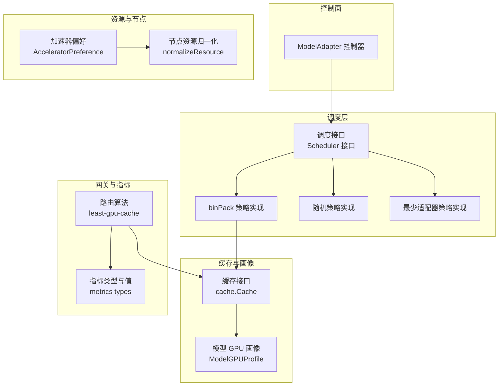
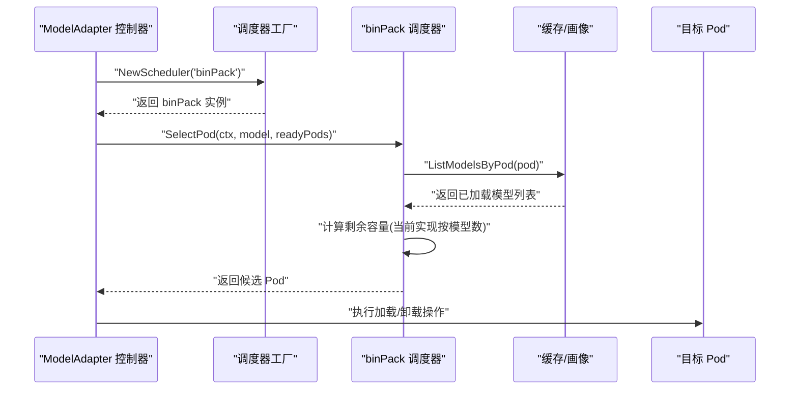
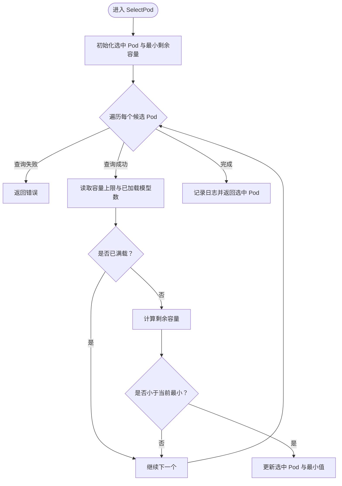
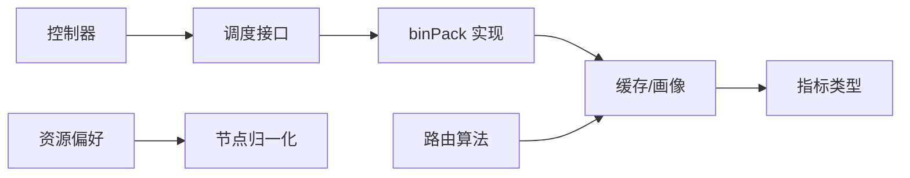

# 二进制打包调度策略

<cite>
**本文引用的文件**   
- [bin_pack.go](file://pkg/controller/modeladapter/scheduling/bin_pack.go)
- [scheduler.go](file://pkg/controller/modeladapter/scheduling/scheduler.go)
- [random.go](file://pkg/controller/modeladapter/scheduling/random.go)
- [least_adapters.go](file://pkg/controller/modeladapter/scheduling/least_adapters.go)
- [modeladapter_controller.go](file://pkg/controller/modeladapter/modeladapter_controller.go)
- [model_gpu_profile.go](file://pkg/cache/model_gpu_profile.go)
- [types.go](file://pkg/metrics/types.go)
- [least_gpu_cache.go](file://pkg/plugins/gateway/algorithms/least_gpu_cache.go)
- [provision.go](file://apps/console/api/resource_manager/types/provision.go)
- [kubernetes.go](file://apps/console/api/resource_manager/catalog/kubernetes.go)
- [deploy.yaml](file://benchmarks/scenarios/autoscaling/deepseek-llm-7b-chat/deploy.yaml)
</cite>

## 目录
1. [引言](#引言)
2. [项目结构](#项目结构)
3. [核心组件](#核心组件)
4. [架构总览](#架构总览)
5. [详细组件分析](#详细组件分析)
6. [依赖分析](#依赖分析)
7. [性能考虑](#性能考虑)
8. [故障排查指南](#故障排查指南)
9. [结论](#结论)
10. [附录](#附录)

## 引言
本技术文档围绕 AIBrix 的“二进制打包（binPack）”调度策略展开，系统阐述其设计思想、实现细节与工程化落地方式。该策略借鉴经典二进制打包思想，在有限资源约束下最大化设备利用率，优先选择“剩余空间最小”的目标容器进行模型适配器加载，从而降低碎片化并提升整体资源填充度。

同时，文档结合仓库中现有的 GPU 资源画像、指标体系与路由算法，说明如何在多维度资源（如显存占用、吞吐、延迟等）上进行综合评估，并给出在混合硬件环境下（不同 GPU 型号、带宽、精度支持）的部署建议与优化路径。此外，还讨论了与 Kubernetes 资源管理的协同机制、策略适用场景、性能基准测试思路与打包效率优化方法。

## 项目结构
与“二进制打包调度策略”直接相关的核心目录与文件如下：
- 调度策略工厂与具体实现：pkg/controller/modeladapter/scheduling
- 模型适配器控制器：pkg/controller/modeladapter/modeladapter_controller.go
- GPU 资源画像与指标：pkg/cache/model_gpu_profile.go、pkg/metrics/types.go
- 网关路由与资源评估：pkg/plugins/gateway/algorithms/least_gpu_cache.go
- 资源偏好与节点归一化：apps/console/api/resource_manager/types/provision.go、apps/console/api/resource_manager/catalog/kubernetes.go
- 基准场景示例：benchmarks/scenarios/autoscaling/deepseek-llm-7b-chat/deploy.yaml

图表来源
- [scheduler.go:34-50](file://pkg/controller/modeladapter/scheduling/scheduler.go#L34-L50)
- [bin_pack.go:28-62](file://pkg/controller/modeladapter/scheduling/bin_pack.go#L28-L62)
- [random.go:28-44](file://pkg/controller/modeladapter/scheduling/random.go#L28-L44)
- [least_adapters.go:28-55](file://pkg/controller/modeladapter/scheduling/least_adapters.go#L28-L55)
- [modeladapter_controller.go:699-714](file://pkg/controller/modeladapter/modeladapter_controller.go#L699-L714)
- [model_gpu_profile.go:59-196](file://pkg/cache/model_gpu_profile.go#L59-L196)
- [least_gpu_cache.go:52-99](file://pkg/plugins/gateway/algorithms/least_gpu_cache.go#L52-L99)
- [types.go:79-101](file://pkg/metrics/types.go#L79-L101)
- [provision.go:164-192](file://apps/console/api/resource_manager/types/provision.go#L164-L192)
- [kubernetes.go:241-283](file://apps/console/api/resource_manager/catalog/kubernetes.go#L241-L283)

章节来源
- [scheduler.go:34-50](file://pkg/controller/modeladapter/scheduling/scheduler.go#L34-L50)
- [bin_pack.go:28-62](file://pkg/controller/modeladapter/scheduling/bin_pack.go#L28-L62)
- [modeladapter_controller.go:699-714](file://pkg/controller/modeladapter/modeladapter_controller.go#L699-L714)

## 核心组件
- 调度接口与工厂
  - 接口定义：SelectPod(ctx, model, readyPods) -> *v1.Pod
  - 工厂方法：根据策略名称返回对应调度器实例
- binPack 策略
  - 逻辑：遍历可调度 Pod，基于“剩余容量最小”选择目标 Pod
  - 当前实现中“剩余容量”以模型数量计数，未来可扩展为显存占用、吞吐等多维评估
- 其他策略对比
  - 随机策略：均匀分布，便于基准测试
  - 最少适配器策略：优先选择已有模型数最少的 Pod，降低负载不均

章节来源
- [scheduler.go:28-50](file://pkg/controller/modeladapter/scheduling/scheduler.go#L28-L50)
- [bin_pack.go:38-62](file://pkg/controller/modeladapter/scheduling/bin_pack.go#L38-L62)
- [random.go:38-44](file://pkg/controller/modeladapter/scheduling/random.go#L38-L44)
- [least_adapters.go:38-55](file://pkg/controller/modeladapter/scheduling/least_adapters.go#L38-L55)

## 架构总览
下图展示了“二进制打包调度策略”在控制面与数据面的交互关系，以及与资源画像、指标采集和节点资源归一化的协作。

图表来源
- [modeladapter_controller.go:699-714](file://pkg/controller/modeladapter/modeladapter_controller.go#L699-L714)
- [scheduler.go:34-50](file://pkg/controller/modeladapter/scheduling/scheduler.go#L34-L50)
- [bin_pack.go:38-62](file://pkg/controller/modeladapter/scheduling/bin_pack.go#L38-L62)

## 详细组件分析

### 组件A：binPack 调度器
- 设计要点
  - 贪心选择：每次从候选 Pod 中选择“剩余容量最小”的 Pod
  - 容量度量：当前实现以“模型数量上限与已加载数量之差”衡量剩余容量
  - 可扩展性：未来可替换为更精细的资源画像与指标评估
- 关键流程（含决策分支）

图表来源
- [bin_pack.go:38-62](file://pkg/controller/modeladapter/scheduling/bin_pack.go#L38-L62)

章节来源
- [bin_pack.go:38-62](file://pkg/controller/modeladapter/scheduling/bin_pack.go#L38-L62)

### 组件B：调度器工厂与策略注册
- 工厂方法根据策略名返回对应调度器
- 支持策略：random、leastAdapters、binPack、leastLatency、leastThroughput
- 未知策略返回错误，便于快速定位配置问题

章节来源
- [scheduler.go:34-50](file://pkg/controller/modeladapter/scheduling/scheduler.go#L34-L50)

### 组件C：与其他策略的对比与组合
- 随机策略：便于基准测试与流量均匀分布
- 最少适配器策略：降低 Pod 负载不均衡风险
- binPack 策略：最大化设备利用率，减少碎片化

章节来源
- [random.go:38-44](file://pkg/controller/modeladapter/scheduling/random.go#L38-L44)
- [least_adapters.go:38-55](file://pkg/controller/modeladapter/scheduling/least_adapters.go#L38-L55)

### 组件D：与控制器的集成
- 控制器在单副本模式下调用调度器选择目标 Pod
- 通过循环调用 SelectPod 选择多个 Pod（当需要多副本时）

章节来源
- [modeladapter_controller.go:699-714](file://pkg/controller/modeladapter/modeladapter_controller.go#L699-L714)

### 组件E：资源画像与指标评估（面向未来的扩展）
- 模型 GPU 画像
  - 提供吞吐、端到端延迟、首 token 时间、每输出 token 时间等多维指标
  - 通过签名（signature）映射到具体指标值，支持对输入/输出规模的插值
- 指标类型与值
  - 统一抽象 Simple/Histogram/Prometheus/Label 等指标值类型
  - 为路由与调度提供统一的数据访问接口
- 网关路由与 GPU 缓存使用率
  - least-gpu-cache 路由器以 GPU 缓存使用率作为排序依据
  - 可作为 binPack 策略中“剩余容量”的一种度量参考

章节来源
- [model_gpu_profile.go:59-196](file://pkg/cache/model_gpu_profile.go#L59-L196)
- [types.go:79-101](file://pkg/metrics/types.go#L79-L101)
- [least_gpu_cache.go:52-99](file://pkg/plugins/gateway/algorithms/least_gpu_cache.go#L52-L99)

### 组件F：资源偏好与节点归一化（面向混合硬件）
- 加速器偏好
  - 支持最小显存、精度支持（INT8/BF16/FP16）、PCIe 代数/通道数、厂商特性等
  - 用于在多硬件环境下优选节点
- 节点资源归一化
  - 将不同厂商/型号的 GPU 资源标签标准化为统一标识
  - 便于跨集群、跨云的一致化调度

章节来源
- [provision.go:164-192](file://apps/console/api/resource_manager/types/provision.go#L164-L192)
- [kubernetes.go:241-283](file://apps/console/api/resource_manager/catalog/kubernetes.go#L241-L283)

### 组件G：基准场景与硬件配置示例
- 基准场景示例展示了不同 GPU 型号（如 Tesla V100）的节点亲和配置
- 为 binPack 策略在异构硬件上的验证提供参考

章节来源
- [deploy.yaml:159-179](file://benchmarks/scenarios/autoscaling/deepseek-llm-7b-chat/deploy.yaml#L159-L179)

## 依赖分析
- 内聚性与耦合
  - binPack 与缓存接口解耦，便于替换底层存储与画像
  - 控制器仅依赖调度接口，策略切换成本低
- 外部依赖
  - Prometheus/指标采集：为路由与调度提供实时指标
  - 节点标签与资源命名：为资源偏好与归一化提供基础

图表来源
- [modeladapter_controller.go:699-714](file://pkg/controller/modeladapter/modeladapter_controller.go#L699-L714)
- [scheduler.go:34-50](file://pkg/controller/modeladapter/scheduling/scheduler.go#L34-L50)
- [bin_pack.go:28-62](file://pkg/controller/modeladapter/scheduling/bin_pack.go#L28-L62)
- [least_gpu_cache.go:52-99](file://pkg/plugins/gateway/algorithms/least_gpu_cache.go#L52-L99)
- [types.go:79-101](file://pkg/metrics/types.go#L79-L101)
- [provision.go:164-192](file://apps/console/api/resource_manager/types/provision.go#L164-L192)
- [kubernetes.go:241-283](file://apps/console/api/resource_manager/catalog/kubernetes.go#L241-L283)

## 性能考虑
- 资源利用率最大化
  - binPack 通过“剩余容量最小”原则减少碎片化，提高设备利用率
- 计算复杂度
  - 单次选择为 O(n)，n 为候选 Pod 数；整体复杂度与选择次数线性相关
- 指标驱动的评估
  - 建议引入 GPU 显存占用、吞吐、延迟等指标，构建综合评分函数
  - 可参考 least-gpu-cache 与模型 GPU 画像，形成更稳健的“剩余容量”定义
- 扩展性
  - 将“模型数量上限”替换为“显存占用上限/剩余可用显存”，并在 binPack 中以多维向量比较
  - 结合资源偏好与节点归一化，提升跨硬件的稳定性

## 故障排查指南
- 策略选择异常
  - 检查调度器工厂是否正确传入策略名
  - 确认 binPack 的容量上限与实际 Pod 负载一致
- 查询失败
  - binPack 在查询已加载模型列表失败时会直接返回错误，需检查缓存服务状态
- 日志定位
  - binPack 会在选择后输出选中 Pod 的关键信息，便于核对调度结果

章节来源
- [scheduler.go:34-50](file://pkg/controller/modeladapter/scheduling/scheduler.go#L34-L50)
- [bin_pack.go:38-62](file://pkg/controller/modeladapter/scheduling/bin_pack.go#L38-L62)

## 结论
binPack 调度策略以“剩余容量最小”为核心思想，具备良好的工程可实现性与扩展潜力。当前实现以模型数量为度量，建议尽快接入 GPU 显存占用、吞吐、延迟等指标，结合模型 GPU 画像与指标体系，形成多维综合评估。在混合硬件环境下，配合资源偏好与节点归一化，可进一步提升策略的稳定性与可移植性。通过基准测试与持续观测，逐步完善评分函数与阈值，最终实现高利用率、低碎片化的动态调度。

## 附录
- 适用场景
  - 高密度模型部署、显存受限场景、追求设备利用率最大化
- 不适用场景
  - 对延迟/吞吐有强约束且无法通过画像与指标量化时，建议采用基于指标的路由或调度策略
- 部署建议
  - 在混合硬件环境中，优先启用资源偏好与节点归一化
  - 为 binPack 引入多维指标评估，避免仅以模型数量作为唯一约束
- 性能基准测试思路
  - 使用不同并发与工作负载组合，对比 binPack 与随机策略在设备利用率、碎片化程度与平均尾延迟方面的差异
  - 结合 least-gpu-cache 等路由策略，评估调度与路由协同效果