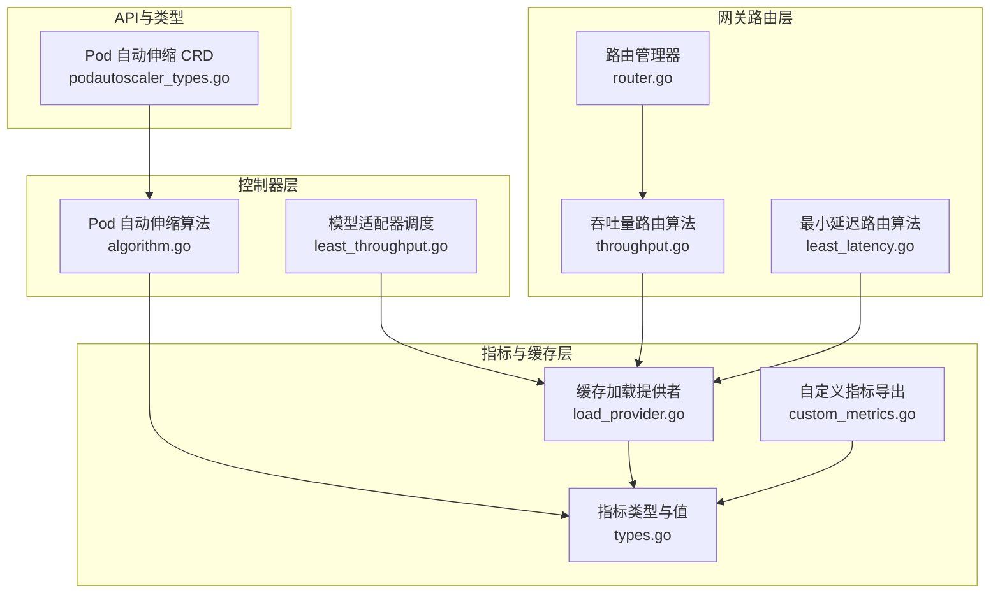
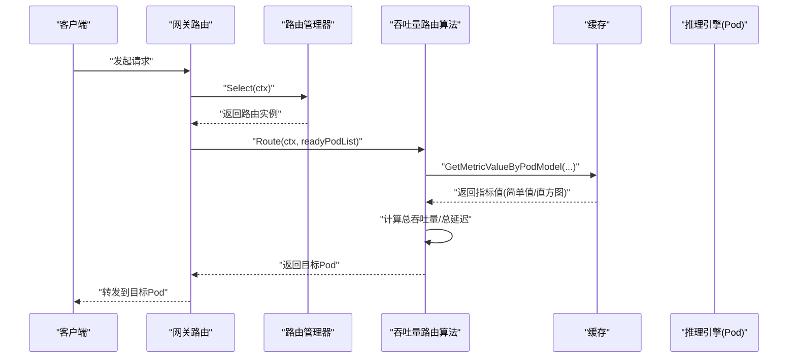
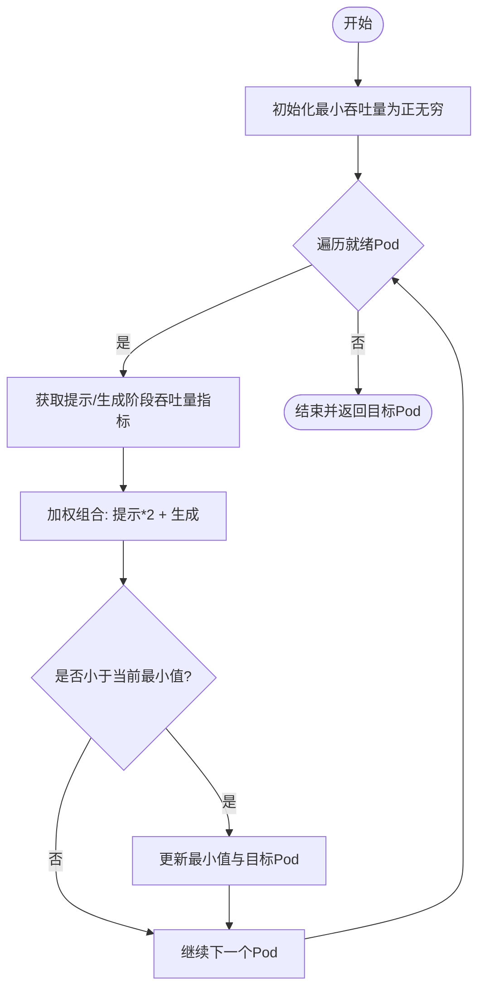
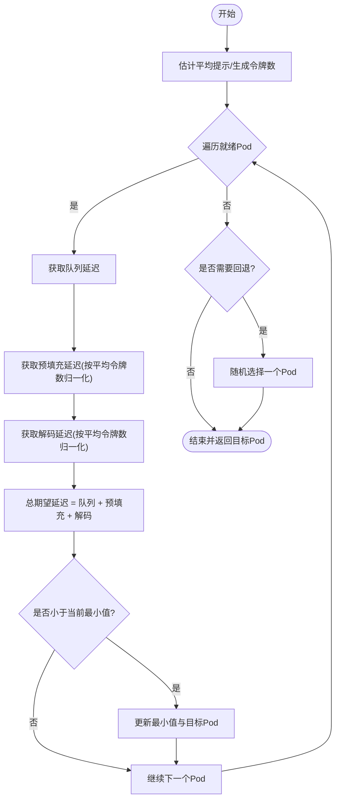
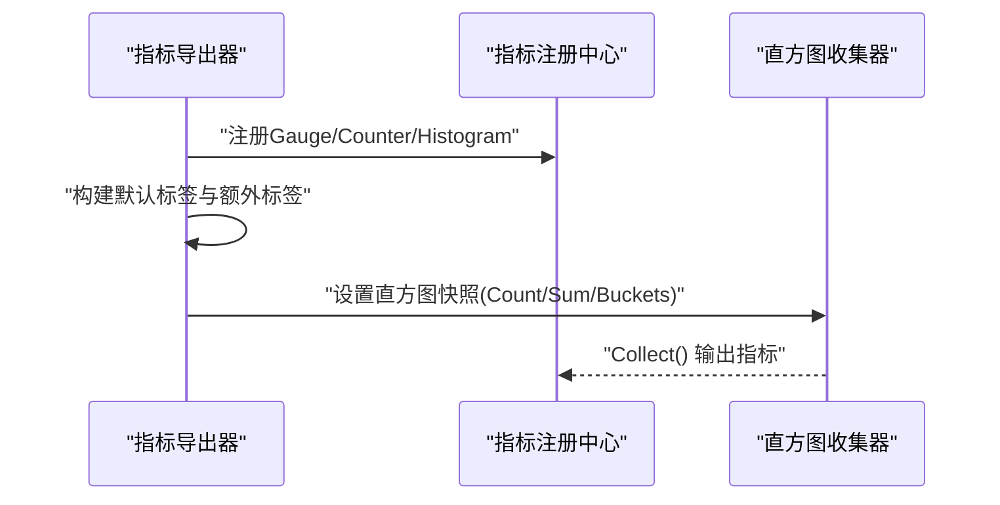
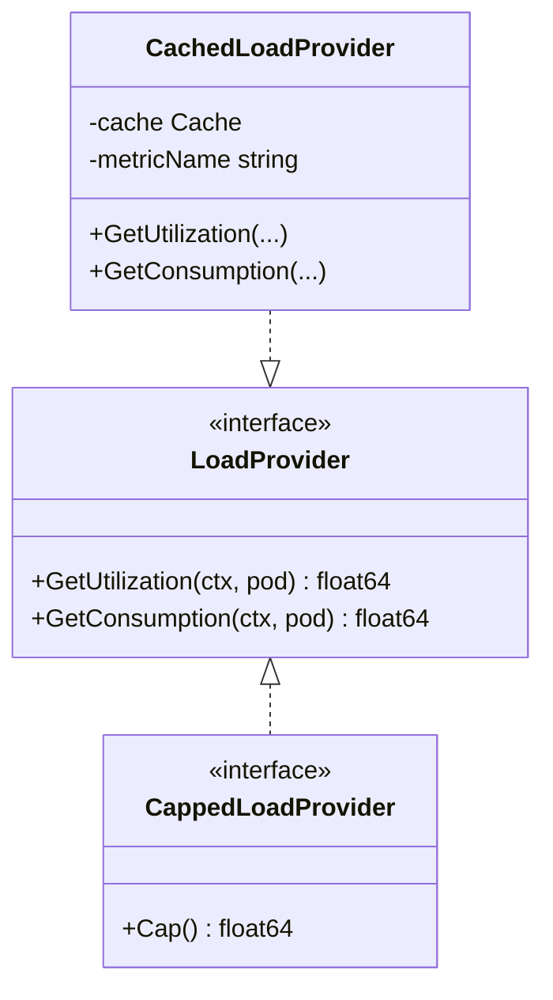
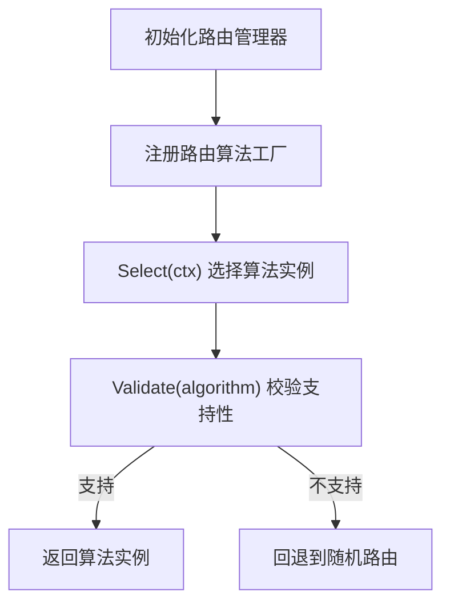
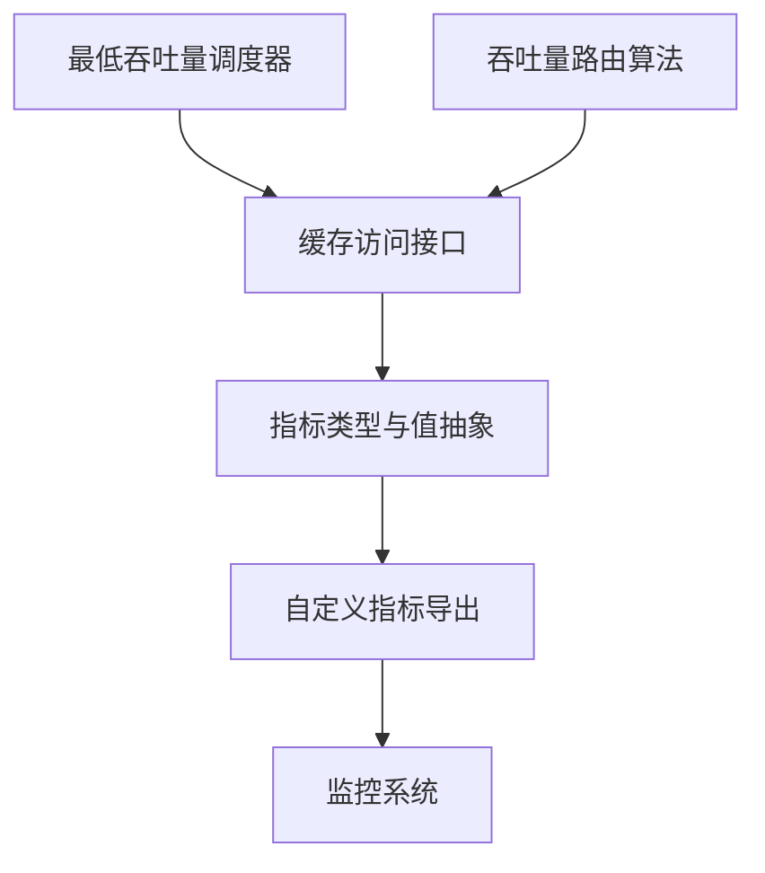

# 最低吞吐量调度策略

<cite>
**本文档引用的文件**
- [least_throughput.go](file://pkg/controller/modeladapter/scheduling/least_throughput.go)
- [throughput.go](file://pkg/plugins/gateway/algorithms/throughput.go)
- [router.go](file://pkg/plugins/gateway/algorithms/router.go)
- [types.go](file://pkg/metrics/types.go)
- [custom_metrics.go](file://pkg/metrics/custom_metrics.go)
- [load_provider.go](file://pkg/cache/load_provider.go)
- [podautoscaler_types.go](file://api/autoscaling/v1alpha1/podautoscaler_types.go)
- [algorithm.go](file://pkg/controller/podautoscaler/algorithm/algorithm.go)
- [least_latency.go](file://pkg/plugins/gateway/algorithms/least_latency.go)
</cite>

## 目录
1. [引言](#引言)
2. [项目结构](#项目结构)
3. [核心组件](#核心组件)
4. [架构概览](#架构概览)
5. [详细组件分析](#详细组件分析)
6. [依赖关系分析](#依赖关系分析)
7. [性能考虑](#性能考虑)
8. [故障排查指南](#故障排查指南)
9. [结论](#结论)
10. [附录](#附录)

## 引言
本技术文档围绕 AIBrix 的“最低吞吐量调度策略”展开，系统阐述如何通过监控与比较各 Pod 的吞吐量指标实现智能负载均衡。该策略以“吞吐量最小优先”的原则选择目标 Pod，从而在多副本推理引擎中实现更均衡的资源利用与更低的排队延迟。文档将从策略理念、吞吐量指标定义与计算方法、动态调整机制、历史数据使用、流量波动适应性、测量准确性保障、数据平滑处理、监控系统集成、性能影响分析、配置参数优化到最佳实践进行全方位解析。

## 项目结构
与“最低吞吐量调度策略”直接相关的代码分布在以下模块：
- 控制器层：模型适配器调度（选择 Pod）、Pod 自动伸缩算法（基于指标的副本数推荐）
- 网关路由层：基于吞吐量的路由算法（选择后端 Pod）
- 指标与缓存层：指标类型定义、自定义指标导出、缓存访问接口
- 类型与常量层：指标名称、指标值抽象、度量范围与查询类型



**图表来源**
- [least_throughput.go:1-62](file://pkg/controller/modeladapter/scheduling/least_throughput.go#L1-62)
- [throughput.go:1-56](file://pkg/plugins/gateway/algorithms/throughput.go#L1-56)
- [router.go:49-85](file://pkg/plugins/gateway/algorithms/router.go#L49-85)
- [types.go:1-305](file://pkg/metrics/types.go#L1-305)
- [custom_metrics.go:1-390](file://pkg/metrics/custom_metrics.go#L1-390)
- [load_provider.go:1-88](file://pkg/cache/load_provider.go#L1-88)
- [podautoscaler_types.go:30-229](file://api/autoscaling/v1alpha1/podautoscaler_types.go#L30-229)

**章节来源**
- [least_throughput.go:1-62](file://pkg/controller/modeladapter/scheduling/least_throughput.go#L1-62)
- [throughput.go:1-56](file://pkg/plugins/gateway/algorithms/throughput.go#L1-56)
- [router.go:49-85](file://pkg/plugins/gateway/algorithms/router.go#L49-85)
- [types.go:1-305](file://pkg/metrics/types.go#L1-305)
- [custom_metrics.go:1-390](file://pkg/metrics/custom_metrics.go#L1-390)
- [load_provider.go:1-88](file://pkg/cache/load_provider.go#L1-88)
- [podautoscaler_types.go:30-229](file://api/autoscaling/v1alpha1/podautoscaler_types.go#L30-229)

## 核心组件
- 最低吞吐量调度器（模型适配器侧）：遍历就绪 Pod，基于提示阶段与生成阶段的吞吐量指标加权求和，选择总吞吐量最小的 Pod。
- 吞吐量路由算法（网关侧）：与调度器类似，但面向请求路由场景，结合队列、预填充、解码三段延迟估算，选择总期望延迟最小的 Pod。
- 指标与缓存：统一的指标类型定义、指标值抽象（简单值、直方图、Prometheus 结果等），以及通过缓存访问指标值的接口。
- 自定义指标导出：支持将指标以 Gauge/Counter/Histogram 形式导出，并可按 Pod、模型等维度打标签。
- 负载提供者：封装从缓存读取利用率或消费量的抽象，便于路由与调度复用。

**章节来源**
- [least_throughput.go:29-61](file://pkg/controller/modeladapter/scheduling/least_throughput.go#L29-L61)
- [throughput.go:37-50](file://pkg/plugins/gateway/algorithms/throughput.go#L37-L50)
- [types.go:90-101](file://pkg/metrics/types.go#L90-101)
- [custom_metrics.go:308-335](file://pkg/metrics/custom_metrics.go#L308-L335)
- [load_provider.go:31-48](file://pkg/cache/load_provider.go#L31-L48)

## 架构概览
最低吞吐量策略贯穿“指标采集—指标抽象—缓存访问—决策执行”的完整链路。在模型适配器侧，调度器通过缓存获取每个 Pod 的吞吐量指标并加权求和；在网关路由侧，路由算法同样通过缓存获取指标并估算总延迟，最终选择最优 Pod。



**图表来源**
- [router.go:73-85](file://pkg/plugins/gateway/algorithms/router.go#L73-L85)
- [throughput.go:52-56](file://pkg/plugins/gateway/algorithms/throughput.go#L52-L56)
- [load_provider.go:76-83](file://pkg/cache/load_provider.go#L76-L83)

## 详细组件分析

### 组件A：最低吞吐量调度器（模型适配器侧）
- 设计理念：以“吞吐量最小优先”为核心，避免将新请求分配给已高负载的 Pod，从而降低排队时延与资源倾斜。
- 关键流程：
  - 遍历就绪 Pod 列表
  - 分别获取提示阶段与生成阶段的吞吐量指标
  - 对两个指标进行加权组合（提示阶段权重更高），得到总吞吐量
  - 选择总吞吐量最小的 Pod 返回
- 错误处理：任一指标获取失败则直接返回错误，确保调度决策的可靠性。
- 日志记录：输出被选中的 Pod，便于运维审计与问题定位。



**图表来源**
- [least_throughput.go:39-61](file://pkg/controller/modeladapter/scheduling/least_throughput.go#L39-L61)

**章节来源**
- [least_throughput.go:29-61](file://pkg/controller/modeladapter/scheduling/least_throughput.go#L29-L61)

### 组件B：吞吐量路由算法（网关侧）
- 设计理念：面向请求路由场景，结合队列、预填充、解码三段延迟估算，选择总期望延迟最小的 Pod。
- 关键流程：
  - 计算平均提示/生成令牌数的全局估计值
  - 获取队列延迟、预填充延迟、解码延迟
  - 将三段延迟按估计的令牌数归一化后相加
  - 若无有效指标，则回退到随机选择
- 回退策略：当所有指标均不可用时，随机选择一个 Pod，保证系统可用性。



**图表来源**
- [least_latency.go:51-154](file://pkg/plugins/gateway/algorithms/least_latency.go#L51-L154)

**章节来源**
- [least_latency.go:51-154](file://pkg/plugins/gateway/algorithms/least_latency.go#L51-L154)

### 组件C：指标类型与值抽象
- 指标类型：支持 Gauge、Counter、Histogram 三种原始类型，以及 PromQL 查询与 Label 查询两种派生类型。
- 指标作用域：支持 Model、Pod、PodModel 三种维度，便于按模型或 Pod 维度聚合统计。
- 指标值接口：统一提供 GetSimpleValue、GetHistogramValue、GetPrometheusResult、GetLabelValues 等方法，便于不同来源的指标统一处理。

```mermaid
classDiagram
class MetricType {
+Raw
+Query
+IsRawMetric()
+IsQuery()
}
class MetricScope {
<<enumeration>>
ModelMetricScope
PodMetricScope
PodModelMetricScope
}
class Metric {
+MetricSource
+MetricType
+PromQL
+LabelKey
+EngineMetricsNameMapping
+Description
+MetricScope
}
class MetricValue {
<<interface>>
+GetSimpleValue() float64
+GetHistogramValue() HistogramMetricValue
+GetPrometheusResult() Value
+GetLabelValues() map[string]string
}
class SimpleMetricValue {
+Value float64
+Labels map[string]string
}
class HistogramMetricValue {
+Sum float64
+Count float64
+Buckets map[string]float64
+Labels map[string]string
+GetMean() float64
+GetValue() interface{}
+GetPercentile(p float64) float64
}
Metric --> MetricType
Metric --> MetricScope
MetricValue <|.. SimpleMetricValue
MetricValue <|.. HistogramMetricValue
```

**图表来源**
- [types.go:56-101](file://pkg/metrics/types.go#L56-L101)
- [types.go:103-171](file://pkg/metrics/types.go#L103-L171)
- [types.go:239-279](file://pkg/metrics/types.go#L239-L279)

**章节来源**
- [types.go:56-101](file://pkg/metrics/types.go#L56-L101)
- [types.go:103-171](file://pkg/metrics/types.go#L103-L171)
- [types.go:239-279](file://pkg/metrics/types.go#L239-L279)

### 组件D：自定义指标导出与标签体系
- 支持 Gauge/Counter/Histogram 三类指标的动态注册与导出
- 自动构建默认标签（命名空间、Pod、模型、引擎类型、角色集/角色/副本索引、网关 Pod 名称等）
- 可扩展额外标签，保证跨组件一致的标签语义
- 对直方图指标自动导出 p50/p90/p99 分位数，便于观测尾部延迟



**图表来源**
- [custom_metrics.go:49-90](file://pkg/metrics/custom_metrics.go#L49-L90)
- [custom_metrics.go:157-178](file://pkg/metrics/custom_metrics.go#L157-L178)
- [custom_metrics.go:206-223](file://pkg/metrics/custom_metrics.go#L206-L223)

**章节来源**
- [custom_metrics.go:49-90](file://pkg/metrics/custom_metrics.go#L49-L90)
- [custom_metrics.go:157-178](file://pkg/metrics/custom_metrics.go#L157-L178)
- [custom_metrics.go:206-223](file://pkg/metrics/custom_metrics.go#L206-L223)

### 组件E：缓存加载提供者与路由/调度复用
- LoadProvider 抽象：统一获取利用率与请求消费量的接口，便于路由与调度复用
- CachedLoadProvider：基于缓存的利用率读取实现，简化调用方逻辑
- Cap() 接口：在需要容量上限时提供能力评估



**图表来源**
- [load_provider.go:31-48](file://pkg/cache/load_provider.go#L31-L48)
- [load_provider.go:50-87](file://pkg/cache/load_provider.go#L50-L87)

**章节来源**
- [load_provider.go:31-48](file://pkg/cache/load_provider.go#L31-L48)
- [load_provider.go:50-87](file://pkg/cache/load_provider.go#L50-L87)

### 组件F：路由管理器与算法注册
- 路由管理器负责算法工厂注册与选择，支持运行时校验与回退
- 通过 Register 函数注册具体路由算法（如 throughput、least-latency 等）



**图表来源**
- [router.go:49-85](file://pkg/plugins/gateway/algorithms/router.go#L49-L85)

**章节来源**
- [router.go:49-85](file://pkg/plugins/gateway/algorithms/router.go#L49-L85)

## 依赖关系分析
- 调度器依赖缓存访问接口获取指标值，再进行加权计算
- 路由算法同样依赖缓存访问接口，但引入了期望延迟的估算与回退策略
- 指标类型与值抽象为两类组件提供统一的数据结构
- 自定义指标导出为监控系统提供标准化指标，支撑策略的可观测性



**图表来源**
- [least_throughput.go:44-52](file://pkg/controller/modeladapter/scheduling/least_throughput.go#L44-L52)
- [throughput.go:52-56](file://pkg/plugins/gateway/algorithms/throughput.go#L52-L56)
- [types.go:90-101](file://pkg/metrics/types.go#L90-101)
- [custom_metrics.go:308-335](file://pkg/metrics/custom_metrics.go#L308-L335)

**章节来源**
- [least_throughput.go:44-52](file://pkg/controller/modeladapter/scheduling/least_throughput.go#L44-L52)
- [throughput.go:52-56](file://pkg/plugins/gateway/algorithms/throughput.go#L52-L56)
- [types.go:90-101](file://pkg/metrics/types.go#L90-101)
- [custom_metrics.go:308-335](file://pkg/metrics/custom_metrics.go#L308-L335)

## 性能考虑
- 计算复杂度：调度/路由均需遍历就绪 Pod 列表，时间复杂度为 O(N)，N 为就绪 Pod 数量；空间复杂度为 O(1)。
- 指标访问开销：通过缓存接口批量获取指标，建议合理设置缓存刷新周期，避免频繁查询导致的抖动。
- 加权策略：提示阶段权重高于生成阶段，有助于优先缓解预填充瓶颈，提升整体吞吐。
- 回退策略：在指标缺失时采用随机回退，避免因单点异常导致拒绝服务。
- 直方图分位数：导出 p50/p90/p99 有助于识别尾部延迟风险，指导容量规划与阈值设定。

[本节为通用性能讨论，无需列出具体文件来源]

## 故障排查指南
- 指标获取失败：若任一指标读取返回错误，调度/路由会直接报错。检查缓存连接、指标名称与作用域是否正确。
- 指标为空或为零：当指标值为零或缺失时，可能反映引擎未产生有效数据或监控未就绪。可通过日志与 Grafana 面板确认。
- 回退到随机：若所有 Pod 均无有效指标，路由将回退到随机选择。此时应优先修复指标采集与导出。
- 标签不一致：自定义指标导出会自动构建标签，若业务标签缺失，可在导出时补充额外标签键值对。
- 调度稳定性：在流量突增时，最低吞吐策略可能将请求集中到少数低负载 Pod；建议结合冷却窗口与容忍度参数进行调优。

**章节来源**
- [least_throughput.go:44-51](file://pkg/controller/modeladapter/scheduling/least_throughput.go#L44-L51)
- [least_latency.go:142-149](file://pkg/plugins/gateway/algorithms/least_latency.go#L142-L149)
- [custom_metrics.go:337-370](file://pkg/metrics/custom_metrics.go#L337-L370)

## 结论
最低吞吐量调度策略通过“吞吐量最小优先”的决策逻辑，在模型适配器与网关路由两侧实现了更均衡的负载分配。其核心优势在于：
- 明确的吞吐量指标定义与加权组合，兼顾预填充与生成阶段
- 与缓存/指标系统的深度集成，支持快速、稳定的指标访问
- 在指标缺失时的稳健回退机制，保障系统可用性
- 可观测性完善，便于容量规划与性能优化

建议在生产环境中结合监控面板与阈值策略，持续观察与优化权重与参数，以获得最佳的吞吐与延迟平衡。

[本节为总结性内容，无需列出具体文件来源]

## 附录

### A. 吞吐量指标定义与计算方法
- 提示阶段吞吐量：单位时间内处理的提示令牌数（AvgPromptThroughputToksPerMinPod）
- 生成阶段吞吐量：单位时间内处理的生成令牌数（AvgGenerationThroughputToksPerMinPod）
- 总吞吐量：提示*2 + 生成（提示阶段权重更高，用于优先缓解预填充瓶颈）

**章节来源**
- [least_throughput.go:44-52](file://pkg/controller/modeladapter/scheduling/least_throughput.go#L44-L52)

### B. 动态调整机制与历史数据使用
- 动态调整：策略基于实时指标进行选择，无需历史数据参与，响应迅速
- 历史数据：当前实现未直接使用历史滚动窗口，但可通过监控系统的历史趋势辅助容量规划与阈值设定

**章节来源**
- [least_throughput.go:39-61](file://pkg/controller/modeladapter/scheduling/least_throughput.go#L39-L61)

### C. 流量波动适应性
- 突增流量：策略倾向于将新请求分配到当前吞吐量较低的 Pod，有助于快速分流
- 突降流量：低负载 Pod 会持续保持较低吞吐量，有利于维持稳定

**章节来源**
- [least_throughput.go:39-61](file://pkg/controller/modeladapter/scheduling/least_throughput.go#L39-L61)

### D. 测量准确性保障与数据平滑
- 指标来源一致性：统一通过缓存接口获取，减少重复查询与不一致
- 直方图均值与分位数：提供均值与 p50/p90/p99，便于识别异常与尾部延迟
- 标签规范化：自动构建标准标签，避免因标签差异导致的聚合偏差

**章节来源**
- [types.go:165-171](file://pkg/metrics/types.go#L165-L171)
- [custom_metrics.go:327-333](file://pkg/metrics/custom_metrics.go#L327-L333)

### E. 与监控系统的集成方案
- 指标导出：通过自定义指标导出器将关键指标暴露至 Prometheus/Grafana
- 标签体系：统一的默认标签与可扩展额外标签，便于跨组件关联分析
- 面板设计：建议在 Grafana 中展示吞吐量、延迟、直方图分位数与副本数变化

**章节来源**
- [custom_metrics.go:308-335](file://pkg/metrics/custom_metrics.go#L308-L335)
- [custom_metrics.go:337-370](file://pkg/metrics/custom_metrics.go#L337-L370)

### F. 性能影响分析
- 决策开销：O(N) 遍历，N 通常较小（就绪 Pod 数），对性能影响有限
- 指标访问：建议使用缓存与批量查询，避免频繁拉取导致抖动
- 权重调优：根据模型特性调整提示与生成阶段权重，以匹配实际吞吐分布

**章节来源**
- [least_throughput.go:39-61](file://pkg/controller/modeladapter/scheduling/least_throughput.go#L39-L61)

### G. 配置参数优化与最佳实践
- 权重参数：提示阶段权重建议高于生成阶段，以优先缓解预填充瓶颈
- 回退策略：在指标缺失时启用随机回退，确保系统可用性
- 监控阈值：结合 p50/p90/p99 设置告警阈值，提前发现尾部延迟风险
- 容量规划：通过历史趋势与直方图分位数评估峰值容量，合理设置最大副本数

**章节来源**
- [least_throughput.go:52-56](file://pkg/controller/modeladapter/scheduling/least_throughput.go#L52-L56)
- [least_latency.go:142-149](file://pkg/plugins/gateway/algorithms/least_latency.go#L142-L149)
- [custom_metrics.go:327-333](file://pkg/metrics/custom_metrics.go#L327-L333)