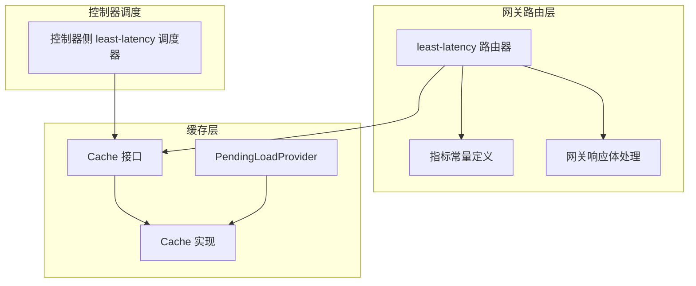
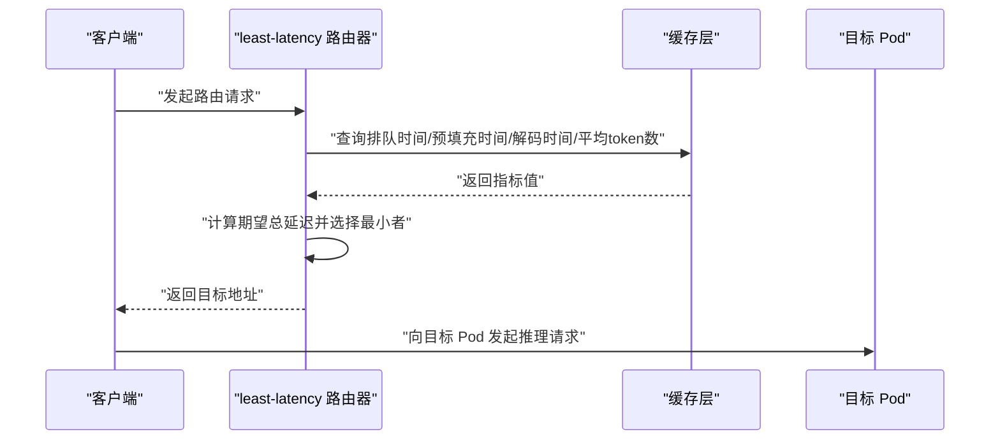
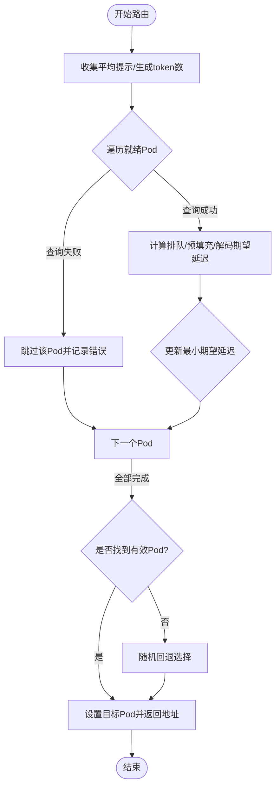
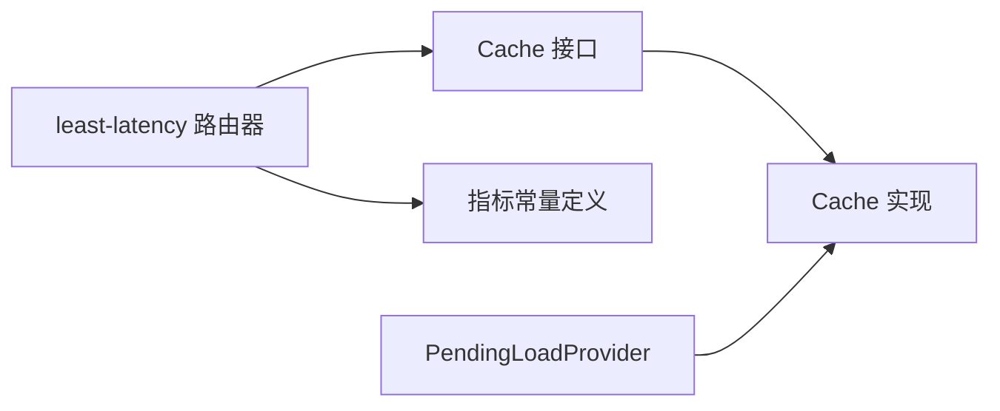

# 最低延迟调度策略

<cite>
**本文档引用的文件**
- [least_latency.go](file://pkg/plugins/gateway/algorithms/least_latency.go)
- [least_latency.go](file://pkg/controller/modeladapter/scheduling/least_latency.go)
- [metrics.go](file://pkg/metrics/metrics.go)
- [cache_api.go](file://pkg/cache/cache_api.go)
- [cache_impl.go](file://pkg/cache/cache_impl.go)
- [pending_load_provider.go](file://pkg/cache/pending_load_provider.go)
- [gateway_rsp_body.go](file://pkg/plugins/gateway/gateway_rsp_body.go)
- [least_latency_test.go](file://pkg/plugins/gateway/algorithms/least_latency_test.go)
- [README.md](file://benchmarks/README.md)
- [config.yaml](file://benchmarks/config.yaml)
</cite>

## 目录
1. [简介](#简介)
2. [项目结构](#项目结构)
3. [核心组件](#核心组件)
4. [架构概览](#架构概览)
5. [详细组件分析](#详细组件分析)
6. [依赖关系分析](#依赖关系分析)
7. [性能考虑](#性能考虑)
8. [故障排查指南](#故障排查指南)
9. [结论](#结论)
10. [附录](#附录)

## 简介
本文件针对 AIBrix 的最低延迟调度策略进行深入技术文档化，围绕「通过测量与比较不同 Pod 的响应延迟来选择最优模型推理节点」这一设计目标展开。内容涵盖：
- 延迟测量机制：指标定义、采样方法、数据收集频率与统计分析
- 实时性要求与延迟预测模型
- 高并发场景下的稳定性保障
- 准确性评估、异常值处理与缓存系统集成
- 性能基准测试、配置调优建议与实际部署经验

## 项目结构
与最低延迟调度策略直接相关的代码主要分布在以下模块：
- 网关路由算法：least-latency 路由器，负责基于度量计算期望总延迟并选择最优 Pod
- 控制器侧调度：基于队列时间与推理时间直方图均值的最小化策略
- 指标体系：定义请求排队时间、预填充时间、解码时间、平均提示/生成 token 数等
- 缓存层：统一的指标缓存接口与实现，支持按 Pod-模型维度查询
- 网关响应体处理：记录路由阶段各阶段耗时，用于后续分析与可视化
- 基准测试：工作负载生成、客户端与分析工具链

**图表来源**
- [least_latency.go:1-154](file://pkg/plugins/gateway/algorithms/least_latency.go#L1-L154)
- [metrics.go:19-100](file://pkg/metrics/metrics.go#L19-L100)
- [cache_api.go:25-109](file://pkg/cache/cache_api.go#L25-L109)
- [cache_impl.go:124-165](file://pkg/cache/cache_impl.go#L124-L165)
- [pending_load_provider.go:42-86](file://pkg/cache/pending_load_provider.go#L42-L86)
- [least_latency.go:29-61](file://pkg/controller/modeladapter/scheduling/least_latency.go#L29-L61)
- [gateway_rsp_body.go:268-284](file://pkg/plugins/gateway/gateway_rsp_body.go#L268-L284)

**章节来源**
- [least_latency.go:1-154](file://pkg/plugins/gateway/algorithms/least_latency.go#L1-L154)
- [least_latency.go:1-62](file://pkg/controller/modeladapter/scheduling/least_latency.go#L1-L62)
- [metrics.go:19-100](file://pkg/metrics/metrics.go#L19-L100)
- [cache_api.go:25-109](file://pkg/cache/cache_api.go#L25-L109)
- [cache_impl.go:124-165](file://pkg/cache/cache_impl.go#L124-L165)
- [pending_load_provider.go:42-86](file://pkg/cache/pending_load_provider.go#L42-L86)
- [gateway_rsp_body.go:268-284](file://pkg/plugins/gateway/gateway_rsp_body.go#L268-L284)

## 核心组件
- least-latency 路由器（网关侧）
  - 基于 Pod-模型维度的指标查询，计算期望排队延迟、预填充延迟与解码延迟之和，选择最小者
  - 当指标缺失或不可用时，回退到随机选择策略
- 控制器侧 least-latency 调度器
  - 使用队列时间与推理时间直方图均值之和作为候选 Pod 的延迟估计
- 指标体系
  - 定义了请求排队时间、预填充时间、解码时间、平均提示/生成 token 数等关键指标
- 缓存层
  - 提供按 Pod 与 Pod-模型维度查询指标的能力，并支持订阅与聚合
- 网关响应体处理
  - 记录路由、预填充、KV 传输、解码等阶段耗时，便于端到端分析

**章节来源**
- [least_latency.go:51-153](file://pkg/plugins/gateway/algorithms/least_latency.go#L51-L153)
- [least_latency.go:39-61](file://pkg/controller/modeladapter/scheduling/least_latency.go#L39-L61)
- [metrics.go:29-74](file://pkg/metrics/metrics.go#L29-L74)
- [cache_api.go:82-109](file://pkg/cache/cache_api.go#L82-L109)
- [cache_impl.go:145-165](file://pkg/cache/cache_impl.go#L145-L165)
- [gateway_rsp_body.go:268-284](file://pkg/plugins/gateway/gateway_rsp_body.go#L268-L284)

## 架构概览
最低延迟策略的整体流程如下：
- 输入：待路由请求上下文、就绪 Pod 列表
- 指标采集：从缓存中查询每个 Pod 的排队时间、预填充时间、解码时间、平均提示/生成 token 数
- 预测建模：将直方图均值按平均 token 数归一化，得到每阶段期望延迟
- 选择策略：总期望延迟最小的 Pod；若无有效指标则回退
- 输出：目标 Pod 地址

**图表来源**
- [least_latency.go:51-153](file://pkg/plugins/gateway/algorithms/least_latency.go#L51-L153)
- [cache_api.go:82-109](file://pkg/cache/cache_api.go#L82-L109)
- [cache_impl.go:145-165](file://pkg/cache/cache_impl.go#L145-L165)

## 详细组件分析

### 组件A：网关侧 least-latency 路由器
- 设计目标
  - 通过度量驱动的期望延迟最小化，提升端到端用户体验
- 关键逻辑
  - 首先对所有就绪 Pod 查询平均提示/生成 token 数，用于后续归一化
  - 对每个 Pod：
    - 获取排队时间（简单值）
    - 获取预填充时间直方图均值，并按平均提示 token 数归一化
    - 获取解码时间直方图均值，并按平均生成 token 数归一化
    - 计算总期望延迟并更新最小值
  - 若无有效指标，回退到随机选择策略
- 实时性与稳定性
  - 指标查询失败时记录错误并跳过该 Pod，避免阻塞路由
  - 回退策略确保在极端情况下仍可完成路由

**图表来源**
- [least_latency.go:51-153](file://pkg/plugins/gateway/algorithms/least_latency.go#L51-L153)

**章节来源**
- [least_latency.go:51-153](file://pkg/plugins/gateway/algorithms/least_latency.go#L51-L153)
- [least_latency_test.go:31-251](file://pkg/plugins/gateway/algorithms/least_latency_test.go#L31-L251)

### 组件B：控制器侧 least-latency 调度器
- 设计目标
  - 在控制器层面以队列时间与推理时间均值之和作为延迟估计，简化实现
- 关键逻辑
  - 遍历候选 Pod，分别查询队列时间与推理时间直方图均值
  - 取两者之和作为候选延迟，选择最小者
- 适用场景
  - 适用于需要在控制器侧进行预选或与网关侧策略配合的场景

**章节来源**
- [least_latency.go:39-61](file://pkg/controller/modeladapter/scheduling/least_latency.go#L39-L61)

### 组件C：指标体系与缓存层
- 指标定义
  - 请求排队时间、预填充时间、解码时间、平均提示/生成 token 数等
  - 支持直方图均值与简单值两类指标
- 缓存接口
  - 提供按 Pod 与 Pod-模型维度查询指标的方法
  - 支持订阅与聚合，便于实时统计
- 实现细节
  - 指标查询失败时返回错误，调用方可根据策略决定跳过或回退

**章节来源**
- [metrics.go:29-74](file://pkg/metrics/metrics.go#L29-L74)
- [cache_api.go:82-109](file://pkg/cache/cache_api.go#L82-L109)
- [cache_impl.go:145-165](file://pkg/cache/cache_impl.go#L145-L165)

### 组件D：网关响应体处理与端到端分析
- 功能
  - 记录路由、预填充、KV 传输、解码等阶段耗时
  - 将各阶段耗时映射到 Prometheus 指标，便于监控与分析
- 价值
  - 为策略效果验证与性能优化提供数据支撑

**章节来源**
- [gateway_rsp_body.go:268-284](file://pkg/plugins/gateway/gateway_rsp_body.go#L268-L284)

## 依赖关系分析
- least-latency 路由器依赖缓存层提供的指标查询能力
- 指标查询依赖指标常量定义与缓存实现
- PendingLoadProvider 展示了如何基于模型配置与特征签名推导吞吐与延迟，可用于更复杂的负载感知

**图表来源**
- [least_latency.go:19-28](file://pkg/plugins/gateway/algorithms/least_latency.go#L19-L28)
- [cache_api.go:25-35](file://pkg/cache/cache_api.go#L25-L35)
- [cache_impl.go:124-165](file://pkg/cache/cache_impl.go#L124-L165)
- [metrics.go:19-100](file://pkg/metrics/metrics.go#L19-L100)
- [pending_load_provider.go:42-86](file://pkg/cache/pending_load_provider.go#L42-L86)

**章节来源**
- [least_latency.go:19-28](file://pkg/plugins/gateway/algorithms/least_latency.go#L19-L28)
- [cache_api.go:25-35](file://pkg/cache/cache_api.go#L25-L35)
- [cache_impl.go:124-165](file://pkg/cache/cache_impl.go#L124-L165)
- [metrics.go:19-100](file://pkg/metrics/metrics.go#L19-L100)
- [pending_load_provider.go:42-86](file://pkg/cache/pending_load_provider.go#L42-L86)

## 性能考虑
- 实时性与延迟预测
  - 采用直方图均值作为延迟估计，具备较好的代表性
  - 通过平均提示/生成 token 数对时间进行归一化，降低不同输入规模对延迟估计的影响
- 高并发稳定性
  - 指标查询失败时跳过该 Pod 并继续评估其他候选，避免单点阻塞
  - 回退策略确保在极端情况下仍可完成路由
- 数据准确性与异常值处理
  - 当指标缺失时使用全局平均值进行猜测，减少偏差
  - 测试覆盖了多种边界情况，包括无指标、部分指标缺失、相同延迟等情形
- 缓存系统集成
  - 通过统一的 Cache 接口与实现，支持多后端与聚合，满足大规模场景需求

**章节来源**
- [least_latency.go:70-86](file://pkg/plugins/gateway/algorithms/least_latency.go#L70-L86)
- [least_latency_test.go:134-226](file://pkg/plugins/gateway/algorithms/least_latency_test.go#L134-L226)

## 故障排查指南
- 现象：路由失败或返回空地址
  - 可能原因：无就绪 Pod 或指标查询全部失败
  - 处理：检查 Pod 就绪状态与指标可用性；确认缓存订阅与聚合正常
- 现象：路由结果不稳定或频繁切换
  - 可能原因：指标波动较大或平均 token 数估算不准确
  - 处理：增加样本窗口、校准平均 token 数参数；结合控制器侧策略进行预选
- 现象：端到端延迟未达预期
  - 可能原因：预填充/解码阶段瓶颈
  - 处理：结合网关响应体处理输出的各阶段耗时指标进行定位

**章节来源**
- [least_latency.go:142-153](file://pkg/plugins/gateway/algorithms/least_latency.go#L142-L153)
- [gateway_rsp_body.go:268-284](file://pkg/plugins/gateway/gateway_rsp_body.go#L268-L284)

## 结论
最低延迟调度策略通过「期望总延迟最小化」实现端到端延迟优化，具备以下优势：
- 明确的指标驱动与可解释性
- 良好的实时性与高并发稳定性
- 与缓存系统与监控体系的深度集成
在实际部署中，建议结合基准测试与持续观测，动态调整平均 token 数参数与回退策略，以获得最佳效果。

## 附录

### A. 延迟测量机制详解
- 指标定义
  - 请求排队时间：简单值，反映等待执行的时间
  - 预填充时间：直方图均值，反映首次生成前的处理时间
  - 解码时间：直方图均值，反映逐 token 生成时间
  - 平均提示/生成 token 数：简单值，用于归一化
- 采样与统计
  - 直方图均值用于估计典型延迟
  - 平均 token 数用于跨规模归一化
- 数据收集频率
  - 通过缓存层的订阅与聚合机制，按需刷新与更新

**章节来源**
- [metrics.go:29-74](file://pkg/metrics/metrics.go#L29-L74)
- [cache_api.go:82-109](file://pkg/cache/cache_api.go#L82-L109)
- [cache_impl.go:145-165](file://pkg/cache/cache_impl.go#L145-L165)

### B. 基准测试与配置调优
- 基准测试框架
  - 支持数据集生成、工作负载生成、客户端调度与分析
  - 可配置路由策略、端点、目标模型、流式模式等
- 调优建议
  - 合理设置平均提示/生成 token 数的初始猜测值
  - 在高波动场景下增大样本窗口或采用滑动窗口统计
  - 结合端到端耗时指标（路由、预填充、KV 传输、解码）进行分阶段优化

**章节来源**
- [README.md:1-431](file://benchmarks/README.md#L1-L431)
- [config.yaml:1-114](file://benchmarks/config.yaml#L1-L114)