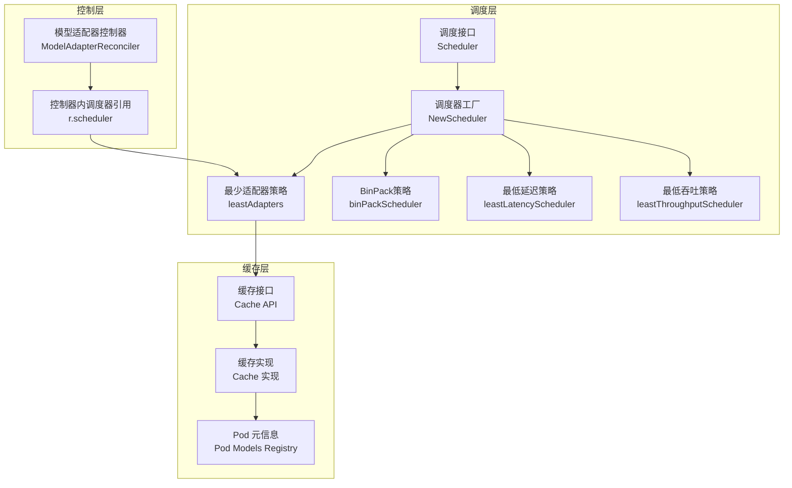
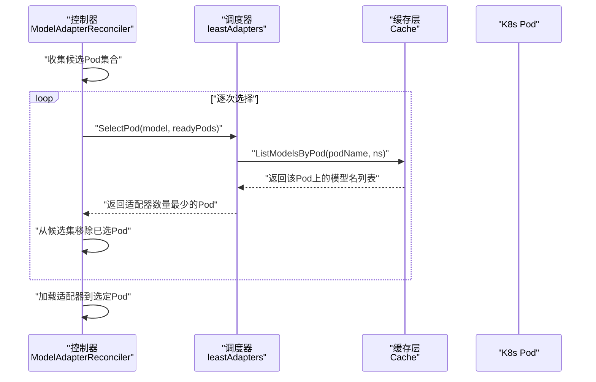
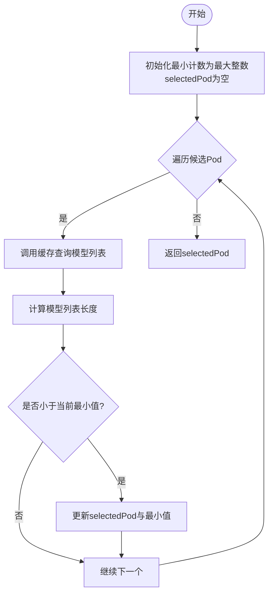
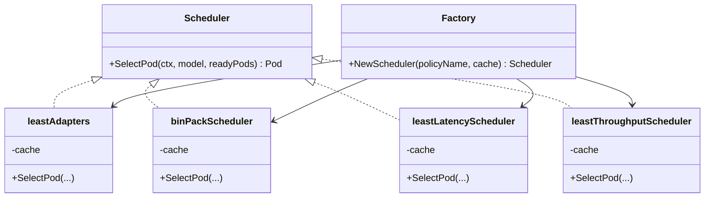
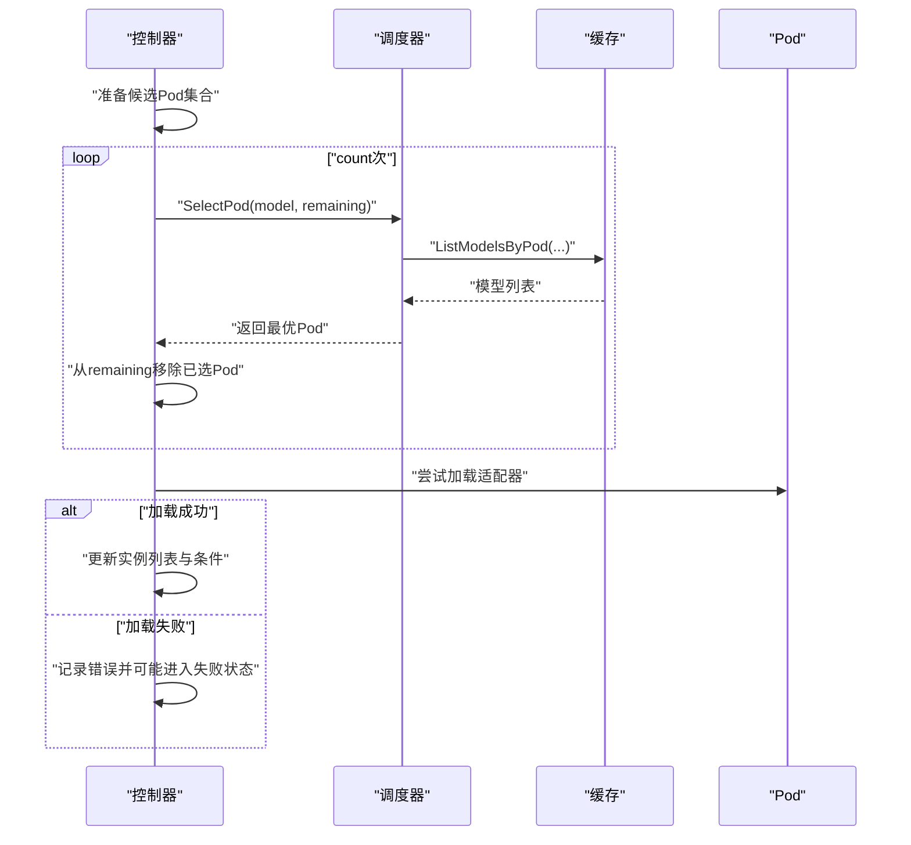
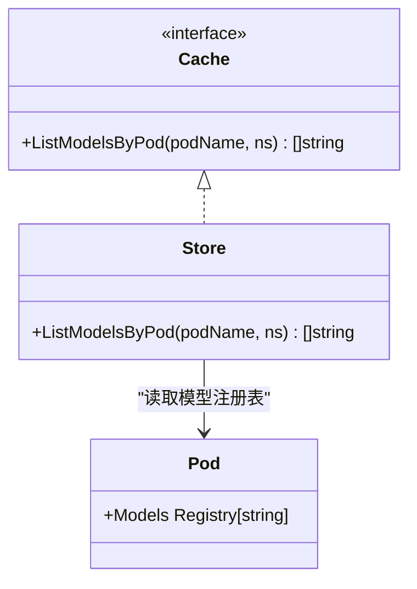
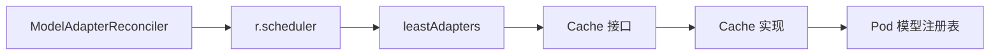

# 最少适配器调度策略

<cite>
**本文引用的文件**
- [least_adapters.go](file://pkg/controller/modeladapter/scheduling/least_adapters.go)
- [scheduler.go](file://pkg/controller/modeladapter/scheduling/scheduler.go)
- [modeladapter_controller.go](file://pkg/controller/modeladapter/modeladapter_controller.go)
- [cache_api.go](file://pkg/cache/cache_api.go)
- [cache_impl.go](file://pkg/cache/cache_impl.go)
- [pod.go](file://pkg/cache/pod.go)
- [bin_pack.go](file://pkg/controller/modeladapter/scheduling/bin_pack.go)
- [least_latency.go](file://pkg/controller/modeladapter/scheduling/least_latency.go)
- [least_throughput.go](file://pkg/controller/modeladapter/scheduling/least_throughput.go)
</cite>

## 目录
1. [简介](#简介)
2. [项目结构](#项目结构)
3. [核心组件](#核心组件)
4. [架构总览](#架构总览)
5. [详细组件分析](#详细组件分析)
6. [依赖分析](#依赖分析)
7. [性能考量](#性能考量)
8. [故障排除指南](#故障排除指南)
9. [结论](#结论)
10. [附录](#附录)

## 简介
本技术文档围绕 AIBrix 的“最少适配器”调度策略进行系统化阐述，目标是帮助读者深入理解该策略如何通过统计每个 Pod 上已部署的模型适配器数量来选择最空闲的节点，并在多 Pod 具有相同适配器数量时的处理机制。文档同时覆盖策略的实现细节、数据流、错误处理、性能特征、与其他策略的对比，以及在不同集群规模下的表现建议。

## 项目结构
与“最少适配器”调度策略直接相关的代码主要分布在以下模块：
- 调度器接口与工厂：定义统一调度接口并按策略名称创建具体调度器实例
- 具体调度策略实现：最少适配器、最先适应（BinPack）、最低延迟、最低吞吐等
- 控制器编排：负责根据策略选择 Pod 并执行加载/卸载流程
- 缓存层：提供 Pod-模型映射查询能力，支撑调度决策

图表来源
- [scheduler.go:34-50](file://pkg/controller/modeladapter/scheduling/scheduler.go#L34-L50)
- [least_adapters.go:32-36](file://pkg/controller/modeladapter/scheduling/least_adapters.go#L32-L36)
- [modeladapter_controller.go:699-726](file://pkg/controller/modeladapter/modeladapter_controller.go#L699-L726)
- [cache_api.go:25-79](file://pkg/cache/cache_api.go#L25-L79)
- [cache_impl.go:114-122](file://pkg/cache/cache_impl.go#L114-L122)

章节来源
- [scheduler.go:1-51](file://pkg/controller/modeladapter/scheduling/scheduler.go#L1-L51)
- [least_adapters.go:1-56](file://pkg/controller/modeladapter/scheduling/least_adapters.go#L1-L56)
- [modeladapter_controller.go:699-726](file://pkg/controller/modeladapter/modeladapter_controller.go#L699-L726)
- [cache_api.go:25-79](file://pkg/cache/cache_api.go#L25-L79)
- [cache_impl.go:114-122](file://pkg/cache/cache_impl.go#L114-L122)

## 核心组件
- 调度接口与工厂
  - 接口定义了统一的 SelectPod 方法，确保所有策略遵循一致的输入输出契约
  - 工厂方法根据策略名称返回对应调度器实例，当前支持 random、leastAdapters、binPack、leastLatency、leastThroughput
- 最少适配器策略
  - 基于缓存层提供的 ListModelsByPod 查询每个候选 Pod 上已部署的模型列表长度
  - 选择模型数量最少的 Pod；若存在多个相同最小值的 Pod，则保留第一个被遍历到的（未显式声明二次排序规则）
- 控制器编排
  - 在单 Pod 模式下，schedulePods 循环调用调度器 SelectPod，每次从剩余候选集中剔除已选 Pod，直至满足所需数量
  - 加载阶段优先尝试已标注的调度结果 Pod，随后再尝试其他候选 Pod
- 缓存层
  - 提供 GetPod/ListModelsByPod 等能力，支撑调度器进行快速的 Pod-模型映射查询

章节来源
- [scheduler.go:28-50](file://pkg/controller/modeladapter/scheduling/scheduler.go#L28-L50)
- [least_adapters.go:38-55](file://pkg/controller/modeladapter/scheduling/least_adapters.go#L38-L55)
- [modeladapter_controller.go:699-726](file://pkg/controller/modeladapter/modeladapter_controller.go#L699-L726)
- [cache_api.go:71-78](file://pkg/cache/cache_api.go#L71-L78)
- [cache_impl.go:114-122](file://pkg/cache/cache_impl.go#L114-L122)

## 架构总览
下面的序列图展示了“最少适配器”策略在控制器中的调用链路与数据流：

图表来源
- [modeladapter_controller.go:699-726](file://pkg/controller/modeladapter/modeladapter_controller.go#L699-L726)
- [least_adapters.go:38-55](file://pkg/controller/modeladapter/scheduling/least_adapters.go#L38-L55)
- [cache_api.go:71-78](file://pkg/cache/cache_api.go#L71-L78)

## 详细组件分析

### 组件A：最少适配器调度器
- 设计要点
  - 采用贪心策略：在候选集中遍历一次，维护当前最小模型数量与对应 Pod
  - 依赖缓存层的模型-容器映射，避免直接访问 Kubernetes API
- 数据结构与复杂度
  - 时间复杂度：O(M)，M 为候选 Pod 数量；每次查询模型列表为 O(K)，K 为该 Pod 上模型数量
  - 空间复杂度：O(1)，仅保存当前最优 Pod 引用与计数值
- 错误处理
  - 若缓存查询失败，立即返回错误，由上层控制器决定重试或回退
- 未声明的二次排序
  - 当多个 Pod 的模型数量相等时，策略未定义进一步的排序规则，因此首个满足条件的 Pod 将被选中

图表来源
- [least_adapters.go:38-55](file://pkg/controller/modeladapter/scheduling/least_adapters.go#L38-L55)

章节来源
- [least_adapters.go:28-55](file://pkg/controller/modeladapter/scheduling/least_adapters.go#L28-L55)
- [cache_api.go:71-78](file://pkg/cache/cache_api.go#L71-L78)

### 组件B：调度器工厂与接口
- 接口职责
  - 统一的 SelectPod 签名，保证不同策略可互换替换
- 工厂职责
  - 根据字符串策略名返回对应调度器实例
  - 对未知策略名返回错误，便于上层进行容错处理
- 与其他策略的关系
  - leastAdapters 与 binPack、leastLatency、leastThroughput 共享同一接口，便于横向对比与切换

图表来源
- [scheduler.go:28-50](file://pkg/controller/modeladapter/scheduling/scheduler.go#L28-L50)
- [least_adapters.go:32-36](file://pkg/controller/modeladapter/scheduling/least_adapters.go#L32-L36)
- [bin_pack.go:32-36](file://pkg/controller/modeladapter/scheduling/bin_pack.go#L32-L36)
- [least_latency.go:33-37](file://pkg/controller/modeladapter/scheduling/least_latency.go#L33-L37)
- [least_throughput.go:33-37](file://pkg/controller/modeladapter/scheduling/least_throughput.go#L33-L37)

章节来源
- [scheduler.go:28-50](file://pkg/controller/modeladapter/scheduling/scheduler.go#L28-L50)

### 组件C：控制器中的调度调用与加载流程
- 单 Pod 模式下的调度循环
  - schedulePods 会多次调用 SelectPod，每次从剩余候选集中剔除已选 Pod，直到达到所需数量
- 加载阶段的优先级
  - 优先尝试已标注的调度结果 Pod，随后再尝试其他候选 Pod
  - 成功加载后清空调度注解，恢复 Ready/Scheduled 条件
- 错误处理
  - 若所有候选均失败，进入失败状态并记录错误原因
  - 若部分成功，保持 Running 状态并更新就绪副本数

图表来源
- [modeladapter_controller.go:699-726](file://pkg/controller/modeladapter/modeladapter_controller.go#L699-L726)
- [modeladapter_controller.go:778-836](file://pkg/controller/modeladapter/modeladapter_controller.go#L778-L836)

章节来源
- [modeladapter_controller.go:699-726](file://pkg/controller/modeladapter/modeladapter_controller.go#L699-L726)
- [modeladapter_controller.go:778-836](file://pkg/controller/modeladapter/modeladapter_controller.go#L778-L836)

### 组件D：缓存层与数据模型
- 缓存接口
  - 提供 ListModelsByPod 获取 Pod 上的模型名列表，作为调度决策依据
- 缓存实现
  - Store 实现了 ListModelsByPod，内部通过 Pod 元信息中的模型注册表返回数组
- Pod 元信息
  - Pod 结构包含模型注册表，用于快速统计某 Pod 上的模型数量

图表来源
- [cache_api.go:71-78](file://pkg/cache/cache_api.go#L71-L78)
- [cache_impl.go:114-122](file://pkg/cache/cache_impl.go#L114-L122)
- [pod.go:29-42](file://pkg/cache/pod.go#L29-L42)

章节来源
- [cache_api.go:71-78](file://pkg/cache/cache_api.go#L71-L78)
- [cache_impl.go:114-122](file://pkg/cache/cache_impl.go#L114-L122)
- [pod.go:29-42](file://pkg/cache/pod.go#L29-L42)

## 依赖分析
- 耦合关系
  - leastAdapters 依赖 Cache 接口进行模型-容器映射查询
  - 控制器通过 r.scheduler 调用调度器，策略可插拔
- 内聚性
  - 调度器仅关注选择逻辑，不涉及加载细节，内聚良好
- 外部依赖
  - Kubernetes Pod 列表与状态由控制器筛选，调度器只消费已过滤的候选集
- 可能的循环依赖
  - 未发现直接循环依赖；调度器与控制器通过接口解耦

图表来源
- [least_adapters.go:23-25](file://pkg/controller/modeladapter/scheduling/least_adapters.go#L23-L25)
- [cache_api.go:25-35](file://pkg/cache/cache_api.go#L25-L35)
- [cache_impl.go:114-122](file://pkg/cache/cache_impl.go#L114-L122)
- [modeladapter_controller.go:699-726](file://pkg/controller/modeladapter/modeladapter_controller.go#L699-L726)

章节来源
- [least_adapters.go:23-25](file://pkg/controller/modeladapter/scheduling/least_adapters.go#L23-L25)
- [cache_api.go:25-35](file://pkg/cache/cache_api.go#L25-L35)
- [cache_impl.go:114-122](file://pkg/cache/cache_impl.go#L114-L122)
- [modeladapter_controller.go:699-726](file://pkg/controller/modeladapter/modeladapter_controller.go#L699-L726)

## 性能考量
- 时间复杂度
  - 单次选择：O(M×K)，M 为候选 Pod 数，K 为平均每个 Pod 的模型数量
  - 多次选择（按需）：O(T×M×K)，T 为需要选择的次数
- 空间复杂度
  - O(1) 额外空间（仅保存当前最优项）
- 缓存命中与热点
  - 通过缓存层查询模型列表，避免频繁访问 Kubernetes API
  - 在高并发场景下，建议结合控制器层面的去重与幂等设计
- 与其它策略对比
  - leastAdapters：偏向均衡，适合追求“尽量均匀分布”的场景
  - binPack：偏向紧凑，适合资源利用率优先但可能造成热点
  - leastLatency/leastThroughput：基于实时指标，适合动态负载场景，但对指标质量与采集频率敏感

[本节为通用性能讨论，无需列出具体文件来源]

## 故障排除指南
- 现象：调度器返回错误
  - 可能原因：缓存查询失败（如 Pod 键不存在）
  - 处理建议：检查 Pod 是否存在于缓存中，确认命名空间与名称匹配
- 现象：未选择到任何 Pod
  - 可能原因：候选集为空或全部不可用
  - 处理建议：确认控制器已正确筛选 ready 且稳定的 Pod
- 现象：加载阶段失败
  - 可能原因：引擎侧加载失败或网络异常
  - 处理建议：查看控制器日志中的错误聚合，必要时重试或回退到其他策略
- 现象：多个 Pod 模型数量相同
  - 可能原因：策略未定义二次排序
  - 处理建议：在业务允许范围内，通过外部手段（如标签或注解）辅助二次选择

章节来源
- [least_adapters.go:43-46](file://pkg/controller/modeladapter/scheduling/least_adapters.go#L43-L46)
- [modeladapter_controller.go:778-836](file://pkg/controller/modeladapter/modeladapter_controller.go#L778-L836)

## 结论
“最少适配器”调度策略通过统计每个 Pod 上已部署的模型数量，选择最空闲的节点进行适配器加载，具备实现简单、可预测性强的特点。在多 Pod 具有相同适配器数量时，策略未声明二次排序规则，因此首个满足条件的 Pod 将被选中。该策略适合追求均衡分布与稳定性的场景；在需要极致资源利用率或动态负载优化时，可考虑 binPack 或基于指标的策略。结合缓存层与控制器的健壮性设计，可在大规模集群中保持良好的性能与可维护性。

[本节为总结性内容，无需列出具体文件来源]

## 附录

### 适用场景
- 追求 Pod 间适配器分布均衡
- 需要稳定、可预期的调度行为
- 适配器数量有限、Pod 资源相对充裕

### 不适用场景
- 对吞吐或延迟有强实时要求且已有可靠指标反馈
- 需要最大化资源利用率，容忍热点与不均衡

### 与其他策略的对比
- leastAdapters vs binPack
  - 前者更均衡，后者更紧凑
- leastAdapters vs leastLatency/leastThroughput
  - 前者静态、低成本，后者动态、依赖指标质量

### 配置参数说明
- 策略名称
  - 在工厂方法中通过字符串参数选择策略，例如 "leastAdapters"
- 缓存与指标
  - leastAdapters 依赖缓存层的模型-容器映射；binPack 示例中使用固定容量（待替换为实际容量）
  - leastLatency/leastThroughput 依赖相应指标的可用性与准确性

章节来源
- [scheduler.go:34-50](file://pkg/controller/modeladapter/scheduling/scheduler.go#L34-L50)
- [bin_pack.go:39-58](file://pkg/controller/modeladapter/scheduling/bin_pack.go#L39-L58)
- [least_latency.go:39-61](file://pkg/controller/modeladapter/scheduling/least_latency.go#L39-L61)
- [least_throughput.go:39-61](file://pkg/controller/modeladapter/scheduling/least_throughput.go#L39-L61)