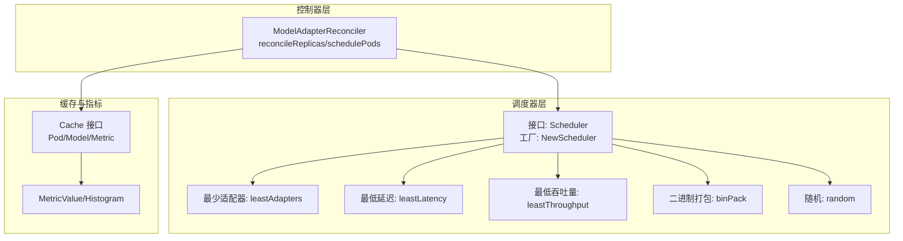
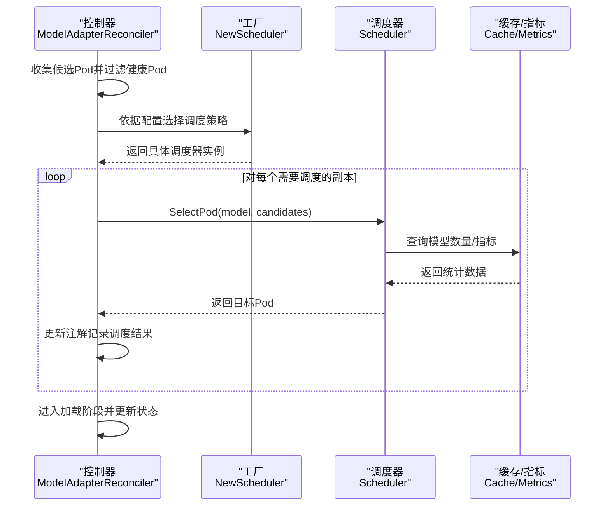
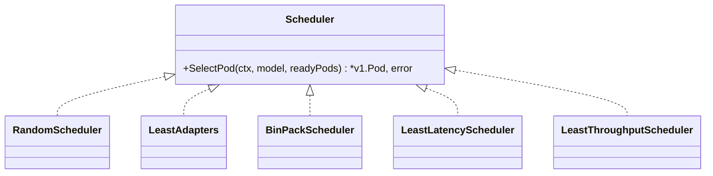
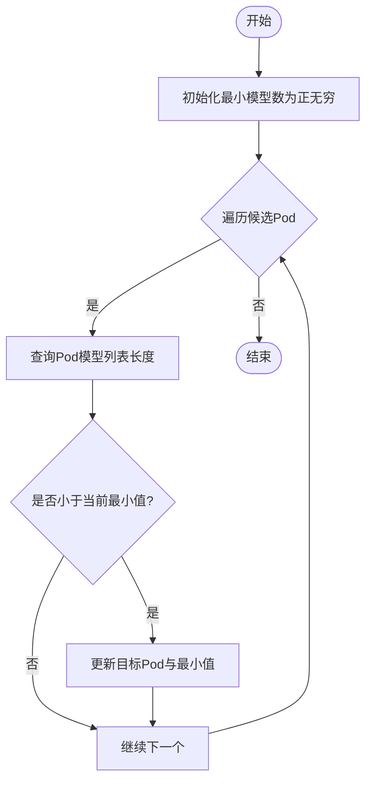
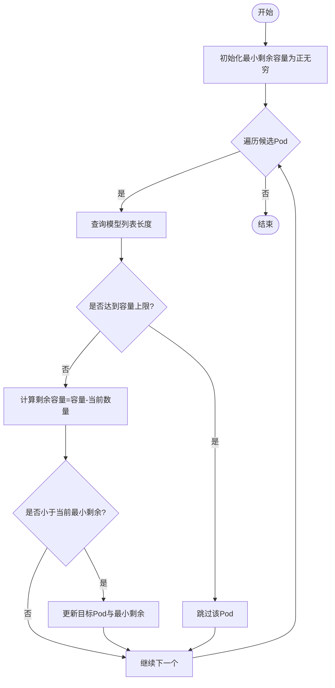
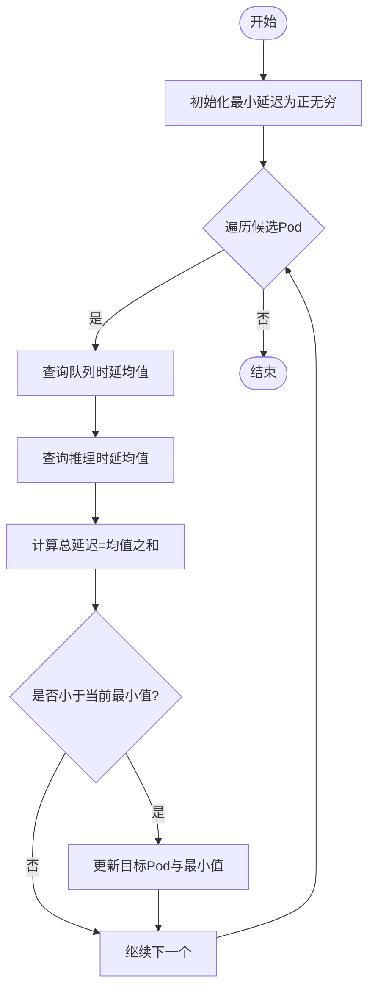
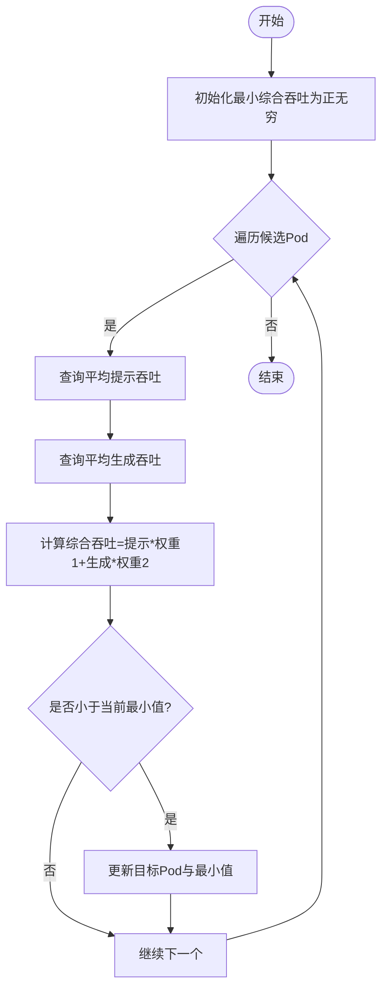
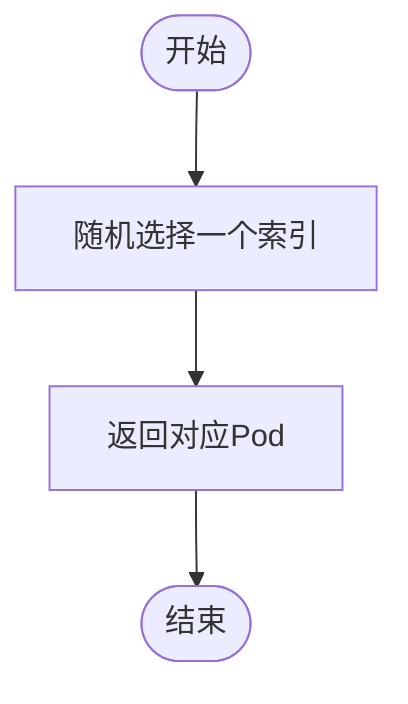
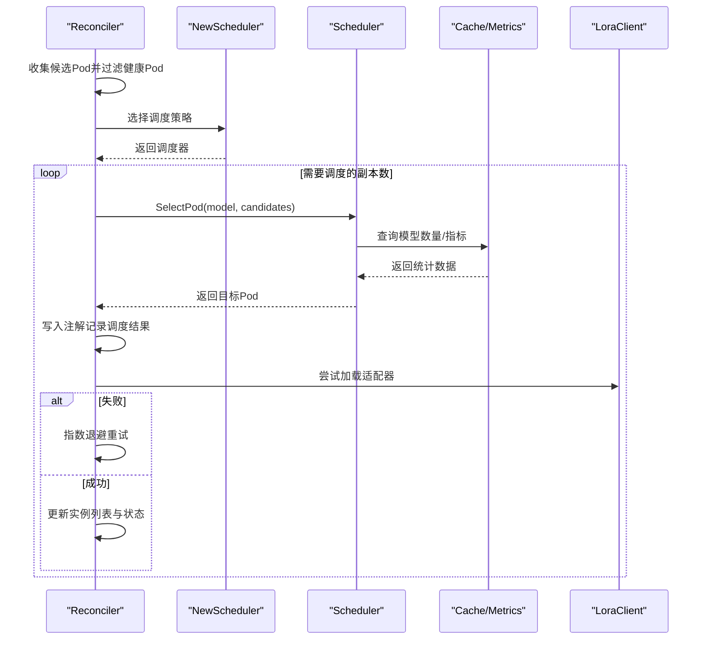
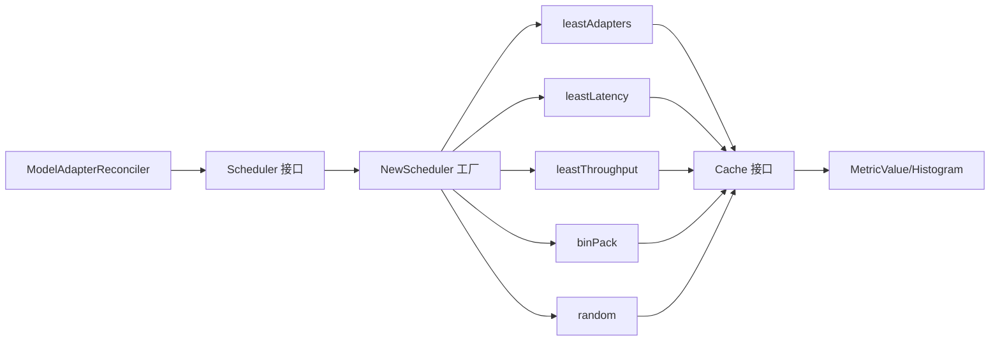

# 模型适配器调度系统

<cite>
**本文引用的文件**
- [scheduler.go](file://pkg/controller/modeladapter/scheduling/scheduler.go)
- [least_adapters.go](file://pkg/controller/modeladapter/scheduling/least_adapters.go)
- [bin_pack.go](file://pkg/controller/modeladapter/scheduling/bin_pack.go)
- [least_throughput.go](file://pkg/controller/modeladapter/scheduling/least_throughput.go)
- [least_latency.go](file://pkg/controller/modeladapter/scheduling/least_latency.go)
- [random.go](file://pkg/controller/modeladapter/scheduling/random.go)
- [modeladapter_controller.go](file://pkg/controller/modeladapter/modeladapter_controller.go)
- [cache_api.go](file://pkg/cache/cache_api.go)
- [types.go](file://pkg/metrics/types.go)
- [config.go](file://pkg/config/config.go)
- [modeladapter_controller_test.go](file://pkg/controller/modeladapter/modeladapter_controller_test.go)
</cite>

## 目录
1. [简介](#简介)
2. [项目结构](#项目结构)
3. [核心组件](#核心组件)
4. [架构总览](#架构总览)
5. [详细组件分析](#详细组件分析)
6. [依赖分析](#依赖分析)
7. [性能考量](#性能考量)
8. [故障排查指南](#故障排查指南)
9. [结论](#结论)
10. [附录](#附录)

## 简介
本技术文档面向AIBrix模型适配器调度系统，系统通过控制器在Kubernetes集群中对“模型适配器”进行生命周期管理，并在单实例模式下选择合适的Pod承载适配器。调度系统采用可插拔的策略接口，支持最少适配器、最低延迟、最低吞吐量、二进制打包和随机等策略；同时提供统一工厂方法按配置选择具体调度器。

调度系统的关键流程：
- 控制器周期性或事件触发地收集可用Pod并过滤出“可路由”的健康Pod集合
- 根据配置的调度策略，从候选Pod中选择目标Pod
- 将调度决策持久化到资源注解，随后进入加载阶段
- 加载成功后更新状态，完成一次完整的调度-加载闭环

## 项目结构
围绕调度系统的核心代码位于以下模块：
- 调度器接口与工厂：pkg/controller/modeladapter/scheduling
- 控制器编排：pkg/controller/modeladapter/modeladapter_controller.go
- 缓存与指标接口：pkg/cache/cache_api.go、pkg/metrics/types.go
- 运行时配置：pkg/config/config.go
- 测试用例：pkg/controller/modeladapter/modeladapter_controller_test.go

图表来源
- [scheduler.go:28-50](file://pkg/controller/modeladapter/scheduling/scheduler.go#L28-L50)
- [least_adapters.go:28-55](file://pkg/controller/modeladapter/scheduling/least_adapters.go#L28-L55)
- [least_latency.go:29-61](file://pkg/controller/modeladapter/scheduling/least_latency.go#L29-L61)
- [least_throughput.go:29-61](file://pkg/controller/modeladapter/scheduling/least_throughput.go#L29-L61)
- [bin_pack.go:28-62](file://pkg/controller/modeladapter/scheduling/bin_pack.go#L28-L62)
- [random.go:28-44](file://pkg/controller/modeladapter/scheduling/random.go#L28-L44)
- [modeladapter_controller.go:581-726](file://pkg/controller/modeladapter/modeladapter_controller.go#L581-L726)
- [cache_api.go:25-109](file://pkg/cache/cache_api.go#L25-L109)
- [types.go:90-101](file://pkg/metrics/types.go#L90-L101)

章节来源
- [scheduler.go:28-50](file://pkg/controller/modeladapter/scheduling/scheduler.go#L28-L50)
- [modeladapter_controller.go:581-726](file://pkg/controller/modeladapter/modeladapter_controller.go#L581-L726)
- [cache_api.go:25-109](file://pkg/cache/cache_api.go#L25-L109)
- [types.go:90-101](file://pkg/metrics/types.go#L90-L101)

## 核心组件
- 调度器接口与工厂
  - 接口定义了SelectPod方法，输入为模型名与候选Pod列表，输出为目标Pod指针与错误
  - 工厂根据策略名称返回对应调度器实例，未知策略返回错误
- 内置调度算法
  - 最少适配器：统计每个Pod上已加载模型数量，选择数量最少者
  - 二进制打包：基于容量阈值与剩余空间选择最接近空闲容量的Pod
  - 最低延迟：聚合队列时延与推理时延的均值，选择最小者
  - 最低吞吐量：聚合提示与生成的吞吐量，选择最小者（用于保守策略）
  - 随机：从候选Pod中等概率随机选择
- 控制器编排
  - reconcileReplicas负责收集候选Pod并过滤健康Pod
  - schedulePods循环调用调度器选择目标Pod，并移除已选Pod避免重复
  - 将调度结果写入注解，进入加载阶段
- 缓存与指标
  - Cache接口提供Pod/模型/指标查询能力
  - 指标类型支持简单值、直方图、Prometheus查询结果等

章节来源
- [scheduler.go:28-50](file://pkg/controller/modeladapter/scheduling/scheduler.go#L28-L50)
- [least_adapters.go:38-55](file://pkg/controller/modeladapter/scheduling/least_adapters.go#L38-L55)
- [bin_pack.go:38-62](file://pkg/controller/modeladapter/scheduling/bin_pack.go#L38-L62)
- [least_latency.go:39-61](file://pkg/controller/modeladapter/scheduling/least_latency.go#L39-L61)
- [least_throughput.go:39-61](file://pkg/controller/modeladapter/scheduling/least_throughput.go#L39-L61)
- [random.go:38-44](file://pkg/controller/modeladapter/scheduling/random.go#L38-L44)
- [modeladapter_controller.go:581-726](file://pkg/controller/modeladapter/modeladapter_controller.go#L581-L726)
- [cache_api.go:25-109](file://pkg/cache/cache_api.go#L25-L109)
- [types.go:90-101](file://pkg/metrics/types.go#L90-L101)

## 架构总览
调度系统采用“控制器-调度器-缓存/指标”的分层设计：
- 控制器负责状态收敛与流程编排
- 调度器作为策略抽象，屏蔽具体算法细节
- 缓存/指标提供运行态数据支撑（模型数量、吞吐、时延等）

图表来源
- [modeladapter_controller.go:581-726](file://pkg/controller/modeladapter/modeladapter_controller.go#L581-L726)
- [scheduler.go:34-50](file://pkg/controller/modeladapter/scheduling/scheduler.go#L34-L50)
- [cache_api.go:71-103](file://pkg/cache/cache_api.go#L71-L103)

## 详细组件分析

### 调度器接口与工厂
- 接口职责
  - 统一的SelectPod签名，保证不同策略的一致性
  - 输入保证非空且均为可路由健康Pod
- 工厂策略映射
  - 支持random、leastAdapters、binPack、leastLatency、leastThroughput
  - 未知策略返回错误，便于早期发现配置问题

图表来源
- [scheduler.go:28-32](file://pkg/controller/modeladapter/scheduling/scheduler.go#L28-L32)
- [random.go:28-36](file://pkg/controller/modeladapter/scheduling/random.go#L28-L36)
- [least_adapters.go:28-36](file://pkg/controller/modeladapter/scheduling/least_adapters.go#L28-L36)
- [bin_pack.go:28-36](file://pkg/controller/modeladapter/scheduling/bin_pack.go#L28-L36)
- [least_latency.go:29-37](file://pkg/controller/modeladapter/scheduling/least_latency.go#L29-L37)
- [least_throughput.go:29-37](file://pkg/controller/modeladapter/scheduling/least_throughput.go#L29-L37)

章节来源
- [scheduler.go:28-50](file://pkg/controller/modeladapter/scheduling/scheduler.go#L28-L50)

### 最少适配器策略（leastAdapters）
- 选择逻辑
  - 遍历候选Pod，查询该Pod上已加载模型列表长度
  - 选择模型数量最少的Pod作为目标
- 适用场景
  - 希望在Pod之间均衡分配模型，避免某些节点过载
- 性能特征
  - 时间复杂度O(N)，N为候选Pod数量
  - 依赖缓存接口查询模型列表，需关注缓存命中率

图表来源
- [least_adapters.go:38-55](file://pkg/controller/modeladapter/scheduling/least_adapters.go#L38-L55)
- [cache_api.go:71-78](file://pkg/cache/cache_api.go#L71-L78)

章节来源
- [least_adapters.go:38-55](file://pkg/controller/modeladapter/scheduling/least_adapters.go#L38-L55)
- [cache_api.go:71-78](file://pkg/cache/cache_api.go#L71-L78)

### 二进制打包策略（binPack）
- 选择逻辑
  - 设定Pod容量上限（当前为硬编码示例），若模型数量达到上限则跳过
  - 计算剩余容量（容量-当前模型数），选择剩余容量最小的可用Pod
- 适用场景
  - 在有限容量约束下尽量填满Pod，减少碎片化
- 性能特征
  - 时间复杂度O(N)
  - 容量阈值应结合引擎能力与资源限制动态调整

图表来源
- [bin_pack.go:38-62](file://pkg/controller/modeladapter/scheduling/bin_pack.go#L38-L62)
- [cache_api.go:71-78](file://pkg/cache/cache_api.go#L71-L78)

章节来源
- [bin_pack.go:38-62](file://pkg/controller/modeladapter/scheduling/bin_pack.go#L38-L62)
- [cache_api.go:71-78](file://pkg/cache/cache_api.go#L71-L78)

### 最低延迟策略（leastLatency）
- 选择逻辑
  - 获取每个候选Pod上指定模型的请求队列时延与推理时延直方图均值
  - 两者均值之和越小，认为该Pod负载越轻
- 适用场景
  - 对端到端时延敏感的在线服务
- 性能特征
  - 依赖直方图均值计算，需确保指标采集稳定

图表来源
- [least_latency.go:39-61](file://pkg/controller/modeladapter/scheduling/least_latency.go#L39-L61)
- [types.go:133-171](file://pkg/metrics/types.go#L133-L171)

章节来源
- [least_latency.go:39-61](file://pkg/controller/modeladapter/scheduling/least_latency.go#L39-L61)
- [types.go:133-171](file://pkg/metrics/types.go#L133-L171)

### 最低吞吐量策略（leastThroughput）
- 选择逻辑
  - 获取每个候选Pod上指定模型的平均提示吞吐与平均生成吞吐
  - 以加权方式综合两指标，选择综合吞吐最小的Pod
- 适用场景
  - 希望保守地选择负载较轻的Pod，避免高并发抖动
- 性能特征
  - 指标权重可调，当前实现给出示例权重

图表来源
- [least_throughput.go:39-61](file://pkg/controller/modeladapter/scheduling/least_throughput.go#L39-L61)
- [types.go:104-123](file://pkg/metrics/types.go#L104-L123)

章节来源
- [least_throughput.go:39-61](file://pkg/controller/modeladapter/scheduling/least_throughput.go#L39-L61)
- [types.go:104-123](file://pkg/metrics/types.go#L104-L123)

### 随机策略（random）
- 选择逻辑
  - 从候选Pod中等概率随机选择一个
- 适用场景
  - 简单均衡或作为基线策略
- 性能特征
  - O(1)时间复杂度，无额外指标依赖

图表来源
- [random.go:38-44](file://pkg/controller/modeladapter/scheduling/random.go#L38-L44)

章节来源
- [random.go:38-44](file://pkg/controller/modeladapter/scheduling/random.go#L38-L44)

### 控制器编排与调度决策流程
- 候选Pod收集与过滤
  - 通过标签选择匹配Pod，剔除终止或未就绪Pod
- 单实例模式下的调度
  - 逐个调用调度器SelectPod，每次选择后从候选集中移除，避免重复
  - 将调度结果写入注解，后续加载阶段优先尝试这些Pod
- 加载阶段
  - 尝试在目标Pod上加载适配器，失败则按指数退避重试
  - 成功后更新实例列表与状态，清理调度注解

图表来源
- [modeladapter_controller.go:581-726](file://pkg/controller/modeladapter/modeladapter_controller.go#L581-L726)
- [modeladapter_controller.go:800-893](file://pkg/controller/modeladapter/modeladapter_controller.go#L800-L893)
- [scheduler.go:34-50](file://pkg/controller/modeladapter/scheduling/scheduler.go#L34-L50)
- [cache_api.go:71-103](file://pkg/cache/cache_api.go#L71-L103)

章节来源
- [modeladapter_controller.go:581-726](file://pkg/controller/modeladapter/modeladapter_controller.go#L581-L726)
- [modeladapter_controller.go:800-893](file://pkg/controller/modeladapter/modeladapter_controller.go#L800-L893)

## 依赖分析
- 控制器依赖调度器接口，通过工厂注入具体策略
- 调度器依赖缓存接口查询模型数量与指标
- 指标类型抽象支持多种指标形态（简单值、直方图、Prometheus结果）

图表来源
- [modeladapter_controller.go:167-170](file://pkg/controller/modeladapter/modeladapter_controller.go#L167-L170)
- [scheduler.go:34-50](file://pkg/controller/modeladapter/scheduling/scheduler.go#L34-L50)
- [cache_api.go:25-109](file://pkg/cache/cache_api.go#L25-L109)
- [types.go:90-101](file://pkg/metrics/types.go#L90-L101)

章节来源
- [modeladapter_controller.go:167-170](file://pkg/controller/modeladapter/modeladapter_controller.go#L167-L170)
- [scheduler.go:34-50](file://pkg/controller/modeladapter/scheduling/scheduler.go#L34-L50)
- [cache_api.go:25-109](file://pkg/cache/cache_api.go#L25-L109)
- [types.go:90-101](file://pkg/metrics/types.go#L90-L101)

## 性能考量
- 策略选择
  - 最少适配器与二进制打包：O(N)遍历，适合中小规模候选集
  - 最低延迟/最低吞吐量：依赖指标查询，需关注指标采集频率与稳定性
  - 随机策略：O(1)，开销最小
- 资源与容量
  - 二进制打包策略的容量阈值需结合引擎最大并发与资源限制动态设置
- 指标质量
  - 直方图均值与简单值的准确性直接影响最低延迟/最低吞吐量策略效果
- 重试与退避
  - 控制器对加载失败采用指数退避，避免频繁重试造成抖动

## 故障排查指南
- 调度策略未知
  - 现象：工厂返回错误
  - 排查：确认配置中的调度策略名称拼写与枚举一致
- 指标查询失败
  - 现象：最低延迟/最低吞吐量策略返回错误
  - 排查：检查指标采集链路、Prometheus连接与指标名称
- 候选Pod为空
  - 现象：无法选择目标Pod
  - 排查：确认Pod标签选择器、就绪条件与控制器权限
- 加载失败重试
  - 现象：控制器持续重试并记录指数退避
  - 排查：检查引擎端日志、网络连通性与适配器兼容性

章节来源
- [scheduler.go:47-49](file://pkg/controller/modeladapter/scheduling/scheduler.go#L47-L49)
- [least_latency.go:44-51](file://pkg/controller/modeladapter/scheduling/least_latency.go#L44-L51)
- [least_throughput.go:44-51](file://pkg/controller/modeladapter/scheduling/least_throughput.go#L44-L51)
- [modeladapter_controller.go:1055-1098](file://pkg/controller/modeladapter/modeladapter_controller.go#L1055-L1098)

## 结论
AIBrix模型适配器调度系统通过清晰的接口与工厂模式实现了策略的可插拔扩展，结合缓存与指标能力在单实例模式下完成稳健的Pod选择与加载。不同策略适用于不同的业务目标：最少适配器与二进制打包偏向资源利用均衡与容量填充，最低延迟与最低吞吐量偏向运行时性能与稳定性，随机策略提供简单均衡与基线对比。建议在生产环境中结合指标质量与容量约束选择合适策略，并通过注解与状态观察调度与加载行为。

## 附录
- 配置项
  - 调度策略名称：通过运行时配置传入工厂，决定使用哪种调度器
- 自定义调度策略实现指南
  - 实现Scheduler接口的SelectPod方法
  - 在工厂中注册新策略名称与构造函数
  - 在控制器中通过配置启用新策略
- 测试参考
  - 可参考测试文件中的mock调度器实现，验证控制器对调度器接口的调用路径

章节来源
- [config.go:25-41](file://pkg/config/config.go#L25-L41)
- [scheduler.go:34-50](file://pkg/controller/modeladapter/scheduling/scheduler.go#L34-L50)
- [modeladapter_controller_test.go:478-504](file://pkg/controller/modeladapter/modeladapter_controller_test.go#L478-L504)