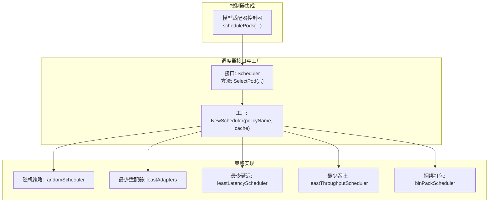
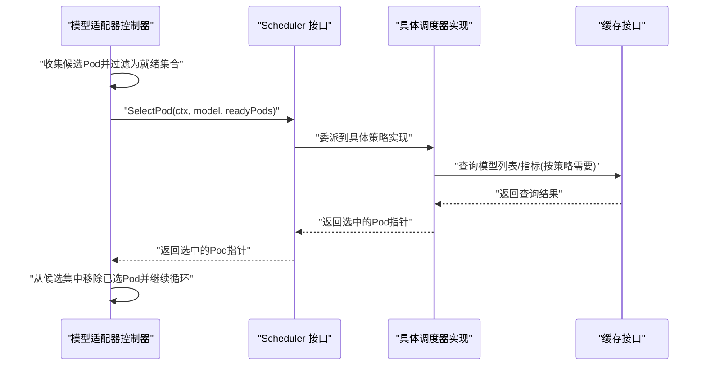
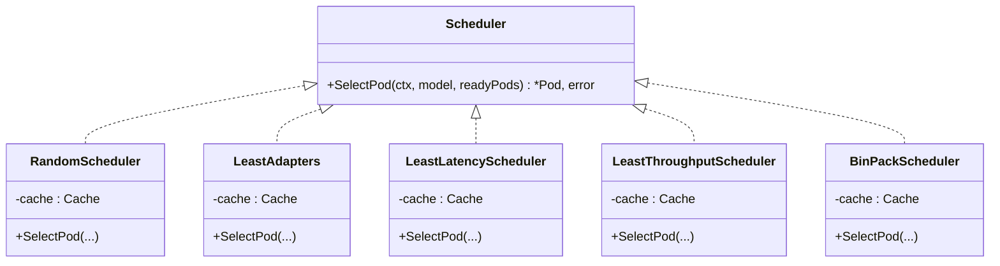
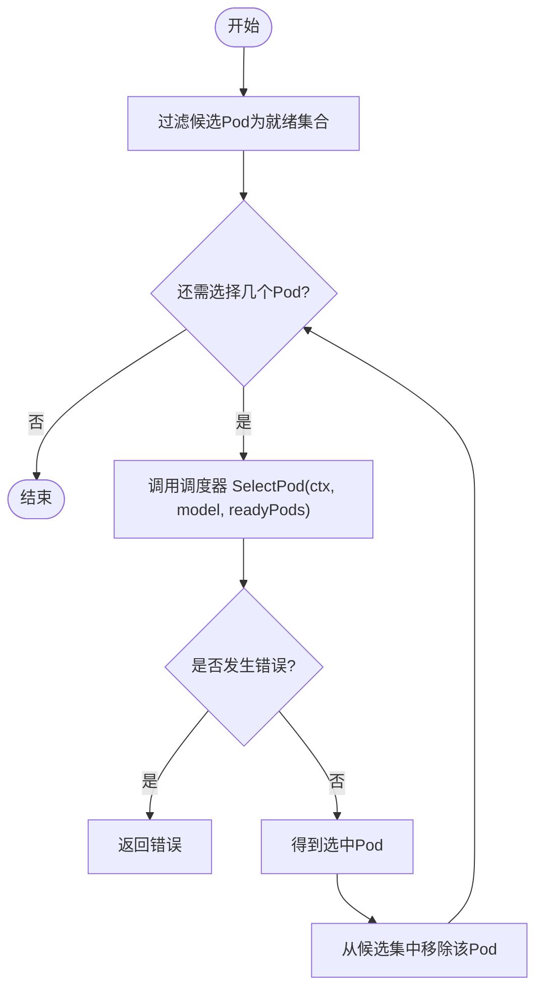
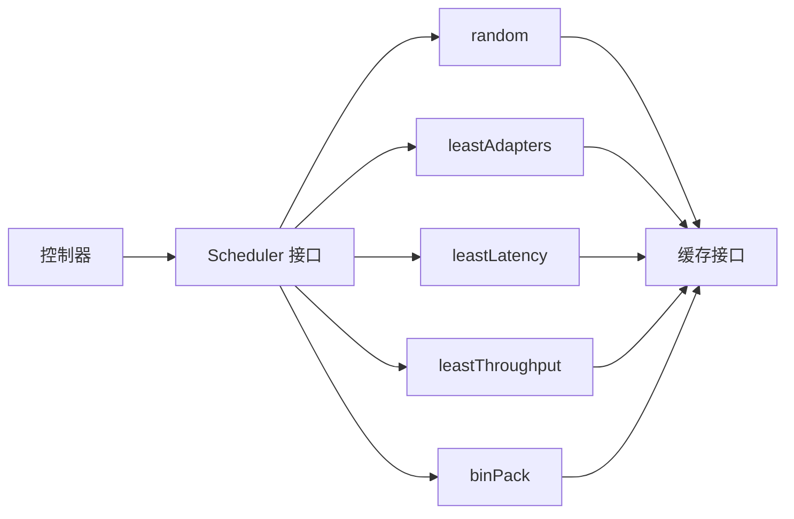

# 调度器接口设计

<cite>
**本文引用的文件**
- [scheduler.go](file://pkg/controller/modeladapter/scheduling/scheduler.go)
- [bin_pack.go](file://pkg/controller/modeladapter/scheduling/bin_pack.go)
- [least_adapters.go](file://pkg/controller/modeladapter/scheduling/least_adapters.go)
- [least_latency.go](file://pkg/controller/modeladapter/scheduling/least_latency.go)
- [least_throughput.go](file://pkg/controller/modeladapter/scheduling/least_throughput.go)
- [random.go](file://pkg/controller/modeladapter/scheduling/random.go)
- [modeladapter_controller.go](file://pkg/controller/modeladapter/modeladapter_controller.go)
- [modeladapter_controller_test.go](file://pkg/controller/modeladapter/modeladapter_controller_test.go)
- [cache_api.go](file://pkg/cache/cache_api.go)
- [types.go](file://pkg/metrics/types.go)
</cite>

## 目录
1. [简介](#简介)
2. [项目结构](#项目结构)
3. [核心组件](#核心组件)
4. [架构总览](#架构总览)
5. [详细组件分析](#详细组件分析)
6. [依赖分析](#依赖分析)
7. [性能考量](#性能考量)
8. [故障排查指南](#故障排查指南)
9. [结论](#结论)
10. [附录](#附录)

## 简介
本文件系统化阐述 AIBrix 模型适配器调度器接口的设计与实现，重点覆盖以下内容：
- Scheduler 接口的设计理念与职责边界
- 核心方法 SelectPod 的参数语义、前置条件与返回约定
- 工厂方法 NewScheduler 的策略映射、错误处理与扩展性
- 典型调度策略（随机、最少适配器、最少延迟、最少吞吐、捆绑打包）的实现要点
- 在控制器中的调用流程与最佳实践
- 自定义调度器的实现指南、演进历史与兼容性建议

## 项目结构
调度器相关代码位于控制器子模块中，采用“接口 + 多实现 + 工厂”的分层设计：
- 接口与工厂：定义统一调度接口与策略选择工厂
- 策略实现：按资源占用、延迟、吞吐等维度实现不同调度算法
- 控制器集成：在模型适配器控制器中通过调度器完成目标 Pod 选择

图表来源
- [scheduler.go:27-50](file://pkg/controller/modeladapter/scheduling/scheduler.go#L27-L50)
- [random.go:28-44](file://pkg/controller/modeladapter/scheduling/random.go#L28-L44)
- [least_adapters.go:28-55](file://pkg/controller/modeladapter/scheduling/least_adapters.go#L28-L55)
- [least_latency.go:29-61](file://pkg/controller/modeladapter/scheduling/least_latency.go#L29-L61)
- [least_throughput.go:29-61](file://pkg/controller/modeladapter/scheduling/least_throughput.go#L29-L61)
- [bin_pack.go:28-62](file://pkg/controller/modeladapter/scheduling/bin_pack.go#L28-L62)
- [modeladapter_controller.go:699-726](file://pkg/controller/modeladapter/modeladapter_controller.go#L699-L726)

章节来源
- [scheduler.go:27-50](file://pkg/controller/modeladapter/scheduling/scheduler.go#L27-L50)
- [modeladapter_controller.go:699-726](file://pkg/controller/modeladapter/modeladapter_controller.go#L699-L726)

## 核心组件
- Scheduler 接口
  - 职责：从一组“已就绪且可路由”的 Pod 中，依据模型标识符与当前状态，选择一个最合适的 Pod 承载模型适配器实例
  - 方法签名与约束：SelectPod(ctx, model, readyPods) -> (*Pod, error)，其中 readyPods 非空且仅包含可路由的就绪 Pod
- 工厂方法 NewScheduler
  - 输入：策略名称字符串与缓存实例
  - 输出：具体的调度器实例或错误
  - 支持策略：random、leastAdapters、binPack、leastLatency、leastThroughput
  - 错误处理：未知策略返回错误

章节来源
- [scheduler.go:27-50](file://pkg/controller/modeladapter/scheduling/scheduler.go#L27-L50)

## 架构总览
调度器在控制器中的调用路径如下：

图表来源
- [modeladapter_controller.go:699-726](file://pkg/controller/modeladapter/modeladapter_controller.go#L699-L726)
- [scheduler.go:27-32](file://pkg/controller/modeladapter/scheduling/scheduler.go#L27-L32)
- [cache_api.go:25-109](file://pkg/cache/cache_api.go#L25-L109)

## 详细组件分析

### 接口与工厂
- 接口设计
  - 明确输入输出契约：上下文、模型名、就绪 Pod 列表；返回单个 Pod 指针与错误
  - 前置条件：readyPods 非空且均为可路由就绪 Pod，由控制器保证
- 工厂方法
  - 策略映射：将字符串策略名映射到具体调度器构造函数
  - 错误处理：未知策略返回错误，便于上层显式处理
  - 可扩展性：新增策略只需实现接口并在工厂中注册

图表来源
- [scheduler.go:27-32](file://pkg/controller/modeladapter/scheduling/scheduler.go#L27-L32)
- [random.go:28-44](file://pkg/controller/modeladapter/scheduling/random.go#L28-L44)
- [least_adapters.go:28-55](file://pkg/controller/modeladapter/scheduling/least_adapters.go#L28-L55)
- [least_latency.go:29-61](file://pkg/controller/modeladapter/scheduling/least_latency.go#L29-L61)
- [least_throughput.go:29-61](file://pkg/controller/modeladapter/scheduling/least_throughput.go#L29-L61)
- [bin_pack.go:28-62](file://pkg/controller/modeladapter/scheduling/bin_pack.go#L28-L62)

章节来源
- [scheduler.go:27-50](file://pkg/controller/modeladapter/scheduling/scheduler.go#L27-L50)

### 策略实现概览
- 随机策略
  - 从就绪 Pod 列表中等概率随机选择
  - 优点：简单、低开销；缺点：不考虑负载与指标
- 最少适配器
  - 统计每个 Pod 上已加载的模型数量，选择模型数最少的 Pod
  - 优点：均衡各节点模型密度
- 最少延迟
  - 读取队列时延与推理时延的均值之和，选择总延迟最小的 Pod
  - 依赖指标缓存接口
- 最少吞吐
  - 组合提示吞吐与生成吞吐，选择整体吞吐最小的 Pod
  - 依赖指标缓存接口
- 捆绑打包
  - 计算剩余容量，优先选择剩余空间最大的 Pod
  - 当前示例使用固定容量占位，实际应从缓存读取

章节来源
- [random.go:28-44](file://pkg/controller/modeladapter/scheduling/random.go#L28-L44)
- [least_adapters.go:28-55](file://pkg/controller/modeladapter/scheduling/least_adapters.go#L28-L55)
- [least_latency.go:29-61](file://pkg/controller/modeladapter/scheduling/least_latency.go#L29-L61)
- [least_throughput.go:29-61](file://pkg/controller/modeladapter/scheduling/least_throughput.go#L29-L61)
- [bin_pack.go:28-62](file://pkg/controller/modeladapter/scheduling/bin_pack.go#L28-L62)

### 控制器中的调度流程
- 单 Pod 加载模式
  - 控制器根据候选 Pod 过滤出真正可调度的就绪 Pod
  - 循环调用调度器 SelectPod，每次从剩余候选集中选择一个 Pod，并将其从候选集移除
  - 将调度决策写入注解，确保后续加载阶段按决策执行
- 多 Pod 加载模式
  - 不涉及调度器，直接对所有候选 Pod 进行加载

图表来源
- [modeladapter_controller.go:628-697](file://pkg/controller/modeladapter/modeladapter_controller.go#L628-L697)
- [modeladapter_controller.go:699-726](file://pkg/controller/modeladapter/modeladapter_controller.go#L699-L726)

章节来源
- [modeladapter_controller.go:628-697](file://pkg/controller/modeladapter/modeladapter_controller.go#L628-L697)
- [modeladapter_controller.go:699-726](file://pkg/controller/modeladapter/modeladapter_controller.go#L699-L726)

### 缓存与指标接口
- 缓存接口
  - 提供 Pod 查询、模型列表查询、指标查询等能力
  - 调度器实现通过缓存读取模型数量、指标值等
- 指标类型
  - 定义了直方图、简单值、Prometheus 结果等多种指标值抽象
  - 用于最少延迟与最少吞吐策略的指标聚合

章节来源
- [cache_api.go:25-109](file://pkg/cache/cache_api.go#L25-L109)
- [types.go:90-171](file://pkg/metrics/types.go#L90-L171)

### 使用示例与最佳实践
- 选择策略
  - 若追求均衡：leastAdapters
  - 若追求低延迟：leastLatency
  - 若追求高吞吐：leastThroughput
  - 若追求资源利用率：binPack
  - 若追求简单与公平：random
- 控制器侧注意事项
  - 确保传入的 readyPods 已由控制器过滤为“可路由且就绪”
  - 对于多副本场景，建议使用“加载到全部”模式以避免调度器复杂度
  - 将调度决策写入注解，便于后续加载阶段复用
- 测试与验证
  - 使用 mockScheduler 验证调度器接口行为与错误分支

章节来源
- [modeladapter_controller_test.go:478-505](file://pkg/controller/modeladapter/modeladapter_controller_test.go#L478-L505)
- [modeladapter_controller.go:628-697](file://pkg/controller/modeladapter/modeladapter_controller.go#L628-L697)

### 自定义调度器实现指南
- 实现步骤
  - 实现 Scheduler 接口的 SelectPod 方法
  - 在工厂方法中增加策略映射，支持新策略名称
  - 如需指标或模型信息，请通过缓存接口访问
- 设计要点
  - 保持 SelectPod 的幂等性与确定性（相同输入输出一致）
  - 正确处理缓存查询失败与空结果
  - 严格遵守“readyPods 非空且可路由”的前提
- 扩展性
  - 新增策略无需修改控制器调用点，仅需在工厂注册
  - 通过缓存接口抽象屏蔽底层存储细节

章节来源
- [scheduler.go:27-50](file://pkg/controller/modeladapter/scheduling/scheduler.go#L27-L50)
- [cache_api.go:25-109](file://pkg/cache/cache_api.go#L25-L109)

## 依赖分析
- 组件耦合
  - 控制器依赖 Scheduler 接口，不关心具体实现，耦合度低
  - 各策略实现依赖缓存接口，用于读取模型与指标
- 直接依赖链
  - 控制器 -> Scheduler 接口 -> 具体策略实现 -> 缓存接口
- 潜在循环依赖
  - 未发现循环依赖，接口与实现分层清晰

图表来源
- [modeladapter_controller.go:699-726](file://pkg/controller/modeladapter/modeladapter_controller.go#L699-L726)
- [scheduler.go:27-50](file://pkg/controller/modeladapter/scheduling/scheduler.go#L27-L50)
- [cache_api.go:25-109](file://pkg/cache/cache_api.go#L25-L109)

章节来源
- [modeladapter_controller.go:699-726](file://pkg/controller/modeladapter/modeladapter_controller.go#L699-L726)
- [scheduler.go:27-50](file://pkg/controller/modeladapter/scheduling/scheduler.go#L27-L50)
- [cache_api.go:25-109](file://pkg/cache/cache_api.go#L25-L109)

## 性能考量
- 策略选择
  - 随机与最少适配器：O(n) 遍历，常数级开销
  - 最少延迟/最少吞吐：O(n) 遍历 + 指标查询，查询次数与 n 成正比
  - 捆绑打包：O(n) 遍历 + 容量计算，当前示例使用固定容量占位
- 控制器侧
  - 多次调用调度器时，建议在循环内维护“剩余候选集”，避免重复扫描
  - 对于大规模集群，可考虑缓存热点 Pod 的指标，减少查询压力
- 指标与缓存
  - 指标查询可能带来网络与解析开销，建议结合业务场景评估采样频率
  - 缓存接口抽象允许替换底层实现，便于引入本地缓存或批量查询

## 故障排查指南
- 常见问题
  - 未知策略名称：工厂返回错误，检查配置项
  - 无可用 Pod：SelectPod 返回错误，检查就绪过滤逻辑
  - 指标查询失败：最少延迟/最少吞吐策略会返回错误，检查指标采集与缓存配置
- 调试建议
  - 在策略实现中打印选中 Pod 的关键信息，便于定位
  - 使用 mockScheduler 验证错误路径与边界条件
  - 关注控制器日志中“已选择的 Pod”与“剩余候选集”的变化

章节来源
- [scheduler.go:47-49](file://pkg/controller/modeladapter/scheduling/scheduler.go#L47-L49)
- [least_latency.go:44-51](file://pkg/controller/modeladapter/scheduling/least_latency.go#L44-L51)
- [least_throughput.go:44-51](file://pkg/controller/modeladapter/scheduling/least_throughput.go#L44-L51)
- [modeladapter_controller_test.go:478-505](file://pkg/controller/modeladapter/modeladapter_controller_test.go#L478-L505)

## 结论
调度器接口通过“接口 + 工厂 + 多实现”的设计，实现了策略的可插拔与可扩展。控制器仅依赖接口契约，降低了与具体策略的耦合；同时，通过缓存接口抽象，策略实现可以灵活访问模型与指标数据。在实践中，应根据业务目标选择合适策略，并在大规模场景下关注指标查询与缓存性能。

## 附录
- 演进历史与兼容性
  - 当前版本提供五种内置策略，工厂方法集中管理策略映射，新增策略仅需实现接口并在工厂注册，保持对外接口稳定
  - 指标查询依赖缓存接口，未来可替换为更高效的数据源而不影响调度器接口
- 术语说明
  - 就绪 Pod：控制器已确认可路由且稳定的 Pod 集合
  - 可路由：Pod 处于健康状态，可承载模型适配器实例