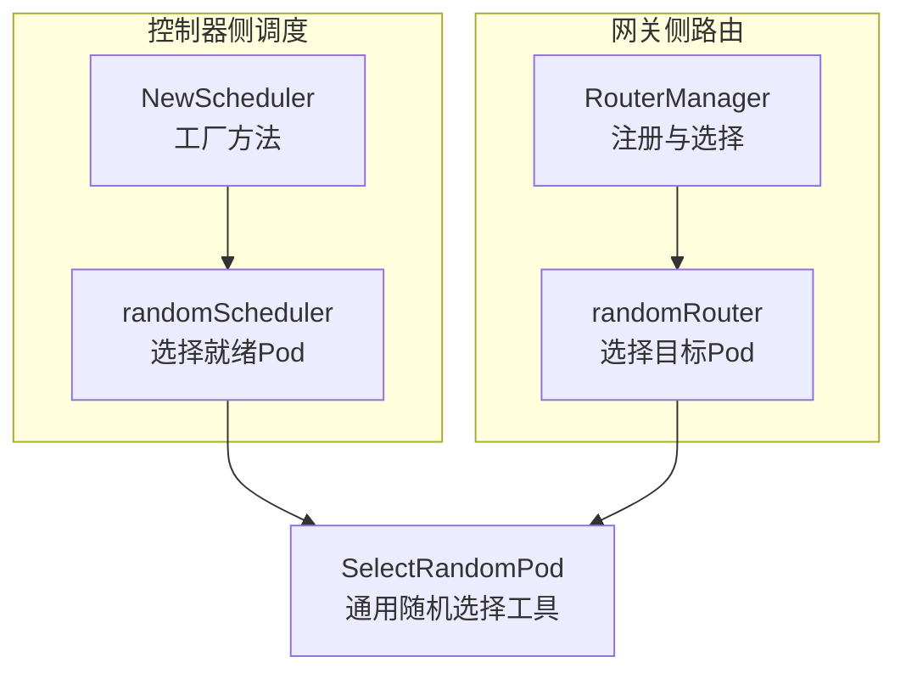
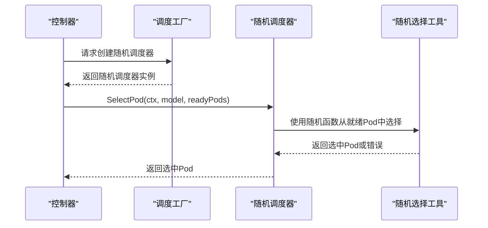
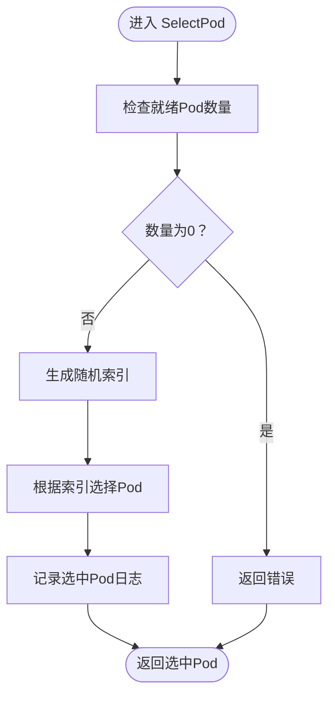
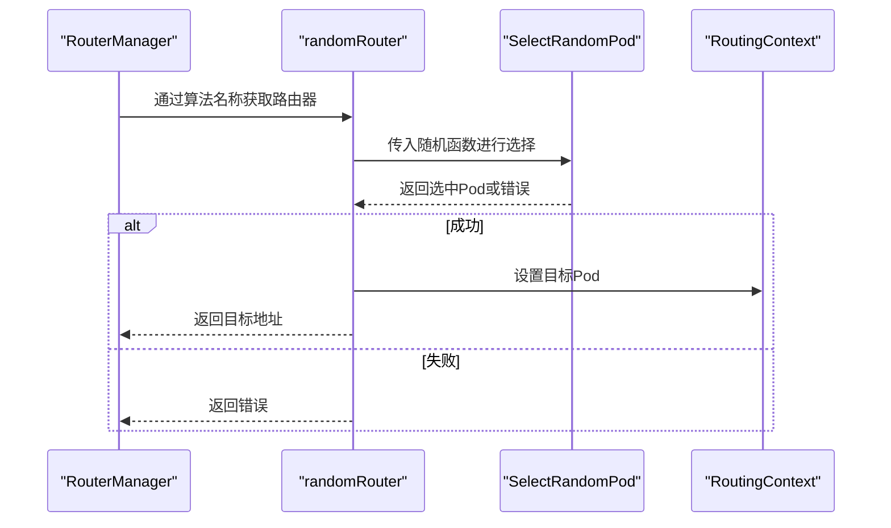
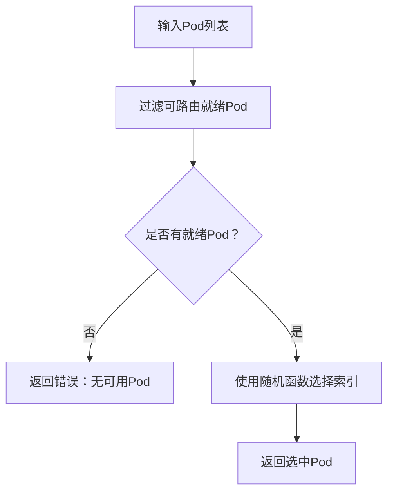
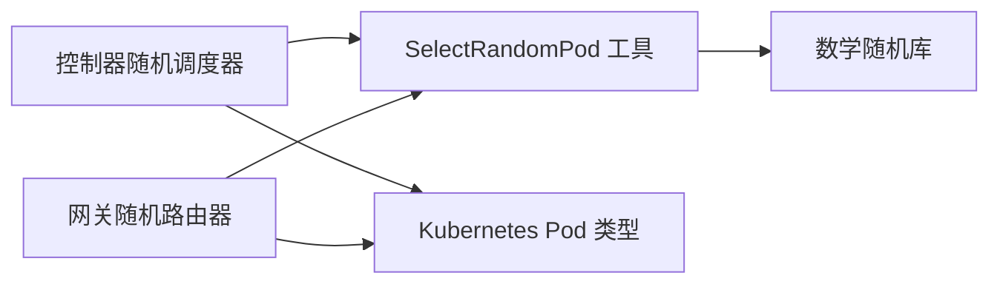

# 随机调度策略

<cite>
**本文档引用的文件**
- [random.go](file://pkg/controller/modeladapter/scheduling/random.go)
- [scheduler.go](file://pkg/controller/modeladapter/scheduling/scheduler.go)
- [random.go](file://pkg/plugins/gateway/algorithms/random.go)
- [router.go](file://pkg/plugins/gateway/algorithms/router.go)
- [pod.go](file://pkg/utils/pod.go)
- [router_test.go](file://pkg/plugins/gateway/algorithms/router_test.go)
</cite>

## 目录
1. [引言](#引言)
2. [项目结构](#项目结构)
3. [核心组件](#核心组件)
4. [架构概览](#架构概览)
5. [详细组件分析](#详细组件分析)
6. [依赖分析](#依赖分析)
7. [性能考虑](#性能考虑)
8. [故障排查指南](#故障排查指南)
9. [结论](#结论)
10. [附录](#附录)

## 引言
本文件针对 AIBrix 中的随机调度策略进行系统化技术说明，重点阐述其设计目标、实现原理、质量保障、统计特性、性能表现与适用场景，并提供测试与验证方法。随机策略适用于简单负载分布场景，追求快速、无偏见的调度决策，避免复杂计算带来的额外开销。

## 项目结构
随机调度策略在两个层面实现：
- 控制器侧（模型适配器调度）：基于 Kubernetes 就绪 Pod 列表进行等概率随机选择。
- 网关侧（请求路由）：在可用 Pod 集合中进行等概率随机转发。

图表来源
- [random.go:32-44](file://pkg/controller/modeladapter/scheduling/random.go#L32-L44)
- [scheduler.go:34-50](file://pkg/controller/modeladapter/scheduling/scheduler.go#L34-L50)
- [random.go:41-57](file://pkg/plugins/gateway/algorithms/random.go#L41-L57)
- [router.go:49-85](file://pkg/plugins/gateway/algorithms/router.go#L49-L85)
- [pod.go:342-351](file://pkg/utils/pod.go#L342-L351)

章节来源
- [random.go:17-44](file://pkg/controller/modeladapter/scheduling/random.go#L17-L44)
- [scheduler.go:28-50](file://pkg/controller/modeladapter/scheduling/scheduler.go#L28-L50)
- [random.go:17-62](file://pkg/plugins/gateway/algorithms/random.go#L17-L62)
- [router.go:49-85](file://pkg/plugins/gateway/algorithms/router.go#L49-L85)
- [pod.go:342-351](file://pkg/utils/pod.go#L342-L351)

## 核心组件
- 控制器侧随机调度器
  - 接口：实现统一调度接口，接收上下文、模型标识与就绪 Pod 列表，返回选中的 Pod。
  - 实现：通过等概率随机索引从就绪列表中选取目标 Pod。
  - 日志：记录被选中 Pod 的关键信息，便于审计与排障。
- 网关侧随机路由器
  - 注册：以常量标识注册到路由管理器，支持按算法名称动态选择。
  - 路由：调用通用随机选择工具，设置路由上下文的目标 Pod 并返回目标地址。
- 通用随机选择工具
  - 过滤：优先过滤出可路由的就绪 Pod。
  - 选择：通过传入的随机函数实现等概率选择。
  - 错误处理：当无可选 Pod 时返回错误，确保上层逻辑可感知异常。

章节来源
- [random.go:28-44](file://pkg/controller/modeladapter/scheduling/random.go#L28-L44)
- [scheduler.go:28-32](file://pkg/controller/modeladapter/scheduling/scheduler.go#L28-L32)
- [random.go:27-62](file://pkg/plugins/gateway/algorithms/random.go#L27-L62)
- [pod.go:342-351](file://pkg/utils/pod.go#L342-L351)

## 架构概览
随机策略在两类场景中协同工作：控制器侧用于模型适配器的 Pod 分配；网关侧用于请求的 Pod 转发。两者均依赖统一的“可路由就绪 Pod”集合与等概率随机选择工具。

图表来源
- [scheduler.go:34-50](file://pkg/controller/modeladapter/scheduling/scheduler.go#L34-L50)
- [random.go:32-44](file://pkg/controller/modeladapter/scheduling/random.go#L32-L44)
- [pod.go:342-351](file://pkg/utils/pod.go#L342-L351)

## 详细组件分析

### 控制器侧随机调度器
- 设计要点
  - 仅依赖就绪 Pod 列表，无需额外指标或权重，实现极简。
  - 通过等概率随机索引选择，天然满足均匀分布假设。
  - 与缓存交互用于日志记录，不参与选择逻辑。
- 复杂度
  - 时间复杂度：O(1)，直接索引访问。
  - 空间复杂度：O(1)，不分配额外结构。
- 可靠性
  - 输入保证非空且均为可路由就绪 Pod，避免边界错误。
  - 日志输出包含被选 Pod 的对象信息，便于追踪。

图表来源
- [random.go:38-44](file://pkg/controller/modeladapter/scheduling/random.go#L38-L44)

章节来源
- [random.go:28-44](file://pkg/controller/modeladapter/scheduling/random.go#L28-L44)

### 网关侧随机路由器
- 设计要点
  - 以常量标识注册，支持通过算法名称动态选择。
  - 调用通用随机选择工具，确保与控制器侧一致的随机行为。
  - 设置路由上下文的目标 Pod，便于后续链路使用。
- 可靠性
  - 当无可选 Pod 时返回明确错误，避免静默失败。
  - 与路由管理器协作，支持回退至随机策略。

图表来源
- [random.go:41-57](file://pkg/plugins/gateway/algorithms/random.go#L41-L57)
- [router.go:71-82](file://pkg/plugins/gateway/algorithms/router.go#L71-L82)
- [pod.go:342-351](file://pkg/utils/pod.go#L342-L351)

章节来源
- [random.go:27-62](file://pkg/plugins/gateway/algorithms/random.go#L27-L62)
- [router.go:49-85](file://pkg/plugins/gateway/algorithms/router.go#L49-L85)

### 通用随机选择工具
- 功能
  - 过滤可路由就绪 Pod，确保选择集合有效。
  - 通过传入的随机函数实现等概率选择。
  - 对空集合返回错误，便于上层处理。
- 与控制器/网关的协作
  - 控制器侧直接使用随机函数生成索引。
  - 网关侧通过工具函数封装，统一行为。

图表来源
- [pod.go:342-351](file://pkg/utils/pod.go#L342-L351)

章节来源
- [pod.go:342-351](file://pkg/utils/pod.go#L342-L351)

## 依赖分析
- 组件耦合
  - 控制器侧随机调度器与通用工具存在直接依赖，但耦合度低，职责清晰。
  - 网关侧随机路由器对通用工具的依赖同样低，仅通过接口参数注入随机函数。
- 外部依赖
  - 数学随机库用于生成等概率索引。
  - Kubernetes API 类型用于 Pod 描述与状态判断。
- 循环依赖
  - 未发现循环依赖，模块边界清晰。

图表来源
- [random.go:19-26](file://pkg/controller/modeladapter/scheduling/random.go#L19-L26)
- [random.go:19-25](file://pkg/plugins/gateway/algorithms/random.go#L19-L25)
- [pod.go:342-351](file://pkg/utils/pod.go#L342-L351)

章节来源
- [random.go:19-26](file://pkg/controller/modeladapter/scheduling/random.go#L19-L26)
- [random.go:19-25](file://pkg/plugins/gateway/algorithms/random.go#L19-L25)
- [pod.go:342-351](file://pkg/utils/pod.go#L342-L351)

## 性能考虑
- 时间复杂度
  - 控制器侧：O(1)，直接数组索引访问。
  - 网关侧：O(1)，随机函数调用与索引选择。
- 空间复杂度
  - O(1)，不引入额外数据结构。
- 统计特性
  - 在大规模部署中，若就绪 Pod 数量稳定且随机源质量良好，则长期分布趋近均匀。
  - 建议在高并发场景下关注随机源的线程安全性与熵质量，避免伪随机导致的短期聚集。
- 适用场景
  - 负载分布相对均匀、无明显资源倾斜。
  - 对延迟敏感度较低，更注重稳定性与低开销。

## 故障排查指南
- 常见问题
  - 无可选 Pod：当过滤后集合为空时会返回错误，需检查 Pod 就绪状态与可路由性。
  - 随机源问题：若出现异常聚集或重复，检查随机种子与并发安全。
- 定位方法
  - 查看控制器侧日志中被选 Pod 的对象信息，确认选择是否符合预期。
  - 在网关侧路由测试中，使用固定种子验证随机行为一致性。
- 测试参考
  - 网关侧随机选择单元测试覆盖了单个/多个就绪 Pod、无 Pod、无 IP 等场景，可作为行为验证模板。

章节来源
- [random.go:42-43](file://pkg/controller/modeladapter/scheduling/random.go#L42-L43)
- [router_test.go:198-306](file://pkg/plugins/gateway/algorithms/router_test.go#L198-L306)

## 结论
随机调度策略以极简实现提供快速、无偏见的调度决策，适合简单负载分布场景。其 O(1) 时间与空间复杂度、等概率选择机制与良好的可扩展性，使其在大规模部署中具备稳定的统计特性。结合统一的随机选择工具与完善的测试用例，可在多种场景中可靠运行，并在需要时与其他策略组合使用。

## 附录
- 适用条件
  - 就绪 Pod 集合稳定且可路由。
  - 不需要基于指标的智能选择。
- 组合使用建议
  - 与健康检查策略结合，确保就绪集合质量。
  - 在特殊场景（如故障恢复、滚动升级）中，随机策略可作为默认兜底，降低复杂度。
- 性能基准建议
  - 在相同硬件与网络条件下，对比随机策略与其他策略的延迟与吞吐差异，评估收益与成本。