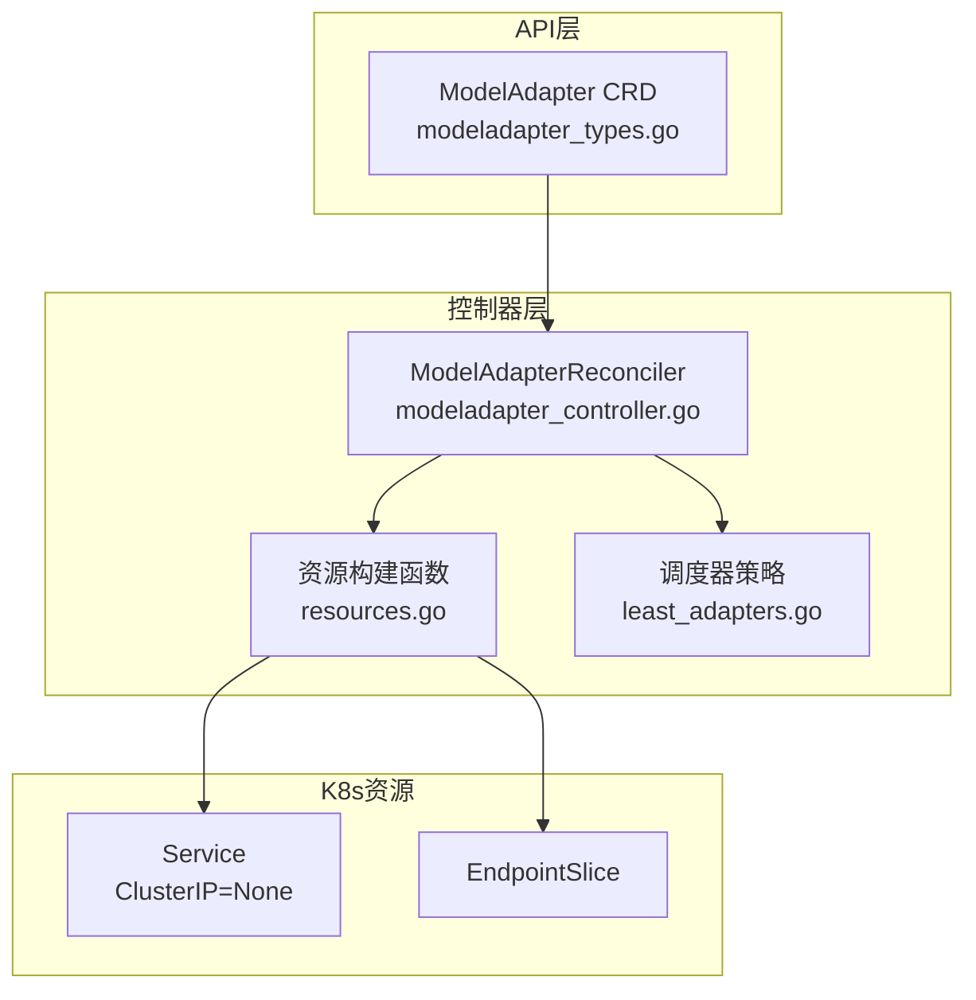
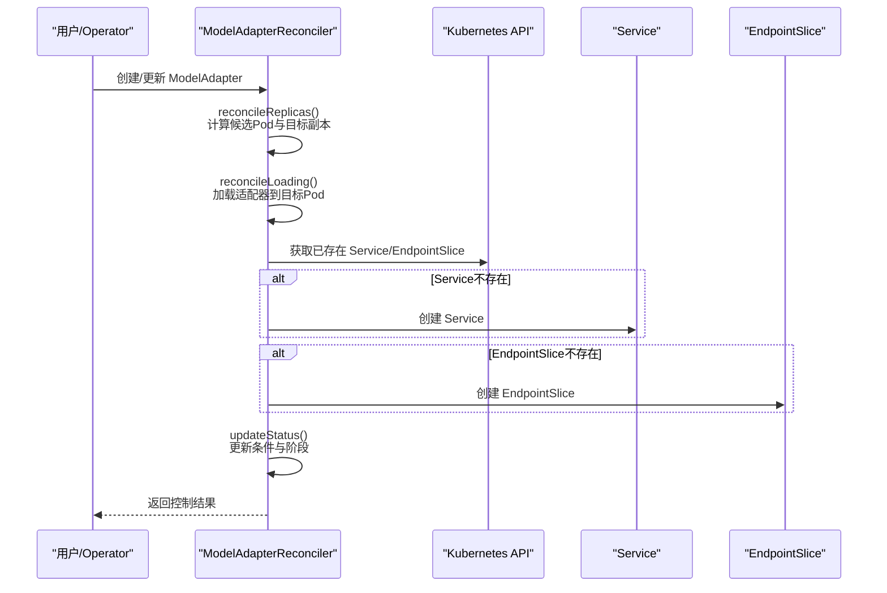
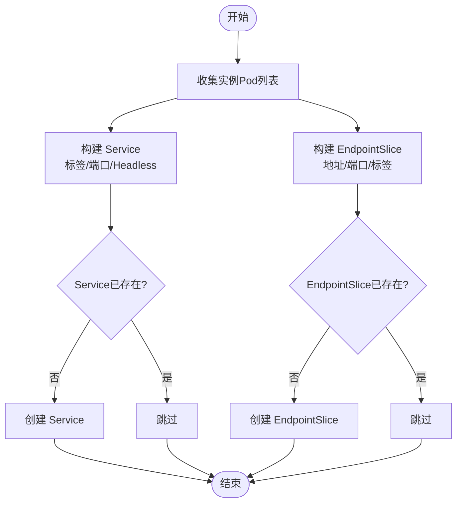
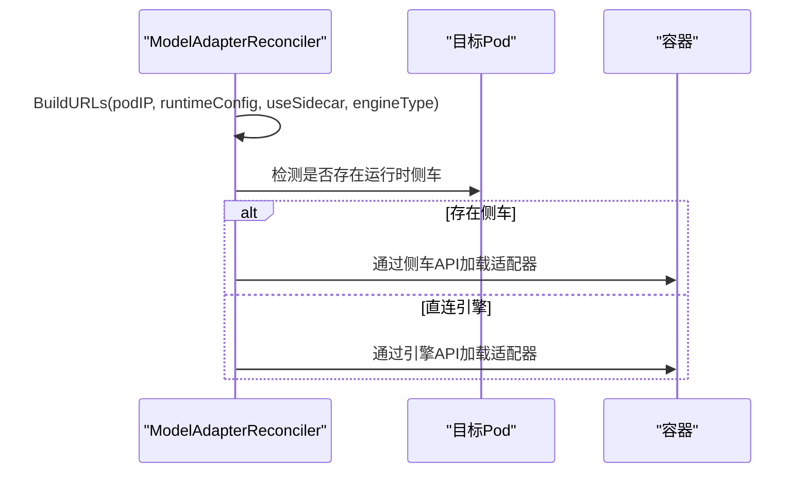
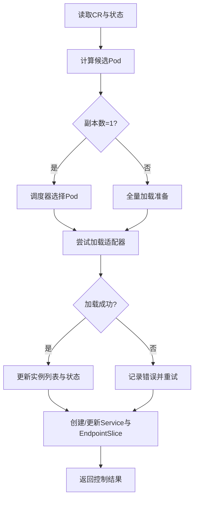
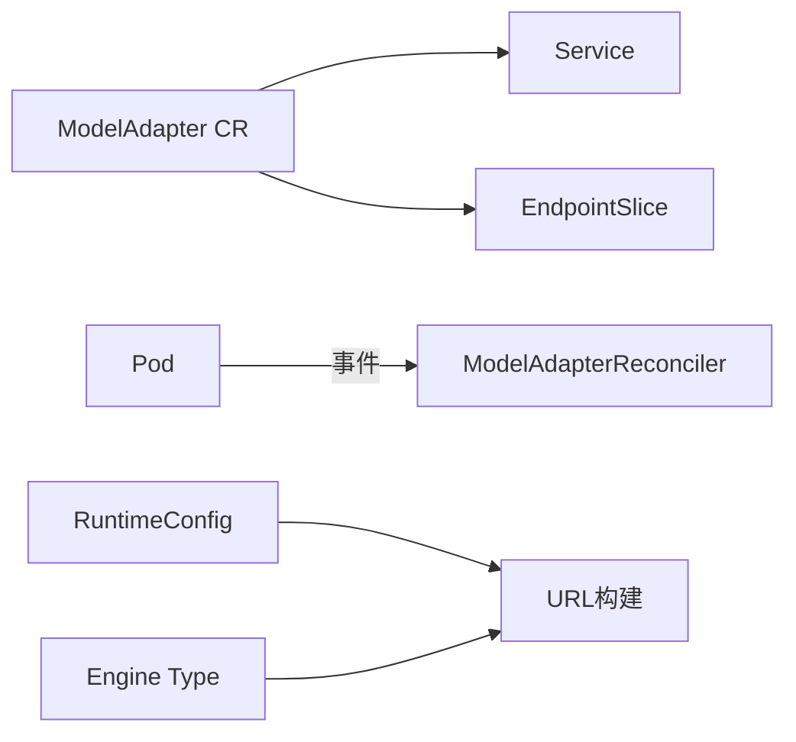

# 模型适配器资源配置

<cite>
**本文引用的文件**
- [modeladapter_types.go](file://api/model/v1alpha1/modeladapter_types.go)
- [modeladapter_controller.go](file://pkg/controller/modeladapter/modeladapter_controller.go)
- [resources.go](file://pkg/controller/modeladapter/resources.go)
- [utils.go](file://pkg/controller/modeladapter/utils.go)
- [resources_test.go](file://pkg/controller/modeladapter/resources_test.go)
- [modeladapter_controller_test.go](file://pkg/controller/modeladapter/modeladapter_controller_test.go)
- [adapter.yaml](file://samples/adapter/adapter.yaml)
- [model_adapter.yaml](file://development/tutorials/lora/model_adapter.yaml)
- [model_adapter_api_key.yaml](file://development/tutorials/lora/model_adapter_api_key.yaml)
- [least_adapters.go](file://pkg/controller/modeladapter/scheduling/least_adapters.go)
</cite>

## 目录
1. [简介](#简介)
2. [项目结构](#项目结构)
3. [核心组件](#核心组件)
4. [架构总览](#架构总览)
5. [详细组件分析](#详细组件分析)
6. [依赖分析](#依赖分析)
7. [性能考虑](#性能考虑)
8. [故障排查指南](#故障排查指南)
9. [结论](#结论)
10. [附录](#附录)

## 简介
本技术文档聚焦于AIBrix模型适配器（ModelAdapter）在Kubernetes中的资源配置机制，系统性阐述控制器如何基于CRD定义生成并维护服务发现资源（Service与EndpointSlice），以及在多场景下的标签与注解策略、资源模板渲染流程、环境变量注入、卷挂载与网络策略的配置方式。同时提供最佳实践、常见问题排查与性能优化建议，帮助用户在生产环境中稳定、高效地部署与运维模型适配器。

## 项目结构
围绕模型适配器的资源配置，相关代码主要分布在以下模块：
- CRD与类型定义：api/model/v1alpha1
- 控制器实现：pkg/controller/modeladapter
- 资源构建工具：pkg/controller/modeladapter/resources.go
- 调度器策略：pkg/controller/modeladapter/scheduling
- 示例与教程：samples/adapter、development/tutorials/lora

图表来源
- [modeladapter_types.go:26-61](file://api/model/v1alpha1/modeladapter_types.go#L26-L61)
- [modeladapter_controller.go:313-493](file://pkg/controller/modeladapter/modeladapter_controller.go#L313-L493)
- [resources.go:64-102](file://pkg/controller/modeladapter/resources.go#L64-L102)

章节来源
- [modeladapter_types.go:26-61](file://api/model/v1alpha1/modeladapter_types.go#L26-L61)
- [modeladapter_controller.go:313-493](file://pkg/controller/modeladapter/modeladapter_controller.go#L313-L493)
- [resources.go:64-102](file://pkg/controller/modeladapter/resources.go#L64-L102)

## 核心组件
- ModelAdapter CRD：定义适配器的期望状态，包括基础模型标识、Pod选择器、调度器名称、模型制品地址、凭据引用、副本数与附加配置等。
- ModelAdapterReconciler：控制器主循环，负责实例化、加载、服务与端点资源的创建与维护，并通过条件与阶段状态反馈运行态。
- 资源构建器：根据当前匹配的Pod集合动态生成Service与EndpointSlice，确保服务发现与负载分发。
- 调度器：在单副本模式下按策略选择目标Pod，支持“最少适配器”等策略。

章节来源
- [modeladapter_types.go:26-61](file://api/model/v1alpha1/modeladapter_types.go#L26-L61)
- [modeladapter_controller.go:313-493](file://pkg/controller/modeladapter/modeladapter_controller.go#L313-L493)
- [resources.go:28-62](file://pkg/controller/modeladapter/resources.go#L28-L62)
- [least_adapters.go:38-55](file://pkg/controller/modeladapter/scheduling/least_adapters.go#L38-L55)

## 架构总览
控制器的执行流程遵循“实例化→加载→创建服务与端点→更新状态”的顺序，期间对Pod健康度、就绪时间与迁移情况进行判定与补偿。

图表来源
- [modeladapter_controller.go:437-493](file://pkg/controller/modeladapter/modeladapter_controller.go#L437-L493)
- [resources.go:64-102](file://pkg/controller/modeladapter/resources.go#L64-L102)

## 详细组件分析

### 资源模板与服务发现
- Service生成策略
  - 名称与命名空间与CR一致。
  - 标签包含“适配器名”键；若指定了基础模型，则追加“模型标识”键。
  - 端口固定为8000（HTTP），TargetPort同为8000。
  - 使用ClusterIP=None（Headless），允许直接通过Pod IP访问。
  - 发布未就绪地址以支持滚动升级与迁移期间的连通性。
- EndpointSlice生成策略
  - 基于当前实例列表中的Pod，提取PodIP作为地址。
  - 端口与协议与Service保持一致。
  - 标签包含“kubernetes.io/service-name”指向对应Service，便于关联。
  - 由控制器作为OwnerReference进行管理。

图表来源
- [resources.go:28-62](file://pkg/controller/modeladapter/resources.go#L28-L62)
- [resources.go:64-102](file://pkg/controller/modeladapter/resources.go#L64-L102)

章节来源
- [resources.go:28-62](file://pkg/controller/modeladapter/resources.go#L28-L62)
- [resources.go:64-102](file://pkg/controller/modeladapter/resources.go#L64-L102)
- [resources_test.go:48-86](file://pkg/controller/modeladapter/resources_test.go#L48-L86)

### Pod模板与环境变量注入
- Pod模板启用标记
  - 控制器通过特定标签键值来识别可承载适配器的Pod模板，确保仅在满足条件的引擎Pod上加载适配器。
- 环境变量注入
  - 控制器在加载阶段会调用URL构建逻辑，依据运行时配置决定使用侧车或引擎直连API，并据此拼接端口与路径。
  - 该流程体现了环境变量与容器端口的动态绑定，保证API调用的正确性。

图表来源
- [utils.go:118-158](file://pkg/controller/modeladapter/utils.go#L118-L158)

章节来源
- [utils.go:118-158](file://pkg/controller/modeladapter/utils.go#L118-L158)

### 卷挂载与网络策略
- 卷挂载
  - 当前模型适配器控制器专注于服务发现资源的创建与维护，未直接在控制器中展示卷挂载的实现细节。如需在引擎Pod中挂载模型制品或密钥，通常通过引擎自身的模板或卷配置完成，控制器不直接生成卷声明。
- 网络策略
  - Service采用Headless模式，结合EndpointSlice实现细粒度端点管理；网络访问由引擎容器监听端口与路由策略共同决定。控制器未直接生成NetworkPolicy对象，网络隔离可通过集群级网络策略或Ingress/Gateway插件实现。

章节来源
- [resources.go:64-102](file://pkg/controller/modeladapter/resources.go#L64-L102)

### 标签与注解使用策略
- 标签
  - Service与EndpointSlice均携带与CR同名的标签，便于跨资源检索与关联。
  - 若指定基础模型，控制器会为Service添加模型标识标签，辅助多模型场景下的资源归类。
- 注解
  - 资源构建函数中为Service与EndpointSlice预留了注解字段，当前默认为空；可在后续扩展中用于传递额外元数据或控制行为。

章节来源
- [resources.go:64-102](file://pkg/controller/modeladapter/resources.go#L64-L102)

### 调度与亲和性
- 调度策略
  - 在单副本模式下，控制器通过调度器选择目标Pod；当前实现提供“最少适配器”策略，优先选择已有适配器数量最少的节点上的Pod，以均衡负载。
- 亲和性与容忍
  - 控制器未直接在模型适配器层面设置Node/拓扑亲和或污点容忍；如需更强的调度约束，建议在引擎Pod模板中配置相应亲和与容忍规则，控制器将基于模板进行匹配与选择。

章节来源
- [least_adapters.go:38-55](file://pkg/controller/modeladapter/scheduling/least_adapters.go#L38-L55)
- [modeladapter_controller.go:606-618](file://pkg/controller/modeladapter/modeladapter_controller.go#L606-L618)

### 资源模板渲染与实例化流程
- 实例化步骤
  - 计算候选Pod：根据Pod选择器筛选活跃且就绪的Pod。
  - 单副本模式：通过调度器选择目标Pod，并持久化调度决策；随后尝试加载适配器。
  - 全量模式：无需调度，直接在所有候选Pod上准备加载。
- 加载与重试
  - 控制器内置重试与超时机制，失败时更新状态并回退重试，直至成功或达到最大重试次数。
- 状态与条件
  - 通过条件类型与阶段状态反映生命周期各阶段，便于观测与排障。

图表来源
- [modeladapter_controller.go:581-697](file://pkg/controller/modeladapter/modeladapter_controller.go#L581-L697)
- [modeladapter_controller.go:728-800](file://pkg/controller/modeladapter/modeladapter_controller.go#L728-L800)

章节来源
- [modeladapter_controller.go:581-697](file://pkg/controller/modeladapter/modeladapter_controller.go#L581-L697)
- [modeladapter_controller.go:728-800](file://pkg/controller/modeladapter/modeladapter_controller.go#L728-L800)

### 配置清单示例
- 基础示例
  - 参考示例展示了如何通过标签选择器与基础模型标识，将适配器加载到目标引擎Pod上。
- API Key附加配置
  - 在附加配置中可传递API密钥等参数，供加载流程使用。

章节来源
- [adapter.yaml:1-40](file://samples/adapter/adapter.yaml#L1-L40)
- [model_adapter.yaml:1-16](file://development/tutorials/lora/model_adapter.yaml#L1-L16)
- [model_adapter_api_key.yaml:16-18](file://development/tutorials/lora/model_adapter_api_key.yaml#L16-L18)

## 依赖分析
- 控制器对K8s资源的依赖
  - 通过Owned关系管理Service与EndpointSlice，确保资源生命周期与CR一致。
  - 通过Watch Pod事件触发关联的模型适配器重调度，提升响应速度。
- 外部依赖
  - 运行时配置影响API调用端口与路径；调试模式下可切换到本地端口。
  - 引擎类型（如vLLM/SGLang）影响具体API路径。

图表来源
- [modeladapter_controller.go:243-256](file://pkg/controller/modeladapter/modeladapter_controller.go#L243-L256)
- [utils.go:118-158](file://pkg/controller/modeladapter/utils.go#L118-L158)

章节来源
- [modeladapter_controller.go:243-256](file://pkg/controller/modeladapter/modeladapter_controller.go#L243-L256)
- [utils.go:118-158](file://pkg/controller/modeladapter/utils.go#L118-L158)

## 性能考虑
- 调度策略
  - “最少适配器”策略有助于在多适配器场景下均衡节点压力，降低热点。
- 重试与超时
  - 合理设置重试次数与回退时间，避免频繁重试导致的抖动。
- 服务发现开销
  - Headless Service与EndpointSlice组合可减少kube-proxy转发开销，适合高吞吐场景。
- 状态更新频率
  - 控制器周期性同步与事件驱动相结合，平衡及时性与资源消耗。

## 故障排查指南
- 常见问题定位
  - Service/EndpointSlice创建失败：检查控制器日志与条件原因，确认RBAC权限与资源冲突。
  - 适配器加载失败：查看重试计数与最后重试时间注解，核对引擎端口与路径是否正确。
  - Pod未被选中：确认Pod就绪时间是否超过最小稳定窗口，以及是否满足模板启用标签。
- 关键检查点
  - Pod健康度与终止状态判断。
  - 调度决策注解与实例列表一致性。
  - 条件类型与阶段状态变化。

章节来源
- [modeladapter_controller_test.go:54-192](file://pkg/controller/modeladapter/modeladapter_controller_test.go#L54-L192)
- [modeladapter_controller.go:459-481](file://pkg/controller/modeladapter/modeladapter_controller.go#L459-L481)
- [utils.go:102-116](file://pkg/controller/modeladapter/utils.go#L102-L116)

## 结论
模型适配器控制器通过清晰的生命周期与资源编排，实现了从Pod选择、适配器加载到服务发现的完整闭环。其以Service与EndpointSlice为核心，配合调度器与状态机，能够在多场景下稳定运行。建议在生产中结合引擎模板的亲和与资源限制、网络策略与命名空间隔离，形成完整的资源配置体系。

## 附录
- 最佳实践摘要
  - 资源限制：在引擎Pod模板中明确CPU/内存限制，避免资源争抢。
  - 亲和性：通过节点/拓扑亲和将引擎与存储或网络设备就近绑定。
  - 污点容忍：对关键节点配置容忍，保障高可用。
  - 命名空间隔离：将不同业务或租户置于独立命名空间，配合RBAC与网络策略。
  - 稳定窗口：合理设置Pod就绪稳定时间，避免过早调度导致的抖动。
  - 日志与监控：开启控制器与引擎端指标，结合条件与阶段状态进行可观测性建设。