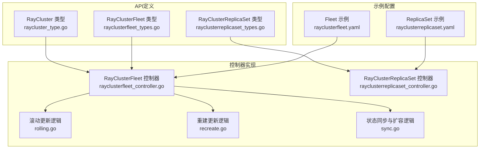
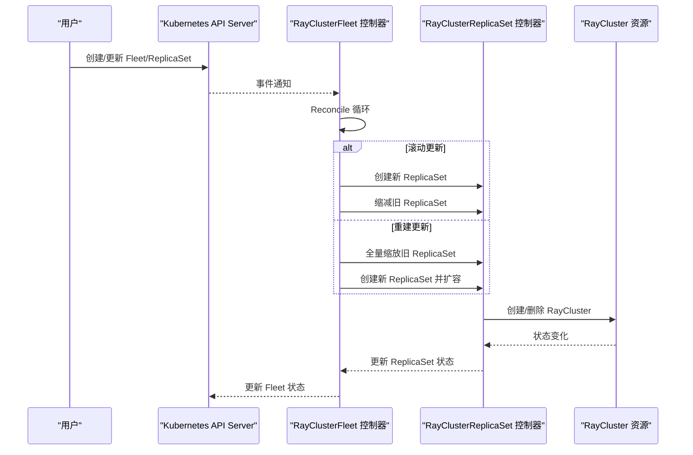
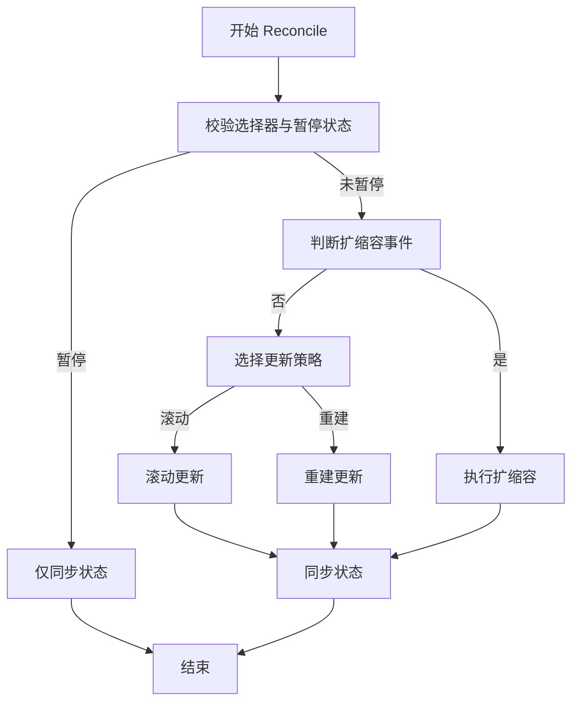
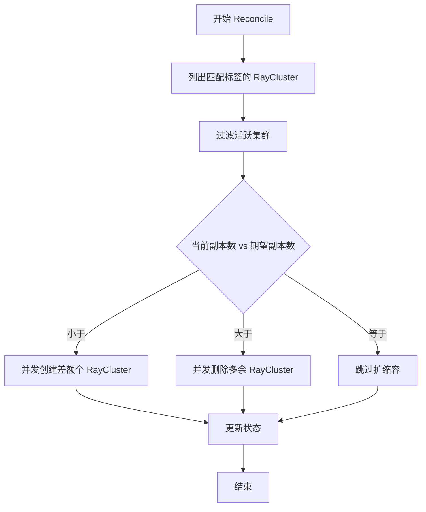
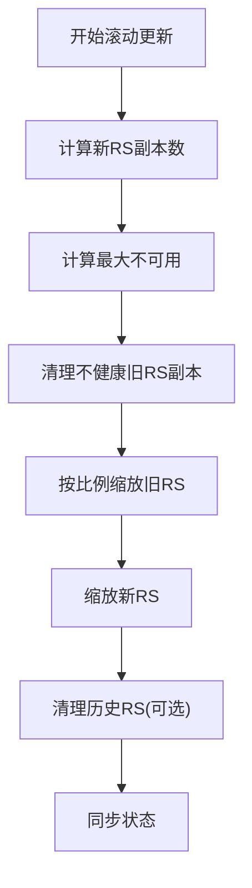
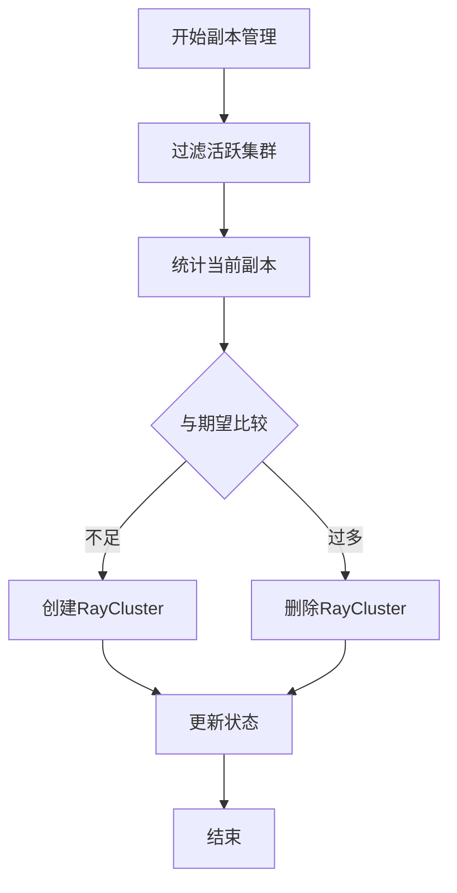
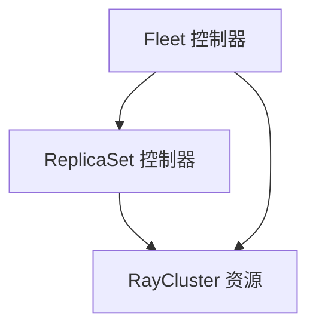

# RayCluster编排

<cite>
**本文档引用的文件**
- [raycluster_type.go](file://api/orchestration/v1alpha1/raycluster_type.go)
- [rayclusterfleet_types.go](file://api/orchestration/v1alpha1/rayclusterfleet_types.go)
- [rayclusterreplicaset_types.go](file://api/orchestration/v1alpha1/rayclusterreplicaset_types.go)
- [rayclusterfleet_controller.go](file://pkg/controller/rayclusterfleet/rayclusterfleet_controller.go)
- [rayclusterreplicaset_controller.go](file://pkg/controller/rayclusterreplicaset/rayclusterreplicaset_controller.go)
- [rolling.go](file://pkg/controller/rayclusterfleet/rolling.go)
- [recreate.go](file://pkg/controller/rayclusterfleet/recreate.go)
- [sync.go](file://pkg/controller/rayclusterfleet/sync.go)
- [rayclusterfleet.yaml](file://config/samples/orchestration_v1alpha1_rayclusterfleet.yaml)
- [rayclusterreplicaset.yaml](file://config/samples/orchestration_v1alpha1_rayclusterreplicaset.yaml)
</cite>

## 目录
1. [简介](#简介)
2. [项目结构](#项目结构)
3. [核心组件](#核心组件)
4. [架构总览](#架构总览)
5. [详细组件分析](#详细组件分析)
6. [依赖关系分析](#依赖关系分析)
7. [性能考虑](#性能考虑)
8. [故障排除指南](#故障排除指南)
9. [结论](#结论)
10. [附录](#附录)

## 简介
本文件面向RayCluster分布式推理编排系统，系统基于Kubernetes CRD与控制器模式，围绕RayClusterFleet与RayClusterReplicaSet两大核心对象，提供集群管理、任务调度与资源分配策略的完整编排能力。文档重点涵盖：
- 集群管理：通过RayClusterFleet统一编排多个RayCluster实例，支持滚动更新、重建更新、弹性扩缩容与故障恢复。
- 副本管理：通过RayClusterReplicaSet对RayCluster进行副本数量控制、健康检查与状态同步。
- 编排机制：控制器通过Reconcile循环持续对比期望状态与实际状态，驱动集群向目标状态演进。

## 项目结构
RayCluster编排系统由API定义（CRD）与控制器实现两部分组成：
- API层：在orchestration.v1alpha1命名空间下定义RayCluster、RayClusterFleet、RayClusterReplicaSet等类型，用于描述期望状态。
- 控制器层：实现针对上述类型的Reconcile逻辑，负责创建、更新、删除底层RayCluster资源，并维护状态与条件。

**图表来源**
- [raycluster_type.go:24-34](file://api/orchestration/v1alpha1/raycluster_type.go#L24-L34)
- [rayclusterfleet_types.go:27-74](file://api/orchestration/v1alpha1/rayclusterfleet_types.go#L27-L74)
- [rayclusterreplicaset_types.go:27-55](file://api/orchestration/v1alpha1/rayclusterreplicaset_types.go#L27-L55)
- [rayclusterfleet_controller.go:76-86](file://pkg/controller/rayclusterfleet/rayclusterfleet_controller.go#L76-L86)
- [rayclusterreplicaset_controller.go:73-82](file://pkg/controller/rayclusterreplicaset/rayclusterreplicaset_controller.go#L73-L82)
- [rolling.go:29-65](file://pkg/controller/rayclusterfleet/rolling.go#L29-L65)
- [recreate.go:30-77](file://pkg/controller/rayclusterfleet/recreate.go#L30-L77)
- [sync.go:48-70](file://pkg/controller/rayclusterfleet/sync.go#L48-L70)
- [rayclusterfleet.yaml:1-44](file://config/samples/orchestration_v1alpha1_rayclusterfleet.yaml#L1-L44)
- [rayclusterreplicaset.yaml:1-65](file://config/samples/orchestration_v1alpha1_rayclusterreplicaset.yaml#L1-L65)

**章节来源**
- [raycluster_type.go:24-34](file://api/orchestration/v1alpha1/raycluster_type.go#L24-L34)
- [rayclusterfleet_types.go:27-74](file://api/orchestration/v1alpha1/rayclusterfleet_types.go#L27-L74)
- [rayclusterreplicaset_types.go:27-55](file://api/orchestration/v1alpha1/rayclusterreplicaset_types.go#L27-L55)

## 核心组件
- RayCluster：作为底层Ray集群的抽象，其规格由上游KubeRay的RayClusterSpec定义，包含Head与Worker组配置、资源请求与限制、启动参数等。
- RayClusterFleet：用于管理一组RayCluster的编排实体，支持滚动更新与重建更新两种策略，具备最小可用性保障、进度超时控制、暂停/恢复、修订历史限制等功能。
- RayClusterReplicaSet：用于管理特定模板的RayCluster副本集合，负责按需创建或删除RayCluster以达到期望副本数，同时维护就绪与可用副本状态。

**章节来源**
- [raycluster_type.go:24-34](file://api/orchestration/v1alpha1/raycluster_type.go#L24-L34)
- [rayclusterfleet_types.go:27-74](file://api/orchestration/v1alpha1/rayclusterfleet_types.go#L27-L74)
- [rayclusterreplicaset_types.go:27-55](file://api/orchestration/v1alpha1/rayclusterreplicaset_types.go#L27-L55)

## 架构总览
RayCluster编排采用“声明式+控制器”的架构模式：
- 用户通过CRD声明期望状态（如Fleet或ReplicaSet），控制器持续Reconcile以驱动实际状态向期望状态收敛。
- Fleet控制器负责策略选择（滚动/重建）、扩缩容比例计算、健康检查清理与状态同步；ReplicaSet控制器负责具体副本数量的增删与状态上报。
- 底层依赖KubeRay的RayCluster资源，确保Ray集群生命周期管理与调度。

**图表来源**
- [rayclusterfleet_controller.go:107-183](file://pkg/controller/rayclusterfleet/rayclusterfleet_controller.go#L107-L183)
- [rayclusterreplicaset_controller.go:109-161](file://pkg/controller/rayclusterreplicaset/rayclusterreplicaset_controller.go#L109-L161)
- [rolling.go:29-65](file://pkg/controller/rayclusterfleet/rolling.go#L29-L65)
- [recreate.go:30-77](file://pkg/controller/rayclusterfleet/recreate.go#L30-L77)

## 详细组件分析

### RayClusterFleet 控制器
- 职责：根据策略（滚动/重建）协调多个ReplicaSet，实现弹性扩缩容、滚动更新与故障恢复；维护进度、可用性与条件信息。
- 关键流程：
  - 选择器校验与暂停检测
  - 获取关联的ReplicaSet与RayCluster映射
  - 判断是否为扩缩容事件
  - 执行滚动或重建更新
  - 同步状态与清理历史版本

**图表来源**
- [rayclusterfleet_controller.go:107-183](file://pkg/controller/rayclusterfleet/rayclusterfleet_controller.go#L107-L183)
- [sync.go:48-70](file://pkg/controller/rayclusterfleet/sync.go#L48-L70)
- [rolling.go:29-65](file://pkg/controller/rayclusterfleet/rolling.go#L29-L65)
- [recreate.go:30-77](file://pkg/controller/rayclusterfleet/recreate.go#L30-L77)

**章节来源**
- [rayclusterfleet_controller.go:107-183](file://pkg/controller/rayclusterfleet/rayclusterfleet_controller.go#L107-L183)
- [sync.go:48-70](file://pkg/controller/rayclusterfleet/sync.go#L48-L70)
- [rolling.go:29-65](file://pkg/controller/rayclusterfleet/rolling.go#L29-L65)
- [recreate.go:30-77](file://pkg/controller/rayclusterfleet/recreate.go#L30-L77)

### RayClusterReplicaSet 控制器
- 职责：根据期望副本数与当前RayCluster集合，执行创建或删除操作，维护就绪/可用副本计数，上报状态。
- 关键流程：
  - 过滤活跃RayCluster
  - 计算差额并并发删除（带并发上限）
  - 更新状态（含观察到的代际）

**图表来源**
- [rayclusterreplicaset_controller.go:109-161](file://pkg/controller/rayclusterreplicaset/rayclusterreplicaset_controller.go#L109-L161)
- [rayclusterreplicaset_controller.go:163-213](file://pkg/controller/rayclusterreplicaset/rayclusterreplicaset_controller.go#L163-L213)
- [rayclusterreplicaset_controller.go:215-247](file://pkg/controller/rayclusterreplicaset/rayclusterreplicaset_controller.go#L215-L247)

**章节来源**
- [rayclusterreplicaset_controller.go:109-161](file://pkg/controller/rayclusterreplicaset/rayclusterreplicaset_controller.go#L109-L161)
- [rayclusterreplicaset_controller.go:163-213](file://pkg/controller/rayclusterreplicaset/rayclusterreplicaset_controller.go#L163-L213)
- [rayclusterreplicaset_controller.go:215-247](file://pkg/controller/rayclusterreplicaset/rayclusterreplicaset_controller.go#L215-L247)

### 弹性扩缩容与滚动更新
- 滚动更新：通过计算最大不可用与最大Surge，按比例缩放新旧ReplicaSet，优先清理不健康副本，保证服务最小可用性。
- 重建更新：先将旧ReplicaSet全部缩放至0，确认无旧Pod运行后，再创建新ReplicaSet并扩容至目标数量。
- 故障恢复：在滚动更新中优先清理不健康副本，避免因旧副本不健康导致的可用性下降。

**图表来源**
- [rolling.go:67-151](file://pkg/controller/rayclusterfleet/rolling.go#L67-L151)
- [rolling.go:153-188](file://pkg/controller/rayclusterfleet/rolling.go#L153-L188)
- [rolling.go:190-234](file://pkg/controller/rayclusterfleet/rolling.go#L190-L234)

**章节来源**
- [rolling.go:67-151](file://pkg/controller/rayclusterfleet/rolling.go#L67-L151)
- [rolling.go:153-188](file://pkg/controller/rayclusterfleet/rolling.go#L153-L188)
- [rolling.go:190-234](file://pkg/controller/rayclusterfleet/rolling.go#L190-L234)

### 副本管理与健康检查
- 副本数量控制：根据ReplicaSet的期望副本数与当前RayCluster集合差额，执行创建或删除。
- 健康检查：过滤活跃RayCluster，统计就绪/可用副本，避免对非活跃集群计数。
- 状态同步：控制器记录期望满足情况，仅在满足预期后更新状态，防止竞态。

**图表来源**
- [rayclusterreplicaset_controller.go:136-152](file://pkg/controller/rayclusterreplicaset/rayclusterreplicaset_controller.go#L136-L152)
- [rayclusterreplicaset_controller.go:163-213](file://pkg/controller/rayclusterreplicaset/rayclusterreplicaset_controller.go#L163-L213)
- [rayclusterreplicaset_controller.go:215-247](file://pkg/controller/rayclusterreplicaset/rayclusterreplicaset_controller.go#L215-L247)

**章节来源**
- [rayclusterreplicaset_controller.go:136-152](file://pkg/controller/rayclusterreplicaset/rayclusterreplicaset_controller.go#L136-L152)
- [rayclusterreplicaset_controller.go:163-213](file://pkg/controller/rayclusterreplicaset/rayclusterreplicaset_controller.go#L163-L213)
- [rayclusterreplicaset_controller.go:215-247](file://pkg/controller/rayclusterreplicaset/rayclusterreplicaset_controller.go#L215-L247)

### 配置示例与使用场景
- 单节点集群：通过ReplicaSet定义Head组，不配置Worker组或设置worker副本为0。
- 多节点集群：在ReplicaSet中配置Head与Worker组，分别设置资源与副本范围。
- 高可用部署：在Fleet中使用滚动更新策略，合理设置maxUnavailable与maxSurge，确保最小可用性。

示例文件路径：
- [Fleet示例:1-44](file://config/samples/orchestration_v1alpha1_rayclusterfleet.yaml#L1-L44)
- [ReplicaSet示例:1-65](file://config/samples/orchestration_v1alpha1_rayclusterreplicaset.yaml#L1-L65)

**章节来源**
- [rayclusterfleet.yaml:1-44](file://config/samples/orchestration_v1alpha1_rayclusterfleet.yaml#L1-L44)
- [rayclusterreplicaset.yaml:1-65](file://config/samples/orchestration_v1alpha1_rayclusterreplicaset.yaml#L1-L65)

## 依赖关系分析
- 组件耦合：
  - Fleet控制器依赖ReplicaSet控制器与RayCluster资源，负责高层策略与状态同步。
  - ReplicaSet控制器直接依赖RayCluster资源，负责具体扩缩容与状态更新。
- 外部依赖：
  - 使用KubeRay的RayCluster作为底层资源模型。
  - 使用Kubernetes标准的apps/v1与core/v1类型进行标签选择与状态管理。

**图表来源**
- [rayclusterfleet_controller.go:76-86](file://pkg/controller/rayclusterfleet/rayclusterfleet_controller.go#L76-L86)
- [rayclusterreplicaset_controller.go:73-82](file://pkg/controller/rayclusterreplicaset/rayclusterreplicaset_controller.go#L73-L82)

**章节来源**
- [rayclusterfleet_controller.go:76-86](file://pkg/controller/rayclusterfleet/rayclusterfleet_controller.go#L76-L86)
- [rayclusterreplicaset_controller.go:73-82](file://pkg/controller/rayclusterreplicaset/rayclusterreplicaset_controller.go#L73-L82)

## 性能考虑
- 并发删除：ReplicaSet控制器在缩容时采用并发goroutine与信号量限制，避免对API Server造成过大压力。
- 状态更新去抖：控制器仅在满足期望后更新状态，减少不必要的写操作。
- 滚动更新比例：通过maxUnavailable与maxSurge控制变更速率，平衡可用性与更新速度。

**章节来源**
- [rayclusterreplicaset_controller.go:177-182](file://pkg/controller/rayclusterreplicaset/rayclusterreplicaset_controller.go#L177-L182)
- [rayclusterreplicaset_controller.go:215-247](file://pkg/controller/rayclusterreplicaset/rayclusterreplicaset_controller.go#L215-L247)
- [rolling.go:126-128](file://pkg/controller/rayclusterfleet/rolling.go#L126-L128)

## 故障排除指南
- 选择器为空：若Fleet选择器为空，控制器会记录警告并仅更新状态，避免误选所有RayCluster。
- 暂停状态：当Fleet被暂停时，控制器仅同步状态而不进行变更，直至恢复。
- 滚动失败：若创建新ReplicaSet失败，控制器会记录失败原因并更新进度条件，便于排查。
- 健康副本阻塞：滚动更新中优先清理不健康副本，若可用副本数低于最小可用阈值，更新会被延迟。

**章节来源**
- [rayclusterfleet_controller.go:125-137](file://pkg/controller/rayclusterfleet/rayclusterfleet_controller.go#L125-L137)
- [rayclusterfleet_controller.go:75-103](file://pkg/controller/rayclusterfleet/rayclusterfleet_controller.go#L75-L103)
- [sync.go:275-290](file://pkg/controller/rayclusterfleet/sync.go#L275-L290)
- [rolling.go:126-151](file://pkg/controller/rayclusterfleet/rolling.go#L126-L151)

## 结论
RayCluster编排系统通过Fleet与ReplicaSet两级抽象，结合KubeRay的RayCluster资源，实现了对分布式推理集群的全生命周期管理。Fleet控制器提供策略化编排与状态同步，ReplicaSet控制器负责具体扩缩容与健康检查，二者协同确保集群在弹性扩缩容、滚动更新与故障恢复方面的稳定性与可观测性。配合合理的资源配置与更新策略，可在保证业务连续性的前提下高效完成集群演进。

## 附录
- 配置示例参考：
  - [Fleet示例:1-44](file://config/samples/orchestration_v1alpha1_rayclusterfleet.yaml#L1-L44)
  - [ReplicaSet示例:1-65](file://config/samples/orchestration_v1alpha1_rayclusterreplicaset.yaml#L1-L65)