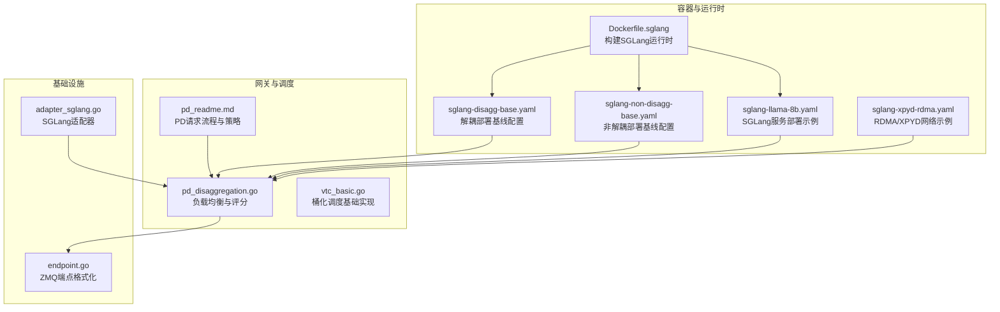
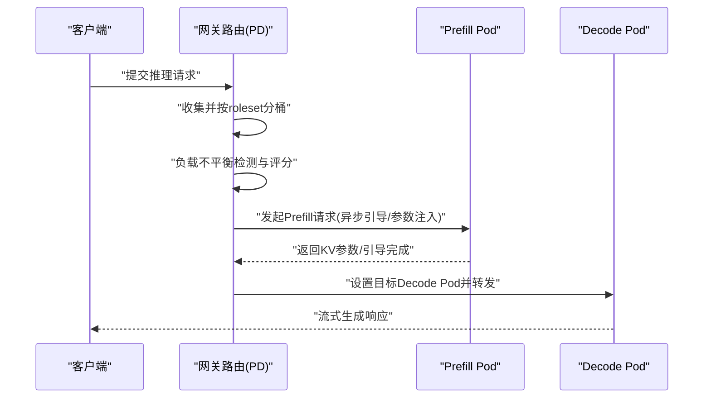
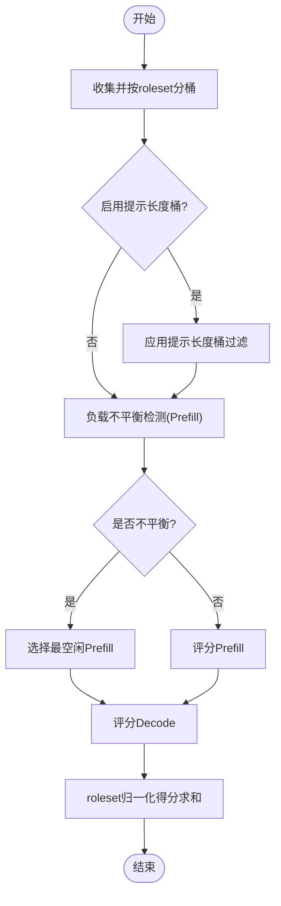
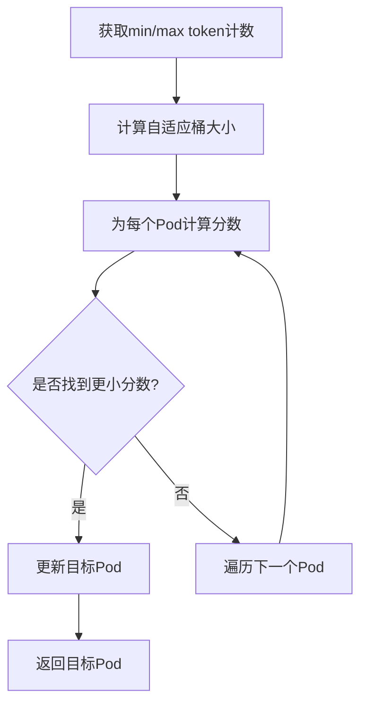
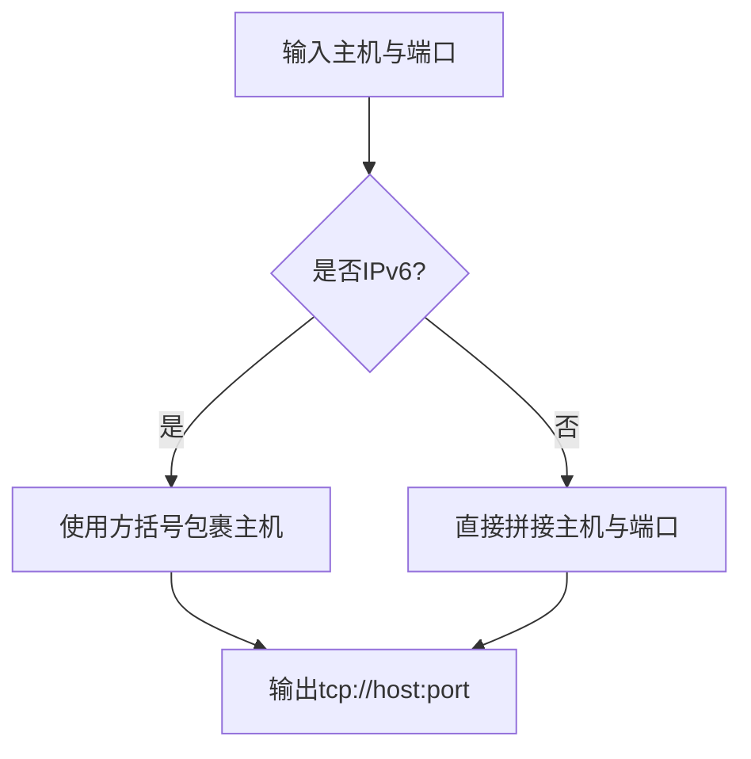
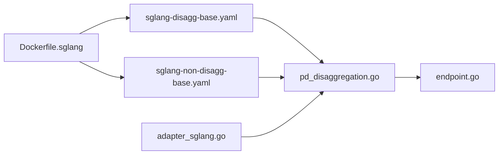

# SGLang分布式

<cite>
**本文引用的文件**
- [Dockerfile.sglang](file://build/container/Dockerfile.sglang)
- [sglang-pd-config.yaml](file://development/app/config/mock/sglang-pd-config.yaml)
- [adapter_sglang.go](file://pkg/utils/tokenizer/adapter_sglang.go)
- [sglang-disagg-base.yaml](file://test/regression/v0.4.0/configs/sglang-disagg-base.yaml)
- [sglang-non-disagg-base.yaml](file://test/regression/v0.4.0/configs/sglang-non-disagg-base.yaml)
- [sglang-llama-8b.yaml](file://test/regression/v0.4.0/multi-engine/sglang-llama-8b.yaml)
- [endpoint.go](file://pkg/cache/kvcache/endpoint.go)
- [pd_readme.md](file://pkg/plugins/gateway/algorithms/pd_readme.md)
- [pd_disaggregation.go](file://pkg/plugins/gateway/algorithms/pd_disaggregation.go)
- [vtc_basic.go](file://pkg/plugins/gateway/algorithms/vtc/vtc_basic.go)
- [sglang-xpyd-rdma.yaml](file://test/regression/v0.5.0/sglang-xpyd-rdma.yaml)
</cite>

## 目录
1. [简介](#简介)
2. [项目结构](#项目结构)
3. [核心组件](#核心组件)
4. [架构总览](#架构总览)
5. [详细组件分析](#详细组件分析)
6. [依赖关系分析](#依赖关系分析)
7. [性能考量](#性能考量)
8. [故障排查指南](#故障排查指南)
9. [结论](#结论)
10. [附录](#附录)

## 简介
本文件面向AIBrix中的SGLang分布式推理引擎，系统性阐述其分布式架构设计、并行计算模型、任务分发机制、资源协调策略，并重点覆盖以下主题：
- 池化部署模式：工作池管理、负载均衡、故障恢复
- 副本管理机制：多副本部署、状态同步、一致性保证
- 配置示例：1P1D拓扑、桶化调度、性能优化参数
- 最佳实践、监控指标、故障排除与性能调优

SGLang在AIBrix中既支持非解耦（单Pod内预填/解码）也支持解耦（Prefill/Decode角色分离），并通过网关路由算法实现跨Pod的任务编排与KV缓存传输。

## 项目结构
围绕SGLang分布式推理的相关模块主要分布在如下位置：
- 容器镜像构建：build/container/Dockerfile.sglang
- 示例与模板：development/app/config/mock/sglang-pd-config.yaml、test/regression/v0.4.0/configs/sglang-disagg-base.yaml、sglang-non-disagg-base.yaml、sglang-llama-8b.yaml
- 网关路由与调度：pkg/plugins/gateway/algorithms/pd_readme.md、pd_disaggregation.go、vtc_basic.go
- KV缓存端点格式化：pkg/cache/kvcache/endpoint.go
- SGLang适配层：pkg/utils/tokenizer/adapter_sglang.go
- RDMA/XPYD测试样例：test/regression/v0.5.0/sglang-xpyd-rdma.yaml



**图表来源**
- [Dockerfile.sglang:1-48](file://build/container/Dockerfile.sglang#L1-L48)
- [sglang-disagg-base.yaml:1-58](file://test/regression/v0.4.0/configs/sglang-disagg-base.yaml#L1-L58)
- [sglang-non-disagg-base.yaml:1-35](file://test/regression/v0.4.0/configs/sglang-non-disagg-base.yaml#L1-L35)
- [sglang-llama-8b.yaml:1-60](file://test/regression/v0.4.0/multi-engine/sglang-llama-8b.yaml#L1-L60)
- [sglang-xpyd-rdma.yaml](file://test/regression/v0.5.0/sglang-xpyd-rdma.yaml)
- [pd_readme.md:14-50](file://pkg/plugins/gateway/algorithms/pd_readme.md#L14-L50)
- [pd_disaggregation.go:379-413](file://pkg/plugins/gateway/algorithms/pd_disaggregation.go#L379-L413)
- [vtc_basic.go:109-135](file://pkg/plugins/gateway/algorithms/vtc/vtc_basic.go#L109-L135)
- [endpoint.go:23-49](file://pkg/cache/kvcache/endpoint.go#L23-L49)
- [adapter_sglang.go:19-88](file://pkg/utils/tokenizer/adapter_sglang.go#L19-L88)

**章节来源**
- [Dockerfile.sglang:1-48](file://build/container/Dockerfile.sglang#L1-L48)
- [sglang-disagg-base.yaml:1-58](file://test/regression/v0.4.0/configs/sglang-disagg-base.yaml#L1-L58)
- [sglang-non-disagg-base.yaml:1-35](file://test/regression/v0.4.0/configs/sglang-non-disagg-base.yaml#L1-L35)
- [sglang-llama-8b.yaml:1-60](file://test/regression/v0.4.0/multi-engine/sglang-llama-8b.yaml#L1-L60)
- [sglang-xpyd-rdma.yaml](file://test/regression/v0.5.0/sglang-xpyd-rdma.yaml)
- [pd_readme.md:14-50](file://pkg/plugins/gateway/algorithms/pd_readme.md#L14-L50)
- [pd_disaggregation.go:379-413](file://pkg/plugins/gateway/algorithms/pd_disaggregation.go#L379-L413)
- [vtc_basic.go:109-135](file://pkg/plugins/gateway/algorithms/vtc/vtc_basic.go#L109-L135)
- [endpoint.go:23-49](file://pkg/cache/kvcache/endpoint.go#L23-L49)
- [adapter_sglang.go:19-88](file://pkg/utils/tokenizer/adapter_sglang.go#L19-L88)

## 核心组件
- SGLang运行时与镜像：通过Dockerfile.sglang构建，集成aibrix_kvcache与NIXL等依赖，确保与AIBrix的KV缓存与网络栈兼容。
- 解耦与非解耦部署模板：提供Prefill/Decode角色分离与单Pod内解码的两种部署形态，便于按吞吐与延迟需求选择。
- 网关PD路由算法：基于角色集（roleset）进行分桶与评分，结合负载不平衡检测、请求计数、吞吐与GPU空闲率等指标，实现跨Pod的高效调度。
- KV缓存端点格式化：统一处理IPv4/IPv6地址的ZMQ端点格式，保障跨节点通信稳定。
- SGLang适配器：声明SGLang不提供tokenize/detokenize能力，避免上层误用。

**章节来源**
- [Dockerfile.sglang:1-48](file://build/container/Dockerfile.sglang#L1-L48)
- [sglang-disagg-base.yaml:1-58](file://test/regression/v0.4.0/configs/sglang-disagg-base.yaml#L1-L58)
- [sglang-non-disagg-base.yaml:1-35](file://test/regression/v0.4.0/configs/sglang-non-disagg-base.yaml#L1-L35)
- [pd_readme.md:14-50](file://pkg/plugins/gateway/algorithms/pd_readme.md#L14-L50)
- [pd_disaggregation.go:379-413](file://pkg/plugins/gateway/algorithms/pd_disaggregation.go#L379-L413)
- [endpoint.go:23-49](file://pkg/cache/kvcache/endpoint.go#L23-L49)
- [adapter_sglang.go:19-88](file://pkg/utils/tokenizer/adapter_sglang.go#L19-L88)

## 架构总览
下图展示SGLang在AIBrix中的典型分布式路径：客户端请求经由网关路由到Prefill/Decode角色集，Prefill完成KV缓存后通过异步引导或参数传递进入Decode阶段，最终返回流式结果。



**图表来源**
- [pd_readme.md:14-50](file://pkg/plugins/gateway/algorithms/pd_readme.md#L14-L50)
- [pd_disaggregation.go:379-413](file://pkg/plugins/gateway/algorithms/pd_disaggregation.go#L379-L413)

## 详细组件分析

### 组件A：网关PD路由与桶化调度
- 角色集分桶：按roleset对候选Pod进行分组，再按提示长度桶过滤，减少跨节点KV传输与上下文不匹配。
- 负载不平衡快速通道：当最大与最小请求差超过阈值时，优先选择最空闲的Prefill/Decode Pod，降低尾延迟。
- Decode评分策略：综合运行请求数、吞吐、GPU空闲率，支持可插拔评分策略（默认负载均衡，也可选择最少请求）。
- 最终评分：对每个roleset计算归一化得分之和，选取最小者作为目标组合。



**图表来源**
- [pd_readme.md:69-144](file://pkg/plugins/gateway/algorithms/pd_readme.md#L69-L144)
- [pd_disaggregation.go:379-413](file://pkg/plugins/gateway/algorithms/pd_disaggregation.go#L379-L413)
- [pd_disaggregation.go:433-627](file://pkg/plugins/gateway/algorithms/pd_disaggregation.go#L433-L627)

**章节来源**
- [pd_readme.md:14-50](file://pkg/plugins/gateway/algorithms/pd_readme.md#L14-L50)
- [pd_disaggregation.go:379-413](file://pkg/plugins/gateway/algorithms/pd_disaggregation.go#L379-L413)
- [pd_disaggregation.go:433-627](file://pkg/plugins/gateway/algorithms/pd_disaggregation.go#L433-L627)

### 组件B：桶化调度（VTB）基础实现
- 自适应桶大小：根据当前最小/最大token范围动态调整映射步长，保持路由单调性与公平性。
- 利用Pod利用率作为次级指标，提升整体资源利用。
- 通过自适应桶尺寸与归一化，使路由在负载波动下仍稳健。



**图表来源**
- [vtc_basic.go:109-135](file://pkg/plugins/gateway/algorithms/vtc/vtc_basic.go#L109-L135)

**章节来源**
- [vtc_basic.go:109-135](file://pkg/plugins/gateway/algorithms/vtc/vtc_basic.go#L109-L135)

### 组件C：KV缓存端点格式化与网络
- ZMQ端点格式化：正确处理IPv4/IPv6地址，确保跨节点绑定与连接稳定。
- 在SGLang解耦场景中，Prefill完成后的KV参数或引导信息需通过端点可靠传递至Decode Pod。



**图表来源**
- [endpoint.go:23-49](file://pkg/cache/kvcache/endpoint.go#L23-L49)

**章节来源**
- [endpoint.go:23-49](file://pkg/cache/kvcache/endpoint.go#L23-L49)

### 组件D：SGLang适配器与令牌化限制
- SGLang不提供tokenize/detokenize接口，适配器明确声明不支持，并在上层调用时返回错误，避免误用。

```mermaid
classDiagram
class SGLangAdapter {
-model string
+GetTokenizePath() string
+GetDetokenizePath() string
+SupportsTokenization() bool
+SupportsDetokenization() bool
+PrepareTokenizeRequest(input) (interface{}, error)
+PrepareDetokenizeRequest(tokens) (interface{}, error)
+ParseTokenizeResponse(data) (*TokenizeResult, error)
+ParseDetokenizeResponse(data) (string, error)
}
```

**图表来源**
- [adapter_sglang.go:19-88](file://pkg/utils/tokenizer/adapter_sglang.go#L19-L88)

**章节来源**
- [adapter_sglang.go:19-88](file://pkg/utils/tokenizer/adapter_sglang.go#L19-L88)

### 组件E：SGLang镜像构建与运行时依赖
- 基于官方SGLang镜像，提取torch版本以确保兼容性；安装aibrix_kvcache与NIXL等依赖，支撑RDMA/XPYD与KV缓存桥接。
- 工作目录与工具链准备，便于调试与观测。

**章节来源**
- [Dockerfile.sglang:1-48](file://build/container/Dockerfile.sglang#L1-L48)

## 依赖关系分析
- 部署模板依赖网关路由策略：解耦/非解耦模板通过roles与annotations定义，驱动网关PD算法进行角色集分桶与评分。
- 运行时镜像依赖KV缓存与网络库：SGLang运行时与aibrix_kvcache/NIXL协同，确保Prefill-Decode之间的KV传输与一致性。
- 调度算法依赖指标采集：路由评分依赖实时请求量、吞吐与GPU空闲率等指标，这些指标由引擎侧暴露并被缓存层采集。



**图表来源**
- [sglang-disagg-base.yaml:1-58](file://test/regression/v0.4.0/configs/sglang-disagg-base.yaml#L1-L58)
- [sglang-non-disagg-base.yaml:1-35](file://test/regression/v0.4.0/configs/sglang-non-disagg-base.yaml#L1-L35)
- [Dockerfile.sglang:1-48](file://build/container/Dockerfile.sglang#L1-L48)
- [pd_disaggregation.go:379-413](file://pkg/plugins/gateway/algorithms/pd_disaggregation.go#L379-L413)
- [endpoint.go:23-49](file://pkg/cache/kvcache/endpoint.go#L23-L49)
- [adapter_sglang.go:19-88](file://pkg/utils/tokenizer/adapter_sglang.go#L19-L88)

**章节来源**
- [sglang-disagg-base.yaml:1-58](file://test/regression/v0.4.0/configs/sglang-disagg-base.yaml#L1-L58)
- [sglang-non-disagg-base.yaml:1-35](file://test/regression/v0.4.0/configs/sglang-non-disagg-base.yaml#L1-L35)
- [Dockerfile.sglang:1-48](file://build/container/Dockerfile.sglang#L1-L48)
- [pd_disaggregation.go:379-413](file://pkg/plugins/gateway/algorithms/pd_disaggregation.go#L379-L413)
- [endpoint.go:23-49](file://pkg/cache/kvcache/endpoint.go#L23-L49)
- [adapter_sglang.go:19-88](file://pkg/utils/tokenizer/adapter_sglang.go#L19-L88)

## 性能考量
- 提示长度桶化：减少跨节点KV传输与上下文不匹配，提升吞吐与稳定性。
- 负载不平衡快速通道：在高负载下优先选择最空闲Pod，降低尾延迟。
- Decode评分权重：通过运行请求、吞吐与GPU空闲率的归一化组合，平衡资源利用与延迟。
- 网络与RDMA：启用RDMA/XPYD可显著降低跨节点通信开销，建议在具备RDMA能力的集群中开启。
- 共享内存与GPU数量：合理配置共享内存与GPU数量，避免显存瓶颈与锁竞争。

[本节为通用指导，无需具体文件来源]

## 故障排查指南
- Prefill-Decode未正确关联
  - 检查roleset标签与annotations是否一致，确认Bootstrap端口与注解配置正确。
  - 参考：[sglang-pd-config.yaml:46-59](file://development/app/config/mock/sglang-pd-config.yaml#L46-L59)
- 调度异常或热点
  - 查看Decode评分策略与权重，必要时切换为最少请求策略验证。
  - 参考：[pd_disaggregation.go:591-627](file://pkg/plugins/gateway/algorithms/pd_disaggregation.go#L591-L627)
- 端点解析失败
  - 确认IPv4/IPv6地址格式，使用ZMQ端点格式化工具。
  - 参考：[endpoint.go:23-49](file://pkg/cache/kvcache/endpoint.go#L23-L49)
- 令牌化报错
  - SGLang不支持tokenize/detokenize，避免调用相关接口。
  - 参考：[adapter_sglang.go:32-50](file://pkg/utils/tokenizer/adapter_sglang.go#L32-L50)

**章节来源**
- [sglang-pd-config.yaml:46-59](file://development/app/config/mock/sglang-pd-config.yaml#L46-L59)
- [pd_disaggregation.go:591-627](file://pkg/plugins/gateway/algorithms/pd_disaggregation.go#L591-L627)
- [endpoint.go:23-49](file://pkg/cache/kvcache/endpoint.go#L23-L49)
- [adapter_sglang.go:32-50](file://pkg/utils/tokenizer/adapter_sglang.go#L32-L50)

## 结论
SGLang在AIBrix中通过“角色集分桶+负载均衡评分”的网关路由策略，实现了高效的跨Pod任务编排；结合解耦部署与KV缓存桥接，兼顾吞吐与延迟。配合RDMA/XPYD与合理的资源规划，可在生产环境中获得稳定的分布式推理性能。

[本节为总结，无需具体文件来源]

## 附录

### A. 池化部署模式与工作池管理
- 工作池管理：通过roles与replicas定义Prefill/Decode工作池规模，结合滚动更新策略实现平滑扩缩容。
- 负载均衡：默认采用负载均衡策略，亦可切换最少请求策略以应对突发流量。
- 故障恢复：利用Kubernetes原生重启与健康检查，结合网关路由的快速通道策略，缩短故障恢复时间。

**章节来源**
- [sglang-disagg-base.yaml:21-26](file://test/regression/v0.4.0/configs/sglang-disagg-base.yaml#L21-L26)
- [sglang-non-disagg-base.yaml:13-16](file://test/regression/v0.4.0/configs/sglang-non-disagg-base.yaml#L13-L16)
- [pd_disaggregation.go:379-413](file://pkg/plugins/gateway/algorithms/pd_disaggregation.go#L379-L413)

### B. 副本管理机制与一致性
- 多副本部署：通过Deployment/StormService控制器管理多副本，确保高可用。
- 状态同步：Prefill完成后的KV参数或引导信息通过端点可靠传递，Decode阶段保持上下文一致性。
- 一致性保证：结合Bootstrap握手与参数注入，避免跨节点状态不一致。

**章节来源**
- [sglang-llama-8b.yaml:1-60](file://test/regression/v0.4.0/multi-engine/sglang-llama-8b.yaml#L1-L60)
- [pd_readme.md:44-46](file://pkg/plugins/gateway/algorithms/pd_readme.md#L44-L46)
- [endpoint.go:23-49](file://pkg/cache/kvcache/endpoint.go#L23-L49)

### C. 配置示例与参数说明
- 1P1D拓扑（单预填单解码）
  - 参考：[sglang-non-disagg-base.yaml:13-16](file://test/regression/v0.4.0/configs/sglang-non-disagg-base.yaml#L13-L16)
- 解耦部署（Prefill/Decode角色分离）
  - 参考：[sglang-disagg-base.yaml:21-26](file://test/regression/v0.4.0/configs/sglang-disagg-base.yaml#L21-L26)
- 桶化调度策略
  - 参考：[vtc_basic.go:109-135](file://pkg/plugins/gateway/algorithms/vtc/vtc_basic.go#L109-L135)
- 性能优化参数（RDMA/XPYD、共享内存、GPU数量）
  - 参考：[sglang-disagg-base.yaml:27-38](file://test/regression/v0.4.0/configs/sglang-disagg-base.yaml#L27-L38)
  - 参考：[sglang-xpyd-rdma.yaml](file://test/regression/v0.5.0/sglang-xpyd-rdma.yaml)

**章节来源**
- [sglang-non-disagg-base.yaml:13-16](file://test/regression/v0.4.0/configs/sglang-non-disagg-base.yaml#L13-L16)
- [sglang-disagg-base.yaml:21-38](file://test/regression/v0.4.0/configs/sglang-disagg-base.yaml#L21-L38)
- [vtc_basic.go:109-135](file://pkg/plugins/gateway/algorithms/vtc/vtc_basic.go#L109-L135)
- [sglang-xpyd-rdma.yaml](file://test/regression/v0.5.0/sglang-xpyd-rdma.yaml)

### D. 最佳实践
- 合理设置roleset与replicas，避免跨节点KV传输过载。
- 在具备RDMA能力的集群启用RDMA/XPYD，降低网络延迟。
- 使用负载均衡策略作为默认，突发场景可临时切换最少请求策略。
- 监控Decode评分与Pod利用率，及时发现热点与资源瓶颈。

**章节来源**
- [pd_disaggregation.go:591-627](file://pkg/plugins/gateway/algorithms/pd_disaggregation.go#L591-L627)
- [sglang-disagg-base.yaml:27-38](file://test/regression/v0.4.0/configs/sglang-disagg-base.yaml#L27-L38)