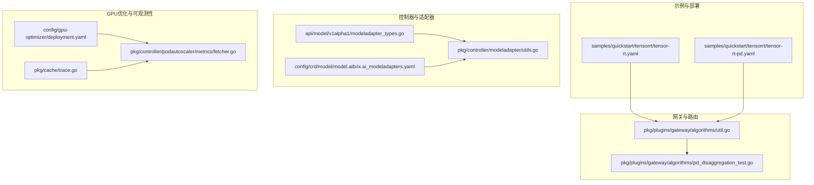
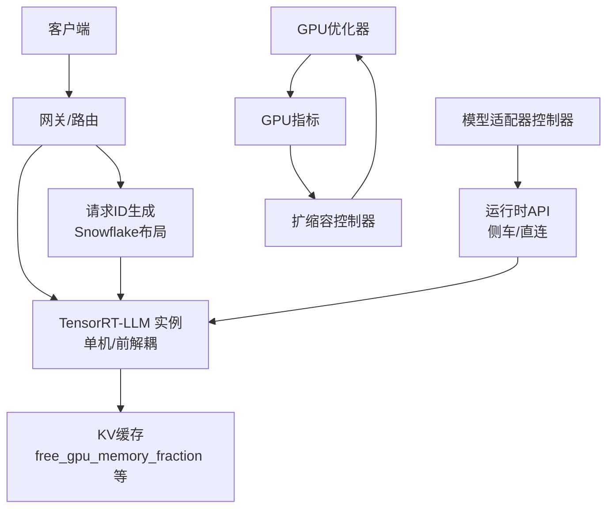
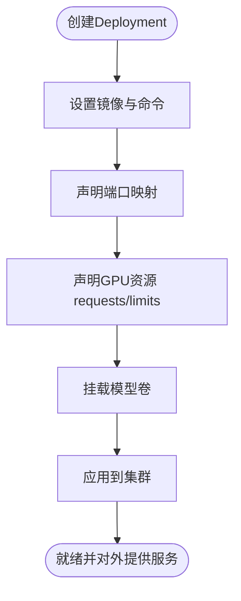
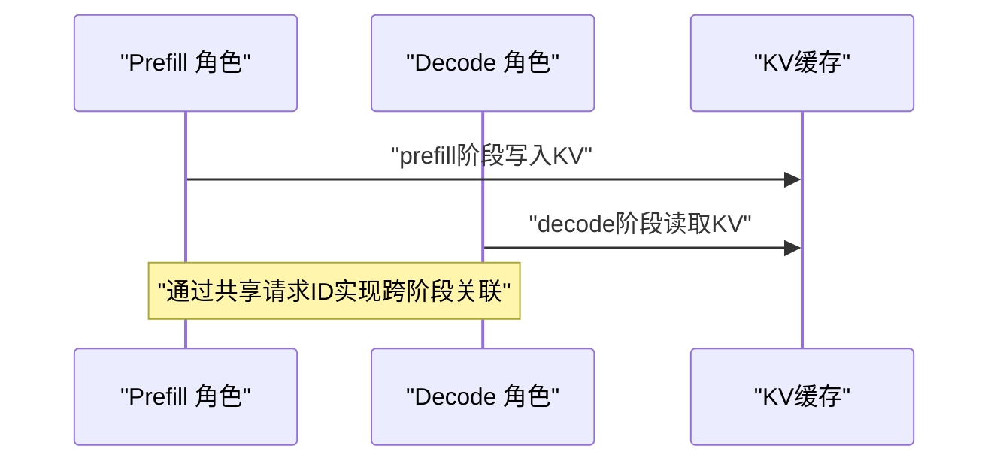
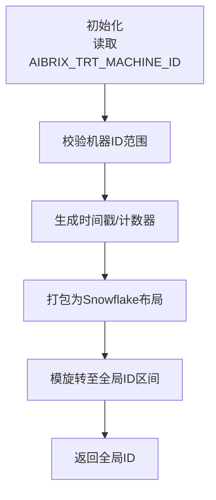
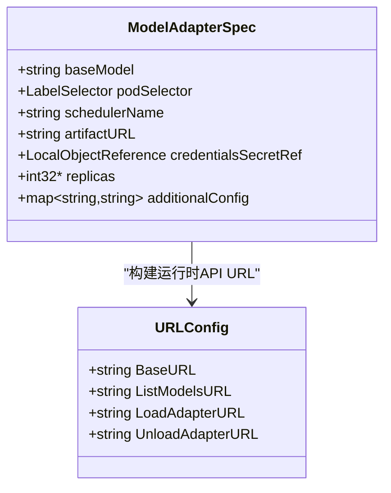
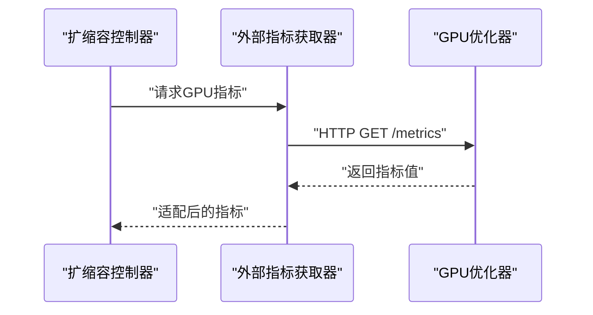
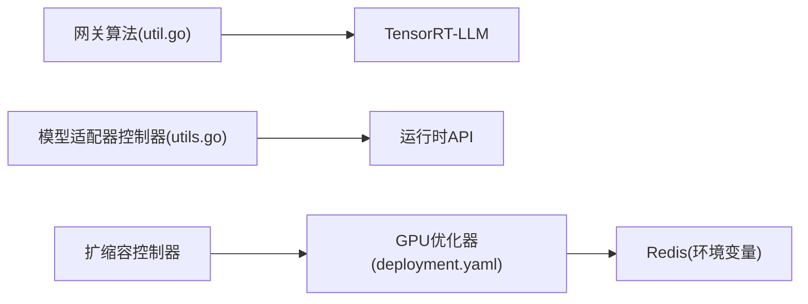

# TensorRT硬件加速

<cite>
**本文引用的文件**
- [samples/quickstart/tensorrt/tensor-rt.yaml](file://samples/quickstart/tensorrt/tensor-rt.yaml)
- [samples/quickstart/tensorrt/tensor-rt-pd.yaml](file://samples/quickstart/tensorrt/tensor-rt-pd.yaml)
- [pkg/plugins/gateway/algorithms/util.go](file://pkg/plugins/gateway/algorithms/util.go)
- [pkg/plugins/gateway/algorithms/pd_disaggregation_test.go](file://pkg/plugins/gateway/algorithms/pd_disaggregation_test.go)
- [pkg/controller/modeladapter/utils.go](file://pkg/controller/modeladapter/utils.go)
- [config/gpu-optimizer/deployment.yaml](file://config/gpu-optimizer/deployment.yaml)
- [pkg/cache/trace.go](file://pkg/cache/trace.go)
- [pkg/controller/podautoscaler/metrics/fetcher.go](file://pkg/controller/podautoscaler/metrics/fetcher.go)
- [api/model/v1alpha1/modeladapter_types.go](file://api/model/v1alpha1/modeladapter_types.go)
- [config/crd/model/model.aibrix.ai_modeladapters.yaml](file://config/crd/model/model.aibrix.ai_modeladapters.yaml)
</cite>

## 目录
1. [简介](#简介)
2. [项目结构](#项目结构)
3. [核心组件](#核心组件)
4. [架构总览](#架构总览)
5. [组件详解](#组件详解)
6. [依赖关系分析](#依赖关系分析)
7. [性能考量](#性能考量)
8. [故障排查指南](#故障排查指南)
9. [结论](#结论)
10. [附录](#附录)

## 简介
本技术文档聚焦于AIBrix中TensorRT硬件加速推理引擎的集成与使用，涵盖以下关键主题：
- 模型转换与部署：基于TensorRT-LLM的单机与前解耦（prefill/decode）部署示例。
- 硬件加速优化：通过GPU资源请求/限制、KV缓存内存占比、重叠调度等参数进行优化。
- 性能提升策略：流水线并行、事件缓冲、迭代性能统计等。
- 适配器配置：模型适配器CRD与控制器如何驱动模型加载与运行时API交互。
- Kubernetes集成：GPU资源管理、容器化部署、资源调度与可观测性。
- 部署示例：基础模型部署、优化配置、性能基准测试建议。
- 兼容性与硬件要求：环境变量、资源声明与镜像版本。
- 故障诊断与性能调优：日志级别、指标采集与追踪开关。

## 项目结构
与TensorRT相关的实现与示例主要分布在以下位置：
- 示例部署：samples/quickstart/tensorrt 提供单机与前解耦部署模板。
- 网关算法：pkg/plugins/gateway/algorithms 包含TensorRT-LLM相关的请求ID生成与路由逻辑。
- 控制器与适配器：api/model/v1alpha1 定义CRD；pkg/controller/modeladapter/utils.go 提供运行时API构建。
- GPU优化器：config/gpu-optimizer/deployment.yaml 提供GPU指标采集服务。
- 可观测性：pkg/cache/trace.go 提供GPU优化器追踪开关；fetcher.go 提供外部指标拉取。

**图表来源**
- [samples/quickstart/tensorrt/tensor-rt.yaml:1-73](file://samples/quickstart/tensorrt/tensor-rt.yaml#L1-L73)
- [samples/quickstart/tensorrt/tensor-rt-pd.yaml:1-170](file://samples/quickstart/tensorrt/tensor-rt-pd.yaml#L1-L170)
- [pkg/plugins/gateway/algorithms/util.go:26-105](file://pkg/plugins/gateway/algorithms/util.go#L26-L105)
- [pkg/plugins/gateway/algorithms/pd_disaggregation_test.go:784-1620](file://pkg/plugins/gateway/algorithms/pd_disaggregation_test.go#L784-L1620)
- [api/model/v1alpha1/modeladapter_types.go:26-161](file://api/model/v1alpha1/modeladapter_types.go#L26-L161)
- [config/crd/model/model.aibrix.ai_modeladapters.yaml:37-160](file://config/crd/model/model.aibrix.ai_modeladapters.yaml#L37-L160)
- [pkg/controller/modeladapter/utils.go:115-158](file://pkg/controller/modeladapter/utils.go#L115-L158)
- [config/gpu-optimizer/deployment.yaml:1-33](file://config/gpu-optimizer/deployment.yaml#L1-L33)
- [pkg/cache/trace.go:1-52](file://pkg/cache/trace.go#L1-L52)
- [pkg/controller/podautoscaler/metrics/fetcher.go:252-274](file://pkg/controller/podautoscaler/metrics/fetcher.go#L252-L274)

**章节来源**
- [samples/quickstart/tensorrt/tensor-rt.yaml:1-73](file://samples/quickstart/tensorrt/tensor-rt.yaml#L1-L73)
- [samples/quickstart/tensorrt/tensor-rt-pd.yaml:1-170](file://samples/quickstart/tensorrt/tensor-rt-pd.yaml#L1-L170)
- [pkg/plugins/gateway/algorithms/util.go:26-105](file://pkg/plugins/gateway/algorithms/util.go#L26-L105)
- [pkg/plugins/gateway/algorithms/pd_disaggregation_test.go:784-1620](file://pkg/plugins/gateway/algorithms/pd_disaggregation_test.go#L784-L1620)
- [api/model/v1alpha1/modeladapter_types.go:26-161](file://api/model/v1alpha1/modeladapter_types.go#L26-L161)
- [config/crd/model/model.aibrix.ai_modeladapters.yaml:37-160](file://config/crd/model/model.aibrix.ai_modeladapters.yaml#L37-L160)
- [pkg/controller/modeladapter/utils.go:115-158](file://pkg/controller/modeladapter/utils.go#L115-L158)
- [config/gpu-optimizer/deployment.yaml:1-33](file://config/gpu-optimizer/deployment.yaml#L1-L33)
- [pkg/cache/trace.go:1-52](file://pkg/cache/trace.go#L1-L52)
- [pkg/controller/podautoscaler/metrics/fetcher.go:252-274](file://pkg/controller/podautoscaler/metrics/fetcher.go#L252-L274)

## 核心组件
- TensorRT-LLM单机部署：通过Deployment定义容器镜像、命令、端口与GPU资源请求/限制，并挂载模型目录。
- 前解耦（1P1D）部署：通过StormService定义prefill与decode两个角色，分别配置上下文与生成阶段的KV缓存参数、事件缓冲与性能统计。
- 请求ID与全局关联：网关算法为TensorRT-LLM生成Snowflake风格的全局ID，确保prefill与decode阶段的KV缓存一致性。
- 模型适配器与运行时API：CRD定义模型适配器规范；控制器根据engine类型选择对应API路径，支持侧车或直连引擎模式。
- GPU优化器与指标采集：独立部署GPU优化器服务，控制器从其拉取GPU相关指标用于扩缩容决策。

**章节来源**
- [samples/quickstart/tensorrt/tensor-rt.yaml:22-52](file://samples/quickstart/tensorrt/tensor-rt.yaml#L22-L52)
- [samples/quickstart/tensorrt/tensor-rt-pd.yaml:29-88](file://samples/quickstart/tensorrt/tensor-rt-pd.yaml#L29-L88)
- [pkg/plugins/gateway/algorithms/util.go:33-93](file://pkg/plugins/gateway/algorithms/util.go#L33-L93)
- [api/model/v1alpha1/modeladapter_types.go:26-61](file://api/model/v1alpha1/modeladapter_types.go#L26-L61)
- [pkg/controller/modeladapter/utils.go:115-158](file://pkg/controller/modeladapter/utils.go#L115-L158)
- [config/gpu-optimizer/deployment.yaml:18-33](file://config/gpu-optimizer/deployment.yaml#L18-L33)

## 架构总览
下图展示了TensorRT在AIBrix中的端到端集成：客户端请求经由网关路由至TensorRT-LLM实例；prefill与decode阶段通过共享的请求ID实现KV缓存跨阶段关联；控制器负责模型适配器生命周期与运行时API交互；GPU优化器提供GPU指标以支撑扩缩容与性能观测。

**图表来源**
- [pkg/plugins/gateway/algorithms/util.go:33-93](file://pkg/plugins/gateway/algorithms/util.go#L33-L93)
- [samples/quickstart/tensorrt/tensor-rt.yaml:22-52](file://samples/quickstart/tensorrt/tensor-rt.yaml#L22-L52)
- [samples/quickstart/tensorrt/tensor-rt-pd.yaml:29-88](file://samples/quickstart/tensorrt/tensor-rt-pd.yaml#L29-L88)
- [pkg/controller/modeladapter/utils.go:115-158](file://pkg/controller/modeladapter/utils.go#L115-L158)
- [config/gpu-optimizer/deployment.yaml:18-33](file://config/gpu-optimizer/deployment.yaml#L18-L33)
- [pkg/controller/podautoscaler/metrics/fetcher.go:252-274](file://pkg/controller/podautoscaler/metrics/fetcher.go#L252-L274)

## 组件详解

### TensorRT-LLM 单机部署
- 关键点
  - 容器镜像与启动命令：通过trtllm-serve启动服务，指定主机、端口与额外LLM选项配置文件。
  - 资源声明：显式声明nvidia.com/gpu的requests与limits。
  - 存储挂载：将宿主机模型目录挂载到容器内，供推理引擎加载。
  - 配置项：包括后端、KV缓存内存占比、最大批大小、性能统计等。

**图表来源**
- [samples/quickstart/tensorrt/tensor-rt.yaml:22-52](file://samples/quickstart/tensorrt/tensor-rt.yaml#L22-L52)

**章节来源**
- [samples/quickstart/tensorrt/tensor-rt.yaml:22-52](file://samples/quickstart/tensorrt/tensor-rt.yaml#L22-L52)

### TensorRT-LLM 前解耦（1P1D）部署
- 关键点
  - 角色划分：prefill与decode两个角色，分别运行上下文与生成阶段。
  - 环境变量：POD_IP、MODEL、MAX_SEQ_LEN、GPU_MEM_FRACTION等。
  - 配置文件：上下文与生成阶段分别写入不同配置文件，控制KV缓存、事件缓冲与性能统计。
  - 资源与安全：每个角色声明GPU资源与IPC_LOCK能力，确保内存锁定与稳定性。
  - 日志级别：通过--log_level debug便于问题定位。

**图表来源**
- [samples/quickstart/tensorrt/tensor-rt-pd.yaml:29-88](file://samples/quickstart/tensorrt/tensor-rt-pd.yaml#L29-L88)
- [samples/quickstart/tensorrt/tensor-rt-pd.yaml:105-165](file://samples/quickstart/tensorrt/tensor-rt-pd.yaml#L105-L165)

**章节来源**
- [samples/quickstart/tensorrt/tensor-rt-pd.yaml:29-88](file://samples/quickstart/tensorrt/tensor-rt-pd.yaml#L29-L88)
- [samples/quickstart/tensorrt/tensor-rt-pd.yaml:105-165](file://samples/quickstart/tensorrt/tensor-rt-pd.yaml#L105-L165)

### 请求ID生成与全局关联（TensorRT-LLM）
- 关键点
  - Snowflake布局：时间戳、机器ID、计数器三段位宽固定，保证全局唯一且可区分本地/全局ID。
  - 机器ID校验：通过环境变量AIBRIX_TRT_MACHINE_ID注入，范围需满足10位宽度。
  - 全局ID阈值：结果强制>= 1<<42，使TRT-LLM识别为全局ID，从而正确关联跨worker的KV缓存。
  - 测试覆盖：对边界值与异常场景进行验证，确保ID生成正确性。

**图表来源**
- [pkg/plugins/gateway/algorithms/util.go:33-93](file://pkg/plugins/gateway/algorithms/util.go#L33-L93)
- [pkg/plugins/gateway/algorithms/pd_disaggregation_test.go:2631-2655](file://pkg/plugins/gateway/algorithms/pd_disaggregation_test.go#L2631-L2655)

**章节来源**
- [pkg/plugins/gateway/algorithms/util.go:33-93](file://pkg/plugins/gateway/algorithms/util.go#L33-L93)
- [pkg/plugins/gateway/algorithms/pd_disaggregation_test.go:2631-2655](file://pkg/plugins/gateway/algorithms/pd_disaggregation_test.go#L2631-L2655)

### 模型适配器与运行时API
- 关键点
  - CRD定义：包含基座模型、Pod选择器、副本数、附加配置等字段。
  - URL构建：根据是否使用侧车与引擎类型选择不同的API路径（模型列表、LoRA加载/卸载）。
  - 引擎类型：支持VLLM、SGLang等，默认回退到VLLM路径。
  - 调试模式：Debug模式下使用本地回环地址与调试端口。

**图表来源**
- [api/model/v1alpha1/modeladapter_types.go:26-61](file://api/model/v1alpha1/modeladapter_types.go#L26-L61)
- [pkg/controller/modeladapter/utils.go:115-158](file://pkg/controller/modeladapter/utils.go#L115-L158)

**章节来源**
- [api/model/v1alpha1/modeladapter_types.go:26-61](file://api/model/v1alpha1/modeladapter_types.go#L26-L61)
- [pkg/controller/modeladapter/utils.go:115-158](file://pkg/controller/modeladapter/utils.go#L115-L158)

### GPU优化器与指标采集
- 关键点
  - 独立部署：GPU优化器作为Deployment运行，暴露HTTP端口。
  - 指标拉取：扩缩容控制器通过统一的外部指标获取器从GPU优化器拉取指标。
  - 追踪开关：通过环境变量启用GPU优化器追踪，便于问题定位。
  - 指标适配：当前采用全局值作为每Pod值，后续可扩展为按Pod权重或平均分配。

**图表来源**
- [config/gpu-optimizer/deployment.yaml:18-33](file://config/gpu-optimizer/deployment.yaml#L18-L33)
- [pkg/controller/podautoscaler/metrics/fetcher.go:252-274](file://pkg/controller/podautoscaler/metrics/fetcher.go#L252-L274)
- [pkg/cache/trace.go:41-52](file://pkg/cache/trace.go#L41-L52)

**章节来源**
- [config/gpu-optimizer/deployment.yaml:18-33](file://config/gpu-optimizer/deployment.yaml#L18-L33)
- [pkg/controller/podautoscaler/metrics/fetcher.go:252-274](file://pkg/controller/podautoscaler/metrics/fetcher.go#L252-L274)
- [pkg/cache/trace.go:41-52](file://pkg/cache/trace.go#L41-L52)

## 依赖关系分析
- 组件耦合
  - 网关算法与TensorRT-LLM：通过请求ID生成保障prefill/decode阶段的KV缓存一致性。
  - 控制器与运行时API：根据engine类型动态选择API路径，降低耦合度。
  - 扩缩容控制器与GPU优化器：通过HTTP接口解耦，便于替换底层指标来源。
- 外部依赖
  - NVIDIA设备插件：通过nvidia.com/gpu资源进行调度。
  - K8s Service：为TensorRT-LLM提供稳定访问入口。
  - Redis：GPU优化器依赖的存储组件（通过环境变量配置）。

**图表来源**
- [pkg/plugins/gateway/algorithms/util.go:33-93](file://pkg/plugins/gateway/algorithms/util.go#L33-L93)
- [pkg/controller/modeladapter/utils.go:115-158](file://pkg/controller/modeladapter/utils.go#L115-L158)
- [config/gpu-optimizer/deployment.yaml:31-33](file://config/gpu-optimizer/deployment.yaml#L31-L33)

**章节来源**
- [pkg/plugins/gateway/algorithms/util.go:33-93](file://pkg/plugins/gateway/algorithms/util.go#L33-L93)
- [pkg/controller/modeladapter/utils.go:115-158](file://pkg/controller/modeladapter/utils.go#L115-L158)
- [config/gpu-optimizer/deployment.yaml:31-33](file://config/gpu-optimizer/deployment.yaml#L31-L33)

## 性能考量
- KV缓存内存占比
  - 通过free_gpu_memory_fraction控制GPU显存占用，避免OOM并提升吞吐。
  - 在前解耦部署中，prefill与decode阶段分别配置该参数，结合enable_block_reuse提升缓存复用效率。
- 事件缓冲与迭代统计
  - event_buffer_max_size限制事件缓冲区大小，平衡延迟与内存占用。
  - enable_iter_perf_stats与return_perf_metrics开启后，可输出迭代级性能指标，辅助基准测试与调优。
- 重叠调度与流水线
  - disable_overlap_scheduler可切换重叠调度策略，按工作负载特性权衡吞吐与延迟。
- 资源声明
  - 显式声明nvidia.com/gpu的requests与limits，确保调度器正确放置Pod并隔离GPU资源。

**章节来源**
- [samples/quickstart/tensorrt/tensor-rt.yaml:30-40](file://samples/quickstart/tensorrt/tensor-rt.yaml#L30-L40)
- [samples/quickstart/tensorrt/tensor-rt-pd.yaml:50-62](file://samples/quickstart/tensorrt/tensor-rt-pd.yaml#L50-L62)
- [samples/quickstart/tensorrt/tensor-rt-pd.yaml:125-138](file://samples/quickstart/tensorrt/tensor-rt-pd.yaml#L125-L138)

## 故障排查指南
- 请求ID异常
  - 检查AIBRIX_TRT_MACHINE_ID是否在有效范围内（10位二进制），避免ID布局错误导致的跨节点关联失败。
  - 参考单元测试用例，验证边界值与异常输入。
- GPU显存不足
  - 降低free_gpu_memory_fraction或调整max_batch_size，观察吞吐与延迟变化。
  - 结合GPU优化器指标确认实际显存使用率。
- 扩缩容不生效
  - 确认GPU优化器服务正常，且外部指标获取器可成功拉取指标。
  - 检查追踪开关是否开启，必要时启用更详细的日志。
- 日志与追踪
  - TensorRT-LLM可通过--log_level debug输出详细日志。
  - 启用AIBRIX_GPU_OPTIMIZER_TRACING_FLAG以开启GPU优化器追踪。

**章节来源**
- [pkg/plugins/gateway/algorithms/util.go:67-74](file://pkg/plugins/gateway/algorithms/util.go#L67-L74)
- [pkg/plugins/gateway/algorithms/pd_disaggregation_test.go:2631-2655](file://pkg/plugins/gateway/algorithms/pd_disaggregation_test.go#L2631-L2655)
- [config/gpu-optimizer/deployment.yaml:18-33](file://config/gpu-optimizer/deployment.yaml#L18-L33)
- [pkg/cache/trace.go:41-52](file://pkg/cache/trace.go#L41-L52)
- [samples/quickstart/tensorrt/tensor-rt-pd.yaml:76-76](file://samples/quickstart/tensorrt/tensor-rt-pd.yaml#L76-L76)

## 结论
AIBrix对TensorRT-LLM的集成围绕“请求ID全局关联、前解耦流水线、KV缓存内存优化、GPU指标可观测”展开。通过示例部署与控制器抽象，用户可在Kubernetes上高效地完成模型上线、扩缩容与性能优化。建议在生产环境中结合GPU优化器指标与性能统计，持续迭代资源配置与调度策略。

## 附录

### 部署示例与最佳实践
- 基础模型部署
  - 使用单机TensorRT-LLM部署模板，声明GPU资源并挂载模型目录。
  - 开启性能统计与迭代指标，形成基准数据。
- 优化模型配置
  - 调整free_gpu_memory_fraction与max_batch_size，评估吞吐/延迟权衡。
  - 在前解耦部署中分别配置prefill与decode阶段的KV缓存参数。
- 性能基准测试
  - 使用benchmarks子模块的客户端与工作负载生成器，结合TensorRT-LLM的性能指标输出进行对比分析。

**章节来源**
- [samples/quickstart/tensorrt/tensor-rt.yaml:22-52](file://samples/quickstart/tensorrt/tensor-rt.yaml#L22-L52)
- [samples/quickstart/tensorrt/tensor-rt-pd.yaml:29-88](file://samples/quickstart/tensorrt/tensor-rt-pd.yaml#L29-L88)

### 硬件要求与兼容性
- GPU资源
  - 通过nvidia.com/gpu进行资源声明，确保调度器正确绑定GPU。
- 镜像与版本
  - 示例使用特定版本的TensorRT-LLM镜像，请参考示例文件中的镜像标签。
- 环境变量
  - AIBRIX_TRT_MACHINE_ID：用于Snowflake请求ID生成的机器ID。
  - AIBRIX_GPU_OPTIMIZER_TRACING_FLAG：启用GPU优化器追踪。

**章节来源**
- [samples/quickstart/tensorrt/tensor-rt.yaml:48-52](file://samples/quickstart/tensorrt/tensor-rt.yaml#L48-L52)
- [samples/quickstart/tensorrt/tensor-rt-pd.yaml:77-81](file://samples/quickstart/tensorrt/tensor-rt-pd.yaml#L77-L81)
- [pkg/plugins/gateway/algorithms/util.go:55-55](file://pkg/plugins/gateway/algorithms/util.go#L55-L55)
- [pkg/cache/trace.go:41-52](file://pkg/cache/trace.go#L41-L52)