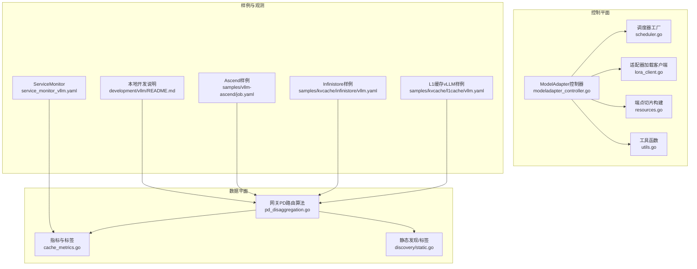
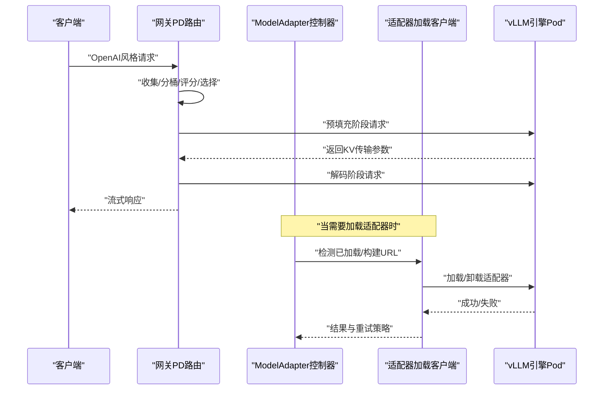
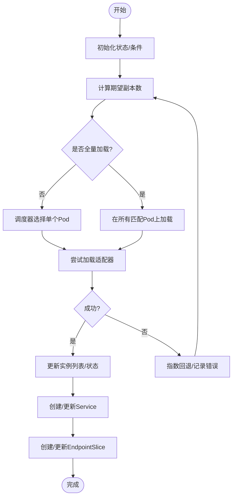
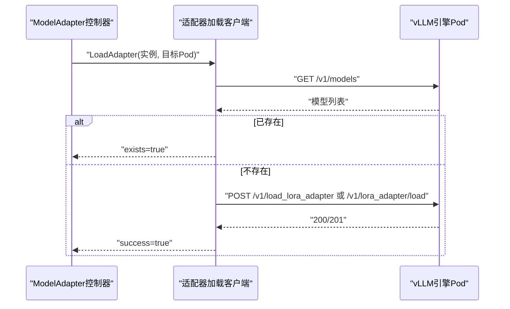
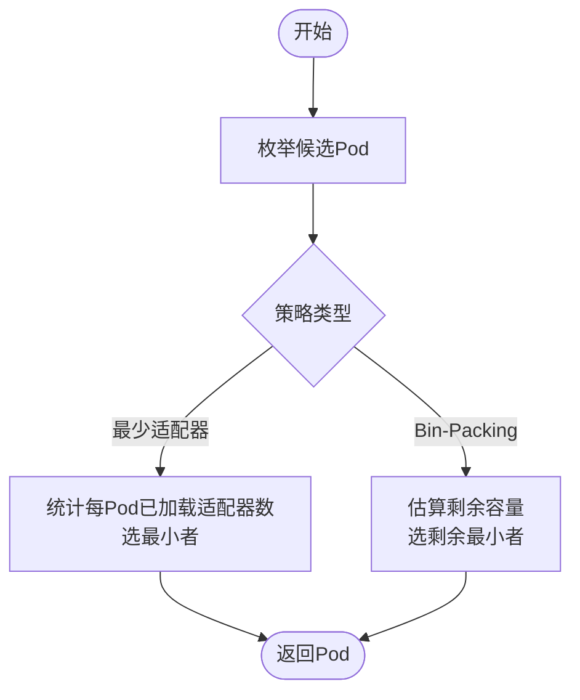
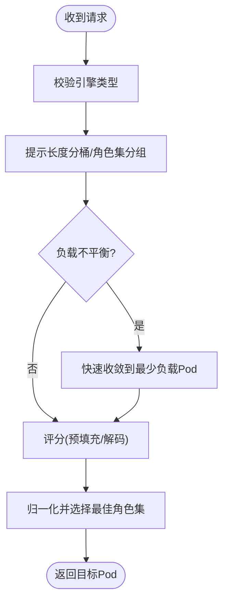
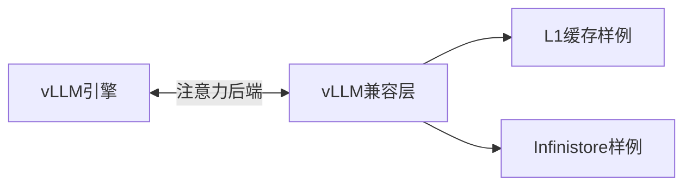
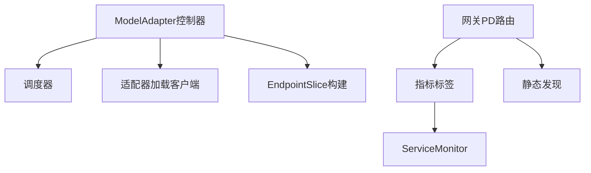

# vLLM集成

<cite>
**本文引用的文件**
- [pkg/controller/modeladapter/scheduling/scheduler.go](file://pkg/controller/modeladapter/scheduling/scheduler.go)
- [pkg/controller/modeladapter/scheduling/least_adapters.go](file://pkg/controller/modeladapter/scheduling/least_adapters.go)
- [pkg/controller/modeladapter/scheduling/bin_pack.go](file://pkg/controller/modeladapter/scheduling/bin_pack.go)
- [pkg/controller/modeladapter/modeladapter_controller.go](file://pkg/controller/modeladapter/modeladapter_controller.go)
- [pkg/controller/modeladapter/lora_client.go](file://pkg/controller/modeladapter/lora_client.go)
- [pkg/controller/modeladapter/resources.go](file://pkg/controller/modeladapter/resources.go)
- [pkg/controller/modeladapter/utils.go](file://pkg/controller/modeladapter/utils.go)
- [pkg/plugins/gateway/algorithms/pd_readme.md](file://pkg/plugins/gateway/algorithms/pd_readme.md)
- [pkg/plugins/gateway/algorithms/pd_disaggregation.go](file://pkg/plugins/gateway/algorithms/pd_disaggregation.go)
- [pkg/plugins/gateway/algorithms/pd_disaggregation_test.go](file://pkg/plugins/gateway/algorithms/pd_disaggregation_test.go)
- [pkg/cache/cache_metrics.go](file://pkg/cache/cache_metrics.go)
- [pkg/cache/discovery/static.go](file://pkg/cache/discovery/static.go)
- [python/aibrix_kvcache/aibrix_kvcache/integration/vllm/vllm_compat.py](file://python/aibrix_kvcache/aibrix_kvcache/integration/vllm/vllm_compat.py)
- [samples/kvcache/l1cache/vllm.yaml](file://samples/kvcache/l1cache/vllm.yaml)
- [samples/kvcache/infinistore/vllm.yaml](file://samples/kvcache/infinistore/vllm.yaml)
- [samples/vllm-ascend/job.yaml](file://samples/vllm-ascend/job.yaml)
- [development/vllm/README.md](file://development/vllm/README.md)
- [development/app/config/mock/vllm-pd-config.yaml](file://development/app/config/mock/vllm-pd-config.yaml)
- [observability/monitor/service_monitor_vllm.yaml](file://observability/monitor/service_monitor_vllm.yaml)
</cite>

## 目录
1. [简介](#简介)
2. [项目结构](#项目结构)
3. [核心组件](#核心组件)
4. [架构总览](#架构总览)
5. [详细组件分析](#详细组件分析)
6. [依赖分析](#依赖分析)
7. [性能考虑](#性能考虑)
8. [故障排除指南](#故障排除指南)
9. [结论](#结论)
10. [附录](#附录)

## 简介
本文件面向AIBrix中vLLM推理引擎的集成与落地，系统性阐述其架构设计、适配器调度策略、分布式推理与池化部署、资源配置与监控观测等关键能力。内容覆盖：
- 模型加载机制：基于ModelAdapter CRD的动态加载与卸载，支持运行时侧车模式与直连引擎两种路径。
- 推理优化策略：前填充-解码（Prefill-Decode）解耦、提示长度分桶、负载均衡评分与选择策略。
- 资源配置方案：StormService角色化编排、端点切片暴露、服务发现与指标采集。
- 适配器调度算法：最少适配器策略、Bin-Packing优化、随机与延迟/吞吐导向策略扩展点。
- 分布式推理：池化部署、副本管理、路由器配置与PD路由链路。
- 配置示例：单节点CPU/GPU、Ascend异构、KV缓存离线/在线后端、Prometheus监控。

## 项目结构
AIBrix通过控制器、网关路由算法、缓存与指标、以及样例配置共同支撑vLLM推理的全生命周期管理。下图展示与vLLM相关的关键模块与交互：

**图表来源**
- [pkg/controller/modeladapter/modeladapter_controller.go:127-191](file://pkg/controller/modeladapter/modeladapter_controller.go#L127-L191)
- [pkg/controller/modeladapter/scheduling/scheduler.go:34-50](file://pkg/controller/modeladapter/scheduling/scheduler.go#L34-L50)
- [pkg/controller/modeladapter/lora_client.go:82-108](file://pkg/controller/modeladapter/lora_client.go#L82-L108)
- [pkg/controller/modeladapter/resources.go:28-46](file://pkg/controller/modeladapter/resources.go#L28-L46)
- [pkg/plugins/gateway/algorithms/pd_disaggregation.go:591-627](file://pkg/plugins/gateway/algorithms/pd_disaggregation.go#L591-L627)
- [pkg/cache/cache_metrics.go:37-77](file://pkg/cache/cache_metrics.go#L37-L77)
- [pkg/cache/discovery/static.go:178-236](file://pkg/cache/discovery/static.go#L178-L236)
- [samples/kvcache/l1cache/vllm.yaml:1-145](file://samples/kvcache/l1cache/vllm.yaml#L1-L145)
- [samples/kvcache/infinistore/vllm.yaml:1-170](file://samples/kvcache/infinistore/vllm.yaml#L1-L170)
- [samples/vllm-ascend/job.yaml:1-85](file://samples/vllm-ascend/job.yaml#L1-L85)
- [development/vllm/README.md:1-97](file://development/vllm/README.md#L1-L97)
- [observability/monitor/service_monitor_vllm.yaml:1-19](file://observability/monitor/service_monitor_vllm.yaml#L1-L19)

**章节来源**
- [pkg/controller/modeladapter/modeladapter_controller.go:127-191](file://pkg/controller/modeladapter/modeladapter_controller.go#L127-L191)
- [pkg/controller/modeladapter/scheduling/scheduler.go:34-50](file://pkg/controller/modeladapter/scheduling/scheduler.go#L34-L50)
- [pkg/plugins/gateway/algorithms/pd_readme.md:14-144](file://pkg/plugins/gateway/algorithms/pd_readme.md#L14-L144)

## 核心组件
- ModelAdapter控制器：负责适配器生命周期管理（创建、加载、卸载、清理），维护状态机与条件，按策略选择目标Pod并协调Service/EndpointSlice。
- 适配器加载客户端：封装对vLLM引擎或运行时侧车的HTTP接口调用，支持直接引擎API与运行时代理路径，自动处理鉴权头与URL转换。
- 调度器：提供多种策略工厂方法，当前实现最少适配器与Bin-Packing两类；可扩展为最少延迟/吞吐等策略。
- 网关PD路由：实现前填充-解码解耦、提示长度分桶、负载不平衡快速收敛、评分与最终选择等策略。
- 缓存与指标：统一的引擎类型标签、指标刷新与Prometheus采集配置，支持vLLM引擎指标。
- 发现与端点：通过静态发现生成Pod模板，EndpointSlice暴露适配器实例地址列表。

**章节来源**
- [pkg/controller/modeladapter/modeladapter_controller.go:313-493](file://pkg/controller/modeladapter/modeladapter_controller.go#L313-L493)
- [pkg/controller/modeladapter/lora_client.go:82-108](file://pkg/controller/modeladapter/lora_client.go#L82-L108)
- [pkg/controller/modeladapter/scheduling/scheduler.go:34-50](file://pkg/controller/modeladapter/scheduling/scheduler.go#L34-L50)
- [pkg/plugins/gateway/algorithms/pd_disaggregation.go:591-627](file://pkg/plugins/gateway/algorithms/pd_disaggregation.go#L591-L627)
- [pkg/cache/cache_metrics.go:37-77](file://pkg/cache/cache_metrics.go#L37-L77)
- [pkg/cache/discovery/static.go:178-236](file://pkg/cache/discovery/static.go#L178-L236)

## 架构总览
下图展示从请求到推理执行的关键路径，涵盖适配器加载、网关路由、PD链路与引擎交互：

**图表来源**
- [pkg/plugins/gateway/algorithms/pd_readme.md:14-144](file://pkg/plugins/gateway/algorithms/pd_readme.md#L14-L144)
- [pkg/controller/modeladapter/lora_client.go:82-108](file://pkg/controller/modeladapter/lora_client.go#L82-L108)
- [pkg/controller/modeladapter/modeladapter_controller.go:728-893](file://pkg/controller/modeladapter/modeladapter_controller.go#L728-L893)

## 详细组件分析

### 组件A：ModelAdapter控制器与适配器加载流程
- 生命周期：初始化状态、资源创建、适配器加载、就绪状态更新、删除时卸载。
- 加载策略：支持“全部匹配Pod加载”与“单Pod加载”，后者使用调度器选择候选Pod。
- 重试与退避：指数回退、最大重试次数、可重试错误识别。
- 端点暴露：根据实例列表生成EndpointSlice，便于网关路由。

**图表来源**
- [pkg/controller/modeladapter/modeladapter_controller.go:417-493](file://pkg/controller/modeladapter/modeladapter_controller.go#L417-L493)
- [pkg/controller/modeladapter/modeladapter_controller.go:728-893](file://pkg/controller/modeladapter/modeladapter_controller.go#L728-L893)
- [pkg/controller/modeladapter/modeladapter_controller.go:1055-1098](file://pkg/controller/modeladapter/modeladapter_controller.go#L1055-L1098)

**章节来源**
- [pkg/controller/modeladapter/modeladapter_controller.go:417-493](file://pkg/controller/modeladapter/modeladapter_controller.go#L417-L493)
- [pkg/controller/modeladapter/modeladapter_controller.go:1055-1098](file://pkg/controller/modeladapter/modeladapter_controller.go#L1055-L1098)
- [pkg/controller/modeladapter/resources.go:28-46](file://pkg/controller/modeladapter/resources.go#L28-L46)

### 组件B：适配器加载客户端（vLLM）
- 双通道路径：
  - 运行时侧车：通过统一Runtime API进行模型列表查询与LoRA加载/卸载，支持凭据注入与额外配置透传。
  - 直连引擎：针对vLLM引擎的特定API，自动将huggingface://等协议转换为引擎可识别路径。
- 错误处理：非2xx即视为失败，区分可重试与不可重试错误，保留重试计数与时间戳注解。

**图表来源**
- [pkg/controller/modeladapter/lora_client.go:82-108](file://pkg/controller/modeladapter/lora_client.go#L82-L108)
- [pkg/controller/modeladapter/lora_client.go:208-315](file://pkg/controller/modeladapter/lora_client.go#L208-L315)

**章节来源**
- [pkg/controller/modeladapter/lora_client.go:82-108](file://pkg/controller/modeladapter/lora_client.go#L82-L108)
- [pkg/controller/modeladapter/lora_client.go:208-315](file://pkg/controller/modeladapter/lora_client.go#L208-L315)
- [pkg/controller/modeladapter/utils.go:120-158](file://pkg/controller/modeladapter/utils.go#L120-L158)

### 组件C：调度器（最少适配器与Bin-Packing）
- 最少适配器：遍历候选Pod，选择当前已承载适配器数量最少的Pod，降低跨Pod迁移与碎片化。
- Bin-Packing：基于容量阈值（当前为占位值）选择剩余空间最小的Pod，提升空间利用率。
- 扩展点：支持随机、最少延迟/吞吐等策略注册。

**图表来源**
- [pkg/controller/modeladapter/scheduling/least_adapters.go:38-55](file://pkg/controller/modeladapter/scheduling/least_adapters.go#L38-L55)
- [pkg/controller/modeladapter/scheduling/bin_pack.go:38-62](file://pkg/controller/modeladapter/scheduling/bin_pack.go#L38-L62)
- [pkg/controller/modeladapter/scheduling/scheduler.go:34-50](file://pkg/controller/modeladapter/scheduling/scheduler.go#L34-L50)

**章节来源**
- [pkg/controller/modeladapter/scheduling/least_adapters.go:38-55](file://pkg/controller/modeladapter/scheduling/least_adapters.go#L38-L55)
- [pkg/controller/modeladapter/scheduling/bin_pack.go:38-62](file://pkg/controller/modeladapter/scheduling/bin_pack.go#L38-L62)
- [pkg/controller/modeladapter/scheduling/scheduler.go:34-50](file://pkg/controller/modeladapter/scheduling/scheduler.go#L34-L50)

### 组件D：网关PD路由与评分
- 请求流程：校验引擎一致性、过滤预填充/解码Pod、提示长度分桶、负载不平衡快速收敛、评分与最终选择。
- 解码评分：默认负载均衡策略，归一化运行请求数、吞吐与空闲显存占比；支持最少请求等策略。
- 兼容性：vLLM与SHFS组合时注入KV传输参数，SGLang使用引导握手机制。

**图表来源**
- [pkg/plugins/gateway/algorithms/pd_readme.md:14-144](file://pkg/plugins/gateway/algorithms/pd_readme.md#L14-L144)
- [pkg/plugins/gateway/algorithms/pd_disaggregation.go:591-627](file://pkg/plugins/gateway/algorithms/pd_disaggregation.go#L591-L627)

**章节来源**
- [pkg/plugins/gateway/algorithms/pd_readme.md:14-144](file://pkg/plugins/gateway/algorithms/pd_readme.md#L14-L144)
- [pkg/plugins/gateway/algorithms/pd_disaggregation.go:591-627](file://pkg/plugins/gateway/algorithms/pd_disaggregation.go#L591-L627)
- [pkg/plugins/gateway/algorithms/pd_disaggregation_test.go:2317-2346](file://pkg/plugins/gateway/algorithms/pd_disaggregation_test.go#L2317-L2346)

### 组件E：KV缓存与vLLM兼容层
- vLLM版本兼容：通过注意力后端选择器适配不同vLLM版本的API差异。
- L1/L2缓存样例：提供启用L1缓存与Infinistore后端的Deployment与Service配置，含RDMA与元服务配置项。

**图表来源**
- [python/aibrix_kvcache/aibrix_kvcache/integration/vllm/vllm_compat.py:30-57](file://python/aibrix_kvcache/aibrix_kvcache/integration/vllm/vllm_compat.py#L30-L57)
- [samples/kvcache/l1cache/vllm.yaml:60-118](file://samples/kvcache/l1cache/vllm.yaml#L60-L118)
- [samples/kvcache/infinistore/vllm.yaml:69-133](file://samples/kvcache/infinistore/vllm.yaml#L69-L133)

**章节来源**
- [python/aibrix_kvcache/aibrix_kvcache/integration/vllm/vllm_compat.py:30-57](file://python/aibrix_kvcache/aibrix_kvcache/integration/vllm/vllm_compat.py#L30-L57)
- [samples/kvcache/l1cache/vllm.yaml:60-118](file://samples/kvcache/l1cache/vllm.yaml#L60-L118)
- [samples/kvcache/infinistore/vllm.yaml:69-133](file://samples/kvcache/infinistore/vllm.yaml#L69-L133)

## 依赖分析
- 控制器依赖：调度器工厂、缓存接口、K8s客户端、事件通道与Informers。
- 网关路由依赖：Pod指标、角色集标签、提示长度分桶配置、评分策略。
- 指标与观测：统一的引擎类型标签、指标刷新间隔、Prometheus ServiceMonitor。

**图表来源**
- [pkg/controller/modeladapter/modeladapter_controller.go:161-190](file://pkg/controller/modeladapter/modeladapter_controller.go#L161-L190)
- [pkg/plugins/gateway/algorithms/pd_disaggregation.go:591-627](file://pkg/plugins/gateway/algorithms/pd_disaggregation.go#L591-L627)
- [pkg/cache/cache_metrics.go:37-77](file://pkg/cache/cache_metrics.go#L37-L77)
- [observability/monitor/service_monitor_vllm.yaml:1-19](file://observability/monitor/service_monitor_vllm.yaml#L1-L19)

**章节来源**
- [pkg/controller/modeladapter/modeladapter_controller.go:161-190](file://pkg/controller/modeladapter/modeladapter_controller.go#L161-L190)
- [pkg/cache/cache_metrics.go:37-77](file://pkg/cache/cache_metrics.go#L37-L77)

## 性能考虑
- 调度策略选择
  - 最少适配器：降低跨Pod迁移与碎片化，适合高适配器密度场景。
  - Bin-Packing：提升空间利用率，适合资源紧张与高密度部署。
- PD路由评分
  - 默认负载均衡策略对运行请求数、吞吐与空闲显存进行归一化评分，避免单一维度主导。
  - 提示长度分桶减少跨角色集不匹配带来的开销。
- 指标与观测
  - 统一的引擎类型标签与指标刷新频率，便于Prometheus采集与告警。
  - 支持vLLM特有指标（如前缀缓存命中、KV缓存使用率等）。

[本节为通用指导，无需具体文件分析]

## 故障排除指南
- 适配器加载失败
  - 现象：适配器未加载或状态停留在失败。
  - 排查：检查重试注解、指数回退是否触发、网络连通性、引擎API可达性、鉴权头设置。
  - 处理：确认Pod健康、查看控制器日志、必要时清理重试注解后重试。
- 端点切片异常
  - 现象：EndpointSlice为空或地址缺失。
  - 排查：确认实例列表与活跃Pod匹配、EndpointSlice OwnerReference正确。
- 网关路由不生效
  - 现象：请求未被路由到预期Pod。
  - 排查：检查角色集标签、提示长度分桶配置、评分策略、负载不平衡阈值。
- 指标采集失败
  - 现象：Prometheus无法抓取vLLM指标。
  - 排查：确认ServiceMonitor选择器与Service标签一致、端口名称与路径正确。

**章节来源**
- [pkg/controller/modeladapter/modeladapter_controller.go:1055-1098](file://pkg/controller/modeladapter/modeladapter_controller.go#L1055-L1098)
- [pkg/controller/modeladapter/modeladapter_controller.go:968-1011](file://pkg/controller/modeladapter/modeladapter_controller.go#L968-L1011)
- [pkg/plugins/gateway/algorithms/pd_disaggregation_test.go:2317-2346](file://pkg/plugins/gateway/algorithms/pd_disaggregation_test.go#L2317-L2346)
- [observability/monitor/service_monitor_vllm.yaml:1-19](file://observability/monitor/service_monitor_vllm.yaml#L1-L19)

## 结论
AIBrix对vLLM的集成以“控制器+网关+缓存/指标”的协同架构为核心，实现了：
- 动态适配器加载与卸载，支持运行时侧车与直连引擎双路径；
- 前填充-解码解耦与评分路由，结合提示长度分桶与负载均衡策略；
- 丰富的调度策略与可观测性，覆盖单节点与多节点、CPU/GPU/Ascend异构环境；
- KV缓存离线/在线后端与RDMA加速，满足大模型推理的高吞吐与低延迟需求。

[本节为总结，无需具体文件分析]

## 附录

### A. 单节点部署（CPU/GPU）
- 使用本地Kind集群与开发脚本部署vLLM CPU应用，配合AIBrix网关进行推理测试。
- 关键步骤：下载模型、创建集群、加载镜像、部署组件、端口转发、发起请求。

**章节来源**
- [development/vllm/README.md:1-97](file://development/vllm/README.md#L1-L97)

### B. Ascend异构部署
- 通过StormService定义角色化Pod（prefill/decode），指定Ascend设备选择器与容器命令参数，实现vLLM在Ascend上的推理。

**章节来源**
- [samples/vllm-ascend/job.yaml:1-85](file://samples/vllm-ascend/job.yaml#L1-L85)

### C. KV缓存配置（L1/Infinistore）
- L1缓存：启用本地内存缓存，配置容量与淘汰策略，结合vLLM RPC超时参数。
- Infinistore：启用RDMA连接、可见设备列表、元服务Redis配置，实现高性能KV缓存后端。

**章节来源**
- [samples/kvcache/l1cache/vllm.yaml:60-118](file://samples/kvcache/l1cache/vllm.yaml#L60-L118)
- [samples/kvcache/infinistore/vllm.yaml:69-133](file://samples/kvcache/infinistore/vllm.yaml#L69-L133)

### D. vLLM PD路由配置示例
- 通过StormService定义两个角色（prefill/decode），并在Pod模板中启用适配器功能，网关路由将自动成对选择并下发请求。

**章节来源**
- [development/app/config/mock/vllm-pd-config.yaml:1-110](file://development/app/config/mock/vllm-pd-config.yaml#L1-L110)

### E. 监控与观测
- ServiceMonitor配置：按命名空间选择Service，抓取/metrics端点，便于Prometheus采集vLLM指标。

**章节来源**
- [observability/monitor/service_monitor_vllm.yaml:1-19](file://observability/monitor/service_monitor_vllm.yaml#L1-L19)