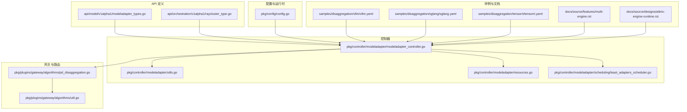
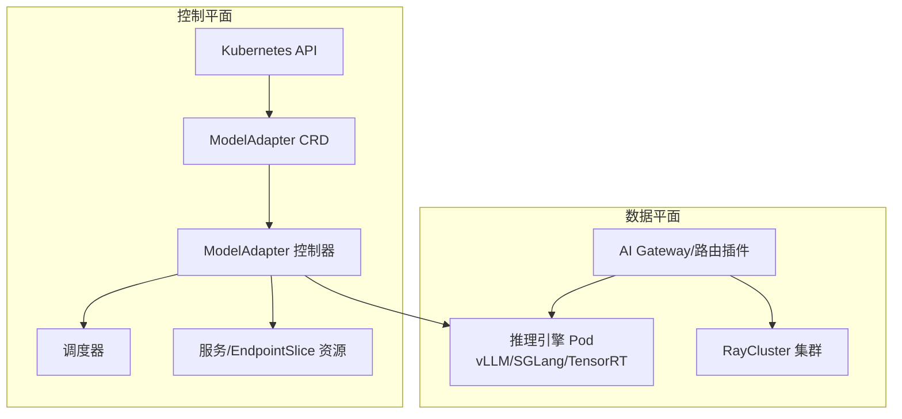
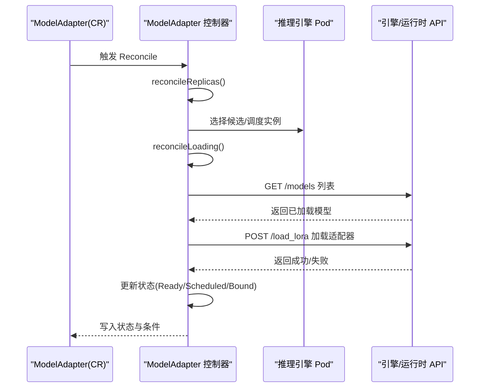
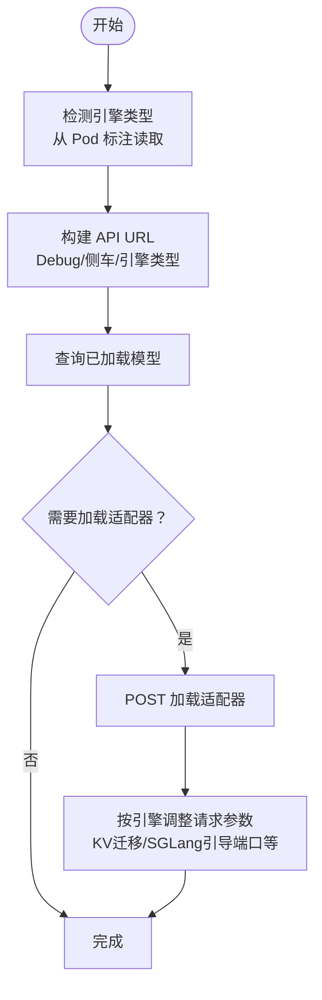
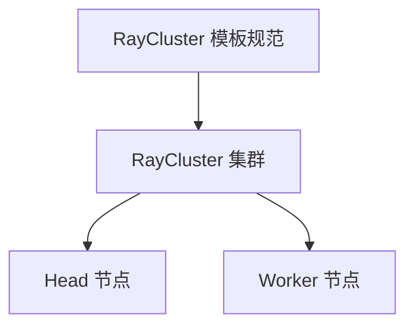
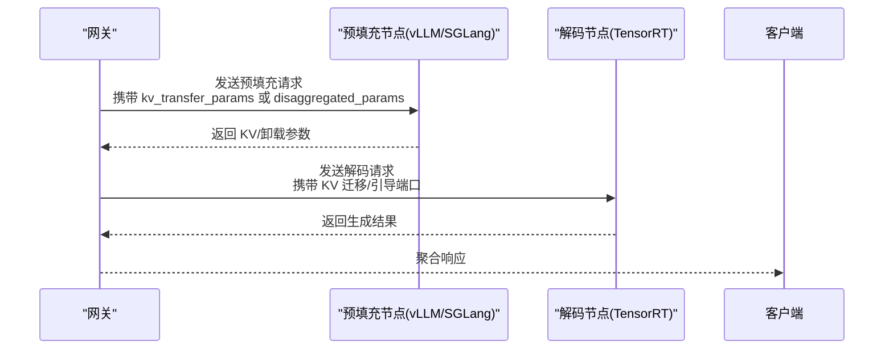
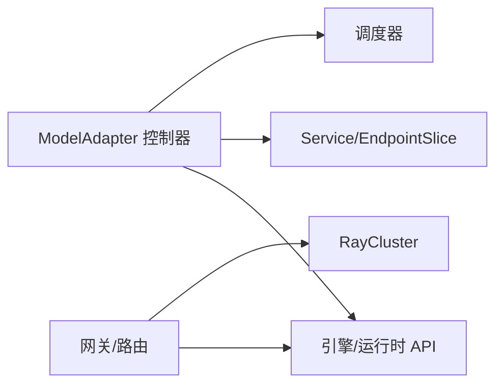

# 推理引擎支持

<cite>
**本文引用的文件**   
- [pkg/controller/modeladapter/modeladapter_controller.go](file://pkg/controller/modeladapter/modeladapter_controller.go)
- [pkg/controller/modeladapter/utils.go](file://pkg/controller/modeladapter/utils.go)
- [pkg/controller/modeladapter/resources.go](file://pkg/controller/modeladapter/resources.go)
- [api/model/v1alpha1/modeladapter_types.go](file://api/model/v1alpha1/modeladapter_types.go)
- [api/orchestration/v1alpha1/raycluster_type.go](file://api/orchestration/v1alpha1/raycluster_type.go)
- [pkg/config/config.go](file://pkg/config/config.go)
- [pkg/plugins/gateway/algorithms/pd_disaggregation.go](file://pkg/plugins/gateway/algorithms/pd_disaggregation.go)
- [pkg/plugins/gateway/algorithms/util.go](file://pkg/plugins/gateway/algorithms/util.go)
- [pkg/controller/modeladapter/lora_client.go](file://pkg/controller/modeladapter/lora_client.go)
- [pkg/controller/modeladapter/scheduling/least_adapters_scheduler.go](file://pkg/controller/modeladapter/scheduling/least_adapters_scheduler.go)
- [samples/disaggregation/vllm/vllm.yaml](file://samples/disaggregation/vllm/vllm.yaml)
- [samples/disaggregation/sglang/sglang.yaml](file://samples/disaggregation/sglang/sglang.yaml)
- [samples/disaggregation/tensorrt/tensorrt.yaml](file://samples/disaggregation/tensorrt/tensorrt.yaml)
- [samples/disaggregation/neuron/neuron.yaml](file://samples/disaggregation/neuron/neuron.yaml)
- [samples/disaggregation/README.md](file://samples/disaggregation/README.md)
- [docs/source/features/multi-engine.rst](file://docs/source/features/multi-engine.rst)
- [docs/source/features/multi-node-inference.rst](file://docs/source/features/multi-node-inference.rst)
- [docs/source/designs/aibrix-engine-runtime.rst](file://docs/source/designs/aibrix-engine-runtime.rst)
- [docs/source/designs/aibrix-router.rst](file://docs/source/designs/aibrix-router.rst)
- [benchmarks/scenarios/gateway/benchmark.py](file://benchmarks/scenarios/gateway/benchmark.py)
- [benchmarks/scenarios/gateway/client.py](file://benchmarks/scenarios/gateway/client.py)
- [benchmarks/plot/aibrix0.1-routing.ipynb](file://benchmarks/plot/aibrix0.1-routing.ipynb)
- [development/tutorials/distributed/raycluster.yaml](file://development/tutorials/distributed/raycluster.yaml)
- [development/tutorials/distributed/fleet.yaml](file://development/tutorials/distributed/fleet.yaml)
- [development/tutorials/distributed/nvkind-single-node.yaml](file://development/tutorials/distributed/nvkind-single-node.yaml)
- [development/tutorials/distributed/nvkind-two-nodes.yaml](file://development/tutorials/distributed/nvkind-two-nodes.yaml)
- [development/vllm/README.md](file://development/vllm/README.md)
- [deployment/local/run-local.sh](file://deployment/local/run-local.sh)
- [deployment/standalone/start.sh](file://deployment/standalone/start.sh)
</cite>

## 目录
1. [简介](#简介)
2. [项目结构](#项目结构)
3. [核心组件](#核心组件)
4. [架构总览](#架构总览)
5. [详细组件分析](#详细组件分析)
6. [依赖分析](#依赖分析)
7. [性能考虑](#性能考虑)
8. [故障排除指南](#故障排除指南)
9. [结论](#结论)
10. [附录](#附录)

## 简介
本技术文档聚焦于 AIBrix 的多引擎推理架构，系统性阐述以下能力：
- 多引擎统一抽象：vLLM 集成的模型加载与推理优化、SGLang 分布式并行计算、TensorRT 硬件加速的模型转换与性能优化。
- 模型适配器（ModelAdapter）工作原理：引擎选择策略、资源配置、生命周期管理与重试机制。
- RayCluster 分布式推理架构：集群管理、任务调度、资源分配与弹性伸缩。
- 不同引擎的配置指南、性能对比分析与最佳实践建议，并提供可操作的部署示例与故障排除方法。

## 项目结构
围绕推理引擎支持的关键目录与文件如下：
- API 定义：ModelAdapter 自定义资源与 RayCluster 模板规范
- 控制器：ModelAdapter 控制器、调度器、资源生成与工具函数
- 网关与路由：跨引擎的分发聚合与卸载（Disaggregation）算法
- 样例与文档：多引擎部署样例、设计文档与基准测试
- 部署脚本：本地与独立部署启动脚本

**图表来源**
- [api/model/v1alpha1/modeladapter_types.go:1-161](file://api/model/v1alpha1/modeladapter_types.go#L1-L161)
- [api/orchestration/v1alpha1/raycluster_type.go:1-35](file://api/orchestration/v1alpha1/raycluster_type.go#L1-L35)
- [pkg/controller/modeladapter/modeladapter_controller.go:1-1236](file://pkg/controller/modeladapter/modeladapter_controller.go#L1-L1236)
- [pkg/controller/modeladapter/utils.go:1-159](file://pkg/controller/modeladapter/utils.go#L1-L159)
- [pkg/controller/modeladapter/resources.go:1-103](file://pkg/controller/modeladapter/resources.go#L1-L103)
- [pkg/controller/modeladapter/scheduling/least_adapters_scheduler.go:1-200](file://pkg/controller/modeladapter/scheduling/least_adapters_scheduler.go#L1-L200)
- [pkg/plugins/gateway/algorithms/pd_disaggregation.go:1-1200](file://pkg/plugins/gateway/algorithms/pd_disaggregation.go#L1-L1200)
- [pkg/plugins/gateway/algorithms/util.go:1-120](file://pkg/plugins/gateway/algorithms/util.go#L1-L120)
- [pkg/config/config.go:1-42](file://pkg/config/config.go#L1-L42)
- [samples/disaggregation/vllm/vllm.yaml:1-200](file://samples/disaggregation/vllm/vllm.yaml#L1-L200)
- [samples/disaggregation/sglang/sglang.yaml:1-200](file://samples/disaggregation/sglang/sglang.yaml#L1-L200)
- [samples/disaggregation/tensorrt/tensorrt.yaml:1-200](file://samples/disaggregation/tensorrt/tensorrt.yaml#L1-L200)

**章节来源**
- [api/model/v1alpha1/modeladapter_types.go:1-161](file://api/model/v1alpha1/modeladapter_types.go#L1-L161)
- [api/orchestration/v1alpha1/raycluster_type.go:1-35](file://api/orchestration/v1alpha1/raycluster_type.go#L1-L35)
- [pkg/controller/modeladapter/modeladapter_controller.go:1-1236](file://pkg/controller/modeladapter/modeladapter_controller.go#L1-L1236)
- [pkg/controller/modeladapter/utils.go:1-159](file://pkg/controller/modeladapter/utils.go#L1-L159)
- [pkg/controller/modeladapter/resources.go:1-103](file://pkg/controller/modeladapter/resources.go#L1-L103)
- [pkg/config/config.go:1-42](file://pkg/config/config.go#L1-L42)

## 核心组件
- ModelAdapter 自定义资源：描述基座模型、适配器制品来源、标签选择器、副本分布策略与附加配置。
- ModelAdapter 控制器：负责 Pod 实例编排、服务与 EndpointSlice 资源创建、适配器加载与卸载、状态机推进与重试。
- 引擎选择与适配器加载：根据 Pod 标注与运行时配置，自动选择 vLLM/SGLang/TensorRT 等引擎，构建对应 API URL 并调用加载接口。
- 网关与分发：在多引擎场景下进行请求拆分、参数转换与结果聚合，支持 vLLM 的 KV 迁移与 SGLang 的引导端口传递等特性。
- RayCluster 模板：封装 Ray 集群规格，用于分布式推理与弹性扩缩容。

**章节来源**
- [api/model/v1alpha1/modeladapter_types.go:26-116](file://api/model/v1alpha1/modeladapter_types.go#L26-L116)
- [pkg/controller/modeladapter/modeladapter_controller.go:313-493](file://pkg/controller/modeladapter/modeladapter_controller.go#L313-L493)
- [pkg/controller/modeladapter/utils.go:118-158](file://pkg/controller/modeladapter/utils.go#L118-L158)
- [pkg/plugins/gateway/algorithms/pd_disaggregation.go:967-994](file://pkg/plugins/gateway/algorithms/pd_disaggregation.go#L967-L994)
- [api/orchestration/v1alpha1/raycluster_type.go:24-34](file://api/orchestration/v1alpha1/raycluster_type.go#L24-L34)

## 架构总览
AIBrix 的多引擎推理架构以 Kubernetes 为底座，通过自定义资源与控制器实现对不同推理引擎的统一管理；网关层负责请求分发与跨引擎协调；RayCluster 提供大规模分布式推理能力。

**图表来源**
- [pkg/controller/modeladapter/modeladapter_controller.go:127-277](file://pkg/controller/modeladapter/modeladapter_controller.go#L127-L277)
- [pkg/controller/modeladapter/resources.go:28-102](file://pkg/controller/modeladapter/resources.go#L28-L102)
- [pkg/plugins/gateway/algorithms/pd_disaggregation.go:1-200](file://pkg/plugins/gateway/algorithms/pd_disaggregation.go#L1-L200)
- [api/orchestration/v1alpha1/raycluster_type.go:24-34](file://api/orchestration/v1alpha1/raycluster_type.go#L24-L34)

## 详细组件分析

### 模型适配器（ModelAdapter）控制器
- 生命周期与状态机：Pending → Scheduled/Bound → ResourceCreated → Running/Fault；控制器在每次 Reconcile 中推进阶段并更新条件。
- 副本与实例管理：支持“全部节点加载”与“单节点加载”，后者使用调度器选择目标 Pod。
- 资源创建：自动生成 Headless Service 与 EndpointSlice，暴露 8000 端口。
- 加载与卸载：根据运行时配置与 Pod 标注决定是否走运行时 Sidecar 或直接调用引擎 API；构建对应引擎的模型列表/加载/卸载 URL 并执行。

**图表来源**
- [pkg/controller/modeladapter/modeladapter_controller.go:417-493](file://pkg/controller/modeladapter/modeladapter_controller.go#L417-L493)
- [pkg/controller/modeladapter/utils.go:118-158](file://pkg/controller/modeladapter/utils.go#L118-L158)
- [pkg/controller/modeladapter/resources.go:28-102](file://pkg/controller/modeladapter/resources.go#L28-L102)

**章节来源**
- [pkg/controller/modeladapter/modeladapter_controller.go:313-493](file://pkg/controller/modeladapter/modeladapter_controller.go#L313-L493)
- [pkg/controller/modeladapter/resources.go:28-102](file://pkg/controller/modeladapter/resources.go#L28-L102)
- [pkg/controller/modeladapter/utils.go:118-158](file://pkg/controller/modeladapter/utils.go#L118-L158)

### 引擎选择与适配器加载流程
- 引擎类型检测：从 Pod 标注中读取引擎标识，支持 vLLM、SGLang、TensorRT 等。
- URL 构建：根据 Debug 模式、是否启用运行时 Sidecar、引擎类型，拼接正确的 API 路径。
- 参数转换：针对不同引擎的差异（如 vLLM 的 KV 迁移参数、SGLang 的引导端口），在请求体中注入或调整字段。

**图表来源**
- [pkg/controller/modeladapter/utils.go:118-158](file://pkg/controller/modeladapter/utils.go#L118-L158)
- [pkg/plugins/gateway/algorithms/pd_disaggregation.go:967-994](file://pkg/plugins/gateway/algorithms/pd_disaggregation.go#L967-L994)
- [pkg/plugins/gateway/algorithms/util.go:40-59](file://pkg/plugins/gateway/algorithms/util.go#L40-L59)

**章节来源**
- [pkg/controller/modeladapter/utils.go:118-158](file://pkg/controller/modeladapter/utils.go#L118-L158)
- [pkg/plugins/gateway/algorithms/pd_disaggregation.go:967-994](file://pkg/plugins/gateway/algorithms/pd_disaggregation.go#L967-L994)
- [pkg/plugins/gateway/algorithms/util.go:40-59](file://pkg/plugins/gateway/algorithms/util.go#L40-L59)

### RayCluster 分布式推理架构
- 模板规范：通过 RayClusterTemplateSpec 封装集群规格，便于在多节点场景下快速部署。
- 集群管理：结合控制器与 KubeRay，实现 Head/Worker 组件的生命周期管理与弹性扩缩容。
- 任务调度：结合 ModelAdapter 的实例分布策略，将适配器按需加载到目标节点，支撑大规模推理。

**图表来源**
- [api/orchestration/v1alpha1/raycluster_type.go:24-34](file://api/orchestration/v1alpha1/raycluster_type.go#L24-L34)

**章节来源**
- [api/orchestration/v1alpha1/raycluster_type.go:24-34](file://api/orchestration/v1alpha1/raycluster_type.go#L24-L34)

### vLLM 集成与 SGLang 分布式并行
- vLLM：支持 KV 缓存迁移参数，用于预填充与解码阶段的远程 KV 传输，降低延迟。
- SGLang：通过引导端口（bootstrap_port）与主机（bootstrap_host）参数，实现分布式并行计算的连接建立。
- TensorRT：采用 Snowflake 风格的全局请求 ID，确保跨 Worker 的一致性与可追踪性。

**图表来源**
- [pkg/plugins/gateway/algorithms/pd_disaggregation.go:1606-1620](file://pkg/plugins/gateway/algorithms/pd_disaggregation.go#L1606-L1620)
- [pkg/plugins/gateway/algorithms/util.go:40-59](file://pkg/plugins/gateway/algorithms/util.go#L40-L59)

**章节来源**
- [pkg/plugins/gateway/algorithms/pd_disaggregation.go:1606-1620](file://pkg/plugins/gateway/algorithms/pd_disaggregation.go#L1606-L1620)
- [pkg/plugins/gateway/algorithms/util.go:40-59](file://pkg/plugins/gateway/algorithms/util.go#L40-L59)

## 依赖分析
- 控制器与 API：ModelAdapter 控制器依赖 CRD 定义与 Kubernetes 客户端，负责 Pod/Service/EndpointSlice 的增删改查。
- 引擎侧 API：通过运行时配置与 Pod 标注，动态选择 vLLM/SGLang/TensorRT 的 API 路径。
- 网关与路由：pd_disaggregation 模块负责跨引擎请求参数转换与一致性校验。
- RayCluster：模板规范与控制器共同驱动集群生命周期。

**图表来源**
- [pkg/controller/modeladapter/modeladapter_controller.go:127-277](file://pkg/controller/modeladapter/modeladapter_controller.go#L127-L277)
- [pkg/controller/modeladapter/resources.go:28-102](file://pkg/controller/modeladapter/resources.go#L28-L102)
- [pkg/plugins/gateway/algorithms/pd_disaggregation.go:1-200](file://pkg/plugins/gateway/algorithms/pd_disaggregation.go#L1-L200)
- [api/orchestration/v1alpha1/raycluster_type.go:24-34](file://api/orchestration/v1alpha1/raycluster_type.go#L24-L34)

**章节来源**
- [pkg/controller/modeladapter/modeladapter_controller.go:127-277](file://pkg/controller/modeladapter/modeladapter_controller.go#L127-L277)
- [pkg/controller/modeladapter/resources.go:28-102](file://pkg/controller/modeladapter/resources.go#L28-L102)
- [pkg/plugins/gateway/algorithms/pd_disaggregation.go:1-200](file://pkg/plugins/gateway/algorithms/pd_disaggregation.go#L1-L200)
- [api/orchestration/v1alpha1/raycluster_type.go:24-34](file://api/orchestration/v1alpha1/raycluster_type.go#L24-L34)

## 性能考虑
- vLLM KV 迁移：在预填充与解码之间进行 KV 块迁移，减少重复计算，提升吞吐。
- SGLang 引导端口：通过明确的 bootstrap_host/port，避免连接协商开销，提高并行效率。
- TensorRT 全局请求 ID：Snowflake 风格 ID 确保跨 Worker 的请求可追踪与一致性。
- 调度策略：基于“最少适配器”等策略选择最优节点，降低跨节点通信成本。
- 网关聚合：在多引擎场景下，合理拆分与合并请求，避免过度网络往返。

**章节来源**
- [pkg/plugins/gateway/algorithms/pd_disaggregation.go:1606-1620](file://pkg/plugins/gateway/algorithms/pd_disaggregation.go#L1606-L1620)
- [pkg/plugins/gateway/algorithms/util.go:40-59](file://pkg/plugins/gateway/algorithms/util.go#L40-L59)
- [pkg/controller/modeladapter/scheduling/least_adapters_scheduler.go:1-200](file://pkg/controller/modeladapter/scheduling/least_adapters_scheduler.go#L1-L200)

## 故障排除指南
- 适配器加载失败
  - 检查 Pod 就绪状态与就绪超时配置。
  - 查看控制器事件与状态条件，定位加载错误原因。
  - 确认运行时配置（Debug 模式、是否启用 Sidecar）与引擎类型匹配。
- 服务/EndpointSlice 创建失败
  - 核对 Service/EndpointSlice 的 OwnerReference 与标签。
  - 确认 Headless Service 的 ClusterIP 设置与 TargetPort 一致。
- 引擎不一致
  - 在多引擎场景下，确保预填充节点使用相同引擎类型。
  - 对于 SGLang，检查 bootstrap_host/port 注入是否正确。
- RayCluster 弹性伸缩异常
  - 检查模板规格与控制器日志，确认 Head/Worker 节点状态。
  - 关注扩缩容策略与资源配额限制。

**章节来源**
- [pkg/controller/modeladapter/modeladapter_controller.go:417-493](file://pkg/controller/modeladapter/modeladapter_controller.go#L417-L493)
- [pkg/controller/modeladapter/resources.go:64-102](file://pkg/controller/modeladapter/resources.go#L64-L102)
- [pkg/plugins/gateway/algorithms/pd_disaggregation.go:976-994](file://pkg/plugins/gateway/algorithms/pd_disaggregation.go#L976-L994)

## 结论
AIBrix 通过统一的 ModelAdapter 抽象与控制器，实现了对 vLLM、SGLang、TensorRT 等多种推理引擎的无缝集成；借助网关层的参数转换与分发聚合，以及 RayCluster 的分布式能力，满足高吞吐、低延迟与可扩展的推理需求。结合调度策略与可观测性指标，可在生产环境中稳定落地。

## 附录

### 引擎配置与部署示例
- vLLM 卸载（Disaggregation）
  - 参考样例：[samples/disaggregation/vllm/vllm.yaml](file://samples/disaggregation/vllm/vllm.yaml)
  - 设计文档：[docs/source/features/multi-engine.rst](file://docs/source/features/multi-engine.rst)
- SGLang 卸载（Disaggregation）
  - 参考样例：[samples/disaggregation/sglang/sglang.yaml](file://samples/disaggregation/sglang/sglang.yaml)
  - 设计文档：[docs/source/designs/aibrix-router.rst](file://docs/source/designs/aibrix-router.rst)
- TensorRT 卸载（Disaggregation）
  - 参考样例：[samples/disaggregation/tensorrt/tensorrt.yaml](file://samples/disaggregation/tensorrt/tensorrt.yaml)
  - 设计文档：[docs/source/designs/aibrix-engine-runtime.rst](file://docs/source/designs/aibrix-engine-runtime.rst)
- Neuron 卸载（Disaggregation）
  - 参考样例：[samples/disaggregation/neuron/neuron.yaml](file://samples/disaggregation/neuron/neuron.yaml)
  - 文档说明：[samples/disaggregation/README.md](file://samples/disaggregation/README.md)
- 分布式推理（RayCluster）
  - 示例：[development/tutorials/distributed/raycluster.yaml](file://development/tutorials/distributed/raycluster.yaml)
  - 多节点示例：[development/tutorials/distributed/nvkind-two-nodes.yaml](file://development/tutorials/distributed/nvkind-two-nodes.yaml)
  - 节点规模：[development/tutorials/distributed/nvkind-single-node.yaml](file://development/tutorials/distributed/nvkind-single-node.yaml)
  - 集群编排：[development/tutorials/distributed/fleet.yaml](file://development/tutorials/distributed/fleet.yaml)
- 本地与独立部署
  - 本地：[deployment/local/run-local.sh](file://deployment/local/run-local.sh)
  - 独立：[deployment/standalone/start.sh](file://deployment/standalone/start.sh)

### 性能对比与基准
- 网关基准脚本：[benchmarks/scenarios/gateway/benchmark.py](file://benchmarks/scenarios/gateway/benchmark.py)
- 客户端脚本：[benchmarks/scenarios/gateway/client.py](file://benchmarks/scenarios/gateway/client.py)
- 路由可视化：[benchmarks/plot/aibrix0.1-routing.ipynb](file://benchmarks/plot/aibrix0.1-routing.ipynb)

**章节来源**
- [samples/disaggregation/vllm/vllm.yaml:1-200](file://samples/disaggregation/vllm/vllm.yaml#L1-L200)
- [samples/disaggregation/sglang/sglang.yaml:1-200](file://samples/disaggregation/sglang/sglang.yaml#L1-L200)
- [samples/disaggregation/tensorrt/tensorrt.yaml:1-200](file://samples/disaggregation/tensorrt/tensorrt.yaml#L1-L200)
- [samples/disaggregation/neuron/neuron.yaml:1-200](file://samples/disaggregation/neuron/neuron.yaml#L1-L200)
- [samples/disaggregation/README.md:1-200](file://samples/disaggregation/README.md#L1-L200)
- [docs/source/features/multi-engine.rst:1-200](file://docs/source/features/multi-engine.rst#L1-L200)
- [docs/source/designs/aibrix-router.rst:1-200](file://docs/source/designs/aibrix-router.rst#L1-L200)
- [docs/source/designs/aibrix-engine-runtime.rst:1-200](file://docs/source/designs/aibrix-engine-runtime.rst#L1-L200)
- [development/tutorials/distributed/raycluster.yaml:1-200](file://development/tutorials/distributed/raycluster.yaml#L1-L200)
- [development/tutorials/distributed/nvkind-two-nodes.yaml:1-200](file://development/tutorials/distributed/nvkind-two-nodes.yaml#L1-L200)
- [development/tutorials/distributed/nvkind-single-node.yaml:1-200](file://development/tutorials/distributed/nvkind-single-node.yaml#L1-L200)
- [development/tutorials/distributed/fleet.yaml:1-200](file://development/tutorials/distributed/fleet.yaml#L1-L200)
- [deployment/local/run-local.sh:1-200](file://deployment/local/run-local.sh#L1-L200)
- [deployment/standalone/start.sh:1-200](file://deployment/standalone/start.sh#L1-L200)
- [benchmarks/scenarios/gateway/benchmark.py:1-200](file://benchmarks/scenarios/gateway/benchmark.py#L1-L200)
- [benchmarks/scenarios/gateway/client.py:1-200](file://benchmarks/scenarios/gateway/client.py#L1-L200)
- [benchmarks/plot/aibrix0.1-routing.ipynb:1-200](file://benchmarks/plot/aibrix0.1-routing.ipynb#L1-L200)