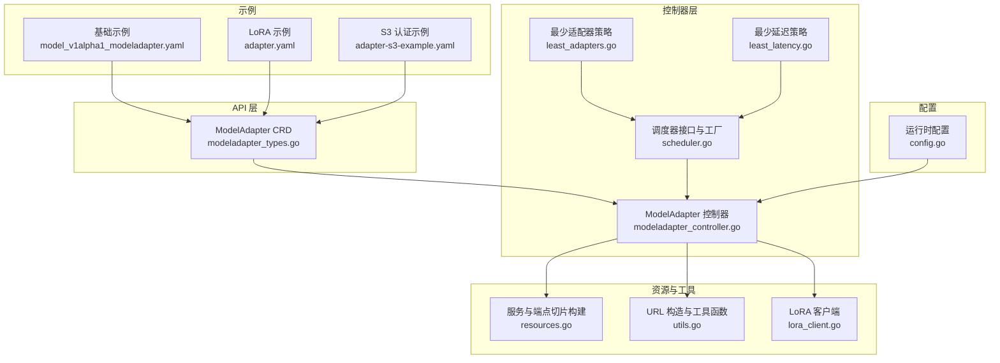
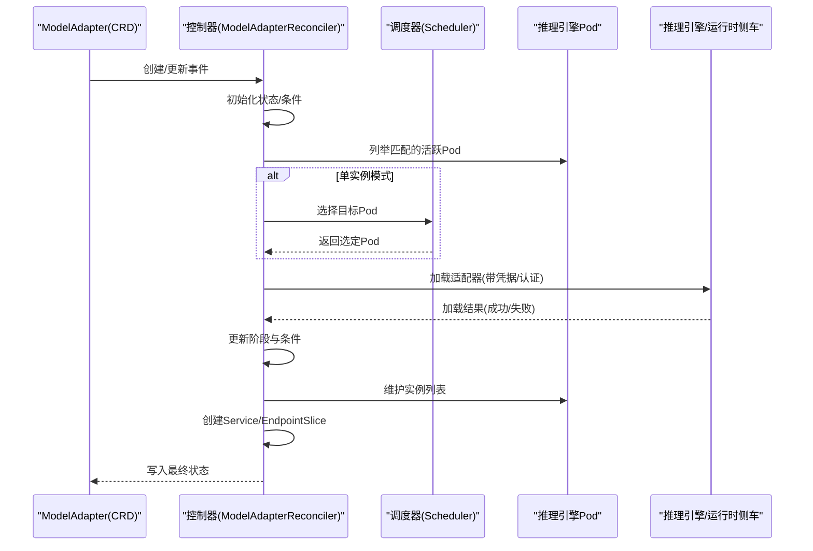
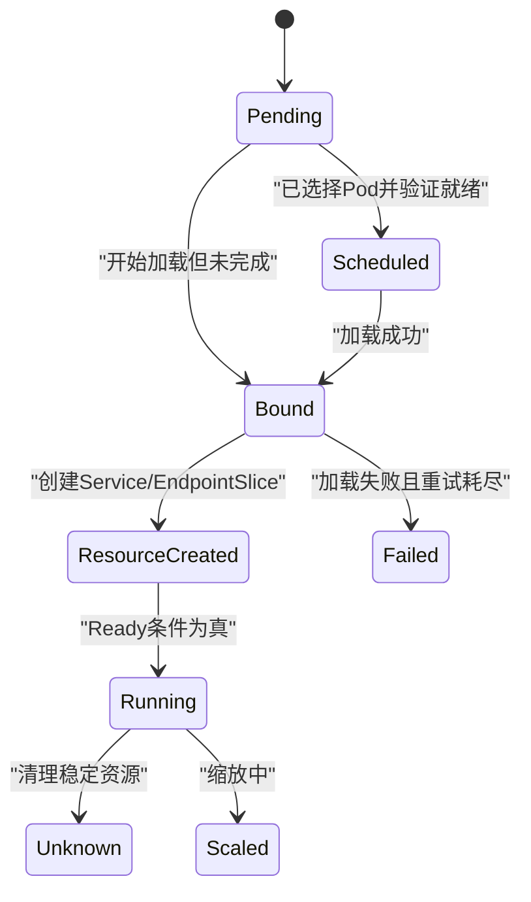
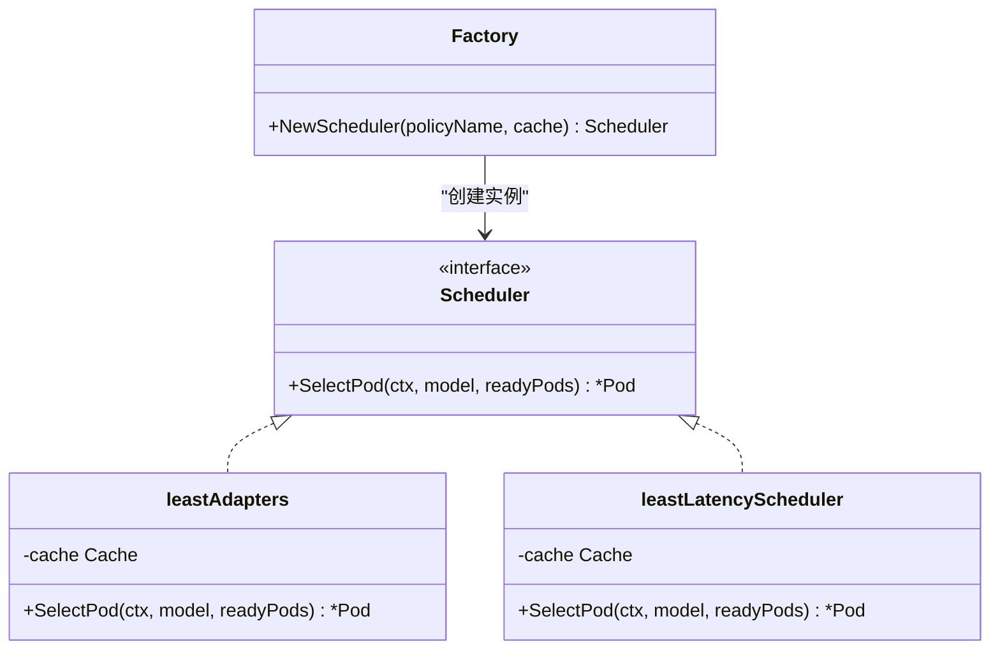
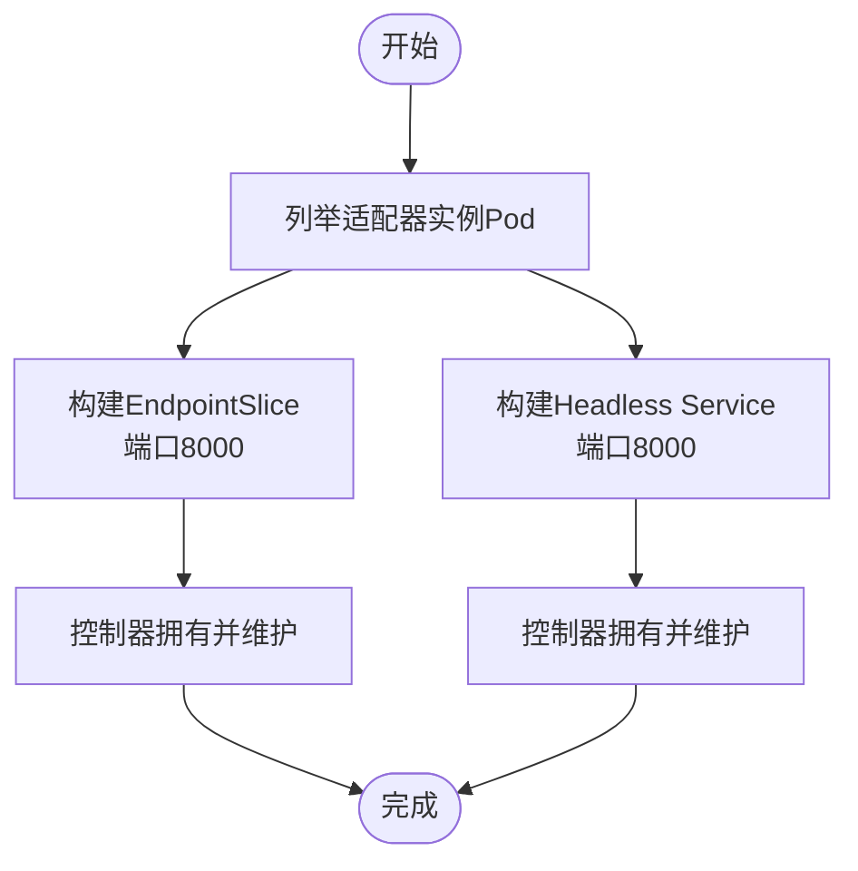
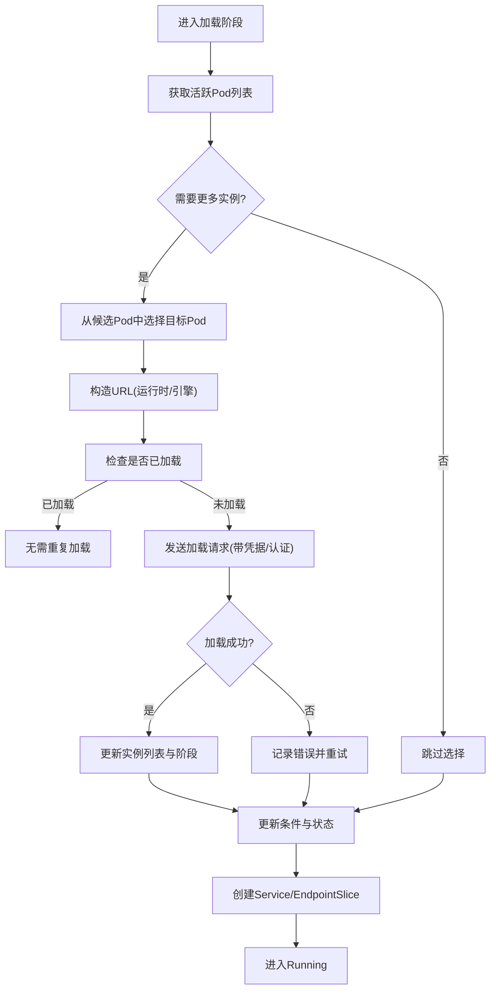
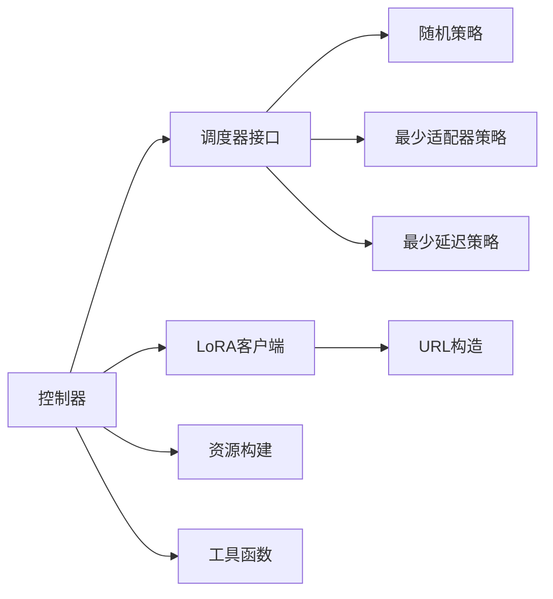

# 模型适配器管理

<cite>
**本文引用的文件**
- [modeladapter_types.go](file://api/model/v1alpha1/modeladapter_types.go)
- [modeladapter_controller.go](file://pkg/controller/modeladapter/modeladapter_controller.go)
- [scheduler.go](file://pkg/controller/modeladapter/scheduling/scheduler.go)
- [least_adapters.go](file://pkg/controller/modeladapter/scheduling/least_adapters.go)
- [least_latency.go](file://pkg/controller/modeladapter/scheduling/least_latency.go)
- [resources.go](file://pkg/controller/modeladapter/resources.go)
- [utils.go](file://pkg/controller/modeladapter/utils.go)
- [lora_client.go](file://pkg/controller/modeladapter/lora_client.go)
- [config.go](file://pkg/config/config.go)
- [model_v1alpha1_modeladapter.yaml](file://config/samples/model_v1alpha1_modeladapter.yaml)
- [adapter.yaml](file://samples/adapter/adapter.yaml)
- [adapter-s3-example.yaml](file://samples/adapter/adapter-s3-example.yaml)
</cite>

## 目录
1. [简介](#简介)
2. [项目结构](#项目结构)
3. [核心组件](#核心组件)
4. [架构总览](#架构总览)
5. [详细组件分析](#详细组件分析)
6. [依赖分析](#依赖分析)
7. [性能考虑](#性能考虑)
8. [故障排查指南](#故障排查指南)
9. [结论](#结论)
10. [附录](#附录)

## 简介
本技术文档面向模型适配器管理系统，系统通过 Kubernetes CRD（Custom Resource Definition）对“模型适配器”进行声明式管理，实现 LoRA 微调适配器在推理引擎中的动态加载与卸载。文档覆盖以下主题：
- 核心概念与生命周期：Pending、Scheduled、Bound、ResourceCreated、Running、Failed、Scaled、Unknown
- Pod 选择策略：随机、最少适配器数、最少延迟、最少吞吐、首次适配器（bin pack）
- 资源绑定机制：Service、EndpointSlice 的自动创建与维护
- 状态管理与条件流转：基于 Kubernetes 条件类型的阶段推进
- 配置指南：基础模型、Pod 选择器、额外配置参数、认证凭据
- 下载机制：支持 huggingface://、s3:// 等协议；运行时侧车模式与直连引擎模式
- 实际部署示例：本地 YAML 示例与 S3 认证示例

## 项目结构
模型适配器相关代码主要分布在以下模块：
- API 定义：定义 CRD 结构体、生命周期阶段与状态字段
- 控制器：实现 Reconcile 流程、Pod 实例编排、服务与端点切片资源管理、调度器集成
- 调度器：多种策略工厂与具体实现
- 工具与资源：URL 构造、负载均衡端点构建、通用工具函数
- LoRA 客户端：与推理引擎或运行时侧车交互，执行加载/卸载请求
- 配置：运行时开关与调度策略配置
- 示例：基础 CRD 示例与 S3 认证示例

**图表来源**
- [modeladapter_types.go:26-116](file://api/model/v1alpha1/modeladapter_types.go#L26-L116)
- [modeladapter_controller.go:127-191](file://pkg/controller/modeladapter/modeladapter_controller.go#L127-L191)
- [scheduler.go:28-50](file://pkg/controller/modeladapter/scheduling/scheduler.go#L28-L50)
- [least_adapters.go:28-55](file://pkg/controller/modeladapter/scheduling/least_adapters.go#L28-L55)
- [least_latency.go:29-61](file://pkg/controller/modeladapter/scheduling/least_latency.go#L29-L61)
- [resources.go:28-102](file://pkg/controller/modeladapter/resources.go#L28-L102)
- [utils.go:118-158](file://pkg/controller/modeladapter/utils.go#L118-L158)
- [lora_client.go:56-73](file://pkg/controller/modeladapter/lora_client.go#L56-L73)
- [config.go:19-41](file://pkg/config/config.go#L19-L41)
- [model_v1alpha1_modeladapter.yaml:1-10](file://config/samples/model_v1alpha1_modeladapter.yaml#L1-L10)
- [adapter.yaml:1-40](file://samples/adapter/adapter.yaml#L1-L40)
- [adapter-s3-example.yaml:160-189](file://samples/adapter/adapter-s3-example.yaml#L160-L189)

**章节来源**
- [modeladapter_types.go:26-116](file://api/model/v1alpha1/modeladapter_types.go#L26-L116)
- [modeladapter_controller.go:127-191](file://pkg/controller/modeladapter/modeladapter_controller.go#L127-L191)

## 核心组件
- CRD 定义：包含基础模型标识、Pod 选择器、调度器名称、制品地址、凭据引用、副本数与附加配置等字段；状态包含阶段、候选数、期望副本、就绪副本、条件列表与实例列表
- 控制器：负责初始化状态、实例编排（单实例或全量）、加载流程（含重试与就绪检查）、资源创建（Service/EndpointSlice）、状态更新与条件推进
- 调度器：根据策略从候选 Pod 中选择目标 Pod，当前支持随机、最少适配器、最少延迟、最少吞吐、首次适配器（bin pack）
- 资源构建：为适配器创建 Headless Service 与 EndpointSlice，暴露推理引擎端口
- 工具与 URL：根据运行时配置与引擎类型构造 API 路径，支持运行时侧车与直连引擎两种路径
- LoRA 客户端：封装与引擎或运行时侧车的 HTTP 交互，支持 huggingface://、s3:// 等协议的制品下载与认证头注入

**章节来源**
- [modeladapter_types.go:26-116](file://api/model/v1alpha1/modeladapter_types.go#L26-L116)
- [modeladapter_controller.go:417-493](file://pkg/controller/modeladapter/modeladapter_controller.go#L417-L493)
- [scheduler.go:28-50](file://pkg/controller/modeladapter/scheduling/scheduler.go#L28-L50)
- [resources.go:28-102](file://pkg/controller/modeladapter/resources.go#L28-L102)
- [utils.go:118-158](file://pkg/controller/modeladapter/utils.go#L118-L158)
- [lora_client.go:81-108](file://pkg/controller/modeladapter/lora_client.go#L81-L108)

## 架构总览
模型适配器控制器通过 Informer 监听 CR、Pod、Service、EndpointSlice 等资源变更，周期性触发 Reconcile，按阶段推进适配器生命周期，并通过调度器选择合适的 Pod 执行加载。

**图表来源**
- [modeladapter_controller.go:417-493](file://pkg/controller/modeladapter/modeladapter_controller.go#L417-L493)
- [scheduler.go:34-50](file://pkg/controller/modeladapter/scheduling/scheduler.go#L34-L50)
- [lora_client.go:81-108](file://pkg/controller/modeladapter/lora_client.go#L81-L108)
- [resources.go:28-102](file://pkg/controller/modeladapter/resources.go#L28-L102)

## 详细组件分析

### 生命周期与状态管理
- 阶段定义：Pending、Scheduled、Bound、ResourceCreated、Running、Failed、Scaled、Unknown
- 条件类型：Initialized、Scheduled、Bound、ResourceCreated、Ready
- 控制器推进逻辑：
  - 初始阶段设置为 Pending 并写入 Initialized 条件
  - 实例编排后进入 Scheduled/Bound（取决于是否成功加载）
  - 成功创建 Service/EndpointSlice 后进入 ResourceCreated
  - 最终 Ready 条件为真时进入 Running
  - 失败状态下保留 Failed 状态以便观察错误原因

**图表来源**
- [modeladapter_types.go:66-84](file://api/model/v1alpha1/modeladapter_types.go#L66-L84)
- [modeladapter_controller.go:417-493](file://pkg/controller/modeladapter/modeladapter_controller.go#L417-L493)

**章节来源**
- [modeladapter_types.go:66-126](file://api/model/v1alpha1/modeladapter_types.go#L66-L126)
- [modeladapter_controller.go:417-493](file://pkg/controller/modeladapter/modeladapter_controller.go#L417-L493)

### Pod 选择策略与调度算法
- 策略工厂：根据配置选择策略，支持 random、leastAdapters、binPack、leastLatency、leastThroughput
- leastAdapters：选择当前已加载适配器数量最少的 Pod
- leastLatency：基于队列时延与推理时延均值选择延迟最小的 Pod
- binPack：按需实现（接口存在），用于将适配器集中放置以提升缓存命中与资源利用率
- leastThroughput：按需实现（接口存在），用于避免高负载 Pod

**图表来源**
- [scheduler.go:28-50](file://pkg/controller/modeladapter/scheduling/scheduler.go#L28-L50)
- [least_adapters.go:28-55](file://pkg/controller/modeladapter/scheduling/least_adapters.go#L28-L55)
- [least_latency.go:29-61](file://pkg/controller/modeladapter/scheduling/least_latency.go#L29-L61)

**章节来源**
- [scheduler.go:34-50](file://pkg/controller/modeladapter/scheduling/scheduler.go#L34-L50)
- [least_adapters.go:38-55](file://pkg/controller/modeladapter/scheduling/least_adapters.go#L38-L55)
- [least_latency.go:39-61](file://pkg/controller/modeladapter/scheduling/least_latency.go#L39-L61)

### 资源绑定机制（Service 与 EndpointSlice）
- Service：Headless ClusterIP None，发布不就绪地址，端口 8000，标签包含模型标识与适配器名称
- EndpointSlice：基于当前实例列表生成端点，每个 Pod IP 对应一个端点，端口 8000
- 控制器在 ResourceCreated 阶段创建并维护这些资源，确保路由可达

**图表来源**
- [resources.go:28-102](file://pkg/controller/modeladapter/resources.go#L28-L102)
- [modeladapter_controller.go:459-481](file://pkg/controller/modeladapter/modeladapter_controller.go#L459-L481)

**章节来源**
- [resources.go:28-102](file://pkg/controller/modeladapter/resources.go#L28-L102)
- [modeladapter_controller.go:459-481](file://pkg/controller/modeladapter/modeladapter_controller.go#L459-L481)

### 加载流程与重试机制
- 实例编排：根据 Spec.Replicas 决定全量加载或单实例加载；单实例模式下使用调度器选择 Pod
- 加载前检查：优先使用注解记录的已调度 Pod，其次健康可用 Pod
- 加载调用：根据运行时配置决定使用运行时侧车 API 或直接调用引擎 API；支持 huggingface:// 转换与 s3 凭据注入
- 重试与超时：加载失败会重试，超时与错误会被记录并回退到 Scheduled/Bound 阶段等待后续重试
- 就绪检测：通过 Pod 就绪时间与注解辅助判断稳定性

**图表来源**
- [modeladapter_controller.go:728-800](file://pkg/controller/modeladapter/modeladapter_controller.go#L728-L800)
- [utils.go:118-158](file://pkg/controller/modeladapter/utils.go#L118-L158)
- [lora_client.go:81-108](file://pkg/controller/modeladapter/lora_client.go#L81-L108)

**章节来源**
- [modeladapter_controller.go:728-800](file://pkg/controller/modeladapter/modeladapter_controller.go#L728-L800)
- [utils.go:118-158](file://pkg/controller/modeladapter/utils.go#L118-L158)
- [lora_client.go:207-315](file://pkg/controller/modeladapter/lora_client.go#L207-L315)

### 认证与下载机制
- 支持的制品地址协议：huggingface://、s3:// 等
- 运行时侧车模式：将原始 artifactURL 透传给运行时，由运行时负责凭据与下载
- 直连引擎模式：对 huggingface:// 做路径转换，s3:// 使用 Kubernetes Secret 引用的凭据
- 认证头：AdditionalConfig 中的 api-key 会作为 Authorization: Bearer 注入
- 凭据 Secret：通过 credentialsSecretRef 引用命名空间内的 Secret，读取后注入到运行时侧车的请求中

**章节来源**
- [lora_client.go:207-315](file://pkg/controller/modeladapter/lora_client.go#L207-L315)
- [utils.go:49-69](file://pkg/controller/modeladapter/utils.go#L49-L69)
- [adapter-s3-example.yaml:175-189](file://samples/adapter/adapter-s3-example.yaml#L175-L189)

### 配置指南
- 基础模型（BaseModel）：适配器所依附的基础模型名称
- Pod 选择器（PodSelector）：匹配可承载适配器的 Pod 标签
- 调度器名称（SchedulerName）：默认策略名称（如 default、least-adapters 等）
- 制品地址（ArtifactURL）：支持 huggingface://、s3:// 等
- 凭据引用（CredentialsSecretRef）：指向命名空间内 Secret
- 副本控制（Replicas）：nil 表示全量加载，1 表示单实例加载
- 附加配置（AdditionalConfig）：如 api-key 等键值对

**章节来源**
- [modeladapter_types.go:27-61](file://api/model/v1alpha1/modeladapter_types.go#L27-L61)
- [adapter.yaml:10-28](file://samples/adapter/adapter.yaml#L10-L28)
- [adapter-s3-example.yaml:169-189](file://samples/adapter/adapter-s3-example.yaml#L169-L189)

### 实际部署示例
- 基础示例：展示 ModelAdapter CR 的基本字段与生命周期说明
- LoRA 示例：演示 huggingface:// 协议与标签选择器
- S3 认证示例：展示如何通过 Secret 引用与 s3:// 地址配合使用

**章节来源**
- [model_v1alpha1_modeladapter.yaml:1-10](file://config/samples/model_v1alpha1_modeladapter.yaml#L1-L10)
- [adapter.yaml:1-40](file://samples/adapter/adapter.yaml#L1-L40)
- [adapter-s3-example.yaml:160-189](file://samples/adapter/adapter-s3-example.yaml#L160-L189)

## 依赖分析
- 控制器依赖调度器接口，通过工厂方法注入具体策略
- LoRA 客户端根据运行时配置与引擎类型选择 API 路径
- 资源构建依赖实例列表与端口常量
- 工具函数提供 URL 构造、字符串处理与运行时侧车检测

**图表来源**
- [modeladapter_controller.go:167-170](file://pkg/controller/modeladapter/modeladapter_controller.go#L167-L170)
- [scheduler.go:34-50](file://pkg/controller/modeladapter/scheduling/scheduler.go#L34-L50)
- [lora_client.go:118-158](file://pkg/controller/modeladapter/lora_client.go#L118-L158)
- [resources.go:28-102](file://pkg/controller/modeladapter/resources.go#L28-L102)
- [utils.go:118-158](file://pkg/controller/modeladapter/utils.go#L118-L158)

**章节来源**
- [modeladapter_controller.go:167-170](file://pkg/controller/modeladapter/modeladapter_controller.go#L167-L170)
- [scheduler.go:34-50](file://pkg/controller/modeladapter/scheduling/scheduler.go#L34-L50)
- [lora_client.go:118-158](file://pkg/controller/modeladapter/lora_client.go#L118-L158)
- [resources.go:28-102](file://pkg/controller/modeladapter/resources.go#L28-L102)
- [utils.go:118-158](file://pkg/controller/modeladapter/utils.go#L118-L158)

## 性能考虑
- 调度策略选择：
  - leastAdapters：降低单 Pod 上适配器数量，减少冲突与资源竞争
  - leastLatency：基于指标选择低延迟 Pod，提高响应质量
  - binPack：将适配器集中放置，提升缓存命中率与资源利用效率
- 重试与超时：
  - 控制器内置最大重试次数与回退时间，避免频繁抖动
  - Pod 就绪超时与注解辅助判断，减少无效尝试
- 端点收敛：
  - EndpointSlice 基于实例列表动态更新，保证路由收敛速度

[本节为通用性能建议，不直接分析具体文件]

## 故障排查指南
- 观察阶段与条件：
  - 通过 kubectl describe modeladapter 查看阶段与条件详情
  - 关注 Failed 阶段的原因与消息，定位加载失败原因
- 日志与事件：
  - 控制器日志包含加载/卸载、调度、资源创建等关键步骤
  - 事件记录有助于快速定位问题发生环节
- 常见问题：
  - Pod 不就绪：检查 Pod 就绪探针与资源限制
  - 加载失败：确认 artifactURL 协议与凭据配置、网络连通性
  - 调度失败：检查调度策略与候选 Pod 数量

**章节来源**
- [modeladapter_controller.go:495-505](file://pkg/controller/modeladapter/modeladapter_controller.go#L495-L505)
- [modeladapter_controller.go:507-554](file://pkg/controller/modeladapter/modeladapter_controller.go#L507-L554)

## 结论
模型适配器管理系统通过 CRD 与控制器实现了 LoRA 适配器的自动化生命周期管理，结合多策略调度与资源绑定，能够在多 Pod 场景中高效、稳定地分发与加载适配器。运行时侧车模式进一步简化了制品下载与认证流程，提升了部署灵活性。建议在生产环境中结合指标驱动的 leastLatency 策略与 binPack 策略，平衡延迟与资源利用率，并通过充分的日志与事件监控保障可观测性。

[本节为总结性内容，不直接分析具体文件]

## 附录
- 运行时配置项：
  - EnableRuntimeSidecar：启用运行时侧车模式
  - DebugMode：调试模式下的端口映射
  - SchedulerPolicyName：调度策略名称
- 示例参考：
  - 基础示例：[model_v1alpha1_modeladapter.yaml:1-10](file://config/samples/model_v1alpha1_modeladapter.yaml#L1-L10)
  - LoRA 示例：[adapter.yaml:1-40](file://samples/adapter/adapter.yaml#L1-L40)
  - S3 认证示例：[adapter-s3-example.yaml:160-189](file://samples/adapter/adapter-s3-example.yaml#L160-L189)

**章节来源**
- [config.go:19-41](file://pkg/config/config.go#L19-L41)
- [model_v1alpha1_modeladapter.yaml:1-10](file://config/samples/model_v1alpha1_modeladapter.yaml#L1-L10)
- [adapter.yaml:1-40](file://samples/adapter/adapter.yaml#L1-L40)
- [adapter-s3-example.yaml:160-189](file://samples/adapter/adapter-s3-example.yaml#L160-L189)