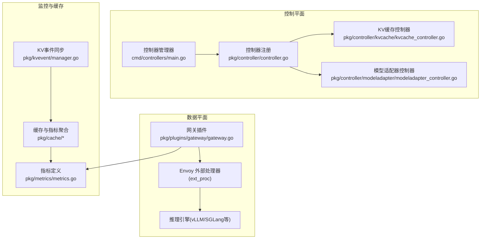
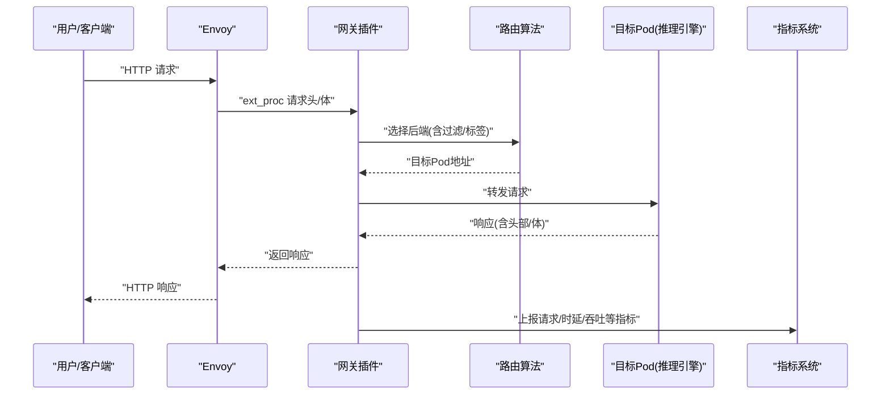
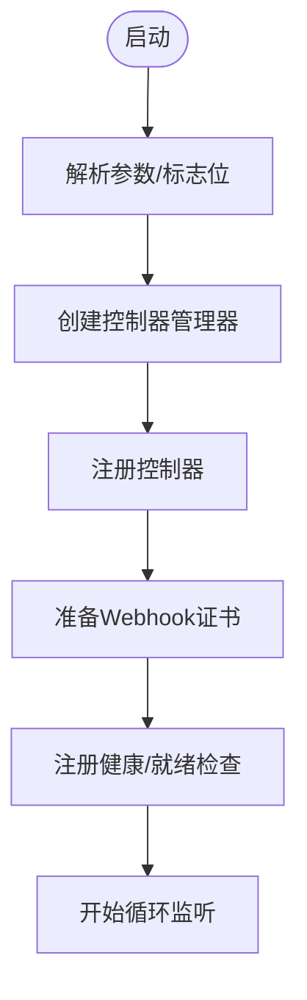
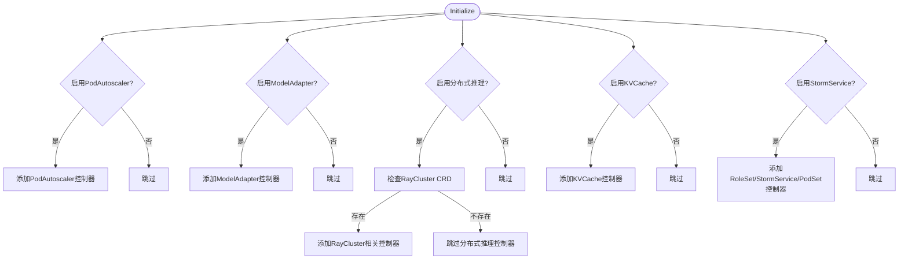
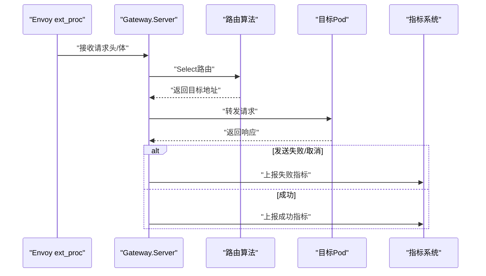
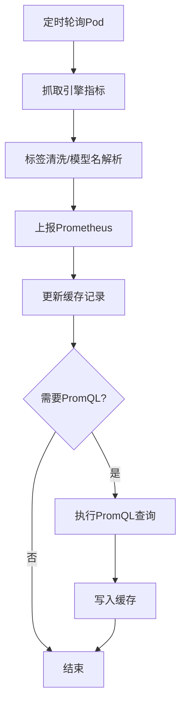
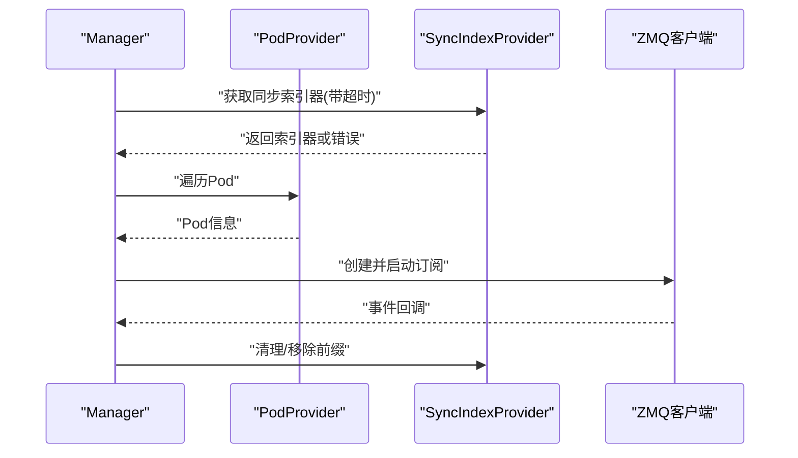
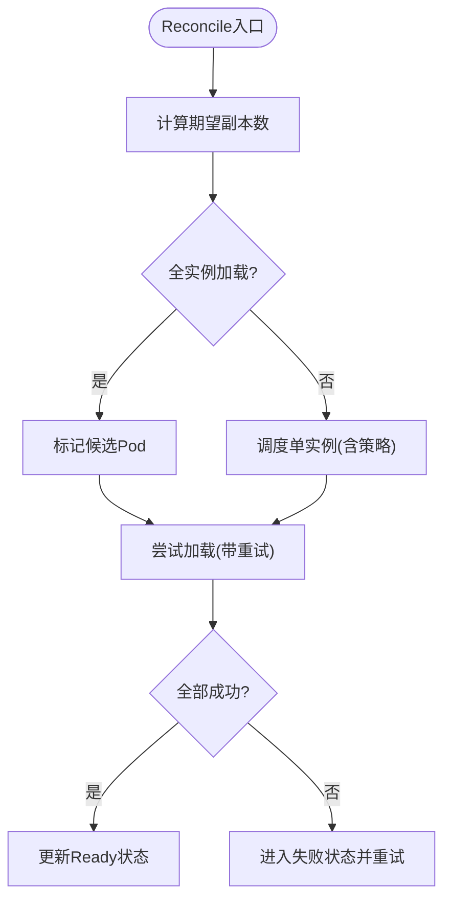
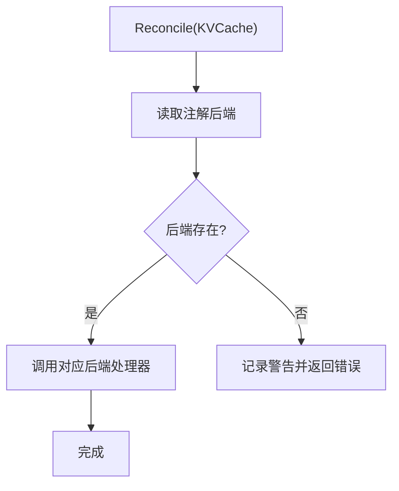
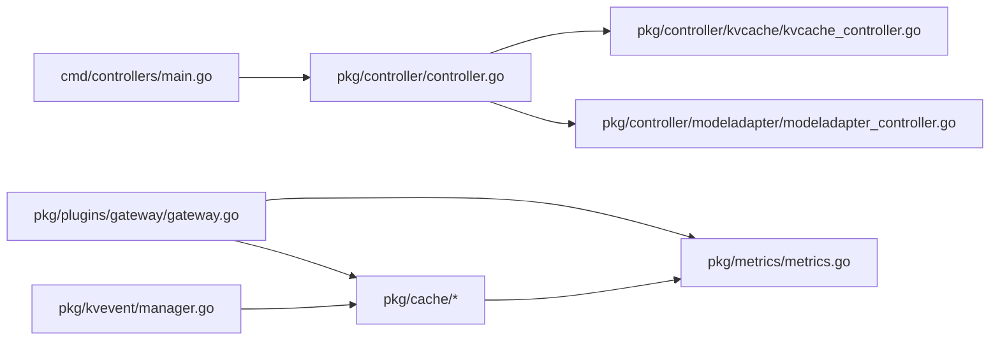

# 故障排除与常见问题

<cite>
**本文引用的文件**   
- [README.md](file://README.md)
- [main.go](file://cmd/controllers/main.go)
- [controller.go](file://pkg/controller/controller.go)
- [gateway.go](file://pkg/plugins/gateway/gateway.go)
- [metrics.go](file://pkg/metrics/metrics.go)
- [errors.go](file://pkg/cache/errors.go)
- [kv_event_sync.go](file://pkg/constants/kv_event_sync.go)
- [errors.go](file://pkg/kvevent/errors.go)
- [kvcache_controller.go](file://pkg/controller/kvcache/kvcache_controller.go)
- [modeladapter_controller.go](file://pkg/controller/modeladapter/modeladapter_controller.go)
- [cache_api.go](file://pkg/cache/cache_api.go)
- [cache_metrics.go](file://pkg/cache/cache_metrics.go)
- [manager.go](file://pkg/kvevent/manager.go)
- [run-local.sh](file://deployment/local/run-local.sh)
- [start.sh](file://deployment/standalone/start.sh)
</cite>

## 目录
1. [简介](#简介)
2. [项目结构](#项目结构)
3. [核心组件](#核心组件)
4. [架构总览](#架构总览)
5. [详细组件分析](#详细组件分析)
6. [依赖关系分析](#依赖关系分析)
7. [性能考虑](#性能考虑)
8. [故障排除指南](#故障排除指南)
9. [结论](#结论)
10. [附录](#附录)

## 简介
本文件面向AIBrix在生产与开发环境中的故障排除与常见问题，覆盖控制器异常、网关路由失败、缓存同步错误、性能瓶颈等典型问题的诊断与解决路径。文档同时提供调试技巧（日志分析、指标监控、性能分析）、故障预防与监控告警最佳实践（健康检查、自动恢复、容量规划），以及错误代码说明与常见场景分析，帮助用户快速定位并解决问题。

## 项目结构
AIBrix采用云原生架构，核心由控制平面（控制器管理器）与数据平面（网关插件、Envoy、推理引擎）组成。控制平面负责资源编排与状态收敛；数据平面负责流量接入、路由、限流与指标采集。

图示来源
- [main.go:112-360](file://cmd/controllers/main.go#L112-L360)
- [controller.go:48-130](file://pkg/controller/controller.go#L48-L130)
- [gateway.go:62-121](file://pkg/plugins/gateway/gateway.go#L62-L121)
- [metrics.go:19-100](file://pkg/metrics/metrics.go#L19-L100)
- [cache_metrics.go:166-182](file://pkg/cache/cache_metrics.go#L166-L182)
- [manager.go:55-69](file://pkg/kvevent/manager.go#L55-L69)

章节来源
- [README.md:1-90](file://README.md#L1-L90)
- [main.go:112-360](file://cmd/controllers/main.go#L112-L360)
- [controller.go:48-130](file://pkg/controller/controller.go#L48-L130)

## 核心组件
- 控制器管理器：负责启动控制器、健康探针、指标端口、Webhook证书轮换与领导者选举。
- 控制器注册：按特性开关动态注册控制器，支持CRD存在性检测与跳过。
- 网关插件：基于Envoy外部处理器实现请求头/体处理、路由选择、速率限制、错误处理与指标上报。
- 指标系统：统一的指标定义与查询接口，支持引擎原始指标与PromQL查询指标。
- 缓存与指标聚合：从引擎拉取指标、标签清洗、速率计算、PromQL补充与订阅分发。
- KV事件同步：通过ZMQ订阅vLLM前缀缓存事件，实现跨实例缓存共享与一致性。

章节来源
- [main.go:112-360](file://cmd/controllers/main.go#L112-L360)
- [controller.go:48-130](file://pkg/controller/controller.go#L48-L130)
- [gateway.go:62-121](file://pkg/plugins/gateway/gateway.go#L62-L121)
- [metrics.go:102-796](file://pkg/metrics/metrics.go#L102-L796)
- [cache_metrics.go:166-581](file://pkg/cache/cache_metrics.go#L166-L581)
- [manager.go:36-131](file://pkg/kvevent/manager.go#L36-L131)

## 架构总览
下图展示从客户端到推理引擎的关键链路与故障点：

图示来源
- [gateway.go:333-360](file://pkg/plugins/gateway/gateway.go#L333-L360)
- [gateway.go:238-303](file://pkg/plugins/gateway/gateway.go#L238-L303)
- [metrics.go:19-100](file://pkg/metrics/metrics.go#L19-L100)

## 详细组件分析

### 控制器管理器与健康检查
- 启动参数：指标端口、健康探针端口、领导者选举、HTTP/2禁用、K8s API限速与突发、Webhook TLS配置。
- 健康检查：/healthz与/readyz，readyz需等待Webhook证书就绪。
- 领导者选举：可选，避免多副本冲突。
- 日志：klog初始化，便于问题定位。

图示来源
- [main.go:112-360](file://cmd/controllers/main.go#L112-L360)

章节来源
- [main.go:112-360](file://cmd/controllers/main.go#L112-L360)

### 控制器注册与CRD检测
- 动态注册：根据特性开关注册控制器。
- CRD检测：对可选的KubeRay CRD进行存在性检查，不存在则跳过对应控制器。
- 权限与RBAC：控制器声明了所需RBAC权限。

图示来源
- [controller.go:48-130](file://pkg/controller/controller.go#L48-L130)

章节来源
- [controller.go:48-130](file://pkg/controller/controller.go#L48-L130)

### 网关插件：路由、限流与错误处理
- 路由选择：根据路由上下文与标签过滤选择可用Pod。
- 限流：支持全局账户级与模型级限流（可选Redis）。
- 错误处理：区分客户端取消、服务端关闭、gRPC错误、发送失败等场景，分别上报不同指标。
- HTTP服务：/metrics与/v1/models列表。
- HTTPRoute校验：在非P/D路由算法时校验HTTPRoute状态。

图示来源
- [gateway.go:123-156](file://pkg/plugins/gateway/gateway.go#L123-L156)
- [gateway.go:333-360](file://pkg/plugins/gateway/gateway.go#L333-L360)
- [gateway.go:464-507](file://pkg/plugins/gateway/gateway.go#L464-L507)

章节来源
- [gateway.go:62-121](file://pkg/plugins/gateway/gateway.go#L62-L121)
- [gateway.go:362-397](file://pkg/plugins/gateway/gateway.go#L362-L397)
- [gateway.go:464-507](file://pkg/plugins/gateway/gateway.go#L464-L507)

### 指标系统与缓存聚合
- 指标定义：统一的指标名、类型、作用域与映射关系。
- 引擎指标：从引擎HTTP端口抓取原始指标，进行标签清洗与速率计算。
- Prometheus查询：对部分指标通过PromQL查询补充，支持并发队列与超时控制。
- 订阅分发：支持多个指标订阅者。

图示来源
- [cache_metrics.go:242-351](file://pkg/cache/cache_metrics.go#L242-L351)
- [cache_metrics.go:353-420](file://pkg/cache/cache_metrics.go#L353-L420)
- [metrics.go:102-796](file://pkg/metrics/metrics.go#L102-L796)

章节来源
- [metrics.go:19-100](file://pkg/metrics/metrics.go#L19-L100)
- [cache_metrics.go:166-581](file://pkg/cache/cache_metrics.go#L166-L581)
- [cache_api.go:25-170](file://pkg/cache/cache_api.go#L25-L170)

### KV事件同步与ZMQ客户端
- 启用条件：需开启KV事件同步且使用远程分词器。
- 初始化：等待同步索引器就绪，批量订阅现有Pod。
- 生命周期：新增/更新/删除Pod时动态订阅/退订，并清理索引。
- 错误分类：索引器未初始化、Pod未找到、管理器已停止、ZMQ未支持等。

图示来源
- [manager.go:71-131](file://pkg/kvevent/manager.go#L71-L131)
- [manager.go:159-257](file://pkg/kvevent/manager.go#L159-L257)
- [kv_event_sync.go:22-79](file://pkg/constants/kv_event_sync.go#L22-L79)

章节来源
- [manager.go:36-131](file://pkg/kvevent/manager.go#L36-L131)
- [manager.go:159-257](file://pkg/kvevent/manager.go#L159-L257)
- [kv_event_sync.go:19-79](file://pkg/constants/kv_event_sync.go#L19-L79)
- [errors.go:25-46](file://pkg/kvevent/errors.go#L25-L46)

### 模型适配器控制器：加载与重试
- 加载模式：单实例或全实例加载，支持调度策略。
- 重试机制：指数回退、最大重试次数、注解跟踪重试状态。
- 可靠性：Pod就绪判断、稳定性窗口、失败状态保留以便观察。
- 卸载：删除时尽力卸载适配器，清理终结器。

图示来源
- [modeladapter_controller.go:581-618](file://pkg/controller/modeladapter/modeladapter_controller.go#L581-L618)
- [modeladapter_controller.go:728-893](file://pkg/controller/modeladapter/modeladapter_controller.go#L728-L893)
- [modeladapter_controller.go:1055-1098](file://pkg/controller/modeladapter/modeladapter_controller.go#L1055-L1098)

章节来源
- [modeladapter_controller.go:581-618](file://pkg/controller/modeladapter/modeladapter_controller.go#L581-L618)
- [modeladapter_controller.go:728-893](file://pkg/controller/modeladapter/modeladapter_controller.go#L728-L893)
- [modeladapter_controller.go:1055-1098](file://pkg/controller/modeladapter/modeladapter_controller.go#L1055-L1098)

### KV缓存控制器：后端选择与资源管理
- 后端选择：根据注解选择Vineyard/HPKV/Infinistore等后端。
- 资源管理：管理Service/Deployment/状态，监听带标识符标签的Pod事件。
- 容错：不支持的后端会记录警告并返回错误。

图示来源
- [kvcache_controller.go:160-181](file://pkg/controller/kvcache/kvcache_controller.go#L160-L181)
- [kvcache_controller.go:183-194](file://pkg/controller/kvcache/kvcache_controller.go#L183-L194)

章节来源
- [kvcache_controller.go:133-194](file://pkg/controller/kvcache/kvcache_controller.go#L133-L194)

## 依赖关系分析
- 控制器管理器依赖控制器注册模块，控制器注册模块按特性开关决定是否注册特定控制器。
- 网关插件依赖路由算法、速率限制器、缓存与指标系统。
- 指标系统依赖引擎指标抓取器与Prometheus API。
- KV事件同步依赖Pod提供者、同步索引提供者与ZMQ客户端。

图示来源
- [main.go:112-360](file://cmd/controllers/main.go#L112-L360)
- [controller.go:48-130](file://pkg/controller/controller.go#L48-L130)
- [gateway.go:62-121](file://pkg/plugins/gateway/gateway.go#L62-L121)
- [cache_metrics.go:166-182](file://pkg/cache/cache_metrics.go#L166-L182)
- [manager.go:55-69](file://pkg/kvevent/manager.go#L55-L69)

章节来源
- [main.go:112-360](file://cmd/controllers/main.go#L112-L360)
- [controller.go:48-130](file://pkg/controller/controller.go#L48-L130)
- [gateway.go:62-121](file://pkg/plugins/gateway/gateway.go#L62-L121)
- [cache_metrics.go:166-182](file://pkg/cache/cache_metrics.go#L166-L182)
- [manager.go:55-69](file://pkg/kvevent/manager.go#L55-L69)

## 性能考虑
- 指标刷新：Pod指标刷新间隔、PromQL查询间隔与超时可通过环境变量调整，避免高负载时阻塞。
- 指标聚合：速率计算器维护历史快照，限制最大年龄与数量，防止内存膨胀。
- 并发与背压：指标工作池采用非阻塞发送，饱和时跳过本轮更新，保证主循环不被阻塞。
- 路由与限流：路由算法与限流器可按需启用，减少额外开销。

章节来源
- [cache_metrics.go:121-124](file://pkg/cache/cache_metrics.go#L121-L124)
- [cache_metrics.go:153-164](file://pkg/cache/cache_metrics.go#L153-L164)
- [cache_metrics.go:242-261](file://pkg/cache/cache_metrics.go#L242-L261)

## 故障排除指南

### 一、控制器异常
- 症状
  - 控制器未启动或频繁重启
  - CRD缺失导致控制器跳过
  - Webhook证书未就绪导致/readyz失败
- 排查步骤
  - 查看控制器管理器日志与/readyz输出
  - 确认CRD是否存在（如RayCluster）
  - 检查Webhook证书生成流程与命名空间
- 解决方案
  - 安装缺失的CRD或禁用对应控制器
  - 等待证书生成完成或检查证书相关RBAC
  - 调整领导者选举与健康探针参数

章节来源
- [controller.go:63-82](file://pkg/controller/controller.go#L63-L82)
- [main.go:294-312](file://cmd/controllers/main.go#L294-L312)

### 二、网关路由失败
- 症状
  - HTTPRoute状态不为Accepted或引用未解析
  - 无可用Pod或路由算法返回空
  - 发送响应失败或客户端取消
- 排查步骤
  - 检查HTTPRoute状态与条件
  - 过滤标签选择器是否正确
  - 观察网关指标中失败计数与错误码
- 解决方案
  - 修复HTTPRoute配置使其被接受
  - 调整标签选择器或外部过滤表达式
  - 优化路由算法或增加后端Pod

章节来源
- [gateway.go:362-397](file://pkg/plugins/gateway/gateway.go#L362-L397)
- [gateway.go:333-360](file://pkg/plugins/gateway/gateway.go#L333-L360)
- [gateway.go:316-331](file://pkg/plugins/gateway/gateway.go#L316-L331)

### 三、缓存同步错误（KV事件）
- 症状
  - KV事件同步未启用或被禁用
  - 同步索引器未初始化
  - ZMQ客户端连接失败或未支持
- 排查步骤
  - 检查KV事件同步与远程分词器相关环境变量
  - 等待同步索引器就绪或查看初始化日志
  - 确认构建包含ZMQ支持
- 解决方案
  - 启用KV事件同步并配置远程分词器
  - 等待索引器初始化完成
  - 使用支持ZMQ的构建或启用相应功能

章节来源
- [kv_event_sync.go:34-63](file://pkg/constants/kv_event_sync.go#L34-L63)
- [manager.go:71-105](file://pkg/kvevent/manager.go#L71-L105)
- [errors.go:25-46](file://pkg/kvevent/errors.go#L25-L46)

### 四、性能瓶颈
- 症状
  - 指标抓取延迟或失败
  - Prometheus查询超时或告警
  - 指标聚合导致CPU/内存上升
- 排查步骤
  - 检查Pod指标刷新间隔与PromQL查询间隔
  - 观察速率计算器历史长度与最大年龄
  - 分析工作池饱和与丢弃情况
- 解决方案
  - 调整刷新与查询间隔/超时
  - 限制最大历史条目与年龄
  - 扩展工作池或优化查询

章节来源
- [cache_metrics.go:121-124](file://pkg/cache/cache_metrics.go#L121-L124)
- [cache_metrics.go:153-164](file://pkg/cache/cache_metrics.go#L153-L164)
- [cache_metrics.go:242-261](file://pkg/cache/cache_metrics.go#L242-L261)

### 五、模型适配器加载失败
- 症状
  - 适配器加载重试过多
  - Pod未就绪或不稳定
  - 注解跟踪重试状态
- 排查步骤
  - 查看重试计数与上次重试时间注解
  - 检查Pod就绪窗口与稳定性
  - 观察可调度候选数量
- 解决方案
  - 等待Pod稳定后再调度
  - 减少重试上限或调整回退策略
  - 清理重试注解以重置状态

章节来源
- [modeladapter_controller.go:1055-1098](file://pkg/controller/modeladapter/modeladapter_controller.go#L1055-L1098)
- [modeladapter_controller.go:1128-1176](file://pkg/controller/modeladapter/modeladapter_controller.go#L1128-L1176)
- [modeladapter_controller.go:1029-1048](file://pkg/controller/modeladapter/modeladapter_controller.go#L1029-L1048)

### 六、本地与单机部署问题
- 本地模式
  - 检查gateway-plugins与Envoy二进制是否存在
  - 等待gRPC与HTTP端口就绪
  - 查看日志目录中的gateway-plugin.log与envoy.log
- 单机Compose模式
  - 确认Docker与Docker Compose可用
  - 等待各服务健康检查通过
  - 在P/D模式下等待预填充/解码引擎就绪

章节来源
- [run-local.sh:34-105](file://deployment/local/run-local.sh#L34-L105)
- [run-local.sh:107-140](file://deployment/local/run-local.sh#L107-L140)
- [start.sh:133-170](file://deployment/standalone/start.sh#L133-L170)
- [start.sh:275-321](file://deployment/standalone/start.sh#L275-L321)

### 七、调试技巧与工具
- 日志分析
  - 控制器管理器使用klog，建议设置合适的-v等级
  - 网关插件记录请求ID与错误原因
- 指标监控
  - 使用/readyz与/healthz确认健康状态
  - 通过Prometheus查询关键指标（如请求时延、吞吐、缓存命中率）
- 性能分析
  - 关注速率计算器与工作池饱和情况
  - 分析路由算法与限流器对性能的影响

章节来源
- [main.go:160-167](file://cmd/controllers/main.go#L160-L167)
- [gateway.go:129-131](file://pkg/plugins/gateway/gateway.go#L129-L131)
- [cache_metrics.go:242-261](file://pkg/cache/cache_metrics.go#L242-L261)

### 八、错误代码与场景说明
- 缓存错误
  - 指标未找到：检查Pod与指标名称是否匹配
  - 缺失Profile：确认模型配置与Profile一致
- KV事件错误
  - 索引器未初始化：等待初始化完成
  - Pod未找到：检查Pod生命周期与标签
  - 管理器已停止：检查停止流程
  - ZMQ未支持：使用支持ZMQ的构建

章节来源
- [errors.go:20-58](file://pkg/cache/errors.go#L20-L58)
- [errors.go:25-46](file://pkg/kvevent/errors.go#L25-L46)

### 九、故障预防与监控告警最佳实践
- 健康检查
  - 控制器：/healthz与/readyz
  - 网关：/metrics与/healthz
  - 推理引擎：/health
- 自动恢复
  - 控制器领导者选举与证书轮换
  - 模型适配器加载失败自动重试
- 容量规划
  - 指标刷新与查询间隔合理配置
  - 路由算法与限流策略匹配业务峰值

章节来源
- [main.go:294-312](file://cmd/controllers/main.go#L294-L312)
- [gateway.go:464-472](file://pkg/plugins/gateway/gateway.go#L464-L472)
- [cache_metrics.go:121-124](file://pkg/cache/cache_metrics.go#L121-L124)
- [modeladapter_controller.go:1218-1235](file://pkg/controller/modeladapter/modeladapter_controller.go#L1218-L1235)

## 结论
通过理解AIBrix的控制平面与数据平面交互、指标体系与缓存聚合机制，结合本文提供的故障排除步骤与最佳实践，可以系统化地定位与解决部署与运行中的典型问题。建议在生产环境中启用健康检查、自动恢复与合理的容量规划，并持续监控关键指标以预防性能与稳定性风险。

## 附录
- 快速测试
  - 本地模式：访问 http://localhost:10080/v1/chat/completions
  - 单机模式：访问 http://localhost:80/v1/chat/completions
- 常用端点
  - 网关指标：http://localhost:8080/metrics
  - Envoy管理：http://localhost:9901
  - vLLM健康：http://localhost:8000/health

章节来源
- [run-local.sh:148-154](file://deployment/local/run-local.sh#L148-L154)
- [start.sh:341-354](file://deployment/standalone/start.sh#L341-L354)