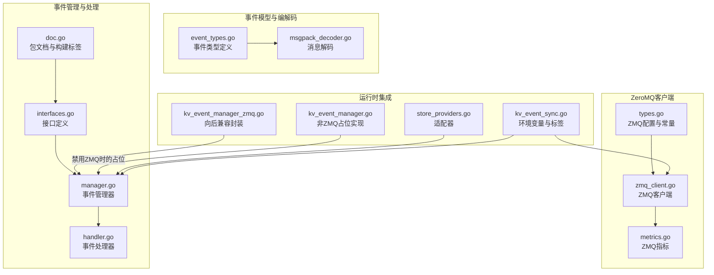
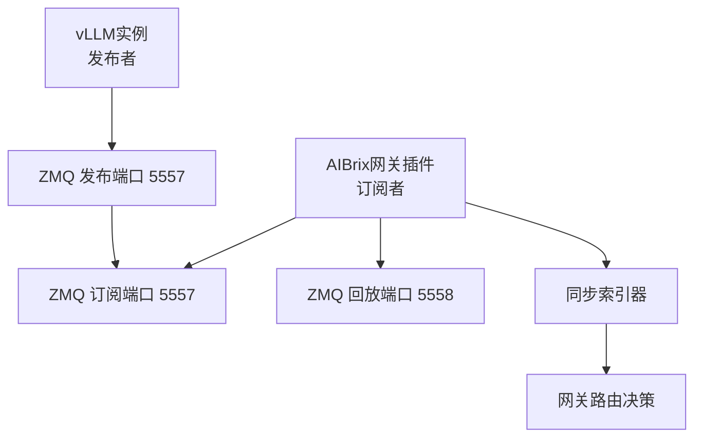
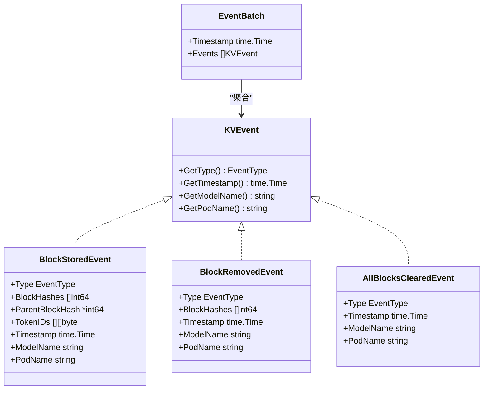
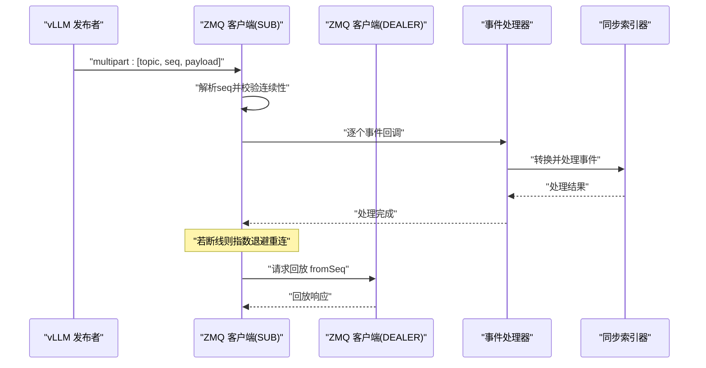
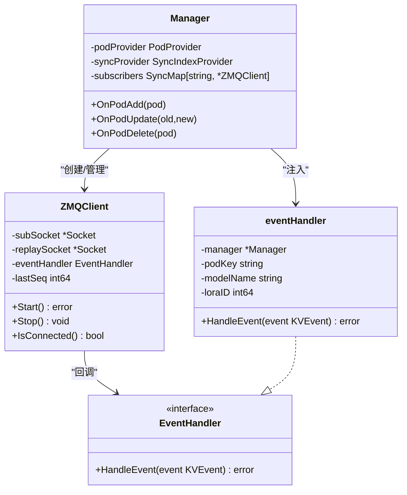
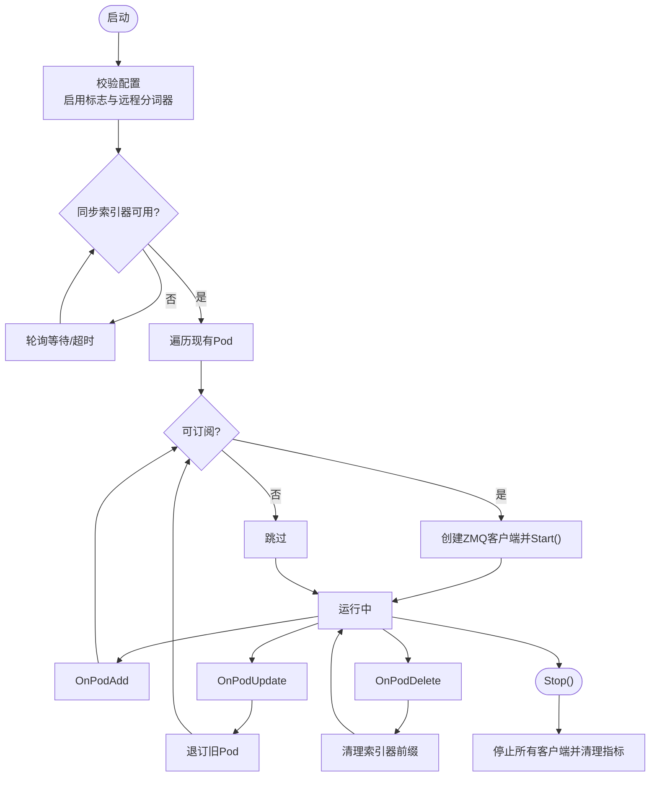
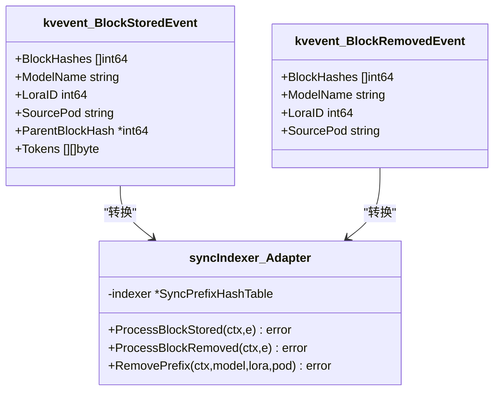
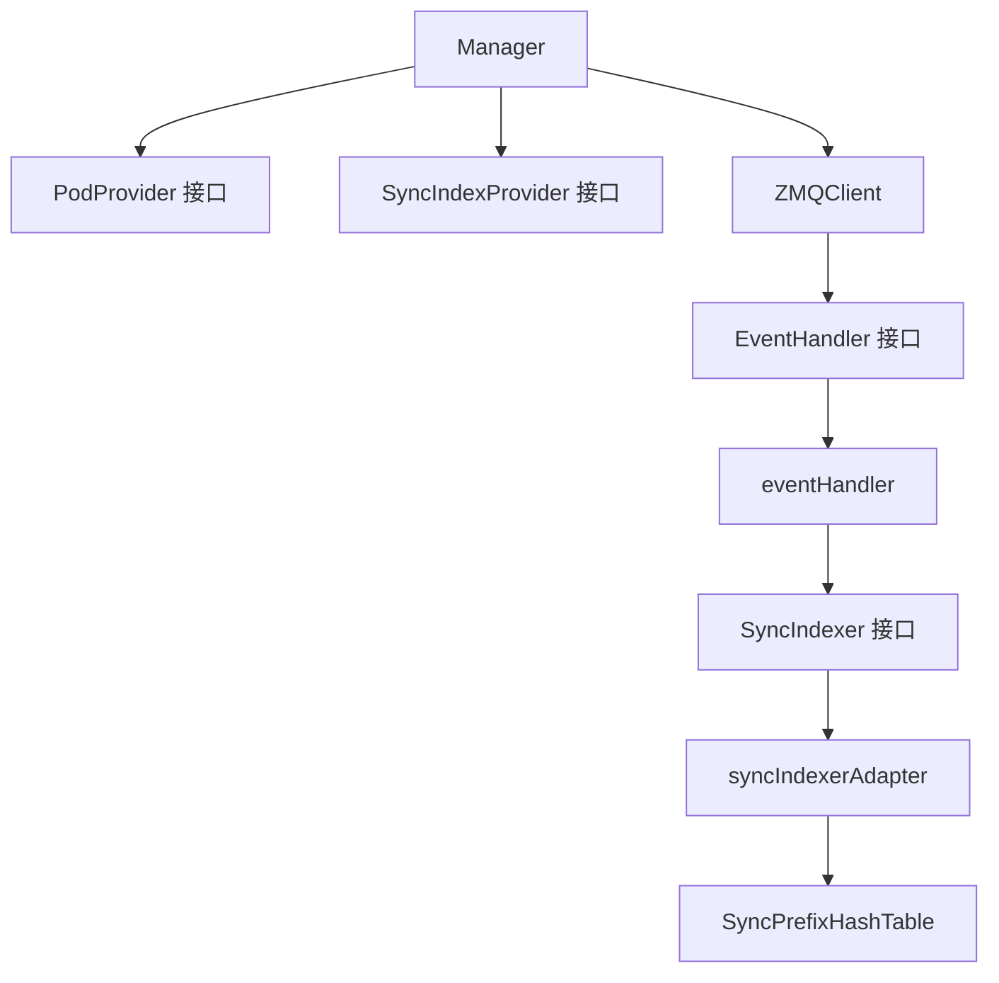

# 事件驱动架构

<cite>
**本文引用的文件**
- [pkg/cache/kvcache/event_types.go](file://pkg/cache/kvcache/event_types.go)
- [pkg/cache/kvcache/types.go](file://pkg/cache/kvcache/types.go)
- [pkg/cache/kvcache/zmq_client.go](file://pkg/cache/kvcache/zmq_client.go)
- [pkg/cache/kvcache/metrics.go](file://pkg/cache/kvcache/metrics.go)
- [pkg/cache/kvcache/msgpack_decoder.go](file://pkg/cache/kvcache/msgpack_decoder.go)
- [pkg/constants/kv_event_sync.go](file://pkg/constants/kv_event_sync.go)
- [pkg/kvevent/doc.go](file://pkg/kvevent/doc.go)
- [pkg/kvevent/interfaces.go](file://pkg/kvevent/interfaces.go)
- [pkg/kvevent/manager.go](file://pkg/kvevent/manager.go)
- [pkg/kvevent/handler.go](file://pkg/kvevent/handler.go)
- [pkg/cache/kv_event_manager_zmq.go](file://pkg/cache/kv_event_manager_zmq.go)
- [pkg/cache/kv_event_manager.go](file://pkg/cache/kv_event_manager.go)
- [pkg/cache/store_providers.go](file://pkg/cache/store_providers.go)
- [docs/source/features/kv-event-sync.rst](file://docs/source/features/kv-event-sync.rst)
- [pkg/kvevent/integration_test.go](file://pkg/kvevent/integration_test.go)
- [pkg/kvevent/test_helpers.go](file://pkg/kvevent/test_helpers.go)
</cite>

## 目录
1. [简介](#简介)
2. [项目结构](#项目结构)
3. [核心组件](#核心组件)
4. [架构总览](#架构总览)
5. [详细组件分析](#详细组件分析)
6. [依赖分析](#依赖分析)
7. [性能考虑](#性能考虑)
8. [故障排查指南](#故障排查指南)
9. [结论](#结论)
10. [附录](#附录)

## 简介
本文件面向AIBrix事件驱动架构，聚焦KV缓存事件同步子系统。该子系统通过ZeroMQ实现vLLM实例与AIBrix网关插件之间的事件发布/订阅与回放，以提升前缀缓存命中率并支持智能路由决策。文档从事件模型、ZeroMQ在事件同步中的角色、事件处理器设计模式出发，结合序列图与流程图，帮助开发者理解异步事件处理的工作原理与最佳实践。

## 项目结构
围绕事件驱动架构的关键目录与文件如下：
- 事件模型与编解码：pkg/cache/kvcache/event_types.go、pkg/cache/kvcache/msgpack_decoder.go
- ZeroMQ客户端与配置：pkg/cache/kvcache/zmq_client.go、pkg/cache/kvcache/types.go、pkg/cache/kvcache/metrics.go
- 事件管理器与处理器：pkg/kvevent/manager.go、pkg/kvevent/handler.go、pkg/kvevent/interfaces.go、pkg/kvevent/doc.go
- 配置常量与环境变量：pkg/constants/kv_event_sync.go
- 向后兼容封装：pkg/cache/kv_event_manager_zmq.go、pkg/cache/kv_event_manager.go
- 类型适配器（Anti-Corruption Layer）：pkg/cache/store_providers.go
- 文档与集成测试：docs/source/features/kv-event-sync.rst、pkg/kvevent/integration_test.go、pkg/kvevent/test_helpers.go

图表来源
- [pkg/cache/kvcache/event_types.go:1-178](file://pkg/cache/kvcache/event_types.go#L1-L178)
- [pkg/cache/kvcache/msgpack_decoder.go:58-118](file://pkg/cache/kvcache/msgpack_decoder.go#L58-L118)
- [pkg/cache/kvcache/types.go:1-93](file://pkg/cache/kvcache/types.go#L1-L93)
- [pkg/cache/kvcache/zmq_client.go:1-426](file://pkg/cache/kvcache/zmq_client.go#L1-L426)
- [pkg/cache/kvcache/metrics.go:283-425](file://pkg/cache/kvcache/metrics.go#L283-L425)
- [pkg/kvevent/doc.go:15-50](file://pkg/kvevent/doc.go#L15-L50)
- [pkg/kvevent/interfaces.go:1-90](file://pkg/kvevent/interfaces.go#L1-L90)
- [pkg/kvevent/manager.go:1-345](file://pkg/kvevent/manager.go#L1-L345)
- [pkg/kvevent/handler.go:1-142](file://pkg/kvevent/handler.go#L1-L142)
- [pkg/cache/kv_event_manager_zmq.go:1-77](file://pkg/cache/kv_event_manager_zmq.go#L1-L77)
- [pkg/cache/kv_event_manager.go:1-71](file://pkg/cache/kv_event_manager.go#L1-L71)
- [pkg/cache/store_providers.go:154-200](file://pkg/cache/store_providers.go#L154-L200)
- [pkg/constants/kv_event_sync.go:1-79](file://pkg/constants/kv_event_sync.go#L1-L79)

章节来源
- [pkg/cache/kvcache/event_types.go:1-178](file://pkg/cache/kvcache/event_types.go#L1-L178)
- [pkg/cache/kvcache/types.go:1-93](file://pkg/cache/kvcache/types.go#L1-L93)
- [pkg/cache/kvcache/zmq_client.go:1-426](file://pkg/cache/kvcache/zmq_client.go#L1-L426)
- [pkg/kvevent/manager.go:1-345](file://pkg/kvevent/manager.go#L1-L345)
- [pkg/kvevent/handler.go:1-142](file://pkg/kvevent/handler.go#L1-L142)
- [pkg/constants/kv_event_sync.go:1-79](file://pkg/constants/kv_event_sync.go#L1-L79)

## 核心组件
- 事件类型与批次：定义BlockStored、BlockRemoved、AllBlocksCleared等事件类型，并以EventBatch承载批量事件，包含时间戳与事件列表。
- ZeroMQ客户端：负责SUB/DEALER套接字连接、订阅、回放请求、序列号跟踪、错误与重连策略、事件解码与分发。
- 事件处理器：接收来自ZeroMQ客户端的事件，转换为同步索引器可识别的事件类型，调用同步索引器进行处理。
- 事件管理器：基于Kubernetes Pod信息动态订阅/退订vLLM事件源，协调ZMQ客户端生命周期与错误恢复。
- 同步索引器适配器：作为Anti-Corruption Layer，桥接kvevent事件类型与现有同步前缀缓存索引器，避免循环依赖。
- 配置与标签：通过环境变量与Pod标签控制是否启用事件同步、远程分词器要求、LoRA标识等。

章节来源
- [pkg/cache/kvcache/event_types.go:45-178](file://pkg/cache/kvcache/event_types.go#L45-L178)
- [pkg/cache/kvcache/zmq_client.go:30-426](file://pkg/cache/kvcache/zmq_client.go#L30-L426)
- [pkg/kvevent/handler.go:30-142](file://pkg/kvevent/handler.go#L30-L142)
- [pkg/kvevent/manager.go:36-345](file://pkg/kvevent/manager.go#L36-L345)
- [pkg/cache/store_providers.go:154-200](file://pkg/cache/store_providers.go#L154-L200)
- [pkg/constants/kv_event_sync.go:21-79](file://pkg/constants/kv_event_sync.go#L21-L79)

## 架构总览
事件驱动架构由以下层次组成：
- 事件产生源：vLLM实例通过ZMQ发布KV缓存事件。
- 事件传播：AIBrix网关插件使用ZMQ SUB套接字订阅事件，DEALER套接字发起回放请求。
- 事件处理：事件被解码为统一的KVEvent模型，交由事件处理器转换并写入同步索引器。
- 路由决策：同步索引器维护全局前缀缓存状态，供网关路由算法使用。

图表来源
- [docs/source/features/kv-event-sync.rst:13-28](file://docs/source/features/kv-event-sync.rst#L13-L28)
- [pkg/cache/kvcache/types.go:40-69](file://pkg/cache/kvcache/types.go#L40-L69)
- [pkg/cache/kvcache/zmq_client.go:72-160](file://pkg/cache/kvcache/zmq_client.go#L72-L160)

## 详细组件分析

### 事件模型与编解码
- 事件类型：BlockStored、BlockRemoved、AllBlocksCleared，均实现KVEvent接口，包含类型、时间戳、模型名、Pod名等元数据。
- 批次模型：EventBatch以时间戳为单位聚合多个事件，便于一致性处理。
- 编解码：msgpack数组编码，首元素为事件类型字符串；解码时根据类型解析字段，应用批次元数据（模型名、Pod键）。

图表来源
- [pkg/cache/kvcache/event_types.go:63-178](file://pkg/cache/kvcache/event_types.go#L63-L178)

章节来源
- [pkg/cache/kvcache/event_types.go:45-178](file://pkg/cache/kvcache/event_types.go#L45-L178)
- [pkg/cache/kvcache/msgpack_decoder.go:58-118](file://pkg/cache/kvcache/msgpack_decoder.go#L58-L118)

### ZeroMQ在事件同步中的作用
- 连接与订阅：客户端创建SUB套接字连接到vLLM发布端口，设置订阅主题为空以接收全部消息；同时创建DEALER套接字用于回放请求。
- 消息格式：multipart消息包含topic、sequence、payload三部分；sequence为大端序8字节整数，用于事件顺序与丢失检测。
- 回放机制：启动或重连后请求从lastSeq+1开始的事件回放，确保状态一致。
- 重连与退避：断线后按指数退避策略重连，最大间隔受限；成功后自动请求回放。
- 指标监控：记录连接/断开次数、重连尝试、事件收发总量、处理延迟、丢失事件数、回放请求/成功/失败、错误计数等。

图表来源
- [pkg/cache/kvcache/zmq_client.go:197-367](file://pkg/cache/kvcache/zmq_client.go#L197-L367)
- [pkg/cache/kvcache/zmq_client.go:369-404](file://pkg/cache/kvcache/zmq_client.go#L369-L404)
- [pkg/kvevent/handler.go:38-142](file://pkg/kvevent/handler.go#L38-L142)

章节来源
- [pkg/cache/kvcache/zmq_client.go:72-160](file://pkg/cache/kvcache/zmq_client.go#L72-L160)
- [pkg/cache/kvcache/zmq_client.go:197-367](file://pkg/cache/kvcache/zmq_client.go#L197-L367)
- [pkg/cache/kvcache/metrics.go:283-425](file://pkg/cache/kvcache/metrics.go#L283-L425)

### 事件处理器设计模式
- 事件监听器：ZMQ客户端作为底层监听器，负责接收与解码消息、维护序列号、触发事件回调。
- 事件处理器：eventHandler实现kvcache.EventHandler接口，接收KVEvent，转换为同步索引器事件类型，调用GetSyncIndexer处理。
- 事件转发器：Manager作为上层协调者，根据Pod生命周期动态创建/销毁ZMQ客户端，屏蔽底层细节。

图表来源
- [pkg/cache/kvcache/zmq_client.go:30-70](file://pkg/cache/kvcache/zmq_client.go#L30-L70)
- [pkg/kvevent/handler.go:30-36](file://pkg/kvevent/handler.go#L30-L36)
- [pkg/kvevent/manager.go:36-69](file://pkg/kvevent/manager.go#L36-L69)

章节来源
- [pkg/kvevent/handler.go:30-142](file://pkg/kvevent/handler.go#L30-L142)
- [pkg/kvevent/manager.go:280-321](file://pkg/kvevent/manager.go#L280-L321)

### 事件管理器与生命周期
- 启动：检查配置（启用标志与远程分词器要求），等待同步索引器就绪，遍历现有Pod建立订阅。
- 停止：优雅关闭，取消上下文，停止所有订阅者并清理指标。
- 生命周期事件：新增/更新/删除Pod时，根据标签与状态决定订阅/退订；删除时清理索引器前缀。

图表来源
- [pkg/kvevent/manager.go:71-131](file://pkg/kvevent/manager.go#L71-L131)
- [pkg/kvevent/manager.go:159-257](file://pkg/kvevent/manager.go#L159-L257)
- [pkg/kvevent/manager.go:322-335](file://pkg/kvevent/manager.go#L322-L335)

章节来源
- [pkg/kvevent/manager.go:71-131](file://pkg/kvevent/manager.go#L71-L131)
- [pkg/kvevent/manager.go:159-257](file://pkg/kvevent/manager.go#L159-L257)

### 同步索引器适配器
- 作用：将kvevent事件类型转换为现有同步前缀缓存索引器可识别的事件类型，避免包间循环依赖。
- 实现：ProcessBlockStored/ProcessBlockRemoved/RemovePrefix分别映射到对应方法。

图表来源
- [pkg/cache/store_providers.go:154-200](file://pkg/cache/store_providers.go#L154-L200)

章节来源
- [pkg/cache/store_providers.go:154-200](file://pkg/cache/store_providers.go#L154-L200)

### 集成与向后兼容
- 向后兼容封装：KVEventManager在启用ZMQ时委托kvevent.Manager，否则返回占位实现。
- 配置验证：启用KV事件同步需要开启远程分词器且指定远程分词器端点，否则初始化失败。
- 文档与示例：官方文档提供完整的部署步骤、环境变量与标签说明。

章节来源
- [pkg/cache/kv_event_manager_zmq.go:28-77](file://pkg/cache/kv_event_manager_zmq.go#L28-L77)
- [pkg/cache/kv_event_manager.go:28-71](file://pkg/cache/kv_event_manager.go#L28-L71)
- [docs/source/features/kv-event-sync.rst:46-185](file://docs/source/features/kv-event-sync.rst#L46-L185)

## 依赖分析
- 组件耦合与内聚：事件管理器通过接口（PodProvider、SyncIndexProvider）解耦具体实现；ZMQ客户端与事件处理器通过EventHandler接口解耦。
- 外部依赖：ZeroMQ库（SUB/DEALER/ROUTER模式）、Kubernetes API（Pod信息）、同步索引器（Redis等存储）。
- 循环依赖规避：通过syncIndexerAdapter作为Anti-Corruption Layer，避免kvevent与cache包互相依赖。

图表来源
- [pkg/kvevent/manager.go:36-69](file://pkg/kvevent/manager.go#L36-L69)
- [pkg/kvevent/interfaces.go:24-70](file://pkg/kvevent/interfaces.go#L24-L70)
- [pkg/cache/store_providers.go:154-200](file://pkg/cache/store_providers.go#L154-L200)

章节来源
- [pkg/kvevent/manager.go:36-69](file://pkg/kvevent/manager.go#L36-L69)
- [pkg/kvevent/interfaces.go:24-70](file://pkg/kvevent/interfaces.go#L24-L70)
- [pkg/cache/store_providers.go:154-200](file://pkg/cache/store_providers.go#L154-L200)

## 性能考虑
- ZeroMQ参数：默认轮询超时、回放超时、初始/最大重连间隔、指数退避因子；可根据网络延迟调整。
- 指标监控：建议启用ZMQ事件处理延迟、事件总数、丢失事件、回放统计与错误分类指标，辅助容量规划与问题定位。
- 内存与CPU：同步索引器每前缀条目约占用64字节；高负载下ZMQ带宽约1MB/s/实例。
- 最佳实践：优先启用远程分词器保证一致性；生产环境建议专用网络隔离ZMQ流量；合理设置缓冲步数与批大小。

章节来源
- [pkg/cache/kvcache/types.go:40-92](file://pkg/cache/kvcache/types.go#L40-L92)
- [pkg/cache/kvcache/metrics.go:283-425](file://pkg/cache/kvcache/metrics.go#L283-L425)
- [docs/source/features/kv-event-sync.rst:265-326](file://docs/source/features/kv-event-sync.rst#L265-L326)

## 故障排查指南
- 初始化失败：检查启用标志与远程分词器配置，确认环境变量与标签正确。
- 事件未发布：核对vLLM日志与ZMQ端口可达性；验证ZMQ构建支持。
- 连接问题：检查Pod标签、网络策略与端口开放情况；确认ZMQ客户端连接状态与重连指标。
- 处理异常：查看事件解码、事件处理、重连与错误分类指标；关注丢失事件数量。

章节来源
- [pkg/kvevent/manager.go:322-335](file://pkg/kvevent/manager.go#L322-L335)
- [pkg/cache/kvcache/zmq_client.go:222-255](file://pkg/cache/kvcache/zmq_client.go#L222-L255)
- [pkg/cache/kvcache/metrics.go:283-425](file://pkg/cache/kvcache/metrics.go#L283-L425)
- [docs/source/features/kv-event-sync.rst:219-264](file://docs/source/features/kv-event-sync.rst#L219-L264)

## 结论
AIBrix事件驱动架构通过ZeroMQ实现跨vLLM实例的KV缓存事件同步，借助事件管理器与处理器解耦实现细节，配合同步索引器适配器保持架构边界清晰。该方案在保证一致性的同时，提供了可观测性与弹性（重连/回放），适合在生产环境中部署并持续优化。

## 附录
- 环境变量与标签：启用事件同步、远程分词器、回放端点、本地路由器指标等。
- 集成测试：覆盖真实组件的事件处理与适配器转换逻辑，验证完整事件流。

章节来源
- [pkg/constants/kv_event_sync.go:34-79](file://pkg/constants/kv_event_sync.go#L34-L79)
- [pkg/kvevent/integration_test.go:44-236](file://pkg/kvevent/integration_test.go#L44-L236)
- [pkg/kvevent/test_helpers.go:24-33](file://pkg/kvevent/test_helpers.go#L24-L33)