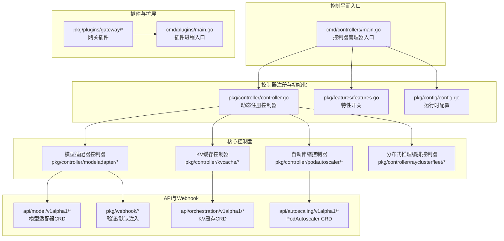
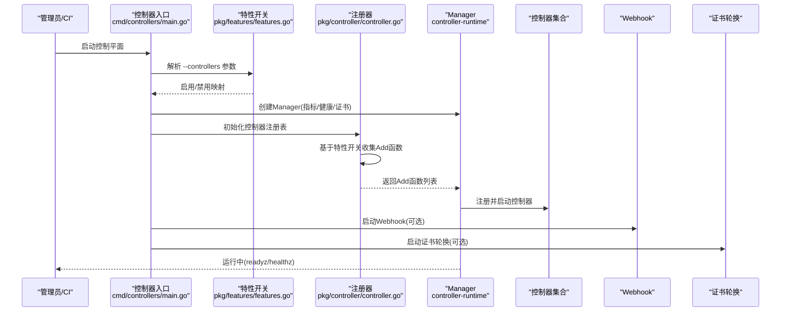
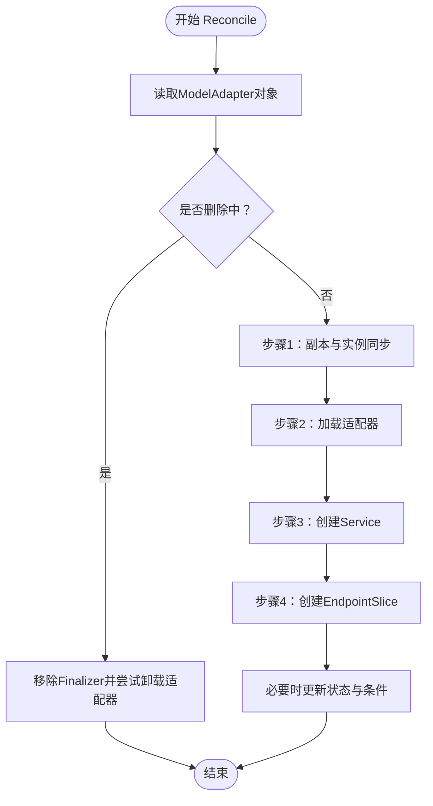
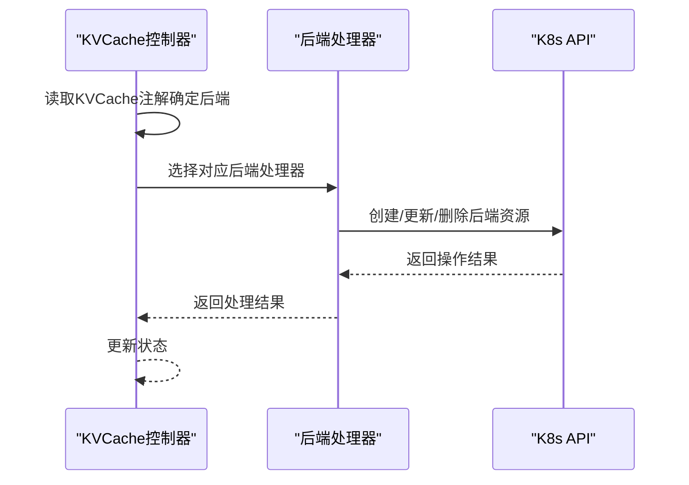
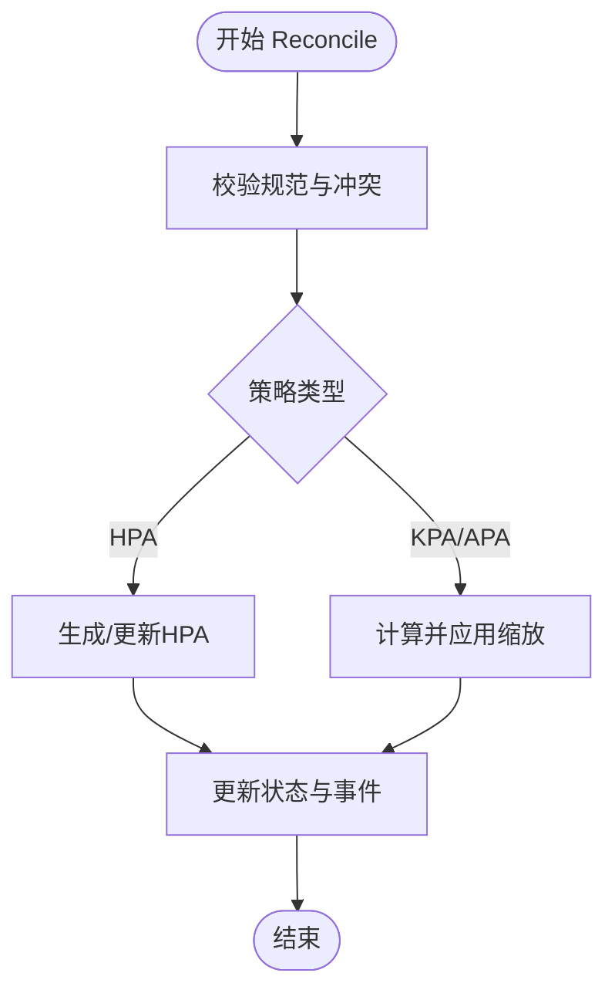
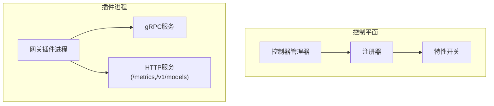
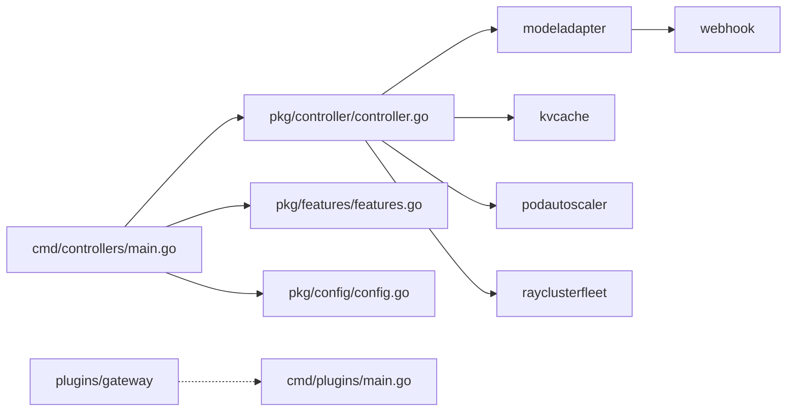

# 控制平面设计

<cite>
**本文引用的文件**
- [cmd/controllers/main.go](file://cmd/controllers/main.go)
- [pkg/controller/controller.go](file://pkg/controller/controller.go)
- [pkg/features/features.go](file://pkg/features/features.go)
- [pkg/config/config.go](file://pkg/config/config.go)
- [pkg/controller/modeladapter/modeladapter_controller.go](file://pkg/controller/modeladapter/modeladapter_controller.go)
- [pkg/controller/kvcache/kvcache_controller.go](file://pkg/controller/kvcache/kvcache_controller.go)
- [pkg/controller/podautoscaler/podautoscaler_controller.go](file://pkg/controller/podautoscaler/podautoscaler_controller.go)
- [pkg/controller/rayclusterfleet/rayclusterfleet_controller.go](file://pkg/controller/rayclusterfleet/rayclusterfleet_controller.go)
- [api/model/v1alpha1/modeladapter_types.go](file://api/model/v1alpha1/modeladapter_types.go)
- [api/orchestration/v1alpha1/kvcache_types.go](file://api/orchestration/v1alpha1/kvcache_types.go)
- [api/autoscaling/v1alpha1/podautoscaler_types.go](file://api/autoscaling/v1alpha1/podautoscaler_types.go)
- [pkg/webhook/modeladapter_webhook.go](file://pkg/webhook/modeladapter_webhook.go)
- [pkg/plugins/gateway/gateway.go](file://pkg/plugins/gateway/gateway.go)
- [cmd/plugins/main.go](file://cmd/plugins/main.go)
</cite>

## 目录
1. [简介](#简介)
2. [项目结构](#项目结构)
3. [核心组件](#核心组件)
4. [架构总览](#架构总览)
5. [详细组件分析](#详细组件分析)
6. [依赖分析](#依赖分析)
7. [性能考虑](#性能考虑)
8. [故障排查指南](#故障排查指南)
9. [结论](#结论)
10. [附录](#附录)

## 简介
本文件面向AIBrix控制平面的设计与实现，系统性阐述控制器管理器的工作原理、控制器注册机制、初始化流程与配置管理；详解各控制器的职责划分与协作模式（模型适配器控制器、KV缓存控制器、自动伸缩控制器等）；说明控制平面的扩展机制与插件架构，并给出通过特性开关启用/禁用控制器的方法。同时提供控制平面启动序列图与组件交互图，帮助开发者快速理解控制平面的运行时行为。

## 项目结构
控制平面由单一控制器管理器承载，采用“特性开关 + 动态注册”的方式按需加载控制器，结合Webhook与插件扩展点，形成可插拔、可配置的统一控制面。

图表来源
- [cmd/controllers/main.go:112-360](file://cmd/controllers/main.go#L112-L360)
- [pkg/controller/controller.go:50-130](file://pkg/controller/controller.go#L50-L130)
- [pkg/features/features.go:24-120](file://pkg/features/features.go#L24-L120)
- [pkg/config/config.go:19-42](file://pkg/config/config.go#L19-L42)
- [pkg/controller/modeladapter/modeladapter_controller.go:127-277](file://pkg/controller/modeladapter/modeladapter_controller.go#L127-L277)
- [pkg/controller/kvcache/kvcache_controller.go:51-131](file://pkg/controller/kvcache/kvcache_controller.go#L51-L131)
- [pkg/controller/podautoscaler/podautoscaler_controller.go:103-227](file://pkg/controller/podautoscaler/podautoscaler_controller.go#L103-L227)
- [pkg/controller/rayclusterfleet/rayclusterfleet_controller.go:50-87](file://pkg/controller/rayclusterfleet/rayclusterfleet_controller.go#L50-L87)
- [api/model/v1alpha1/modeladapter_types.go:26-161](file://api/model/v1alpha1/modeladapter_types.go#L26-L161)
- [api/orchestration/v1alpha1/kvcache_types.go:85-141](file://api/orchestration/v1alpha1/kvcache_types.go#L85-L141)
- [api/autoscaling/v1alpha1/podautoscaler_types.go:53-230](file://api/autoscaling/v1alpha1/podautoscaler_types.go#L53-L230)
- [pkg/webhook/modeladapter_webhook.go:36-89](file://pkg/webhook/modeladapter_webhook.go#L36-L89)
- [pkg/plugins/gateway/gateway.go:62-121](file://pkg/plugins/gateway/gateway.go#L62-L121)
- [cmd/plugins/main.go:54-198](file://cmd/plugins/main.go#L54-L198)

章节来源
- [cmd/controllers/main.go:112-360](file://cmd/controllers/main.go#L112-L360)
- [pkg/controller/controller.go:50-130](file://pkg/controller/controller.go#L50-L130)
- [pkg/features/features.go:24-120](file://pkg/features/features.go#L24-L120)
- [pkg/config/config.go:19-42](file://pkg/config/config.go#L19-L42)

## 核心组件
- 控制器管理器入口：负责构建Manager、注册Schema、初始化证书轮换、设置指标与健康检查、启动控制器与Webhook。
- 控制器注册器：根据特性开关动态收集控制器注册函数，统一在Manager中完成注册。
- 特性开关：以逗号分隔列表形式控制启用/禁用控制器，支持通配符“*”。
- 运行时配置：封装运行时参数（如是否启用Sidecar、调试模式、调度策略名等），传递给各控制器。
- 核心控制器：
  - 模型适配器控制器：管理模型适配器生命周期、服务与EndpointSlice、实例调度与加载。
  - KV缓存控制器：根据后端类型（Vineyard/HPKV/Infinistore）编排缓存组件。
  - 自动伸缩控制器：支持HPA/KPA/APA三种策略，统一状态与事件处理。
  - 分布式推理编排控制器：基于KubeRay Fleet/ReplicaSet进行编排。
- Webhook：对模型适配器等资源进行验证与默认注入。
- 插件：独立进程（如网关插件），通过gRPC与Envoy交互，扩展路由、限流、鉴权等能力。

章节来源
- [cmd/controllers/main.go:112-360](file://cmd/controllers/main.go#L112-L360)
- [pkg/controller/controller.go:50-130](file://pkg/controller/controller.go#L50-L130)
- [pkg/features/features.go:24-120](file://pkg/features/features.go#L24-L120)
- [pkg/config/config.go:19-42](file://pkg/config/config.go#L19-L42)
- [pkg/controller/modeladapter/modeladapter_controller.go:127-277](file://pkg/controller/modeladapter/modeladapter_controller.go#L127-L277)
- [pkg/controller/kvcache/kvcache_controller.go:51-131](file://pkg/controller/kvcache/kvcache_controller.go#L51-L131)
- [pkg/controller/podautoscaler/podautoscaler_controller.go:103-227](file://pkg/controller/podautoscaler/podautoscaler_controller.go#L103-L227)
- [pkg/controller/rayclusterfleet/rayclusterfleet_controller.go:50-87](file://pkg/controller/rayclusterfleet/rayclusterfleet_controller.go#L50-L87)
- [pkg/webhook/modeladapter_webhook.go:36-89](file://pkg/webhook/modeladapter_webhook.go#L36-L89)
- [pkg/plugins/gateway/gateway.go:62-121](file://pkg/plugins/gateway/gateway.go#L62-L121)
- [cmd/plugins/main.go:54-198](file://cmd/plugins/main.go#L54-L198)

## 架构总览
控制平面采用“单管理器 + 多控制器 + 特性开关 + 插件扩展”的架构。管理器负责与K8s API交互、缓存同步、健康检查与指标导出；控制器按需注册，彼此解耦；Webhook在资源进入集群前进行验证与默认注入；插件以独立进程提供扩展能力。

图表来源
- [cmd/controllers/main.go:112-360](file://cmd/controllers/main.go#L112-L360)
- [pkg/features/features.go:80-120](file://pkg/features/features.go#L80-L120)
- [pkg/controller/controller.go:50-130](file://pkg/controller/controller.go#L50-L130)

## 详细组件分析

### 控制器管理器与注册机制
- 入口逻辑：
  - 解析命令行参数（指标地址、健康探针、Leader Election、HTTP/2、Webhook开关、控制器列表等）。
  - 初始化特性开关，校验控制器名称合法性。
  - 构建Manager（含指标服务器、健康检查、Webhook服务器、Leader Election等）。
  - 条件初始化缓存（模型适配器调度需要）。
  - 启动证书轮换（若未禁用Webhook）。
  - 调用注册器初始化控制器注册表，再逐一注册到Manager。
- 注册器逻辑：
  - 依据特性开关决定是否注册某控制器。
  - 对可选CRD（如KubeRay）进行存在性检查，不存在则跳过相关控制器。
  - 将控制器的Add函数收集到全局列表，最终在SetupWithManager中统一调用。
- 配置传递：
  - 运行时配置包含是否启用Sidecar、调试模式、调度策略名等，传递给具体控制器。

章节来源
- [cmd/controllers/main.go:112-360](file://cmd/controllers/main.go#L112-L360)
- [pkg/controller/controller.go:50-130](file://pkg/controller/controller.go#L50-L130)
- [pkg/features/features.go:48-120](file://pkg/features/features.go#L48-L120)
- [pkg/config/config.go:19-42](file://pkg/config/config.go#L19-L42)

### 模型适配器控制器
- 职责：
  - 管理ModelAdapter CR生命周期（创建/更新/删除，含Finalizer）。
  - 基于标签选择匹配Pod，计算候选数量与实例列表。
  - 单实例模式下使用调度器选择目标Pod；多实例模式直接加载到所有匹配Pod。
  - 管理关联的Service与EndpointSlice。
  - 与引擎交互完成适配器加载/卸载，维护状态与条件。
- 关键流程：
  - Reconcile主循环：先确保副本数，再处理加载，最后创建服务与EndpointSlice。
  - 定期同步：通过周期事件队列触发全量同步，保证状态一致性。
  - 调度：基于缓存与调度策略选择最合适的Pod。
- 依赖与集成：
  - 使用SharedIndexInformer获取Pod/Service/EndpointSlice的本地索引。
  - 与Webhook配合进行验证（如ArtifactURL格式）。

图表来源
- [pkg/controller/modeladapter/modeladapter_controller.go:313-493](file://pkg/controller/modeladapter/modeladapter_controller.go#L313-L493)

章节来源
- [pkg/controller/modeladapter/modeladapter_controller.go:127-277](file://pkg/controller/modeladapter/modeladapter_controller.go#L127-L277)
- [pkg/controller/modeladapter/modeladapter_controller.go:313-493](file://pkg/controller/modeladapter/modeladapter_controller.go#L313-L493)
- [api/model/v1alpha1/modeladapter_types.go:26-161](file://api/model/v1alpha1/modeladapter_types.go#L26-L161)
- [pkg/webhook/modeladapter_webhook.go:58-83](file://pkg/webhook/modeladapter_webhook.go#L58-L83)

### KV缓存控制器
- 职责：
  - 根据注解选择后端（Vineyard/HPKV/Infinistore），委派对应后端处理器进行编排。
  - Watch指定标签的Pod，触发对应KVCache对象的Reconcile。
  - Own Service/Deployment/StatefulSet等资源。
- 关键流程：
  - 从注解提取后端类型，选择对应后端处理器。
  - 调用后端处理器执行具体编排逻辑。

图表来源
- [pkg/controller/kvcache/kvcache_controller.go:159-181](file://pkg/controller/kvcache/kvcache_controller.go#L159-L181)

章节来源
- [pkg/controller/kvcache/kvcache_controller.go:51-131](file://pkg/controller/kvcache/kvcache_controller.go#L51-L131)
- [pkg/controller/kvcache/kvcache_controller.go:159-181](file://pkg/controller/kvcache/kvcache_controller.go#L159-L181)
- [api/orchestration/v1alpha1/kvcache_types.go:85-141](file://api/orchestration/v1alpha1/kvcache_types.go#L85-L141)

### 自动伸缩控制器
- 职责：
  - 支持HPA（KEDA风格）、KPA（Knative风格）、APA（应用自定义）三种策略。
  - 统一状态机：校验规范、冲突检测、计算缩放决策、应用缩放、更新状态。
  - HPA策略：生成/更新标准HPA资源；KPA/APA策略：直接计算并应用缩放。
- 关键流程：
  - 规范校验与冲突检测。
  - 根据策略计算期望副本数，记录历史决策。
  - 应用缩放并回写状态。

图表来源
- [pkg/controller/podautoscaler/podautoscaler_controller.go:270-312](file://pkg/controller/podautoscaler/podautoscaler_controller.go#L270-L312)
- [pkg/controller/podautoscaler/podautoscaler_controller.go:662-715](file://pkg/controller/podautoscaler/podautoscaler_controller.go#L662-L715)
- [pkg/controller/podautoscaler/podautoscaler_controller.go:717-794](file://pkg/controller/podautoscaler/podautoscaler_controller.go#L717-L794)

章节来源
- [pkg/controller/podautoscaler/podautoscaler_controller.go:103-227](file://pkg/controller/podautoscaler/podautoscaler_controller.go#L103-L227)
- [pkg/controller/podautoscaler/podautoscaler_controller.go:270-312](file://pkg/controller/podautoscaler/podautoscaler_controller.go#L270-L312)
- [pkg/controller/podautoscaler/podautoscaler_controller.go:662-715](file://pkg/controller/podautoscaler/podautoscaler_controller.go#L662-L715)
- [pkg/controller/podautoscaler/podautoscaler_controller.go:717-794](file://pkg/controller/podautoscaler/podautoscaler_controller.go#L717-L794)
- [api/autoscaling/v1alpha1/podautoscaler_types.go:53-230](file://api/autoscaling/v1alpha1/podautoscaler_types.go#L53-L230)

### 分布式推理编排控制器
- 职责：
  - 管理RayClusterFleet，按策略（Recreate/Rolling）编排RayClusterReplicaSet与RayCluster。
  - 基于期望值（Expectations）避免竞态与风暴。
- 关键流程：
  - 选择策略并执行滚动/重建。
  - 维护状态与事件。

章节来源
- [pkg/controller/rayclusterfleet/rayclusterfleet_controller.go:50-87](file://pkg/controller/rayclusterfleet/rayclusterfleet_controller.go#L50-L87)
- [pkg/controller/rayclusterfleet/rayclusterfleet_controller.go:106-183](file://pkg/controller/rayclusterfleet/rayclusterfleet_controller.go#L106-L183)

### 扩展机制与插件架构
- 控制平面扩展：
  - 通过特性开关启用/禁用控制器，实现按需部署。
  - 注册器对可选CRD进行存在性检查，避免在缺失依赖时强制失败。
- 插件架构：
  - 独立进程（如网关插件），通过gRPC与Envoy交互。
  - 提供路由算法、限流、鉴权、指标导出等能力。
  - 支持本地/集群两种模式，集群模式依赖K8s与Gateway API。

图表来源
- [pkg/plugins/gateway/gateway.go:62-121](file://pkg/plugins/gateway/gateway.go#L62-L121)
- [cmd/plugins/main.go:54-198](file://cmd/plugins/main.go#L54-L198)

章节来源
- [pkg/features/features.go:24-120](file://pkg/features/features.go#L24-L120)
- [pkg/controller/controller.go:72-82](file://pkg/controller/controller.go#L72-L82)
- [pkg/plugins/gateway/gateway.go:62-121](file://pkg/plugins/gateway/gateway.go#L62-L121)
- [cmd/plugins/main.go:54-198](file://cmd/plugins/main.go#L54-L198)

## 依赖分析
- 控制器管理器对特性开关与注册器强依赖，注册器对各控制器包弱依赖（仅导入Add函数）。
- 模型适配器控制器依赖缓存与调度器；KV缓存控制器依赖后端处理器；自动伸缩控制器依赖指标客户端与工作负载缩放客户端。
- Webhook与控制器之间为弱耦合，通过准入控制增强数据正确性。
- 插件进程与控制平面通过gRPC通信，彼此独立。

图表来源
- [cmd/controllers/main.go:112-360](file://cmd/controllers/main.go#L112-L360)
- [pkg/controller/controller.go:50-130](file://pkg/controller/controller.go#L50-L130)
- [pkg/features/features.go:24-120](file://pkg/features/features.go#L24-L120)
- [pkg/config/config.go:19-42](file://pkg/config/config.go#L19-L42)
- [pkg/plugins/gateway/gateway.go:62-121](file://pkg/plugins/gateway/gateway.go#L62-L121)
- [cmd/plugins/main.go:54-198](file://cmd/plugins/main.go#L54-L198)

章节来源
- [cmd/controllers/main.go:112-360](file://cmd/controllers/main.go#L112-L360)
- [pkg/controller/controller.go:50-130](file://pkg/controller/controller.go#L50-L130)

## 性能考虑
- 缓存与Informers：控制器广泛使用SharedIndexInformer与本地缓存，减少频繁访问API Server的开销。
- 定期同步：通过周期事件通道触发全量同步，平衡一致性与性能。
- 指标与健康检查：暴露指标端点与健康探针，便于外部监控与快速定位问题。
- 可选CRD检测：在分布式推理场景中，若缺少KubeRay CRD则跳过相关控制器，避免无效等待。
- 插件独立进程：将高复杂度逻辑（如路由、限流）下沉至独立进程，降低控制平面压力。

## 故障排查指南
- 控制器未启动：
  - 检查--controllers参数是否包含该控制器名称或“*”，以及特性开关是否启用。
  - 若为分布式推理控制器，确认KubeRay CRD是否存在。
- Webhook相关问题：
  - 若--disable-webhook被设置，健康检查会跳过Webhook；否则需等待证书就绪。
  - 模型适配器创建失败可能由ArtifactURL格式或协议不被允许导致。
- 指标与健康：
  - 通过--metrics-bind-address与--health-probe-bind-address确认端口可达。
  - 使用readyz/healthz检查控制平面状态。
- 插件问题：
  - 确认插件进程监听地址与控制平面配置一致。
  - 在集群模式下，确保Redis可用且具备相应权限。

章节来源
- [cmd/controllers/main.go:169-175](file://cmd/controllers/main.go#L169-L175)
- [cmd/controllers/main.go:294-312](file://cmd/controllers/main.go#L294-L312)
- [pkg/webhook/modeladapter_webhook.go:58-83](file://pkg/webhook/modeladapter_webhook.go#L58-L83)
- [cmd/plugins/main.go:75-93](file://cmd/plugins/main.go#L75-L93)

## 结论
AIBrix控制平面通过“特性开关 + 动态注册 + 可选CRD检测”的机制实现了灵活可控的控制器装配；借助Webhook与插件扩展，既保证了资源治理的合规性，又提供了强大的运行时扩展能力。整体架构清晰、模块解耦、易于演进与运维。

## 附录
- 启用/禁用控制器示例：
  - 启用全部：--controllers="*"
  - 启用部分：--controllers="pod-autoscaler-controller,model-adapter-controller,kv-cache-controller"
  - 禁用部分：--controllers="*, -distributed-inference-controller"
- 常用运行参数：
  - --metrics-bind-address：指标端点绑定地址
  - --health-probe-bind-address：健康探针绑定地址
  - --leader-elect：启用Leader Election
  - --enable-runtime-sidecar：启用运行时Sidecar模式
  - --disable-webhook：禁用Webhook
  - --debug-mode：调试模式（本地NodePort）
  - --model-adapter-scheduler-policy：模型适配器调度策略名