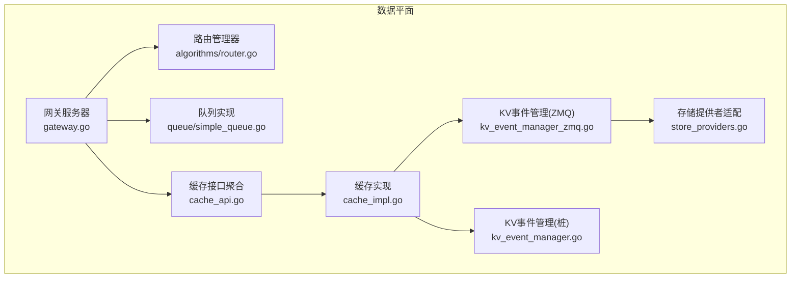
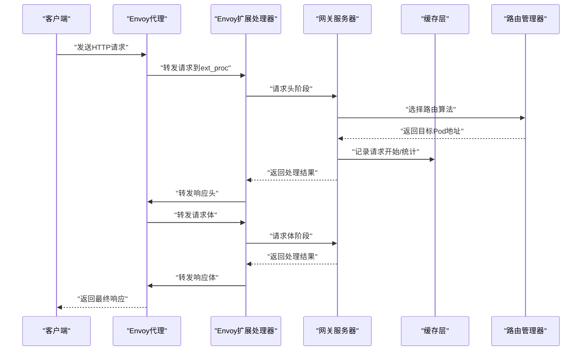
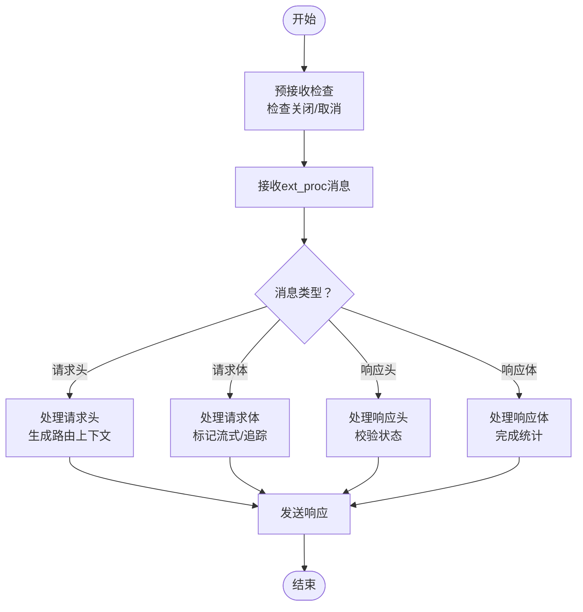
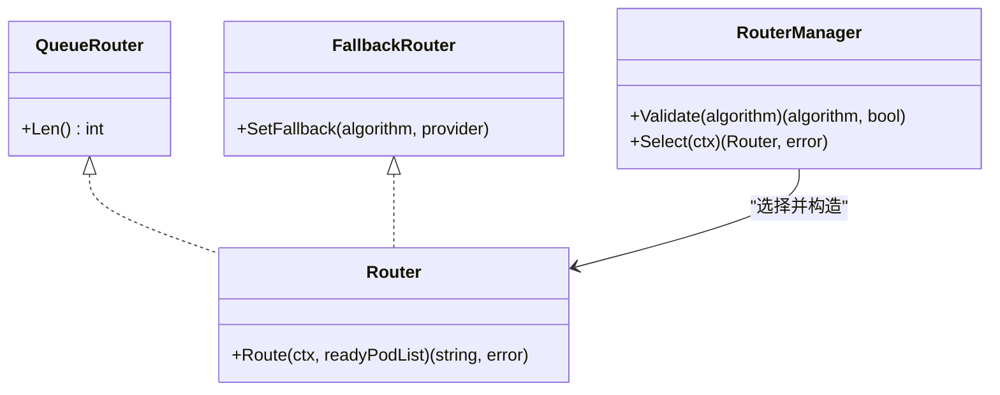
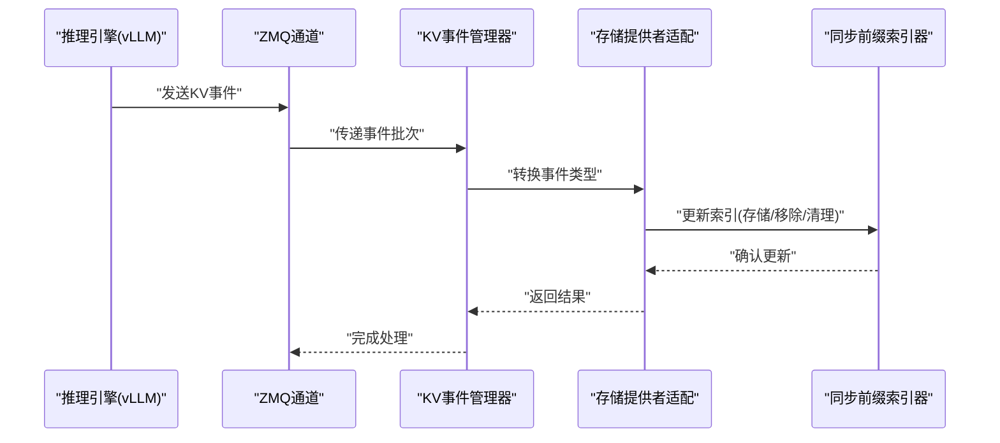
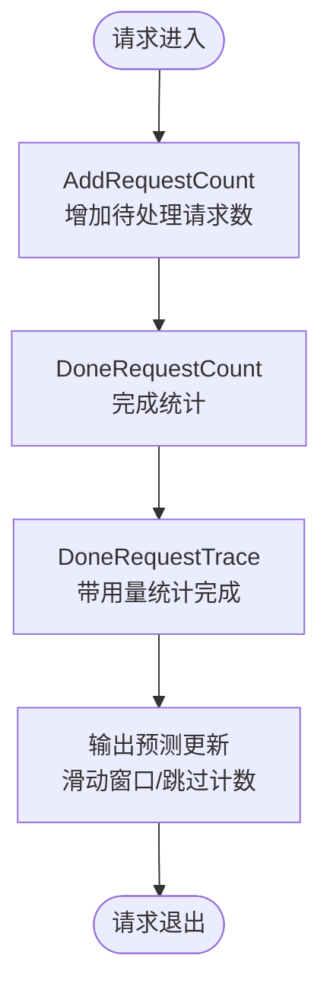
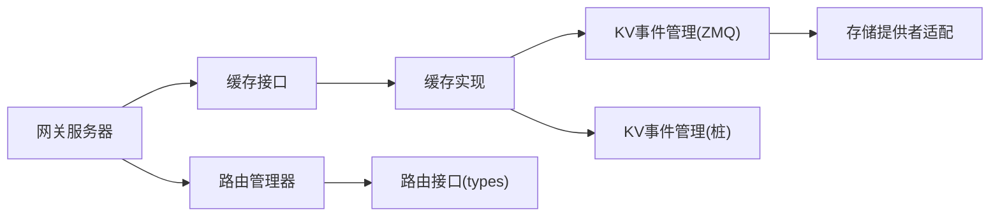

# 数据平面设计

<cite>
**本文引用的文件**
- [pkg/plugins/gateway/gateway.go](file://pkg/plugins/gateway/gateway.go)
- [pkg/plugins/gateway/types.go](file://pkg/plugins/gateway/types.go)
- [pkg/plugins/gateway/algorithms/router.go](file://pkg/plugins/gateway/algorithms/router.go)
- [pkg/plugins/gateway/algorithms/simple_session_affinity.go](file://pkg/plugins/gateway/algorithms/simple_session_affinity.go)
- [pkg/plugins/gateway/queue/simple_queue.go](file://pkg/plugins/gateway/queue/simple_queue.go)
- [pkg/types/router.go](file://pkg/types/router.go)
- [pkg/cache/cache_api.go](file://pkg/cache/cache_api.go)
- [pkg/cache/cache_impl.go](file://pkg/cache/cache_impl.go)
- [pkg/cache/kvcache/event_types.go](file://pkg/cache/kvcache/event_types.go)
- [pkg/cache/kv_event_manager.go](file://pkg/cache/kv_event_manager.go)
- [pkg/cache/kv_event_manager_zmq.go](file://pkg/cache/kv_event_manager_zmq.go)
- [pkg/cache/store_providers.go](file://pkg/cache/store_providers.go)
- [pkg/cache/load_provider.go](file://pkg/cache/load_provider.go)
- [pkg/cache/README.md](file://pkg/cache/README.md)
</cite>

## 目录
1. [简介](#简介)
2. [项目结构](#项目结构)
3. [核心组件](#核心组件)
4. [架构总览](#架构总览)
5. [详细组件分析](#详细组件分析)
6. [依赖分析](#依赖分析)
7. [性能考虑](#性能考虑)
8. [故障排查指南](#故障排查指南)
9. [结论](#结论)
10. [附录](#附录)

## 简介
本文件面向AIBrix数据平面（Data Plane）的设计与实现，聚焦以下目标：
- 路由架构：网关插件系统、请求处理流水线、负载均衡策略
- 缓存系统：事件驱动架构（KV事件同步）、缓存更新机制、内存管理策略
- 性能优化：零拷贝传输、异步处理、批处理机制
- 可视化：请求流程图与缓存同步图，帮助开发者理解数据在系统中的流转

## 项目结构
数据平面主要由“网关插件”和“缓存层”两大子系统构成：
- 网关插件：基于Envoy扩展处理器（ext_proc），实现请求头、请求体、响应头、响应体的分阶段处理；支持多种路由算法与速率限制。
- 缓存层：统一聚合模型、Pod、指标、请求追踪、输出预测等能力，并通过事件驱动机制与KV缓存引擎进行同步。

**图表来源**
- [pkg/plugins/gateway/gateway.go:123-331](file://pkg/plugins/gateway/gateway.go#L123-L331)
- [pkg/plugins/gateway/algorithms/router.go:49-85](file://pkg/plugins/gateway/algorithms/router.go#L49-L85)
- [pkg/plugins/gateway/queue/simple_queue.go:1-218](file://pkg/plugins/gateway/queue/simple_queue.go#L1-L218)
- [pkg/cache/cache_api.go:25-35](file://pkg/cache/cache_api.go#L25-L35)
- [pkg/cache/cache_impl.go:167-286](file://pkg/cache/cache_impl.go#L167-L286)
- [pkg/cache/kv_event_manager_zmq.go:28-77](file://pkg/cache/kv_event_manager_zmq.go#L28-L77)
- [pkg/cache/kv_event_manager.go:28-71](file://pkg/cache/kv_event_manager.go#L28-L71)
- [pkg/cache/store_providers.go:58-201](file://pkg/cache/store_providers.go#L58-L201)

**章节来源**
- [pkg/plugins/gateway/gateway.go:123-331](file://pkg/plugins/gateway/gateway.go#L123-L331)
- [pkg/cache/cache_api.go:25-35](file://pkg/cache/cache_api.go#L25-L35)

## 核心组件
- 网关服务器：负责接收Envoy ext_proc流式消息，按阶段处理请求与响应，执行路由选择与速率限制，并统计指标。
- 路由管理器：注册并选择路由算法（如随机、会话亲和、自定义），支持回退策略与并发安全。
- 队列实现：高性能无锁队列，支持动态扩容与零拷贝写入，用于排队与批处理。
- 缓存接口与实现：统一聚合模型、Pod、指标、请求追踪、输出预测等能力；支持多跟踪器注册与并发安全。
- KV事件管理：在启用ZMQ时，桥接kvevent与缓存索引器，实现KV块存储/移除/清空事件的同步与索引更新。
- 存储提供者适配：在ZMQ构建下，将缓存Store暴露为kvevent所需的PodProvider与SyncIndexProvider。

**章节来源**
- [pkg/plugins/gateway/gateway.go:62-121](file://pkg/plugins/gateway/gateway.go#L62-L121)
- [pkg/plugins/gateway/algorithms/router.go:49-85](file://pkg/plugins/gateway/algorithms/router.go#L49-L85)
- [pkg/plugins/gateway/queue/simple_queue.go:33-218](file://pkg/plugins/gateway/queue/simple_queue.go#L33-L218)
- [pkg/cache/cache_api.go:25-170](file://pkg/cache/cache_api.go#L25-L170)
- [pkg/cache/cache_impl.go:167-355](file://pkg/cache/cache_impl.go#L167-L355)
- [pkg/cache/kv_event_manager_zmq.go:28-77](file://pkg/cache/kv_event_manager_zmq.go#L28-L77)
- [pkg/cache/store_providers.go:58-201](file://pkg/cache/store_providers.go#L58-L201)

## 架构总览
数据平面以“网关插件 + 缓存层”的双层架构协同工作：
- 请求进入Envoy后，由ext_proc调用网关服务器；网关按阶段处理请求头/体、响应头/体，期间进行路由选择、速率限制与指标上报。
- 缓存层提供统一的数据访问与统计能力；当启用ZMQ时，KV事件管理器监听引擎事件，通过适配器更新缓存索引，实现跨Pod的KV缓存同步。

**图表来源**
- [pkg/plugins/gateway/gateway.go:238-303](file://pkg/plugins/gateway/gateway.go#L238-L303)
- [pkg/plugins/gateway/gateway.go:333-360](file://pkg/plugins/gateway/gateway.go#L333-L360)
- [pkg/plugins/gateway/algorithms/router.go:73-85](file://pkg/plugins/gateway/algorithms/router.go#L73-L85)

## 详细组件分析

### 网关插件系统与请求处理流水线
- 流水线阶段
  - 请求头阶段：解析用户信息、速率限制参数、路由上下文，生成路由上下文并注入后续阶段。
  - 请求体阶段：处理流式输入、标记是否为流式响应、记录追踪项。
  - 响应头阶段：校验响应头状态，必要时生成错误响应。
  - 响应体阶段：处理流式响应体，完成请求统计与追踪。
- 并发与错误处理：使用预检查与上下文取消，确保优雅关闭与错误计数；对EOF、Canceled等场景进行分类处理。
- 指标与可观测性：每个阶段均发射指标，支持按模型、状态码、标签维度统计。

**图表来源**
- [pkg/plugins/gateway/gateway.go:140-156](file://pkg/plugins/gateway/gateway.go#L140-L156)
- [pkg/plugins/gateway/gateway.go:238-303](file://pkg/plugins/gateway/gateway.go#L238-L303)

**章节来源**
- [pkg/plugins/gateway/gateway.go:123-331](file://pkg/plugins/gateway/gateway.go#L123-L331)
- [pkg/plugins/gateway/types.go:24-122](file://pkg/plugins/gateway/types.go#L24-L122)

### 路由架构与负载均衡策略
- 路由接口与管理器
  - Router接口定义Route方法，QueueRouter与FallbackRouter扩展了队列查询与回退能力。
  - RouterManager负责算法注册、验证与选择，支持默认回退策略。
- 路由算法示例
  - 会话亲和：基于头部x-session-id进行一致性路由，适合长对话或多阶段请求。
- 负载均衡
  - 在候选Pod中进行就绪过滤与随机洗牌，结合Router实现公平或有倾向的选择。

**图表来源**
- [pkg/types/router.go:19-56](file://pkg/types/router.go#L19-L56)
- [pkg/plugins/gateway/algorithms/router.go:49-85](file://pkg/plugins/gateway/algorithms/router.go#L49-L85)
- [pkg/plugins/gateway/algorithms/simple_session_affinity.go:32-47](file://pkg/plugins/gateway/algorithms/simple_session_affinity.go#L32-L47)

**章节来源**
- [pkg/types/router.go:19-56](file://pkg/types/router.go#L19-L56)
- [pkg/plugins/gateway/algorithms/router.go:49-85](file://pkg/plugins/gateway/algorithms/router.go#L49-L85)
- [pkg/plugins/gateway/algorithms/simple_session_affinity.go:32-47](file://pkg/plugins/gateway/algorithms/simple_session_affinity.go#L32-L47)

### 缓存系统的事件驱动架构
- KV事件类型
  - BlockStored：块被存储，包含块哈希、父块哈希、Token ID列表、块大小等。
  - BlockRemoved：块被移除。
  - AllBlocksCleared：全部块被清理。
  - EventBatch：批量事件，共享时间戳。
- 事件管理器（ZMQ）
  - 在启用ZMQ构建时，KVEventManager委托kvevent.Manager，通过StoreProviderAdapter与SyncIndexProvider桥接缓存与索引器。
  - 配置校验：要求启用KV事件同步需同时满足远程分词器开启、类型为remote、端点已配置。
- 事件同步流程
  - 引擎侧产生事件 → KVEventManager接收 → 适配器转换事件类型 → 同步索引器更新KV缓存索引。

**图表来源**
- [pkg/cache/kvcache/event_types.go:45-178](file://pkg/cache/kvcache/event_types.go#L45-L178)
- [pkg/cache/kv_event_manager_zmq.go:28-77](file://pkg/cache/kv_event_manager_zmq.go#L28-L77)
- [pkg/cache/store_providers.go:58-201](file://pkg/cache/store_providers.go#L58-L201)

**章节来源**
- [pkg/cache/kvcache/event_types.go:45-178](file://pkg/cache/kvcache/event_types.go#L45-L178)
- [pkg/cache/kv_event_manager_zmq.go:41-77](file://pkg/cache/kv_event_manager_zmq.go#L41-L77)
- [pkg/cache/store_providers.go:58-201](file://pkg/cache/store_providers.go#L58-L201)

### 缓存更新机制与内存管理策略
- 更新机制
  - 请求追踪：AddRequestCount/DoneRequestCount/DoneRequestTrace三段式，支持并发安全与追踪项复用。
  - 指标聚合：订阅者模式，统一聚合与上报。
  - 输出预测：基于输入/输出token统计，维护滑动窗口历史，支持移动窗口与跳过计数。
- 内存管理
  - 无锁队列：SimpleQueue采用原子游标与逻辑物理地址映射，按使用比例动态扩容/压缩，减少内存碎片。
  - 并发安全：读写锁、原子计数、通道化事件处理，保障高并发下的稳定性。

**图表来源**
- [pkg/cache/cache_impl.go:167-286](file://pkg/cache/cache_impl.go#L167-L286)
- [pkg/cache/output_predictor.go:90-138](file://pkg/cache/output_predictor.go#L90-L138)
- [pkg/plugins/gateway/queue/simple_queue.go:172-218](file://pkg/plugins/gateway/queue/simple_queue.go#L172-L218)

**章节来源**
- [pkg/cache/cache_api.go:25-170](file://pkg/cache/cache_api.go#L25-L170)
- [pkg/cache/cache_impl.go:167-355](file://pkg/cache/cache_impl.go#L167-L355)
- [pkg/cache/output_predictor.go:90-138](file://pkg/cache/output_predictor.go#L90-L138)
- [pkg/plugins/gateway/queue/simple_queue.go:33-218](file://pkg/plugins/gateway/queue/simple_queue.go#L33-L218)
- [pkg/cache/README.md:155-160](file://pkg/cache/README.md#L155-L160)

### 负载均衡与容量度量
- 负载提供者抽象：LoadProvider/CappedLoadProvider定义利用率与容量上限，CachedLoadProvider从缓存读取指标。
- 与路由结合：在路由决策中可结合利用率与容量，实现更稳健的调度。

**章节来源**
- [pkg/cache/load_provider.go:31-88](file://pkg/cache/load_provider.go#L31-L88)

## 依赖分析
- 组件耦合
  - 网关服务器依赖缓存层（Cache接口）与路由管理器（RouterManager），并通过指标模块进行观测。
  - 缓存实现依赖指标、类型与工具包；在ZMQ构建下依赖kvevent与同步索引器。
- 外部集成
  - Redis用于速率限制（可选）。
  - ZMQ用于KV事件同步（可选构建）。

**图表来源**
- [pkg/plugins/gateway/gateway.go:94-121](file://pkg/plugins/gateway/gateway.go#L94-L121)
- [pkg/types/router.go:19-56](file://pkg/types/router.go#L19-L56)
- [pkg/cache/cache_api.go:25-35](file://pkg/cache/cache_api.go#L25-L35)
- [pkg/cache/kv_event_manager_zmq.go:28-39](file://pkg/cache/kv_event_manager_zmq.go#L28-L39)
- [pkg/cache/store_providers.go:58-152](file://pkg/cache/store_providers.go#L58-L152)

**章节来源**
- [pkg/plugins/gateway/gateway.go:94-121](file://pkg/plugins/gateway/gateway.go#L94-L121)
- [pkg/cache/cache_api.go:25-35](file://pkg/cache/cache_api.go#L25-L35)

## 性能考虑
- 零拷贝与批处理
  - 无锁队列通过逻辑游标与物理数组重排，避免频繁分配与复制，适合高吞吐批处理场景。
  - KV事件批处理（EventBatch）在单批次内共享时间戳，降低序列化与网络开销。
- 异步处理
  - 缓存层通过订阅者模式与原子计数，实现低延迟统计与可观测性。
  - KV事件在ZMQ路径下异步解码与索引更新，避免阻塞主请求链路。
- 资源管理
  - 读写锁与原子操作保证高并发下的数据一致性。
  - 线程安全的测试与基准覆盖，确保在压力下的稳定性。

**章节来源**
- [pkg/plugins/gateway/queue/simple_queue.go:172-218](file://pkg/plugins/gateway/queue/simple_queue.go#L172-L218)
- [pkg/cache/kvcache/event_types.go:164-178](file://pkg/cache/kvcache/event_types.go#L164-L178)
- [pkg/cache/README.md:155-160](file://pkg/cache/README.md#L155-L160)

## 故障排查指南
- 网关错误分类
  - 接收错误：EOF、Canceled、非gRPC错误等，分别映射到不同指标与日志级别。
  - 发送失败：对客户端断开与未知错误进行区分处理，避免重复计数。
- KV事件同步
  - 若未启用ZMQ构建，KV事件管理器为桩实现，会返回明确的错误提示。
  - 启用ZMQ时需检查远程分词器配置与端点设置，否则无法启动事件同步。
- 路由问题
  - 使用Validate确认路由算法是否受支持；不支持时自动回退到随机路由。
  - 会话亲和依赖头部x-session-id，需确保客户端正确设置。

**章节来源**
- [pkg/plugins/gateway/gateway.go:181-236](file://pkg/plugins/gateway/gateway.go#L181-L236)
- [pkg/cache/kv_event_manager.go:47-56](file://pkg/cache/kv_event_manager.go#L47-L56)
- [pkg/cache/kv_event_manager_zmq.go:41-77](file://pkg/cache/kv_event_manager_zmq.go#L41-L77)
- [pkg/plugins/gateway/algorithms/router.go:57-85](file://pkg/plugins/gateway/algorithms/router.go#L57-L85)
- [pkg/plugins/gateway/algorithms/simple_session_affinity.go:32-47](file://pkg/plugins/gateway/algorithms/simple_session_affinity.go#L32-L47)

## 结论
数据平面通过“网关插件 + 缓存层”的清晰分层，实现了高并发、可观测、可扩展的推理服务入口。路由系统支持多样化策略与回退机制；缓存层以事件驱动方式与引擎协同，保障KV缓存的一致性与性能。在构建层面，通过条件编译与适配器模式，既保留了灵活性，又避免了循环依赖与泄漏。

## 附录
- 关键环境变量与头部
  - 路由算法：ROUTING_ALGORITHM
  - 会话亲和头部：x-session-id
  - 模型与部署相关头部：model、target-pod、target-pod-ip等
- 指标与标签
  - 支持按模型、状态码、Pod名称等维度统计请求总量、成功/失败计数与错误类型。

**章节来源**
- [pkg/plugins/gateway/types.go:76-122](file://pkg/plugins/gateway/types.go#L76-L122)